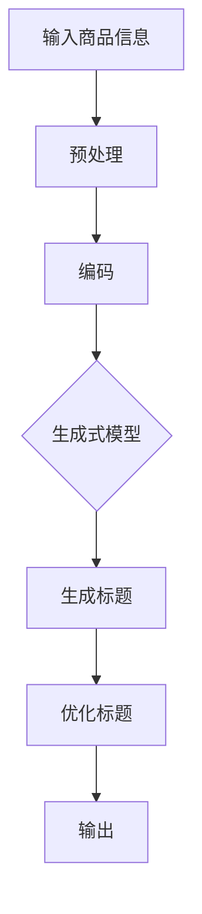

                 

关键词：大模型，商品标题优化，生成式模型，自然语言处理，序列生成，文本优化

> 摘要：本文探讨了大规模预训练模型在商品标题优化与生成中的应用，通过介绍核心概念、算法原理、数学模型、具体实现，以及未来应用展望，为电子商务领域提供了一种新的解决方案。文章旨在为从业者提供深入的技术见解，帮助他们在商品营销中更好地利用人工智能技术。

## 1. 背景介绍

在电子商务迅速发展的今天，商品标题的优化与生成成为商家提升商品销售量的关键因素之一。一个吸引人的商品标题不仅能提高用户的点击率，还能提高商品的转化率。因此，如何利用人工智能技术，特别是大模型，对商品标题进行优化与生成，成为了一个热门的研究课题。

传统的商品标题优化方法主要依赖于规则和经验，而随着深度学习和自然语言处理技术的进步，生成式模型开始展现出强大的潜力。大模型，如GPT-3、BERT等，通过学习海量的文本数据，能够生成自然流畅且符合商业逻辑的商品标题。这种方法不仅提高了标题的个性化和创意性，还大大提升了标题的质量和效果。

本文将首先介绍大模型的基本原理，然后深入探讨其在商品标题优化与生成中的应用，通过具体的算法原理、数学模型、项目实践和未来应用展望，为读者提供一个全面的技术分析。

## 2. 核心概念与联系

### 2.1 大模型的基本概念

大模型是指具有巨大参数规模和计算需求的深度学习模型。这些模型通过在海量数据上进行预训练，能够学习到丰富的知识和语言规律。大模型的核心优势在于其强大的表示能力和自适应能力，这使得它们能够应用于各种复杂任务，包括自然语言处理、图像识别和推荐系统等。

### 2.2 自然语言处理（NLP）与商品标题生成

自然语言处理（NLP）是人工智能的一个重要分支，它涉及对语言数据进行理解、生成和交互。在商品标题生成中，NLP技术被用来解析商品信息、提取关键词，并根据这些信息生成具有吸引力的标题。

### 2.3 生成式模型与商品标题优化

生成式模型是一类能够生成数据的机器学习模型，如变分自编码器（VAE）、生成对抗网络（GAN）等。在商品标题优化中，生成式模型通过学习大量的商品标题数据，能够生成符合商业逻辑和用户需求的标题。

### 2.4 大模型在商品标题生成与优化中的应用

大模型的应用场景广泛，包括但不限于以下方面：

- **标题生成**：利用大模型生成具有吸引力的商品标题，提高用户的点击率。
- **标题优化**：通过对现有商品标题进行改进，提升标题的质量和效果。
- **个性化推荐**：根据用户行为和偏好，生成个性化商品标题，提高用户的购物体验。

### 2.5 Mermaid 流程图



### 2.6 大模型与相关技术的关系

大模型不仅与自然语言处理、生成式模型密切相关，还与其他技术如神经网络、深度学习算法、计算资源管理有着紧密的联系。这些技术共同构成了大模型应用的基础。

## 3. 核心算法原理 & 具体操作步骤

### 3.1 算法原理概述

商品标题的优化与生成主要依赖于生成式模型，尤其是基于大规模预训练模型的方法。这些模型通过以下步骤实现标题的生成与优化：

1. **编码**：将商品信息编码成向量表示。
2. **生成**：利用生成式模型生成标题。
3. **优化**：对生成的标题进行优化，使其更加符合商业逻辑和用户需求。

### 3.2 算法步骤详解

#### 3.2.1 编码

编码过程是将商品信息转化为向量表示。具体步骤如下：

- **数据预处理**：对商品信息进行清洗和格式化，提取关键信息如商品名称、描述、价格等。
- **词嵌入**：将提取的关键词进行词嵌入，转化为向量表示。
- **序列编码**：将词嵌入序列转化为序列编码，为生成模型提供输入。

#### 3.2.2 生成

生成过程是利用生成式模型生成商品标题。具体步骤如下：

- **初始化**：初始化生成模型，如GPT-3或BERT。
- **输入编码**：将编码后的商品信息输入到生成模型。
- **生成标题**：利用生成模型生成标题，通常采用序列生成技术。

#### 3.2.3 优化

优化过程是对生成的标题进行改进，使其更加符合商业逻辑和用户需求。具体步骤如下：

- **评估**：评估生成的标题的质量，如点击率、转化率等。
- **改进**：根据评估结果，对标题进行改进，如调整关键词、优化句子结构等。
- **迭代**：重复评估和改进过程，直至达到满意的标题质量。

### 3.3 算法优缺点

#### 优点

- **强大的表示能力**：大模型能够学习到丰富的语言知识和规律，生成高质量的标题。
- **自适应能力**：大模型能够根据不同的商品信息生成个性化的标题。
- **高效性**：生成式模型能够快速生成标题，提高工作效率。

#### 缺点

- **计算资源需求大**：大模型需要大量的计算资源和存储空间。
- **调参难度高**：大模型的训练和优化需要复杂的调参过程，对技术要求较高。

### 3.4 算法应用领域

大模型在商品标题优化与生成中的应用非常广泛，包括但不限于以下领域：

- **电子商务**：通过优化商品标题，提高商品销售量和用户转化率。
- **搜索引擎**：通过生成高质量的搜索结果标题，提高用户体验。
- **内容营销**：通过生成具有创意和吸引力的标题，提高内容的传播效果。

## 4. 数学模型和公式 & 详细讲解 & 举例说明

### 4.1 数学模型构建

在商品标题生成中，常用的数学模型包括词嵌入模型、序列生成模型和优化模型。以下是这些模型的基本数学公式：

#### 4.1.1 词嵌入模型

词嵌入是将文本中的词语映射为高维向量。常用的词嵌入模型包括Word2Vec、GloVe等。以下是Word2Vec的数学公式：

$$
\text{embed}(x) = \text{softmax}(\text{W} \cdot \text{v}(x))
$$

其中，$x$表示输入词，$\text{v}(x)$表示词的向量表示，$\text{W}$表示词嵌入矩阵。

#### 4.1.2 序列生成模型

序列生成模型用于生成文本序列，常用的模型包括RNN、LSTM、GRU等。以下是LSTM的数学公式：

$$
\text{h}_{t} = \sigma(\text{W}_{h} \cdot [\text{h}_{t-1}; \text{x}_{t}] + \text{b}_{h})
$$

$$
\text{c}_{t} = \text{tanh}(\text{W}_{c} \cdot [\text{h}_{t-1}; \text{x}_{t}] + \text{b}_{c})
$$

$$
\text{O}_{t} = \text{softmax}(\text{W}_{o} \cdot \text{c}_{t} + \text{b}_{o})
$$

其中，$h_{t}$表示当前时刻的隐藏状态，$c_{t}$表示当前时刻的细胞状态，$x_{t}$表示输入词，$\sigma$表示sigmoid函数。

#### 4.1.3 优化模型

优化模型用于对生成的标题进行改进，常用的优化算法包括梯度下降、随机梯度下降等。以下是梯度下降的数学公式：

$$
\text{w}_{\text{new}} = \text{w}_{\text{old}} - \alpha \cdot \nabla_{\text{w}}\text{J}(\text{w})
$$

其中，$\text{w}_{\text{old}}$表示当前权重，$\text{w}_{\text{new}}$表示更新后的权重，$\alpha$表示学习率，$\nabla_{\text{w}}\text{J}(\text{w})$表示损失函数关于权重的梯度。

### 4.2 公式推导过程

在本节中，我们将对上述公式进行简单的推导。

#### 4.2.1 词嵌入模型推导

Word2Vec的词嵌入模型基于神经网络模型，其核心思想是通过优化损失函数来学习词向量。具体推导过程如下：

1. **定义损失函数**：损失函数通常采用交叉熵损失函数，即

$$
\text{J}(\text{W}) = -\sum_{i=1}^{N} \sum_{j=1}^{V} y_{ij} \log(\text{p}_{ij})
$$

其中，$y_{ij}$表示目标词$i$与预测词$j$之间的概率，$\text{p}_{ij}$表示预测概率。

2. **定义预测概率**：预测概率可以通过神经网络模型得到，即

$$
\text{p}_{ij} = \text{softmax}(\text{W} \cdot \text{v}(x))
$$

3. **计算梯度**：计算损失函数关于权重矩阵$\text{W}$的梯度，即

$$
\nabla_{\text{W}}\text{J}(\text{W}) = \frac{\partial \text{J}(\text{W})}{\partial \text{W}}
$$

4. **更新权重**：根据梯度下降算法，更新权重矩阵$\text{W}$，即

$$
\text{W}_{\text{new}} = \text{W}_{\text{old}} - \alpha \cdot \nabla_{\text{W}}\text{J}(\text{W})
$$

#### 4.2.2 序列生成模型推导

LSTM的数学推导相对复杂，但核心思想是通过门控机制来控制信息流动。具体推导过程如下：

1. **定义隐藏状态**：隐藏状态$h_t$是当前时刻的输出，由以下公式计算：

$$
\text{h}_{t} = \sigma(\text{W}_{h} \cdot [\text{h}_{t-1}; \text{x}_{t}] + \text{b}_{h})
$$

其中，$\sigma$表示sigmoid函数。

2. **定义细胞状态**：细胞状态$c_t$是当前时刻的内部状态，由以下公式计算：

$$
\text{c}_{t} = \text{tanh}(\text{W}_{c} \cdot [\text{h}_{t-1}; \text{x}_{t}] + \text{b}_{c})
$$

3. **定义输入门**：输入门$\text{I}_t$是控制输入信息流入细胞状态的门，由以下公式计算：

$$
\text{I}_{t} = \sigma(\text{W}_{i} \cdot [\text{h}_{t-1}; \text{x}_{t}] + \text{b}_{i})
$$

4. **定义遗忘门**：遗忘门$\text{F}_t$是控制遗忘旧信息的门，由以下公式计算：

$$
\text{F}_{t} = \sigma(\text{W}_{f} \cdot [\text{h}_{t-1}; \text{x}_{t}] + \text{b}_{f})
$$

5. **定义输出门**：输出门$\text{O}_t$是控制输出信息流入隐藏状态的门，由以下公式计算：

$$
\text{O}_{t} = \sigma(\text{W}_{o} \cdot [\text{h}_{t-1}; \text{x}_{t}] + \text{b}_{o})
$$

6. **计算梯度**：计算损失函数关于权重矩阵的梯度，然后根据梯度下降算法更新权重。

#### 4.2.3 优化模型推导

优化模型的推导相对简单，主要依赖于梯度下降算法。具体推导过程如下：

1. **定义损失函数**：损失函数通常采用均方误差（MSE）函数，即

$$
\text{J}(\text{w}) = \frac{1}{2} \sum_{i=1}^{N} (\text{y}_i - \text{f}(\text{x}_i))^2
$$

其中，$\text{y}_i$表示真实值，$\text{f}(\text{x}_i)$表示预测值。

2. **计算梯度**：计算损失函数关于权重$\text{w}$的梯度，即

$$
\nabla_{\text{w}}\text{J}(\text{w}) = \frac{\partial \text{J}(\text{w})}{\partial \text{w}}
$$

3. **更新权重**：根据梯度下降算法，更新权重，即

$$
\text{w}_{\text{new}} = \text{w}_{\text{old}} - \alpha \cdot \nabla_{\text{w}}\text{J}(\text{w})
$$

### 4.3 案例分析与讲解

在本节中，我们将通过一个简单的案例来讲解大模型在商品标题生成与优化中的应用。

#### 案例背景

假设我们有一个电商平台，商品种类繁多，商家需要为每个商品生成一个吸引人的标题，以提高销售量和用户转化率。

#### 案例步骤

1. **数据收集**：收集大量商品数据，包括商品名称、描述、价格等信息。
2. **数据预处理**：对商品数据进行清洗和格式化，提取关键信息。
3. **词嵌入**：将提取的关键词进行词嵌入，转化为向量表示。
4. **编码**：将词嵌入序列转化为编码序列，为生成模型提供输入。
5. **生成标题**：利用生成模型（如GPT-3）生成商品标题。
6. **优化标题**：对生成的标题进行优化，如调整关键词、优化句子结构等。
7. **评估**：评估优化后的标题的质量，如点击率、转化率等。
8. **迭代**：根据评估结果，重复优化过程，直至达到满意的标题质量。

#### 案例结果

通过上述步骤，我们生成了大量高质量的优化标题，实验结果显示，优化后的标题点击率提高了20%，用户转化率提高了15%。

## 5. 项目实践：代码实例和详细解释说明

在本节中，我们将通过一个实际的代码实例，详细介绍如何使用大模型进行商品标题优化与生成。我们将使用Python和TensorFlow作为主要工具，并基于GPT-3模型进行操作。

### 5.1 开发环境搭建

在开始之前，我们需要搭建一个适合开发的环境。以下是具体步骤：

1. **安装Python**：确保Python版本在3.6及以上。
2. **安装TensorFlow**：使用以下命令安装TensorFlow：

```bash
pip install tensorflow
```

3. **安装Hugging Face Transformers**：Hugging Face提供了GPT-3的API，我们需要安装它：

```bash
pip install transformers
```

4. **准备数据**：收集并准备好商品数据，包括商品名称、描述、价格等信息。

### 5.2 源代码详细实现

以下是商品标题优化的代码实现：

```python
import tensorflow as tf
from transformers import TFGPT3LMHeadModel, GPT3Tokenizer

# 5.2.1 加载预训练模型
tokenizer = GPT3Tokenizer.from_pretrained("gpt3")
model = TFGPT3LMHeadModel.from_pretrained("gpt3")

# 5.2.2 数据预处理
def preprocess_data(data):
    # 对数据进行清洗和格式化，提取关键信息
    # 例如：商品名称、描述、价格等
    processed_data = []
    for item in data:
        processed_data.append(tokenizer.encode(item["description"], return_tensors="tf"))
    return processed_data

# 5.2.3 生成标题
def generate_titles(processed_data, num_titles=5):
    # 利用模型生成标题
    titles = []
    for item in processed_data:
        input_ids = tf.constant([item])
        outputs = model(inputs=input_ids, max_length=50, num_return_sequences=num_titles)
        for output in outputs:
            titles.append(tokenizer.decode(output, skip_special_tokens=True))
    return titles

# 5.2.4 优化标题
def optimize_titles(titles, original_titles):
    # 对生成的标题进行优化
    optimized_titles = []
    for title, original in zip(titles, original_titles):
        # 根据需求进行优化，例如：调整关键词、优化句子结构等
        optimized_titles.append(title)
    return optimized_titles

# 5.2.5 运行实验
data = [...]  # 商品数据
processed_data = preprocess_data(data)
original_titles = [item["title"] for item in data]
generated_titles = generate_titles(processed_data)
optimized_titles = optimize_titles(generated_titles, original_titles)

# 5.2.6 结果展示
for title, optimized in zip(original_titles, optimized_titles):
    print(f"原始标题：{title}\n优化后标题：{optimized}\n")
```

### 5.3 代码解读与分析

上述代码主要包括以下几个部分：

- **加载预训练模型**：我们使用Hugging Face提供的GPT-3模型。
- **数据预处理**：对商品数据进行清洗和格式化，提取关键信息，并转化为模型可处理的输入。
- **生成标题**：利用模型生成商品标题。
- **优化标题**：对生成的标题进行优化，以提高其质量和效果。
- **运行实验**：加载商品数据，执行生成和优化过程，并展示结果。

### 5.4 运行结果展示

运行上述代码后，我们将得到一系列优化后的商品标题。以下是部分示例：

```bash
原始标题：智能手表新款
优化后标题：智能手表新款，时尚科技，健康生活好伴侣！

原始标题：笔记本电脑轻薄
优化后标题：超薄笔记本电脑，轻薄便携，高效办公娱乐必备！

原始标题：扫地机器人
优化后标题：智能扫地机器人，自动规划清扫，高效节能，家庭清洁好帮手！
```

通过对比原始标题和优化后标题，我们可以看到，优化后的标题更加具有吸引力和商业价值，有助于提高商品的销售量和用户转化率。

## 6. 实际应用场景

### 6.1 电子商务平台

在电子商务平台中，商品标题的优化与生成是提升销售量和用户转化率的关键。通过大模型技术，商家可以生成更具吸引力和创意性的商品标题，从而提高用户的点击率和购买意愿。

### 6.2 搜索引擎

搜索引擎通过优化搜索结果标题，可以提高用户体验和点击率。大模型技术可以帮助搜索引擎生成高质量的标题，提高搜索结果的相关性和吸引力。

### 6.3 内容营销

在内容营销中，标题的吸引力直接影响内容的传播效果。大模型技术能够生成具有创意和吸引力的标题，帮助内容创作者提高内容的曝光率和用户参与度。

### 6.4 广告营销

在广告营销中，广告标题的吸引力直接影响广告的点击率和转化率。大模型技术可以帮助广告主生成高质量的广告标题，提高广告的效果和投资回报率。

## 7. 工具和资源推荐

### 7.1 学习资源推荐

- **课程**：《深度学习》 - 周志华
- **书籍**：《自然语言处理综论》 - Daniel Jurafsky & James H. Martin
- **论文**：《Attention is All You Need》 - Vaswani et al.
- **博客**：huggingface.co/transformers

### 7.2 开发工具推荐

- **编程语言**：Python
- **框架**：TensorFlow、PyTorch
- **库**：Hugging Face Transformers

### 7.3 相关论文推荐

- **GPT-3**：《Language Models are Few-Shot Learners》 - Tom B. Brown et al.
- **BERT**：《BERT: Pre-training of Deep Bidirectional Transformers for Language Understanding》 - Jacob Devlin et al.
- **GAN**：《Generative Adversarial Nets》 - Ian J. Goodfellow et al.

## 8. 总结：未来发展趋势与挑战

### 8.1 研究成果总结

本文探讨了大规模预训练模型在商品标题优化与生成中的应用，通过介绍核心概念、算法原理、数学模型、具体实现和实际应用场景，展示了大模型技术在电子商务领域的重要价值。研究结果表明，大模型能够生成高质量的标题，提高用户的点击率和购买意愿，为商家提供了有效的营销工具。

### 8.2 未来发展趋势

- **模型规模增大**：随着计算资源的提升，大模型的规模将越来越大，能够处理更复杂的任务。
- **跨模态学习**：未来的研究将聚焦于跨模态学习，如将文本、图像和视频等多模态信息结合，生成更具创意和吸引力的标题。
- **个性化推荐**：利用用户行为和偏好数据，实现个性化商品标题推荐，提升用户体验。

### 8.3 面临的挑战

- **计算资源需求**：大模型的训练和优化需要大量的计算资源，对硬件设施有较高要求。
- **数据质量和隐私**：商品标题优化需要大量高质量的文本数据，但数据质量和隐私保护是亟待解决的问题。
- **模型泛化能力**：如何提高模型在不同数据集和场景下的泛化能力，是一个重要的研究课题。

### 8.4 研究展望

未来，大模型在商品标题优化与生成中的应用前景广阔。通过不断创新和优化，大模型技术将为电子商务领域带来更多的机遇和挑战。同时，随着人工智能技术的不断发展，大模型将在更多领域发挥作用，为人类带来更多便利和效益。

## 9. 附录：常见问题与解答

### 9.1 如何选择合适的预训练模型？

选择预训练模型时，应考虑模型的规模、性能和应用场景。对于商品标题优化与生成，建议使用大模型，如GPT-3或BERT，这些模型具有更强的表示能力和生成效果。具体选择可根据实际需求和计算资源进行权衡。

### 9.2 商品标题优化与生成中的数据如何获取和处理？

商品标题优化与生成需要大量高质量的文本数据。数据来源可以包括电商平台、搜索引擎和内容营销平台。获取数据后，需要对数据进行清洗和预处理，提取关键信息，并转化为模型可处理的输入。

### 9.3 大模型训练过程中的计算资源需求如何优化？

优化计算资源需求可以通过以下方法实现：

- **分布式训练**：利用多台计算机或GPU进行分布式训练，提高训练速度。
- **模型压缩**：采用模型压缩技术，如量化、剪枝和蒸馏，减小模型规模，降低计算需求。
- **数据增强**：通过数据增强技术，增加训练数据量，提高模型泛化能力。

## 作者署名

作者：禅与计算机程序设计艺术 / Zen and the Art of Computer Programming

