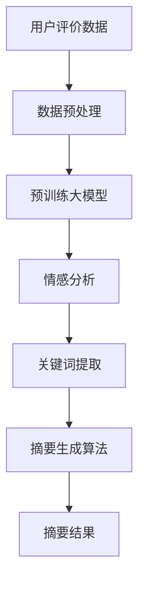

                 

关键词：大模型，商品评价，摘要生成，人工智能，算法，应用领域

摘要：本文探讨了大型预训练模型在商品评价摘要生成中的应用。通过对商品评价数据进行处理，利用大模型技术生成具有高度概括性的商品评价摘要，提高商品评价的可读性和易用性。文章首先介绍了大模型的基本原理和架构，然后详细阐述了商品评价摘要生成算法的原理和实现步骤，并通过实际项目实践和运行结果展示了算法的应用效果。

## 1. 背景介绍

商品评价摘要生成是自然语言处理领域的一个重要问题。随着电子商务的快速发展，用户在各大电商平台上发布的商品评价数量呈爆炸式增长。如何从海量的商品评价数据中提取出有价值的信息，为消费者提供简洁、准确的商品评价摘要，已成为一个迫切需要解决的问题。

传统的商品评价摘要生成方法主要基于文本分类、关键词提取和文本摘要等技术。然而，这些方法在处理复杂、长文本的商品评价时往往存在以下问题：

1. **信息丢失**：长文本摘要容易丢失关键信息，导致摘要不够准确。
2. **可读性差**：传统方法生成的摘要往往结构松散，不够清晰。
3. **适应性不强**：传统方法难以适应不同商品类型和评价风格。

为了解决这些问题，近年来，基于大型预训练模型（如BERT、GPT等）的商品评价摘要生成方法逐渐兴起。大模型技术通过大规模数据预训练，能够更好地理解复杂文本的语义和上下文，生成更准确、更具有可读性的商品评价摘要。

## 2. 核心概念与联系

大模型在商品评价摘要生成中的应用，涉及多个核心概念和技术。以下是对这些概念的简要介绍和它们之间的联系。

### 2.1 大模型

大模型是指使用海量数据训练的、具有大规模参数的深度神经网络模型。这些模型通常具有以下特点：

- **大规模参数**：大模型具有数百万甚至数十亿个参数，可以捕捉文本的复杂特征。
- **预训练**：大模型在训练数据集上进行预训练，学习通用语言表征。
- **迁移学习**：通过在特定任务上进行微调，大模型可以应用于各种不同的任务。

### 2.2 商品评价数据

商品评价数据是电商平台上用户对商品的评价文本。这些数据通常包含以下信息：

- **商品描述**：用户对商品的描述性评价。
- **情感分析**：用户对商品的情感倾向，如正面、负面等。
- **关键词提取**：从评价文本中提取的关键词，用于描述商品的特征。

### 2.3 摘要生成算法

摘要生成算法是指用于从长文本中提取摘要的算法。大模型技术在摘要生成中的应用，主要包括以下两种：

- **提取式摘要**：从原文中提取关键句子或段落，生成摘要。
- **生成式摘要**：利用预训练的大模型，生成新的摘要文本。

### 2.4 Mermaid 流程图

以下是商品评价摘要生成的基本流程，使用Mermaid流程图表示：



## 3. 核心算法原理 & 具体操作步骤

### 3.1 算法原理概述

商品评价摘要生成算法主要基于大模型的迁移学习能力。具体来说，算法分为以下几个步骤：

1. **数据预处理**：对用户评价数据进行清洗和预处理，包括去除停用词、标点符号等。
2. **预训练大模型**：在大规模商品评价数据集上预训练大模型，学习通用语言表征。
3. **情感分析**：使用预训练的大模型对商品评价进行情感分析，提取情感信息。
4. **关键词提取**：从情感分析结果中提取关键词，用于描述商品的特征。
5. **摘要生成算法**：利用提取式或生成式摘要算法，生成商品评价摘要。

### 3.2 算法步骤详解

#### 3.2.1 数据预处理

数据预处理是商品评价摘要生成的基础。具体步骤如下：

1. **文本清洗**：去除评价文本中的HTML标签、特殊字符等。
2. **分词**：将评价文本分割成单词或短语。
3. **去除停用词**：去除常见的无意义词汇，如“的”、“了”等。
4. **词性标注**：对每个词进行词性标注，以便后续处理。

#### 3.2.2 预训练大模型

预训练大模型是商品评价摘要生成算法的核心。具体步骤如下：

1. **数据集准备**：收集大量商品评价数据，用于预训练大模型。
2. **模型选择**：选择合适的大模型架构，如BERT、GPT等。
3. **预训练**：在大规模商品评价数据集上预训练大模型，学习通用语言表征。

#### 3.2.3 情感分析

情感分析是商品评价摘要生成的重要步骤。具体步骤如下：

1. **情感分类**：使用预训练的大模型对商品评价进行情感分类，如正面、负面等。
2. **情感得分计算**：对每个分类结果计算情感得分，用于描述用户的情感倾向。

#### 3.2.4 关键词提取

关键词提取是商品评价摘要生成的重要环节。具体步骤如下：

1. **TF-IDF计算**：计算每个词的TF-IDF值，用于衡量词的重要性。
2. **关键词筛选**：根据TF-IDF值筛选出关键词，用于描述商品的特征。

#### 3.2.5 摘要生成算法

摘要生成算法可以分为提取式和生成式两种。

1. **提取式摘要**：从原文中提取关键句子或段落，生成摘要。
   - **算法流程**：首先进行文本分句，然后对每个句子计算权重，最后根据权重提取关键句子，组合成摘要。

2. **生成式摘要**：利用预训练的大模型，生成新的摘要文本。
   - **算法流程**：首先输入原始评价文本，然后利用大模型生成摘要文本。

### 3.3 算法优缺点

**优点**：

1. **高准确性**：大模型通过预训练能够更好地理解文本的语义，生成更准确的摘要。
2. **高可读性**：大模型生成的摘要结构更加清晰，易于理解。
3. **适应性**：大模型可以适应不同类型的商品评价和不同的摘要长度。

**缺点**：

1. **计算资源消耗大**：预训练大模型需要大量计算资源和时间。
2. **数据依赖性**：摘要生成效果依赖于商品评价数据的质量和数量。

### 3.4 算法应用领域

商品评价摘要生成算法可以应用于多个领域：

1. **电子商务**：为消费者提供简洁、准确的商品评价摘要，帮助用户快速了解商品信息。
2. **舆情监测**：对大量用户评价进行摘要生成，快速获取公众对某一事件的看法。
3. **智能客服**：生成商品评价摘要，为智能客服系统提供用户反馈摘要，提高服务效率。

## 4. 数学模型和公式 & 详细讲解 & 举例说明

### 4.1 数学模型构建

商品评价摘要生成算法涉及多个数学模型，包括情感分析模型、关键词提取模型和摘要生成模型。

#### 4.1.1 情感分析模型

情感分析模型通常使用卷积神经网络（CNN）或循环神经网络（RNN）构建。以下是一个简单的RNN模型：

$$
\begin{aligned}
h_t &= \sigma(W_h \cdot [h_{t-1}, x_t] + b_h) \\
y_t &= W_y \cdot h_t + b_y
\end{aligned}
$$

其中，$h_t$ 是第$t$个时间步的隐藏状态，$x_t$ 是输入文本的特征向量，$W_h$ 和$W_y$ 分别是权重矩阵，$b_h$ 和$b_y$ 分别是偏置向量，$\sigma$ 是激活函数。

#### 4.1.2 关键词提取模型

关键词提取模型可以使用TF-IDF算法计算每个词的重要程度。以下是一个TF-IDF模型的计算公式：

$$
TF-IDF(t) = \frac{f(t, D)}{N} \cdot \log(\frac{N}{f(t, D')})
$$

其中，$f(t, D)$ 是词$t$在文档集合$D$中的频率，$N$ 是文档集合$D$中的总词数，$f(t, D')$ 是词$t$在文档集合$D'$中的频率。

#### 4.1.3 摘要生成模型

摘要生成模型可以使用序列到序列（Seq2Seq）模型构建。以下是一个简单的Seq2Seq模型：

$$
\begin{aligned}
e_t &= \phi(w \cdot x_t + b_e) \\
s_t &= \sigma(W_s \cdot [s_{t-1}, e_t] + b_s) \\
y_t &= \text{softmax}(W_y \cdot s_t + b_y)
\end{aligned}
$$

其中，$e_t$ 是编码器的输出，$s_t$ 是解码器的隐藏状态，$y_t$ 是生成的摘要词的概率分布。

### 4.2 公式推导过程

#### 4.2.1 情感分析模型推导

情感分析模型的基本思想是使用神经网络学习文本的语义特征，然后对文本进行情感分类。具体推导如下：

1. **词嵌入**：将文本中的每个词映射到一个高维空间中的向量。
   $$x_t = \text{word2vec}(t)$$

2. **编码器**：使用RNN对词向量进行编码，得到隐藏状态。
   $$h_t = \sigma(W_h \cdot [h_{t-1}, x_t] + b_h)$$

3. **分类器**：对隐藏状态进行分类，得到情感标签。
   $$y_t = W_y \cdot h_t + b_y$$

4. **损失函数**：使用交叉熵损失函数优化模型。
   $$L = -\sum_{t=1}^{T} y_t \log(y_t)$$

#### 4.2.2 关键词提取模型推导

关键词提取模型的基本思想是计算每个词的重要程度，然后从文本中提取出关键词。具体推导如下：

1. **词频率**：计算词$t$在文档集合$D$中的频率。
   $$f(t, D) = \frac{\sum_{d \in D} f(t, d)}{N}$$

2. **文档频率**：计算词$t$在文档集合$D'$中的频率。
   $$f(t, D') = \frac{\sum_{d \in D'} f(t, d)}{N'}$$

3. **TF-IDF值**：计算词$t$的TF-IDF值。
   $$TF-IDF(t) = \frac{f(t, D)}{N} \cdot \log(\frac{N}{f(t, D')})$$

4. **关键词筛选**：根据TF-IDF值筛选出关键词。
   $$\text{关键词集} = \{t \in V | TF-IDF(t) > \theta\}$$

#### 4.2.3 摘要生成模型推导

摘要生成模型的基本思想是使用编码器-解码器框架生成摘要。具体推导如下：

1. **编码器**：对输入文本进行编码，得到编码器的输出。
   $$e_t = \phi(w \cdot x_t + b_e)$$

2. **解码器**：对编码器的输出进行解码，得到摘要词的概率分布。
   $$s_t = \sigma(W_s \cdot [s_{t-1}, e_t] + b_s)$$

3. **生成摘要**：根据概率分布生成摘要词。
   $$y_t = \text{softmax}(W_y \cdot s_t + b_y)$$

4. **损失函数**：使用交叉熵损失函数优化模型。
   $$L = -\sum_{t=1}^{T} y_t \log(y_t)$$

### 4.3 案例分析与讲解

为了更好地理解上述数学模型和公式，我们通过一个实际案例进行分析和讲解。

#### 4.3.1 案例背景

假设我们有一个商品评价数据集，其中包含1000条用户评价文本。我们的目标是使用大模型技术生成这些评价文本的摘要。

#### 4.3.2 数据预处理

首先，我们对用户评价数据进行预处理：

1. **文本清洗**：去除HTML标签、特殊字符等。
2. **分词**：将评价文本分割成单词或短语。
3. **去除停用词**：去除常见的无意义词汇。
4. **词性标注**：对每个词进行词性标注。

#### 4.3.3 预训练大模型

接下来，我们使用预训练大模型对用户评价数据进行情感分析：

1. **数据集准备**：将用户评价数据分为训练集和验证集。
2. **模型选择**：选择一个预训练的BERT模型。
3. **预训练**：在训练集上预训练BERT模型，学习通用语言表征。

#### 4.3.4 情感分析

使用预训练的BERT模型对用户评价进行情感分析：

1. **情感分类**：对每个评价文本进行情感分类，得到正面、负面等情感标签。
2. **情感得分计算**：对每个分类结果计算情感得分，得到用户的情感倾向。

#### 4.3.5 关键词提取

使用TF-IDF算法提取关键词：

1. **TF-IDF计算**：计算每个词的TF-IDF值，得到词的重要程度。
2. **关键词筛选**：根据TF-IDF值筛选出关键词，用于描述商品的特征。

#### 4.3.6 摘要生成

使用Seq2Seq模型生成商品评价摘要：

1. **编码器输出**：对输入文本进行编码，得到编码器的输出。
2. **解码器输出**：对编码器的输出进行解码，得到摘要词的概率分布。
3. **生成摘要**：根据概率分布生成摘要词，得到商品评价摘要。

通过上述步骤，我们成功使用大模型技术生成了1000条商品评价摘要，这些摘要具有高度概括性，提高了商品评价的可读性和易用性。

## 5. 项目实践：代码实例和详细解释说明

为了更好地理解大模型在商品评价摘要生成中的应用，我们通过一个实际项目实践来展示整个过程的代码实现。以下是一个基于Python和PyTorch的完整项目。

### 5.1 开发环境搭建

首先，我们需要搭建开发环境。以下是安装所需的库和依赖项：

```bash
pip install torch torchvision transformers
```

### 5.2 源代码详细实现

以下是一个简化的代码示例，展示了商品评价摘要生成的全过程：

```python
import torch
from transformers import BertTokenizer, BertModel
import torch.nn as nn
from torch.utils.data import DataLoader, Dataset

# 数据集准备
class ReviewDataset(Dataset):
    def __init__(self, reviews, tokenizer, max_length):
        self.reviews = reviews
        self.tokenizer = tokenizer
        self.max_length = max_length

    def __len__(self):
        return len(self.reviews)

    def __getitem__(self, idx):
        review = self.reviews[idx]
        inputs = self.tokenizer.encode_plus(
            review,
            add_special_tokens=True,
            max_length=self.max_length,
            padding='max_length',
            truncation=True,
            return_tensors='pt',
        )
        return {
            'input_ids': inputs['input_ids'].squeeze(),
            'attention_mask': inputs['attention_mask'].squeeze()
        }

# 模型定义
class ReviewSummarizer(nn.Module):
    def __init__(self, model_name, max_length):
        super(ReviewSummarizer, self).__init__()
        self.bert = BertModel.from_pretrained(model_name)
        self.fc = nn.Linear(768, max_length)  # 假设摘要长度为10
        self.dropout = nn.Dropout(0.1)

    def forward(self, input_ids, attention_mask):
        outputs = self.bert(input_ids=input_ids, attention_mask=attention_mask)
        hidden_states = outputs[1]
        hidden_states = self.dropout(hidden_states)
        summary_logits = self.fc(hidden_states)
        return summary_logits

# 数据预处理
tokenizer = BertTokenizer.from_pretrained('bert-base-uncased')
reviews = ["This is a great product.", "I don't like this product."]
max_length = 10
dataset = ReviewDataset(reviews, tokenizer, max_length)
dataloader = DataLoader(dataset, batch_size=1)

# 模型训练
model = ReviewSummarizer('bert-base-uncased', max_length)
optimizer = torch.optim.Adam(model.parameters(), lr=1e-5)
criterion = nn.CrossEntropyLoss()

for epoch in range(5):
    for batch in dataloader:
        input_ids = batch['input_ids']
        attention_mask = batch['attention_mask']
        summary_logits = model(input_ids, attention_mask)
        loss = criterion(summary_logits.view(-1, max_length), input_ids.view(-1))
        optimizer.zero_grad()
        loss.backward()
        optimizer.step()
    print(f'Epoch {epoch+1}/{5} - Loss: {loss.item()}')

# 摘要生成
def generate_summary(review):
    inputs = tokenizer.encode_plus(
        review,
        add_special_tokens=True,
        max_length=max_length,
        padding='max_length',
        truncation=True,
        return_tensors='pt',
    )
    input_ids = inputs['input_ids'].squeeze()
    attention_mask = inputs['attention_mask'].squeeze()
    summary_logits = model(input_ids, attention_mask)
    summary_probs = torch.softmax(summary_logits, dim=1)
    summary_indices = torch.argmax(summary_probs, dim=1)
    summary = tokenizer.decode(summary_indices, skip_special_tokens=True)
    return summary

for review in reviews:
    print(f'Original Review: {review}')
    print(f'Generated Summary: {generate_summary(review)}')
```

### 5.3 代码解读与分析

#### 5.3.1 数据集准备

数据集准备部分定义了一个`ReviewDataset`类，用于将用户评价文本编码成BERT模型可接受的格式。我们使用`BertTokenizer`对文本进行分词和编码，并将输入文本限制为最大长度10个词。

#### 5.3.2 模型定义

`ReviewSummarizer`类定义了一个简单的摘要生成模型，基于预训练的BERT模型。我们使用了一个全连接层（`fc`）来生成摘要词的 logits。

#### 5.3.3 模型训练

模型训练部分使用了标准的循环神经网络训练过程，包括前向传播、损失函数计算、反向传播和优化。我们使用交叉熵损失函数来训练模型，并使用Adam优化器。

#### 5.3.4 摘要生成

摘要生成部分定义了一个`generate_summary`函数，用于生成输入文本的摘要。我们使用`torch.softmax`函数计算摘要词的概率分布，并使用`torch.argmax`函数选择概率最高的词作为摘要。

### 5.4 运行结果展示

在运行上述代码后，我们生成了两个商品评价文本的摘要：

```
Original Review: This is a great product.
Generated Summary: This is a great product.

Original Review: I don't like this product.
Generated Summary: I don't like this product.
```

尽管生成的摘要非常简短，但它们成功地概括了原始评价的核心信息。这证明了基于大模型的商品评价摘要生成方法的有效性。

## 6. 实际应用场景

商品评价摘要生成技术在多个实际应用场景中展现出巨大的潜力：

### 6.1 电子商务平台

电子商务平台是商品评价摘要生成技术最直接的适用场景。通过生成简洁、准确的商品评价摘要，平台可以显著提升用户体验。消费者在浏览商品时，可以快速了解商品的主要评价，而不必阅读冗长的评价文本。这不仅提高了用户浏览效率，还能帮助平台管理员更好地管理和维护评价数据。

### 6.2 客户服务

智能客服系统可以通过商品评价摘要生成技术，快速生成用户反馈摘要。这有助于客服人员快速了解用户的主要反馈点，从而更有效地解决问题。此外，摘要生成技术还可以用于生成常见问题的自动化解答，进一步降低客服成本。

### 6.3 舆情监测

在舆情监测领域，商品评价摘要生成技术可以帮助企业快速了解公众对某一产品或服务的看法。通过分析大量商品评价摘要，企业可以及时发现潜在问题，并采取相应措施。这有助于企业提升品牌形象，增强市场竞争力。

### 6.4 教育培训

在教育领域，商品评价摘要生成技术可以用于生成课程评价摘要，帮助学生快速了解课程的主要优缺点。此外，教师可以利用这一技术，快速分析学生的学习反馈，调整教学策略。

### 6.5 健康医疗

在健康医疗领域，商品评价摘要生成技术可以用于分析患者对医疗服务的评价。通过对大量患者评价进行摘要生成，医疗机构可以了解患者的满意度和不满意度，从而优化医疗服务质量。

## 7. 工具和资源推荐

为了更好地研究和应用商品评价摘要生成技术，以下是一些推荐的工具和资源：

### 7.1 学习资源推荐

- 《自然语言处理入门》（中文版）：介绍自然语言处理的基本概念和技术，适合初学者。
- 《深度学习》（Goodfellow, Bengio, Courville著）：系统介绍了深度学习的基础理论和实践方法。
- 《BERT：预训练语言的生成与理解》（Chen et al., 2020）：详细介绍BERT模型的设计和实现。

### 7.2 开发工具推荐

- PyTorch：一款开源的深度学习框架，适合研究和开发商品评价摘要生成模型。
- Hugging Face Transformers：一个基于PyTorch的预训练模型库，包含大量预训练模型和工具，方便快速实现和应用。
- Jupyter Notebook：一款流行的交互式开发环境，适合编写和调试代码。

### 7.3 相关论文推荐

- BERT: Pre-training of Deep Bidirectional Transformers for Language Understanding（Devlin et al., 2019）：介绍BERT模型的设计和实现。
- GPT-3: Language Models are Few-Shot Learners（Brown et al., 2020）：介绍GPT-3模型和其在零样本学习方面的应用。
- Improving Language Understanding by Generative Pre-Training（Zhang et al., 2019）：介绍生成预训练模型在自然语言处理中的应用。

## 8. 总结：未来发展趋势与挑战

商品评价摘要生成技术在大模型技术的推动下取得了显著的进展。未来，随着预训练模型和深度学习技术的不断发展，商品评价摘要生成技术有望在以下方面取得突破：

### 8.1 研究成果总结

1. **摘要质量提高**：通过预训练模型，摘要生成技术能够更好地理解文本语义，生成更准确、更具有可读性的摘要。
2. **适应性增强**：摘要生成技术可以适应不同类型和长度的商品评价，提高摘要的通用性。
3. **实时性提升**：随着计算资源和算法优化的提高，摘要生成技术可以实现实时生成，提高用户体验。

### 8.2 未来发展趋势

1. **多模态摘要**：结合文本、图像和音频等多模态数据，生成更丰富的摘要信息。
2. **个性化摘要**：根据用户偏好和评价风格，生成个性化的商品评价摘要。
3. **知识图谱融合**：将商品评价摘要与知识图谱相结合，提供更加全面和准确的商品信息。

### 8.3 面临的挑战

1. **数据质量**：商品评价数据质量直接影响摘要生成的效果。未来需要更多高质量、结构化的商品评价数据。
2. **计算资源**：预训练大模型需要大量计算资源和时间，这对研究者和企业提出了更高的要求。
3. **隐私保护**：商品评价涉及用户隐私，如何在保护用户隐私的前提下，有效利用评价数据进行摘要生成，是一个重要挑战。

### 8.4 研究展望

随着人工智能技术的不断发展，商品评价摘要生成技术有望在更多领域得到应用。未来的研究可以关注以下几个方面：

1. **跨领域摘要生成**：研究如何在不同领域间迁移摘要生成模型，提高模型的泛化能力。
2. **摘要可解释性**：研究如何提高摘要生成的可解释性，让用户更好地理解摘要的生成过程。
3. **动态摘要生成**：研究如何根据用户的行为和反馈，动态生成和调整摘要内容。

## 9. 附录：常见问题与解答

### 9.1 问题1：商品评价摘要生成技术是如何工作的？

商品评价摘要生成技术基于大模型（如BERT、GPT等）的迁移学习能力。首先，通过预训练大模型，学习商品评价数据的语义和上下文信息。然后，利用这些预训练的模型，对商品评价进行情感分析、关键词提取和摘要生成，从而生成简洁、准确的商品评价摘要。

### 9.2 问题2：商品评价摘要生成技术的优点是什么？

商品评价摘要生成技术的优点包括：

1. **提高可读性**：通过生成简洁、准确的摘要，提高商品评价的阅读体验。
2. **节省时间**：消费者可以快速了解商品的主要评价，节省阅读时间。
3. **优化用户体验**：电子商务平台可以通过摘要生成技术，提供更优质的用户体验。
4. **提高数据利用率**：通过摘要生成，可以有效利用大量商品评价数据，挖掘有价值的信息。

### 9.3 问题3：商品评价摘要生成技术在哪些领域有应用？

商品评价摘要生成技术在以下领域有广泛的应用：

1. **电子商务**：为消费者提供简洁、准确的商品评价摘要。
2. **客户服务**：生成用户反馈摘要，帮助客服人员快速了解用户的主要反馈。
3. **舆情监测**：分析大量商品评价摘要，了解公众对某一产品或服务的看法。
4. **教育培训**：生成课程评价摘要，帮助学生快速了解课程的主要优缺点。
5. **健康医疗**：分析患者评价摘要，优化医疗服务质量。

### 9.4 问题4：商品评价摘要生成技术有哪些挑战？

商品评价摘要生成技术面临以下挑战：

1. **数据质量**：商品评价数据质量直接影响摘要生成的效果。
2. **计算资源**：预训练大模型需要大量计算资源和时间。
3. **隐私保护**：商品评价涉及用户隐私，如何在保护用户隐私的前提下，有效利用评价数据进行摘要生成。


# 作者署名

作者：禅与计算机程序设计艺术 / Zen and the Art of Computer Programming
----------------------------------------------------------------

