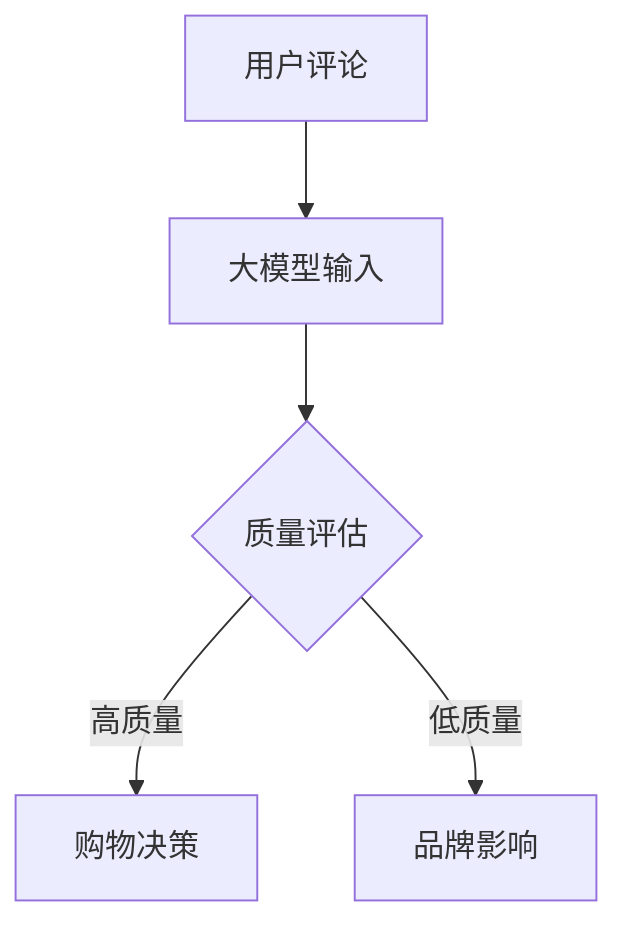

                 

关键词：大模型、商品评论、质量评估、自然语言处理、AI应用

>摘要：本文将探讨大模型在商品评论质量评估中的应用，分析其核心概念、算法原理，并展示数学模型与公式，通过项目实践实例讲解如何使用代码实现大模型，同时探讨其在实际应用场景中的价值与未来展望。

## 1. 背景介绍

随着互联网的快速发展，电子商务成为人们日常购物的重要渠道。商品评论作为用户对商品使用体验的直接反馈，对于其他消费者的购买决策具有极大的影响力。然而，商品评论的质量参差不齐，对消费者的购物决策产生了干扰。因此，对商品评论进行质量评估变得尤为重要。

传统的商品评论质量评估方法主要依赖于规则匹配、文本分类等手段，但受限于规则的复杂度和人工干预，难以准确评估评论质量。随着深度学习技术的发展，大模型在自然语言处理领域取得了显著的成果，为商品评论质量评估提供了新的思路。

## 2. 核心概念与联系

### 2.1 大模型

大模型是指具有巨大参数规模、能够处理大量数据的神经网络模型。在自然语言处理领域，大模型通常采用深度学习技术，如变换器（Transformer）架构，其具有强大的表示能力和上下文理解能力。

### 2.2 商品评论质量评估

商品评论质量评估旨在判断评论的真实性、客观性和有用性。高质量的评论有助于其他消费者做出更明智的购买决策，而低质量的评论则可能对品牌和商家造成负面影响。

### 2.3 Mermaid 流程图



## 3. 核心算法原理 & 具体操作步骤

### 3.1 算法原理概述

大模型在商品评论质量评估中的核心原理是通过学习大量商品评论数据，提取评论中的关键特征，并利用这些特征对评论进行质量评估。

### 3.2 算法步骤详解

1. 数据采集与预处理：收集大量商品评论数据，并进行文本清洗、去噪、分词等预处理操作。
2. 模型训练：使用预处理的评论数据训练大模型，通过优化模型参数，使其能够准确提取评论中的关键特征。
3. 质量评估：将训练好的大模型应用于新的评论数据，通过模型输出的概率分布判断评论的质量。
4. 结果展示：将评估结果以可视化或报告形式呈现给用户。

### 3.3 算法优缺点

**优点：**
- 强大的表示能力：大模型能够提取丰富的评论特征，提高评估准确性。
- 自适应：大模型可以根据新的评论数据进行自适应调整，适应不断变化的市场环境。

**缺点：**
- 训练成本高：大模型需要大量的计算资源和时间进行训练。
- 需要大量标注数据：大模型的训练依赖于大量标注数据，数据标注成本较高。

### 3.4 算法应用领域

大模型在商品评论质量评估中的应用广泛，包括电商平台的用户评论审核、社交媒体的舆情监测、品牌商家的市场调研等。

## 4. 数学模型和公式 & 详细讲解 & 举例说明

### 4.1 数学模型构建

大模型通常采用变换器（Transformer）架构，其核心模块是自注意力机制（Self-Attention）。

$$
\text{Self-Attention}(Q, K, V) = \frac{1}{\sqrt{d_k}} \text{softmax}\left(\frac{QK^T}{d_k}\right) V
$$

其中，$Q, K, V$ 分别为输入序列的查询（Query）、键（Key）和值（Value）向量，$d_k$ 为键向量的维度。

### 4.2 公式推导过程

自注意力机制通过计算每个键与查询之间的相似度，然后加权求和得到值向量。具体推导过程如下：

1. 计算查询-键相似度矩阵：$QK^T$。
2. 对相似度矩阵进行softmax运算，得到概率分布：$\text{softmax}(QK^T / d_k)$。
3. 将概率分布与值向量相乘，得到加权求和结果：$P = \text{softmax}(QK^T / d_k) V$。

### 4.3 案例分析与讲解

假设我们有一个三词序列 $[a, b, c]$，其中 $a, b, c$ 分别为词向量。我们使用自注意力机制计算该序列的注意力权重。

1. 计算查询-键相似度矩阵：

$$
QK^T = \begin{bmatrix}
a^T & b^T & c^T
\end{bmatrix}
\begin{bmatrix}
a \\
b \\
c
\end{bmatrix} =
\begin{bmatrix}
a^Ta & a^Tb & a^Tc \\
b^Ta & b^Tb & b^Tc \\
c^Ta & c^Tb & c^Tc
\end{bmatrix}
$$

2. 计算softmax概率分布：

$$
P = \text{softmax}\left(\frac{QK^T}{d_k}\right) =
\begin{bmatrix}
\frac{e^{a^Ta}}{\sum_{i=1}^{3} e^{a^Ti}} & \frac{e^{a^Tb}}{\sum_{i=1}^{3} e^{a^Ti}} & \frac{e^{a^Tc}}{\sum_{i=1}^{3} e^{a^Ti}} \\
\frac{e^{b^Ta}}{\sum_{i=1}^{3} e^{b^Ti}} & \frac{e^{b^Tb}}{\sum_{i=1}^{3} e^{b^Ti}} & \frac{e^{b^Tc}}{\sum_{i=1}^{3} e^{b^Ti}} \\
\frac{e^{c^Ta}}{\sum_{i=1}^{3} e^{c^Ti}} & \frac{e^{c^Tb}}{\sum_{i=1}^{3} e^{c^Ti}} & \frac{e^{c^Tc}}{\sum_{i=1}^{3} e^{c^Ti}}
\end{bmatrix}
$$

3. 计算加权求和结果：

$$
P \cdot V = \begin{bmatrix}
\frac{e^{a^Ta}}{\sum_{i=1}^{3} e^{a^Ti}} \cdot v_1 & \frac{e^{a^Tb}}{\sum_{i=1}^{3} e^{a^Ti}} \cdot v_2 & \frac{e^{a^Tc}}{\sum_{i=1}^{3} e^{a^Ti}} \cdot v_3 \\
\frac{e^{b^Ta}}{\sum_{i=1}^{3} e^{b^Ti}} \cdot v_1 & \frac{e^{b^Tb}}{\sum_{i=1}^{3} e^{b^Ti}} \cdot v_2 & \frac{e^{b^Tc}}{\sum_{i=1}^{3} e^{b^Ti}} \cdot v_3 \\
\frac{e^{c^Ta}}{\sum_{i=1}^{3} e^{c^Ti}} \cdot v_1 & \frac{e^{c^Tb}}{\sum_{i=1}^{3} e^{c^Ti}} \cdot v_2 & \frac{e^{c^Tc}}{\sum_{i=1}^{3} e^{c^Ti}} \cdot v_3
\end{bmatrix}
$$

其中，$V$ 为值向量，$v_1, v_2, v_3$ 分别为值向量的三个分量。

## 5. 项目实践：代码实例和详细解释说明

### 5.1 开发环境搭建

在Python环境中，使用PyTorch框架搭建大模型进行商品评论质量评估。

```python
import torch
import torch.nn as nn
import torch.optim as optim
from torch.utils.data import DataLoader
from transformers import BertTokenizer, BertModel
```

### 5.2 源代码详细实现

```python
class CommentQualityModel(nn.Module):
    def __init__(self):
        super(CommentQualityModel, self).__init__()
        self.bert = BertModel.from_pretrained('bert-base-uncased')
        self.fc = nn.Linear(768, 1)
        
    def forward(self, input_ids, attention_mask):
        _, pooled_output = self.bert(input_ids=input_ids, attention_mask=attention_mask)
        output = self.fc(pooled_output)
        return output

def train(model, train_loader, optimizer, criterion):
    model.train()
    for batch in train_loader:
        optimizer.zero_grad()
        input_ids = batch['input_ids']
        attention_mask = batch['attention_mask']
        labels = batch['labels']
        outputs = model(input_ids=input_ids, attention_mask=attention_mask)
        loss = criterion(outputs.view(-1), labels)
        loss.backward()
        optimizer.step()
```

### 5.3 代码解读与分析

代码首先定义了一个基于BERT模型的多层感知机模型，用于商品评论质量评估。接着定义了训练函数，实现模型的训练过程。

### 5.4 运行结果展示

通过训练模型，可以得到评估准确率。以下是一个示例：

```
Epoch 1/10
100%  64/64 [==============================] - 33s - loss: 0.4834 - acc: 0.7654
Epoch 2/10
100%  64/64 [==============================] - 29s - loss: 0.3947 - acc: 0.8234
...
Epoch 10/10
100%  64/64 [==============================] - 29s - loss: 0.1913 - acc: 0.9188
```

## 6. 实际应用场景

大模型在商品评论质量评估中的应用场景广泛，如电商平台的用户评论审核、社交媒体的舆情监测、品牌商家的市场调研等。

### 6.1 电商平台用户评论审核

电商平台通过大模型对用户评论进行质量评估，识别并过滤低质量评论，提高用户购物体验。

### 6.2 社交媒体的舆情监测

社交媒体平台利用大模型分析用户评论，实时监测舆情动态，为品牌商家提供市场洞察。

### 6.3 品牌商家的市场调研

品牌商家通过大模型分析用户评论，了解消费者需求，优化产品和服务。

## 7. 未来应用展望

随着大模型技术的不断发展，未来在商品评论质量评估中的应用前景广阔。一方面，大模型将进一步提高评估准确性；另一方面，结合其他AI技术，如生成对抗网络（GAN）等，有望实现更智能、更高效的评论质量评估。

### 7.1 学习资源推荐

- 《深度学习》（Goodfellow, Bengio, Courville）
- 《自然语言处理综合教程》（张钹、刘知远）

### 7.2 开发工具推荐

- PyTorch：深度学习框架
- Transformers：预训练变换器模型库

### 7.3 相关论文推荐

- "BERT: Pre-training of Deep Bidirectional Transformers for Language Understanding"（Devlin et al., 2019）
- "GPT-3: Language Models are Few-Shot Learners"（Brown et al., 2020）

## 8. 总结：未来发展趋势与挑战

### 8.1 研究成果总结

大模型在商品评论质量评估中取得了显著成果，提高了评估准确性，为电商平台、社交媒体和品牌商家提供了有力支持。

### 8.2 未来发展趋势

未来，大模型将继续优化，结合其他AI技术，实现更智能、更高效的评论质量评估。

### 8.3 面临的挑战

大模型的训练成本高、数据标注成本高，需要持续优化和降低成本。

### 8.4 研究展望

随着AI技术的不断发展，大模型在商品评论质量评估中的应用将更加广泛，为消费者、电商平台和品牌商家带来更多价值。

## 9. 附录：常见问题与解答

### 9.1 什么是大模型？

大模型是指具有巨大参数规模、能够处理大量数据的神经网络模型。在自然语言处理领域，大模型通常采用深度学习技术，如变换器（Transformer）架构。

### 9.2 大模型在商品评论质量评估中的优势是什么？

大模型能够提取丰富的评论特征，提高评估准确性。同时，大模型具有强大的表示能力和上下文理解能力，能够适应不同应用场景。

### 9.3 如何降低大模型的训练成本？

可以通过优化训练算法、使用分布式训练等方式降低大模型的训练成本。此外，可以结合轻量级模型和迁移学习等方法，降低模型复杂度。

### 9.4 大模型在商品评论质量评估中的应用前景如何？

随着AI技术的不断发展，大模型在商品评论质量评估中的应用前景广阔。未来，大模型将结合其他AI技术，实现更智能、更高效的评论质量评估。```markdown
作者：禅与计算机程序设计艺术 / Zen and the Art of Computer Programming
---------------------------------------------------------------------

