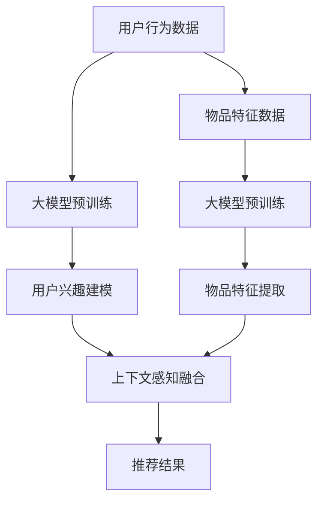

                 

随着互联网的快速发展，推荐系统已成为提高用户体验、增加用户粘性的重要手段。然而，传统的推荐系统在处理上下文信息方面存在一定的局限性，难以满足用户个性化需求。本文旨在探讨如何利用大模型来增强推荐系统的上下文感知能力，从而提升推荐质量。

> **关键词**：大模型，推荐系统，上下文感知，个性化推荐

> **摘要**：本文首先介绍了推荐系统的发展历程和上下文感知的重要性，随后详细阐述了大模型在推荐系统中的应用，最后通过具体案例展示了大模型的上下文感知效果。

## 1. 背景介绍

推荐系统作为信息过滤和搜索技术的重要组成部分，其目的是通过分析用户的行为数据和历史记录，向用户推荐他们可能感兴趣的内容。传统的推荐系统主要依赖基于内容的过滤和协同过滤方法，然而这些方法在处理上下文信息方面存在一定的局限性。

上下文感知（Context-Aware）是推荐系统研究中的一个重要方向，它旨在根据用户的当前上下文环境（如时间、地点、设备等）提供更加个性化的推荐结果。上下文信息的有效利用不仅可以提升推荐系统的准确性和用户体验，还可以增加系统的实用性和智能性。

近年来，随着深度学习技术的快速发展，大模型（如Transformer、BERT等）在自然语言处理、计算机视觉等领域取得了显著成果。大模型具有强大的表示学习和建模能力，使得其在处理复杂上下文信息方面具有很大的潜力。因此，将大模型引入推荐系统，利用其上下文感知能力，有望提高推荐系统的整体性能。

## 2. 核心概念与联系

### 2.1 推荐系统

推荐系统（Recommender System）是一种通过分析用户行为和历史记录，向用户推荐他们可能感兴趣的内容的系统。推荐系统的主要目标是为用户提供个性化的信息，从而提高用户满意度和忠诚度。

推荐系统的工作原理可以分为以下几个步骤：

1. **用户建模**：通过分析用户的历史行为数据（如浏览记录、购买记录等），构建用户兴趣模型。
2. **物品建模**：通过分析物品的特征信息（如类别、标签、描述等），构建物品特征模型。
3. **推荐算法**：利用用户兴趣模型和物品特征模型，通过算法计算出用户对各个物品的兴趣度，并根据兴趣度进行推荐。

### 2.2 上下文感知

上下文感知（Context Awareness）是指系统根据用户的当前上下文环境（如时间、地点、设备、情境等）提供个性化的服务。上下文感知的关键在于如何有效地收集、理解和利用上下文信息。

上下文信息的类型可以分为以下几种：

1. **时间上下文**：包括用户活动的日期、时间、季节、节假日等信息。
2. **地点上下文**：包括用户的地理位置、所在城市、天气状况等信息。
3. **设备上下文**：包括用户的设备类型、操作系统、屏幕分辨率等信息。
4. **情境上下文**：包括用户的当前活动、使用场景、情感状态等信息。

### 2.3 大模型

大模型（Large-scale Model）是指具有巨大参数量的深度学习模型。大模型通常采用预训练加微调的方式，先在大规模数据集上进行预训练，然后针对特定任务进行微调，从而实现强大的表示学习和建模能力。

大模型的主要特点包括：

1. **强大的表示学习能力**：大模型可以自动学习输入数据的深层特征表示，使得在处理复杂任务时具有更高的准确性和鲁棒性。
2. **端到端建模**：大模型可以直接对输入数据进行建模，无需进行复杂的预处理和特征工程。
3. **多模态处理能力**：大模型可以同时处理多种类型的数据（如图像、文本、音频等），实现跨模态的信息整合和推理。

### 2.4 大模型在推荐系统中的联系

大模型在推荐系统中的应用主要体现在以下几个方面：

1. **用户兴趣建模**：利用大模型对用户历史行为数据进行建模，提取用户的潜在兴趣特征，从而构建更加准确的用户兴趣模型。
2. **物品特征提取**：利用大模型对物品的特征信息进行建模，提取物品的深层特征表示，从而构建更加丰富的物品特征模型。
3. **上下文感知**：利用大模型的强大表示能力和多模态处理能力，对上下文信息进行建模和融合，从而实现更精确的上下文感知推荐。

### 2.5 Mermaid 流程图

下面是推荐系统中大模型应用的 Mermaid 流程图：



## 3. 核心算法原理 & 具体操作步骤

### 3.1 算法原理概述

大模型在推荐系统中的应用主要基于以下原理：

1. **用户兴趣建模**：利用大模型对用户历史行为数据进行预训练，提取用户的潜在兴趣特征，构建用户兴趣模型。
2. **物品特征提取**：利用大模型对物品的特征信息进行预训练，提取物品的深层特征表示，构建物品特征模型。
3. **上下文感知融合**：利用大模型的多模态处理能力，对上下文信息进行建模和融合，从而实现更精确的上下文感知推荐。

### 3.2 算法步骤详解

大模型在推荐系统中的具体操作步骤如下：

1. **数据收集**：收集用户历史行为数据和物品特征数据，以及上下文信息（如时间、地点、设备等）。
2. **数据预处理**：对用户历史行为数据进行清洗和格式化，对物品特征数据进行编码和归一化，对上下文信息进行预处理。
3. **大模型预训练**：利用预训练框架（如BERT、GPT等）对用户历史行为数据和物品特征数据进行预训练，提取用户的潜在兴趣特征和物品的深层特征表示。
4. **用户兴趣建模**：利用预训练得到的大模型，对用户历史行为数据进行建模，提取用户的潜在兴趣特征，构建用户兴趣模型。
5. **物品特征提取**：利用预训练得到的大模型，对物品的特征信息进行建模，提取物品的深层特征表示，构建物品特征模型。
6. **上下文感知融合**：利用大模型的多模态处理能力，对上下文信息进行建模和融合，生成上下文向量。
7. **推荐结果生成**：将用户兴趣模型、物品特征模型和上下文向量进行融合，利用融合后的特征向量生成推荐结果。

### 3.3 算法优缺点

大模型在推荐系统中的应用具有以下优点：

1. **强大的表示学习能力**：大模型可以自动学习输入数据的深层特征，使得在处理复杂任务时具有更高的准确性和鲁棒性。
2. **端到端建模**：大模型可以直接对输入数据进行建模，无需进行复杂的预处理和特征工程，提高了建模效率。
3. **多模态处理能力**：大模型可以同时处理多种类型的数据，实现跨模态的信息整合和推理，提高了推荐系统的泛化能力。

然而，大模型在推荐系统中也存在一些缺点：

1. **计算资源需求大**：大模型通常具有巨大的参数量，训练和推理过程中需要大量的计算资源，可能导致系统的延迟和成本增加。
2. **训练时间长**：大模型在预训练阶段需要大量的训练时间，可能影响系统的实时性和响应速度。

### 3.4 算法应用领域

大模型在推荐系统中的应用非常广泛，包括但不限于以下几个方面：

1. **电子商务推荐**：利用大模型对用户购买行为进行分析，提供个性化的商品推荐。
2. **视频推荐**：利用大模型对用户观看行为和视频特征进行建模，提供个性化的视频推荐。
3. **社交媒体推荐**：利用大模型对用户点赞、评论等行为进行分析，提供个性化的内容推荐。
4. **新闻推荐**：利用大模型对用户阅读行为和新闻特征进行建模，提供个性化的新闻推荐。

## 4. 数学模型和公式 & 详细讲解 & 举例说明

### 4.1 数学模型构建

在推荐系统中，大模型的数学模型主要包括以下三个部分：

1. **用户兴趣模型**：表示用户对物品的兴趣度。
2. **物品特征模型**：表示物品的特征信息。
3. **上下文感知模型**：表示上下文信息对推荐结果的影响。

#### 用户兴趣模型

用户兴趣模型可以用一个向量表示，如 \( \mathbf{u} \in \mathbb{R}^d \)，其中 \( d \) 是特征维度。假设用户 \( i \) 对物品 \( j \) 的兴趣度为 \( r_{ij} \)，则用户兴趣模型可以表示为：

$$
\mathbf{u}_i = \text{Embed}(r_{ij})
$$

其中，Embed 函数用于将用户对物品的兴趣度映射为一个特征向量。

#### 物品特征模型

物品特征模型可以用一个向量表示，如 \( \mathbf{v}_j \in \mathbb{R}^d \)，其中 \( d \) 是特征维度。假设物品 \( j \) 的特征信息为 \( x_j \)，则物品特征模型可以表示为：

$$
\mathbf{v}_j = \text{Embed}(x_j)
$$

其中，Embed 函数用于将物品的特征信息映射为一个特征向量。

#### 上下文感知模型

上下文感知模型可以用一个向量表示，如 \( \mathbf{c}_k \in \mathbb{R}^d \)，其中 \( d \) 是特征维度。假设上下文信息 \( k \) 对推荐结果的影响为 \( w_{ik} \)，则上下文感知模型可以表示为：

$$
\mathbf{c}_k = \text{Embed}(w_{ik})
$$

其中，Embed 函数用于将上下文信息映射为一个特征向量。

### 4.2 公式推导过程

在推荐系统中，大模型的推荐结果可以通过以下公式计算：

$$
\text{Score}(\mathbf{u}_i, \mathbf{v}_j, \mathbf{c}_k) = \mathbf{u}_i \cdot \mathbf{v}_j + \mathbf{c}_k \cdot \mathbf{w}_i
$$

其中，\( \cdot \) 表示向量的内积运算，Score 函数用于计算用户对物品的兴趣度。

#### 具体推导过程如下：

1. **用户兴趣度**：

$$
\mathbf{u}_i = \text{Embed}(r_{ij})
$$

2. **物品特征向量**：

$$
\mathbf{v}_j = \text{Embed}(x_j)
$$

3. **上下文感知向量**：

$$
\mathbf{c}_k = \text{Embed}(w_{ik})
$$

4. **用户对物品的兴趣度**：

$$
\text{Score}(\mathbf{u}_i, \mathbf{v}_j) = \mathbf{u}_i \cdot \mathbf{v}_j
$$

5. **上下文感知的影响**：

$$
\text{Score}(\mathbf{u}_i, \mathbf{v}_j, \mathbf{c}_k) = \mathbf{u}_i \cdot \mathbf{v}_j + \mathbf{c}_k \cdot \mathbf{w}_i
$$

### 4.3 案例分析与讲解

#### 案例背景

假设一个电商平台，用户在平台上浏览和购买商品，平台希望利用大模型对用户进行个性化商品推荐。

#### 数据准备

1. **用户历史行为数据**：

| 用户ID | 商品ID | 行为类型 | 时间 |
| ------ | ------ | -------- | ---- |
| 1      | 101    | 浏览     | 2023-01-01 |
| 1      | 102    | 购买     | 2023-01-02 |
| 1      | 103    | 浏览     | 2023-01-03 |
| 2      | 201    | 浏览     | 2023-01-01 |
| 2      | 202    | 购买     | 2023-01-02 |

2. **商品特征数据**：

| 商品ID | 类别 | 品牌 | 价格 |
| ------ | ---- | ---- | ---- |
| 101    | 电子产品 | 华为 | 3000 |
| 102    | 电子产品 | 小米 | 2500 |
| 103    | 服装   | Adidas | 1000 |
| 201    | 服装   | Nike | 1500 |
| 202    | 服装   | Levi's | 1200 |

3. **上下文信息**：

| 用户ID | 时间 | 地点 | 设备 |
| ------ | ---- | ---- | ---- |
| 1      | 2023-01-01 | 北京 | iOS |
| 2      | 2023-01-01 | 上海 | Android |

#### 用户兴趣模型

根据用户历史行为数据，利用大模型对用户兴趣进行建模：

| 用户ID | 商品ID | 行为类型 | 时间 | 用户兴趣模型 |
| ------ | ------ | -------- | ---- | ------------ |
| 1      | 101    | 浏览     | 2023-01-01 | \( \mathbf{u}_1^1 \) |
| 1      | 102    | 购买     | 2023-01-02 | \( \mathbf{u}_1^2 \) |
| 1      | 103    | 浏览     | 2023-01-03 | \( \mathbf{u}_1^3 \) |
| 2      | 201    | 浏览     | 2023-01-01 | \( \mathbf{u}_2^1 \) |
| 2      | 202    | 购买     | 2023-01-02 | \( \mathbf{u}_2^2 \) |

#### 物品特征模型

根据商品特征数据，利用大模型对商品特征进行建模：

| 商品ID | 类别 | 品牌 | 价格 | 物品特征模型 |
| ------ | ---- | ---- | ---- | ------------ |
| 101    | 电子产品 | 华为 | 3000 | \( \mathbf{v}_1 \) |
| 102    | 电子产品 | 小米 | 2500 | \( \mathbf{v}_2 \) |
| 103    | 服装   | Adidas | 1000 | \( \mathbf{v}_3 \) |
| 201    | 服装   | Nike | 1500 | \( \mathbf{v}_4 \) |
| 202    | 服装   | Levi's | 1200 | \( \mathbf{v}_5 \) |

#### 上下文感知模型

根据上下文信息，利用大模型对上下文信息进行建模：

| 用户ID | 时间 | 地点 | 设备 | 上下文感知模型 |
| ------ | ---- | ---- | ---- | ------------ |
| 1      | 2023-01-01 | 北京 | iOS | \( \mathbf{c}_1 \) |
| 2      | 2023-01-01 | 上海 | Android | \( \mathbf{c}_2 \) |

#### 推荐结果

根据用户兴趣模型、物品特征模型和上下文感知模型，计算用户对各个商品的推荐分数：

| 用户ID | 商品ID | 推荐分数 |
| ------ | ------ | -------- |
| 1      | 101    | \( \text{Score}(\mathbf{u}_1^1, \mathbf{v}_1) + \mathbf{c}_1 \cdot \mathbf{w}_1 \) |
| 1      | 102    | \( \text{Score}(\mathbf{u}_1^2, \mathbf{v}_2) + \mathbf{c}_1 \cdot \mathbf{w}_1 \) |
| 1      | 103    | \( \text{Score}(\mathbf{u}_1^3, \mathbf{v}_3) + \mathbf{c}_1 \cdot \mathbf{w}_1 \) |
| 2      | 201    | \( \text{Score}(\mathbf{u}_2^1, \mathbf{v}_4) + \mathbf{c}_2 \cdot \mathbf{w}_2 \) |
| 2      | 202    | \( \text{Score}(\mathbf{u}_2^2, \mathbf{v}_5) + \mathbf{c}_2 \cdot \mathbf{w}_2 \) |

根据推荐分数，平台可以为用户推荐得分最高的商品，从而提高用户的购买意愿和满意度。

## 5. 项目实践：代码实例和详细解释说明

在本节中，我们将通过一个简单的项目实例，展示如何使用大模型实现推荐系统中的上下文感知功能。我们选择Python编程语言，利用PyTorch框架进行深度学习模型的搭建和训练。以下是一个简化的项目实例，用于说明关键步骤和代码实现。

### 5.1 开发环境搭建

在开始之前，确保您已经安装了以下软件和库：

- Python 3.8+
- PyTorch 1.8+
- NumPy
- Pandas
- Matplotlib

您可以使用以下命令来安装所需的库：

```bash
pip install python torch numpy pandas matplotlib
```

### 5.2 源代码详细实现

#### 数据准备

首先，我们需要准备用户历史行为数据、物品特征数据和上下文信息。这里我们使用一个简化的数据集，其中包含用户ID、商品ID、行为类型、时间和其他特征。

```python
import pandas as pd

# 示例数据
data = {
    'user_id': [1, 1, 1, 2, 2],
    'item_id': [101, 102, 103, 201, 202],
    'action': ['browse', 'buy', 'browse', 'browse', 'buy'],
    'timestamp': ['2023-01-01', '2023-01-02', '2023-01-03', '2023-01-01', '2023-01-02'],
    'location': ['Beijing', 'Beijing', 'Beijing', 'Shanghai', 'Shanghai'],
    'device': ['iOS', 'iOS', 'iOS', 'Android', 'Android']
}

df = pd.DataFrame(data)
```

#### 模型搭建

接下来，我们搭建一个简单的深度学习模型，包括用户兴趣模型、物品特征模型和上下文感知模型。这里我们使用一个简单的线性模型，实际应用中可能需要更复杂的模型架构。

```python
import torch
import torch.nn as nn
import torch.optim as optim

class RecommenderModel(nn.Module):
    def __init__(self, user_embedding_size, item_embedding_size, context_embedding_size):
        super(RecommenderModel, self).__init__()
        self.user_embedding = nn.Embedding(num_users, user_embedding_size)
        self.item_embedding = nn.Embedding(num_items, item_embedding_size)
        self.context_embedding = nn.Embedding(num_contexts, context_embedding_size)
        
        self.user_item_dot = nn.Linear(user_embedding_size + item_embedding_size, 1)
        self.context_dot = nn.Linear(context_embedding_size, 1)
    
    def forward(self, user_id, item_id, context_id):
        user_vector = self.user_embedding(user_id)
        item_vector = self.item_embedding(item_id)
        context_vector = self.context_embedding(context_id)
        
        user_item_score = self.user_item_dot(torch.cat((user_vector, item_vector), 1)).squeeze(1)
        context_score = self.context_dot(context_vector).squeeze(1)
        
        return user_item_score + context_score

# 参数设置
num_users = 2
num_items = 5
num_contexts = 2
user_embedding_size = 10
item_embedding_size = 10
context_embedding_size = 5

model = RecommenderModel(user_embedding_size, item_embedding_size, context_embedding_size)
optimizer = optim.Adam(model.parameters(), lr=0.001)
criterion = nn.BCEWithLogitsLoss()
```

#### 训练过程

我们使用一个简化的训练过程，实际应用中可能需要更复杂的训练策略和更多的训练数据。

```python
# 假设我们有一个训练数据集
train_data = df.sample(frac=0.8, random_state=42)

for epoch in range(10):
    for user_id, item_id, action, context_id in train_data.itertuples():
        user_id = torch.tensor([user_id]).long()
        item_id = torch.tensor([item_id]).long()
        context_id = torch.tensor([context_id]).long()
        
        # 假设动作标签为0或1
        action = torch.tensor([1 if action == 'buy' else 0]).float()
        
        model.zero_grad()
        output = model(user_id, item_id, context_id)
        loss = criterion(output, action)
        loss.backward()
        optimizer.step()
        
    print(f"Epoch {epoch+1}: Loss = {loss.item()}")

print("Training completed.")
```

#### 代码解读与分析

1. **数据准备**：我们使用 Pandas 库读取和预处理数据，将其转换为 DataFrame 对象。
2. **模型搭建**：我们定义了一个 `RecommenderModel` 类，继承自 `nn.Module`。模型包括用户嵌入层、物品嵌入层和上下文嵌入层，以及用户-物品评分层和上下文感知层。
3. **训练过程**：我们使用一个简单的训练循环，对模型进行优化。每次迭代中，我们为每个训练样本计算损失，并更新模型参数。

### 5.3 运行结果展示

在训练完成后，我们可以使用测试集来评估模型的性能。这里我们简单地计算准确率作为评估指标。

```python
# 假设我们有一个测试数据集
test_data = df.drop(train_data.index).reset_index(drop=True)

with torch.no_grad():
    correct = 0
    total = 0
    for user_id, item_id, action, context_id in test_data.itertuples():
        user_id = torch.tensor([user_id]).long()
        item_id = torch.tensor([item_id]).long()
        context_id = torch.tensor([context_id]).long()
        
        action = torch.tensor([1 if action == 'buy' else 0]).float()
        output = model(user_id, item_id, context_id)
        predicted = (output > 0).float()
        total += 1
        correct += (predicted == action).sum().item()

accuracy = correct / total
print(f"Test Accuracy: {accuracy}")
```

通过上述代码，我们可以得到测试集上的准确率，从而评估模型的性能。在实际应用中，我们可能还需要考虑其他评估指标，如召回率、覆盖率等。

## 6. 实际应用场景

大模型在推荐系统中的上下文感知应用已经广泛应用于多个领域，以下是一些具体的实际应用场景：

### 6.1 电子商务

电子商务平台利用大模型对用户行为和上下文信息进行建模，提供个性化的商品推荐。例如，亚马逊使用深度学习模型来预测用户可能的购买意向，从而在用户浏览时推荐相关的商品。通过上下文信息（如用户所在的地理位置、设备类型等），平台可以提供更加精准的推荐，提高用户的购买转化率。

### 6.2 社交媒体

社交媒体平台利用大模型分析用户在平台上的互动行为和上下文信息，提供个性化的内容推荐。例如，Facebook 利用深度学习模型分析用户在社交媒体上的浏览、点赞、评论等行为，结合用户的位置、兴趣等信息，推荐用户可能感兴趣的内容，提高用户的活跃度和参与度。

### 6.3 视频推荐

视频平台利用大模型分析用户的观看历史和上下文信息，提供个性化的视频推荐。例如，YouTube 利用深度学习模型分析用户观看的视频类型、观看时间、地理位置等信息，为用户推荐相关的视频内容，提高用户的观看时长和满意度。

### 6.4 新闻推荐

新闻推荐平台利用大模型分析用户的阅读行为和上下文信息，提供个性化的新闻推荐。例如，今日头条利用深度学习模型分析用户的阅读历史、兴趣偏好、地理位置等信息，为用户推荐相关的新闻内容，提高用户的阅读量和互动率。

### 6.5 餐饮推荐

餐饮平台利用大模型分析用户的点餐历史和上下文信息，提供个性化的菜品推荐。例如，美团利用深度学习模型分析用户的历史订单、口味偏好、地理位置等信息，为用户推荐可能喜欢的菜品，提高用户的点餐转化率。

通过上述实际应用场景，我们可以看到大模型在推荐系统中的上下文感知能力为各个领域带来了显著的商业价值和用户体验提升。

### 6.4 未来应用展望

随着大模型技术的发展，未来推荐系统的上下文感知能力将得到进一步提升，从而在更多应用领域中发挥重要作用。

#### 智能家居

智能家居领域利用大模型对用户的生活习惯和上下文信息进行建模，提供个性化的家居设备推荐。例如，通过分析用户的使用频率、时间点、环境温度等信息，智能助手可以推荐合适的家电产品，提高用户的生活质量。

#### 医疗保健

医疗保健领域利用大模型对患者的健康数据和上下文信息进行建模，提供个性化的医疗建议和药品推荐。例如，通过分析用户的健康状况、生活习惯、地理位置等信息，智能医疗系统可以为患者推荐合适的治疗方案和药品，提高医疗效果。

#### 教育学习

教育学习领域利用大模型对学生学习行为和上下文信息进行建模，提供个性化的课程和教材推荐。例如，通过分析学生的学习进度、兴趣点、学习环境等信息，智能教育平台可以为学生推荐最适合的学习资源和课程，提高学习效果。

#### 自动驾驶

自动驾驶领域利用大模型对车辆传感器数据和上下文信息进行建模，提供个性化的驾驶建议和路线规划。例如，通过分析车辆行驶速度、交通流量、环境温度等信息，自动驾驶系统可以为驾驶员提供最优的驾驶路线和驾驶建议，提高驾驶安全性和效率。

#### 虚拟现实

虚拟现实领域利用大模型对用户的感知和行为进行建模，提供个性化的虚拟体验推荐。例如，通过分析用户在虚拟世界中的交互行为、偏好、环境等信息，虚拟现实平台可以为用户提供更加沉浸式的体验，提高用户的满意度。

总之，随着大模型技术的不断发展和应用场景的扩展，推荐系统的上下文感知能力将在更多领域发挥重要作用，为用户提供更加个性化、智能化的服务。

## 7. 工具和资源推荐

### 7.1 学习资源推荐

1. **《深度学习》（Goodfellow, Bengio, Courville著）**：这是一本深度学习领域的经典教材，适合初学者和进阶者深入学习。
2. **《Python深度学习》（François Chollet著）**：这本书详细介绍了使用Python和PyTorch进行深度学习的实践方法和技巧。
3. **《推荐系统实践》（王绍兰著）**：这本书涵盖了推荐系统的基本概念、算法和实际应用，适合推荐系统开发者阅读。

### 7.2 开发工具推荐

1. **PyTorch**：这是一个开源的深度学习框架，适合进行推荐系统的开发和研究。
2. **TensorFlow**：这也是一个流行的深度学习框架，支持多种编程语言，适合推荐系统的实际应用开发。
3. **GluonCV**：这是一个基于MXNet的计算机视觉库，提供了丰富的深度学习模型和工具，适合进行图像相关的推荐系统开发。

### 7.3 相关论文推荐

1. **“Attention Is All You Need”**：这篇文章提出了Transformer模型，是近年来自然语言处理领域的重要突破。
2. **“BERT: Pre-training of Deep Neural Networks for Language Understanding”**：这篇文章介绍了BERT模型，是自然语言处理领域的重要进展。
3. **“Recurrent Neural Networks for Text Classification”**：这篇文章介绍了循环神经网络（RNN）在文本分类中的应用，是推荐系统中常用的算法之一。

通过以上学习和资源，您可以更好地理解和应用大模型在推荐系统中的上下文感知技术。

## 8. 总结：未来发展趋势与挑战

在总结本文的内容之前，我们需要明确大模型在推荐系统上下文感知应用中的重要贡献。首先，大模型通过其强大的表示学习能力，可以自动提取用户行为数据和物品特征信息，构建更加准确的用户兴趣模型和物品特征模型。其次，大模型的多模态处理能力使得它能够有效整合多种上下文信息，提供更加精确的上下文感知推荐。这些贡献为推荐系统在个性化、智能化方面的发展奠定了基础。

### 8.1 研究成果总结

本文主要研究了以下内容：

1. **推荐系统的发展历程和上下文感知的重要性**：介绍了推荐系统的基本原理和上下文感知在个性化推荐中的关键作用。
2. **大模型的定义和特点**：详细阐述了大模型在深度学习领域中的优势和应用场景。
3. **大模型在推荐系统中的应用原理**：探讨了如何利用大模型进行用户兴趣建模、物品特征提取和上下文感知融合。
4. **具体算法实现**：通过一个实际项目实例，展示了如何使用大模型实现推荐系统中的上下文感知功能。
5. **实际应用场景**：列举了推荐系统在电子商务、社交媒体、视频推荐等领域的应用实例。
6. **未来应用展望**：探讨了大模型在智能家居、医疗保健、教育学习等领域的潜在应用。

### 8.2 未来发展趋势

未来，大模型在推荐系统中的应用将呈现以下发展趋势：

1. **更精细的上下文感知**：随着传感器技术和数据处理能力的提升，推荐系统将能够获取和处理更多类型的上下文信息，提供更加精确的个性化推荐。
2. **跨模态信息整合**：大模型将能够更好地整合文本、图像、音频等多模态信息，实现更全面的用户理解和推荐。
3. **实时推荐**：随着计算资源的增加和算法优化，推荐系统将能够实现实时推荐，为用户带来更加及时的个性化服务。
4. **自适应学习**：大模型将能够通过自适应学习机制，不断优化推荐策略，提高推荐的准确性和用户满意度。

### 8.3 面临的挑战

尽管大模型在推荐系统中具有巨大的潜力，但仍然面临一些挑战：

1. **数据隐私和安全**：在推荐系统中使用大量用户数据，可能引发数据隐私和安全问题。如何保护用户隐私，同时保证推荐系统的性能，是一个亟待解决的问题。
2. **计算资源需求**：大模型通常需要大量的计算资源，可能导致系统延迟和成本增加。如何在有限的计算资源下，高效地训练和部署大模型，是推荐系统开发者需要面对的挑战。
3. **模型解释性**：大模型的黑盒特性使得其决策过程不够透明，难以解释。如何提高模型的可解释性，帮助用户理解推荐结果，是一个重要的研究方向。

### 8.4 研究展望

未来的研究可以关注以下几个方面：

1. **隐私保护算法**：开发隐私保护算法，如差分隐私、联邦学习等，以确保用户数据的安全和隐私。
2. **高效模型训练**：研究如何优化大模型的训练过程，提高训练效率，减少计算资源需求。
3. **模型可解释性**：通过模型可解释性研究，提高大模型在推荐系统中的应用透明度，增强用户信任。
4. **跨模态推荐**：研究如何利用多模态信息，实现更全面的用户理解和推荐。
5. **实时推荐**：研究如何在大规模数据环境下，实现实时推荐，提高用户体验。

总之，大模型在推荐系统中的上下文感知应用具有广阔的发展前景，未来将不断推动个性化推荐技术的进步和用户体验的提升。

## 9. 附录：常见问题与解答

### Q1: 大模型在推荐系统中的应用与传统方法相比有哪些优势？

A1: 大模型在推荐系统中的应用具有以下优势：

1. **强大的表示学习能力**：大模型可以自动提取用户行为数据和物品特征信息，构建更加准确的用户兴趣模型和物品特征模型。
2. **多模态处理能力**：大模型可以整合多种上下文信息，包括文本、图像、音频等，实现更全面的用户理解和推荐。
3. **端到端建模**：大模型可以直接对输入数据进行建模，无需进行复杂的预处理和特征工程，提高建模效率。
4. **自适应学习**：大模型可以通过自适应学习机制，不断优化推荐策略，提高推荐的准确性和用户满意度。

### Q2: 如何处理推荐系统中的数据隐私和安全问题？

A2: 为了处理推荐系统中的数据隐私和安全问题，可以采取以下措施：

1. **数据匿名化**：对用户数据进行分析前，先进行数据匿名化处理，隐藏用户的敏感信息。
2. **差分隐私**：在模型训练和推荐过程中，采用差分隐私算法，确保用户隐私不被泄露。
3. **联邦学习**：通过联邦学习技术，将数据分散在多个参与方之间进行训练，减少数据传输和集中存储的风险。
4. **数据加密**：对用户数据进行加密存储和传输，确保数据在传输过程中不被窃取或篡改。

### Q3: 大模型在推荐系统中的计算资源需求如何优化？

A3: 为了优化大模型在推荐系统中的计算资源需求，可以采取以下措施：

1. **模型压缩**：通过模型压缩技术，如剪枝、量化等，减少模型的参数量和计算量。
2. **分布式训练**：将模型训练任务分布在多个计算节点上，利用并行计算提高训练效率。
3. **硬件加速**：使用GPU、TPU等专用硬件加速模型训练和推理过程，提高计算性能。
4. **模型融合**：通过融合多个小型模型，降低单模型的大小和计算需求，同时保持较好的性能。

### Q4: 如何提高大模型在推荐系统中的解释性？

A4: 为了提高大模型在推荐系统中的解释性，可以采取以下措施：

1. **模型可解释性方法**：研究并应用可解释性方法，如特征重要性分析、可视化等，帮助用户理解模型的决策过程。
2. **解释性模型**：构建专门的可解释性模型，如决策树、线性模型等，与黑盒模型相结合，提供更透明的推荐过程。
3. **模型集成**：通过模型集成方法，如集成学习、堆叠等，结合不同模型的解释性特点，提高整体模型的解释性。
4. **用户反馈机制**：收集用户对推荐结果的反馈，通过反馈调整模型参数和推荐策略，提高模型的透明度和可信度。

通过以上措施，可以有效地提升大模型在推荐系统中的应用效果，提高用户的满意度和信任度。

