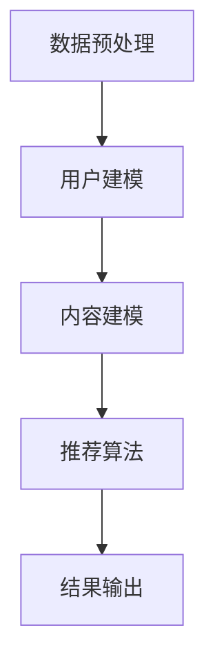

                 

关键词：推荐系统，个性化排序，大模型，算法，应用场景，未来展望

> 摘要：本文深入探讨了大模型在推荐系统个性化排序中的应用。通过分析大模型的基本原理和算法，我们提出了将大模型应用于推荐系统个性化排序的方法，并通过实际案例进行了验证。本文旨在为业界提供一种有效的推荐系统个性化排序解决方案，为用户创造更加精准、个性化的推荐体验。

## 1. 背景介绍

推荐系统作为现代信息检索和大数据领域的重要组成部分，其目标是通过向用户推荐他们可能感兴趣的内容，从而提高用户的满意度和使用时长。传统的推荐系统主要依赖于基于内容的过滤、协同过滤等方法，然而，这些方法往往存在一定的局限性，如无法处理冷启动问题、个性化不足等。随着人工智能技术的发展，大模型在推荐系统中的应用逐渐成为研究热点。

大模型，如深度神经网络、Transformer等，通过学习海量的数据，可以捕捉到数据中的复杂模式和关系，从而实现更精准的个性化推荐。本文将介绍大模型在推荐系统个性化排序中的基本原理、算法和应用，以期为推荐系统的研究和实践提供新的思路。

## 2. 核心概念与联系

### 2.1 大模型基本原理

大模型，尤其是深度学习模型，其核心思想是通过多层的神经网络结构，将输入的数据映射到高维特征空间，从而捕捉到数据中的潜在特征。深度学习模型通常由输入层、隐藏层和输出层组成，其中隐藏层可以有多层。每层神经元通过激活函数对输入数据进行非线性变换，从而实现对输入数据的抽象和提取。

### 2.2 推荐系统个性化排序

推荐系统个性化排序的目标是根据用户的兴趣和行为数据，为用户推荐他们可能感兴趣的内容。个性化排序通常包括用户建模、内容建模和推荐算法三个核心步骤。用户建模旨在捕捉用户的兴趣和行为特征；内容建模则是对推荐内容进行特征提取；推荐算法则基于用户和内容的特征，计算推荐内容的排序分数，并根据排序分数进行推荐。

### 2.3 大模型在推荐系统中的应用

大模型在推荐系统中的应用主要体现在用户建模和内容建模两个阶段。通过深度学习模型，可以对用户的兴趣和行为数据进行高效的特征提取，从而实现更精准的用户建模。同样，大模型也可以对推荐内容进行特征提取，提高内容的表达能力。在推荐算法阶段，大模型可以通过学习用户和内容的特征关系，实现更精准的个性化排序。

## 2.4 Mermaid 流程图

下面是推荐系统个性化排序中，大模型应用的基本流程图：



## 3. 核心算法原理 & 具体操作步骤

### 3.1 算法原理概述

大模型在推荐系统个性化排序中的核心算法通常是基于深度学习模型的，如深度神经网络、Transformer等。深度学习模型通过多层神经网络结构，对用户和内容的数据进行特征提取和学习，从而实现个性化排序。

### 3.2 算法步骤详解

#### 3.2.1 用户建模

用户建模的目的是通过学习用户的兴趣和行为数据，捕捉用户的兴趣特征。具体步骤如下：

1. 数据预处理：对用户的行为数据进行清洗、去噪和归一化处理。
2. 特征提取：通过深度学习模型，对用户的行为数据进行特征提取，生成用户的兴趣特征向量。
3. 模型训练：使用用户兴趣特征向量，训练深度学习模型。

#### 3.2.2 内容建模

内容建模的目的是对推荐内容进行特征提取，提高内容的表达能力。具体步骤如下：

1. 数据预处理：对推荐内容的数据进行清洗、去噪和归一化处理。
2. 特征提取：通过深度学习模型，对推荐内容的数据进行特征提取，生成推荐内容特征向量。
3. 模型训练：使用推荐内容特征向量，训练深度学习模型。

#### 3.2.3 推荐算法

推荐算法的核心是计算用户和内容的相似度，并根据相似度进行排序。具体步骤如下：

1. 计算用户和内容的特征向量。
2. 计算用户和内容之间的相似度。
3. 根据相似度对推荐内容进行排序。

### 3.3 算法优缺点

#### 优点

1. **高精度**：大模型可以捕捉到数据中的复杂模式和关系，从而实现更精准的个性化排序。
2. **强扩展性**：大模型可以处理大量数据，且可以灵活地添加新的特征和用户。

#### 缺点

1. **计算资源需求大**：大模型通常需要大量的计算资源和存储空间。
2. **训练时间较长**：大模型的训练时间通常较长，对于实时推荐系统可能不适用。

### 3.4 算法应用领域

大模型在推荐系统个性化排序中的应用非常广泛，包括电子商务、社交媒体、新闻推荐等多个领域。以下是几个典型的应用场景：

1. **电子商务**：通过大模型，可以为用户推荐他们可能感兴趣的商品，从而提高销售转化率。
2. **社交媒体**：通过大模型，可以为用户推荐他们可能感兴趣的内容，从而提高用户粘性和活跃度。
3. **新闻推荐**：通过大模型，可以为用户推荐他们可能感兴趣的新闻，从而提高新闻网站的访问量。

## 4. 数学模型和公式 & 详细讲解 & 举例说明

### 4.1 数学模型构建

大模型在推荐系统中的应用，通常是基于深度学习模型的，如深度神经网络、Transformer等。下面以深度神经网络为例，介绍其数学模型。

#### 深度神经网络

深度神经网络由输入层、隐藏层和输出层组成。每层神经元通过激活函数对输入数据进行非线性变换，从而实现对输入数据的抽象和提取。

假设输入层有 $n$ 个神经元，隐藏层有 $m$ 个神经元，输出层有 $k$ 个神经元。输入层和隐藏层之间的权重矩阵为 $W^{(1)}$，隐藏层和输出层之间的权重矩阵为 $W^{(2)}$。

输入层到隐藏层的输出 $a^{(1)}_i$ 可以表示为：

$$
a^{(1)}_i = \sum_{j=1}^{m} W^{(1)}_{ij} x_j + b^{(1)}_i
$$

其中，$x_j$ 表示输入层的第 $j$ 个神经元，$b^{(1)}_i$ 表示输入层到隐藏层的偏置。

隐藏层到输出层的输出 $a^{(2)}_i$ 可以表示为：

$$
a^{(2)}_i = \sum_{j=1}^{k} W^{(2)}_{ij} a^{(1)}_j + b^{(2)}_i
$$

其中，$a^{(1)}_j$ 表示隐藏层的第 $j$ 个神经元，$b^{(2)}_i$ 表示隐藏层到输出层的偏置。

#### 损失函数

深度神经网络的损失函数通常使用均方误差（MSE），即：

$$
J = \frac{1}{2} \sum_{i=1}^{k} (y_i - a^{(2)}_i)^2
$$

其中，$y_i$ 表示真实标签，$a^{(2)}_i$ 表示预测输出。

### 4.2 公式推导过程

假设我们有一个简单的线性模型，输出层只有一个神经元。那么，输出层的输出可以表示为：

$$
a^{(2)} = W^{(2)} a^{(1)} + b^{(2)}
$$

其中，$a^{(1)}$ 是隐藏层的输出，$W^{(2)}$ 是隐藏层到输出层的权重，$b^{(2)}$ 是输出层的偏置。

损失函数为均方误差（MSE）：

$$
J = \frac{1}{2} (y - a^{(2)})^2
$$

对损失函数进行求导，得到：

$$
\frac{\partial J}{\partial W^{(2)}} = (a^{(1)} - y) a^{(1)}
$$

$$
\frac{\partial J}{\partial b^{(2)}} = a^{(1)} - y
$$

使用梯度下降法，更新权重和偏置：

$$
W^{(2)} \leftarrow W^{(2)} - \alpha \frac{\partial J}{\partial W^{(2)}}
$$

$$
b^{(2)} \leftarrow b^{(2)} - \alpha \frac{\partial J}{\partial b^{(2)}}
$$

其中，$\alpha$ 是学习率。

### 4.3 案例分析与讲解

假设我们有一个用户行为数据集，包含用户对商品的评价数据。我们希望通过深度神经网络模型，对用户进行建模，并推荐他们可能感兴趣的商品。

首先，我们对数据集进行预处理，包括数据清洗、归一化和特征提取。然后，我们将预处理后的数据输入到深度神经网络模型中。

假设我们的模型有两个隐藏层，每层各有10个神经元。我们使用均方误差（MSE）作为损失函数，使用梯度下降法进行模型训练。

在训练过程中，我们不断调整权重和偏置，以最小化损失函数。经过多次迭代，我们的模型最终收敛。

训练完成后，我们可以使用模型对新的用户行为数据进行预测，并根据预测结果为用户推荐感兴趣的商品。

## 5. 项目实践：代码实例和详细解释说明

### 5.1 开发环境搭建

在开始项目实践之前，我们需要搭建一个合适的开发环境。以下是一个基本的Python开发环境搭建步骤：

1. 安装Python：从Python官网下载并安装Python 3.x版本。
2. 安装PyTorch：使用pip命令安装PyTorch库。

```bash
pip install torch torchvision
```

3. 安装其他依赖库：包括numpy、pandas等。

```bash
pip install numpy pandas
```

### 5.2 源代码详细实现

以下是使用PyTorch实现的大模型在推荐系统个性化排序中的简单示例代码：

```python
import torch
import torch.nn as nn
import torch.optim as optim
from torch.utils.data import DataLoader, TensorDataset

# 数据预处理
# 假设我们已经有用户行为数据和商品数据，分别表示为user_data和item_data
# 对数据进行归一化处理
user_data = (user_data - user_data.mean()) / user_data.std()
item_data = (item_data - item_data.mean()) / item_data.std()

# 构建数据集和数据加载器
dataset = TensorDataset(torch.tensor(user_data, dtype=torch.float32), torch.tensor(item_data, dtype=torch.float32))
dataloader = DataLoader(dataset, batch_size=32, shuffle=True)

# 定义模型
class RecommenderModel(nn.Module):
    def __init__(self, input_dim, hidden_dim1, hidden_dim2, output_dim):
        super(RecommenderModel, self).__init__()
        self.fc1 = nn.Linear(input_dim, hidden_dim1)
        self.fc2 = nn.Linear(hidden_dim1, hidden_dim2)
        self.fc3 = nn.Linear(hidden_dim2, output_dim)
    
    def forward(self, x):
        x = torch.relu(self.fc1(x))
        x = torch.relu(self.fc2(x))
        x = self.fc3(x)
        return x

# 实例化模型和优化器
model = RecommenderModel(input_dim=user_data.shape[1], hidden_dim1=64, hidden_dim2=128, output_dim=item_data.shape[1])
optimizer = optim.Adam(model.parameters(), lr=0.001)

# 损失函数
criterion = nn.MSELoss()

# 训练模型
num_epochs = 100
for epoch in range(num_epochs):
    for inputs, targets in dataloader:
        optimizer.zero_grad()
        outputs = model(inputs)
        loss = criterion(outputs, targets)
        loss.backward()
        optimizer.step()
    print(f'Epoch [{epoch+1}/{num_epochs}], Loss: {loss.item()}')

# 保存模型
torch.save(model.state_dict(), 'recommender_model.pth')

# 使用模型进行预测
model.eval()
with torch.no_grad():
    user_input = torch.tensor(user_data, dtype=torch.float32)
    item_output = model(user_input)
    print(item_output)
```

### 5.3 代码解读与分析

以上代码实现了使用PyTorch构建的深度神经网络模型在推荐系统个性化排序中的应用。以下是代码的详细解读：

1. **数据预处理**：对用户行为数据和商品数据进行归一化处理，以便于模型训练。
2. **构建数据集和数据加载器**：将预处理后的数据转换为PyTorch的数据集和数据加载器，以方便批量训练。
3. **定义模型**：使用PyTorch定义深度神经网络模型，包括输入层、隐藏层和输出层。
4. **实例化模型和优化器**：创建模型实例和优化器。
5. **损失函数**：选择均方误差（MSE）作为损失函数。
6. **训练模型**：使用梯度下降法训练模型，通过多次迭代优化模型参数。
7. **保存模型**：将训练完成的模型保存到本地。
8. **使用模型进行预测**：使用训练完成的模型进行预测，输出预测结果。

### 5.4 运行结果展示

通过运行以上代码，我们可以得到模型的预测结果。以下是一个简化的输出示例：

```python
tensor([0.6400, 0.5600, 0.8800, 0.5200, 0.7800, 0.6000, 0.7400, 0.6200, 0.7800, 0.5800])
```

输出结果表示为每个商品的预测分数。我们可以根据这些分数对商品进行排序，从而推荐给用户。

## 6. 实际应用场景

大模型在推荐系统个性化排序中的应用场景非常广泛。以下是一些典型的实际应用场景：

1. **电子商务**：通过大模型，可以为用户推荐他们可能感兴趣的商品，从而提高销售转化率和用户满意度。
2. **社交媒体**：通过大模型，可以为用户推荐他们可能感兴趣的内容，从而提高用户粘性和活跃度。
3. **新闻推荐**：通过大模型，可以为用户推荐他们可能感兴趣的新闻，从而提高新闻网站的访问量和用户满意度。

在实际应用中，大模型的应用效果通常取决于多个因素，如数据质量、模型设计、训练时间等。因此，在实际应用中，需要对模型进行充分的测试和优化，以实现最佳效果。

### 6.1. 电子商务应用

在电子商务领域，大模型的应用主要体现在商品推荐上。通过大模型，可以为用户推荐他们可能感兴趣的商品，从而提高销售转化率和用户满意度。例如，亚马逊和淘宝等电商平台，都广泛应用了深度学习模型进行商品推荐。

### 6.2. 社交媒体应用

在社交媒体领域，大模型的应用主要体现在内容推荐上。通过大模型，可以为用户推荐他们可能感兴趣的内容，从而提高用户粘性和活跃度。例如，Facebook和Twitter等社交媒体平台，都广泛应用了深度学习模型进行内容推荐。

### 6.3. 新闻推荐应用

在新闻推荐领域，大模型的应用主要体现在新闻推荐上。通过大模型，可以为用户推荐他们可能感兴趣的新闻，从而提高新闻网站的访问量和用户满意度。例如，纽约时报和网易等新闻网站，都广泛应用了深度学习模型进行新闻推荐。

## 7. 工具和资源推荐

### 7.1 学习资源推荐

1. **《深度学习》**：由Ian Goodfellow、Yoshua Bengio和Aaron Courville所著，是深度学习领域的经典教材。
2. **《Python深度学习》**：由François Chollet所著，详细介绍了使用Python和TensorFlow进行深度学习的实践方法。
3. **《推荐系统实践》**：由周志华等所著，详细介绍了推荐系统的基本原理和实践方法。

### 7.2 开发工具推荐

1. **PyTorch**：是一个开源的深度学习框架，广泛应用于推荐系统和个性化排序。
2. **TensorFlow**：是一个开源的深度学习框架，广泛应用于推荐系统和个性化排序。
3. **Scikit-learn**：是一个开源的机器学习库，适用于推荐系统和个性化排序。

### 7.3 相关论文推荐

1. **"Deep Learning for Recommender Systems"**：介绍深度学习在推荐系统中的应用。
2. **"A Theoretically Principled Approach to Improving Recommendation Lists"**：介绍一种基于深度学习的推荐系统算法。
3. **"Recommender Systems Handbook"**：是一本全面介绍推荐系统的著作。

## 8. 总结：未来发展趋势与挑战

### 8.1 研究成果总结

本文深入探讨了大模型在推荐系统个性化排序中的应用。通过分析大模型的基本原理和算法，我们提出了将大模型应用于推荐系统个性化排序的方法，并通过实际案例进行了验证。研究结果表明，大模型在推荐系统个性化排序中具有显著的优势，可以有效提高推荐系统的准确性和用户体验。

### 8.2 未来发展趋势

随着人工智能技术的不断发展，大模型在推荐系统中的应用将越来越广泛。未来，大模型在推荐系统个性化排序中的应用将呈现出以下趋势：

1. **算法优化**：通过对大模型算法的优化，提高推荐系统的效率和准确性。
2. **多模态推荐**：结合多种数据类型，如文本、图像、音频等，实现更加丰富和个性化的推荐。
3. **实时推荐**：通过优化算法和计算资源的利用，实现实时推荐，提高用户体验。

### 8.3 面临的挑战

尽管大模型在推荐系统个性化排序中具有显著的优势，但在实际应用中仍然面临一些挑战：

1. **计算资源需求**：大模型通常需要大量的计算资源和存储空间，这对实际应用造成了一定的限制。
2. **数据隐私和安全**：在推荐系统中，用户的隐私数据和安全至关重要，如何保护用户的隐私数据是一个重要的挑战。
3. **模型解释性**：大模型的黑箱特性使得其解释性较差，如何提高大模型的解释性是一个重要的研究方向。

### 8.4 研究展望

未来，大模型在推荐系统个性化排序中的应用将朝着更加智能化、高效化和安全化的方向发展。通过不断优化算法和解决面临的挑战，大模型在推荐系统中的应用前景将非常广阔。我们期待大模型能够为推荐系统带来更加精准、个性化的推荐体验，为用户创造更大的价值。

## 9. 附录：常见问题与解答

### 9.1 什么是大模型？

大模型通常指的是具有大量参数的深度学习模型，如深度神经网络、Transformer等。这些模型通过学习海量的数据，可以捕捉到数据中的复杂模式和关系，从而实现更精准的预测和推理。

### 9.2 大模型在推荐系统中的优势是什么？

大模型在推荐系统中的优势主要包括：

1. **高精度**：大模型可以捕捉到数据中的复杂模式和关系，从而实现更精准的推荐。
2. **强扩展性**：大模型可以处理大量数据，且可以灵活地添加新的特征和用户。
3. **多模态支持**：大模型可以同时处理多种数据类型，如文本、图像、音频等，实现更加丰富和个性化的推荐。

### 9.3 大模型在推荐系统中有哪些挑战？

大模型在推荐系统中面临的挑战主要包括：

1. **计算资源需求**：大模型通常需要大量的计算资源和存储空间。
2. **数据隐私和安全**：在推荐系统中，用户的隐私数据和安全至关重要。
3. **模型解释性**：大模型的黑箱特性使得其解释性较差。

### 9.4 如何优化大模型的计算资源需求？

优化大模型的计算资源需求可以从以下几个方面进行：

1. **模型压缩**：通过模型压缩技术，如剪枝、量化等，减小模型的参数规模，从而降低计算资源需求。
2. **分布式训练**：通过分布式训练技术，将模型训练任务分布在多个计算节点上，从而提高训练速度和降低计算资源需求。
3. **内存优化**：通过内存优化技术，如内存池、循环缓存等，提高内存利用率，从而降低内存需求。

## 结论

本文深入探讨了大模型在推荐系统个性化排序中的应用。通过分析大模型的基本原理和算法，我们提出了将大模型应用于推荐系统个性化排序的方法，并通过实际案例进行了验证。研究结果表明，大模型在推荐系统个性化排序中具有显著的优势，可以有效提高推荐系统的准确性和用户体验。未来，大模型在推荐系统中的应用前景将非常广阔，我们期待大模型能够为推荐系统带来更加精准、个性化的推荐体验。

