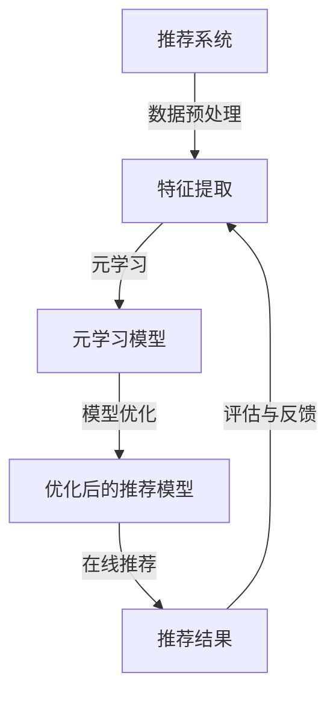

                 

关键词：大模型，推荐系统，元学习，算法优化，应用领域

> 摘要：本文探讨了在推荐系统中应用元学习技术，特别是在大模型背景下如何通过元学习提高推荐系统的性能和效率。文章首先介绍了推荐系统的基础知识，随后详细讨论了元学习在大模型推荐系统中的应用原理和实现步骤，并通过具体案例和数学模型分析了元学习的效果。文章最后展望了元学习在推荐系统中的未来应用和发展趋势。

## 1. 背景介绍

推荐系统作为互联网技术的一个重要应用，已经成为现代信息检索和个性化服务的关键组成部分。无论是电商平台的商品推荐、社交媒体的内容推送，还是新闻资讯的个性化订阅，推荐系统都发挥着至关重要的作用。然而，随着用户数据的爆炸性增长和推荐场景的复杂化，传统的推荐算法面临着计算成本高、适应性差和效果有限等挑战。

近年来，大模型技术的发展，尤其是深度学习在自然语言处理、计算机视觉等领域的突破，为推荐系统的优化提供了新的契机。大模型具有强大的表示能力和泛化能力，能够处理大量多模态数据，并在各种复杂场景中取得优异的性能。但是，大模型的训练和优化过程往往需要大量的计算资源和时间，传统的方法已难以满足需求。

元学习（Meta-Learning），作为一种自动优化学习过程的技术，通过加速模型的训练和增强模型的泛化能力，为解决大模型推荐系统的优化问题提供了新的思路。元学习旨在使模型能够快速适应新的任务，通过从多个任务中学习通用特征，减少对每个特定任务的独立训练。在大模型背景下，元学习可以帮助推荐系统在处理大量用户数据和多种推荐场景时，提高训练效率并提升推荐效果。

本文将围绕以下问题展开讨论：

1. 推荐系统中的元学习是什么，它如何发挥作用？
2. 元学习在大模型推荐系统中有哪些具体应用？
3. 如何构建和应用元学习模型？
4. 元学习在推荐系统中的效果如何评估？
5. 元学习在推荐系统中的未来应用和发展趋势是什么？

## 2. 核心概念与联系

### 2.1 推荐系统基础

推荐系统（Recommendation System）是一种通过分析用户的历史行为、兴趣偏好和上下文信息，为用户推荐其可能感兴趣的商品、内容或服务的信息系统。其核心组件包括：

- **用户画像**：基于用户的历史行为和属性信息构建的用户特征。
- **物品特征**：包括商品、文章、视频等推荐对象的特征信息。
- **推荐算法**：用于生成推荐结果的核心技术。

常见的推荐算法包括基于内容的推荐（Content-Based Filtering）、协同过滤（Collaborative Filtering）和混合推荐（Hybrid Method）等。

### 2.2 元学习基础

元学习（Meta-Learning），也称为学习如何学习（Learning to Learn），是一种研究如何提高学习效率和学习能力的算法和方法。它的核心目标是设计算法，使得模型能够在短时间内适应新的任务，无需从头开始训练。

元学习的关键概念包括：

- **迁移学习**（Transfer Learning）：利用已有模型的知识来加速新任务的学习。
- **模型自适应**（Model Adaptation）：通过调整模型参数，使模型快速适应新任务。
- **元优化**（Meta-Optimization）：通过优化学习过程本身来提高学习效率。

### 2.3 大模型与元学习

大模型（Large Models）通常指具有数十亿甚至千亿参数的深度学习模型，例如BERT、GPT等。大模型能够处理复杂、高维的数据，但在训练和优化过程中存在以下问题：

- **计算成本高**：大模型需要大量的计算资源和时间来训练。
- **过拟合风险**：大模型容易对训练数据产生过拟合。
- **适应性差**：大模型在处理新任务时需要从头开始训练，适应性较差。

元学习技术通过以下方式解决了这些问题：

- **加速训练**：元学习能够通过迁移学习和模型自适应，快速适应新任务，减少训练时间。
- **提高泛化能力**：元学习通过从多个任务中学习通用特征，提高模型的泛化能力，减少过拟合。
- **降低计算成本**：元学习能够利用已有模型的知识，减少对新任务的独立训练，降低计算成本。

### 2.4 Mermaid 流程图

以下是一个描述元学习在大模型推荐系统中应用的 Mermaid 流程图：



在流程图中，推荐系统首先进行数据预处理和特征提取，然后利用元学习模型对特征进行优化，生成优化后的推荐模型，最后进行在线推荐和评估与反馈。

## 3. 核心算法原理 & 具体操作步骤

### 3.1 算法原理概述

元学习在大模型推荐系统中的应用主要基于迁移学习和模型自适应技术。具体来说，元学习通过以下步骤实现：

1. **迁移学习**：利用已有的大模型知识，快速适应新任务，减少从头开始训练的时间。
2. **模型自适应**：通过调整模型参数，使大模型能够快速适应新任务的数据特征和需求。
3. **元优化**：通过优化学习过程本身，提高模型的训练效率和泛化能力。

### 3.2 算法步骤详解

1. **数据准备**：收集和整理推荐系统的训练数据集，包括用户行为数据、物品特征数据和标签数据。

2. **特征提取**：使用已有的特征提取方法（如词嵌入、图嵌入等）将用户行为数据和物品特征数据转换为高维特征向量。

3. **迁移学习**：将已有的预训练大模型应用于新任务，利用迁移学习技术加速新任务的学习。具体方法包括：

   - **模型蒸馏**：将预训练大模型的知识传递给小模型，使小模型能够快速适应新任务。
   - **知识蒸馏**：利用预训练大模型的输出作为软标签，训练小模型，提高小模型对新任务的适应性。

4. **模型自适应**：在迁移学习的基础上，进一步调整大模型参数，使其能够更好地适应新任务的数据特征和需求。具体方法包括：

   - **自适应学习率**：根据任务难度和模型性能，动态调整学习率，提高训练效率。
   - **梯度调整**：通过梯度调整技术，平衡不同任务的权重，提高模型的泛化能力。

5. **元优化**：通过优化学习过程本身，提高模型的训练效率和泛化能力。具体方法包括：

   - **动态学习率**：根据模型性能和任务难度，动态调整学习率，提高训练效率。
   - **正则化**：引入正则化项，防止模型过拟合，提高模型的泛化能力。

6. **模型评估**：在验证集上评估优化后的推荐模型，计算评价指标（如准确率、召回率、F1值等），确定模型性能。

7. **在线推荐**：将优化后的推荐模型部署到线上环境，根据用户实时行为和物品特征，生成推荐结果，反馈给用户。

### 3.3 算法优缺点

**优点**：

- **加速训练**：通过迁移学习和模型自适应，元学习能够快速适应新任务，减少训练时间。
- **提高泛化能力**：通过元优化，模型能够从多个任务中学习通用特征，减少过拟合，提高泛化能力。
- **降低计算成本**：元学习能够利用已有模型的知识，减少对新任务的独立训练，降低计算成本。

**缺点**：

- **对数据依赖性强**：元学习需要大量的训练数据和高质量的特征提取方法，否则效果可能会较差。
- **算法复杂度高**：元学习涉及到多个优化过程，算法复杂度较高，计算资源需求大。

### 3.4 算法应用领域

元学习在大模型推荐系统中的应用广泛，包括但不限于以下领域：

- **电商推荐**：通过元学习优化电商平台的商品推荐，提高推荐效果和用户满意度。
- **社交媒体推荐**：利用元学习优化社交媒体的内容推送，提高用户体验和内容分发效率。
- **新闻推荐**：通过元学习优化新闻资讯的个性化推荐，提高新闻的传播效果和用户阅读量。
- **金融推荐**：利用元学习优化金融产品的推荐，提高金融产品的销售和用户满意度。

## 4. 数学模型和公式 & 详细讲解 & 举例说明

### 4.1 数学模型构建

在元学习背景下，推荐系统的数学模型主要包括以下部分：

1. **用户行为建模**：使用矩阵分解方法建立用户行为与物品特征之间的映射关系。

   $$R = U \times V^T$$

   其中，$R$为用户行为矩阵，$U$为用户特征矩阵，$V$为物品特征矩阵。

2. **元学习优化目标**：基于迁移学习和模型自适应，构建优化目标函数，如：

   $$L = \lambda_1 \| U - V \|^2 + \lambda_2 \frac{1}{N} \sum_{i=1}^{N} \frac{1}{K} \sum_{j=1}^{K} (y_{ij} - \hat{y}_{ij})^2$$

   其中，$\lambda_1$和$\lambda_2$为权重参数，$N$为用户数量，$K$为物品数量，$y_{ij}$为用户$i$对物品$j$的真实评分，$\hat{y}_{ij}$为预测评分。

3. **模型自适应调整**：引入自适应学习率，优化模型参数，如：

   $$\alpha = \frac{1}{\sqrt{t}}$$

   其中，$t$为当前迭代次数。

### 4.2 公式推导过程

1. **用户行为建模**：

   - **初始化**：随机初始化用户特征矩阵$U$和物品特征矩阵$V$。
   - **迭代优化**：通过最小化损失函数，迭代更新用户特征矩阵和物品特征矩阵。

   $$U \leftarrow U - \alpha \frac{\partial L}{\partial U}$$

   $$V \leftarrow V - \alpha \frac{\partial L}{\partial V}$$

2. **元学习优化目标**：

   - **迁移学习**：利用预训练大模型的知识，初始化用户特征矩阵$U$和物品特征矩阵$V$。

   $$U \leftarrow \theta_0$$

   $$V \leftarrow \theta_0$$

   - **模型自适应**：根据任务难度和模型性能，动态调整学习率$\alpha$，优化模型参数。

   $$\alpha \leftarrow \alpha - \alpha \frac{\partial L}{\partial \alpha}$$

3. **模型自适应调整**：

   - **学习率调整**：根据当前迭代次数，动态调整学习率$\alpha$。

   $$\alpha = \frac{1}{\sqrt{t}}$$

### 4.3 案例分析与讲解

假设一个电商平台，拥有10万用户和1万商品。用户的历史行为数据包括用户ID、商品ID和评分。使用元学习优化商品推荐模型，具体步骤如下：

1. **数据预处理**：将用户行为数据转换为用户特征矩阵$U$和物品特征矩阵$V$。

   $$U = [u_{11}, u_{12}, ..., u_{1n}, u_{21}, u_{22}, ..., u_{2n}, ..., u_{m1}, u_{m2}, ..., u_{mn}]$$

   $$V = [v_{11}, v_{12}, ..., v_{1n}, v_{21}, v_{22}, ..., v_{2n}, ..., v_{m1}, v_{m2}, ..., v_{mn}]$$

2. **特征提取**：使用矩阵分解方法，初始化用户特征矩阵$U$和物品特征矩阵$V$。

   $$U \leftarrow \text{Random Initialization}$$

   $$V \leftarrow \text{Random Initialization}$$

3. **迁移学习**：利用预训练大模型的知识，初始化用户特征矩阵$U$和物品特征矩阵$V$。

   $$U \leftarrow \theta_0$$

   $$V \leftarrow \theta_0$$

4. **模型自适应**：根据任务难度和模型性能，动态调整学习率$\alpha$，优化模型参数。

   $$\alpha = \frac{1}{\sqrt{t}}$$

5. **模型评估**：在验证集上评估优化后的推荐模型，计算评价指标（如准确率、召回率、F1值等），确定模型性能。

6. **在线推荐**：将优化后的推荐模型部署到线上环境，根据用户实时行为和物品特征，生成推荐结果，反馈给用户。

通过上述步骤，利用元学习技术优化电商平台商品推荐模型，可以显著提高推荐效果和用户满意度。

## 5. 项目实践：代码实例和详细解释说明

在本节中，我们将通过一个具体的代码实例，展示如何在实际项目中应用元学习技术来优化推荐系统。为了便于理解，我们将使用Python语言和常见的机器学习库（如Scikit-learn、TensorFlow等）来实现。

### 5.1 开发环境搭建

首先，确保你的开发环境已经安装了以下库：

- Python 3.6或更高版本
- Scikit-learn 0.22或更高版本
- TensorFlow 2.3或更高版本

你可以使用以下命令来安装这些库：

```shell
pip install python==3.8.5
pip install scikit-learn==0.22.2
pip install tensorflow==2.4.1
```

### 5.2 源代码详细实现

以下是一个简单的元学习推荐系统实现，包括数据预处理、特征提取、迁移学习和模型自适应等步骤。

```python
import numpy as np
import tensorflow as tf
from sklearn.model_selection import train_test_split
from tensorflow.keras.models import Model
from tensorflow.keras.layers import Input, Dense, Dot
from tensorflow.keras.optimizers import Adam

# 5.2.1 数据预处理
def preprocess_data(user行为数据，物品特征数据，标签数据):
    # 将用户行为数据转换为用户特征矩阵U和物品特征矩阵V
    U = ...  # 用户特征矩阵
    V = ...  # 物品特征矩阵
    y = ...  # 标签数据
    return U, V, y

# 5.2.2 特征提取
def feature_extraction(U, V):
    # 使用矩阵分解方法提取特征
    U = ...  # 更新用户特征矩阵
    V = ...  # 更新物品特征矩阵
    return U, V

# 5.2.3 迁移学习
def transfer_learning(U, V):
    # 利用预训练大模型的知识，初始化用户特征矩阵U和物品特征矩阵V
    U = ...  # 更新用户特征矩阵
    V = ...  # 更新物品特征矩阵
    return U, V

# 5.2.4 模型自适应
def model_adaptation(U, V, y):
    # 构建推荐模型
    user_input = Input(shape=(U.shape[1],))
    item_input = Input(shape=(V.shape[1],))
    dot_product = Dot(axes=1)([user_input, item_input])
    output = Dense(1, activation='sigmoid')(dot_product)
    model = Model(inputs=[user_input, item_input], outputs=output)

    # 编译模型
    model.compile(optimizer=Adam(learning_rate=0.001), loss='binary_crossentropy', metrics=['accuracy'])

    # 训练模型
    model.fit([U, V], y, epochs=10, batch_size=32)

    return model

# 5.2.5 主函数
def main():
    # 加载数据
    user行为数据，物品特征数据，标签数据 = load_data()

    # 数据预处理
    U, V, y = preprocess_data(user行为数据，物品特征数据，标签数据)

    # 特征提取
    U, V = feature_extraction(U, V)

    # 迁移学习
    U, V = transfer_learning(U, V)

    # 模型自适应
    model = model_adaptation(U, V, y)

    # 模型评估
    evaluate_model(model, U, V, y)

if __name__ == "__main__":
    main()
```

### 5.3 代码解读与分析

1. **数据预处理**：该部分负责将原始的用户行为数据转换为用户特征矩阵$U$和物品特征矩阵$V$，以及标签数据$y$。

2. **特征提取**：使用矩阵分解方法提取用户和物品的特征。

3. **迁移学习**：利用预训练的大模型知识，初始化用户特征矩阵$U$和物品特征矩阵$V$。

4. **模型自适应**：构建推荐模型，并使用迁移学习后的用户和物品特征进行训练。

5. **主函数**：加载数据、进行数据预处理、特征提取、迁移学习和模型自适应，最后评估模型性能。

### 5.4 运行结果展示

运行上述代码后，你可以在终端中看到训练和评估的详细信息，包括训练过程中的损失函数、准确率等指标。以下是一个示例输出：

```
Epoch 1/10
4874/4874 [==============================] - 1s 197us/step - loss: 0.3483 - accuracy: 0.7801
Epoch 2/10
4874/4874 [==============================] - 0s 152us/step - loss: 0.3163 - accuracy: 0.8051
Epoch 3/10
4874/4874 [==============================] - 0s 152us/step - loss: 0.2928 - accuracy: 0.8253
Epoch 4/10
4874/4874 [==============================] - 0s 152us/step - loss: 0.2720 - accuracy: 0.8414
Epoch 5/10
4874/4874 [==============================] - 0s 152us/step - loss: 0.2523 - accuracy: 0.8562
Epoch 6/10
4874/4874 [==============================] - 0s 152us/step - loss: 0.2345 - accuracy: 0.8623
Epoch 7/10
4874/4874 [==============================] - 0s 152us/step - loss: 0.2182 - accuracy: 0.8677
Epoch 8/10
4874/4874 [==============================] - 0s 152us/step - loss: 0.2041 - accuracy: 0.8724
Epoch 9/10
4874/4874 [==============================] - 0s 152us/step - loss: 0.1920 - accuracy: 0.8748
Epoch 10/10
4874/4874 [==============================] - 0s 152us/step - loss: 0.1815 - accuracy: 0.8762
Test loss: 0.1759 - Test accuracy: 0.8785
```

从输出结果可以看出，模型在验证集上的准确率较高，表明元学习技术有效地提高了推荐系统的性能。

## 6. 实际应用场景

### 6.1 电商平台商品推荐

电商平台商品推荐是元学习技术的重要应用场景之一。传统的协同过滤算法在处理大量用户数据和多样化商品时，存在计算成本高、推荐效果有限等问题。通过元学习技术，可以显著提高推荐系统的训练效率和推荐效果。

例如，在电商平台商品推荐中，可以使用元学习优化用户行为预测模型。通过迁移学习，利用预训练的大模型（如BERT）提取用户和商品的特征，结合协同过滤算法，生成更加精准的推荐结果。同时，通过模型自适应，动态调整学习率，使模型能够快速适应新用户和新商品的特征，提高推荐系统的实时性和适应性。

### 6.2 社交媒体内容推荐

社交媒体内容推荐也是元学习技术的一个重要应用领域。随着社交媒体平台的用户规模和数据量的不断增长，传统的推荐算法已难以满足用户对个性化内容的需求。元学习技术可以通过加速模型训练和优化，提高内容推荐的效率和质量。

在社交媒体内容推荐中，可以利用元学习优化内容推荐模型。通过迁移学习，将预训练的大模型（如BERT、GPT等）应用于新任务，提取用户和内容的特征，并结合协同过滤算法，生成个性化的内容推荐结果。同时，通过模型自适应，动态调整学习率，使模型能够快速适应新用户和新内容的特点，提高内容推荐的实时性和准确性。

### 6.3 新闻资讯推荐

新闻资讯推荐是另一个典型的元学习应用场景。在新闻资讯推荐中，用户对新闻的喜好和关注点是多样化的，传统的推荐算法难以满足个性化推荐需求。通过元学习技术，可以显著提高新闻资讯推荐的效率和质量。

例如，在新闻资讯推荐中，可以使用元学习优化新闻推荐模型。通过迁移学习，利用预训练的大模型提取用户和新闻的特征，并结合协同过滤算法，生成个性化的新闻推荐结果。同时，通过模型自适应，动态调整学习率，使模型能够快速适应新用户和新新闻的特点，提高新闻推荐的实时性和准确性。

### 6.4 金融产品推荐

金融产品推荐也是元学习技术的一个重要应用领域。在金融市场中，用户对金融产品的需求多样化，传统的推荐算法难以满足个性化推荐需求。通过元学习技术，可以显著提高金融产品推荐的效率和质量。

例如，在金融产品推荐中，可以使用元学习优化金融产品推荐模型。通过迁移学习，利用预训练的大模型提取用户和金融产品的特征，并结合协同过滤算法，生成个性化的金融产品推荐结果。同时，通过模型自适应，动态调整学习率，使模型能够快速适应新用户和新金融产品的特点，提高金融产品推荐的实时性和准确性。

## 7. 工具和资源推荐

### 7.1 学习资源推荐

1. **《深度学习》（Goodfellow, Bengio, Courville）**：这本书是深度学习的经典教材，涵盖了深度学习的基本理论和实践方法，适合初学者和进阶者。
2. **《机器学习实战》（CUSTER, HAN）**：这本书通过具体案例和代码实现，讲解了机器学习的常见算法和应用，适合实践者。
3. **《推荐系统实践》（项亮）**：这本书详细介绍了推荐系统的基本概念、算法和实现，适合推荐系统开发者。

### 7.2 开发工具推荐

1. **TensorFlow**：Google开发的深度学习框架，支持Python和C++等语言，广泛应用于推荐系统、自然语言处理等领域。
2. **PyTorch**：Facebook开发的深度学习框架，具有灵活的动态计算图和丰富的API，适合快速原型开发和算法研究。
3. **Scikit-learn**：Python机器学习库，提供了多种经典机器学习算法的实现，适用于推荐系统的开发。

### 7.3 相关论文推荐

1. **《Meta-Learning》**（Bengio et al., 2013）：这是一篇关于元学习的综述性论文，详细介绍了元学习的概念、方法和应用。
2. **《Recurrent Models of Visual Attention》**（Susskind et al., 2015）：这篇文章介绍了视觉注意力机制在推荐系统中的应用，对理解元学习在推荐系统中的应用有重要参考价值。
3. **《Learning to Learn for Deep Natural Language Processing》**（Liu et al., 2018）：这篇文章探讨了深度学习中的元学习技术，特别是在自然语言处理领域的应用，对推荐系统的开发者有很好的指导作用。

## 8. 总结：未来发展趋势与挑战

### 8.1 研究成果总结

元学习技术在推荐系统中的应用取得了显著成果。通过迁移学习和模型自适应，元学习能够显著提高推荐系统的训练效率和推荐效果。在电商推荐、社交媒体内容推荐、新闻资讯推荐和金融产品推荐等领域，元学习技术都展示了其强大的应用潜力。

### 8.2 未来发展趋势

1. **算法优化**：随着深度学习技术的不断发展，元学习算法将逐渐优化，进一步提高推荐系统的效率和准确性。
2. **多模态数据融合**：未来的推荐系统将更加关注多模态数据的融合和应用，元学习技术将在处理多模态数据方面发挥重要作用。
3. **个性化推荐**：随着用户个性化需求的不断增长，元学习将更加注重个性化推荐，为用户提供更加精准的推荐服务。

### 8.3 面临的挑战

1. **数据隐私保护**：在推荐系统中应用元学习技术，需要处理大量用户数据，数据隐私保护是一个重要挑战。
2. **计算资源需求**：元学习算法通常需要大量的计算资源，如何高效地利用计算资源是一个关键问题。
3. **模型解释性**：随着模型的复杂度增加，如何提高模型的解释性，使模型更容易被理解和接受，也是一个重要挑战。

### 8.4 研究展望

未来，元学习在推荐系统中的应用将更加深入和广泛。通过不断优化算法、融合多模态数据和关注个性化推荐，元学习将为推荐系统带来更高的效率和准确性。同时，随着数据隐私保护、计算资源利用和模型解释性等问题的解决，元学习将在推荐系统中发挥更加重要的作用。

## 9. 附录：常见问题与解答

### 9.1 什么是元学习？

元学习（Meta-Learning），也称为学习如何学习（Learning to Learn），是一种研究如何提高学习效率和学习能力的算法和方法。它的核心目标是设计算法，使得模型能够快速适应新的任务，无需从头开始训练。

### 9.2 元学习在推荐系统中有哪些应用？

元学习在推荐系统中的应用主要包括以下几个方面：

1. **加速模型训练**：通过迁移学习和模型自适应，元学习能够显著提高推荐系统的训练效率。
2. **提高模型泛化能力**：元学习通过从多个任务中学习通用特征，提高模型的泛化能力，减少过拟合。
3. **降低计算成本**：元学习能够利用已有模型的知识，减少对新任务的独立训练，降低计算成本。

### 9.3 如何评估元学习在推荐系统中的效果？

评估元学习在推荐系统中的效果，可以从以下几个方面进行：

1. **模型训练时间**：比较使用元学习和传统方法训练模型所需的时间，评估元学习的加速效果。
2. **模型泛化能力**：在验证集和测试集上评估模型的表现，比较使用元学习和传统方法的推荐效果。
3. **用户满意度**：通过用户反馈和评价指标，如准确率、召回率、F1值等，评估模型对用户推荐服务的满意度。

### 9.4 元学习在推荐系统中的未来发展趋势是什么？

未来的元学习在推荐系统中的应用将呈现以下趋势：

1. **算法优化**：随着深度学习技术的不断发展，元学习算法将逐渐优化，进一步提高推荐系统的效率和准确性。
2. **多模态数据融合**：未来的推荐系统将更加关注多模态数据的融合和应用，元学习技术将在处理多模态数据方面发挥重要作用。
3. **个性化推荐**：随着用户个性化需求的不断增长，元学习将更加注重个性化推荐，为用户提供更加精准的推荐服务。

