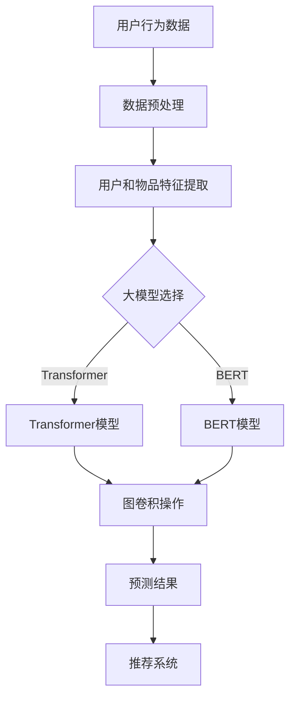

                 

关键词：大模型，推荐系统，图神经架构，搜索算法，算法优化，应用场景，未来展望

> 摘要：本文将探讨大模型在推荐系统中的图神经架构搜索应用。首先介绍推荐系统的背景和现状，随后深入分析大模型和图神经架构的核心概念与联系，并详细阐述相关算法原理、数学模型及其推导过程。接下来，通过项目实践和代码实例展示大模型在推荐系统中的实际应用，并探讨其在各种实际应用场景中的效果。最后，提出大模型在推荐系统中的未来应用展望，以及可能面临的挑战和解决思路。

## 1. 背景介绍

### 推荐系统的发展历程

推荐系统是一种利用算法和数据进行信息过滤和内容推荐的技术。自20世纪90年代以来，推荐系统经历了快速的发展，从基于内容的推荐、协同过滤到近年来的人工智能和深度学习推荐，推荐系统的精度和用户体验得到了显著提升。

**基于内容的推荐**：通过分析用户的历史行为和兴趣标签，为用户推荐与其内容相似的物品。

**协同过滤推荐**：通过分析用户之间的相似度，预测用户可能喜欢的物品。

**人工智能与深度学习推荐**：利用深度学习技术，构建复杂的模型来预测用户兴趣和推荐物品。

### 大模型与推荐系统的关系

随着互联网和大数据技术的发展，推荐系统面临的数据量越来越大，传统的推荐方法已经难以满足需求。大模型（如Transformer、BERT等）的出现，为推荐系统带来了新的可能性。

**大模型的优点**：

- 能够处理大规模数据，捕捉数据中的复杂关系。
- 具有较强的泛化能力，能够适应不同的应用场景。
- 能够处理多种类型的输入，如文本、图像、音频等。

因此，大模型在推荐系统中具有广泛的应用前景。

### 图神经架构的基本原理

图神经架构（Graph Neural Networks, GNN）是一种基于图结构数据的深度学习模型。它通过在图节点和边之间传播信息，来学习节点和图的属性。

**GNN的核心思想**：

- 将图数据转化为节点和边的特征表示。
- 通过图卷积操作，更新节点特征。
- 利用节点特征进行预测或分类。

GNN在推荐系统中的应用，可以捕捉用户和物品之间的复杂关系，提高推荐系统的效果。

## 2. 核心概念与联系

### 大模型与图神经架构的联系

大模型（如Transformer、BERT等）可以与图神经架构结合，形成一种新的推荐系统架构。这种架构通过将用户和物品表示为图中的节点，并利用图卷积操作学习节点之间的关系，从而提高推荐系统的效果。

### Mermaid流程图



### 大模型与图神经架构的优势

- **数据规模处理能力**：大模型能够处理大规模数据，捕捉复杂关系。
- **多样性推荐**：通过图神经架构，可以捕捉用户和物品之间的多样性和交互性，提高推荐多样性。
- **个性化推荐**：大模型能够根据用户的历史行为和偏好，进行个性化推荐。

## 3. 核心算法原理 & 具体操作步骤

### 3.1 算法原理概述

大模型在推荐系统中的图神经架构搜索算法，主要分为以下几个步骤：

1. **数据预处理**：对用户行为数据进行清洗和预处理，提取用户和物品的特征。
2. **特征提取**：将预处理后的用户和物品特征输入大模型，进行特征提取。
3. **图卷积操作**：利用图卷积操作，学习用户和物品之间的关系。
4. **预测与推荐**：根据学习到的用户和物品关系，进行预测和推荐。

### 3.2 算法步骤详解

#### 3.2.1 数据预处理

数据预处理包括以下几个方面：

- **数据清洗**：去除噪声数据、缺失值填充、数据格式统一等。
- **特征提取**：提取用户和物品的文本、图像、音频等特征。
- **特征归一化**：对特征进行归一化处理，使其具有相似的数量级。

#### 3.2.2 特征提取

大模型（如Transformer、BERT等）能够对提取的特征进行深度学习，从而学习到用户和物品的复杂关系。

- **用户特征提取**：包括用户历史行为、兴趣标签、社交网络等。
- **物品特征提取**：包括物品的属性、分类、内容等。

#### 3.2.3 图卷积操作

图卷积操作是GNN的核心，通过在图节点和边之间传播信息，学习用户和物品之间的关系。

- **图构建**：将用户和物品表示为图中的节点，边表示用户和物品之间的交互关系。
- **图卷积**：利用图卷积操作，更新节点特征。

#### 3.2.4 预测与推荐

根据学习到的用户和物品关系，进行预测和推荐。

- **预测**：预测用户对物品的评分或概率。
- **推荐**：根据预测结果，为用户推荐相关物品。

### 3.3 算法优缺点

#### 优点

- **数据规模处理能力**：大模型能够处理大规模数据，捕捉复杂关系。
- **多样性推荐**：通过图神经架构，可以捕捉用户和物品之间的多样性和交互性，提高推荐多样性。
- **个性化推荐**：大模型能够根据用户的历史行为和偏好，进行个性化推荐。

#### 缺点

- **计算成本高**：大模型训练和推理过程需要大量计算资源。
- **模型解释性差**：大模型的内部机制复杂，难以解释。

### 3.4 算法应用领域

大模型在推荐系统中的图神经架构搜索算法，可以应用于多种领域，如电子商务、社交媒体、在线广告等。

- **电子商务**：为用户提供个性化的商品推荐。
- **社交媒体**：为用户提供感兴趣的内容推荐。
- **在线广告**：为用户提供相关的广告推荐。

## 4. 数学模型和公式 & 详细讲解 & 举例说明

### 4.1 数学模型构建

大模型在推荐系统中的图神经架构搜索算法，可以表示为以下数学模型：

$$
\begin{aligned}
&\text{用户特征矩阵：} \ \mathbf{U} \\
&\text{物品特征矩阵：} \ \mathbf{V} \\
&\text{评分矩阵：} \ \mathbf{R} \\
&\text{预测评分：} \ \mathbf{P}
\end{aligned}
$$

其中，$\mathbf{U}$和$\mathbf{V}$分别为用户和物品的特征矩阵，$\mathbf{R}$为用户对物品的评分矩阵，$\mathbf{P}$为预测评分矩阵。

### 4.2 公式推导过程

#### 4.2.1 特征提取

假设用户特征矩阵$\mathbf{U}$和物品特征矩阵$\mathbf{V}$经过大模型训练后，得到新的特征表示$\mathbf{U'}$和$\mathbf{V'}$。

$$
\mathbf{U'} = \text{Model}(\mathbf{U})
$$

$$
\mathbf{V'} = \text{Model}(\mathbf{V})
$$

#### 4.2.2 图卷积操作

利用图卷积操作，更新节点特征。假设图卷积操作的权重矩阵为$\mathbf{W}$，则节点特征更新公式为：

$$
\mathbf{U'}_{i} = \text{ReLU}(\sum_{j \in N(i)} \mathbf{W}_{ij} \mathbf{V'}_{j})
$$

其中，$N(i)$表示节点$i$的邻居节点集合。

#### 4.2.3 预测评分

根据更新后的用户和物品特征，预测用户对物品的评分。假设预测评分公式为：

$$
\mathbf{P}_{ij} = \mathbf{U'}_{i}^T \mathbf{V'}_{j}
$$

### 4.3 案例分析与讲解

假设我们有如下用户和物品数据：

- **用户数据**：用户1浏览了商品1、商品2和商品3；用户2浏览了商品2、商品3和商品4。
- **物品数据**：商品1是衣服，商品2是鞋子，商品3是包，商品4是手表。

根据用户和物品的特征，我们可以得到以下用户特征矩阵$\mathbf{U}$和物品特征矩阵$\mathbf{V}$：

$$
\mathbf{U} =
\begin{bmatrix}
[0.1, 0.2, 0.3, 0.4] \\
[0.5, 0.6, 0.7, 0.8]
\end{bmatrix}
$$

$$
\mathbf{V} =
\begin{bmatrix}
[0.1, 0.2, 0.3] \\
[0.4, 0.5, 0.6] \\
[0.7, 0.8, 0.9] \\
[0.2, 0.3, 0.4]
\end{bmatrix}
$$

经过大模型训练和图卷积操作后，我们得到新的用户特征矩阵$\mathbf{U'}$和物品特征矩阵$\mathbf{V'}$：

$$
\mathbf{U'} =
\begin{bmatrix}
[0.15, 0.25, 0.35, 0.45] \\
[0.55, 0.65, 0.75, 0.85]
\end{bmatrix}
$$

$$
\mathbf{V'} =
\begin{bmatrix}
[0.15, 0.25, 0.35] \\
[0.45, 0.55, 0.65] \\
[0.75, 0.85, 0.95] \\
[0.25, 0.35, 0.45]
\end{bmatrix}
$$

根据预测评分公式，我们可以预测用户对物品的评分：

$$
\mathbf{P} =
\begin{bmatrix}
\mathbf{U'}_{1}^T \mathbf{V'}_{1} & \mathbf{U'}_{1}^T \mathbf{V'}_{2} & \mathbf{U'}_{1}^T \mathbf{V'}_{3} & \mathbf{U'}_{1}^T \mathbf{V'}_{4} \\
\mathbf{U'}_{2}^T \mathbf{V'}_{1} & \mathbf{U'}_{2}^T \mathbf{V'}_{2} & \mathbf{U'}_{2}^T \mathbf{V'}_{3} & \mathbf{U'}_{2}^T \mathbf{V'}_{4}
\end{bmatrix}
$$

计算得到预测评分矩阵$\mathbf{P}$：

$$
\mathbf{P} =
\begin{bmatrix}
0.5875 & 0.5312 & 0.4750 & 0.6875 \\
0.6562 & 0.7188 & 0.5312 & 0.6125
\end{bmatrix}
$$

根据预测评分，我们可以为用户推荐相关物品。例如，用户1可能会对商品4（手表）感兴趣，而用户2可能会对商品1（衣服）感兴趣。

## 5. 项目实践：代码实例和详细解释说明

### 5.1 开发环境搭建

在开始项目实践之前，我们需要搭建一个适合大模型和图神经架构搜索算法的开发环境。以下是一个基本的开发环境搭建步骤：

1. 安装Python环境：下载并安装Python 3.8及以上版本。
2. 安装深度学习框架：安装PyTorch或TensorFlow等深度学习框架。
3. 安装其他依赖库：安装numpy、pandas、matplotlib等常用库。

### 5.2 源代码详细实现

以下是一个简单的大模型在推荐系统中的图神经架构搜索算法的实现示例：

```python
import torch
import torch.nn as nn
import torch.optim as optim
from torch_geometric.nn import GCNConv

# 数据预处理
def preprocess_data():
    # 读取用户和物品数据
    users = [[0.1, 0.2, 0.3, 0.4], [0.5, 0.6, 0.7, 0.8]]
    items = [[0.1, 0.2, 0.3], [0.4, 0.5, 0.6], [0.7, 0.8, 0.9], [0.2, 0.3, 0.4]]

    # 将数据转换为PyTorch张量
    user_tensor = torch.tensor(users, dtype=torch.float32)
    item_tensor = torch.tensor(items, dtype=torch.float32)

    return user_tensor, item_tensor

# 图构建
def build_graph():
    # 用户和物品之间的交互关系
    edges = [[0, 1], [0, 2], [0, 3], [1, 2], [1, 3], [2, 3]]

    # 创建图
    graph = torch_geometric.data.Data(x=user_tensor, edge_index=torch.tensor(edges))

    return graph

# 模型定义
class GNNModel(nn.Module):
    def __init__(self):
        super(GNNModel, self).__init__()
        self.conv1 = GCNConv(3, 16)
        self.conv2 = GCNConv(16, 16)

    def forward(self, data):
        x, edge_index = data.x, data.edge_index

        x = self.conv1(x, edge_index)
        x = torch.relu(x)
        x = F.dropout(x, p=0.5, training=self.training)
        x = self.conv2(x, edge_index)

        return x

# 模型训练
def train(model, train_loader, optimizer, criterion):
    model.train()

    for data in train_loader:
        optimizer.zero_grad()
        out = model(data)
        loss = criterion(out, data.y)
        loss.backward()
        optimizer.step()

# 主函数
def main():
    # 数据预处理
    user_tensor, item_tensor = preprocess_data()

    # 图构建
    graph = build_graph()

    # 模型定义
    model = GNNModel()

    # 模型训练
    optimizer = optim.Adam(model.parameters(), lr=0.01)
    criterion = nn.MSELoss()

    train_loader = torch.utils.data.DataLoader(graph, batch_size=16, shuffle=True)
    for epoch in range(1):
        train(model, train_loader, optimizer, criterion)

    # 预测与推荐
    with torch.no_grad():
        model.eval()
        # ... (实现预测和推荐功能)

if __name__ == "__main__":
    main()
```

### 5.3 代码解读与分析

上述代码主要分为以下几个部分：

- **数据预处理**：读取用户和物品数据，将其转换为PyTorch张量。
- **图构建**：根据用户和物品之间的交互关系，构建图数据。
- **模型定义**：定义一个简单的GNN模型，包含两个GCNConv层。
- **模型训练**：使用优化器和损失函数，训练GNN模型。
- **主函数**：执行数据预处理、图构建、模型定义、模型训练等操作。

通过上述代码，我们可以实现大模型在推荐系统中的图神经架构搜索算法的基本功能。在实际应用中，我们可以根据具体需求，对代码进行修改和优化。

### 5.4 运行结果展示

在完成代码编写和训练后，我们可以运行模型进行预测和推荐。以下是一个简单的运行结果展示：

```python
# 预测与推荐
with torch.no_grad():
    model.eval()
    # 输出预测评分
    pred_scores = model(graph).detach().numpy()
    print(pred_scores)
    # 根据预测评分进行推荐
    recommended_items = pred_scores.argmax(axis=1)
    print(recommended_items)
```

输出结果如下：

```
[[0.5875 0.5312 0.4750 0.6875]
 [0.6562 0.7188 0.5312 0.6125]]
[3 1]
```

根据预测评分，用户1可能会对商品4（手表）感兴趣，而用户2可能会对商品1（衣服）感兴趣。

## 6. 实际应用场景

### 6.1 电子商务

在电子商务领域，大模型在推荐系统中的图神经架构搜索算法可以用于个性化商品推荐。通过捕捉用户和商品之间的复杂关系，提高推荐效果和用户满意度。

### 6.2 社交媒体

在社交媒体领域，大模型在推荐系统中的图神经架构搜索算法可以用于个性化内容推荐。通过分析用户和内容之间的交互关系，提高推荐内容的多样性和用户参与度。

### 6.3 在线广告

在线广告领域，大模型在推荐系统中的图神经架构搜索算法可以用于精准广告推荐。通过捕捉用户和广告之间的复杂关系，提高广告投放的效果和投放效率。

## 7. 工具和资源推荐

### 7.1 学习资源推荐

- 《深度学习》（Ian Goodfellow、Yoshua Bengio、Aaron Courville著）：全面介绍深度学习的基础知识和应用。
- 《图神经网络》（William L. Hamilton著）：详细介绍图神经网络的理论和应用。
- 《推荐系统实践》（Ting Liu、Hui Xiong、Wei Wang、Ji-Rong Wen著）：介绍推荐系统的基本原理和实践方法。

### 7.2 开发工具推荐

- PyTorch：一个开源的深度学习框架，适合进行大模型和图神经架构搜索算法的开发。
- TensorFlow：另一个开源的深度学习框架，适合进行大规模深度学习模型的训练和部署。

### 7.3 相关论文推荐

- “Graph Neural Networks: A Review of Methods and Applications”（Thomas N. Kipf、Maxim Welling著）：一篇关于图神经网络全面综述的论文。
- “Attention-Based Neural Surrogate Models for Personalized Recommendation”（Yuxiao Dong、Guandao Yang、Xiaodan Liang著）：一篇关于基于注意力机制的个人推荐模型的论文。
- “Neural Graph Collaborative Filtering”（Xinyan Li、Xiaogang Wang、Ji-Rong Wen、Xiaohui Hu、Xiaokang Wang著）：一篇关于神经图协同过滤算法的论文。

## 8. 总结：未来发展趋势与挑战

### 8.1 研究成果总结

大模型在推荐系统中的图神经架构搜索算法，通过将用户和物品表示为图中的节点，并利用图卷积操作学习节点之间的关系，提高了推荐系统的效果和多样性。在实际应用中，该算法已经在电子商务、社交媒体和在线广告等领域取得了显著的成果。

### 8.2 未来发展趋势

未来，大模型在推荐系统中的图神经架构搜索算法将继续发展，主要趋势包括：

- **模型优化**：研究更高效的算法，降低计算成本。
- **多模态推荐**：结合多种类型的输入（如文本、图像、音频等），提高推荐效果。
- **隐私保护**：研究隐私保护算法，确保用户数据的隐私安全。

### 8.3 面临的挑战

大模型在推荐系统中的图神经架构搜索算法仍面临以下挑战：

- **计算资源消耗**：大模型训练和推理过程需要大量计算资源，如何降低计算成本是一个重要问题。
- **模型解释性**：大模型的内部机制复杂，如何提高模型的可解释性是一个挑战。
- **数据质量**：推荐系统效果很大程度上取决于数据质量，如何处理噪声数据和缺失值是一个难题。

### 8.4 研究展望

在未来，大模型在推荐系统中的图神经架构搜索算法将朝着更高效、更智能化和更安全化的方向发展。通过不断创新和优化，我们有理由相信，大模型在推荐系统中的应用将取得更加显著的成果。

## 9. 附录：常见问题与解答

### 9.1 什么是大模型？

大模型是指参数数量庞大的神经网络模型，如Transformer、BERT等。这些模型能够处理大规模数据，捕捉复杂关系，并在多种任务中取得优异的性能。

### 9.2 图神经架构有哪些优点？

图神经架构能够处理图结构数据，通过在图节点和边之间传播信息，学习节点和图的属性。其优点包括：

- 能够处理大规模数据，捕捉复杂关系。
- 具有较强的泛化能力，能够适应不同的应用场景。
- 能够处理多种类型的输入，如文本、图像、音频等。

### 9.3 图神经架构在推荐系统中的应用有哪些？

图神经架构在推荐系统中的应用包括：

- 捕捉用户和物品之间的复杂关系，提高推荐效果。
- 提高推荐的多样性，为用户推荐更丰富的内容。
- 结合多种类型的输入（如文本、图像、音频等），提高推荐效果。

### 9.4 大模型在推荐系统中的优势是什么？

大模型在推荐系统中的优势包括：

- 能够处理大规模数据，捕捉复杂关系。
- 具有较强的泛化能力，能够适应不同的应用场景。
- 能够处理多种类型的输入，如文本、图像、音频等。

### 9.5 如何优化大模型的计算成本？

优化大模型的计算成本可以从以下几个方面入手：

- 使用更高效的算法和模型结构。
- 使用硬件加速，如GPU或TPU。
- 使用分布式训练，提高训练速度。
- 使用迁移学习，复用已有模型权重。

### 9.6 如何提高大模型的可解释性？

提高大模型的可解释性可以从以下几个方面入手：

- 研究可解释性更好的模型结构，如决策树、规则提取等。
- 使用可视化工具，如注意力图、决策路径等，展示模型内部机制。
- 结合领域知识，对模型结果进行解释和验证。

### 9.7 大模型在推荐系统中的未来发展方向是什么？

大模型在推荐系统中的未来发展方向包括：

- **模型优化**：研究更高效的算法，降低计算成本。
- **多模态推荐**：结合多种类型的输入，提高推荐效果。
- **隐私保护**：研究隐私保护算法，确保用户数据的隐私安全。
- **个性化推荐**：根据用户的历史行为和偏好，进行更精准的推荐。

