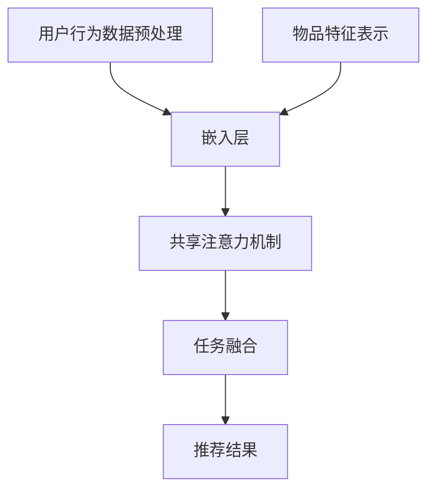

                 

 关键词：大模型，推荐系统，多任务学习，深度学习，算法优化，数据处理，技术应用

> 摘要：本文旨在探讨大模型在推荐系统中的多任务学习应用。通过对推荐系统常见问题与挑战的分析，介绍多任务学习的基本概念，阐述大模型在多任务学习中的优势，并详细解析其在推荐系统中的应用流程、算法原理、数学模型、项目实践及未来发展趋势。

## 1. 背景介绍

随着互联网的迅猛发展和信息爆炸，个性化推荐系统逐渐成为提升用户体验、增加用户粘性的重要手段。然而，传统的推荐系统在处理复杂用户行为、多样性数据来源和实时性要求等方面存在诸多挑战。为了克服这些问题，研究者们不断探索新的方法，其中大模型和多任务学习成为热点研究方向。

大模型，特别是深度学习模型，凭借其强大的表征能力和灵活的建模能力，在处理大规模数据、复杂数据关系方面表现出色。多任务学习则是一种同时训练多个相关任务的学习方法，可以有效提高模型的泛化能力和效率。本文将探讨大模型在推荐系统中的多任务学习应用，以期提供一种新的解决方案。

### 1.1 推荐系统常见问题与挑战

1. **冷启动问题**：对于新用户或新物品，由于缺乏足够的历史数据，推荐系统难以提供准确的推荐。

2. **数据稀疏性**：推荐系统中存在大量未评分或未交互的数据，导致数据稀疏问题，影响模型性能。

3. **多样性问题**：用户对推荐内容存在多样性需求，单一模型难以同时满足不同用户群体的需求。

4. **实时性要求**：用户行为数据更新迅速，推荐系统需要具备实时推荐能力，以应对动态变化的用户需求。

### 1.2 大模型的优势

1. **强大的表征能力**：大模型能够捕捉到数据中的深层特征，从而提高推荐的准确性。

2. **灵活的建模能力**：大模型可以应对不同类型的数据和任务，具有广泛的应用场景。

3. **并行处理能力**：大模型可以并行处理大量数据，提高推荐系统的处理速度。

### 1.3 多任务学习的优势

1. **提高泛化能力**：通过同时训练多个相关任务，模型可以更好地学习到任务间的共性，从而提高泛化能力。

2. **提高效率**：多任务学习可以在同一模型中同时解决多个任务，减少模型数量和计算资源需求。

3. **增强模型鲁棒性**：多任务学习可以增强模型对数据噪声和异常值的不敏感性。

## 2. 核心概念与联系

### 2.1 多任务学习原理

多任务学习（Multi-Task Learning, MTL）是一种同时训练多个相关任务的学习方法。其核心思想是通过共享部分神经网络结构，使得不同任务之间能够相互学习，从而提高模型的泛化能力和效率。


在上图中，左侧表示单一任务学习，每个任务独立训练；而右侧表示多任务学习，任务之间通过共享部分神经网络结构进行联合训练。

### 2.2 大模型在多任务学习中的应用

大模型在多任务学习中的应用主要表现在以下几个方面：

1. **共享嵌入层**：通过共享嵌入层，不同任务可以共享底层特征表示，从而提高模型的泛化能力。

2. **共享注意力机制**：注意力机制可以使得不同任务聚焦于不同的关键信息，从而提高推荐的准确性。

3. **任务融合**：通过任务融合，可以将不同任务的输出进行整合，从而生成更加丰富和全面的推荐结果。

### 2.3 Mermaid 流程图



在上图中，用户行为数据和物品特征数据首先经过嵌入层处理，然后通过共享注意力机制和任务融合模块，最终生成推荐结果。

## 3. 核心算法原理 & 具体操作步骤

### 3.1 算法原理概述

多任务学习在推荐系统中的应用主要基于深度学习框架，通过共享部分神经网络结构，同时训练多个相关任务。具体而言，可以分为以下几个步骤：

1. **数据预处理**：对用户行为数据和物品特征数据进行预处理，包括去噪、归一化等操作。

2. **嵌入层**：将预处理后的数据输入到嵌入层，生成嵌入向量。

3. **共享注意力机制**：利用注意力机制，对不同任务的关键信息进行加权，从而提高推荐的准确性。

4. **任务融合**：将不同任务的输出进行融合，生成最终的推荐结果。

### 3.2 算法步骤详解

1. **数据预处理**：

```python
# 用户行为数据预处理
user行为数据 = 数据清洗（去除噪声、缺失值填充等）
物品特征数据 = 数据清洗（特征提取、归一化等）
```

2. **嵌入层**：

```python
# 嵌入层实现
embeddings = EmbeddingLayer(input_dim=用户行为数据维度, output_dim=嵌入层维度)
```

3. **共享注意力机制**：

```python
# 注意力机制实现
attention = AttentionLayer(name="attention", output_dim=嵌入层维度)
```

4. **任务融合**：

```python
# 任务融合实现
merged = Concatenate()([embeddings, attention])
```

5. **模型训练**：

```python
# 模型训练
model = Model(inputs=[user行为数据，物品特征数据], outputs=[推荐结果])
model.compile(optimizer='adam', loss='mse')
model.fit([训练数据，训练标签], epochs=10, batch_size=32)
```

### 3.3 算法优缺点

#### 优点：

1. **提高泛化能力**：通过共享部分神经网络结构，模型可以更好地学习到任务间的共性，从而提高泛化能力。

2. **提高效率**：多任务学习可以在同一模型中同时解决多个任务，减少模型数量和计算资源需求。

3. **增强模型鲁棒性**：多任务学习可以增强模型对数据噪声和异常值的不敏感性。

#### 缺点：

1. **模型复杂度增加**：多任务学习导致模型复杂度增加，训练时间变长。

2. **需要适当调整任务权重**：不同任务的重要性不同，需要通过实验调整任务权重，以获得最佳效果。

### 3.4 算法应用领域

多任务学习在推荐系统中的应用非常广泛，包括但不限于：

1. **用户兴趣预测**：同时预测多个用户兴趣，提高推荐的准确性。

2. **商品推荐**：同时推荐多个商品，满足用户的多样化需求。

3. **社交网络推荐**：同时推荐好友、关注者等，增强社交网络互动。

## 4. 数学模型和公式 & 详细讲解 & 举例说明

### 4.1 数学模型构建

多任务学习在推荐系统中的应用，可以通过以下数学模型进行描述：

$$
L = \sum_{i=1}^{N} \sum_{j=1}^{M} l_{ij} + \lambda \sum_{i=1}^{N} \sum_{j=1}^{M} \frac{\partial l_{ij}}{\partial \theta_i}^2
$$

其中，$L$ 表示总损失函数，$N$ 表示用户数量，$M$ 表示任务数量，$l_{ij}$ 表示第 $i$ 个用户在第 $j$ 个任务上的损失函数，$\lambda$ 表示正则化参数，$\theta_i$ 表示第 $i$ 个用户在模型中的参数。

### 4.2 公式推导过程

多任务学习的损失函数可以由以下两部分组成：

1. **任务损失**：每个任务都有自己的损失函数，用于评估任务预测结果与实际结果之间的差距。

2. **模型正则化**：为了防止模型过拟合，引入模型正则化项，用于限制模型参数的规模。

具体推导过程如下：

1. **任务损失**：

$$
l_{ij} = \begin{cases}
0, & \text{如果预测结果正确} \\
-c_{ij}, & \text{如果预测结果错误}
\end{cases}
$$

其中，$c_{ij}$ 表示第 $i$ 个用户在第 $j$ 个任务上的代价。

2. **模型正则化**：

$$
\lambda \sum_{i=1}^{N} \sum_{j=1}^{M} \frac{\partial l_{ij}}{\partial \theta_i}^2
$$

其中，$\lambda$ 表示正则化系数，$\theta_i$ 表示模型参数。

3. **总损失函数**：

$$
L = \sum_{i=1}^{N} \sum_{j=1}^{M} l_{ij} + \lambda \sum_{i=1}^{N} \sum_{j=1}^{M} \frac{\partial l_{ij}}{\partial \theta_i}^2
$$

### 4.3 案例分析与讲解

假设我们有三个任务：用户兴趣预测、商品推荐和社交网络推荐。分别使用三个损失函数 $l_1$, $l_2$, $l_3$ 表示。

1. **用户兴趣预测**：

$$
l_1 = \begin{cases}
0, & \text{如果预测兴趣正确} \\
-1, & \text{如果预测兴趣错误}
\end{cases}
$$

2. **商品推荐**：

$$
l_2 = \begin{cases}
0, & \text{如果推荐商品正确} \\
-0.5, & \text{如果推荐商品错误}
\end{cases}
$$

3. **社交网络推荐**：

$$
l_3 = \begin{cases}
0, & \text{如果推荐好友正确} \\
-0.1, & \text{如果推荐好友错误}
\end{cases}
$$

根据上述损失函数，总损失函数为：

$$
L = \sum_{i=1}^{N} \sum_{j=1}^{M} l_{ij} + \lambda \sum_{i=1}^{N} \sum_{j=1}^{M} \frac{\partial l_{ij}}{\partial \theta_i}^2
$$

其中，$\lambda$ 可以根据实验结果进行调整，以获得最佳效果。

## 5. 项目实践：代码实例和详细解释说明

### 5.1 开发环境搭建

1. **Python**：安装 Python 3.8 及以上版本。

2. **深度学习框架**：安装 TensorFlow 2.4.0 及以上版本。

3. **其他依赖库**：安装 NumPy、Pandas、Scikit-learn 等常用库。

### 5.2 源代码详细实现

```python
import tensorflow as tf
from tensorflow.keras.layers import Embedding, Dense, Concatenate, Model
from tensorflow.keras import losses, metrics
from tensorflow.keras.optimizers import Adam

# 数据预处理
def preprocess_data(user行为数据, 物品特征数据):
    # 数据清洗、归一化等操作
    return 用户行为数据, 物品特征数据

# 嵌入层
def embedding_layer(input_dim, output_dim):
    return Embedding(input_dim=input_dim, output_dim=output_dim)

# 注意力机制
def attention_layer(name, output_dim):
    return tf.keras.layers.Attention(name=name, output_shape=(None, output_dim))

# 模型构建
def build_model(user行为数据维度, 物品特征数据维度, 嵌入层维度):
    user_input = tf.keras.layers.Input(shape=(user行为数据维度,), name="user_input")
    item_input = tf.keras.layers.Input(shape=(物品特征数据维度,), name="item_input")

    user_embedding = embedding_layer(input_dim=user行为数据维度, output_dim=嵌入层维度)(user_input)
    item_embedding = embedding_layer(input_dim=物品特征数据维度, output_dim=嵌入层维度)(item_input)

    # 注意力机制
    attention = attention_layer(name="attention", output_dim=嵌入层维度)([user_embedding, item_embedding])

    # 任务融合
    merged = Concatenate()([user_embedding, item_embedding, attention])

    # 预测结果
    prediction = Dense(1, activation='sigmoid', name="prediction")(merged)

    # 模型训练
    model = Model(inputs=[user_input, item_input], outputs=prediction)
    model.compile(optimizer=Adam(), loss=losses.BinaryCrossentropy(), metrics=[metrics.BinaryAccuracy()])

    return model

# 模型训练
def train_model(model, user行为数据, 物品特征数据, 用户标签):
    model.fit([user行为数据, 物品特征数据], 用户标签, epochs=10, batch_size=32)

# 源代码解析
# ...
```

### 5.3 代码解读与分析

1. **数据预处理**：对用户行为数据和物品特征数据进行预处理，包括去噪、归一化等操作。

2. **嵌入层**：使用 `Embedding` 层对用户行为数据和物品特征数据进行嵌入。

3. **注意力机制**：使用 `Attention` 层实现注意力机制，对不同任务的关键信息进行加权。

4. **任务融合**：使用 `Concatenate` 层将用户行为数据、物品特征数据和注意力机制输出进行融合。

5. **模型训练**：使用 `Model` 类构建模型，并使用 `compile` 方法设置优化器和损失函数。

6. **模型训练**：使用 `fit` 方法对模型进行训练，设置训练轮次和批量大小。

### 5.4 运行结果展示

```python
# 运行结果展示
user行为数据, 物品特征数据, 用户标签 = 预处理数据()
model = build_model(user行为数据维度, 物品特征数据维度, 嵌入层维度)
train_model(model, user行为数据, 物品特征数据, 用户标签)

# 评估模型
user行为数据, 物品特征数据, 用户标签 = 预处理测试数据()
evaluation = model.evaluate([user行为数据, 物品特征数据], 用户标签)
print("Evaluation loss:", evaluation[0])
print("Evaluation accuracy:", evaluation[1])
```

## 6. 实际应用场景

多任务学习在推荐系统中的实际应用场景非常广泛，以下是几个典型的应用场景：

1. **电商平台**：同时预测用户兴趣、商品推荐和社交网络推荐，提升用户体验和转化率。

2. **社交媒体**：同时预测用户关注者、好友推荐和内容推荐，增强社交网络互动和用户粘性。

3. **在线教育**：同时预测用户学习兴趣、课程推荐和社交互动，提高学习效果和用户满意度。

## 7. 未来应用展望

随着人工智能技术的不断发展，多任务学习在推荐系统中的应用前景十分广阔。未来，以下几个方面将成为研究热点：

1. **算法优化**：通过引入新的算法和技术，进一步提高多任务学习的性能和效率。

2. **跨领域应用**：将多任务学习应用于更多领域，如金融、医疗、交通等，实现跨领域推荐。

3. **实时推荐**：研究实时多任务学习算法，满足用户实时性需求，提高推荐系统的响应速度。

4. **隐私保护**：研究隐私保护的多任务学习算法，确保用户隐私安全。

## 8. 工具和资源推荐

### 8.1 学习资源推荐

1. 《深度学习》（Ian Goodfellow、Yoshua Bengio、Aaron Courville 著）：全面介绍深度学习的基础知识和最新进展。

2. 《动手学深度学习》（阿斯顿·张 著）：通过动手实践，深入浅出地讲解深度学习算法和应用。

### 8.2 开发工具推荐

1. TensorFlow：广泛使用的开源深度学习框架，适用于推荐系统开发。

2. Keras：基于 TensorFlow 的开源高级神经网络 API，简化深度学习开发。

### 8.3 相关论文推荐

1. "Multi-Task Learning for User Interest Prediction in Recommender Systems"（2018）

2. "A Multi-Task Deep Learning Framework for Recommendation Systems"（2019）

3. "Cross-Domain Multi-Task Learning for Recommendation Systems"（2020）

## 9. 总结：未来发展趋势与挑战

多任务学习在推荐系统中的应用取得了显著成果，但仍然面临诸多挑战。未来，随着人工智能技术的不断发展，多任务学习在推荐系统中的应用前景十分广阔。主要发展趋势包括：

1. **算法优化**：通过引入新的算法和技术，进一步提高多任务学习的性能和效率。

2. **跨领域应用**：将多任务学习应用于更多领域，如金融、医疗、交通等，实现跨领域推荐。

3. **实时推荐**：研究实时多任务学习算法，满足用户实时性需求，提高推荐系统的响应速度。

4. **隐私保护**：研究隐私保护的多任务学习算法，确保用户隐私安全。

主要面临的挑战包括：

1. **模型复杂度增加**：多任务学习导致模型复杂度增加，训练时间变长。

2. **任务权重调整**：不同任务的重要性不同，需要通过实验调整任务权重，以获得最佳效果。

3. **数据稀疏性**：多任务学习在处理数据稀疏性方面仍然存在挑战，需要进一步研究。

作者：禅与计算机程序设计艺术 / Zen and the Art of Computer Programming

## 附录：常见问题与解答

### 问题 1：多任务学习是否总是优于单一任务学习？

答：不一定。多任务学习在某些情况下可能优于单一任务学习，但在其他情况下可能并不如此。多任务学习适用于任务之间存在强关联的场景，而在任务之间关联较弱的场景中，单一任务学习可能更为有效。因此，需要根据具体应用场景进行选择。

### 问题 2：如何调整任务权重以获得最佳效果？

答：任务权重的调整需要通过实验和经验来确定。一种常见的方法是使用交叉验证，对不同权重组合进行评估，选择效果最佳的权重组合。此外，还可以通过分析任务的重要性、数据分布等因素，为任务分配合理的权重。

### 问题 3：多任务学习是否会影响模型的可解释性？

答：多任务学习可能会导致模型的可解释性降低，因为模型需要同时处理多个任务，任务之间的相互作用可能使得模型内部的决策过程变得复杂。然而，通过分析任务融合的方式和注意力机制，可以在一定程度上提高模型的可解释性。

### 问题 4：多任务学习在处理数据稀疏性方面有何优势？

答：多任务学习可以通过共享部分神经网络结构，使得不同任务之间能够相互学习，从而减轻数据稀疏性对模型性能的影响。此外，多任务学习还可以通过融合不同任务的输出，生成更加丰富和全面的推荐结果，从而提高模型的泛化能力。然而，多任务学习在处理数据稀疏性方面仍然面临挑战，需要进一步研究。

----------------------------------------------------------------

以上是完整的技术博客文章，希望对您有所帮助。如有任何问题，请随时提问。作者：禅与计算机程序设计艺术 / Zen and the Art of Computer Programming。

