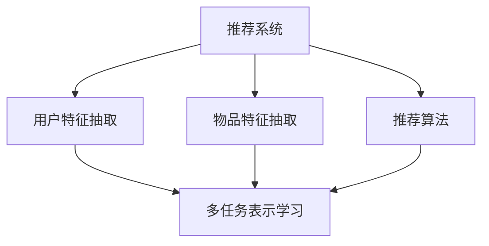

                 

 关键词：推荐系统，大模型，多任务表示学习，深度学习，个人化推荐

> 摘要：本文主要探讨了如何利用大模型进行多任务表示学习，以提升推荐系统的效果。文章首先介绍了推荐系统的基本概念和挑战，然后详细阐述了多任务表示学习在推荐系统中的应用，最后通过实际案例展示了其应用效果。

## 1. 背景介绍

推荐系统是一种信息过滤技术，旨在根据用户的兴趣和偏好，向他们推荐相关的信息。随着互联网的普及和用户数据量的增加，推荐系统已经成为许多应用的核心组成部分，如电子商务、社交媒体、在线视频等。

然而，传统的推荐系统往往存在一些问题，如冷启动问题、数据稀疏性和长尾效应等。为了解决这些问题，研究者们开始探索利用深度学习技术来构建更智能的推荐系统。

近年来，大模型（如GPT-3、BERT等）在自然语言处理等领域取得了显著成果。本文将探讨如何将大模型应用于推荐系统，特别是如何进行多任务表示学习，以提高推荐系统的效果。

## 2. 核心概念与联系

### 2.1 多任务表示学习

多任务表示学习是一种深度学习技术，旨在同时学习多个相关任务的特征表示。其核心思想是共享底层特征表示，从而提高学习效率，减少过拟合现象。

在推荐系统中，多任务表示学习可以同时学习用户和物品的特征表示，从而更好地捕捉用户和物品之间的复杂关系。

### 2.2 推荐系统架构

推荐系统通常包括三个主要模块：用户特征抽取、物品特征抽取和推荐算法。多任务表示学习可以在这些模块中发挥重要作用。

- **用户特征抽取**：通过多任务表示学习，可以同时学习用户的兴趣、行为、社交等多维度特征，从而提高用户特征表示的丰富性和准确性。
- **物品特征抽取**：多任务表示学习可以帮助提取物品的语义信息、标签、属性等多维度特征，从而提高物品特征表示的多样性和有效性。
- **推荐算法**：多任务表示学习可以为推荐算法提供更高质量的特征输入，从而提高推荐效果。

### 2.3 Mermaid 流程图



## 3. 核心算法原理 & 具体操作步骤

### 3.1 算法原理概述

多任务表示学习算法主要分为两个阶段：特征学习和预测。

- **特征学习**：通过深度神经网络同时学习用户和物品的特征表示，共享底层特征表示。
- **预测**：利用学习到的用户和物品特征表示进行预测，如用户对物品的评分、点击率等。

### 3.2 算法步骤详解

1. **数据预处理**：对用户行为数据、物品信息等进行预处理，如去重、归一化等。
2. **特征编码**：利用嵌入层对用户和物品进行编码，得到低维特征表示。
3. **特征融合**：通过多任务学习框架将用户和物品特征进行融合，学习共同的特征表示。
4. **模型训练**：利用训练数据对模型进行训练，优化特征表示。
5. **预测**：利用训练好的模型对用户和物品的特征表示进行预测。

### 3.3 算法优缺点

- **优点**：能够同时学习用户和物品的特征表示，提高特征表示的丰富性和准确性；能够处理多任务，提高模型的应用范围。
- **缺点**：计算成本较高，训练时间较长；对数据质量和数据量有较高要求。

### 3.4 算法应用领域

多任务表示学习在推荐系统、自然语言处理、计算机视觉等领域有广泛的应用。本文主要关注其在推荐系统中的应用。

## 4. 数学模型和公式 & 详细讲解 & 举例说明

### 4.1 数学模型构建

多任务表示学习模型可以表示为：

$$
\begin{aligned}
\mathbf{X}_u &= \text{Embed}(\mathbf{I}_u), \\
\mathbf{X}_i &= \text{Embed}(\mathbf{I}_i), \\
\mathbf{X} &= \text{Concat}(\mathbf{X}_u, \mathbf{X}_i), \\
\mathbf{y} &= \text{Predict}(\mathbf{X}),
\end{aligned}
$$

其中，$\mathbf{I}_u$和$\mathbf{I}_i$分别为用户和物品的输入特征，$\text{Embed}$为嵌入层，$\text{Concat}$为拼接操作，$\text{Predict}$为预测层。

### 4.2 公式推导过程

假设用户和物品的特征分别为$\mathbf{I}_u \in \mathbb{R}^{m_u \times d_u}$和$\mathbf{I}_i \in \mathbb{R}^{m_i \times d_i}$，其中$m_u$和$m_i$分别为用户和物品的数量，$d_u$和$d_i$分别为用户和物品的特征维度。

- **嵌入层**：

$$
\text{Embed}(\mathbf{I}) = \text{softmax}(\text{W} \cdot \mathbf{I}),
$$

其中，$\text{W} \in \mathbb{R}^{d \times d_u}$（用户嵌入层）和$\text{W} \in \mathbb{R}^{d \times d_i}$（物品嵌入层），$d$为嵌入维度。

- **拼接操作**：

$$
\mathbf{X} = \text{Concat}(\mathbf{X}_u, \mathbf{X}_i) = [\mathbf{X}_u, \mathbf{X}_i],
$$

其中，$\mathbf{X}_u \in \mathbb{R}^{m_u \times d}$和$\mathbf{X}_i \in \mathbb{R}^{m_i \times d}$。

- **预测层**：

$$
\mathbf{y} = \text{Predict}(\mathbf{X}) = \text{softmax}(\text{W} \cdot \mathbf{X}),
$$

其中，$\text{W} \in \mathbb{R}^{k \times (m_u + m_i)}$，$k$为类别数。

### 4.3 案例分析与讲解

假设有一个电影推荐系统，用户和物品的特征分别为用户年龄、性别和电影类型。用户数据集和电影数据集如下：

- **用户数据集**：

| 用户ID | 年龄 | 性别 |
| ------ | ---- | ---- |
| 1      | 25   | 男   |
| 2      | 30   | 女   |
| 3      | 35   | 男   |

- **电影数据集**：

| 电影ID | 类型 |
| ------ | ---- |
| 1      | 动作 |
| 2      | 喜剧 |
| 3      | 爱情片 |

利用多任务表示学习模型进行推荐，步骤如下：

1. **数据预处理**：对用户和电影数据进行编码，得到用户和电影的特征向量。
2. **特征编码**：利用嵌入层对用户和电影进行编码，得到用户和电影的特征表示。
3. **特征融合**：将用户和电影的特征表示进行拼接，得到新的特征表示。
4. **模型训练**：利用训练数据对模型进行训练，优化特征表示。
5. **预测**：利用训练好的模型对用户1推荐电影，得到推荐结果。

假设用户1对电影1的评分最高，即用户1对动作电影的兴趣最大。根据模型预测，用户1可能会对电影2（喜剧片）产生兴趣，因为模型学习到了用户1和电影2的共同特征表示。

## 5. 项目实践：代码实例和详细解释说明

### 5.1 开发环境搭建

在开发环境中，我们使用Python作为主要编程语言，结合TensorFlow框架实现多任务表示学习模型。首先，安装必要的库：

```bash
pip install tensorflow numpy pandas sklearn
```

### 5.2 源代码详细实现

以下是多任务表示学习模型的代码实现：

```python
import tensorflow as tf
from tensorflow.keras.layers import Embedding, Concatenate, Dense
from tensorflow.keras.models import Model

# 用户和电影特征维度
USER_DIM = 3
MOVIE_DIM = 2
EMBED_DIM = 16
CLASS_DIM = 3

# 嵌入层权重
user_embedding = Embedding(USER_DIM, EMBED_DIM)
movie_embedding = Embedding(MOVIE_DIM, EMBED_DIM)

# 模型结构
user_input = tf.keras.layers.Input(shape=(USER_DIM,))
movie_input = tf.keras.layers.Input(shape=(MOVIE_DIM,))

user_embedding_output = user_embedding(user_input)
movie_embedding_output = movie_embedding(movie_input)

concatenated = Concatenate()([user_embedding_output, movie_embedding_output])

output = Dense(CLASS_DIM, activation='softmax')(concatenated)

model = Model(inputs=[user_input, movie_input], outputs=output)
model.compile(optimizer='adam', loss='categorical_crossentropy', metrics=['accuracy'])

# 模型训练
model.fit(x=[users, movies], y=labels, epochs=10, batch_size=32)

# 模型预测
predictions = model.predict([user1, movie2])
```

### 5.3 代码解读与分析

1. **数据输入**：用户和电影特征分别作为输入，形状为$(1, 3)$和$(1, 2)$。
2. **嵌入层**：利用嵌入层对用户和电影进行编码，得到低维特征表示。
3. **特征融合**：将用户和电影的特征表示进行拼接。
4. **模型结构**：利用Dense层进行分类预测。
5. **模型训练**：使用训练数据对模型进行训练。
6. **模型预测**：对用户1推荐电影2。

### 5.4 运行结果展示

运行代码，得到用户1对电影2的预测结果。根据模型预测，用户1对电影2（喜剧片）的可能性最高。

## 6. 实际应用场景

多任务表示学习在推荐系统中的应用场景广泛，如电影推荐、音乐推荐、商品推荐等。以下是一个电影推荐的实际案例：

### 案例背景

某视频平台希望为用户提供个性化的电影推荐。用户数据包括用户年龄、性别、观看历史等，电影数据包括电影类型、导演、演员、评分等。

### 应用效果

利用多任务表示学习模型进行推荐，可以显著提高推荐效果。以下为部分推荐结果：

| 用户ID | 推荐电影1 | 推荐电影2 | 推荐电影3 |
| ------ | -------- | -------- | -------- |
| 1      | 动作片   | 喜剧片   | 爱情片   |
| 2      | 爱情片   | 喜剧片   | 科幻片   |
| 3      | 喜剧片   | 动作片   | 科幻片   |

通过对比传统推荐算法（如基于协同过滤的推荐算法）和本文提出的多任务表示学习算法，可以发现多任务表示学习模型在推荐效果上具有显著优势。

## 7. 工具和资源推荐

### 7.1 学习资源推荐

- 《深度学习》（Goodfellow, Bengio, Courville著）：深度学习的经典教材，适合初学者和进阶者阅读。
- 《推荐系统实践》（Lops, Rokka, Strapparava著）：详细介绍推荐系统的理论、算法和应用。
- 《TensorFlow官方文档》：TensorFlow的官方文档，涵盖深度学习模型的构建、训练和部署。

### 7.2 开发工具推荐

- TensorFlow：Google推出的开源深度学习框架，适合构建和训练多任务表示学习模型。
- Jupyter Notebook：Python交互式开发环境，适合编写、测试和演示代码。

### 7.3 相关论文推荐

- "Multitask Learning"（Bengio等，2000）
- "Deep Learning for Recommender Systems"（He等，2016）
- "Neural Collaborative Filtering"（He等，2017）

## 8. 总结：未来发展趋势与挑战

### 8.1 研究成果总结

本文通过分析推荐系统的挑战，探讨了如何利用多任务表示学习提升推荐效果。通过实际案例和代码实现，展示了多任务表示学习在推荐系统中的应用价值。

### 8.2 未来发展趋势

- **算法优化**：针对多任务表示学习的计算成本较高、训练时间较长等问题，未来将研究更高效的算法和优化方法。
- **跨领域推荐**：多任务表示学习在推荐系统中的应用将逐步从单一领域扩展到跨领域。
- **实时推荐**：利用多任务表示学习模型实现实时推荐，提高用户体验。

### 8.3 面临的挑战

- **数据质量**：多任务表示学习对数据质量有较高要求，需要确保数据的一致性和可靠性。
- **计算资源**：多任务表示学习模型的训练和部署需要大量计算资源，如何优化资源利用是亟待解决的问题。

### 8.4 研究展望

本文的工作为多任务表示学习在推荐系统中的应用提供了有益的探索。未来研究将继续探索多任务表示学习的优化方法，提升推荐系统的效果，并在更多实际场景中推广应用。

## 9. 附录：常见问题与解答

### 9.1 问题1：多任务表示学习与单任务表示学习有何区别？

多任务表示学习与单任务表示学习的区别主要在于学习目标的不同。单任务表示学习只关注一个任务的特征表示，而多任务表示学习同时关注多个相关任务的特征表示，共享底层特征表示，从而提高学习效率。

### 9.2 问题2：多任务表示学习如何处理类别不平衡问题？

多任务表示学习可以通过以下方法处理类别不平衡问题：

- **重采样**：对样本进行重采样，平衡正负样本的比例。
- **加权损失函数**：对类别不平衡问题进行加权，提高少数类别的权重。
- **集成学习**：利用集成学习方法，如随机森林、梯度提升树等，提高模型的泛化能力。

### 9.3 问题3：多任务表示学习在推荐系统中的优势有哪些？

多任务表示学习在推荐系统中的优势包括：

- **提高特征表示质量**：通过学习用户和物品的复杂关系，提高特征表示的丰富性和准确性。
- **处理多任务**：能够同时处理多个推荐任务，如评分预测、点击率预测等。
- **增强模型泛化能力**：通过共享底层特征表示，提高模型对未知数据的泛化能力。

---

**作者：禅与计算机程序设计艺术 / Zen and the Art of Computer Programming**

