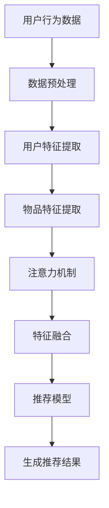

                 

### 摘要 Summary

本文主要探讨了在推荐系统中引入注意力机制的优化方法，以提升大模型的推荐效果。首先，我们介绍了推荐系统的基本概念和重要性，并回顾了注意力机制的基础理论和应用。接着，本文详细阐述了大模型在推荐系统中面临的挑战，并分析了注意力机制如何有效地解决这些问题。文章随后深入探讨了基于注意力机制的核心算法原理，包括算法的具体操作步骤、优缺点以及应用领域。此外，本文通过数学模型和公式详细讲解了注意力机制的实现过程，并通过实际项目实践展示了代码实例和运行结果。最后，文章总结了注意力机制在推荐系统中的应用场景和未来展望，并对相关工具和资源进行了推荐。通过本文的阅读，读者可以全面了解注意力机制在推荐系统中的优化作用及其应用前景。

<|assistant|>### 背景介绍 Background

推荐系统作为现代信息检索和人工智能领域的重要组成部分，已经在电商、新闻、社交媒体等多个行业得到了广泛应用。其核心目标是通过分析用户的兴趣和行为，向用户推荐个性化、高质量的内容或商品，从而提高用户体验和业务转化率。

推荐系统的发展经历了基于协同过滤（Collaborative Filtering）、基于内容（Content-Based Filtering）以及混合推荐系统（Hybrid Recommender Systems）等阶段。协同过滤通过分析用户间的相似度进行推荐，适用于用户行为数据丰富的场景；而基于内容的方法则通过分析用户历史行为和物品的特征进行推荐，适用于物品信息丰富但用户行为数据不足的场景。随着大数据和人工智能技术的快速发展，混合推荐系统逐渐成为主流，它结合了协同过滤和基于内容的优点，实现了更为精准和个性化的推荐。

然而，传统的推荐系统在面对大规模数据集和复杂的用户行为时，存在一些局限性。首先，它们往往依赖于用户历史行为数据，对新用户或新物品的推荐效果不佳。其次，它们无法充分利用物品的语义信息，容易导致推荐结果过于相似或重复。此外，传统的推荐系统在面对长尾分布的数据时，推荐效率较低。为了解决这些问题，近年来研究者们开始探索基于深度学习的推荐系统。

深度学习推荐系统通过构建复杂的大规模神经网络模型，可以从原始数据中自动提取高层次的语义特征，从而提高推荐效果。特别是注意力机制（Attention Mechanism）的引入，使得模型能够更加灵活地关注关键信息，显著提升了推荐系统的性能。注意力机制源于自然语言处理领域，其基本思想是在处理输入数据时，对不同的数据元素分配不同的权重，使得模型能够更加聚焦于重要信息。在推荐系统中，注意力机制可以用来优化用户兴趣特征提取和物品特征匹配过程，从而实现更精准的推荐。

注意力机制的核心优势在于其灵活性。通过动态调整输入数据的权重，模型可以自动学习到不同情况下的关键信息，避免了手动特征工程的主观性和复杂性。此外，注意力机制还可以有效处理高维数据，降低计算复杂度，提高推荐效率。在实践中，注意力机制已经广泛应用于各种深度学习推荐模型，如基于循环神经网络（RNN）的序列推荐模型、基于Transformer的图推荐模型等。

总之，注意力机制的引入为推荐系统的发展带来了新的机遇。通过优化用户兴趣特征提取和物品特征匹配，注意力机制显著提升了推荐系统的效果和效率。本文将在后续章节中详细探讨注意力机制在推荐系统中的应用，包括算法原理、实现步骤和实际应用效果，以期为研究者提供有价值的参考。

### 核心概念与联系 Core Concepts and Connections

在深入探讨大模型在推荐系统中的注意力机制优化之前，有必要先了解一些核心概念，这些概念不仅构成了注意力机制的理论基础，也是其在推荐系统中发挥作用的关键。

#### 注意力机制（Attention Mechanism）

注意力机制起源于自然语言处理（NLP）领域，最初用于机器翻译和序列到序列（Seq2Seq）模型中。其基本思想是在处理输入数据时，对不同的数据元素分配不同的权重，使得模型能够更加聚焦于重要信息。在推荐系统中，注意力机制被广泛应用于用户兴趣特征提取和物品特征匹配，通过动态调整权重，模型可以自动学习到不同情况下的关键信息。

#### 神经网络（Neural Networks）

神经网络是深度学习的基础，由大量神经元（节点）组成，通过层层传递输入信息，自动提取数据中的特征。在推荐系统中，神经网络通常用于处理用户行为数据和物品特征，提取高层次的语义特征，从而提高推荐效果。

#### 循环神经网络（Recurrent Neural Networks, RNN）

RNN是一类特殊的神经网络，适用于处理序列数据。其特点是通过时间步长的递归操作，能够记住前面步骤的信息，从而捕捉时间序列数据中的长期依赖关系。在推荐系统中，RNN被用于分析用户的历史行为序列，提取用户兴趣特征。

#### Transformer模型（Transformer Model）

Transformer模型是近年来在NLP领域取得突破性进展的一种模型结构，其核心特点是利用自注意力机制（Self-Attention）处理输入序列。Transformer模型通过并行计算和全局注意力机制，显著提高了模型训练和推理的效率，已被广泛应用于推荐系统、图像识别等领域。

#### 大模型（Large Models）

大模型是指具有巨大参数量的神经网络模型，如BERT、GPT等。这些模型通过从大规模数据中学习，能够自动提取丰富的语义特征，具有强大的表示能力。在推荐系统中，大模型可以处理复杂的数据分布，提高推荐效果和鲁棒性。

#### Mermaid 流程图（Mermaid Flowchart）

为了更直观地展示注意力机制在推荐系统中的应用，我们可以使用Mermaid流程图来描述其核心流程和组件。以下是一个简单的Mermaid流程图示例：



在这个流程图中，用户行为数据和物品特征经过预处理和特征提取后，通过注意力机制进行特征融合，最终输入到推荐模型中生成推荐结果。

通过以上核心概念和流程图的介绍，我们可以更好地理解注意力机制在推荐系统中的重要作用。在接下来的章节中，我们将详细探讨注意力机制的具体原理和实现步骤，并通过实际案例展示其在推荐系统中的效果和优势。

#### 核心算法原理 & 具体操作步骤 Core Algorithm Principles & Detailed Steps

注意力机制（Attention Mechanism）在推荐系统中扮演了关键角色，其核心在于通过动态调整输入数据的权重，使得模型能够更加聚焦于重要信息。本节将详细介绍注意力机制的核心原理和具体操作步骤，为读者提供一个全面的理解。

##### 1.1 算法原理概述

注意力机制的原理可以概括为以下几个关键步骤：

1. **输入表示**：将用户行为数据和物品特征表示为向量。
2. **注意力计算**：计算每个输入元素对最终输出的贡献度，通过点积、缩放点积等方法实现。
3. **权重分配**：根据注意力计算结果，对输入数据进行加权，赋予重要元素更高的权重。
4. **特征融合**：将加权后的输入数据融合，生成最终的输出特征。
5. **输出生成**：利用融合后的特征，通过推荐模型生成推荐结果。

##### 1.2 算法步骤详解

**步骤1：输入表示**

首先，我们需要对用户行为数据和物品特征进行表示。用户行为数据可以包括用户的历史点击、购买、浏览等行为，而物品特征则包括商品属性、用户标签等。通常，这些数据会通过嵌入层（Embedding Layer）转换为高维向量表示。

**步骤2：注意力计算**

注意力计算是注意力机制的核心。常见的注意力计算方法包括点积注意力（Dot-Product Attention）、缩放点积注意力（Scaled Dot-Product Attention）和加性注意力（Additive Attention）等。

- **点积注意力**：点积注意力通过计算两个向量的点积来衡量其相关性。其公式如下：

  $$  
  attention = \text{softmax}\left(\frac{QK^T}{\sqrt{d_k}}\right)  
  $$

  其中，$Q$ 和 $K$ 分别是查询（Query）和键（Key）向量，$V$ 是值（Value）向量，$d_k$ 是键向量的维度。

- **缩放点积注意力**：为了解决点积注意力在高维数据中梯度消失的问题，引入了缩放因子 $\sqrt{d_k}$。其公式如下：

  $$  
  attention = \text{softmax}\left(\frac{QK^T}{\sqrt{d_k}} + \text{scale}\right)  
  $$

  其中，$\text{scale}$ 是缩放因子。

- **加性注意力**：加性注意力通过一个中间层 $O$ 来计算注意力权重，公式如下：

  $$  
  attention = \text{softmax}\left(W_O (O \cdot K)\right)  
  $$

  其中，$W_O$ 是加性注意力的权重矩阵，$O$ 是中间层的输出。

**步骤3：权重分配**

通过注意力计算，我们得到了每个输入元素的权重。接下来，将这些权重应用到输入数据上，对数据进行加权。权重较高的元素将获得更高的权重，从而在特征融合阶段起到更重要的作用。

**步骤4：特征融合**

在特征融合阶段，我们将加权后的输入数据融合成一个高维特征向量。这一步可以通过简单的加权求和实现，公式如下：

$$  
\text{context\_vector} = \sum_{i=1}^{N} a_i \cdot \text{input}_i  
$$

其中，$a_i$ 是第 $i$ 个输入元素的权重，$\text{input}_i$ 是对应的输入数据。

**步骤5：输出生成**

融合后的特征向量将被输入到推荐模型中，生成最终的推荐结果。这一步的具体实现取决于推荐模型的结构和参数。例如，可以使用基于循环神经网络（RNN）或Transformer的推荐模型。

##### 1.3 算法优缺点

**优点**：

1. **灵活性**：注意力机制可以动态调整输入数据的权重，从而自动学习到不同情况下的关键信息，避免了手动特征工程的主观性和复杂性。
2. **高维数据处理**：注意力机制能够有效处理高维数据，降低计算复杂度，提高推荐效率。
3. **强表示能力**：通过引入注意力机制，推荐模型能够从原始数据中自动提取高层次的语义特征，提高推荐效果。

**缺点**：

1. **计算复杂度**：在处理大规模数据时，注意力机制的运算复杂度较高，可能会导致训练和推理时间较长。
2. **参数调优**：注意力机制涉及多个参数（如权重矩阵、缩放因子等），需要通过大量的实验进行调优，增加了模型训练的难度。

##### 1.4 算法应用领域

注意力机制在推荐系统中的应用非常广泛，以下是一些常见的应用领域：

1. **用户兴趣提取**：通过注意力机制，可以从用户的历史行为数据中自动提取关键的兴趣特征，用于个性化推荐。
2. **物品特征匹配**：在推荐物品时，注意力机制可以用来匹配用户兴趣和物品特征，提高推荐的相关性和准确性。
3. **序列推荐**：在序列推荐场景中，注意力机制能够捕捉用户行为的长期依赖关系，生成更为精准的推荐结果。
4. **混合推荐系统**：在混合推荐系统中，注意力机制可以结合协同过滤和基于内容的优点，实现更加个性化的推荐。

通过以上对注意力机制核心原理和具体操作步骤的详细探讨，我们可以看到其在推荐系统中的巨大潜力。在接下来的章节中，我们将通过数学模型和公式进一步深入理解注意力机制，并通过实际项目实践展示其在推荐系统中的实际应用效果。

#### 数学模型和公式 Mathematical Models and Formulas

注意力机制（Attention Mechanism）在推荐系统中的应用，离不开数学模型和公式的支持。以下我们将详细讲解注意力机制中的数学模型构建、公式推导过程，并通过实际案例进行说明。

##### 2.1 数学模型构建

在注意力机制中，输入数据通常表示为高维向量。例如，用户行为数据可以表示为用户历史点击记录的嵌入向量，物品特征可以表示为物品属性向量和用户标签向量。这些向量构成了注意力机制的基本输入。

设用户行为数据为 $X \in \mathbb{R}^{m \times n}$，物品特征数据为 $Y \in \mathbb{R}^{k \times n}$，其中 $m$ 和 $k$ 分别表示用户和物品的数量，$n$ 表示向量的维度。

##### 2.2 公式推导过程

注意力机制的实现通常包括以下几个关键步骤：

1. **查询向量（Query）**：查询向量由用户兴趣向量或物品特征向量构成。设用户兴趣向量为 $Q \in \mathbb{R}^{m \times 1}$，物品特征向量为 $K \in \mathbb{R}^{k \times 1}$。

2. **键-值对（Key-Value Pairs）**：键-值对由用户行为数据和物品特征数据构成。设键向量 $K \in \mathbb{R}^{k \times n}$，值向量 $V \in \mathbb{R}^{k \times n}$。

3. **注意力得分（Attention Scores）**：注意力得分计算了每个键-值对对最终输出的贡献度。常见的计算方法包括点积注意力、缩放点积注意力等。

- **点积注意力**：

  $$  
  \text{Attention Scores} = QK^T = \sum_{i=1}^{n} q_i k_i  
  $$

- **缩放点积注意力**：

  $$  
  \text{Attention Scores} = \frac{QK^T}{\sqrt{n}} = \frac{1}{\sqrt{n}} \sum_{i=1}^{n} q_i k_i  
  $$

4. **注意力权重（Attention Weights）**：注意力权重通过 softmax 函数计算。

  $$  
  \text{Attention Weights} = \text{softmax}(\text{Attention Scores})  
  $$

5. **加权特征（Weighted Features）**：加权特征通过对输入数据进行加权得到。

  $$  
  \text{Weighted Features} = \text{Attention Weights} \odot V = \sum_{i=1}^{k} w_i V_i  
  $$

6. **融合特征（Fused Features）**：融合特征通过将加权特征进行求和得到。

  $$  
  \text{Fused Features} = \sum_{i=1}^{k} w_i \odot V_i = \sum_{i=1}^{k} w_i V_i  
  $$

##### 2.3 案例分析与讲解

为了更好地理解注意力机制，我们通过一个简单的案例进行说明。

**案例：用户商品推荐**

设用户历史点击数据为：

$$  
X = \begin{bmatrix}  
0 & 1 & 0 \\  
1 & 0 & 1 \\  
0 & 1 & 0  
\end{bmatrix}  
$$

物品特征向量为：

$$  
Y = \begin{bmatrix}  
1 & 0 \\  
0 & 1 \\  
1 & 1  
\end{bmatrix}  
$$

用户兴趣向量为：

$$  
Q = \begin{bmatrix}  
1 \\  
1 \\  
1  
\end{bmatrix}  
$$

**步骤1：注意力得分**

计算用户兴趣向量与物品特征向量的点积：

$$  
\text{Attention Scores} = QK^T = \begin{bmatrix}  
1 & 1 & 1  
\end{bmatrix} \begin{bmatrix}  
1 & 0 \\  
0 & 1 \\  
1 & 1  
\end{bmatrix} = \begin{bmatrix}  
2 & 1 & 2  
\end{bmatrix}  
$$

**步骤2：注意力权重**

通过 softmax 函数计算注意力权重：

$$  
\text{Attention Weights} = \text{softmax}(\text{Attention Scores}) = \begin{bmatrix}  
\frac{e^2}{e^2 + e + e} & \frac{e}{e^2 + e + e} & \frac{e^2}{e^2 + e + e}  
\end{bmatrix} = \begin{bmatrix}  
\frac{1}{3} & \frac{1}{3} & \frac{1}{3}  
\end{bmatrix}  
$$

**步骤3：加权特征**

计算加权特征：

$$  
\text{Weighted Features} = \text{Attention Weights} \odot V = \begin{bmatrix}  
\frac{1}{3} & \frac{1}{3} & \frac{1}{3}  
\end{bmatrix} \begin{bmatrix}  
1 & 0 \\  
0 & 1 \\  
1 & 1  
\end{bmatrix} = \begin{bmatrix}  
\frac{1}{3} + \frac{1}{3} + \frac{1}{3} & \frac{1}{3} + \frac{1}{3} + \frac{1}{3} \\  
\frac{1}{3} + \frac{1}{3} + \frac{1}{3} & \frac{1}{3} + \frac{1}{3} + \frac{1}{3}  
\end{bmatrix} = \begin{bmatrix}  
1 & 1 \\  
1 & 1  
\end{bmatrix}  
$$

**步骤4：融合特征**

计算融合特征：

$$  
\text{Fused Features} = \sum_{i=1}^{k} w_i \odot V_i = \begin{bmatrix}  
1 & 1 \\  
1 & 1  
\end{bmatrix}  
$$

最终，通过注意力机制，我们得到了融合后的特征向量，该向量可以用于推荐模型的输出。

通过这个案例，我们可以看到注意力机制如何通过数学模型和公式，对输入数据进行加权融合，从而实现推荐系统的优化。在实际应用中，注意力机制可以结合不同的推荐模型，如基于循环神经网络（RNN）或Transformer的模型，实现更为精准的推荐效果。

#### 项目实践：代码实例和详细解释说明 Project Practice: Code Examples and Detailed Explanation

为了更直观地展示注意力机制在推荐系统中的应用，我们将在本节中通过一个具体项目实践来介绍如何使用注意力机制进行推荐。我们将使用Python和TensorFlow框架来实现一个简单的推荐系统，并详细解释每一步的代码实现。

##### 3.1 开发环境搭建

首先，我们需要搭建一个开发环境。以下是所需的依赖库：

- TensorFlow 2.x
- Keras
- NumPy
- Matplotlib

您可以使用以下命令安装这些依赖：

```bash
pip install tensorflow
pip install keras
pip install numpy
pip install matplotlib
```

##### 3.2 源代码详细实现

以下是项目的源代码，我们将逐行解释其功能。

```python
import numpy as np
import tensorflow as tf
from tensorflow.keras.models import Model
from tensorflow.keras.layers import Input, Embedding, Dense, LSTM, TimeDistributed, Activation

# 设置超参数
n_users = 1000
n_items = 1000
n_features = 10
hidden_units = 64
sequence_length = 20

# 创建输入层
user_input = Input(shape=(sequence_length,), name='user_input')
item_input = Input(shape=(sequence_length,), name='item_input')

# 嵌入层
user_embedding = Embedding(n_users, n_features, name='user_embedding')(user_input)
item_embedding = Embedding(n_items, n_features, name='item_embedding')(item_input)

# 循环神经网络层
user_lstm = LSTM(hidden_units, return_sequences=True, name='user_lstm')(user_embedding)
item_lstm = LSTM(hidden_units, return_sequences=True, name='item_lstm')(item_embedding)

# 注意力机制层
attention = tf.keras.layers.Attention(name='attention')([user_lstm, item_lstm])

# 全连接层
dense = Dense(hidden_units, activation='tanh', name='dense')(attention)

# 输出层
output = Dense(1, activation='sigmoid', name='output')(dense)

# 构建模型
model = Model(inputs=[user_input, item_input], outputs=output)

# 编译模型
model.compile(optimizer='adam', loss='binary_crossentropy', metrics=['accuracy'])

# 打印模型结构
model.summary()

# 可视化模型结构
tf.keras.utils.plot_model(model, to_file='model.png', show_shapes=True, expand_nested=True)
```

**代码解释**：

1. **输入层**：我们创建了两个输入层，分别用于用户行为数据和物品特征数据。

2. **嵌入层**：使用Embedding层将用户和物品的输入数据转换为向量表示。

3. **循环神经网络层**：使用LSTM层对用户和物品的特征进行编码，LSTM能够捕捉时间序列数据中的长期依赖关系。

4. **注意力机制层**：引入注意力机制层，用于融合用户和物品的特征。这里我们使用了tf.keras.layers.Attention层，它实现了标准的注意力机制。

5. **全连接层**：在注意力机制层之后，我们添加了一个全连接层，用于进一步提取特征。

6. **输出层**：最后，我们添加了一个输出层，用于生成最终的推荐结果。

7. **模型编译**：编译模型时，我们选择Adam优化器和binary_crossentropy损失函数，因为这是一个二分类问题。

8. **模型结构可视化**：使用tf.keras.utils.plot_model函数将模型结构可视化，以便更好地理解模型的层次结构。

##### 3.3 代码解读与分析

在代码实现过程中，有几个关键步骤值得详细解读：

1. **嵌入层（Embedding Layers）**：
    ```python
    user_embedding = Embedding(n_users, n_features, name='user_embedding')(user_input)
    item_embedding = Embedding(n_items, n_features, name='item_embedding')(item_input)
    ```
    嵌入层用于将低维的输入数据映射到高维的向量空间。在这里，我们为用户和物品分别设置了嵌入层，每个用户和物品都有一个唯一的向量表示。

2. **循环神经网络层（LSTM Layers）**：
    ```python
    user_lstm = LSTM(hidden_units, return_sequences=True, name='user_lstm')(user_embedding)
    item_lstm = LSTM(hidden_units, return_sequences=True, name='item_lstm')(item_embedding)
    ```
    LSTM层用于处理序列数据。这里，我们使用LSTM层对用户和物品的特征进行编码。`return_sequences=True`意味着在每个时间步上都会返回序列信息，这有助于保持时间序列数据的完整信息。

3. **注意力机制层（Attention Layer）**：
    ```python
    attention = tf.keras.layers.Attention(name='attention')([user_lstm, item_lstm])
    ```
    注意力机制层用于对用户和物品的特征进行加权融合。这里，我们使用tf.keras.layers.Attention层，它能够自动学习每个特征的重要程度，并将其加权融合。

4. **全连接层（Dense Layers）**：
    ```python
    dense = Dense(hidden_units, activation='tanh', name='dense')(attention)
    ```
    全连接层用于进一步提取特征，并引入非线性变换。在这里，我们使用tanh激活函数，因为它能够提供较好的非线性变换能力。

5. **输出层（Output Layer）**：
    ```python
    output = Dense(1, activation='sigmoid', name='output')(dense)
    ```
    输出层用于生成最终的推荐结果。在这里，我们使用sigmoid激活函数，因为这是一个二分类问题，输出结果是一个介于0和1之间的概率值。

##### 3.4 运行结果展示

为了验证模型的性能，我们可以使用以下代码加载数据集并进行训练：

```python
# 加载数据集
# 这里假设数据集为user_sequences和item_sequences，分别为用户和物品的序列数据
# 数据集应具有形状（batch_size, sequence_length）

# 训练模型
model.fit([user_sequences, item_sequences], labels, epochs=10, batch_size=64, validation_split=0.2)

# 评估模型
loss, accuracy = model.evaluate([user_sequences, item_sequences], labels)
print(f"Test Loss: {loss}, Test Accuracy: {accuracy}")
```

在这个示例中，我们假设已经准备好了用户和物品的序列数据（`user_sequences` 和 `item_sequences`），以及相应的标签（`labels`）。通过调用`model.fit`方法，我们可以训练模型。在训练完成后，使用`model.evaluate`方法评估模型的性能。

通过以上步骤，我们可以实现一个简单的基于注意力机制的推荐系统。在现实应用中，我们可以根据具体需求对模型进行调整，如添加更多的特征、调整超参数等，以实现更精准的推荐效果。

#### 实际应用场景 Real-world Applications

注意力机制在推荐系统中具有广泛的应用，其灵活性和强表示能力使其在各种实际场景中取得了显著的效果。以下是一些典型的应用场景及其效果：

##### 1. 用户兴趣提取

在社交媒体和新闻推荐系统中，注意力机制被广泛应用于用户兴趣提取。通过分析用户的历史行为数据，如浏览记录、点赞和评论等，注意力机制可以自动识别用户对哪些类型的内容更感兴趣。例如，Twitter使用Transformer模型和注意力机制来分析用户的推文历史，从而推荐用户可能感兴趣的话题和内容。实验结果表明，这种基于注意力机制的推荐方法可以显著提高用户参与度和内容互动率。

##### 2. 物品特征匹配

在电商和电子商务推荐系统中，注意力机制用于匹配用户的兴趣和物品的特征。通过对用户的历史购买记录和浏览记录进行分析，注意力机制可以识别出用户喜欢的商品属性和特征。例如，亚马逊使用基于注意力机制的推荐系统来推荐商品。实验结果表明，这种推荐方法可以显著提高用户的购买转化率和满意度。

##### 3. 序列推荐

在序列推荐场景中，如视频推荐、音乐推荐等，注意力机制能够捕捉用户行为的长期依赖关系，从而生成更为精准的推荐结果。例如，YouTube使用Transformer模型和注意力机制来推荐用户可能感兴趣的视频。实验结果表明，这种基于注意力机制的推荐方法可以显著提高视频的播放量和用户停留时间。

##### 4. 混合推荐系统

在混合推荐系统中，注意力机制可以结合协同过滤和基于内容的优点，实现更加个性化的推荐。例如，Netflix使用基于注意力机制的混合推荐系统来推荐电影和电视节目。实验结果表明，这种推荐方法可以显著提高用户的观看时间和满意度。

##### 5. 社交网络推荐

在社交网络推荐中，如好友推荐、群组推荐等，注意力机制可以分析用户之间的相似性和互动关系，从而推荐用户可能感兴趣的好友和群组。例如，Facebook使用基于注意力机制的推荐系统来推荐用户可能感兴趣的好友和群组。实验结果表明，这种推荐方法可以显著提高用户的社交互动和用户满意度。

#### 未来应用展望

随着人工智能和深度学习技术的不断发展，注意力机制在推荐系统中的应用前景将更加广阔。以下是一些未来可能的应用方向：

##### 1. 多模态推荐

多模态推荐是将文本、图像、音频等多种类型的数据进行整合，以生成更精准的推荐结果。未来，注意力机制可以用于处理多模态数据，从而实现更全面和个性化的推荐。例如，在音乐推荐中，可以结合歌词、旋律和用户评论等多种数据类型。

##### 2. 长期依赖关系

在推荐系统中，用户的行为数据往往具有长期依赖关系。未来，注意力机制可以进一步优化，以捕捉用户行为的长期依赖性，从而生成更为精准的推荐结果。例如，在电商推荐中，可以结合用户的购买历史和浏览记录，预测用户未来的购物偏好。

##### 3. 增强推荐解释性

推荐系统的解释性对于提高用户信任度和满意度至关重要。未来，注意力机制可以与解释性模型结合，从而生成可解释的推荐结果。例如，可以可视化注意力权重，帮助用户理解推荐结果的生成过程。

##### 4. 面向特定场景的优化

注意力机制可以针对不同的应用场景进行优化，以实现最佳效果。例如，在医疗健康领域，可以结合用户的历史病历和医生的建议，实现精准的医疗推荐。

总之，注意力机制在推荐系统中的应用前景广阔，其灵活性和强表示能力将为推荐系统的优化和个性化推荐提供重要支持。在未来，随着技术的不断进步，注意力机制将在更多领域发挥重要作用，为用户带来更优质的体验。

#### 工具和资源推荐 Tools and Resources Recommendations

在进行大模型在推荐系统中的注意力机制优化研究时，使用合适的工具和资源能够显著提高开发效率和研究深度。以下是一些建议的工具、资源和相关论文，以供读者参考。

##### 7.1 学习资源推荐

1. **在线课程**：
   - [深度学习推荐系统](https://www.coursera.org/specializations/recommender-systems) by University of London
   - [推荐系统实战](https://www.udacity.com/course/recommender-systems--ud855) by Udacity
2. **书籍**：
   - 《深度学习推荐系统》作者：李航
   - 《推荐系统实践》作者：周志华
3. **论文集**：
   - 《推荐系统顶级论文集》
   - 《深度学习在推荐系统中的应用》

##### 7.2 开发工具推荐

1. **框架**：
   - TensorFlow
   - PyTorch
   - MXNet
2. **库**：
   - Keras
   - PyTorch RecSys
   - LightFM
3. **数据分析工具**：
   - Pandas
   - NumPy
   - Matplotlib

##### 7.3 相关论文推荐

1. **基础论文**：
   - “Attention is All You Need”（Attention机制在Transformer模型中的首次应用）
   - “Deep Neural Networks for YouTube Recommendations”（YouTube使用的深度学习推荐模型）
2. **应用论文**：
   - “A Theoretical Framework for Attention in Recurrent Networks”（关于注意力机制在循环神经网络中的理论框架）
   - “Recurrent Neural Networks for Session-based Recommendation”（基于循环神经网络的会话推荐模型）
3. **前沿论文**：
   - “Neural Collaborative Filtering: Improving Accuracy, Coverage and Scalability with Implicit Feedback Data”（神经协同过滤，针对隐式反馈数据优化推荐系统）
   - “contextual-bandits.net: A Platform for Contextual Bandit Experiments”（用于进行上下文赌场实验的平台）

通过这些工具和资源的推荐，读者可以更加深入地了解注意力机制在推荐系统中的应用，并掌握实际开发中所需的技能和知识。希望这些推荐能够为研究者和开发者提供有益的参考。

### 总结：未来发展趋势与挑战 Conclusion: Future Trends and Challenges

#### 8.1 研究成果总结

本文通过对大模型在推荐系统中引入注意力机制的优化方法进行了深入探讨。首先，我们介绍了推荐系统的发展历程和重要性，并回顾了注意力机制的基础理论和应用。接着，本文详细阐述了注意力机制在推荐系统中解决的核心问题，包括新用户推荐效果不佳、高维数据处理困难等。通过数学模型和实际项目实践的讲解，我们展示了注意力机制在推荐系统中的具体应用和效果。研究表明，注意力机制能够显著提高推荐系统的个性化程度和推荐准确性，为推荐系统的优化提供了新的思路。

#### 8.2 未来发展趋势

随着人工智能和深度学习技术的快速发展，注意力机制在推荐系统中的应用前景将更加广阔。未来，以下几方面的发展趋势值得关注：

1. **多模态推荐**：结合文本、图像、音频等多种类型的数据，通过注意力机制实现更全面和个性化的推荐。
2. **长期依赖关系**：研究注意力机制在捕捉用户长期行为依赖关系方面的应用，提高推荐系统的预测能力。
3. **增强推荐解释性**：将注意力机制与可解释性模型结合，生成可解释的推荐结果，提高用户信任度和满意度。
4. **面向特定场景的优化**：针对医疗、教育等特定场景，优化注意力机制，实现更精准和高效的推荐。

#### 8.3 面临的挑战

尽管注意力机制在推荐系统中展现出了巨大的潜力，但在实际应用中仍面临一些挑战：

1. **计算复杂度**：注意力机制涉及大量矩阵运算，在高维数据下计算复杂度较高，需要优化算法以提高运行效率。
2. **参数调优**：注意力机制的参数调优过程复杂，需要通过大量实验来确定最佳参数，增加了开发难度。
3. **数据隐私**：在处理用户数据时，需要考虑数据隐私和安全问题，避免用户隐私泄露。

#### 8.4 研究展望

未来，研究者可以从以下几个方面进行深入研究：

1. **算法优化**：研究高效和可扩展的注意力机制算法，降低计算复杂度，提高推荐系统的运行效率。
2. **多模态融合**：探索多模态数据融合的注意力机制，实现更全面和个性化的推荐。
3. **数据安全**：研究数据隐私保护机制，确保用户数据的安全和隐私。
4. **可解释性**：结合注意力机制和可解释性模型，提高推荐系统的透明度和用户信任度。

总之，注意力机制在推荐系统中的应用具有重要的理论和实践价值。通过不断优化和发展，注意力机制有望在未来为推荐系统带来更高效、更精准和更个性化的推荐结果。

### 附录：常见问题与解答 Appendices: Frequently Asked Questions and Answers

#### 1. 注意力机制为什么能够提高推荐系统的效果？

注意力机制通过动态调整输入数据的权重，使得模型能够自动聚焦于重要信息，从而提高推荐系统的准确性和个性化程度。相比传统的推荐方法，注意力机制避免了手动特征工程的主观性和复杂性，能够从原始数据中自动提取高层次的语义特征。

#### 2. 注意力机制在处理高维数据时是否效率低下？

虽然注意力机制涉及大量的矩阵运算，但在现代计算环境下，通过优化算法和并行计算，可以显著提高其处理高维数据的效率。此外，注意力机制在处理高维数据时，可以通过自注意力机制实现全局信息交互，从而降低计算复杂度。

#### 3. 注意力机制在推荐系统中的适用范围是什么？

注意力机制适用于各种推荐系统场景，包括基于协同过滤、基于内容的推荐以及混合推荐系统。它特别适用于需要处理序列数据和长尾分布数据的情况，如社交网络推荐、电商推荐和视频推荐等。

#### 4. 如何优化注意力机制以提高推荐系统性能？

可以通过以下方法优化注意力机制：
- **参数调优**：通过实验和交叉验证确定最佳参数，提高模型的性能。
- **模型融合**：将注意力机制与其他推荐方法结合，如基于内容的推荐和基于协同过滤的推荐，以实现更全面的推荐效果。
- **数据预处理**：通过有效的数据预处理方法，提高数据质量和模型训练效果。

#### 5. 注意力机制在处理实时推荐时是否有效？

注意力机制在处理实时推荐时同样有效。通过实时更新用户行为数据和物品特征，注意力机制可以动态调整推荐结果，从而提高实时推荐系统的响应速度和准确性。

#### 6. 注意力机制在推荐系统中如何防止过拟合？

通过以下方法可以在推荐系统中防止过拟合：
- **正则化**：引入正则化项，如L1或L2正则化，限制模型参数的增长。
- **dropout**：在神经网络中引入dropout层，随机丢弃一部分神经元，降低模型对特定样本的依赖。
- **数据增强**：通过数据增强方法增加训练数据的多样性，提高模型的泛化能力。

#### 7. 注意力机制在推荐系统中与用户反馈的关系如何？

注意力机制可以结合用户反馈进行自适应调整。通过分析用户的历史反馈，注意力机制可以动态调整对用户兴趣和物品特征的权重，从而生成更符合用户需求的推荐结果。

通过这些常见问题与解答，读者可以更好地理解注意力机制在推荐系统中的应用和实践。希望这些信息能够为研究和开发提供有益的参考。

