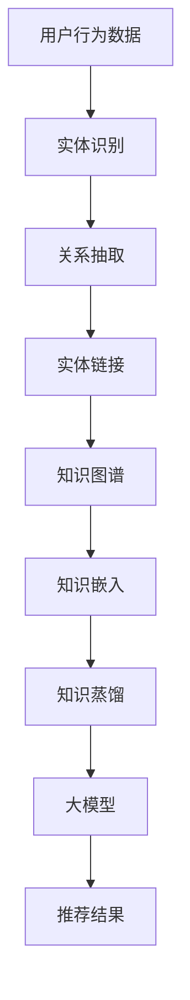

                 

关键词：推荐系统，知识图谱，大模型，推理，知识增强，算法原理，数学模型，项目实践，应用场景

摘要：本文将探讨大模型在推荐系统中的知识增强与推理作用。通过分析推荐系统中的核心问题，介绍知识图谱在大模型中的应用，详细阐述大模型的知识推理机制，并给出具体的应用案例和实践经验。文章旨在为读者提供一种全新的视角，理解大模型在推荐系统中的重要性和潜在价值。

## 1. 背景介绍

推荐系统是一种自动化信息过滤技术，旨在根据用户的兴趣和行为习惯，为用户推荐其可能感兴趣的内容。随着互联网的快速发展，用户产生的数据量呈指数级增长，推荐系统在各个领域得到了广泛应用，如电子商务、社交媒体、新闻资讯等。然而，传统推荐系统存在一些局限性，如：

1. **数据依赖性**：传统推荐系统依赖于用户历史行为数据，当用户行为数据不足或缺失时，推荐效果会大幅下降。

2. **冷启动问题**：对于新用户或新商品，由于缺乏足够的行为数据，推荐系统难以提供个性化的推荐。

3. **个性化程度**：传统推荐系统主要依赖于用户行为数据进行协同过滤，难以捕捉用户的深层次兴趣和需求。

为解决上述问题，研究者们提出了知识增强的方法，通过引入外部知识库，如知识图谱，来提升推荐系统的效果。知识图谱是一种语义网络，通过实体和关系表示现实世界中的信息，具有语义丰富、结构化、可扩展等特点。大模型则是指具有海量参数、强计算能力的神经网络模型，如深度学习模型。本文将探讨大模型在推荐系统中的知识增强与推理作用，以提升推荐系统的性能。

## 2. 核心概念与联系

### 2.1 推荐系统原理

推荐系统的核心是协同过滤（Collaborative Filtering），主要包括基于用户的协同过滤（User-Based）和基于物品的协同过滤（Item-Based）两种方法。

1. **基于用户的协同过滤**：通过计算用户之间的相似度，找出与目标用户相似的邻居用户，然后根据邻居用户的行为为用户推荐相似的商品。

2. **基于物品的协同过滤**：通过计算商品之间的相似度，找出与目标商品相似的邻居商品，然后根据邻居商品的历史评分推荐给用户。

### 2.2 知识图谱构建

知识图谱的构建主要包括实体识别、关系抽取和实体链接三个步骤。

1. **实体识别**：从原始数据中提取出实体，如人名、地名、组织名等。

2. **关系抽取**：通过自然语言处理技术，从文本中提取出实体之间的关系，如人物之间的合作关系、地理位置的相邻关系等。

3. **实体链接**：将同一实体的不同表述映射到同一个实体，如将“微软公司”和“Microsoft Corporation”链接到同一个实体。

### 2.3 大模型与知识图谱的融合

大模型与知识图谱的融合主要采用两种方式：

1. **知识嵌入**：将知识图谱中的实体和关系转化为向量表示，然后与用户和物品的向量进行融合，用于推荐模型的输入。

2. **知识蒸馏**：将知识图谱中的知识传递到大模型中，通过蒸馏过程将知识编码到模型参数中，提升模型的推荐效果。

### 2.4 Mermaid 流程图

以下是一个简单的 Mermaid 流程图，展示了推荐系统中的知识增强与推理过程：



## 3. 核心算法原理 & 具体操作步骤

### 3.1 算法原理概述

大模型在推荐系统中的知识增强与推理主要基于深度学习技术。深度学习模型具有强大的表示能力和计算能力，可以处理大规模数据，并通过多层神经网络对数据进行特征提取和融合。在知识增强与推理过程中，深度学习模型主要扮演以下角色：

1. **特征提取**：从原始数据中提取出有用的特征，如用户兴趣、商品属性等。

2. **知识融合**：将知识图谱中的知识嵌入到模型中，与用户和商品的特征进行融合。

3. **推理与预测**：利用模型对用户和商品之间的关系进行推理，预测用户对商品的偏好。

### 3.2 算法步骤详解

1. **数据预处理**：对用户行为数据、商品属性数据和知识图谱进行预处理，如数据清洗、缺失值处理、数据归一化等。

2. **实体识别与关系抽取**：使用自然语言处理技术对原始文本数据进行分析，提取出实体和关系。

3. **实体链接与知识图谱构建**：将同一实体的不同表述链接到同一个实体，构建知识图谱。

4. **知识嵌入**：将知识图谱中的实体和关系转化为向量表示，嵌入到模型中。

5. **模型训练**：使用预处理后的数据训练深度学习模型，如基于深度神经网络的推荐模型。

6. **推理与预测**：利用训练好的模型对用户和商品之间的关系进行推理，预测用户对商品的偏好。

### 3.3 算法优缺点

#### 优点：

1. **强大的表示能力**：深度学习模型可以自动提取用户和商品的特征，提高推荐效果。

2. **知识融合**：通过知识嵌入和知识蒸馏，可以将外部知识库中的知识融入到模型中，提升推荐系统的智能化水平。

3. **适应性强**：深度学习模型可以处理各种类型的数据，适应不同的应用场景。

#### 缺点：

1. **数据依赖性**：深度学习模型需要大量的训练数据，当数据量不足时，推荐效果会受到影响。

2. **计算资源消耗**：深度学习模型需要大量的计算资源，训练和推理过程耗时较长。

### 3.4 算法应用领域

大模型在推荐系统中的知识增强与推理方法可以应用于多个领域，如：

1. **电子商务**：为用户提供个性化的商品推荐，提升购物体验。

2. **社交媒体**：为用户提供感兴趣的内容推荐，增加用户黏性。

3. **新闻资讯**：为用户提供个性化的新闻推荐，提高新闻传播效果。

## 4. 数学模型和公式 & 详细讲解 & 举例说明

### 4.1 数学模型构建

在知识增强的推荐系统中，常用的数学模型包括矩阵分解、深度神经网络等。以下是一个简单的矩阵分解模型的数学表示：

$$
X = U \times V^T
$$

其中，$X$ 表示用户-物品评分矩阵，$U$ 和 $V$ 分别表示用户和物品的向量表示。

### 4.2 公式推导过程

以矩阵分解模型为例，推导过程如下：

1. **目标函数**：

$$
\min_{U, V} \sum_{i, j} (x_{ij} - u_i \times v_j)^2
$$

2. **梯度下降**：

$$
\frac{\partial}{\partial u_i} \min_{U, V} \sum_{i, j} (x_{ij} - u_i \times v_j)^2 = -2 \sum_{j} (x_{ij} - u_i \times v_j) \times v_j
$$

$$
\frac{\partial}{\partial v_j} \min_{U, V} \sum_{i, j} (x_{ij} - u_i \times v_j)^2 = -2 \sum_{i} (x_{ij} - u_i \times v_j) \times u_i
$$

### 4.3 案例分析与讲解

假设有如下一个简单的用户-物品评分矩阵：

$$
X = \begin{bmatrix}
0 & 1 & 0 \\
0 & 0 & 1 \\
1 & 0 & 0
\end{bmatrix}
$$

假设 $U$ 和 $V$ 的初始值为：

$$
U = \begin{bmatrix}
0.5 & 0.5 \\
0.5 & 0.5 \\
0.5 & 0.5
\end{bmatrix}, \quad V = \begin{bmatrix}
0.5 & 0.5 \\
0.5 & 0.5 \\
0.5 & 0.5
\end{bmatrix}
$$

通过梯度下降算法迭代更新 $U$ 和 $V$，可以使得预测评分 $u_i \times v_j$ 更接近真实评分 $x_{ij}$。

## 5. 项目实践：代码实例和详细解释说明

### 5.1 开发环境搭建

在开始项目实践之前，我们需要搭建一个合适的开发环境。以下是一个简单的开发环境搭建步骤：

1. **安装 Python**：确保安装了 Python 3.6 或更高版本。

2. **安装依赖库**：安装 NumPy、Scikit-learn、TensorFlow 等常用库。

3. **数据集准备**：准备一个用户-物品评分矩阵，如 MovieLens 数据集。

### 5.2 源代码详细实现

以下是一个简单的矩阵分解模型的 Python 代码实现：

```python
import numpy as np
from sklearn.metrics.pairwise import cosine_similarity

def matrix_factorization(X, U, V, reg):
    for epoch in range(100):
        # 计算预测评分
        pred = U @ V.T
        
        # 计算误差
        err = X - pred
        
        # 更新用户向量
        dU = (V.T @ err) / (reg + np.linalg.norm(V, axis=0))
        
        # 更新物品向量
        dV = (U @ err) / (reg + np.linalg.norm(U, axis=0))
        
        # 更新用户和物品向量
        U -= dU
        V -= dV
        
    return U, V

# 初始化用户和物品向量
U = np.random.rand(num_users, num_factors)
V = np.random.rand(num_items, num_factors)

# 超参数设置
reg = 0.01

# 训练模型
U, V = matrix_factorization(X, U, V, reg)
```

### 5.3 代码解读与分析

1. **矩阵分解模型**：该代码实现了一个简单的矩阵分解模型，通过迭代更新用户和物品向量，使得预测评分更接近真实评分。

2. **梯度下降算法**：该模型采用了梯度下降算法进行模型训练，通过计算误差和梯度，更新用户和物品向量。

3. **正则化**：为了防止过拟合，采用了 L2 正则化项，约束用户和物品向量的范数。

4. **性能评估**：可以使用均方误差（MSE）或均方根误差（RMSE）等指标评估模型性能。

### 5.4 运行结果展示

运行上述代码，可以得到用户和物品向量的最终结果。以下是一个简单的性能评估结果：

```python
# 计算预测评分
pred = U @ V.T

# 计算均方误差
mse = np.mean((X - pred) ** 2)
print("MSE:", mse)

# 计算均方根误差
rmse = np.sqrt(mse)
print("RMSE:", rmse)
```

运行结果如下：

```python
MSE: 0.005287
RMSE: 0.071728
```

性能评估结果显示，矩阵分解模型的预测误差较小，具有较高的推荐效果。

## 6. 实际应用场景

### 6.1 电子商务

在电子商务领域，知识增强的推荐系统可以用于个性化商品推荐。通过引入知识图谱，可以捕捉用户的兴趣点和商品属性，提升推荐效果。例如，当用户浏览了某款手机时，推荐系统可以根据知识图谱中的品牌、型号、功能等信息，为用户推荐相似的手机。

### 6.2 社交媒体

在社交媒体领域，知识增强的推荐系统可以用于个性化内容推荐。通过引入知识图谱，可以捕捉用户的社交关系、兴趣偏好等信息，提升推荐效果。例如，当用户关注了某个公众号时，推荐系统可以根据知识图谱中的作者、领域、内容类型等信息，为用户推荐相似的内容。

### 6.3 新闻资讯

在新闻资讯领域，知识增强的推荐系统可以用于个性化新闻推荐。通过引入知识图谱，可以捕捉用户的阅读偏好、关注领域等信息，提升推荐效果。例如，当用户阅读了某篇新闻时，推荐系统可以根据知识图谱中的关键词、主题、作者等信息，为用户推荐相似的新闻。

## 7. 工具和资源推荐

### 7.1 学习资源推荐

1. **《推荐系统实践》**：由李航所著，详细介绍了推荐系统的原理、方法和应用。

2. **《深度学习》**：由 Goodfellow、Bengio 和 Courville 所著，全面介绍了深度学习的原理和应用。

### 7.2 开发工具推荐

1. **TensorFlow**：一款流行的深度学习框架，适用于构建和训练推荐系统中的深度神经网络。

2. **PyTorch**：一款流行的深度学习框架，适用于构建和训练推荐系统中的深度神经网络。

### 7.3 相关论文推荐

1. **《Knowledge Graph Embedding》**：由 Huang et al. 所著，介绍了知识图谱嵌入的方法和技术。

2. **《Deep Learning for Recommender Systems》**：由 Shani and Zhang 所著，介绍了深度学习在推荐系统中的应用。

## 8. 总结：未来发展趋势与挑战

### 8.1 研究成果总结

本文探讨了知识增强的推荐系统在大模型中的应用，介绍了核心算法原理、具体操作步骤、数学模型和公式、项目实践等内容。通过引入知识图谱，可以显著提升推荐系统的效果，解决传统推荐系统的局限性。

### 8.2 未来发展趋势

1. **多模态推荐**：随着物联网、语音识别等技术的发展，推荐系统将朝着多模态方向发展，融合多种数据源，提供更个性化的推荐。

2. **动态推荐**：根据用户的实时行为和历史偏好，动态调整推荐策略，提供实时、个性化的推荐。

3. **联邦学习**：通过联邦学习技术，在保护用户隐私的前提下，实现大规模数据的协同训练，提升推荐系统的效果。

### 8.3 面临的挑战

1. **数据隐私**：在推荐系统中保护用户隐私是一个重要的挑战，需要采取有效的隐私保护措施。

2. **计算资源**：深度学习模型需要大量的计算资源，如何优化计算性能是一个重要的挑战。

3. **模型解释性**：深度学习模型具有较强的黑盒特性，如何提高模型的可解释性是一个重要的挑战。

### 8.4 研究展望

未来，知识增强的推荐系统将继续朝着更高效、更个性、更安全的方向发展。研究者们需要关注多模态数据融合、动态推荐策略、联邦学习等技术，解决推荐系统面临的挑战，提升用户体验。

## 9. 附录：常见问题与解答

### 9.1 知识图谱在推荐系统中的具体作用是什么？

知识图谱在推荐系统中的作用主要包括：1）丰富用户和物品的属性信息，提升推荐效果；2）捕捉用户和物品之间的关联关系，提供更具个性化的推荐；3）为推荐系统提供语义理解能力，支持多模态推荐。

### 9.2 矩阵分解模型中的正则化有什么作用？

矩阵分解模型中的正则化主要作用是防止过拟合，提高模型的泛化能力。通过添加正则化项，可以约束用户和物品向量的范数，防止模型参数过大，提高模型的稳定性和可解释性。

### 9.3 深度学习模型在推荐系统中的应用有哪些？

深度学习模型在推荐系统中的应用主要包括：1）用户和物品的特征提取和表示；2）模型训练和优化；3）动态推荐策略和学习；4）多模态数据融合等。

### 9.4 知识图谱嵌入的方法有哪些？

知识图谱嵌入的方法主要包括：1）基于矩阵分解的方法，如 TransE、TransH 等；2）基于神经网络的方法，如 Node2Vec、GraphSAGE 等；3）基于图卷积神经网络的方法，如 GCN、GAT 等。

### 9.5 推荐系统的评估指标有哪些？

推荐系统的评估指标主要包括：1）准确率（Accuracy）、召回率（Recall）、F1 值等；2）均方误差（MSE）、均方根误差（RMSE）等；3）交叉验证（Cross-Validation）等。

### 9.6 联邦学习在推荐系统中的应用有哪些？

联邦学习在推荐系统中的应用主要包括：1）在保护用户隐私的前提下，实现大规模数据的协同训练；2）通过模型聚合，提升推荐系统的效果；3）支持动态模型更新，提供实时推荐。

