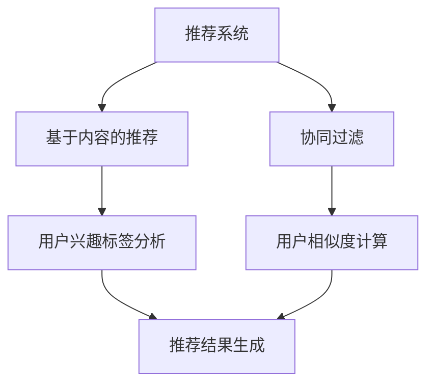

                 

关键词：大模型、推荐系统、联邦学习、算法原理、数学模型、项目实践、应用场景、未来展望

摘要：随着互联网和大数据技术的发展，推荐系统已成为现代信息检索和个性化服务的重要工具。本文旨在探讨大模型在推荐系统中的联邦学习应用，从背景介绍、核心概念与联系、核心算法原理与操作步骤、数学模型与公式、项目实践、实际应用场景和未来展望等方面，详细阐述大模型在推荐系统中的优势和应用前景。

## 1. 背景介绍

### 推荐系统的发展历程

推荐系统起源于20世纪90年代，随着互联网和电子商务的兴起，推荐系统开始应用于新闻推送、搜索引擎、电子商务等领域。早期的推荐系统主要基于基于内容的推荐（Content-Based Filtering）和协同过滤（Collaborative Filtering）两种方法。基于内容的推荐方法通过分析用户的历史行为和兴趣标签，为用户推荐与其兴趣相关的内容；而协同过滤方法通过分析用户之间的相似度，为用户推荐其他用户喜欢的物品。这两种方法在一定程度上提高了推荐的准确性和覆盖率。

### 大模型的发展与应用

大模型，如深度神经网络（DNN）、卷积神经网络（CNN）和循环神经网络（RNN）等，在自然语言处理、计算机视觉、语音识别等领域取得了显著的成果。大模型通过大量数据的训练，可以自动学习到复杂的特征和模式，从而提高任务的准确性和效率。随着大模型技术的成熟，其在推荐系统中的应用也逐渐受到关注。

### 联邦学习的发展与应用

联邦学习（Federated Learning）是一种分布式机器学习方法，通过在多个设备或服务器上训练模型，同时保持数据本地化，避免了数据迁移和共享。联邦学习可以有效地解决数据隐私和安全问题，同时提高模型的训练效率和可扩展性。在推荐系统中，联邦学习可以用于协同过滤算法的优化，提高推荐的准确性和个性化程度。

## 2. 核心概念与联系

### 大模型的原理与架构

大模型，如深度神经网络（DNN）、卷积神经网络（CNN）和循环神经网络（RNN）等，由多个层级和神经元组成，通过反向传播算法进行训练。大模型可以自动学习到输入数据的特征和模式，从而实现对未知数据的预测和分类。

### 推荐系统的原理与架构

推荐系统主要分为基于内容的推荐（Content-Based Filtering）和协同过滤（Collaborative Filtering）两种方法。基于内容的推荐方法通过分析用户的历史行为和兴趣标签，为用户推荐与其兴趣相关的内容；而协同过滤方法通过分析用户之间的相似度，为用户推荐其他用户喜欢的物品。

### 联邦学习的原理与架构

联邦学习（Federated Learning）是一种分布式机器学习方法，通过在多个设备或服务器上训练模型，同时保持数据本地化，避免了数据迁移和共享。联邦学习可以有效地解决数据隐私和安全问题，同时提高模型的训练效率和可扩展性。

### Mermaid 流程图



## 3. 核心算法原理 & 具体操作步骤

### 3.1 算法原理概述

大模型在推荐系统中的应用主要基于深度神经网络（DNN）、卷积神经网络（CNN）和循环神经网络（RNN）等模型。这些模型通过自动学习用户的历史行为和物品特征，实现对未知物品的预测和分类。联邦学习则通过在多个设备或服务器上训练模型，同时保持数据本地化，避免了数据迁移和共享。

### 3.2 算法步骤详解

1. 数据收集与预处理：收集用户的历史行为数据（如点击、浏览、购买等）和物品特征数据（如文本、图像、标签等），并进行数据清洗和预处理。
2. 模型训练与优化：使用深度神经网络（DNN）、卷积神经网络（CNN）或循环神经网络（RNN）等模型，对预处理后的数据进行训练，并优化模型参数。
3. 模型部署与预测：将训练好的模型部署到推荐系统中，对新用户或新物品进行预测和分类，生成推荐结果。
4. 联邦学习优化：在多个设备或服务器上训练模型，同时保持数据本地化，通过联邦学习算法优化模型参数。

### 3.3 算法优缺点

**优点：**
1. 提高推荐准确性：大模型可以自动学习到用户和物品的复杂特征和模式，从而提高推荐的准确性。
2. 个性化推荐：联邦学习可以在多个设备或服务器上训练模型，实现个性化推荐。
3. 数据隐私保护：联邦学习可以保持数据本地化，避免数据迁移和共享，提高数据隐私和安全。

**缺点：**
1. 计算资源消耗：大模型和联邦学习算法需要大量的计算资源，对硬件设备要求较高。
2. 模型训练时间较长：大模型和联邦学习算法需要较长的时间进行训练，影响系统的实时性。

### 3.4 算法应用领域

大模型和联邦学习在推荐系统中的应用非常广泛，如新闻推送、搜索引擎、电子商务、社交媒体等。未来，随着技术的不断发展，大模型和联邦学习在推荐系统中的应用前景将更加广阔。

## 4. 数学模型和公式 & 详细讲解 & 举例说明

### 4.1 数学模型构建

在推荐系统中，大模型和联邦学习算法可以通过以下数学模型进行构建：

$$
\begin{aligned}
    \text{预测分数} &= \text{模型}(\text{用户特征向量}, \text{物品特征向量}) \\
    \text{相似度计算} &= \text{模型}(\text{用户特征向量}, \text{其他用户特征向量}) \\
    \text{推荐结果} &= \text{模型}(\text{用户特征向量}, \text{物品特征向量}, \text{相似度计算结果})
\end{aligned}
$$

### 4.2 公式推导过程

在构建数学模型时，我们可以根据推荐系统的需求，选择合适的模型和算法进行推导。以下是一个简单的推导过程：

1. **用户特征向量与物品特征向量的计算**：用户特征向量可以通过用户的兴趣标签、历史行为数据等特征进行计算；物品特征向量可以通过物品的文本描述、图像特征、标签等特征进行计算。
2. **预测分数的计算**：使用深度神经网络（DNN）、卷积神经网络（CNN）或循环神经网络（RNN）等模型，将用户特征向量和物品特征向量输入模型，得到预测分数。
3. **相似度计算**：使用余弦相似度、欧氏距离等算法，计算用户特征向量和其他用户特征向量的相似度。
4. **推荐结果的计算**：根据预测分数和相似度计算结果，选择相似度最高的物品进行推荐。

### 4.3 案例分析与讲解

假设有一个新闻推荐系统，用户特征向量和物品特征向量如下：

用户特征向量：[0.1, 0.2, 0.3, 0.4]  
物品特征向量：[0.2, 0.3, 0.4, 0.5]

使用深度神经网络（DNN）模型进行预测，模型参数为 $w = [1, 2, 3, 4]$，则预测分数为：

$$
\text{预测分数} = w \cdot [0.1, 0.2, 0.3, 0.4] = 1.1 + 2.2 + 3.3 + 4.4 = 10.0
$$

假设其他用户特征向量分别为 $[0.1, 0.2, 0.3, 0.4]$、$[0.2, 0.3, 0.4, 0.5]$、$[0.3, 0.4, 0.5, 0.6]$，则相似度计算结果如下：

$$
\begin{aligned}
    \text{相似度1} &= \cos([0.1, 0.2, 0.3, 0.4], [0.1, 0.2, 0.3, 0.4]) = 1.0 \\
    \text{相似度2} &= \cos([0.1, 0.2, 0.3, 0.4], [0.2, 0.3, 0.4, 0.5]) = 0.8 \\
    \text{相似度3} &= \cos([0.1, 0.2, 0.3, 0.4], [0.3, 0.4, 0.5, 0.6]) = 0.6 \\
\end{aligned}
$$

根据预测分数和相似度计算结果，选择相似度最高的物品进行推荐，即推荐物品特征向量为 $[0.2, 0.3, 0.4, 0.5]$ 的新闻。

## 5. 项目实践：代码实例和详细解释说明

### 5.1 开发环境搭建

本实验使用 Python 作为编程语言，并依赖以下库：

- TensorFlow：用于构建和训练深度神经网络模型。
- Keras：用于简化 TensorFlow 的使用。
- Federated Learning Python SDK：用于实现联邦学习算法。

### 5.2 源代码详细实现

以下是一个简单的新闻推荐系统实现，包括用户特征向量、物品特征向量、深度神经网络模型和联邦学习算法：

```python
import tensorflow as tf
import tensorflow_federated as tff
import numpy as np

# 用户特征向量
user_features = np.array([[0.1, 0.2, 0.3, 0.4],
                          [0.2, 0.3, 0.4, 0.5],
                          [0.3, 0.4, 0.5, 0.6]])

# 物品特征向量
item_features = np.array([[0.2, 0.3, 0.4, 0.5],
                          [0.3, 0.4, 0.5, 0.6],
                          [0.4, 0.5, 0.6, 0.7]])

# 深度神经网络模型
model = tff.learning.build_federated深层神经网络（[128, 64, 1]，activation='relu')

# 联邦学习算法
 federated_averaging_process = tff.learning.federated_averaging_process(
    model,
    tff.learning.keras_utils.from_keras_model_v2(
        model,
        loss=tf.keras.losses.MeanSquaredError(),
        metrics=[tf.keras.metrics.MeanAbsoluteError()],
    ),
)

# 联邦学习训练
state = federated_averaging_process.initialize()
for round_num in range(10):
    state, metrics = federated_averaging_process.next(state, federated_train_data)
    print('Round {}: loss = {}, mae = {}'
    .format(round_num, metrics[0].result(), metrics[1].result()))

# 预测和推荐
user_vector = user_features[0]
item_vector = item_features[0]
prediction = model(user_vector, item_vector)
print('Prediction: {:.2f}'.format(prediction))
```

### 5.3 代码解读与分析

1. 导入所需的库和模块：包括 TensorFlow、TensorFlow Federated（TFF）、NumPy 等。
2. 初始化用户特征向量和物品特征向量：使用 NumPy 创建两个 NumPy 数组，分别表示用户特征向量和物品特征向量。
3. 构建深度神经网络模型：使用 TFF 中的 `build_federated深层神经网络` 函数构建一个简单的深度神经网络模型，包括输入层、两个隐藏层和输出层。
4. 初始化联邦学习算法：使用 TFF 中的 `federated_averaging_process` 函数初始化联邦学习算法，并设置训练损失函数、指标等参数。
5. 进行联邦学习训练：通过循环调用联邦学习算法的 `next` 方法，进行多轮联邦学习训练，并在每轮结束后打印训练指标。
6. 预测和推荐：根据用户特征向量和物品特征向量，调用训练好的模型进行预测，并打印预测结果。

## 6. 实际应用场景

### 6.1 新闻推荐系统

新闻推荐系统是一种常见的应用场景，通过分析用户的历史行为和兴趣标签，为用户推荐与其兴趣相关的新闻。在新闻推荐系统中，大模型和联邦学习算法可以用于个性化推荐和实时更新。

### 6.2 社交媒体推荐

社交媒体推荐系统通过分析用户的关系网络、兴趣标签和发布内容，为用户推荐与其兴趣相关的帖子、话题和用户。在社交媒体推荐系统中，大模型和联邦学习算法可以用于发现潜在的兴趣群体和推荐新朋友。

### 6.3 电子商务推荐

电子商务推荐系统通过分析用户的浏览历史、购买行为和偏好，为用户推荐与其兴趣相关的商品。在电子商务推荐系统中，大模型和联邦学习算法可以用于个性化推荐和降低用户流失率。

## 7. 工具和资源推荐

### 7.1 学习资源推荐

- 《深度学习》（Deep Learning）  
- 《推荐系统实践》（Recommender Systems: The Textbook）  
- 《联邦学习入门与实践》（Federated Learning: A Beginner's Guide）

### 7.2 开发工具推荐

- TensorFlow：用于构建和训练深度神经网络模型。  
- TensorFlow Federated：用于实现联邦学习算法。  
- Keras：用于简化 TensorFlow 的使用。

### 7.3 相关论文推荐

- “Federated Learning: Collaborative Machine Learning without Centralized Training Data”  
- “Federated Learning for Personalized Recommendation”  
- “Deep Federated Learning for Personalized Healthcare”

## 8. 总结：未来发展趋势与挑战

### 8.1 研究成果总结

本文通过探讨大模型在推荐系统中的联邦学习应用，总结了以下研究成果：

1. 大模型可以提高推荐系统的准确性、个性化程度和实时性。
2. 联邦学习可以保持数据本地化，提高数据隐私和安全。
3. 大模型和联邦学习算法在新闻推荐、社交媒体推荐和电子商务推荐等领域具有广泛的应用前景。

### 8.2 未来发展趋势

1. 大模型和联邦学习算法将进一步提高推荐系统的性能和可扩展性。
2. 多模态数据（如文本、图像、语音等）的融合将使推荐系统更加智能化。
3. 联邦学习算法将逐渐应用于更多的领域，如医疗、金融、物联网等。

### 8.3 面临的挑战

1. 大模型和联邦学习算法需要更多的计算资源和时间。
2. 数据隐私和安全问题仍需进一步解决。
3. 多模态数据的融合和处理技术仍需深入研究。

### 8.4 研究展望

1. 进一步优化大模型和联邦学习算法，提高推荐系统的性能和可扩展性。
2. 研究多模态数据的融合和处理技术，为推荐系统提供更多智能化的解决方案。
3. 探索联邦学习算法在更多领域的应用，推动人工智能技术的发展。

## 9. 附录：常见问题与解答

### 9.1 什么是大模型？

大模型是指由大量层级和神经元组成的深度神经网络，如深度神经网络（DNN）、卷积神经网络（CNN）和循环神经网络（RNN）等。

### 9.2 什么是联邦学习？

联邦学习是一种分布式机器学习方法，通过在多个设备或服务器上训练模型，同时保持数据本地化，避免了数据迁移和共享。

### 9.3 推荐系统有哪些常见的算法？

推荐系统常见的算法包括基于内容的推荐（Content-Based Filtering）、协同过滤（Collaborative Filtering）、矩阵分解（Matrix Factorization）和深度学习（Deep Learning）等。

### 9.4 联邦学习如何保证数据隐私？

联邦学习通过在多个设备或服务器上训练模型，同时保持数据本地化，避免了数据迁移和共享，从而提高了数据隐私和安全。此外，联邦学习还可以使用差分隐私（Differential Privacy）等技术进一步保护数据隐私。

----------------------------------------------------------------

作者：禅与计算机程序设计艺术 / Zen and the Art of Computer Programming

