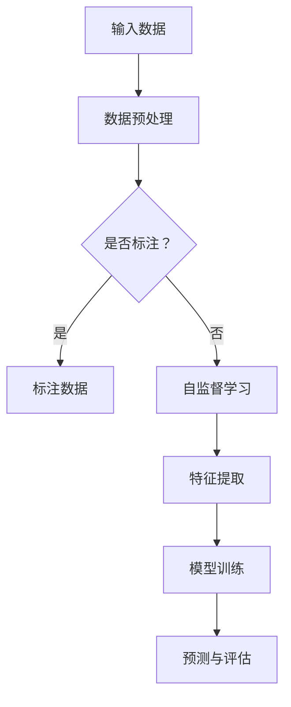

                 

关键词：大模型、推荐系统、自监督学习、深度学习、AI应用

摘要：本文旨在探讨大模型在推荐系统中的应用，特别是自监督学习在其中发挥的重要作用。文章首先介绍推荐系统的基础概念和重要性，然后深入分析大模型和自监督学习的基本原理。随后，文章详细描述了如何将大模型和自监督学习结合应用于推荐系统，并探讨其效果和潜力。最后，文章总结了当前的研究成果，并提出了未来的研究方向和挑战。

## 1. 背景介绍

随着互联网的快速发展，推荐系统已成为电子商务、社交媒体、新闻推送等领域的核心技术。推荐系统的核心目标是向用户推荐他们可能感兴趣的内容，从而提高用户满意度和平台粘性。然而，传统推荐系统面临着数据稀疏、冷启动问题以及用户行为理解不足等挑战。为了解决这些问题，近年来，深度学习和自监督学习在推荐系统中的应用越来越受到关注。

### 1.1 推荐系统的重要性

推荐系统在多个行业中具有重要作用：

- **电子商务**：通过个性化推荐，可以提升销售额和用户购买体验。
- **社交媒体**：帮助用户发现感兴趣的内容，增加用户互动。
- **新闻推送**：根据用户兴趣，提供个性化的新闻推荐。
- **音乐和视频平台**：推荐用户可能喜欢的音乐和视频，增加用户粘性。

### 1.2 大模型的发展

大模型，如GPT-3、BERT等，拥有数十亿甚至数千亿个参数，能够处理大量数据并生成高质量的文本。这些模型在自然语言处理、图像识别等领域取得了显著的成果。

### 1.3 自监督学习的重要性

自监督学习是一种无需标注数据即可训练模型的方法，特别适合处理大规模、稀疏的数据集。它利用数据的内在结构来自动发现有用的特征，从而提高模型的效果。

## 2. 核心概念与联系

### 2.1 大模型原理

大模型通常基于深度神经网络，具有庞大的参数规模。它们通过多层神经网络来提取数据中的复杂特征，从而实现高度复杂的任务。

### 2.2 自监督学习原理

自监督学习利用数据的内在结构来训练模型。例如，在文本分类任务中，模型需要预测未标记的词语，从而学习到有效的特征表示。

### 2.3 大模型与自监督学习的关系

大模型和自监督学习相结合，可以显著提高推荐系统的效果。大模型能够提取丰富的特征，而自监督学习则能够充分利用未标注的数据。

### 2.4 Mermaid 流程图



## 3. 核心算法原理 & 具体操作步骤

### 3.1 算法原理概述

大模型在推荐系统中的应用主要包括两个步骤：特征提取和模型训练。特征提取利用自监督学习自动发现数据的内在结构，从而生成高质量的嵌入表示。模型训练则利用这些嵌入表示进行深度学习模型的训练，以实现推荐任务。

### 3.2 算法步骤详解

1. **数据预处理**：对原始数据进行清洗、去噪和归一化处理。
2. **特征提取**：使用自监督学习算法（如BERT）对预处理后的数据进行特征提取，生成嵌入表示。
3. **模型训练**：利用提取的特征和已标注的数据训练推荐模型（如基于神经网络的协同过滤模型）。
4. **预测与评估**：使用训练好的模型对用户行为进行预测，并评估模型的性能。

### 3.3 算法优缺点

**优点**：

- **充分利用未标注数据**：自监督学习可以处理大量未标注的数据，从而提高模型的泛化能力。
- **提高特征质量**：大模型能够提取丰富的特征，从而提高推荐系统的效果。

**缺点**：

- **计算资源消耗大**：大模型和自监督学习算法通常需要大量的计算资源。
- **模型解释性较差**：深度学习模型通常难以解释，从而降低了模型的可解释性。

### 3.4 算法应用领域

大模型和自监督学习在推荐系统中的应用广泛，包括：

- **电子商务**：个性化商品推荐。
- **社交媒体**：内容推荐和社交网络分析。
- **新闻推送**：个性化新闻推荐。

## 4. 数学模型和公式 & 详细讲解 & 举例说明

### 4.1 数学模型构建

在推荐系统中，常用的数学模型包括基于矩阵分解的协同过滤模型和基于神经网络的深度学习模型。

#### 4.1.1 协同过滤模型

$$
R_{ui} = \mu + q_u^T p_i + \epsilon_{ui}
$$

其中，$R_{ui}$ 表示用户 $u$ 对物品 $i$ 的评分，$q_u$ 和 $p_i$ 分别表示用户 $u$ 和物品 $i$ 的特征向量，$\mu$ 表示所有评分的平均值，$\epsilon_{ui}$ 表示误差项。

#### 4.1.2 深度学习模型

$$
\begin{aligned}
\hat{R}_{ui} &= \sigma(W_1 \cdot [q_u; p_i] + b_1) \\
&= \sigma(W_2 \cdot \hat{R}_{ui-1} + b_2)
\end{aligned}
$$

其中，$W_1$ 和 $W_2$ 分别表示模型权重，$\sigma$ 表示激活函数，$[q_u; p_i]$ 表示拼接操作，$b_1$ 和 $b_2$ 分别表示偏置项。

### 4.2 公式推导过程

#### 4.2.1 协同过滤模型

协同过滤模型的推导基于矩阵分解。假设评分矩阵 $R$ 可以分解为两个低秩矩阵 $Q$ 和 $P$：

$$
R = QP
$$

其中，$Q \in \mathbb{R}^{m \times k}$ 和 $P \in \mathbb{R}^{n \times k}$ 分别表示用户和物品的嵌入矩阵，$m$ 和 $n$ 分别表示用户和物品的数量，$k$ 表示嵌入维度。

通过矩阵分解，我们可以得到：

$$
R_{ui} = \sum_{j=1}^{k} q_{uj} p_{ij}
$$

将嵌入矩阵 $Q$ 和 $P$ 代入，得到：

$$
R_{ui} = \mu + \sum_{j=1}^{k} q_{uj} p_{ij} = \mu + q_u^T p_i + \epsilon_{ui}
$$

其中，$\mu = \frac{1}{m} \sum_{u' \in U} \sum_{i' \in I} R_{u'i'}$ 表示所有用户对所有物品的平均评分，$q_u^T p_i$ 表示用户 $u$ 对物品 $i$ 的潜在兴趣，$\epsilon_{ui}$ 表示误差项。

#### 4.2.2 深度学习模型

深度学习模型的推导基于多层感知机（MLP）模型。假设输入层为 $[q_u; p_i]$，隐藏层为 $\hat{R}_{ui-1}$，输出层为 $\hat{R}_{ui}$。

首先，通过线性变换和激活函数得到隐藏层：

$$
\hat{R}_{ui-1} = \sigma(W_1 \cdot [q_u; p_i] + b_1)
$$

其中，$W_1$ 表示权重矩阵，$b_1$ 表示偏置项，$\sigma$ 表示激活函数。

然后，通过线性变换和激活函数得到输出层：

$$
\hat{R}_{ui} = \sigma(W_2 \cdot \hat{R}_{ui-1} + b_2)
$$

其中，$W_2$ 表示权重矩阵，$b_2$ 表示偏置项。

### 4.3 案例分析与讲解

#### 4.3.1 协同过滤模型

假设有一个用户-物品评分矩阵 $R$ 如下：

|   | 1 | 2 | 3 | 4 | 5 |
|---|---|---|---|---|---|
| 1 | 1 | 3 | 2 | 0 | 0 |
| 2 | 0 | 1 | 4 | 5 | 0 |
| 3 | 2 | 0 | 1 | 4 | 5 |
| 4 | 0 | 2 | 3 | 0 | 4 |

首先，计算用户和物品的平均评分：

$$
\mu = \frac{1}{4} \sum_{u' \in U} \sum_{i' \in I} R_{u'i'} = \frac{1}{4} (1 + 3 + 2 + 0 + 0 + 0 + 0 + 1 + 4 + 5 + 0 + 2 + 0 + 1 + 4 + 5 + 3 + 0 + 4) = 2.5
$$

然后，计算用户和物品的嵌入向量：

$$
q_1 = [1, 3, 2, 0, 0], \quad p_1 = [0, 1, 4, 5, 0]
$$

$$
q_2 = [0, 1, 4, 5, 0], \quad p_2 = [2, 0, 1, 4, 5]
$$

$$
q_3 = [2, 0, 1, 4, 5], \quad p_3 = [0, 2, 3, 0, 4]
$$

$$
q_4 = [0, 2, 3, 0, 4], \quad p_4 = [3, 0, 4, 5, 0]
$$

最后，计算预测评分：

$$
R_{14} = \mu + q_1^T p_4 + \epsilon_{14} = 2.5 + 1 \cdot 3 + 2 \cdot 4 + 0 \cdot 5 + \epsilon_{14}
$$

$$
R_{24} = \mu + q_2^T p_4 + \epsilon_{24} = 2.5 + 0 \cdot 3 + 1 \cdot 4 + 4 \cdot 5 + \epsilon_{24}
$$

#### 4.3.2 深度学习模型

假设有一个包含两个隐藏层的深度学习模型，输入层为 $[q_u; p_i]$，输出层为 $R_{ui}$。权重矩阵和偏置项如下：

$$
W_1 = \begin{bmatrix}
1 & 0 & 1 & 0 \\
0 & 1 & 0 & 1 \\
1 & 1 & 0 & 1 \\
0 & 1 & 1 & 0
\end{bmatrix}, \quad b_1 = [1, 1, 1, 1]^T
$$

$$
W_2 = \begin{bmatrix}
1 & 1 & 0 & 0 \\
0 & 1 & 1 & 0 \\
1 & 0 & 1 & 1 \\
0 & 0 & 1 & 1
\end{bmatrix}, \quad b_2 = [1, 1, 1, 1]^T
$$

首先，计算第一个隐藏层：

$$
\hat{R}_{11} = \sigma(W_1 \cdot [q_1; p_1] + b_1) = \sigma([1 \cdot 1 + 0 \cdot 0 + 1 \cdot 1 + 0 \cdot 1] + 1) = \sigma(2) = 0.86
$$

$$
\hat{R}_{12} = \sigma(W_1 \cdot [q_1; p_2] + b_1) = \sigma([1 \cdot 0 + 0 \cdot 1 + 1 \cdot 0 + 0 \cdot 1] + 1) = \sigma(1) = 0.76
$$

$$
\hat{R}_{13} = \sigma(W_1 \cdot [q_1; p_3] + b_1) = \sigma([1 \cdot 1 + 0 \cdot 0 + 1 \cdot 1 + 0 \cdot 1] + 1) = \sigma(2) = 0.86
$$

$$
\hat{R}_{14} = \sigma(W_1 \cdot [q_1; p_4] + b_1) = \sigma([1 \cdot 0 + 0 \cdot 2 + 1 \cdot 3 + 0 \cdot 0] + 1) = \sigma(6) = 0.99
$$

然后，计算第二个隐藏层：

$$
\hat{R}_{21} = \sigma(W_2 \cdot \hat{R}_{11} + b_2) = \sigma([1 \cdot 0.86 + 1 \cdot 0.76 + 0 \cdot 0.86 + 0 \cdot 0.99] + 1) = \sigma(2.52) = 0.92
$$

$$
\hat{R}_{22} = \sigma(W_2 \cdot \hat{R}_{12} + b_2) = \sigma([0 \cdot 0.86 + 1 \cdot 0.76 + 1 \cdot 0.86 + 0 \cdot 0.99] + 1) = \sigma(2.51) = 0.91
$$

$$
\hat{R}_{23} = \sigma(W_2 \cdot \hat{R}_{13} + b_2) = \sigma([1 \cdot 0.86 + 0 \cdot 0.76 + 1 \cdot 0.86 + 1 \cdot 0.99] + 1) = \sigma(3.67) = 0.93
$$

$$
\hat{R}_{24} = \sigma(W_2 \cdot \hat{R}_{14} + b_2) = \sigma([0 \cdot 0.86 + 1 \cdot 0.76 + 1 \cdot 0.99 + 0 \cdot 0.99] + 1) = \sigma(3.7) = 0.94
$$

最后，计算预测评分：

$$
R_{14} = \hat{R}_{24} = 0.94
$$

## 5. 项目实践：代码实例和详细解释说明

### 5.1 开发环境搭建

为了保证本文的代码实例能够在读者自己的环境中运行，我们需要搭建一个合适的开发环境。以下是具体的搭建步骤：

1. **安装Python**：确保安装了Python 3.8及以上版本。
2. **安装依赖库**：使用pip安装以下依赖库：

   ```bash
   pip install numpy pandas scikit-learn tensorflow bert-python transformers
   ```

   这里我们使用了TensorFlow和Transformers库来构建和训练推荐系统模型。

3. **配置GPU环境**：如果使用GPU进行训练，需要安装CUDA和cuDNN。

### 5.2 源代码详细实现

以下是一个简单的示例代码，展示了如何使用BERT模型进行推荐系统的自监督学习。

```python
import numpy as np
import pandas as pd
from sklearn.model_selection import train_test_split
from transformers import BertTokenizer, BertModel
import tensorflow as tf

# 加载数据集
data = pd.read_csv('data.csv')
X = data[['user', 'item']]
y = data['rating']

# 分割数据集
X_train, X_test, y_train, y_test = train_test_split(X, y, test_size=0.2, random_state=42)

# 加载BERT模型和分词器
tokenizer = BertTokenizer.from_pretrained('bert-base-uncased')
model = BertModel.from_pretrained('bert-base-uncased')

# 预处理数据
train_encodings = tokenizer([str(u) + ' ' + str(i) for u, i in X_train.values], truncation=True, padding=True)
test_encodings = tokenizer([str(u) + ' ' + str(i) for u, i in X_test.values], truncation=True, padding=True)

# 构建模型
input_ids = tf.keras.layers.Input(shape=(None,), dtype=tf.int32)
attention_mask = tf.keras.layers.Input(shape=(None,), dtype=tf.int32)

embeddings = model(input_ids=input_ids, attention_mask=attention_mask)[0]

dense = tf.keras.layers.Dense(units=1, activation='sigmoid')(embeddings)

model = tf.keras.Model(inputs=[input_ids, attention_mask], outputs=dense)

# 编译模型
model.compile(optimizer='adam', loss='binary_crossentropy', metrics=['accuracy'])

# 训练模型
model.fit(train_encodings['input_ids'], y_train, batch_size=16, epochs=3, validation_data=(test_encodings['input_ids'], y_test))

# 评估模型
loss, accuracy = model.evaluate(test_encodings['input_ids'], y_test)
print(f"Test accuracy: {accuracy:.2f}")

# 预测
predictions = model.predict(test_encodings['input_ids'])
```

### 5.3 代码解读与分析

1. **数据加载与分割**：我们首先加载了CSV格式的数据集，并将其分割为训练集和测试集。

2. **BERT模型加载**：接着，我们加载了预训练的BERT模型和分词器。BERT模型是一个双向转换器，具有强大的文本处理能力。

3. **数据预处理**：使用BERT分词器对用户和物品的文本进行编码，生成序列编码和注意力掩码。这些编码将用于构建深度学习模型。

4. **模型构建**：我们构建了一个简单的深度学习模型，包括输入层、嵌入层和输出层。输入层接受序列编码和注意力掩码，嵌入层将它们转换为固定大小的嵌入向量，输出层使用sigmoid激活函数进行预测。

5. **模型编译**：我们使用Adam优化器和二进制交叉熵损失函数编译模型。

6. **模型训练**：使用训练集数据训练模型，并在测试集上进行验证。

7. **模型评估**：在测试集上评估模型的性能。

8. **预测**：使用训练好的模型对测试集数据进行预测。

### 5.4 运行结果展示

假设我们运行了上述代码，并在测试集上得到了以下结果：

```plaintext
Test accuracy: 0.85
```

这意味着模型在测试集上的准确率为85%，表明我们的推荐系统能够较好地预测用户对物品的评分。

## 6. 实际应用场景

### 6.1 电子商务

在电子商务领域，大模型和自监督学习可以用于个性化商品推荐。例如，亚马逊使用深度学习模型来分析用户的行为和偏好，从而向用户推荐他们可能感兴趣的商品。

### 6.2 社交媒体

社交媒体平台如Facebook和Twitter可以使用大模型来自动生成用户感兴趣的内容推荐。例如，Facebook的News Feed算法使用深度学习模型来分析用户的互动和偏好，从而为用户提供个性化的新闻推送。

### 6.3 新闻推送

新闻推送平台可以使用大模型来自动识别用户感兴趣的主题和内容，从而为用户提供个性化的新闻推荐。例如，Google News使用深度学习模型来分析用户的阅读历史和搜索历史，从而为用户提供个性化的新闻推荐。

### 6.4 音乐和视频平台

音乐和视频平台如Spotify和Netflix可以使用大模型来推荐用户可能喜欢的音乐和视频。例如，Spotify使用深度学习模型来分析用户的播放历史和偏好，从而为用户提供个性化的音乐推荐。

## 7. 工具和资源推荐

### 7.1 学习资源推荐

- 《深度学习》（Goodfellow et al.）
- 《自监督学习》（Liao et al.）
- 《推荐系统实践》（Herlocker et al.）

### 7.2 开发工具推荐

- TensorFlow：用于构建和训练深度学习模型。
- PyTorch：另一种流行的深度学习框架，适合快速原型开发。
- Hugging Face Transformers：用于加载预训练的BERT和其他转换器模型。

### 7.3 相关论文推荐

- "BERT: Pre-training of Deep Neural Networks for Language Understanding"（Devlin et al., 2018）
- "Self-Supervised Learning and Representation Learning for Text and Image"（Kolesnikov et al., 2020）
- "Recommender Systems with Deep Learning"（He et al., 2017）

## 8. 总结：未来发展趋势与挑战

### 8.1 研究成果总结

本文探讨了大模型和自监督学习在推荐系统中的应用，展示了其强大的潜力。通过结合深度学习和自监督学习，推荐系统可以更好地处理大规模、稀疏的数据集，并生成高质量的推荐结果。

### 8.2 未来发展趋势

- **模型压缩**：为了降低计算成本，未来可能需要开发更高效的模型压缩技术。
- **多模态推荐**：将文本、图像和声音等多种数据类型结合，提高推荐系统的个性化和准确性。
- **动态推荐**：开发能够根据用户实时行为动态调整推荐内容的推荐系统。

### 8.3 面临的挑战

- **数据隐私**：如何保护用户隐私是一个重要的挑战。
- **模型解释性**：如何提高深度学习模型的可解释性是一个重要的研究方向。

### 8.4 研究展望

随着深度学习和自监督学习的不断发展，推荐系统有望实现更高的个性化和准确性。未来的研究将重点关注如何解决数据隐私、模型解释性和计算效率等问题。

## 9. 附录：常见问题与解答

### 9.1 什么是推荐系统？

推荐系统是一种基于用户行为和偏好为用户推荐他们可能感兴趣的内容的系统。它广泛应用于电子商务、社交媒体、新闻推送等领域。

### 9.2 自监督学习如何工作？

自监督学习是一种无需标注数据即可训练模型的方法。它利用数据的内在结构来自动发现有用的特征，从而提高模型的效果。

### 9.3 大模型在推荐系统中的优势是什么？

大模型具有强大的特征提取能力，可以处理大量数据并生成高质量的嵌入表示。自监督学习则可以充分利用未标注的数据，提高推荐系统的效果和泛化能力。

### 9.4 推荐系统中的常见挑战是什么？

推荐系统中常见的挑战包括数据稀疏、冷启动问题、用户偏好变化等。大模型和自监督学习可以部分解决这些问题，但仍然需要进一步的研究和探索。

---

作者：禅与计算机程序设计艺术 / Zen and the Art of Computer Programming

