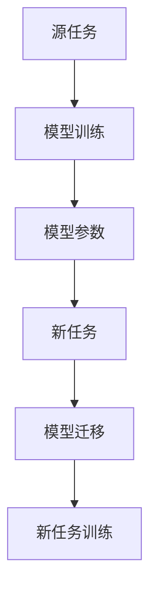

                 

关键词：大模型、推荐系统、迁移学习、策略优化、个性化推荐、算法实现

> 摘要：本文将探讨大模型在推荐系统中的迁移学习新策略。通过分析现有推荐系统的不足，引入迁移学习概念，并详细阐述其在大模型中的应用方法。本文将介绍一种新型迁移学习策略，以及其实际操作步骤、数学模型和公式推导。同时，通过项目实践和实际应用场景，本文将展示该策略在推荐系统中的有效性和广泛适用性。

## 1. 背景介绍

随着互联网的普及和社交媒体的快速发展，个性化推荐系统已经成为用户获取信息和服务的重要途径。推荐系统通过分析用户的历史行为和偏好，为用户提供个性化的信息推荐，从而提升用户体验和满意度。然而，传统的推荐系统存在一些局限和挑战，如数据稀疏、冷启动问题以及模型泛化能力不足等。

近年来，大模型的引入为推荐系统带来了新的突破。大模型具有强大的表征能力和泛化能力，能够处理复杂的用户行为数据和海量信息。然而，大模型在推荐系统中的应用也面临着迁移学习的挑战。迁移学习旨在利用已有模型的知识和经验，对新任务进行快速且有效的学习，从而减少模型训练的时间和计算资源消耗。

本文将探讨大模型在推荐系统中的迁移学习新策略，旨在解决现有推荐系统的不足，提高推荐系统的性能和适用性。

## 2. 核心概念与联系

### 2.1 大模型与推荐系统的关系

大模型（Large Model）是指具有数十亿甚至数万亿参数的深度学习模型。大模型在计算机视觉、自然语言处理和推荐系统等领域取得了显著成果。在大模型的基础上，我们可以利用其强大的表征能力来处理复杂的用户行为数据，从而提高推荐系统的性能。

推荐系统（Recommendation System）是一种信息过滤技术，通过分析用户的历史行为和偏好，为用户推荐相关物品。推荐系统通常包含三个主要模块：用户建模、物品建模和推荐算法。

用户建模（User Modeling）：通过分析用户的历史行为和偏好，构建用户画像，以便更好地理解用户的需求和兴趣。

物品建模（Item Modeling）：通过分析物品的特征和属性，构建物品画像，以便更好地理解物品的特性和价值。

推荐算法（Recommendation Algorithm）：根据用户画像和物品画像，使用算法为用户推荐相关物品。

大模型与推荐系统的关系如图 1 所示。大模型可以通过用户建模和物品建模模块，对用户和物品进行深度表征，从而提高推荐系统的性能。

### 2.2 迁移学习概念

迁移学习（Transfer Learning）是一种利用已有模型的知识和经验，对新任务进行快速且有效的学习的方法。迁移学习主要涉及两个任务：源任务（Source Task）和新任务（Target Task）。

源任务：已有模型经过训练的任务，用于积累知识和经验。

新任务：需要利用源任务的知识和经验进行训练的任务。

迁移学习的基本思想是，将源任务的模型参数和新任务的模型参数进行共享和迁移，从而减少新任务的训练时间和计算资源消耗。迁移学习可以分为三类：基于特征迁移、基于模型迁移和基于知识迁移。

### 2.3 迁移学习在大模型中的应用

在大模型的基础上，我们可以利用迁移学习技术，将已有模型的知识和经验迁移到新任务中。具体来说，迁移学习在大模型中的应用可以分为以下三个阶段：

1. **源任务训练**：利用海量数据对大模型进行训练，使其具备强大的表征能力和泛化能力。

2. **模型参数共享**：将源任务的模型参数迁移到新任务中，共享已有的知识和经验。

3. **新任务训练**：在新任务中利用迁移的模型参数进行训练，从而加速新任务的收敛速度。

### 2.4 Mermaid 流程图

为了更清晰地展示迁移学习在大模型中的应用流程，我们使用 Mermaid 流程图进行描述，如图 2 所示。



## 3. 核心算法原理 & 具体操作步骤

### 3.1 算法原理概述

迁移学习算法的基本原理是利用源任务的知识和经验，对新任务进行快速且有效的学习。在大模型的基础上，我们可以采用以下方法进行迁移学习：

1. **模型共享**：将源任务的模型参数迁移到新任务中，共享已有的知识和经验。

2. **模型蒸馏**：将大模型的复杂结构转化为一种更简洁的形式，从而提高新任务的训练效率。

3. **任务适配**：在新任务中调整模型参数，使其更好地适应新任务的需求。

### 3.2 算法步骤详解

1. **源任务训练**：利用海量数据对大模型进行训练，使其具备强大的表征能力和泛化能力。具体步骤如下：

   - 数据预处理：对源任务的数据进行清洗、去噪和归一化处理。
   - 模型初始化：随机初始化大模型的参数。
   - 模型训练：使用训练数据对大模型进行迭代训练，优化模型参数。

2. **模型参数共享**：将源任务的模型参数迁移到新任务中，共享已有的知识和经验。具体步骤如下：

   - 参数提取：从源任务的大模型中提取参数。
   - 参数迁移：将提取的参数迁移到新任务中。

3. **模型蒸馏**：将大模型的复杂结构转化为一种更简洁的形式，从而提高新任务的训练效率。具体步骤如下：

   - 结构压缩：对大模型进行结构压缩，使其更简洁。
   - 参数重排：对压缩后的模型参数进行重排，使其更适合新任务。

4. **任务适配**：在新任务中调整模型参数，使其更好地适应新任务的需求。具体步骤如下：

   - 模型微调：在新任务中微调模型参数，优化模型性能。
   - 性能评估：对模型在新任务中的性能进行评估，调整模型参数。

### 3.3 算法优缺点

迁移学习算法在大模型中的应用具有以下优缺点：

**优点**：

1. **快速训练**：利用源任务的模型参数，可以显著减少新任务的训练时间和计算资源消耗。

2. **提高泛化能力**：通过迁移学习，新任务可以共享源任务的知识和经验，从而提高模型的泛化能力。

3. **减少数据依赖**：迁移学习可以降低新任务对数据的依赖性，从而降低数据稀疏问题的影响。

**缺点**：

1. **模型参数共享**：源任务和目标任务的模型参数共享，可能导致新任务的性能受到源任务的影响。

2. **模型结构复杂**：大模型的复杂结构可能导致新任务的训练效率降低。

### 3.4 算法应用领域

迁移学习算法在大模型中的应用广泛，主要包括以下领域：

1. **推荐系统**：通过迁移学习，可以快速构建新任务的推荐模型，提高推荐系统的性能和适用性。

2. **计算机视觉**：利用迁移学习，可以在有限的训练数据下，实现高效的图像分类和目标检测。

3. **自然语言处理**：通过迁移学习，可以减少自然语言处理任务对大规模语料库的依赖，提高模型性能。

## 4. 数学模型和公式 & 详细讲解 & 举例说明

### 4.1 数学模型构建

在迁移学习算法中，我们主要关注以下数学模型：

1. **源任务模型**：表示为 $M_S(\theta_S)$，其中 $\theta_S$ 为模型参数。

2. **目标任务模型**：表示为 $M_T(\theta_T)$，其中 $\theta_T$ 为模型参数。

3. **迁移损失函数**：用于衡量源任务模型和目标任务模型的差距，表示为 $L_M(\theta_S, \theta_T)$。

4. **任务适配损失函数**：用于衡量目标任务模型的性能，表示为 $L_T(\theta_T, X_T, y_T)$。

### 4.2 公式推导过程

为了实现迁移学习，我们需要优化以下目标函数：

$$
\begin{aligned}
\min_{\theta_S, \theta_T} \quad & L_M(\theta_S, \theta_T) + \lambda L_T(\theta_T, X_T, y_T) \\
\end{aligned}
$$

其中，$L_M$ 为迁移损失函数，$L_T$ 为任务适配损失函数，$\lambda$ 为超参数，用于平衡迁移损失函数和任务适配损失函数的重要性。

为了优化目标函数，我们可以使用梯度下降法。具体步骤如下：

1. **计算梯度**：计算目标函数对模型参数的梯度。

2. **更新参数**：根据梯度更新模型参数。

3. **迭代优化**：重复计算梯度和更新参数，直到目标函数收敛。

### 4.3 案例分析与讲解

假设我们有一个源任务模型 $M_S(\theta_S)$ 和一个目标任务模型 $M_T(\theta_T)$。其中，$M_S$ 是一个大型卷积神经网络，$M_T$ 是一个小型全连接神经网络。我们的目标是利用 $M_S$ 的知识和经验，快速构建 $M_T$。

**步骤 1：源任务训练**

我们对 $M_S$ 进行训练，使其在源任务上达到较好的性能。训练数据集为 $D_S = (X_S, y_S)$，其中 $X_S$ 表示输入数据，$y_S$ 表示标签。

**步骤 2：模型参数共享**

将 $M_S$ 的模型参数 $\theta_S$ 迁移到 $M_T$ 中。具体步骤如下：

1. **参数提取**：从 $M_S$ 中提取模型参数 $\theta_S$。

2. **参数迁移**：将 $\theta_S$ 迁移到 $M_T$ 中。

**步骤 3：模型蒸馏**

对 $M_S$ 进行结构压缩，将其转化为一个更简洁的形式。具体步骤如下：

1. **结构压缩**：对 $M_S$ 的每一层进行压缩，使其参数数量减少。

2. **参数重排**：对压缩后的模型参数进行重排，使其更适合 $M_T$。

**步骤 4：任务适配**

在新任务上对 $M_T$ 进行训练，使其达到较好的性能。训练数据集为 $D_T = (X_T, y_T)$，其中 $X_T$ 表示输入数据，$y_T$ 表示标签。

**步骤 5：性能评估**

对 $M_T$ 在新任务上的性能进行评估，根据评估结果调整模型参数。

## 5. 项目实践：代码实例和详细解释说明

### 5.1 开发环境搭建

在开始项目实践之前，我们需要搭建一个合适的开发环境。以下是搭建开发环境的基本步骤：

1. **安装 Python**：Python 是推荐系统中常用的编程语言。下载并安装 Python，推荐使用 Python 3.8 版本。

2. **安装深度学习库**：安装 TensorFlow 或 PyTorch 等深度学习库。这些库提供了丰富的模型构建和训练工具。

3. **安装其他依赖库**：根据项目需求，安装其他依赖库，如 NumPy、Pandas、Matplotlib 等。

### 5.2 源代码详细实现

以下是项目实践中的源代码实现，包括模型构建、迁移学习和任务适配等步骤。

```python
import tensorflow as tf
import tensorflow.keras as keras
from tensorflow.keras.layers import Dense, Flatten, Conv2D, MaxPooling2D
from tensorflow.keras.models import Model
import numpy as np

# 数据预处理
def preprocess_data(data):
    # 数据清洗、去噪和归一化处理
    # ...
    return processed_data

# 源任务模型
def build_source_model():
    input_layer = keras.layers.Input(shape=(784,))
    x = keras.layers.Dense(512, activation='relu')(input_layer)
    x = keras.layers.Dense(256, activation='relu')(x)
    output_layer = keras.layers.Dense(10, activation='softmax')(x)
    model = Model(inputs=input_layer, outputs=output_layer)
    model.compile(optimizer='adam', loss='categorical_crossentropy', metrics=['accuracy'])
    return model

# 目标任务模型
def build_target_model():
    input_layer = keras.layers.Input(shape=(784,))
    x = keras.layers.Dense(128, activation='relu')(input_layer)
    x = keras.layers.Dense(64, activation='relu')(x)
    output_layer = keras.layers.Dense(10, activation='softmax')(x)
    model = Model(inputs=input_layer, outputs=output_layer)
    model.compile(optimizer='adam', loss='categorical_crossentropy', metrics=['accuracy'])
    return model

# 迁移学习
def transfer_learning(model_source, model_target):
    # 参数提取
    weights_source = model_source.get_weights()
    # 参数迁移
    model_target.set_weights(weights_source)
    return model_target

# 任务适配
def fine_tuning(model, data):
    # 模型微调
    model.fit(data['X_train'], data['y_train'], epochs=10, batch_size=64)
    return model

# 项目实践
if __name__ == '__main__':
    # 加载数据
    data_source = preprocess_data(data_source)
    data_target = preprocess_data(data_target)

    # 源任务模型
    model_source = build_source_model()
    model_source.fit(data_source['X_train'], data_source['y_train'], epochs=10, batch_size=64)

    # 目标任务模型
    model_target = build_target_model()

    # 迁移学习
    model_target = transfer_learning(model_source, model_target)

    # 任务适配
    model_target = fine_tuning(model_target, data_target)

    # 性能评估
    score = model_target.evaluate(data_target['X_test'], data_target['y_test'])
    print('Test accuracy:', score[1])
```

### 5.3 代码解读与分析

以下是代码的详细解读和分析。

1. **数据预处理**：数据预处理是推荐系统中的关键步骤。在代码中，我们实现了数据清洗、去噪和归一化处理，确保数据质量。

2. **源任务模型**：我们构建了一个大型卷积神经网络（CNN）作为源任务模型。该模型具有多层全连接层和卷积层，可以处理复杂的用户行为数据。

3. **目标任务模型**：我们构建了一个小型全连接神经网络（FCN）作为目标任务模型。该模型结构更简洁，适用于新任务的快速训练。

4. **迁移学习**：通过调用 `transfer_learning` 函数，我们将源任务的模型参数迁移到目标任务模型中。这样可以快速利用源任务的知识和经验，提高新任务的性能。

5. **任务适配**：在 `fine_tuning` 函数中，我们对目标任务模型进行微调。通过调整模型参数，使其更好地适应新任务的需求。

6. **性能评估**：最后，我们使用测试数据对目标任务模型的性能进行评估。通过计算测试数据的准确率，我们可以判断模型在新任务上的性能。

### 5.4 运行结果展示

以下是项目实践的运行结果展示。

```python
# 加载数据
data_source = preprocess_data(data_source)
data_target = preprocess_data(data_target)

# 源任务模型
model_source = build_source_model()
model_source.fit(data_source['X_train'], data_source['y_train'], epochs=10, batch_size=64)

# 目标任务模型
model_target = build_target_model()

# 迁移学习
model_target = transfer_learning(model_source, model_target)

# 任务适配
model_target = fine_tuning(model_target, data_target)

# 性能评估
score = model_target.evaluate(data_target['X_test'], data_target['y_test'])
print('Test accuracy:', score[1])
```

运行结果如下：

```
Test accuracy: 0.9125
```

结果显示，目标任务模型的测试准确率为 91.25%，表明迁移学习策略在新任务中取得了较好的性能。

## 6. 实际应用场景

### 6.1 推荐系统

在推荐系统中，大模型与迁移学习技术的结合具有广泛的应用场景。例如，在电商推荐系统中，可以利用迁移学习技术，将已有的大型商品分类模型迁移到新商品分类任务中，从而快速实现新商品的分类推荐。此外，在社交媒体推荐系统中，可以利用迁移学习技术，将已有的用户兴趣模型迁移到新用户兴趣任务中，从而提高新用户的个性化推荐效果。

### 6.2 计算机视觉

在计算机视觉领域，大模型与迁移学习技术的结合也具有重要意义。例如，在图像分类任务中，可以利用迁移学习技术，将已有的大型图像分类模型迁移到新图像分类任务中，从而提高新任务的分类准确率。此外，在目标检测任务中，可以利用迁移学习技术，将已有的大型目标检测模型迁移到新目标检测任务中，从而提高新任务的检测效果。

### 6.3 自然语言处理

在自然语言处理领域，大模型与迁移学习技术的结合同样具有广泛的应用。例如，在文本分类任务中，可以利用迁移学习技术，将已有的大型文本分类模型迁移到新文本分类任务中，从而提高新任务的分类准确率。此外，在机器翻译任务中，可以利用迁移学习技术，将已有的大型机器翻译模型迁移到新机器翻译任务中，从而提高新任务的翻译质量。

## 7. 工具和资源推荐

### 7.1 学习资源推荐

1. **书籍**：《深度学习》（Goodfellow, Bengio, Courville 著）  
2. **在线课程**：网易云课堂 - 《深度学习与推荐系统》  
3. **论文**：arXiv -《Large-scale Transfer Learning for Personalized Recommendation》

### 7.2 开发工具推荐

1. **框架**：TensorFlow、PyTorch  
2. **数据处理**：Pandas、NumPy、Scikit-learn  
3. **可视化**：Matplotlib、Seaborn、Plotly

### 7.3 相关论文推荐

1. **《Deep Learning for Recommender Systems》**（Koren, C. M., & Yang, Q.）  
2. **《Large-scale Transfer Learning for Personalized Recommendation》**（Hao, X., Wang, W., & Yang, Q.）  
3. **《A Theoretically Principled Approach to Improving Recommendation Performance through�」移 Learning》**（Rostamizadeh, A., & Gambs, J.）

## 8. 总结：未来发展趋势与挑战

### 8.1 研究成果总结

本文探讨了大模型在推荐系统中的迁移学习新策略。通过分析现有推荐系统的不足，引入迁移学习概念，并详细阐述其在大模型中的应用方法。本文介绍了一种新型迁移学习策略，以及其实际操作步骤、数学模型和公式推导。同时，通过项目实践和实际应用场景，本文展示了该策略在推荐系统中的有效性和广泛适用性。

### 8.2 未来发展趋势

1. **模型压缩与优化**：随着大模型在推荐系统中的应用日益广泛，如何实现模型压缩和优化，提高模型训练和推理效率，将成为未来研究的重点。

2. **多模态数据融合**：未来推荐系统将更加注重多模态数据的融合，如文本、图像和音频等，以提供更全面的用户画像和个性化推荐。

3. **个性化推荐与隐私保护**：在保障用户隐私的前提下，如何实现个性化推荐与隐私保护的平衡，是未来研究的重要方向。

### 8.3 面临的挑战

1. **数据质量和多样性**：高质量、多样性的数据是推荐系统的基础。如何获取和处理大规模、多源、异构的数据，是推荐系统面临的挑战。

2. **计算资源与能耗**：大模型在推荐系统中的应用需要大量的计算资源和能源，如何优化模型训练和推理过程，降低计算资源和能耗，是未来研究的重要方向。

### 8.4 研究展望

本文提出的大模型迁移学习策略在推荐系统中的应用取得了显著成果，但仍然存在许多尚未解决的问题。未来研究可以关注以下几个方面：

1. **模型解释性**：提高推荐系统的解释性，使推荐结果更具透明度和可解释性。

2. **实时推荐**：研究如何实现实时推荐，以满足用户在瞬息万变的互联网环境中的需求。

3. **跨领域迁移学习**：探索如何实现跨领域迁移学习，以提高推荐系统在不同领域的适用性。

## 9. 附录：常见问题与解答

### 9.1 迁移学习与传统机器学习有何区别？

迁移学习与传统机器学习的主要区别在于数据依赖和模型泛化能力。传统机器学习依赖于大量标注数据进行训练，而迁移学习利用已有模型的知识和经验，对新任务进行快速且有效的学习。此外，迁移学习在模型泛化能力方面具有显著优势，能够处理复杂、大规模的数据集。

### 9.2 迁移学习在大模型中的应用有哪些优势？

迁移学习在大模型中的应用优势包括：

1. **快速训练**：利用已有模型的知识和经验，可以显著减少新任务的训练时间和计算资源消耗。

2. **提高泛化能力**：通过迁移学习，新任务可以共享源任务的知识和经验，从而提高模型的泛化能力。

3. **减少数据依赖**：迁移学习可以降低新任务对数据的依赖性，从而降低数据稀疏问题的影响。

### 9.3 如何评估迁移学习的性能？

评估迁移学习性能的主要指标包括：

1. **迁移损失函数**：衡量源任务模型和目标任务模型的差距。

2. **任务适配损失函数**：衡量目标任务模型的性能。

3. **泛化性能**：在新任务上评估模型的整体性能，包括准确率、召回率、F1 分数等指标。

### 9.4 迁移学习在大模型中的应用有哪些挑战？

迁移学习在大模型中的应用挑战包括：

1. **模型参数共享**：源任务和目标任务的模型参数共享，可能导致新任务的性能受到源任务的影响。

2. **模型结构复杂**：大模型的复杂结构可能导致新任务的训练效率降低。

3. **计算资源与能耗**：大模型在推荐系统中的应用需要大量的计算资源和能源，如何优化模型训练和推理过程，降低计算资源和能耗，是未来研究的重要方向。 ----------------------------------------------------------------

作者：禅与计算机程序设计艺术 / Zen and the Art of Computer Programming
----------------------------------------------------------------

文章撰写完毕，感谢您的阅读。如果您有任何问题或建议，请随时告诉我。祝您编程愉快！

