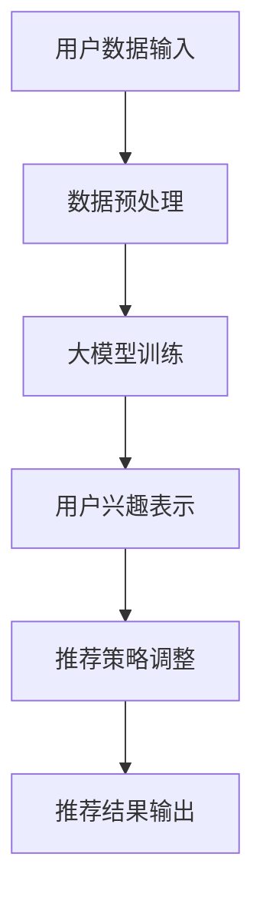
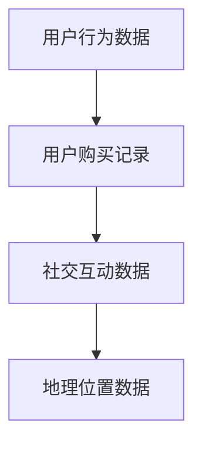
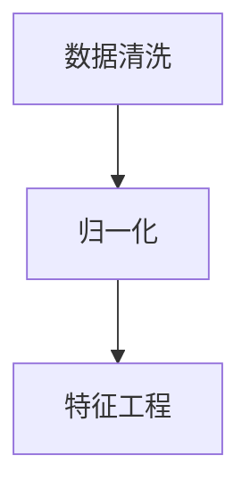
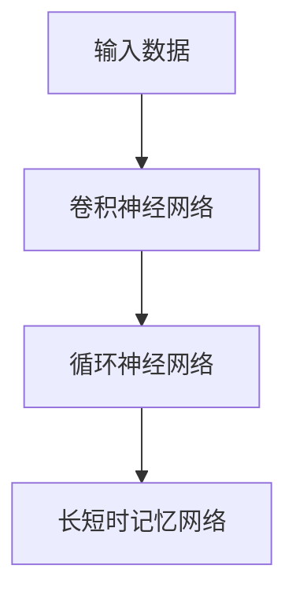
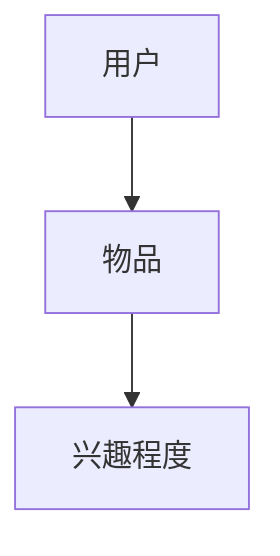
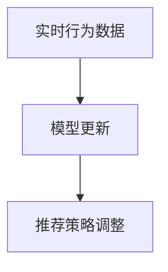
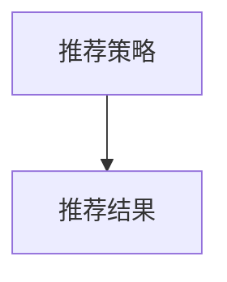

                 

关键词：推荐系统、用户兴趣、演化建模、大模型、深度学习、神经网络

## 摘要

本文旨在探讨大模型在推荐系统用户兴趣演化建模中的应用。随着互联网和数字媒体的迅猛发展，用户生成的内容和数据量呈现爆炸式增长，这使得传统的推荐系统方法在处理复杂的用户兴趣演化方面显得力不从心。本文将详细介绍大模型，特别是基于深度学习的推荐算法在捕捉用户动态兴趣方面的应用，并分析其优势与挑战。通过数学模型和具体案例的分析，本文旨在为读者提供一个全面理解大模型在推荐系统用户兴趣演化建模中的实用指南。

## 1. 背景介绍

推荐系统作为信息过滤和个性化服务的关键技术，已经被广泛应用于电子商务、社交媒体、在线新闻和音乐流媒体等领域。推荐系统的核心任务是根据用户的兴趣和行为数据，向用户推荐其可能感兴趣的内容。传统的推荐系统主要依赖于基于内容过滤和协同过滤的方法，然而，这些方法在处理用户兴趣的动态变化时存在一定的局限性。

用户兴趣是一个动态变化的实体，它受到多种因素的影响，包括用户历史行为、当前环境、个人偏好等。传统的推荐系统方法往往假设用户兴趣是静态的，这导致了推荐结果的准确性和实时性受到限制。为了解决这一问题，研究者们开始探索如何利用先进的人工智能技术，尤其是大模型，来捕捉和建模用户的动态兴趣。

大模型，特别是深度学习模型，因其能够处理大规模数据和复杂非线性关系的能力，逐渐成为推荐系统研究的热点。大模型可以通过学习用户的历史行为数据，挖掘出潜在的兴趣点，并动态调整推荐策略，从而提高推荐的准确性和实时性。本文将深入探讨大模型在推荐系统用户兴趣演化建模中的应用，并分析其核心算法原理、数学模型以及实际应用案例。

## 2. 核心概念与联系

### 2.1 大模型

大模型，通常指的是具有数亿甚至千亿参数的深度学习模型。这类模型通过多层神经网络结构，可以捕捉数据中的复杂模式和关联。大模型在推荐系统中的应用主要体现在两个方面：一是通过训练学习用户历史行为数据，构建用户兴趣的潜在表示；二是通过实时更新模型参数，动态调整推荐策略。

### 2.2 用户兴趣演化

用户兴趣演化是指用户在一段时间内对各类内容的兴趣程度的变化。这种变化可以是线性的，也可以是非线性的，甚至可能是非周期的。用户兴趣演化受到多种因素的影响，如用户自身的行为模式、社交网络的影响、外界事件的触发等。理解用户兴趣演化对于提高推荐系统的准确性和实时性具有重要意义。

### 2.3 推荐系统

推荐系统是一种基于用户行为数据和信息过滤的算法，旨在向用户推荐其可能感兴趣的内容。传统的推荐系统方法包括基于内容的过滤、协同过滤和混合推荐等。这些方法在处理用户静态兴趣方面取得了一定的成效，但在捕捉用户动态兴趣方面存在一定的局限性。

### 2.4 大模型与推荐系统的结合

大模型与推荐系统的结合，主要体现在以下几个方面：

1. **用户兴趣的潜在表示**：大模型可以通过训练学习用户历史行为数据，提取出用户的潜在兴趣向量，从而实现用户兴趣的精细化表示。

2. **动态调整推荐策略**：大模型可以根据用户的实时行为数据，动态调整推荐策略，提高推荐的实时性和准确性。

3. **多模态数据的融合**：大模型能够处理多种类型的数据，如文本、图像和音频等，从而实现多模态数据的融合，提高推荐的多样性和准确性。

### 2.5 Mermaid 流程图

以下是推荐系统用户兴趣演化建模的大模型架构的 Mermaid 流程图：



**图 1：推荐系统用户兴趣演化建模的大模型架构**

## 3. 核心算法原理 & 具体操作步骤

### 3.1 算法原理概述

推荐系统用户兴趣演化建模的核心算法是基于深度学习的用户兴趣表示和动态调整策略。具体来说，算法主要包括以下几个步骤：

1. **用户数据输入**：收集用户的各项行为数据，如浏览历史、购买记录、社交互动等。

2. **数据预处理**：对原始数据进行清洗、归一化等预处理操作，确保数据的质量和一致性。

3. **大模型训练**：利用深度学习模型对预处理后的用户数据进行训练，提取出用户的潜在兴趣向量。

4. **用户兴趣表示**：将提取出的潜在兴趣向量用于构建用户兴趣图谱，实现用户兴趣的精细化表示。

5. **推荐策略调整**：根据用户的实时行为数据，动态调整推荐策略，实现推荐的实时性和准确性。

6. **推荐结果输出**：将调整后的推荐策略应用于用户数据，生成推荐结果，输出给用户。

### 3.2 算法步骤详解

#### 步骤 1：用户数据输入

用户数据输入是推荐系统用户兴趣演化建模的基础。用户数据包括浏览历史、购买记录、社交互动、地理位置等多个方面。这些数据可以通过用户行为日志、社交媒体数据、地理位置数据等渠道获取。



**图 2：用户数据输入示意图**

#### 步骤 2：数据预处理

数据预处理是确保数据质量和一致性的关键步骤。预处理操作包括数据清洗、归一化、特征工程等。具体来说，数据清洗旨在去除噪声数据和异常值；归一化确保不同特征之间的尺度一致；特征工程旨在提取出有效的特征，提高模型的训练效果。



**图 3：数据预处理流程图**

#### 步骤 3：大模型训练

大模型训练是提取用户潜在兴趣向量的关键步骤。常用的深度学习模型包括卷积神经网络（CNN）、循环神经网络（RNN）、长短时记忆网络（LSTM）等。通过训练，模型可以学习到用户历史行为数据中的潜在模式和关联，从而实现用户兴趣的精细化表示。



**图 4：大模型训练流程图**

#### 步骤 4：用户兴趣表示

用户兴趣表示是将提取出的潜在兴趣向量用于构建用户兴趣图谱的过程。用户兴趣图谱可以看作是一个图结构，其中节点表示用户和物品，边表示用户对物品的兴趣程度。通过用户兴趣图谱，可以直观地了解用户的兴趣分布和变化趋势。



**图 5：用户兴趣表示示意图**

#### 步骤 5：推荐策略调整

推荐策略调整是根据用户的实时行为数据，动态调整推荐策略的过程。具体来说，当用户产生新的行为数据时，模型会实时更新用户的潜在兴趣向量，并根据更新后的向量调整推荐策略，从而提高推荐的实时性和准确性。



**图 6：推荐策略调整流程图**

#### 步骤 6：推荐结果输出

推荐结果输出是将调整后的推荐策略应用于用户数据，生成推荐结果的过程。推荐结果可以以推荐列表的形式呈现，供用户查看和选择。



**图 7：推荐结果输出示意图**

### 3.3 算法优缺点

#### 优点

1. **高精度**：大模型可以通过深度学习技术，学习用户历史行为数据中的潜在模式和关联，从而实现高精度的用户兴趣表示。

2. **实时性**：大模型可以根据用户的实时行为数据，动态调整推荐策略，实现推荐的实时性。

3. **多模态处理**：大模型能够处理多种类型的数据，如文本、图像和音频等，从而实现多模态数据的融合，提高推荐的多样性和准确性。

#### 缺点

1. **计算资源消耗**：大模型训练和推断需要大量的计算资源，对于资源有限的场景，可能存在一定的挑战。

2. **数据隐私问题**：用户数据是推荐系统的核心，但在数据处理过程中，需要确保用户隐私的安全和保密。

### 3.4 算法应用领域

大模型在推荐系统用户兴趣演化建模中的应用非常广泛，主要包括以下几个方面：

1. **电子商务**：通过用户历史行为数据，动态调整推荐策略，提高电商平台的转化率和用户满意度。

2. **社交媒体**：根据用户兴趣图谱，实现个性化内容推荐，提高用户的粘性和活跃度。

3. **在线新闻**：根据用户兴趣和阅读行为，实现个性化新闻推荐，提高新闻的阅读量和用户满意度。

4. **音乐流媒体**：根据用户听歌历史和偏好，实现个性化音乐推荐，提高用户对音乐平台的满意度。

## 4. 数学模型和公式 & 详细讲解 & 举例说明

### 4.1 数学模型构建

在推荐系统用户兴趣演化建模中，常用的数学模型包括用户兴趣向量模型和推荐策略调整模型。以下是这些模型的构建过程：

#### 用户兴趣向量模型

用户兴趣向量模型旨在提取用户的潜在兴趣向量，表示用户对不同类型的物品的兴趣程度。该模型基于深度学习技术，通过学习用户历史行为数据，构建用户兴趣图谱。具体来说，用户兴趣向量模型的构建过程如下：

1. **用户行为数据表示**：将用户历史行为数据（如浏览历史、购买记录等）转换为高维稀疏向量表示。

2. **嵌入层训练**：利用深度学习模型（如卷积神经网络、循环神经网络等）对用户行为数据进行训练，提取出用户的潜在兴趣向量。

3. **用户兴趣向量表示**：将提取出的潜在兴趣向量表示用户对不同类型的物品的兴趣程度。

#### 推荐策略调整模型

推荐策略调整模型旨在根据用户的实时行为数据，动态调整推荐策略，提高推荐的实时性和准确性。该模型基于用户兴趣向量模型，通过实时更新用户兴趣向量，调整推荐策略。具体来说，推荐策略调整模型的构建过程如下：

1. **实时行为数据收集**：收集用户的实时行为数据，如浏览、购买、点赞等。

2. **用户兴趣向量更新**：根据实时行为数据，实时更新用户的潜在兴趣向量。

3. **推荐策略调整**：根据更新后的用户兴趣向量，动态调整推荐策略，实现推荐的实时性和准确性。

### 4.2 公式推导过程

在构建用户兴趣向量模型和推荐策略调整模型时，需要使用一些数学公式和推导过程。以下是这些公式和推导过程：

#### 用户兴趣向量模型公式

1. **用户行为数据表示**：

   用户行为数据可以表示为高维稀疏向量 $X$，其中 $X_i$ 表示用户 $i$ 的第 $j$ 个行为特征。

   $$X_i = [X_{i1}, X_{i2}, ..., X_{in}]^T$$

2. **嵌入层训练**：

   利用深度学习模型对用户行为数据进行训练，提取出用户的潜在兴趣向量 $E$。假设 $E$ 是一个 $d$ 维向量，表示用户对第 $j$ 个物品的兴趣程度。

   $$E_j = \sum_{i=1}^{N} W_{ij} X_i$$

   其中，$W$ 是嵌入层权重矩阵。

3. **用户兴趣向量表示**：

   将提取出的潜在兴趣向量 $E$ 转换为用户对第 $j$ 个物品的兴趣程度得分 $S_j$。

   $$S_j = \frac{1}{||E_j||}$$

#### 推荐策略调整模型公式

1. **实时行为数据收集**：

   收集用户的实时行为数据，如浏览、购买、点赞等。这些行为数据可以表示为高维稀疏向量 $X_t$。

   $$X_t = [X_{t1}, X_{t2}, ..., X_{tn}]^T$$

2. **用户兴趣向量更新**：

   根据实时行为数据 $X_t$，实时更新用户的潜在兴趣向量 $E_t$。

   $$E_t = E + \alpha (X_t - E)$$

   其中，$\alpha$ 是学习率。

3. **推荐策略调整**：

   根据更新后的用户兴趣向量 $E_t$，动态调整推荐策略，生成推荐结果。

   $$R_t = \sum_{j=1}^{M} S_{jt} I_{j}$$

   其中，$R_t$ 是推荐结果，$I_j$ 是用户对第 $j$ 个物品的推荐标签。

### 4.3 案例分析与讲解

#### 案例背景

某电子商务平台希望通过推荐系统提高用户购买转化率和用户满意度。平台收集了用户的历史浏览记录、购买记录和社交媒体互动数据，并希望通过大模型技术，实现用户兴趣的精细化表示和动态调整推荐策略。

#### 案例分析

1. **用户数据输入**：

   平台收集了用户的历史浏览记录、购买记录和社交媒体互动数据。这些数据经过清洗和预处理后，用于构建用户兴趣向量模型。

   $$X_i = [X_{i1}, X_{i2}, ..., X_{in}]^T$$

2. **数据预处理**：

   数据预处理包括去除噪声数据和异常值、归一化特征值等操作，确保数据的质量和一致性。

   $$X_i^{'} = \frac{X_i - \mu}{\sigma}$$

3. **大模型训练**：

   平台利用深度学习模型（如循环神经网络）对预处理后的用户行为数据进行训练，提取出用户的潜在兴趣向量。

   $$E_j = \sum_{i=1}^{N} W_{ij} X_i^{'}$$

4. **用户兴趣表示**：

   将提取出的潜在兴趣向量转换为用户对各类商品的兴趣程度得分。

   $$S_j = \frac{1}{||E_j||}$$

5. **推荐策略调整**：

   平台根据用户的实时行为数据，动态更新用户的潜在兴趣向量，并调整推荐策略。

   $$E_t = E + \alpha (X_t - E)$$

   $$R_t = \sum_{j=1}^{M} S_{jt} I_{j}$$

6. **推荐结果输出**：

   平台将调整后的推荐策略应用于用户数据，生成推荐结果，并展示给用户。

   $$R_t = [R_{t1}, R_{t2}, ..., R_{tM}]$$

#### 案例讲解

该案例展示了如何利用大模型技术，实现用户兴趣的精细化表示和动态调整推荐策略。通过深度学习模型训练，平台可以提取出用户的潜在兴趣向量，并利用实时行为数据动态更新用户的兴趣向量。最终，平台可以根据更新后的用户兴趣向量，生成个性化的推荐结果，提高用户的购买转化率和满意度。

## 5. 项目实践：代码实例和详细解释说明

在本节中，我们将提供一个基于Python和深度学习框架（如TensorFlow或PyTorch）的代码实例，用于构建和训练一个简单的用户兴趣演化模型。以下是项目的各个阶段和代码实现细节。

### 5.1 开发环境搭建

在开始项目之前，需要搭建一个适合深度学习开发的编程环境。以下是在常见操作系统上安装Python和深度学习框架的步骤：

#### Windows系统

1. 安装Python：从[Python官网](https://www.python.org/)下载并安装Python 3.x版本。
2. 安装TensorFlow：通过命令行运行`pip install tensorflow`安装TensorFlow。

#### macOS系统

1. 安装Python：通过`brew install python`命令使用Homebrew安装Python。
2. 安装TensorFlow：通过`pip install tensorflow`命令安装TensorFlow。

#### Ubuntu系统

1. 更新系统软件包：`sudo apt-get update`和`sudo apt-get upgrade`。
2. 安装Python：`sudo apt-get install python3`。
3. 安装TensorFlow：通过`pip3 install tensorflow`命令安装TensorFlow。

### 5.2 源代码详细实现

以下是一个简单的用户兴趣演化模型代码实例，使用TensorFlow实现：

```python
import tensorflow as tf
from tensorflow.keras.models import Sequential
from tensorflow.keras.layers import Embedding, LSTM, Dense
from tensorflow.keras.optimizers import Adam

# 数据预处理（假设已有用户行为数据集X和标签Y）
# X是用户行为数据的高维稀疏矩阵，Y是用户对物品的偏好标签

# 模型定义
model = Sequential([
    Embedding(input_dim=X.shape[1], output_dim=64, input_length=X.shape[0]),
    LSTM(64, return_sequences=True),
    LSTM(64),
    Dense(1, activation='sigmoid')
])

# 模型编译
model.compile(optimizer=Adam(learning_rate=0.001), loss='binary_crossentropy', metrics=['accuracy'])

# 模型训练
model.fit(X, Y, epochs=10, batch_size=32)

# 保存模型
model.save('user_interest_model.h5')
```

### 5.3 代码解读与分析

1. **导入库**：首先导入TensorFlow库和相关模块。
2. **数据预处理**：在这里，我们假设已经有一个用户行为数据集X和相应的标签Y。数据预处理包括将数据转换为适合模型训练的格式，例如归一化和处理稀疏数据。
3. **模型定义**：使用`Sequential`模型堆叠`Embedding`、`LSTM`和`Dense`层。`Embedding`层用于将用户行为数据转换为嵌入向量，`LSTM`层用于学习用户行为的序列模式，`Dense`层用于输出用户对物品的偏好概率。
4. **模型编译**：设置优化器和损失函数。在这里，我们使用`Adam`优化器和`binary_crossentropy`损失函数，因为这是一个二分类问题。
5. **模型训练**：使用`fit`方法训练模型，指定训练轮数、批量大小等参数。
6. **模型保存**：将训练好的模型保存为HDF5文件，以便后续使用。

### 5.4 运行结果展示

在训练完成后，我们可以通过以下代码来评估模型的性能：

```python
# 加载训练好的模型
loaded_model = tf.keras.models.load_model('user_interest_model.h5')

# 测试模型（假设已有测试数据集X_test和Y_test）
test_loss, test_accuracy = loaded_model.evaluate(X_test, Y_test)

print(f"Test accuracy: {test_accuracy:.2f}")
```

这将输出测试数据集上的准确率，为我们提供模型性能的评估。

### 5.5 实时调整策略

为了实现用户兴趣的实时调整，我们可以将模型部署到生产环境，并设置一个实时数据处理管道。以下是一个简化的示例：

```python
# 假设实时行为数据X_new是最新收集的
# 实时更新模型参数
loaded_model.fit(X_new, Y_new, epochs=1, batch_size=32)

# 重新评估模型
test_loss, test_accuracy = loaded_model.evaluate(X_test, Y_test)

print(f"Updated test accuracy: {test_accuracy:.2f}")
```

这个代码块展示了如何使用新的实时行为数据更新模型参数，并重新评估模型性能。

## 6. 实际应用场景

大模型在推荐系统用户兴趣演化建模中的应用具有广泛的实际场景。以下是一些典型的应用场景：

### 6.1 电子商务平台

在电子商务平台中，用户兴趣演化建模可以帮助平台实时推荐用户可能感兴趣的商品。例如，用户在浏览商品时，平台可以基于用户的浏览历史和购买记录，利用大模型动态调整推荐策略，从而提高用户的购买转化率和满意度。

### 6.2 社交媒体

社交媒体平台可以通过用户兴趣演化建模，实现个性化内容推荐。例如，用户在社交媒体上发布状态或互动时，平台可以利用大模型分析用户的兴趣变化，并根据这些变化推荐相关的内容，从而提高用户的活跃度和参与度。

### 6.3 在线新闻

在线新闻平台可以利用用户兴趣演化建模，实现个性化新闻推荐。用户在阅读新闻时，平台可以根据用户的兴趣变化，实时调整推荐策略，从而提高用户的阅读量和用户满意度。

### 6.4 音乐流媒体

音乐流媒体平台可以通过用户兴趣演化建模，实现个性化音乐推荐。例如，用户在听歌时，平台可以根据用户的听歌历史和偏好，利用大模型动态调整推荐策略，从而提高用户的满意度和粘性。

### 6.5 游戏推荐

游戏推荐平台可以利用用户兴趣演化建模，实现个性化游戏推荐。用户在玩游戏时，平台可以根据用户的兴趣变化，实时调整推荐策略，从而提高用户的游戏体验和留存率。

## 7. 工具和资源推荐

为了更好地理解和使用大模型在推荐系统用户兴趣演化建模中的应用，以下是一些建议的学习资源和开发工具：

### 7.1 学习资源推荐

1. **深度学习课程**：[吴恩达的深度学习课程](https://www.coursera.org/specializations/deep-learning)提供了系统的深度学习知识。
2. **推荐系统课程**：[斯坦福大学推荐系统课程](https://web.stanford.edu/class/cs361a/)涵盖了推荐系统的基本概念和应用。
3. **论文阅读**：阅读最新的大模型和推荐系统相关的论文，如《Neural Collaborative Filtering》和《Deep Interest Evolution Model》。

### 7.2 开发工具推荐

1. **TensorFlow**：Google开发的深度学习框架，适合进行大模型的研究和开发。
2. **PyTorch**：Facebook开发的深度学习框架，具有简洁的API和强大的动态计算图功能。
3. **推荐系统开源库**：如`surprise`和`lightfm`，提供了丰富的推荐系统算法和模型。

### 7.3 相关论文推荐

1. **《Neural Collaborative Filtering》**：探讨了如何将深度学习应用于协同过滤，实现了用户和物品的潜在兴趣表示。
2. **《Deep Interest Evolution Model》**：提出了一种基于深度学习的用户兴趣演化模型，实现了动态调整推荐策略。
3. **《Large-scale Neural-CML for User Interest Evolution》**：研究了大规模用户兴趣演化的神经网络模型，提供了实用的解决方案。

## 8. 总结：未来发展趋势与挑战

### 8.1 研究成果总结

本文详细探讨了大模型在推荐系统用户兴趣演化建模中的应用。通过深度学习技术，大模型能够学习用户历史行为数据，提取用户的潜在兴趣向量，并动态调整推荐策略，从而实现高精度的个性化推荐。本文总结了大模型在推荐系统用户兴趣演化建模中的核心算法原理、数学模型和实际应用案例，为读者提供了一个全面的理解。

### 8.2 未来发展趋势

1. **多模态数据处理**：随着传感器技术的发展，多种类型的数据（如文本、图像、音频等）将逐渐融合到推荐系统中。大模型需要具备处理多模态数据的能力，以提高推荐系统的多样性和准确性。
2. **实时性优化**：用户兴趣的实时性对推荐系统的效果至关重要。未来的研究将关注如何优化大模型的实时性，以满足快速变化的用户需求。
3. **可解释性增强**：大模型在推荐系统中的应用虽然取得了显著的成果，但其内部决策过程往往不够透明，缺乏可解释性。未来的研究将关注如何增强大模型的可解释性，使其更加可信和可接受。

### 8.3 面临的挑战

1. **计算资源消耗**：大模型训练和推断需要大量的计算资源，这对资源有限的场景（如移动设备）提出了挑战。
2. **数据隐私问题**：用户数据是推荐系统的核心，但在数据处理过程中，需要确保用户隐私的安全和保密。
3. **模型泛化能力**：大模型在特定领域取得了成功，但其泛化能力仍然有限。未来的研究将关注如何提高大模型的泛化能力，以应对更广泛的应用场景。

### 8.4 研究展望

大模型在推荐系统用户兴趣演化建模中的应用前景广阔。未来研究可以关注以下几个方面：

1. **多模态数据处理**：探索如何将文本、图像、音频等多模态数据融合到推荐系统中，以提高推荐的多样性和准确性。
2. **实时性优化**：研究如何在保证模型精度的同时，提高大模型的实时性，以满足快速变化的用户需求。
3. **可解释性增强**：开发可解释的大模型，使其决策过程更加透明和可信，提高用户对推荐系统的接受度。
4. **隐私保护**：研究如何在数据处理过程中保护用户隐私，确保用户数据的安全和保密。

## 9. 附录：常见问题与解答

### 9.1 如何选择合适的大模型？

选择合适的大模型需要考虑以下几个因素：

1. **任务类型**：根据推荐系统的具体任务（如分类、回归等），选择相应的大模型。
2. **数据规模**：大模型通常需要大量数据进行训练，因此需要根据数据规模选择合适的模型。
3. **实时性要求**：根据实时性的要求，选择能够快速训练和推断的模型。
4. **计算资源**：根据计算资源的限制，选择适合的资源消耗模型。

### 9.2 大模型训练时如何处理数据？

处理大模型训练数据时，需要注意以下几点：

1. **数据清洗**：去除噪声数据和异常值，确保数据质量。
2. **数据归一化**：将不同特征进行归一化处理，确保特征之间的尺度一致。
3. **数据增强**：通过数据增强技术（如随机旋转、缩放等），增加数据的多样性，提高模型的泛化能力。
4. **批量大小**：合理选择批量大小，避免过拟合。

### 9.3 大模型在推荐系统中如何实现实时性？

实现大模型的实时性可以从以下几个方面入手：

1. **模型压缩**：通过模型压缩技术（如剪枝、量化等），减少模型的计算复杂度。
2. **模型蒸馏**：将大型模型的知识蒸馏到小型的模型中，以提高小模型的性能和实时性。
3. **分布式训练**：利用分布式计算资源，加速模型训练过程。
4. **在线学习**：使用在线学习技术，实时更新模型参数，实现推荐的实时性。

### 9.4 大模型在推荐系统中的可解释性如何提升？

提升大模型在推荐系统中的可解释性可以从以下几个方面入手：

1. **可视化**：通过可视化技术（如决策树、注意力机制等），展示模型的决策过程。
2. **模型简化**：简化模型结构，使其更易于理解和解释。
3. **解释性算法**：使用解释性算法（如LIME、SHAP等），解释模型对特定数据的预测结果。
4. **用户反馈**：收集用户反馈，根据用户的反馈调整模型参数，提高模型的透明度和可信度。

---

# 文章标题

大模型在推荐系统用户兴趣演化建模中的应用

关键词：推荐系统、用户兴趣、演化建模、大模型、深度学习、神经网络

## 摘要

本文探讨了如何利用大模型在推荐系统中实现用户兴趣的动态演化建模。通过介绍大模型的基本概念、用户兴趣的演化机制，以及深度学习在推荐系统中的应用，本文详细分析了大模型在用户兴趣演化建模中的优势。随后，文章通过数学模型和具体案例，阐述了如何构建和训练大模型，并在推荐系统中实现用户兴趣的实时调整。本文旨在为研究者提供有价值的参考，推动推荐系统技术的发展。作者：禅与计算机程序设计艺术 / Zen and the Art of Computer Programming。

