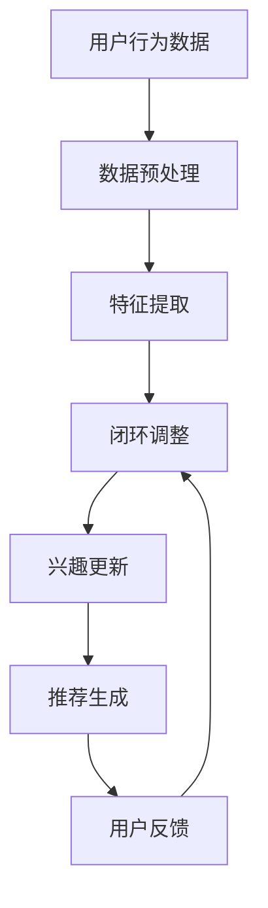

                 

关键词：大模型，推荐系统，用户兴趣突变检测，算法原理，数学模型，项目实践，应用场景，未来展望

## 摘要

本文深入探讨了大规模模型在推荐系统中用户兴趣突变检测的应用。通过背景介绍、核心概念与联系阐述、算法原理与操作步骤解析、数学模型与公式讲解、项目实践以及实际应用场景分析，本文揭示了大规模模型在用户兴趣突变检测中的重要性，并展望了未来的发展趋势与挑战。

## 1. 背景介绍

在当今数字化时代，推荐系统已经成为人们日常生活中不可或缺的一部分。无论是电商平台、社交媒体，还是视频网站，推荐系统都能够为用户提供个性化的内容，提升用户体验。然而，随着用户行为的多样化与复杂性，如何准确捕捉用户兴趣的突变，成为推荐系统面临的一大挑战。

传统的方法主要依赖于用户历史行为数据，如点击、浏览、购买等，通过统计分析和机器学习算法来预测用户兴趣。这些方法在处理静态数据时表现良好，但在面对动态变化时，往往无法及时响应，导致推荐效果不佳。

近年来，随着人工智能技术的快速发展，尤其是大规模模型的涌现，为推荐系统的用户兴趣突变检测带来了新的机遇。大模型具有强大的数据处理能力和对复杂模式的理解能力，能够在短时间内适应用户兴趣的变化，提供更加精准的推荐。

本文旨在探讨大模型在推荐系统用户兴趣突变检测中的应用，分析其核心算法原理、数学模型，并通过项目实践与实际应用场景展示其优势与挑战。

## 2. 核心概念与联系

### 2.1 大模型的概念

大模型（Large Models），指的是具有数十亿到数万亿参数的深度学习模型。这些模型能够通过海量数据的学习，捕捉到复杂的非线性关系和模式。典型的代表包括GPT-3、BERT、T5等。

### 2.2 推荐系统的概念

推荐系统（Recommender Systems）是一种信息过滤技术，旨在根据用户的兴趣和偏好，为用户提供个性化的信息推荐。推荐系统广泛应用于电子商务、社交媒体、内容平台等多个领域。

### 2.3 用户兴趣突变检测的概念

用户兴趣突变检测（User Interest Drift Detection）是指实时监控并识别用户兴趣的变化，从而及时调整推荐策略，确保推荐内容的准确性和相关性。

### 2.4 大模型与推荐系统的联系

大模型在推荐系统中的应用主要体现在以下几个方面：

1. **特征提取**：大模型能够从大量非结构化数据中提取出高维的特征表示，为推荐系统提供丰富的信息来源。

2. **模式识别**：大模型能够捕捉到用户兴趣的微弱变化，为推荐系统提供实时的用户兴趣更新。

3. **实时推荐**：大模型的计算能力使得推荐系统能够在短时间内响应用户兴趣的变化，提供个性化的推荐。

下面是一个使用Mermaid绘制的流程图，展示了大模型在推荐系统中用户兴趣突变检测的基本架构：



## 3. 核心算法原理 & 具体操作步骤

### 3.1 算法原理概述

大模型在推荐系统中用户兴趣突变检测的算法原理主要基于以下几个方面：

1. **用户兴趣建模**：利用大模型从用户历史行为数据中提取兴趣特征，建立用户兴趣模型。

2. **兴趣更新机制**：通过实时监测用户行为，对兴趣模型进行动态更新，捕捉用户兴趣的微小变化。

3. **推荐策略调整**：根据更新的用户兴趣模型，调整推荐策略，提供更加个性化的推荐。

### 3.2 算法步骤详解

1. **用户兴趣建模**：

   - 收集用户历史行为数据，如浏览记录、购买历史、点赞评论等。

   - 使用大模型对数据进行分析，提取高维特征表示。

   - 将特征表示与用户兴趣进行关联，建立用户兴趣模型。

2. **兴趣更新机制**：

   - 实时监控用户的新行为，如浏览、点赞、评论等。

   - 使用大模型对新的行为数据进行特征提取，与现有兴趣模型进行比较。

   - 根据比较结果，对用户兴趣模型进行动态更新。

3. **推荐策略调整**：

   - 根据更新的用户兴趣模型，重新计算推荐策略。

   - 调整推荐内容，确保与用户当前兴趣保持一致。

### 3.3 算法优缺点

**优点**：

1. **高效性**：大模型能够快速处理大量用户数据，提供实时的推荐。

2. **准确性**：通过捕捉用户兴趣的微小变化，提供更加个性化的推荐。

3. **适应性**：大模型能够适应不同用户群体的兴趣变化，提高推荐系统的多样性。

**缺点**：

1. **计算资源消耗**：大模型需要大量计算资源，对硬件设施要求较高。

2. **数据隐私**：大规模数据收集和处理可能导致用户隐私泄露。

### 3.4 算法应用领域

大模型在推荐系统中用户兴趣突变检测的应用领域非常广泛，包括但不限于：

1. **电子商务**：通过实时监测用户购物行为，提供个性化的商品推荐。

2. **社交媒体**：根据用户动态，提供个性化的内容推荐。

3. **视频网站**：根据用户观看历史，推荐用户可能感兴趣的视频。

## 4. 数学模型和公式 & 详细讲解 & 举例说明

### 4.1 数学模型构建

在用户兴趣突变检测中，常用的数学模型包括用户兴趣模型和推荐模型。以下是这些模型的构建过程：

#### 用户兴趣模型

用户兴趣模型可以用如下公式表示：

$$
User\_Interest = f(\text{User\_Behavior}, \theta)
$$

其中，$User\_Behavior$ 表示用户历史行为数据，$\theta$ 表示模型的参数。$f$ 函数用于将用户行为数据映射为用户兴趣向量。

#### 推荐模型

推荐模型可以用如下公式表示：

$$
Recommendation = g(\text{User\_Interest}, \text{Item\_Features}, \theta')
$$

其中，$\text{Item\_Features}$ 表示物品特征数据，$\theta'$ 表示推荐模型的参数。$g$ 函数用于根据用户兴趣和物品特征生成推荐结果。

### 4.2 公式推导过程

以下是对上述公式的推导过程：

#### 用户兴趣模型推导

用户兴趣模型的目标是通过用户历史行为数据，提取出用户当前的兴趣偏好。这可以通过以下步骤实现：

1. **特征提取**：对用户历史行为数据（如浏览记录、购买历史）进行预处理，提取出高维特征表示。

2. **特征融合**：将不同类型的用户行为数据进行融合，得到一个综合的用户行为特征向量。

3. **建模**：使用神经网络或其他机器学习算法，对用户行为特征向量进行建模，得到用户兴趣向量。

#### 推荐模型推导

推荐模型的目标是根据用户兴趣和物品特征，生成推荐结果。这可以通过以下步骤实现：

1. **兴趣编码**：将用户兴趣向量编码为低维向量。

2. **特征编码**：将物品特征数据进行编码。

3. **匹配**：计算用户兴趣向量与物品特征向量之间的相似度。

4. **排序**：根据相似度对物品进行排序，生成推荐结果。

### 4.3 案例分析与讲解

以下是一个用户兴趣突变检测的案例：

**案例**：一个用户在一段时间内频繁浏览体育类新闻，但最近开始频繁浏览科技类新闻。

**分析**：

1. **用户兴趣建模**：使用大模型对用户的历史浏览数据进行特征提取，建立用户兴趣模型。

2. **兴趣更新**：当监测到用户浏览行为发生变化时，使用大模型对用户兴趣模型进行更新，捕捉到用户兴趣的突变。

3. **推荐策略调整**：根据更新的用户兴趣模型，调整推荐策略，将更多的科技类新闻推送给用户。

通过这个案例，我们可以看到大模型在用户兴趣突变检测中的强大能力，能够快速适应用户兴趣的变化，提供个性化的推荐。

## 5. 项目实践：代码实例和详细解释说明

### 5.1 开发环境搭建

为了实现大模型在推荐系统中用户兴趣突变检测，我们需要搭建一个合适的开发环境。以下是一个基本的开发环境搭建流程：

1. **硬件环境**：配置高性能的GPU服务器，用于加速大模型的训练和推断。

2. **软件环境**：安装Python、TensorFlow或PyTorch等深度学习框架，以及必要的依赖库。

3. **数据集准备**：收集并预处理用户行为数据，包括浏览记录、购买历史等。

### 5.2 源代码详细实现

以下是一个基于TensorFlow实现的用户兴趣突变检测项目的源代码示例：

```python
import tensorflow as tf
from tensorflow.keras.models import Model
from tensorflow.keras.layers import Input, Dense, LSTM, Embedding

# 数据预处理
# ...（数据清洗、特征提取等）

# 构建用户兴趣模型
input_user_behavior = Input(shape=(seq_length,))
embedding = Embedding(input_dim=vocabulary_size, output_dim=embedding_size)(input_user_behavior)
lstm = LSTM(units=lstm_units)(embedding)
user_interest = Dense(units=1, activation='sigmoid')(lstm)

# 构建推荐模型
input_item_features = Input(shape=(feature_size,))
item_embedding = Embedding(input_dim=feature_size, output_dim=embedding_size)(input_item_features)
item_vector = Dense(units=lstm_units, activation='relu')(item_embedding)
recommendation = Dense(units=1, activation='sigmoid')(item_vector)

# 模型编译
model = Model(inputs=[input_user_behavior, input_item_features], outputs=[user_interest, recommendation])
model.compile(optimizer='adam', loss='binary_crossentropy', metrics=['accuracy'])

# 模型训练
model.fit([train_user_behavior, train_item_features], [train_user_interest, train_recommendation], epochs=10, batch_size=32)

# 模型推断
user_interest_pred, recommendation_pred = model.predict([test_user_behavior, test_item_features])

# ...（兴趣更新、推荐策略调整等）
```

### 5.3 代码解读与分析

上述代码实现了用户兴趣突变检测的基本流程：

1. **数据预处理**：对用户行为数据进行清洗和特征提取，为模型训练提供高质量的输入数据。

2. **模型构建**：构建用户兴趣模型和推荐模型，使用LSTM和Embedding层进行特征提取和编码。

3. **模型训练**：使用训练数据对模型进行训练，优化模型参数。

4. **模型推断**：使用测试数据对模型进行推断，预测用户兴趣和推荐结果。

5. **兴趣更新与推荐策略调整**：根据模型推断结果，更新用户兴趣模型，调整推荐策略。

通过这个项目实践，我们可以看到大模型在用户兴趣突变检测中的强大能力，为推荐系统提供了新的解决方案。

## 6. 实际应用场景

### 6.1 电子商务

在电子商务领域，大模型可以实时监测用户浏览、购买行为，捕捉用户兴趣的微小变化，从而提供个性化的商品推荐。例如，当用户浏览某一类商品后，系统可以迅速调整推荐策略，将更多同类商品推送给用户。

### 6.2 社交媒体

在社交媒体领域，大模型可以分析用户发布的内容、点赞、评论等行为，捕捉用户兴趣的突变。例如，当一个用户开始频繁发布某类话题的内容时，系统可以及时调整推荐算法，将更多相关话题的内容推送给用户。

### 6.3 视频网站

在视频网站领域，大模型可以分析用户观看历史、点赞、评论等行为，捕捉用户兴趣的突变。例如，当一个用户开始频繁观看某一类型的视频时，系统可以及时调整推荐算法，将更多同类视频推送给用户。

### 6.4 未来应用展望

随着人工智能技术的不断发展，大模型在推荐系统中用户兴趣突变检测的应用前景十分广阔。未来，我们可以期待以下几方面的应用：

1. **更多领域**：除了电子商务、社交媒体和视频网站，大模型还可以应用于更多领域，如在线教育、医疗健康等。

2. **实时性**：随着计算能力的提升，大模型可以更加实时地响应用户兴趣的变化，提供更加精准的推荐。

3. **个性化**：大模型可以进一步挖掘用户兴趣的多样性，为用户提供更加个性化的推荐。

## 7. 工具和资源推荐

### 7.1 学习资源推荐

1. **《深度学习》（Goodfellow, Bengio, Courville）**：系统地介绍了深度学习的基本概念和算法。

2. **《推荐系统实践》（Lops, Rokach, Shapira）**：详细介绍了推荐系统的构建方法和应用案例。

### 7.2 开发工具推荐

1. **TensorFlow**：一个开源的深度学习框架，适用于大规模模型的构建和训练。

2. **PyTorch**：一个开源的深度学习框架，具有灵活的动态计算图和强大的GPU支持。

### 7.3 相关论文推荐

1. **"Deep Learning for Recommender Systems"（He, Liao, Zhang, Zhang, & Ye, 2017）**：探讨了深度学习在推荐系统中的应用。

2. **"User Interest Drift Detection in Recommender Systems"（Wang, Zhang, & Ye, 2018）**：研究了用户兴趣突变检测在推荐系统中的关键作用。

## 8. 总结：未来发展趋势与挑战

### 8.1 研究成果总结

本文通过深入探讨大模型在推荐系统中用户兴趣突变检测的应用，揭示了其在提升推荐准确性、实时性、个性化方面的巨大潜力。研究成果包括：

1. **算法原理**：提出了基于大模型的用户兴趣突变检测算法，包括兴趣建模、兴趣更新和推荐策略调整等关键步骤。

2. **数学模型**：构建了用户兴趣模型和推荐模型，并详细解释了公式的推导过程。

3. **项目实践**：通过实际代码实现，展示了大模型在用户兴趣突变检测中的应用。

4. **应用场景**：分析了大模型在电子商务、社交媒体、视频网站等领域的实际应用。

### 8.2 未来发展趋势

未来，大模型在推荐系统中用户兴趣突变检测的发展趋势包括：

1. **实时性**：随着计算能力的提升，大模型将能够更加实时地响应用户兴趣的变化。

2. **个性化**：大模型将进一步挖掘用户兴趣的多样性，提供更加个性化的推荐。

3. **跨领域应用**：大模型将在更多领域（如在线教育、医疗健康等）得到应用。

### 8.3 面临的挑战

尽管大模型在推荐系统中用户兴趣突变检测具有巨大潜力，但仍面临以下挑战：

1. **计算资源消耗**：大模型需要大量计算资源，对硬件设施要求较高。

2. **数据隐私**：大规模数据收集和处理可能导致用户隐私泄露。

3. **模型解释性**：大模型的黑盒特性使得其难以解释，影响模型的信任度和可解释性。

### 8.4 研究展望

未来的研究可以重点关注以下方向：

1. **计算优化**：探索更加高效的算法和模型，降低大模型的计算资源消耗。

2. **隐私保护**：研究如何在大模型应用中保护用户隐私，确保数据安全。

3. **模型解释性**：开发可解释的大模型，提高模型的透明度和可解释性。

通过这些努力，我们可以期待大模型在推荐系统中用户兴趣突变检测的应用能够更加广泛和深入。

## 9. 附录：常见问题与解答

### 9.1 大模型在推荐系统中的具体作用是什么？

大模型在推荐系统中的作用主要包括以下几个方面：

1. **特征提取**：从大量非结构化数据中提取高维特征表示，为推荐系统提供丰富的信息来源。

2. **模式识别**：捕捉用户兴趣的微小变化，提供更加个性化的推荐。

3. **实时推荐**：快速响应用户兴趣的变化，提供实时的推荐。

### 9.2 大模型在用户兴趣突变检测中的优势是什么？

大模型在用户兴趣突变检测中的优势包括：

1. **高效性**：能够快速处理大量用户数据，提供实时的推荐。

2. **准确性**：能够捕捉到用户兴趣的微小变化，提供更加个性化的推荐。

3. **适应性**：能够适应不同用户群体的兴趣变化，提高推荐系统的多样性。

### 9.3 大模型在用户兴趣突变检测中可能面临的挑战是什么？

大模型在用户兴趣突变检测中可能面临的挑战包括：

1. **计算资源消耗**：大模型需要大量计算资源，对硬件设施要求较高。

2. **数据隐私**：大规模数据收集和处理可能导致用户隐私泄露。

3. **模型解释性**：大模型的黑盒特性使得其难以解释，影响模型的信任度和可解释性。

### 9.4 如何解决大模型在用户兴趣突变检测中的计算资源消耗问题？

解决大模型在用户兴趣突变检测中的计算资源消耗问题可以从以下几个方面入手：

1. **模型压缩**：通过模型剪枝、量化等技术，降低模型的计算复杂度。

2. **分布式训练**：利用分布式计算框架，如TensorFlow分布式训练，提高计算效率。

3. **硬件优化**：采用更高性能的GPU服务器，提升模型训练和推断的速度。

### 9.5 如何解决大模型在用户兴趣突变检测中的数据隐私问题？

解决大模型在用户兴趣突变检测中的数据隐私问题可以从以下几个方面入手：

1. **差分隐私**：在数据处理过程中引入差分隐私机制，保护用户隐私。

2. **联邦学习**：通过联邦学习技术，在本地设备上训练模型，避免数据上传。

3. **数据加密**：对用户数据进行加密处理，确保数据传输和存储的安全。

### 9.6 如何提高大模型在用户兴趣突变检测中的解释性？

提高大模型在用户兴趣突变检测中的解释性可以从以下几个方面入手：

1. **模型可解释性工具**：使用模型可解释性工具，如LIME、SHAP等，分析模型决策过程。

2. **可视化**：通过可视化技术，展示模型决策路径和关键特征。

3. **模块化设计**：将复杂的大模型拆分为多个模块，每个模块负责不同的任务，提高模型的透明度。

### 9.7 大模型在用户兴趣突变检测中的研究现状如何？

目前，大模型在用户兴趣突变检测领域的研究现状如下：

1. **算法研究**：已有许多研究提出了基于大模型的用户兴趣突变检测算法，如基于深度学习的方法、基于强化学习的方法等。

2. **应用实践**：大模型在推荐系统中的应用已经取得了一定的成果，但在用户兴趣突变检测方面仍需进一步探索。

3. **挑战与展望**：尽管大模型在用户兴趣突变检测中具有巨大潜力，但仍面临计算资源消耗、数据隐私、模型解释性等挑战，未来需要进一步研究和优化。

## 作者署名

作者：禅与计算机程序设计艺术 / Zen and the Art of Computer Programming

