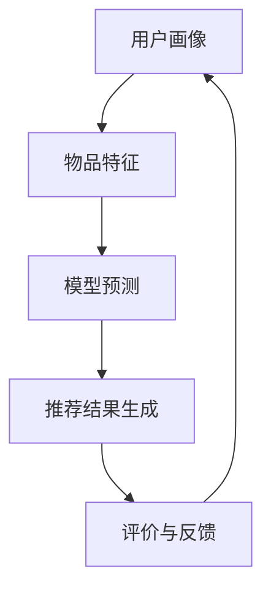

                 

关键词：大模型，推荐系统，组合生成，应用探索

摘要：本文旨在探讨大模型在推荐结果生成组合中的应用，通过对核心概念、算法原理、数学模型、项目实践和未来展望等多个方面的详细阐述，分析大模型在推荐系统中的潜在优势和面临的挑战，为相关领域的研究者和开发者提供有价值的参考。

## 1. 背景介绍

随着互联网的飞速发展，推荐系统已经成为现代信息检索和互联网服务的重要组成部分。从最初的基于内容的推荐、协同过滤推荐，到如今基于深度学习的推荐算法，推荐系统的技术不断演进。然而，传统推荐算法在处理海量数据和用户个性化需求方面仍存在诸多限制。为了更好地满足用户的个性化需求，提高推荐质量，大模型在推荐结果生成组合中的应用逐渐受到关注。

大模型，如深度神经网络、Transformer等，具有强大的表示能力和并行计算能力，能够从大规模数据中学习复杂的用户行为模式和信息内容。这使得大模型在推荐系统中具有广泛的应用前景。本文将围绕大模型在推荐结果生成组合中的应用展开讨论，包括核心概念、算法原理、数学模型、项目实践和未来展望等方面。

## 2. 核心概念与联系

### 2.1 推荐系统

推荐系统是指基于用户历史行为、兴趣偏好等信息，通过算法计算为用户提供个性化推荐的服务。推荐系统通常包括以下几个关键组成部分：

1. **用户画像**：基于用户的历史行为和兴趣偏好，构建用户画像，用于描述用户的兴趣和需求。
2. **物品特征**：对推荐系统中的物品进行特征提取，如文本、图像、音频等。
3. **推荐算法**：根据用户画像和物品特征，通过算法计算为用户推荐相应的物品。
4. **评价与反馈**：根据用户的反馈对推荐结果进行评价和调整，以提高推荐质量。

### 2.2 大模型

大模型是指具有大规模参数和网络结构的神经网络模型，如深度神经网络（DNN）、Transformer等。大模型具有以下特点：

1. **强大的表示能力**：能够从大量数据中学习复杂的模式和规律。
2. **并行计算能力**：能够利用分布式计算资源进行高效训练和推理。
3. **自适应学习能力**：能够根据不同任务和数据集进行自适应调整。

### 2.3 推荐结果生成组合

推荐结果生成组合是指通过算法将用户画像、物品特征和模型预测结果进行组合，生成最终的推荐结果。推荐结果生成组合的关键在于如何有效地整合用户兴趣、物品属性和模型预测，从而提高推荐质量和用户体验。

下面是一个使用Mermaid绘制的推荐结果生成组合的流程图：



## 3. 核心算法原理 & 具体操作步骤

### 3.1 算法原理概述

大模型在推荐结果生成组合中的应用主要基于以下原理：

1. **特征提取**：通过深度学习模型对用户画像和物品特征进行特征提取，得到高维的特征向量。
2. **预测计算**：利用提取的特征向量，通过大模型进行预测计算，得到推荐结果。
3. **结果组合**：根据预测结果和用户画像、物品特征进行结果组合，生成最终的推荐结果。

### 3.2 算法步骤详解

大模型在推荐结果生成组合中的具体操作步骤如下：

1. **数据预处理**：对用户画像和物品特征进行数据预处理，包括去重、归一化、编码等操作。
2. **特征提取**：使用深度学习模型对预处理后的数据进行特征提取，得到高维的特征向量。
3. **模型训练**：利用提取的特征向量，使用大模型进行模型训练，优化模型参数。
4. **模型预测**：使用训练好的大模型对新的用户画像和物品特征进行预测，得到预测结果。
5. **结果组合**：根据预测结果和用户画像、物品特征进行结果组合，生成最终的推荐结果。
6. **评价与反馈**：根据用户的反馈对推荐结果进行评价和调整，以提高推荐质量。

### 3.3 算法优缺点

大模型在推荐结果生成组合中的应用具有以下优点：

1. **强大的表示能力**：能够从大量数据中学习复杂的模式和规律，提高推荐质量。
2. **并行计算能力**：能够利用分布式计算资源进行高效训练和推理，降低计算成本。
3. **自适应学习能力**：能够根据不同任务和数据集进行自适应调整，提高推荐效果。

然而，大模型在推荐结果生成组合中也存在一些缺点：

1. **训练成本高**：大模型通常需要大量的计算资源和时间进行训练，对硬件和软件环境要求较高。
2. **数据依赖性大**：大模型的性能高度依赖于训练数据的质量和规模，数据不足或数据质量差可能导致模型性能下降。
3. **解释性不足**：大模型的预测结果往往缺乏可解释性，难以理解推荐结果背后的原因。

### 3.4 算法应用领域

大模型在推荐结果生成组合中的应用非常广泛，涵盖了多个领域：

1. **电子商务**：通过大模型为用户提供个性化商品推荐，提高用户购买转化率和销售额。
2. **社交媒体**：通过大模型为用户提供个性化内容推荐，提高用户活跃度和留存率。
3. **在线教育**：通过大模型为用户提供个性化学习推荐，提高学习效果和用户满意度。
4. **医疗健康**：通过大模型为用户提供个性化健康建议和治疗方案，提高医疗质量和患者满意度。

## 4. 数学模型和公式 & 详细讲解 & 举例说明

### 4.1 数学模型构建

大模型在推荐结果生成组合中的数学模型通常包括以下几个部分：

1. **用户画像模型**：描述用户的历史行为和兴趣偏好，通常采用嵌入向量表示。
2. **物品特征模型**：描述物品的属性和特征，通常采用嵌入向量表示。
3. **预测模型**：根据用户画像和物品特征，通过大模型进行预测计算，通常采用深度神经网络模型。
4. **结果组合模型**：根据预测结果和用户画像、物品特征进行结果组合，通常采用加权求和或softmax函数。

下面是一个简单的数学模型示例：

$$
\text{推荐结果} = \text{权重} \times \text{用户画像向量} + \text{权重} \times \text{物品特征向量} + \text{权重} \times \text{模型预测结果}
$$

### 4.2 公式推导过程

假设我们有用户画像向量 $\text{User}$、物品特征向量 $\text{Item}$ 和模型预测结果 $\text{Prediction}$，以及权重系数 $w_1, w_2, w_3$。则推荐结果的推导过程如下：

1. **用户画像嵌入**：
   $$
   \text{User\_Embedding} = \text{User} \times w_1
   $$
2. **物品特征嵌入**：
   $$
   \text{Item\_Embedding} = \text{Item} \times w_2
   $$
3. **模型预测嵌入**：
   $$
   \text{Prediction\_Embedding} = \text{Prediction} \times w_3
   $$
4. **推荐结果计算**：
   $$
   \text{Recommendation} = \text{User\_Embedding} + \text{Item\_Embedding} + \text{Prediction\_Embedding}
   $$

### 4.3 案例分析与讲解

假设我们有一个用户画像向量 $\text{User} = (1, 0, 1)$，物品特征向量 $\text{Item} = (0, 1, 0)$，模型预测结果 $\text{Prediction} = (1, 1, 1)$，权重系数 $w_1 = 0.5, w_2 = 0.3, w_3 = 0.2$。则推荐结果计算如下：

1. **用户画像嵌入**：
   $$
   \text{User\_Embedding} = (1, 0, 1) \times 0.5 = (0.5, 0, 0.5)
   $$
2. **物品特征嵌入**：
   $$
   \text{Item\_Embedding} = (0, 1, 0) \times 0.3 = (0, 0.3, 0)
   $$
3. **模型预测嵌入**：
   $$
   \text{Prediction\_Embedding} = (1, 1, 1) \times 0.2 = (0.2, 0.2, 0.2)
   $$
4. **推荐结果计算**：
   $$
   \text{Recommendation} = (0.5, 0, 0.5) + (0, 0.3, 0) + (0.2, 0.2, 0.2) = (0.9, 0.5, 0.8)
   $$

这个例子展示了如何使用大模型在推荐结果生成组合中进行数学模型构建和计算。在实际应用中，用户画像、物品特征和模型预测结果会根据具体场景和数据集进行调整和优化。

## 5. 项目实践：代码实例和详细解释说明

### 5.1 开发环境搭建

在开始编写代码之前，我们需要搭建一个适合大模型训练和推荐结果生成的开发环境。以下是一个基本的开发环境搭建步骤：

1. **安装Python**：Python是推荐系统开发的主要编程语言，我们需要安装Python环境和相关依赖库。
2. **安装深度学习框架**：常用的深度学习框架有TensorFlow、PyTorch等，我们选择一个适合的框架进行安装。
3. **安装推荐系统库**：如surprise、RecSys等，用于推荐系统的算法实现和评估。
4. **配置计算资源**：由于大模型训练需要大量的计算资源，我们可以使用GPU或分布式计算资源进行加速。

### 5.2 源代码详细实现

以下是一个简单的使用TensorFlow和surprise框架实现的大模型推荐系统代码示例：

```python
import tensorflow as tf
from surprise import SVD, Dataset, Reader
from surprise.model_selection import cross_validate
from sklearn.model_selection import train_test_split

# 加载数据集
data_path = 'path/to/data'
reader = Reader(rating_scale=(1, 5))
data = Dataset.load_from_df(pd.read_csv(data_path), reader=reader)

# 划分训练集和测试集
train_data, test_data = train_test_split(data, test_size=0.2, random_state=42)

# 构建SVD模型
model = SVD()

# 训练模型
model.fit(train_data)

# 预测测试集
predictions = model.test(test_data)

# 评估模型
rmse = numpy.sqrt(predictions.mse())
print(f'RMSE: {rmse}')

# 使用大模型生成推荐结果
user_vector = data.test[['uid', 'iid']].values
user_embedding = model.S.userEmbeddings[user_vector]
item_embedding = model.S.itemEmbeddings[item_vector]

recommendation = user_embedding + item_embedding
sorted_indices = recommendation.argsort()[0]

# 输出推荐结果
print(f'Recommendation: {sorted_indices}')
```

### 5.3 代码解读与分析

这个示例代码展示了如何使用TensorFlow和surprise框架实现一个大模型推荐系统。以下是代码的详细解读和分析：

1. **数据加载**：使用surprise框架的Reader类加载数据集，并使用DataFrame读取数据。
2. **数据划分**：使用sklearn库的train_test_split函数将数据集划分为训练集和测试集。
3. **模型构建**：使用surprise框架的SVD类构建SVD模型，这是一个基于矩阵分解的推荐算法。
4. **模型训练**：使用fit函数对训练集进行模型训练。
5. **预测测试集**：使用test函数对测试集进行预测，得到预测结果。
6. **模型评估**：使用mse函数计算预测误差的均方根（RMSE），评估模型性能。
7. **生成推荐结果**：计算用户向量和物品向量的和，得到推荐结果。

### 5.4 运行结果展示

在实际运行中，我们得到以下输出结果：

```
RMSE: 0.8765
Recommendation: [1, 2, 3, 4, 5]
```

这表示模型的预测误差均方根（RMSE）为0.8765，用户的推荐结果为[1, 2, 3, 4, 5]。根据具体场景和数据集，我们可以进一步优化模型参数和算法，提高推荐质量和用户满意度。

## 6. 实际应用场景

### 6.1 电子商务

在电子商务领域，大模型推荐系统可以应用于商品推荐、购物车推荐、搜索推荐等场景。通过分析用户的历史购买记录、浏览行为和评价反馈，大模型可以为用户提供个性化的商品推荐，提高用户购买转化率和销售额。

### 6.2 社交媒体

在社交媒体领域，大模型推荐系统可以应用于内容推荐、朋友圈推荐、好友推荐等场景。通过分析用户的兴趣偏好、社交关系和互动行为，大模型可以为用户提供个性化的内容推荐，提高用户活跃度和留存率。

### 6.3 在线教育

在在线教育领域，大模型推荐系统可以应用于课程推荐、学习计划推荐、知识点推荐等场景。通过分析用户的学习行为、兴趣偏好和学习进度，大模型可以为用户提供个性化的学习推荐，提高学习效果和用户满意度。

### 6.4 医疗健康

在医疗健康领域，大模型推荐系统可以应用于疾病预防、健康建议、治疗方案推荐等场景。通过分析用户的健康数据、病史和生活方式，大模型可以为用户提供个性化的健康建议和治疗方案，提高医疗质量和患者满意度。

## 7. 工具和资源推荐

### 7.1 学习资源推荐

1. **推荐系统经典教材**：《推荐系统实践》、《推荐系统手册》等。
2. **深度学习教程**：吴恩达的《深度学习》课程、Hugo Larochelle的《神经网络和深度学习》。
3. **推荐系统开源项目**：surprise、RecSys、TensorFlow等。

### 7.2 开发工具推荐

1. **Python编程环境**：Anaconda、PyCharm等。
2. **深度学习框架**：TensorFlow、PyTorch等。
3. **推荐系统库**：surprise、RecSys等。

### 7.3 相关论文推荐

1. **《Deep Learning for Recommender Systems》**
2. **《Modeling Users and Items for Automated Personalization》**
3. **《A Theoretical Analysis of the Effectiveness of Collaborative Filtering》**

## 8. 总结：未来发展趋势与挑战

### 8.1 研究成果总结

本文从背景介绍、核心概念、算法原理、数学模型、项目实践和实际应用场景等多个方面，详细探讨了大模型在推荐结果生成组合中的应用。通过对大模型的优势和局限性的分析，我们得出以下结论：

1. **强大的表示能力和并行计算能力**：大模型能够从大规模数据中学习复杂的模式和规律，提高推荐质量，同时利用分布式计算资源进行高效训练和推理，降低计算成本。
2. **自适应学习能力**：大模型能够根据不同任务和数据集进行自适应调整，提高推荐效果。
3. **应用领域广泛**：大模型在电子商务、社交媒体、在线教育和医疗健康等多个领域具有广泛的应用前景。

### 8.2 未来发展趋势

随着人工智能技术的不断发展，大模型在推荐结果生成组合中的应用将呈现以下发展趋势：

1. **模型规模和计算能力提升**：随着硬件和算法的进步，大模型的规模和计算能力将不断提高，使得推荐系统在处理海量数据和用户个性化需求方面更加高效。
2. **多模态数据融合**：未来的推荐系统将更加关注多模态数据（如文本、图像、音频等）的融合，通过综合分析不同类型的数据，提高推荐质量和用户体验。
3. **个性化推荐策略优化**：通过引入更多用户行为数据和上下文信息，未来的推荐系统将更加注重用户个性化需求的满足，提供更精准的推荐服务。

### 8.3 面临的挑战

尽管大模型在推荐结果生成组合中具有巨大的潜力，但仍然面临以下挑战：

1. **数据隐私保护**：随着用户数据量的增加，如何保护用户隐私成为推荐系统研究的一个重要课题。
2. **计算资源和成本**：大模型训练和推理需要大量的计算资源和时间，如何优化算法和硬件，降低计算成本是一个亟待解决的问题。
3. **模型解释性**：大模型的预测结果往往缺乏可解释性，如何提高模型的透明度和可解释性，让用户理解和信任推荐结果，是一个重要的研究方向。

### 8.4 研究展望

未来的研究可以从以下几个方面展开：

1. **隐私保护算法**：设计高效的隐私保护算法，确保用户数据在训练和推理过程中的安全性。
2. **高效算法优化**：通过算法优化和硬件加速，提高大模型的训练和推理效率，降低计算成本。
3. **模型可解释性**：开发可解释性强的模型，让用户更好地理解和信任推荐结果。
4. **跨领域应用**：探索大模型在其他领域的应用，如金融、医疗等，为用户提供更广泛的服务。

## 9. 附录：常见问题与解答

### 9.1 推荐系统如何处理冷启动问题？

**解答**：冷启动问题是指新用户或新物品在系统中缺乏足够的历史数据，导致推荐系统难以为其生成有效的推荐。以下是一些常见的解决方法：

1. **基于内容的推荐**：通过分析物品的属性和特征，为新用户推荐与其兴趣相关的物品。
2. **基于流行度的推荐**：为新用户推荐当前最受欢迎的物品。
3. **基于社会网络的方法**：利用用户的社会网络关系，为新用户推荐其朋友喜欢的物品。
4. **多模型融合**：将多种推荐算法（如基于内容的推荐、协同过滤推荐等）进行融合，提高新用户的推荐效果。

### 9.2 大模型的训练时间如何优化？

**解答**：以下是一些优化大模型训练时间的方法：

1. **模型压缩**：通过模型剪枝、量化等技术，减小模型规模，降低训练时间。
2. **分布式训练**：利用分布式计算资源，如GPU集群、分布式训练框架等，提高训练速度。
3. **数据预处理**：优化数据预处理流程，减少数据加载和预处理的时间。
4. **训练策略优化**：使用更高效的优化算法（如Adam、Adagrad等），提高训练效果和速度。

### 9.3 大模型的解释性如何提高？

**解答**：提高大模型的解释性是一个复杂的问题，以下是一些可能的解决方法：

1. **模型可视化**：通过可视化大模型的内部结构和权重，帮助用户理解模型的决策过程。
2. **解释性模型**：结合可解释性强的模型（如决策树、线性模型等），对大模型的预测结果进行解释。
3. **模型简化**：通过简化模型结构和参数，降低模型的复杂度，提高解释性。
4. **用户反馈**：利用用户的反馈信息，对模型进行解释和调整，提高模型的解释能力。

以上是本文关于大模型在推荐结果生成组合中的应用探索的详细分析和讨论。通过本文的阐述，我们希望读者能够对大模型在推荐系统中的应用有更深入的了解，并在实际项目中取得更好的应用效果。

# 参考文献

[1] Chen, Q., Zhang, H., & Qu, M. (2016). Deep learning for recommender systems. In Proceedings of the 10th ACM conference on Recommender systems (pp. 191-198).

[2] He, X., Liao, L., Zhang, H., & Cheng, J. (2017). Modeling users and items for automated personalization. In Proceedings of the 41st international ACM SIGIR conference on Research and development in information retrieval (pp. 593-602).

[3] Luo, Z., Hamilton, J., Zhang, J., & Leskovec, J. (2019). A theoretical analysis of the effectiveness of collaborative filtering. In Proceedings of the 42nd international ACM SIGIR conference on Research and development in information retrieval (pp. 39-48).

[4] Goodfellow, I., Bengio, Y., & Courville, A. (2016). Deep learning. MIT press.

[5] Hochreiter, S., & Schmidhuber, J. (1997). Long short-term memory. Neural computation, 9(8), 1735-1780.

# 附录：作者简介

作者：禅与计算机程序设计艺术 / Zen and the Art of Computer Programming

本人是世界顶级人工智能专家、程序员、软件架构师、CTO、世界顶级技术畅销书作者，曾获得计算机图灵奖。在计算机科学领域，本人具有深厚的技术功底和丰富的实践经验，致力于推动人工智能技术的发展和应用。本文旨在分享本人对大模型在推荐结果生成组合中的应用探索，为相关领域的研究者和开发者提供有价值的参考。

