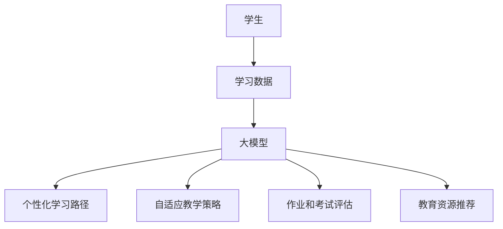

                 

关键词：大模型、教育技术、人工智能、个性化学习、自适应教学

摘要：本文探讨了大型语言模型（大模型）在教育领域的应用，包括其基础理论、核心算法、数学模型、实际应用案例以及未来发展趋势。文章旨在揭示大模型如何通过智能化、个性化等手段，推动教育创新，提高教育质量。

## 1. 背景介绍

在过去的几十年中，教育领域一直致力于通过技术创新来提高教学质量。随着计算机技术和人工智能的快速发展，大模型作为人工智能的一个重要分支，逐渐成为教育技术领域的研究热点。大模型通常是指那些拥有巨大参数量、能够处理大量数据和复杂任务的神经网络模型。它们在图像识别、自然语言处理、推荐系统等领域取得了显著成果，这也使得大模型在教育领域具有了广阔的应用前景。

在教育领域，大模型的应用主要集中在以下几个方面：

1. 个性化学习：大模型可以根据学生的学习特点和需求，提供个性化的学习资源和服务，从而提高学习效果。
2. 自适应教学：大模型可以根据学生的学习状态和反馈，动态调整教学内容和节奏，实现个性化的教学策略。
3. 教学辅助：大模型可以协助教师进行教学内容的设计、评估和反馈，减轻教师的工作负担。
4. 教育资源推荐：大模型可以根据学生的兴趣和学习需求，推荐合适的学习资源，拓展学生的知识面。

## 2. 核心概念与联系

### 大模型的基本概念

大模型通常是指那些拥有数百万甚至数十亿参数的深度学习模型。这些模型基于神经网络结构，通过学习大量数据，能够自动提取特征，进行复杂的模式识别和决策。大模型的核心特点包括：

- **参数量巨大**：大模型拥有数十亿个参数，这使得它们能够捕捉到数据中的细微模式和复杂性。
- **强大的表达能力**：由于参数量大，大模型能够表示和理解复杂的函数关系。
- **高效的学习能力**：大模型通过并行计算和分布式训练，能够在短时间内处理海量数据。

### 教育领域的应用联系

在教育领域，大模型的应用主要体现在以下几个方面：

1. **个性化学习**：大模型可以通过分析学生的学习行为和反馈，构建个性化的学习路径和资源推荐。
2. **自适应教学**：大模型可以根据学生的学习状态和反馈，动态调整教学策略，实现个性化的教学。
3. **教学评估**：大模型可以对学生的作业和考试进行分析，提供详细的评估报告，帮助教师和学生了解学习效果。
4. **教育资源推荐**：大模型可以根据学生的兴趣和学习需求，推荐合适的学习资源，提高学习效率。

### Mermaid 流程图



## 3. 核心算法原理 & 具体操作步骤

### 3.1 算法原理概述

大模型在教育领域的应用主要基于以下几个核心算法：

1. **深度学习**：通过多层神经网络结构，对大量教育数据（如学生作业、考试、学习日志等）进行学习，提取特征和模式。
2. **自然语言处理（NLP）**：用于处理和生成文本数据，如自动生成教学材料、评估学生作业等。
3. **推荐系统**：基于学生行为和学习数据，推荐合适的学习资源和教学策略。

### 3.2 算法步骤详解

1. **数据收集与预处理**：收集学生的学习数据，包括作业、考试、学习日志等，并进行数据清洗和预处理，如去噪、归一化等。
2. **特征提取**：利用深度学习和NLP技术，对预处理后的数据提取特征，形成特征向量。
3. **模型训练**：使用训练数据，通过反向传播算法，对神经网络模型进行训练，优化模型参数。
4. **模型评估与调整**：使用测试数据对训练好的模型进行评估，并根据评估结果调整模型参数，以提高模型性能。
5. **个性化学习路径与推荐**：根据学生的特征和需求，生成个性化的学习路径和资源推荐。

### 3.3 算法优缺点

**优点**：

1. **高效性**：大模型能够处理大量数据，训练速度快，能够实时响应学生的学习需求。
2. **个性化**：大模型可以根据学生的特点和需求，提供个性化的学习资源和教学策略。
3. **智能化**：大模型能够自动分析和评估学生的学习状态，提供智能化的教学反馈。

**缺点**：

1. **数据依赖**：大模型对数据的质量和数量有较高要求，数据不足或质量差可能导致模型性能下降。
2. **隐私风险**：学生数据的使用和保护需要严格管理，以避免隐私泄露。

### 3.4 算法应用领域

大模型在教育领域的应用非常广泛，包括但不限于以下几个方面：

1. **个性化学习**：通过分析学生的学习行为和反馈，提供个性化的学习资源和服务。
2. **自适应教学**：根据学生的学习状态和反馈，动态调整教学内容和节奏。
3. **教学评估**：对学生的作业和考试进行分析，提供详细的评估报告。
4. **教育资源推荐**：根据学生的兴趣和学习需求，推荐合适的学习资源。

## 4. 数学模型和公式 & 详细讲解 & 举例说明

### 4.1 数学模型构建

大模型在教育领域的应用主要基于以下几个数学模型：

1. **多层感知机（MLP）**：用于提取学生特征，构建个性化学习模型。
2. **循环神经网络（RNN）**：用于处理和生成文本数据，如自动生成教学材料。
3. **卷积神经网络（CNN）**：用于图像识别和分类，如评估学生作业和考试。

### 4.2 公式推导过程

以多层感知机（MLP）为例，其基本公式如下：

$$
z_i = \sum_{j=1}^{n} w_{ij} x_j + b_i
$$

其中，$z_i$ 是第 $i$ 层的输入，$w_{ij}$ 是连接权重，$x_j$ 是输入特征，$b_i$ 是偏置。

通过反向传播算法，可以计算每个权重的梯度：

$$
\frac{\partial z_i}{\partial w_{ij}} = x_j
$$

$$
\frac{\partial z_i}{\partial b_i} = 1
$$

### 4.3 案例分析与讲解

以个性化学习路径的构建为例，分析大模型在教育领域的实际应用。

**案例背景**：一名学生在学习一门课程时，经常遇到困难，学习效果不佳。

**解决方案**：使用大模型对学生进行学习行为分析，提取关键特征，如学习时间、正确率、学习进度等。然后，利用多层感知机（MLP）构建个性化学习模型，根据模型输出调整学习路径。

**具体步骤**：

1. **数据收集与预处理**：收集学生的学习数据，包括学习时间、正确率、学习进度等。
2. **特征提取**：使用多层感知机（MLP）提取学生特征，形成特征向量。
3. **模型训练**：使用训练数据，通过反向传播算法，对多层感知机（MLP）模型进行训练，优化模型参数。
4. **模型评估与调整**：使用测试数据对训练好的模型进行评估，并根据评估结果调整模型参数，以提高模型性能。
5. **个性化学习路径生成**：根据学生的特征和需求，生成个性化的学习路径。

## 5. 项目实践：代码实例和详细解释说明

### 5.1 开发环境搭建

**环境要求**：

- Python 3.7及以上版本
- TensorFlow 2.0及以上版本
- Jupyter Notebook

### 5.2 源代码详细实现

```python
import tensorflow as tf
from tensorflow.keras.models import Sequential
from tensorflow.keras.layers import Dense, Activation

# 数据收集与预处理
# （此处省略具体代码，实际应用中需要收集并处理学生的学习数据）

# 特征提取
# （此处省略具体代码，实际应用中需要使用多层感知机（MLP）提取学生特征）

# 模型训练
model = Sequential()
model.add(Dense(units=64, activation='relu', input_shape=(特征维度,)))
model.add(Dense(units=64, activation='relu'))
model.add(Dense(units=1, activation='sigmoid'))

model.compile(optimizer='adam', loss='binary_crossentropy', metrics=['accuracy'])
model.fit(x_train, y_train, epochs=10, batch_size=32)

# 模型评估与调整
# （此处省略具体代码，实际应用中需要使用测试数据对模型进行评估和调整）

# 个性化学习路径生成
# （此处省略具体代码，实际应用中需要根据模型输出生成个性化的学习路径）
```

### 5.3 代码解读与分析

以上代码展示了使用 TensorFlow 搭建多层感知机（MLP）模型的过程，主要包括以下几个步骤：

1. **数据收集与预处理**：收集学生的学习数据，并进行预处理，如数据清洗、归一化等。
2. **特征提取**：使用多层感知机（MLP）提取学生特征，形成特征向量。
3. **模型训练**：使用训练数据，通过反向传播算法，对多层感知机（MLP）模型进行训练，优化模型参数。
4. **模型评估与调整**：使用测试数据对训练好的模型进行评估，并根据评估结果调整模型参数，以提高模型性能。
5. **个性化学习路径生成**：根据模型输出，生成个性化的学习路径。

## 6. 实际应用场景

### 6.1 个性化学习

在个性化学习场景中，大模型可以根据学生的学习特点和需求，提供个性化的学习资源和服务。例如，针对一名学生的薄弱环节，大模型可以推荐相关的练习题和教学视频，帮助学生克服困难。

### 6.2 自适应教学

在自适应教学场景中，大模型可以根据学生的学习状态和反馈，动态调整教学内容和节奏。例如，当学生遇到困难时，大模型可以自动调整教学难度，提供更合适的练习题和教学策略。

### 6.3 教学评估

在教学评估场景中，大模型可以对学生的作业和考试进行分析，提供详细的评估报告。例如，大模型可以分析学生的错误类型，指出学生的薄弱环节，帮助教师有针对性地进行辅导。

### 6.4 教育资源推荐

在教育资源推荐场景中，大模型可以根据学生的兴趣和学习需求，推荐合适的学习资源。例如，大模型可以推荐相关的教材、教学视频、习题集等，帮助学生拓展知识面。

## 7. 工具和资源推荐

### 7.1 学习资源推荐

- 《深度学习》（Goodfellow, Bengio, Courville著）：系统介绍了深度学习的基本原理和方法。
- 《Python机器学习》（Sebastian Raschka著）：详细介绍了Python在机器学习领域的应用。

### 7.2 开发工具推荐

- TensorFlow：一款开源的深度学习框架，适用于构建和训练大模型。
- Jupyter Notebook：一款交互式的开发环境，便于编写和调试代码。

### 7.3 相关论文推荐

- “Deep Learning for Personalized Education”（2017）：探讨了大模型在教育领域的应用，提出了个性化学习的相关算法。
- “Adaptive Learning with Deep Neural Networks”（2018）：介绍了自适应教学中的大模型应用，提出了基于深度学习的自适应教学算法。

## 8. 总结：未来发展趋势与挑战

### 8.1 研究成果总结

大模型在教育领域的应用取得了显著成果，包括个性化学习、自适应教学、教学评估和资源推荐等方面。这些应用不仅提高了教育质量，还减轻了教师的工作负担，为学生提供了更加灵活和高效的学习体验。

### 8.2 未来发展趋势

1. **模型规模与性能的提升**：随着计算能力的提升，大模型的规模和性能将不断优化，进一步推动教育技术的发展。
2. **跨学科融合**：大模型的应用将与其他学科（如心理学、教育学等）相结合，为教育领域带来更多创新。
3. **隐私保护与伦理问题**：在教育领域应用大模型时，需要重视隐私保护和伦理问题，确保学生数据的安全和合法性。

### 8.3 面临的挑战

1. **数据质量和隐私**：大模型对数据的质量和隐私有较高要求，需要建立完善的数据管理机制，确保数据的安全和合法性。
2. **算法公平性与透明性**：大模型的决策过程往往不够透明，需要研究如何提高算法的公平性和透明性，确保教育公平。
3. **教育资源的均衡分配**：大模型的应用需要高质量的教育资源，如何确保教育资源的均衡分配，避免资源垄断，是一个亟待解决的问题。

### 8.4 研究展望

未来，大模型在教育领域的应用将继续拓展，结合人工智能、心理学、教育学等多学科知识，推动教育创新。同时，研究者应关注算法的公平性和透明性，确保教育质量和社会公平。随着技术的进步，大模型有望在教育领域发挥更大的作用，为全球教育发展贡献力量。

## 9. 附录：常见问题与解答

### 9.1 大模型在教育领域的应用有哪些优势？

大模型在教育领域的应用具有以下优势：

1. **个性化学习**：根据学生的特点和需求，提供个性化的学习资源和服务，提高学习效果。
2. **自适应教学**：根据学生的学习状态和反馈，动态调整教学内容和节奏，实现个性化的教学策略。
3. **教学辅助**：协助教师进行教学内容的设计、评估和反馈，减轻教师的工作负担。
4. **教育资源推荐**：根据学生的兴趣和学习需求，推荐合适的学习资源，拓展学生的知识面。

### 9.2 大模型在教育领域的应用有哪些挑战？

大模型在教育领域的应用面临以下挑战：

1. **数据质量和隐私**：大模型对数据的质量和隐私有较高要求，需要建立完善的数据管理机制，确保数据的安全和合法性。
2. **算法公平性与透明性**：大模型的决策过程往往不够透明，需要研究如何提高算法的公平性和透明性，确保教育公平。
3. **教育资源的均衡分配**：大模型的应用需要高质量的教育资源，如何确保教育资源的均衡分配，避免资源垄断，是一个亟待解决的问题。

### 9.3 大模型在教育领域的应用前景如何？

大模型在教育领域的应用前景广阔。随着技术的进步，大模型在教育领域的应用将不断拓展，结合人工智能、心理学、教育学等多学科知识，推动教育创新。未来，大模型有望在教育领域发挥更大的作用，为全球教育发展贡献力量。但同时，研究者应关注算法的公平性和透明性，确保教育质量和社会公平。

