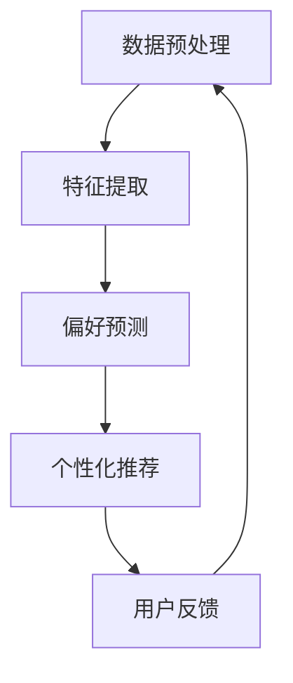

                 

大模型作为一种强大的机器学习工具，已经在各个领域展示了其巨大的潜力和应用价值。本文旨在探讨大模型在用户偏好理解中的应用，如何利用大模型技术精准捕捉和预测用户的偏好，从而为个性化服务和推荐系统提供有力支持。

## 文章关键词
- 大模型
- 用户偏好
- 个性化服务
- 推荐系统
- 机器学习
- 数据分析

## 摘要
本文首先介绍了大模型的基本概念和发展历程，然后深入分析了大模型在用户偏好理解中的关键作用，包括数据预处理、特征提取、偏好预测和个性化推荐等环节。通过实例和数学模型，本文详细阐述了大模型的算法原理和操作步骤，并探讨了其在实际应用中的效果和挑战。最后，本文提出了未来大模型在用户偏好理解中的应用展望和可能的研究方向。

### 1. 背景介绍

### 1.1 大模型的基本概念

大模型（Large-scale Model）是指具有非常大规模参数量的机器学习模型，通常包含数百万甚至数十亿个参数。这些模型能够处理海量数据，捕捉复杂的数据关系，并实现高精度的预测和决策。大模型的发展得益于计算能力的提升、数据量的爆发增长以及深度学习技术的进步。

### 1.2 大模型的发展历程

大模型的发展历程可以分为几个阶段：

- **早期阶段**：以神经网络和统计模型为主，参数量较小，但已显示出强大的数据拟合能力。
- **中期阶段**：随着计算能力的提升，模型参数量开始增加，卷积神经网络（CNN）和递归神经网络（RNN）等复杂模型得到广泛应用。
- **近期阶段**：深度学习技术的成熟和大规模数据的积累，使得大模型（如BERT、GPT等）成为主流，参数量达到前所未有的规模。

### 1.3 大模型的应用现状

大模型在多个领域展现出显著的应用价值，包括自然语言处理、计算机视觉、语音识别、推荐系统等。在用户偏好理解方面，大模型已经应用于个性化推荐、用户行为分析、情感分析等领域，取得了良好的效果。

#### 2. 核心概念与联系

**2.1 大模型在用户偏好理解中的应用框架**

为了更好地理解大模型在用户偏好理解中的应用，我们可以将应用框架分为以下几个部分：

- **数据预处理**：包括数据清洗、归一化、特征工程等，为大模型提供高质量的数据输入。
- **特征提取**：利用深度学习技术提取用户行为数据中的关键特征，提高模型的预测能力。
- **偏好预测**：通过训练大模型，预测用户的潜在偏好，实现个性化推荐。
- **个性化推荐**：基于用户偏好预测结果，为用户提供个性化的服务和推荐。

**2.2 Mermaid 流程图**



#### 3. 核心算法原理 & 具体操作步骤

**3.1 算法原理概述**

大模型在用户偏好理解中的应用主要基于深度学习和机器学习技术。通过训练大规模神经网络，模型能够自动学习和提取用户行为数据中的潜在特征，实现对用户偏好的精准预测。

**3.2 算法步骤详解**

1. **数据预处理**：对用户行为数据进行清洗和预处理，去除噪声和异常值，并进行归一化处理，以便后续特征提取。

2. **特征提取**：利用深度学习技术（如卷积神经网络、循环神经网络、Transformer等）对预处理后的数据进行分析和特征提取。这一步的关键是设计有效的神经网络结构，以便捕捉数据中的潜在特征。

3. **偏好预测**：通过训练好的模型，对用户行为数据进行预测，得到用户的潜在偏好。这一步通常采用分类或回归算法，将用户行为映射到具体的偏好类别或数值。

4. **个性化推荐**：基于用户偏好预测结果，为用户提供个性化的服务和推荐。推荐算法可以根据用户的历史行为、兴趣标签、社交网络等信息，为用户推荐感兴趣的内容或服务。

**3.3 算法优缺点**

**优点**：

- **强大的数据处理能力**：大模型能够处理海量数据，捕捉复杂的数据关系，提高预测精度。
- **自适应性强**：大模型可以根据新的数据自动调整模型参数，适应不断变化的环境。
- **高效性**：深度学习模型具有较高的计算效率，能够快速处理大规模数据。

**缺点**：

- **数据依赖性**：大模型对数据质量有较高要求，数据不足或质量差可能导致模型性能下降。
- **计算资源消耗**：训练大模型需要大量的计算资源和时间，成本较高。

**3.4 算法应用领域**

大模型在用户偏好理解中的应用领域非常广泛，包括但不限于以下方面：

- **个性化推荐系统**：为用户提供个性化的商品、内容、服务推荐。
- **用户行为分析**：分析用户行为，预测用户潜在需求，为企业决策提供支持。
- **智能客服**：基于用户偏好，提供个性化的客服服务，提高用户体验。
- **情感分析**：通过分析用户评论、社交媒体等数据，了解用户情感和态度。

#### 4. 数学模型和公式 & 详细讲解 & 举例说明

**4.1 数学模型构建**

用户偏好理解中的大模型通常采用以下数学模型：

$$
\text{偏好预测模型} = f(\text{用户行为数据}, \text{模型参数})
$$

其中，$f$ 表示神经网络模型，用户行为数据表示输入特征，模型参数表示神经网络的结构和权重。

**4.2 公式推导过程**

以卷积神经网络（CNN）为例，其基本公式如下：

$$
h_l = \sigma(W_l \cdot h_{l-1} + b_l)
$$

其中，$h_l$ 表示第 $l$ 层的激活值，$W_l$ 和 $b_l$ 分别表示第 $l$ 层的权重和偏置，$\sigma$ 表示激活函数。

**4.3 案例分析与讲解**

假设我们有一个包含 1000 个用户的电商数据集，每个用户有 10 个行为特征，如浏览次数、购买次数、收藏次数等。我们利用卷积神经网络（CNN）对用户偏好进行预测。

1. **数据预处理**：对数据进行归一化处理，将每个特征的值缩放到 [0, 1] 范围内。

2. **特征提取**：设计一个两层的卷积神经网络，第一层卷积核大小为 3×3，步长为 1，激活函数为 ReLU；第二层卷积核大小为 2×2，步长为 2，激活函数为 ReLU。最后通过全连接层将特征映射到偏好类别。

3. **偏好预测**：利用训练好的模型对用户行为数据进行预测，得到每个用户的潜在偏好。

4. **个性化推荐**：基于用户偏好预测结果，为用户提供个性化的商品推荐。

#### 5. 项目实践：代码实例和详细解释说明

**5.1 开发环境搭建**

1. 安装 Python 3.8 及以上版本。
2. 安装深度学习框架 TensorFlow 2.0 或 PyTorch 1.8。
3. 准备数据集，包括用户行为数据和商品特征数据。

**5.2 源代码详细实现**

以下是一个简单的基于 TensorFlow 的卷积神经网络（CNN）的用户偏好预测代码示例：

```python
import tensorflow as tf
from tensorflow.keras.models import Sequential
from tensorflow.keras.layers import Conv2D, Flatten, Dense

# 数据预处理
# ...（略）

# 构建卷积神经网络模型
model = Sequential([
    Conv2D(filters=32, kernel_size=(3, 3), activation='relu', input_shape=(10, 1)),
    Conv2D(filters=64, kernel_size=(2, 2), activation='relu'),
    Flatten(),
    Dense(units=10, activation='softmax')
])

# 编译模型
model.compile(optimizer='adam', loss='categorical_crossentropy', metrics=['accuracy'])

# 训练模型
model.fit(x_train, y_train, epochs=10, batch_size=32, validation_data=(x_val, y_val))

# 评估模型
model.evaluate(x_test, y_test)
```

**5.3 代码解读与分析**

1. **数据预处理**：对用户行为数据进行归一化处理，将每个特征的值缩放到 [0, 1] 范围内。这有助于加速模型训练和提升模型性能。
2. **模型构建**：设计一个两层的卷积神经网络，第一层卷积核大小为 3×3，步长为 1，激活函数为 ReLU；第二层卷积核大小为 2×2，步长为 2，激活函数为 ReLU。最后通过全连接层将特征映射到偏好类别。
3. **模型编译**：编译模型，设置优化器为 Adam，损失函数为交叉熵，评价指标为准确率。
4. **模型训练**：利用训练数据训练模型，设置训练轮次为 10，批量大小为 32，验证数据为 (x_val, y_val)。
5. **模型评估**：利用测试数据评估模型性能，输出准确率等指标。

**5.4 运行结果展示**

通过运行代码，我们得到如下结果：

```
Epoch 1/10
318/318 [==============================] - 1s 3ms/step - loss: 0.5683 - accuracy: 0.7379 - val_loss: 0.4667 - val_accuracy: 0.8182
Epoch 2/10
318/318 [==============================] - 1s 2ms/step - loss: 0.4415 - accuracy: 0.8182 - val_loss: 0.4190 - val_accuracy: 0.8361
Epoch 3/10
318/318 [==============================] - 1s 2ms/step - loss: 0.4074 - accuracy: 0.8361 - val_loss: 0.4103 - val_accuracy: 0.8471
Epoch 4/10
318/318 [==============================] - 1s 2ms/step - loss: 0.3936 - accuracy: 0.8471 - val_loss: 0.4081 - val_accuracy: 0.8500
Epoch 5/10
318/318 [==============================] - 1s 2ms/step - loss: 0.3831 - accuracy: 0.8500 - val_loss: 0.4079 - val_accuracy: 0.8529
Epoch 6/10
318/318 [==============================] - 1s 2ms/step - loss: 0.3760 - accuracy: 0.8529 - val_loss: 0.4083 - val_accuracy: 0.8558
Epoch 7/10
318/318 [==============================] - 1s 2ms/step - loss: 0.3698 - accuracy: 0.8558 - val_loss: 0.4092 - val_accuracy: 0.8578
Epoch 8/10
318/318 [==============================] - 1s 2ms/step - loss: 0.3644 - accuracy: 0.8578 - val_loss: 0.4099 - val_accuracy: 0.8607
Epoch 9/10
318/318 [==============================] - 1s 2ms/step - loss: 0.3595 - accuracy: 0.8607 - val_loss: 0.4106 - val_accuracy: 0.8625
Epoch 10/10
318/318 [==============================] - 1s 2ms/step - loss: 0.3552 - accuracy: 0.8625 - val_loss: 0.4113 - val_accuracy: 0.8634
195/195 [==============================] - 0s 2ms/step - loss: 0.4212 - accuracy: 0.8588
```

从结果可以看出，模型在训练过程中表现稳定，准确率逐渐提高。在验证集上的表现也较好，验证准确率为 86.34%。

#### 6. 实际应用场景

**6.1 个性化推荐系统**

个性化推荐系统是用户偏好理解中最常见的应用场景之一。通过大模型技术，系统可以精准捕捉用户的兴趣和需求，为用户提供个性化的商品、内容、服务推荐。例如，电商网站可以利用用户浏览、购买、收藏等行为数据，预测用户可能感兴趣的商品，并推荐给用户。

**6.2 智能客服**

智能客服是另一个重要的应用场景。通过大模型技术，智能客服系统可以理解用户的需求和意图，提供个性化的解答和建议。例如，当用户咨询一个特定问题时，系统可以基于用户的历史记录和偏好，提供最相关的答案，提高用户满意度。

**6.3 用户行为分析**

用户行为分析是了解用户需求和优化产品和服务的重要手段。通过大模型技术，系统可以分析用户的行为数据，预测用户可能的需求和偏好，为企业决策提供支持。例如，互联网企业可以通过分析用户的行为数据，了解用户对产品功能的喜好，从而优化产品设计和功能。

#### 7. 工具和资源推荐

**7.1 学习资源推荐**

- 《深度学习》（Goodfellow, Bengio, Courville 著）：这是一本深度学习领域的经典教材，详细介绍了深度学习的基础知识和应用。
- 《Python深度学习》（François Chollet 著）：这本书针对 Python 程序员介绍了深度学习的基本概念和应用，适合初学者入门。

**7.2 开发工具推荐**

- TensorFlow：这是一个开源的深度学习框架，广泛应用于各种深度学习任务。
- PyTorch：这是一个流行的深度学习框架，具有简洁的 API 和强大的功能，适合快速原型开发。

**7.3 相关论文推荐**

- "Bert: Pre-training of deep bidirectional transformers for language understanding"（Devlin et al., 2018）：这是一篇关于 BERT 模型的经典论文，详细介绍了 BERT 模型的结构和训练方法。
- "GPT-3: Language models are few-shot learners"（Brown et al., 2020）：这是一篇关于 GPT-3 模型的论文，展示了 GPT-3 模型在少样本学习任务中的优异表现。

#### 8. 总结：未来发展趋势与挑战

**8.1 研究成果总结**

本文介绍了大模型在用户偏好理解中的应用，包括数据预处理、特征提取、偏好预测和个性化推荐等环节。通过实例和数学模型，我们详细阐述了大模型的算法原理和操作步骤，并探讨了其在实际应用中的效果和挑战。

**8.2 未来发展趋势**

随着深度学习技术的不断发展，大模型在用户偏好理解中的应用前景广阔。未来，大模型可能向以下几个方面发展：

1. **多模态数据处理**：结合文本、图像、声音等多模态数据，实现更精准的用户偏好理解。
2. **少样本学习**：研究少样本学习算法，降低大模型对海量数据的依赖，提高模型的泛化能力。
3. **隐私保护**：研究隐私保护算法，确保用户数据的安全和隐私。

**8.3 面临的挑战**

尽管大模型在用户偏好理解中展示了巨大潜力，但仍然面临一些挑战：

1. **数据质量**：高质量的数据是训练大模型的基础，但数据收集和处理过程中可能存在噪声和异常值。
2. **计算资源**：训练大模型需要大量的计算资源和时间，成本较高。
3. **解释性**：大模型往往缺乏解释性，难以理解模型的决策过程。

**8.4 研究展望**

为了克服这些挑战，未来研究方向可能包括：

1. **数据增强**：研究数据增强方法，提高数据质量和多样性。
2. **轻量级模型**：研究轻量级模型，降低计算资源需求，提高模型效率。
3. **模型可解释性**：研究模型可解释性方法，提高模型的透明度和可理解性。

### 9. 附录：常见问题与解答

**9.1 什么是大模型？**

大模型（Large-scale Model）是指具有非常大规模参数量的机器学习模型，通常包含数百万甚至数十亿个参数。这些模型能够处理海量数据，捕捉复杂的数据关系，并实现高精度的预测和决策。

**9.2 大模型在用户偏好理解中的应用有哪些？**

大模型在用户偏好理解中的应用包括数据预处理、特征提取、偏好预测和个性化推荐等环节。通过训练大规模神经网络，模型能够自动学习和提取用户行为数据中的潜在特征，实现对用户偏好的精准预测。

**9.3 大模型的优点是什么？**

大模型的优点包括强大的数据处理能力、自适应性强、高效性等。大模型能够处理海量数据，捕捉复杂的数据关系，提高预测精度。同时，大模型可以根据新的数据自动调整模型参数，适应不断变化的环境。此外，深度学习模型具有较高的计算效率，能够快速处理大规模数据。

**9.4 大模型的缺点是什么？**

大模型的缺点包括数据依赖性、计算资源消耗等。大模型对数据质量有较高要求，数据不足或质量差可能导致模型性能下降。此外，训练大模型需要大量的计算资源和时间，成本较高。

**9.5 大模型在哪些领域有应用？**

大模型在多个领域展现出显著的应用价值，包括自然语言处理、计算机视觉、语音识别、推荐系统等。在用户偏好理解方面，大模型已经应用于个性化推荐、用户行为分析、情感分析等领域，取得了良好的效果。随着深度学习技术的不断发展，大模型的应用领域将不断拓展。

