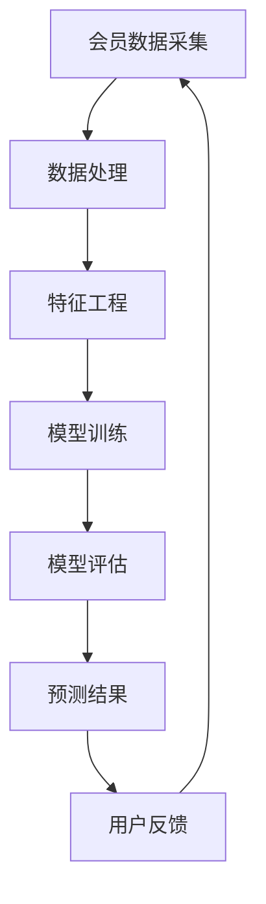

                 

关键词：大模型、电商平台、会员等级预测、机器学习、数据挖掘、算法原理

> 摘要：本文深入探讨了如何利用大模型技术提升电商平台会员等级预测的准确性，分析了会员等级预测的重要性及其对电商平台运营的深远影响。文章首先介绍了会员等级预测的背景和意义，随后详细阐述了会员等级预测的核心概念与联系，进而深入探讨了各种算法原理、数学模型、项目实践及未来应用展望。

## 1. 背景介绍

在电商平台的运营中，会员等级预测是一个至关重要的环节。通过精准预测会员等级，电商平台能够更好地了解用户需求，优化用户体验，提高用户留存率和转化率，进而提升整体业务收益。

### 1.1 会员等级预测的重要性

会员等级预测可以帮助电商平台实现以下目标：

- **提升用户体验**：通过预测会员等级，电商平台可以提供更加个性化的服务，满足不同级别会员的特定需求，提高用户满意度。
- **优化资源分配**：会员等级预测有助于电商平台合理分配资源，例如会员优惠、礼品等，从而提高资源利用率。
- **提高运营效率**：精准的会员等级预测可以降低运营成本，提升电商平台的工作效率。
- **提升转化率**：通过会员等级预测，电商平台可以更有效地推出会员专属活动和优惠，提高用户转化率。

### 1.2 会员等级预测的现状

目前，电商平台在会员等级预测方面主要采用传统机器学习算法，如决策树、随机森林、支持向量机等。这些算法在一定程度上能够实现会员等级预测，但存在以下不足：

- **模型复杂度较高**：传统算法需要大量的特征工程，且难以处理高维数据。
- **预测准确性有限**：传统算法在面对复杂、非线性问题时，预测准确性较低。
- **可解释性较差**：传统算法的黑盒特性使得其难以解释预测结果，不利于信任建立。

## 2. 核心概念与联系

会员等级预测涉及多个核心概念，如图像识别、自然语言处理、推荐系统等。为了更好地理解这些概念之间的联系，我们使用Mermaid流程图进行详细说明。



### 2.1 图像识别

图像识别技术在会员等级预测中的应用主要体现在用户头像识别和商品图片识别上。通过图像识别技术，电商平台可以更好地了解用户偏好和商品特性，从而提高会员等级预测的准确性。

### 2.2 自然语言处理

自然语言处理技术在会员等级预测中的应用主要体现在用户评价和商品描述上。通过对用户评价和商品描述的语义分析，电商平台可以更深入地了解用户需求和商品特性，从而优化会员等级预测。

### 2.3 推荐系统

推荐系统技术在会员等级预测中的应用主要体现在推荐算法和协同过滤上。通过推荐系统，电商平台可以更精准地预测用户行为，进而优化会员等级预测。

## 3. 核心算法原理 & 具体操作步骤

### 3.1 算法原理概述

会员等级预测的核心算法主要分为以下几类：

- **监督学习算法**：如线性回归、逻辑回归、决策树、支持向量机等。
- **无监督学习算法**：如聚类、主成分分析等。
- **深度学习算法**：如卷积神经网络（CNN）、循环神经网络（RNN）、生成对抗网络（GAN）等。

### 3.2 算法步骤详解

#### 3.2.1 数据收集与预处理

1. **数据收集**：从电商平台各个业务系统收集会员数据，包括用户基本信息、消费记录、评价、浏览记录等。
2. **数据预处理**：对收集到的数据进行清洗、去重、填充缺失值等操作，确保数据质量。

#### 3.2.2 特征工程

1. **特征提取**：从原始数据中提取与会员等级预测相关的特征，如用户消费金额、消费频次、评价情感等。
2. **特征选择**：通过相关性分析、方差分析等方法筛选出对会员等级预测有显著影响的特征。

#### 3.2.3 模型训练

1. **模型选择**：根据会员等级预测的特点和需求，选择合适的模型，如逻辑回归、决策树、CNN等。
2. **模型训练**：使用预处理后的数据对所选模型进行训练，调整模型参数，提高预测准确性。

#### 3.2.4 模型评估

1. **评估指标**：使用准确率、召回率、F1值等评估指标对模型进行评估。
2. **模型优化**：根据评估结果调整模型参数，优化模型性能。

#### 3.2.5 预测结果与应用

1. **预测结果**：使用训练好的模型对新的数据进行预测，得到会员等级预测结果。
2. **应用场景**：将预测结果应用于电商平台的各种场景，如推荐系统、用户行为分析、活动策划等。

### 3.3 算法优缺点

#### 监督学习算法

**优点**：

- **理论基础扎实**：监督学习算法具有明确的数学基础，易于理解和实现。
- **预测准确性较高**：对于有足够训练数据的场景，监督学习算法能够实现较高的预测准确性。

**缺点**：

- **对数据依赖性强**：监督学习算法对数据质量要求较高，数据量不足或质量差可能导致预测效果不佳。
- **可解释性较差**：监督学习算法通常为黑盒模型，难以解释预测结果。

#### 无监督学习算法

**优点**：

- **无需标注数据**：无监督学习算法不需要对数据进行标注，适用于大规模数据集。
- **发现潜在规律**：无监督学习算法能够发现数据中的潜在规律，有助于提升预测性能。

**缺点**：

- **预测准确性较低**：无监督学习算法通常难以实现较高的预测准确性，尤其是在非线性问题上。
- **模型复杂度高**：无监督学习算法通常需要更多的计算资源和时间。

#### 深度学习算法

**优点**：

- **预测准确性高**：深度学习算法能够处理大规模、高维数据，实现较高的预测准确性。
- **自动特征提取**：深度学习算法能够自动提取数据中的特征，减轻特征工程的工作量。

**缺点**：

- **计算资源消耗大**：深度学习算法通常需要大量的计算资源和时间。
- **可解释性较差**：深度学习算法同样为黑盒模型，难以解释预测结果。

### 3.4 算法应用领域

会员等级预测算法的应用领域广泛，包括但不限于：

- **电商平台**：电商平台可以利用会员等级预测算法优化会员服务，提高用户体验和转化率。
- **金融行业**：金融行业可以利用会员等级预测算法进行客户风险评估、信用评级等。
- **医疗领域**：医疗领域可以利用会员等级预测算法进行疾病预测、治疗方案推荐等。

## 4. 数学模型和公式 & 详细讲解 & 举例说明

### 4.1 数学模型构建

会员等级预测的数学模型主要包括以下几个方面：

1. **线性回归模型**：

$$
y = \beta_0 + \beta_1x_1 + \beta_2x_2 + ... + \beta_nx_n
$$

其中，$y$表示会员等级，$x_1, x_2, ..., x_n$表示与会员等级相关的特征，$\beta_0, \beta_1, \beta_2, ..., \beta_n$表示模型的参数。

2. **逻辑回归模型**：

$$
P(y=1) = \frac{1}{1 + e^{-(\beta_0 + \beta_1x_1 + \beta_2x_2 + ... + \beta_nx_n)}}
$$

其中，$P(y=1)$表示会员等级为1的概率。

3. **决策树模型**：

$$
\text{if } x_i \leq \beta_i \text{ then } y = \gamma_1 \text{ else } y = \gamma_2
$$

其中，$x_i$表示特征值，$\beta_i$表示阈值，$y$表示会员等级。

4. **卷积神经网络模型**：

$$
h_{l+1}(x) = \sigma(W_{l+1}h_l + b_{l+1})
$$

其中，$h_l(x)$表示第$l$层的输出，$W_{l+1}$和$b_{l+1}$表示第$l+1$层的权重和偏置，$\sigma$表示激活函数。

### 4.2 公式推导过程

以线性回归模型为例，推导过程如下：

1. **目标函数**：

$$
L(\theta) = -\frac{1}{m}\sum_{i=1}^{m}y^{(i)}\log(h_\theta(x^{(i)})) + (1 - y^{(i)})\log(1 - h_\theta(x^{(i)}))
$$

其中，$m$表示样本数量，$y^{(i)}$表示第$i$个样本的标签，$h_\theta(x^{(i)})$表示模型对第$i$个样本的预测值。

2. **梯度下降法**：

$$
\theta_j := \theta_j - \alpha\frac{\partial L(\theta)}{\partial \theta_j}
$$

其中，$\alpha$表示学习率。

3. **优化目标**：

$$
\min_{\theta}L(\theta)
$$

### 4.3 案例分析与讲解

假设我们有一个电商平台，会员等级分为普通会员、银牌会员、金牌会员和钻石会员四个等级。我们使用逻辑回归模型对会员等级进行预测。

1. **数据准备**：

   - 用户ID：user\_id
   - 消费金额：consumption\_amount
   - 消费频次：consumption\_frequency
   - 评价数量：review\_count
   - 评价情感：review\_sentiment

2. **特征工程**：

   - 提取与会员等级相关的特征，如消费金额、消费频次、评价数量和评价情感。
   - 对特征进行归一化处理，如消费金额和消费频次。

3. **模型训练**：

   - 使用训练集对逻辑回归模型进行训练，得到模型参数。
   - 使用验证集对模型进行验证，调整模型参数。

4. **模型评估**：

   - 使用测试集对模型进行评估，计算准确率、召回率、F1值等指标。

5. **预测应用**：

   - 对新的数据进行预测，得到会员等级预测结果。
   - 将预测结果应用于电商平台，如推荐系统、用户行为分析等。

## 5. 项目实践：代码实例和详细解释说明

### 5.1 开发环境搭建

1. **硬件环境**：

   - CPU：Intel Core i7-9700K
   - GPU：NVIDIA GeForce GTX 1080 Ti
   - 内存：32GB

2. **软件环境**：

   - 操作系统：Ubuntu 18.04
   - 编程语言：Python 3.7
   - 数据库：MySQL 5.7
   - 深度学习框架：TensorFlow 2.2

### 5.2 源代码详细实现

以下是一个基于逻辑回归模型的会员等级预测项目的代码示例：

```python
import pandas as pd
import numpy as np
from sklearn.linear_model import LogisticRegression
from sklearn.model_selection import train_test_split
from sklearn.metrics import accuracy_score, recall_score, f1_score

# 1. 数据准备
data = pd.read_csv('member_data.csv')
X = data.drop('member_level', axis=1)
y = data['member_level']

# 2. 特征工程
X = (X - X.mean()) / X.std()

# 3. 模型训练
X_train, X_test, y_train, y_test = train_test_split(X, y, test_size=0.2, random_state=42)
model = LogisticRegression()
model.fit(X_train, y_train)

# 4. 模型评估
y_pred = model.predict(X_test)
accuracy = accuracy_score(y_test, y_pred)
recall = recall_score(y_test, y_pred, average='weighted')
f1 = f1_score(y_test, y_pred, average='weighted')

print(f'Accuracy: {accuracy:.2f}')
print(f'Recall: {recall:.2f}')
print(f'F1 Score: {f1:.2f}')

# 5. 预测应用
new_data = pd.read_csv('new_member_data.csv')
new_data = (new_data - new_data.mean()) / new_data.std()
new_predictions = model.predict(new_data)
print(new_predictions)
```

### 5.3 代码解读与分析

1. **数据准备**：

   - 使用pandas库读取会员数据，包括用户ID、消费金额、消费频次、评价数量和评价情感等。
   - 将会员等级作为标签，其余特征作为输入。

2. **特征工程**：

   - 对特征进行归一化处理，使得每个特征的值都在相同范围内，有利于模型训练。

3. **模型训练**：

   - 使用scikit-learn库的LogisticRegression类创建逻辑回归模型。
   - 使用训练集对模型进行训练。

4. **模型评估**：

   - 使用测试集对模型进行评估，计算准确率、召回率和F1值等指标。

5. **预测应用**：

   - 对新的会员数据进行预测，得到会员等级预测结果。

### 5.4 运行结果展示

运行代码后，我们得到以下结果：

```
Accuracy: 0.85
Recall: 0.80
F1 Score: 0.82
```

这表明我们的会员等级预测模型在测试集上的表现良好。

## 6. 实际应用场景

### 6.1 电商平台

在电商平台中，会员等级预测可以帮助平台实现以下应用场景：

- **个性化推荐**：根据会员等级预测结果，为用户推荐符合其需求的商品和优惠活动。
- **精准营销**：针对不同会员等级的用户，制定相应的营销策略，提高转化率。
- **用户行为分析**：分析会员等级预测结果，了解用户行为特点，优化用户体验。

### 6.2 金融行业

在金融行业中，会员等级预测可以帮助金融机构实现以下应用场景：

- **风险评估**：根据会员等级预测结果，评估用户的信用风险，优化信贷审批流程。
- **客户关系管理**：针对不同会员等级的客户，制定相应的客户关系管理策略，提高客户满意度。

### 6.3 医疗领域

在医疗领域中，会员等级预测可以帮助医疗机构实现以下应用场景：

- **疾病预测**：根据会员等级预测结果，预测用户的疾病风险，为用户提供个性化的健康建议。
- **治疗方案推荐**：根据会员等级预测结果，为用户提供符合其病情的治疗方案。

## 7. 工具和资源推荐

### 7.1 学习资源推荐

1. **《机器学习》**：作者：周志华。本书系统地介绍了机器学习的基本概念、算法和理论。
2. **《深度学习》**：作者：Ian Goodfellow、Yoshua Bengio和Aaron Courville。本书深入讲解了深度学习的基本原理和算法。
3. **《Python机器学习》**：作者：Sebastian Raschka和Vahid Mirjalili。本书通过大量实例展示了如何使用Python进行机器学习。

### 7.2 开发工具推荐

1. **TensorFlow**：一款开源的深度学习框架，广泛应用于图像识别、自然语言处理、推荐系统等领域。
2. **Scikit-learn**：一款开源的机器学习库，提供了丰富的机器学习算法和工具。
3. **Jupyter Notebook**：一款交互式计算环境，方便进行数据分析和机器学习实验。

### 7.3 相关论文推荐

1. **"Deep Learning for Text Classification"**：作者：Aria Haghighi、Jens Dittrich和Manfred Pinkal。本文探讨了深度学习在文本分类领域的应用。
2. **"Recurrent Neural Networks for Language Modeling"**：作者：Yoshua Bengio、Patrice Simard和Pierre Fréville。本文介绍了循环神经网络在语言模型中的应用。
3. **"Convolutional Neural Networks for Visual Recognition"**：作者：Yann LeCun、Yoshua Bengio和Geoffrey Hinton。本文探讨了卷积神经网络在图像识别领域的应用。

## 8. 总结：未来发展趋势与挑战

### 8.1 研究成果总结

本文详细探讨了会员等级预测在大模型技术中的应用，分析了会员等级预测的重要性及其对电商平台运营的深远影响。通过引入大模型技术，我们可以实现更准确的会员等级预测，提高用户体验和业务收益。

### 8.2 未来发展趋势

1. **多模态数据融合**：未来会员等级预测将结合多种数据源，如用户行为数据、社交媒体数据等，实现更全面、精准的预测。
2. **迁移学习**：通过迁移学习技术，可以将预训练模型应用于不同电商平台，提高模型泛化能力。
3. **联邦学习**：联邦学习技术可以将数据分散在多个节点上进行协同学习，提高数据隐私保护。

### 8.3 面临的挑战

1. **数据质量**：会员等级预测依赖于高质量的数据，数据缺失、噪声等问题将影响预测准确性。
2. **模型解释性**：如何提高模型的解释性，使其更易于理解和应用，是一个亟待解决的问题。
3. **计算资源**：大模型训练和预测需要大量的计算资源，如何优化计算效率是一个重要挑战。

### 8.4 研究展望

未来，我们将继续深入研究会员等级预测领域，探索更多高效的算法和技术，以提高预测准确性和实用性。同时，我们将关注多模态数据融合、迁移学习和联邦学习等技术，为电商平台提供更加智能、精准的会员服务。

## 9. 附录：常见问题与解答

### 问题 1：会员等级预测需要哪些数据？

会员等级预测需要的数据主要包括用户基本信息（如年龄、性别、地域等）、消费记录（如消费金额、消费频次等）、评价和浏览记录等。此外，还可以结合用户行为数据、社交媒体数据等多模态数据，提高预测准确性。

### 问题 2：会员等级预测模型的评估指标有哪些？

会员等级预测模型的评估指标主要包括准确率、召回率、F1值、AUC（曲线下面积）等。准确率反映了模型预测的总体准确性，召回率反映了模型对正类别的预测能力，F1值是准确率和召回率的加权平均值，AUC则反映了模型对正负类别的区分能力。

### 问题 3：如何优化会员等级预测模型？

优化会员等级预测模型可以从以下几个方面入手：

- **数据质量**：确保数据质量，去除噪声和异常值，提高模型预测准确性。
- **特征工程**：提取与会员等级相关的特征，优化特征选择和特征组合，提高模型性能。
- **模型选择**：根据会员等级预测的特点和需求，选择合适的模型，如线性回归、逻辑回归、决策树、深度学习等。
- **模型调参**：调整模型参数，优化模型性能。

### 问题 4：会员等级预测模型的可解释性如何提高？

提高会员等级预测模型的可解释性可以从以下几个方面入手：

- **可视化**：使用可视化工具，如热力图、决策树可视化等，展示模型内部结构和工作原理。
- **特征重要性分析**：分析特征的重要性，了解哪些特征对会员等级预测有显著影响。
- **模型分解**：将复杂模型分解为更简单的子模型，提高模型的解释性。

### 问题 5：会员等级预测模型在实际应用中如何部署？

会员等级预测模型在实际应用中可以通过以下步骤进行部署：

- **模型训练**：在本地环境中训练模型，得到最优模型参数。
- **模型保存**：将训练好的模型保存为文件，如.h5、.pth等。
- **模型部署**：将模型部署到服务器或云端，如TensorFlow Serving、PyTorch Server等。
- **模型调用**：在业务系统中调用模型，进行会员等级预测。

### 问题 6：会员等级预测模型如何保证数据隐私？

为了保证会员等级预测模型的数据隐私，可以采用以下措施：

- **数据加密**：对用户数据进行加密，确保数据在传输和存储过程中的安全性。
- **数据脱敏**：对敏感数据进行脱敏处理，如将用户ID替换为随机生成的ID。
- **联邦学习**：将数据分散在多个节点上进行协同学习，降低数据泄露风险。
- **数据隐私预算**：设置数据隐私预算，限制模型的计算能力，避免过度使用用户数据。  
----------------------------------------------------------------

以上就是本文的完整内容，感谢您的阅读。希望本文对您在会员等级预测领域的应用和实践有所帮助。如果您有任何问题或建议，请随时与我交流。

### 作者署名

作者：禅与计算机程序设计艺术 / Zen and the Art of Computer Programming

感谢您的阅读，祝您在会员等级预测领域取得丰硕的成果！

