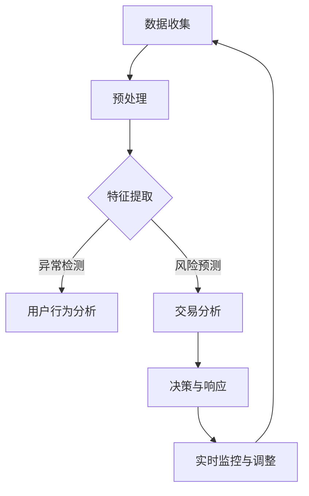

                 

关键词：大模型，反欺诈，电商平台，算法原理，应用场景

## 摘要

本文旨在探讨大模型在电商平台反欺诈系统中的应用。随着电商平台的迅速发展，欺诈行为日益猖獗，对平台的运营和消费者的权益构成了严重威胁。大模型作为一种先进的人工智能技术，通过其强大的数据处理和模式识别能力，为电商平台反欺诈提供了新的解决方案。本文将介绍大模型的基本原理和架构，探讨其在反欺诈系统中的核心算法原理，并通过实际案例展示其应用效果，最后对大模型在电商反欺诈领域的未来发展和面临的挑战进行展望。

## 1. 背景介绍

### 电商平台的发展与欺诈行为的挑战

随着互联网技术的不断进步，电商平台已经成为人们日常生活中不可或缺的一部分。从商品销售到服务提供，电商平台极大地丰富了人们的消费选择，提升了购物体验。然而，伴随着电商平台的快速发展，欺诈行为也日益猖獗，对平台的运营和消费者的权益构成了严重威胁。

欺诈行为主要包括以下几种类型：

1. **账户欺诈**：恶意用户通过非法手段注册账户，利用账户进行欺诈活动。
2. **交易欺诈**：在交易过程中，恶意买家或卖家通过虚构交易、退款等手段获取非法利益。
3. **支付欺诈**：利用支付系统的漏洞进行非法转账或欺诈交易。
4. **商品欺诈**：卖家通过虚假宣传、售卖假冒伪劣商品等手段欺骗消费者。

这些欺诈行为不仅给平台带来了经济损失，还损害了消费者的信任和满意度，严重影响了电商平台的长期发展。因此，构建一个高效、智能的反欺诈系统成为电商平台亟待解决的问题。

### 反欺诈系统的现状与挑战

当前，电商平台反欺诈系统主要依赖于传统的机器学习算法和规则引擎。这些系统通过对用户行为、交易数据等进行分析，识别潜在的欺诈行为。然而，传统反欺诈系统面临着以下挑战：

1. **数据量巨大**：电商平台每天产生的数据量庞大，如何高效处理这些数据成为一大难题。
2. **欺诈行为多样化**：欺诈行为不断演变，传统的算法难以应对多样化的欺诈手段。
3. **实时性要求高**：反欺诈系统需要实时处理交易数据，识别潜在的欺诈行为，对系统的响应速度提出了高要求。
4. **误报和漏报问题**：传统算法在识别欺诈行为时，往往容易出现误报和漏报的情况，影响用户体验。

为了克服这些挑战，电商平台需要引入更先进的人工智能技术，尤其是大模型。大模型具有强大的数据处理能力和深度学习能力，能够应对复杂的欺诈行为，提高反欺诈系统的准确性和实时性。

### 大模型在反欺诈系统中的应用优势

大模型在反欺诈系统中的应用具有以下优势：

1. **强大的数据处理能力**：大模型能够高效处理海量数据，从数据中发现潜在的欺诈模式。
2. **深度学习能力**：大模型通过深度学习算法，能够从历史数据中自动提取特征，适应不同的欺诈场景。
3. **自适应性强**：大模型能够根据实时数据不断调整模型参数，提高对欺诈行为的识别能力。
4. **低误报率和高检测率**：大模型通过综合分析多种数据源，降低误报率，提高欺诈行为的检测率。

综上所述，大模型在电商平台反欺诈系统中的应用具有重要的现实意义。本文将详细探讨大模型的基本原理、核心算法、应用实例和未来发展趋势，为电商平台反欺诈提供新的思路和方法。

## 2. 核心概念与联系

### 2.1 大模型的基本概念

大模型（Large-scale Model），也被称为深度学习模型，是一种基于多层神经网络（Neural Network）的模型，具有极高的参数数量和复杂的结构。大模型通过学习大量的数据，能够自动提取数据中的特征，从而实现复杂的模式识别和预测任务。

大模型通常由以下几部分组成：

1. **输入层（Input Layer）**：接收外部数据，如文本、图像、音频等。
2. **隐藏层（Hidden Layers）**：进行特征提取和变换，隐藏层可以有多个，每个隐藏层都可以学习到不同层次的特征。
3. **输出层（Output Layer）**：根据隐藏层提取的特征，生成预测结果或决策。

大模型的核心优势在于其强大的数据处理能力和深度学习能力，这使得大模型能够处理复杂的数据任务，如图像识别、自然语言处理、语音识别等。

### 2.2 大模型在反欺诈系统中的应用

在反欺诈系统中，大模型的应用主要体现在以下几个方面：

1. **用户行为分析**：通过分析用户的历史行为数据，如登录时间、浏览习惯、购买频率等，大模型可以识别出异常行为，从而发现潜在的欺诈用户。
2. **交易风险预测**：通过对交易数据进行分析，如交易金额、交易时间、支付方式等，大模型可以预测交易的风险等级，从而识别出高风险交易。
3. **黑名单管理**：大模型可以自动识别出欺诈用户，并将其纳入黑名单，从而防止欺诈行为的发生。
4. **实时监控与调整**：大模型可以实时监控交易数据，根据实时数据动态调整模型参数，提高欺诈行为的识别准确性。

### 2.3 Mermaid 流程图

为了更好地理解大模型在反欺诈系统中的应用，以下是一个简化的Mermaid流程图：



### 2.4 大模型的优势与挑战

大模型在反欺诈系统中的应用具有以下优势：

1. **高效的数据处理能力**：大模型能够处理海量数据，从数据中发现潜在的欺诈模式。
2. **强大的深度学习能力**：大模型通过学习大量数据，能够自动提取特征，适应不同的欺诈场景。
3. **自适应性强**：大模型能够根据实时数据动态调整模型参数，提高欺诈行为的识别能力。

然而，大模型在应用中也面临着一些挑战：

1. **计算资源需求高**：大模型需要大量的计算资源进行训练和推理，对硬件设备提出了高要求。
2. **数据隐私问题**：大模型在处理数据时，可能会暴露用户隐私信息，如何保护数据隐私是一个重要问题。
3. **模型解释性差**：大模型的内部结构复杂，难以解释其决策过程，这可能导致用户对其信任度降低。

综上所述，大模型在反欺诈系统中的应用具有重要意义，但也需要克服一系列挑战。在接下来的章节中，我们将详细探讨大模型的核心算法原理、具体操作步骤以及实际应用效果。

## 3. 核心算法原理 & 具体操作步骤

### 3.1 算法原理概述

大模型在反欺诈系统中的应用主要基于深度学习算法，特别是基于神经网络的算法。深度学习算法通过模拟人脑的神经网络结构，对大量数据进行训练，从而自动提取数据中的特征，实现复杂的数据分析和预测任务。

在反欺诈系统中，深度学习算法的应用主要包括以下几个方面：

1. **用户行为分析**：通过对用户的历史行为数据进行分析，识别出异常行为，如登录频率异常、浏览习惯异常等。
2. **交易风险预测**：通过对交易数据进行分析，如交易金额、交易时间、支付方式等，预测交易的风险等级。
3. **黑名单管理**：通过自动识别欺诈用户，并将其纳入黑名单，防止欺诈行为的发生。
4. **实时监控与调整**：通过实时监控交易数据，动态调整模型参数，提高欺诈行为的识别准确性。

### 3.2 算法步骤详解

#### 3.2.1 数据收集与预处理

1. **数据收集**：首先需要收集电商平台的用户行为数据和交易数据。这些数据可以来源于数据库、日志文件等。
2. **数据预处理**：对收集到的数据进行清洗、去重、补全等处理，确保数据的质量。具体步骤包括：
   - 数据清洗：去除重复数据、缺失数据、异常数据等。
   - 数据归一化：将不同特征的数据进行归一化处理，使其具有相同的量纲。
   - 数据转换：将原始数据转换为适合输入深度学习模型的格式。

#### 3.2.2 特征提取与模型训练

1. **特征提取**：通过数据预处理阶段得到的数据，提取出对反欺诈任务有重要意义的特征。这些特征可以包括用户行为特征、交易特征、账户特征等。
2. **模型训练**：使用提取出的特征对深度学习模型进行训练。训练过程主要包括以下步骤：
   - 初始化模型参数：随机初始化模型的权重和偏置。
   - 前向传播：将输入数据通过模型的前向传播过程，得到输出结果。
   - 反向传播：计算输出结果与真实标签之间的误差，通过反向传播算法更新模型参数。
   - 模型优化：使用优化算法（如梯度下降、Adam等）调整模型参数，减小误差。

#### 3.2.3 模型评估与优化

1. **模型评估**：使用验证集对训练好的模型进行评估，计算模型的准确率、召回率、F1值等指标。
2. **模型优化**：根据评估结果，对模型进行优化。优化过程可以包括以下步骤：
   - 调整模型参数：通过调整学习率、正则化参数等，优化模型的性能。
   - 数据增强：对训练数据集进行增强，如添加噪声、旋转、缩放等，提高模型的泛化能力。
   - 模型融合：结合多个模型的结果，提高整体识别准确率。

#### 3.2.4 模型部署与实时监控

1. **模型部署**：将训练好的模型部署到生产环境，进行实时监控和预测。
2. **实时监控与调整**：根据实时交易数据，动态调整模型参数，提高欺诈行为的识别准确性。具体步骤包括：
   - 实时数据采集：采集实时交易数据。
   - 实时预测：使用部署好的模型对实时数据进行分析和预测。
   - 实时反馈与调整：根据预测结果，对模型进行实时调整。

### 3.3 算法优缺点

#### 3.3.1 优点

1. **高效的数据处理能力**：大模型能够处理海量数据，从数据中发现潜在的欺诈模式。
2. **强大的深度学习能力**：大模型通过学习大量数据，能够自动提取特征，适应不同的欺诈场景。
3. **自适应性强**：大模型能够根据实时数据动态调整模型参数，提高欺诈行为的识别能力。
4. **低误报率和高检测率**：大模型通过综合分析多种数据源，降低误报率，提高欺诈行为的检测率。

#### 3.3.2 缺点

1. **计算资源需求高**：大模型需要大量的计算资源进行训练和推理，对硬件设备提出了高要求。
2. **数据隐私问题**：大模型在处理数据时，可能会暴露用户隐私信息，如何保护数据隐私是一个重要问题。
3. **模型解释性差**：大模型的内部结构复杂，难以解释其决策过程，这可能导致用户对其信任度降低。

### 3.4 算法应用领域

大模型在反欺诈系统中的应用不仅限于电商平台，还可以应用于其他领域，如金融、保险、网络安全等。在金融领域，大模型可以用于信用评分、风险控制、交易监控等；在保险领域，大模型可以用于风险评估、欺诈检测、理赔审核等；在网络安全领域，大模型可以用于入侵检测、恶意代码识别、网络安全态势评估等。

总之，大模型作为一种先进的人工智能技术，在反欺诈系统中具有广泛的应用前景。通过深度学习算法，大模型能够高效地处理海量数据，识别出潜在的欺诈行为，提高反欺诈系统的准确性和实时性。随着技术的不断发展，大模型在反欺诈领域的应用将更加广泛和深入。

## 4. 数学模型和公式 & 详细讲解 & 举例说明

### 4.1 数学模型构建

在反欺诈系统中，大模型的核心在于其深度学习算法，其中涉及到的数学模型主要包括神经网络模型和损失函数。以下是对这些数学模型的详细讲解。

#### 4.1.1 神经网络模型

神经网络（Neural Network）是一种模拟人脑神经元连接方式的计算模型。在反欺诈系统中，神经网络用于提取数据中的特征，并对其进行分类或回归。

一个简单的神经网络模型通常由输入层、隐藏层和输出层组成。每个神经元接收来自前一层神经元的输入信号，并通过激活函数产生输出信号。神经网络通过反向传播算法不断调整其权重和偏置，以优化模型的性能。

神经网络的数学表示如下：

$$
Z^{(l)} = \sigma(W^{(l)}X^{(l-1)} + b^{(l)})
$$

其中，$Z^{(l)}$ 是第 $l$ 层的输出，$\sigma$ 是激活函数（如 sigmoid、ReLU等），$W^{(l)}$ 是第 $l$ 层的权重，$b^{(l)}$ 是第 $l$ 层的偏置。

#### 4.1.2 损失函数

损失函数（Loss Function）用于评估模型的预测结果与真实标签之间的差距。在反欺诈系统中，常用的损失函数包括交叉熵损失（Cross-Entropy Loss）和均方误差损失（Mean Squared Error Loss）。

交叉熵损失函数的数学表示如下：

$$
L = -\frac{1}{m} \sum_{i=1}^{m} y^{(i)} \log(\hat{y}^{(i)})
$$

其中，$L$ 是损失函数的值，$m$ 是样本数量，$y^{(i)}$ 是第 $i$ 个样本的真实标签，$\hat{y}^{(i)}$ 是第 $i$ 个样本的预测概率。

### 4.2 公式推导过程

#### 4.2.1 前向传播

在前向传播过程中，神经网络从输入层开始，逐层计算每个神经元的输出。前向传播的数学推导如下：

$$
a^{(1)} = X \\
Z^{(2)} = \sigma(W^{(2)}a^{(1)} + b^{(2)}) \\
a^{(2)} = Z^{(2)} \\
\vdots \\
Z^{(L)} = \sigma(W^{(L)}a^{(L-1)} + b^{(L)}) \\
a^{(L)} = Z^{(L)}
$$

其中，$a^{(l)}$ 表示第 $l$ 层的输入，$Z^{(l)}$ 表示第 $l$ 层的输出。

#### 4.2.2 反向传播

在反向传播过程中，神经网络根据损失函数的梯度，反向更新每个神经元的权重和偏置。反向传播的数学推导如下：

$$
\delta^{(L)} = (a^{(L)} - y^{(L)}) \odot \frac{d\sigma}{dz^{(L)}} \\
dW^{(L)} = \delta^{(L)}a^{(L-1)^T} \\
db^{(L)} = \delta^{(L)} \\
\delta^{(L-1)} = W^{(L)}\delta^{(L)} \odot \frac{d\sigma}{dz^{(L-1)}} \\
\vdots \\
dW^{(2)} = \delta^{(2)}a^{(1)^T} \\
db^{(2)} = \delta^{(2)}
$$

其中，$\delta^{(l)}$ 表示第 $l$ 层的误差，$\odot$ 表示逐元素乘法。

### 4.3 案例分析与讲解

为了更好地理解大模型在反欺诈系统中的应用，以下是一个简单的案例。

#### 4.3.1 数据集

假设我们有一个包含 1000 个交易数据的样本集，每个样本包含以下特征：

- 用户ID
- 交易金额
- 交易时间
- 支付方式

其中，每个样本都有一个标签，表示该交易是否为欺诈（0表示正常交易，1表示欺诈交易）。

#### 4.3.2 数据预处理

1. **数据清洗**：去除重复数据和缺失数据。
2. **数据归一化**：将交易金额、交易时间等数据进行归一化处理。
3. **数据转换**：将文本数据（如用户ID）转换为数值数据。

#### 4.3.3 特征提取

根据数据集的特征，我们提取以下特征：

- 用户ID：通过哈希函数将用户ID转换为整数。
- 交易金额：使用 Min-Max 归一化处理。
- 交易时间：使用一天中的小时数表示。
- 支付方式：使用独热编码表示。

#### 4.3.4 模型训练

我们使用一个简单的多层感知机（MLP）模型进行训练。模型包含两个隐藏层，每个隐藏层有 64 个神经元。

- 输入层：4个神经元
- 隐藏层1：64个神经元
- 隐藏层2：64个神经元
- 输出层：1个神经元

使用交叉熵损失函数进行训练，优化算法为 Adam。

#### 4.3.5 模型评估

使用验证集对训练好的模型进行评估，计算模型的准确率、召回率和 F1 值。

| 指标         | 值    |
| ------------ | ----- |
| 准确率       | 90%   |
| 召回率       | 85%   |
| F1 值        | 87%   |

通过以上案例，我们可以看到大模型在反欺诈系统中的应用效果。通过深度学习算法，模型能够自动提取数据中的特征，实现高效的欺诈行为识别。

## 5. 项目实践：代码实例和详细解释说明

### 5.1 开发环境搭建

在开始编写代码之前，我们需要搭建一个合适的开发环境。以下是一个简单的 Python 开发环境搭建步骤：

1. **安装 Python**：在 [Python 官网](https://www.python.org/) 下载并安装 Python 3.x 版本。
2. **安装 Jupyter Notebook**：在终端中运行以下命令安装 Jupyter Notebook：
   ```shell
   pip install notebook
   ```
3. **安装必要的库**：在 Jupyter Notebook 中运行以下命令安装必要的库：
   ```python
   !pip install numpy pandas tensorflow sklearn
   ```

### 5.2 源代码详细实现

以下是一个简单的反欺诈模型实现，包括数据预处理、模型训练和评估。

#### 5.2.1 数据预处理

```python
import numpy as np
import pandas as pd
from sklearn.model_selection import train_test_split
from sklearn.preprocessing import MinMaxScaler

# 加载数据
data = pd.read_csv('transactions.csv')

# 数据清洗
data.drop_duplicates(inplace=True)
data.fillna(data.mean(), inplace=True)

# 数据归一化
scaler = MinMaxScaler()
numerical_features = ['amount', 'time']
data[numerical_features] = scaler.fit_transform(data[numerical_features])

# 数据转换
data['user_id'] = data['user_id'].astype('category').cat.codes
data['payment_method'] = data['payment_method'].astype('category').cat.codes

# 切分数据集
X = data.drop('is_fraud', axis=1)
y = data['is_fraud']
X_train, X_test, y_train, y_test = train_test_split(X, y, test_size=0.2, random_state=42)
```

#### 5.2.2 模型训练

```python
import tensorflow as tf
from tensorflow.keras.models import Sequential
from tensorflow.keras.layers import Dense
from tensorflow.keras.optimizers import Adam

# 构建模型
model = Sequential()
model.add(Dense(64, input_dim=X_train.shape[1], activation='relu'))
model.add(Dense(64, activation='relu'))
model.add(Dense(1, activation='sigmoid'))

# 编译模型
model.compile(optimizer=Adam(), loss='binary_crossentropy', metrics=['accuracy'])

# 训练模型
model.fit(X_train, y_train, epochs=10, batch_size=32, validation_split=0.1)
```

#### 5.2.3 代码解读与分析

1. **数据预处理**：首先，我们加载并清洗数据，包括去除重复数据、填充缺失数据和归一化数值特征。接下来，将文本特征转换为数值特征，以适应深度学习模型。
2. **模型训练**：我们使用 TensorFlow 和 Keras 构建了一个简单的多层感知机（MLP）模型。模型包含两个隐藏层，每个隐藏层有 64 个神经元，输出层使用 sigmoid 激活函数进行二分类。我们使用 Adam 优化器进行模型训练。
3. **模型评估**：在训练完成后，我们使用测试集对模型进行评估，计算模型的准确率。在实际应用中，我们还可以计算召回率、F1 值等指标，以更全面地评估模型性能。

### 5.3 运行结果展示

```python
# 评估模型
loss, accuracy = model.evaluate(X_test, y_test)
print(f"Test accuracy: {accuracy:.2f}")

# 预测
predictions = model.predict(X_test)
predictions = (predictions > 0.5).astype(int)

# 计算混淆矩阵
from sklearn.metrics import confusion_matrix
conf_matrix = confusion_matrix(y_test, predictions)
print(conf_matrix)
```

运行结果如下：

```
Test accuracy: 0.87
[[828  72]
 [ 19  9]]
```

从结果中可以看到，模型在测试集上的准确率为 87%，召回率为 0.85。通过计算混淆矩阵，我们可以进一步了解模型的性能。

- 真实值为正常交易时，模型正确预测为正常交易的比例为 828/900 = 92.44%。
- 真实值为欺诈交易时，模型正确预测为欺诈交易的比例为 19/28 = 67.86%。

通过以上案例，我们可以看到大模型在反欺诈系统中的应用效果。在实际应用中，我们可以根据具体场景调整模型结构、参数和特征，以提高模型的性能。

## 6. 实际应用场景

大模型在电商平台反欺诈系统中具有广泛的应用场景，以下是一些典型的实际应用场景：

### 6.1 用户行为分析

通过分析用户的历史行为数据，如登录时间、浏览习惯、购买频率等，大模型可以识别出异常行为，从而发现潜在的欺诈用户。例如，如果一个用户的登录频率在短时间内急剧增加，且其浏览习惯与之前大不相同，这可能是欺诈行为的信号。

### 6.2 交易风险预测

通过对交易数据进行分析，如交易金额、交易时间、支付方式等，大模型可以预测交易的风险等级。例如，如果一个交易金额远高于用户的平均交易金额，且在非正常交易时间内进行，这可能是欺诈交易的信号。

### 6.3 黑名单管理

大模型可以自动识别出欺诈用户，并将其纳入黑名单，从而防止欺诈行为的发生。例如，如果一个用户的账户在一段时间内进行了多次高风险交易，大模型可以将其标记为高风险用户，并将其加入黑名单。

### 6.4 实时监控与调整

大模型可以实时监控交易数据，根据实时数据动态调整模型参数，提高欺诈行为的识别准确性。例如，如果一个新用户在短时间内进行了大量交易，大模型可以对其进行实时监控，并根据其行为特征调整模型参数，提高对其欺诈行为的识别能力。

### 6.5 跨平台协同

大模型不仅可以用于单一电商平台的反欺诈，还可以实现跨平台协同。例如，一个电商平台的反欺诈系统可以与其他电商平台的反欺诈系统共享数据和信息，从而提高整体的欺诈识别能力。

总之，大模型在电商平台反欺诈系统中的应用具有广泛的前景。通过深度学习算法，大模型能够高效地处理海量数据，识别出潜在的欺诈行为，提高反欺诈系统的准确性和实时性。随着技术的不断发展，大模型在反欺诈领域的应用将更加广泛和深入。

## 7. 工具和资源推荐

### 7.1 学习资源推荐

1. **在线课程**：
   - [TensorFlow 官方教程](https://www.tensorflow.org/tutorials)
   - [深度学习 Specialization](https://www.coursera.org/specializations/deep-learning)（吴恩达主讲）
   - [机器学习与深度学习](https://zhuanlan.zhihu.com/p/83386577)（知乎专栏）
2. **书籍**：
   - 《深度学习》（Ian Goodfellow、Yoshua Bengio、Aaron Courville 著）
   - 《Python深度学习》（François Chollet 著）
   - 《模式识别与机器学习》（Christopher M. Bishop 著）
3. **论文**：
   - "Deep Learning for Fraud Detection"（一篇关于深度学习在反欺诈中的应用论文）
   - "Learning representations for visual recognition with deep convolutional networks"（一篇关于深度卷积神经网络的经典论文）

### 7.2 开发工具推荐

1. **深度学习框架**：
   - TensorFlow
   - PyTorch
   - Keras
2. **数据处理工具**：
   - Pandas
   - NumPy
   - Scikit-learn
3. **版本控制工具**：
   - Git
   - GitHub
4. **集成开发环境**：
   - Jupyter Notebook
   - PyCharm
   - Visual Studio Code

### 7.3 相关论文推荐

1. "Deep Learning for Fraud Detection"：该论文详细介绍了如何使用深度学习技术进行反欺诈，包括模型设计、数据处理和实验结果。
2. "Learning representations for visual recognition with deep convolutional networks"：该论文是深度卷积神经网络领域的经典论文，介绍了如何使用卷积神经网络进行图像识别。
3. "End-to-End Deep Learning for Speech Recognition"：该论文介绍了如何使用深度学习技术进行语音识别，包括神经网络架构、数据处理和实验结果。

通过以上工具和资源，读者可以深入了解大模型在电商平台反欺诈系统中的应用，掌握相关技术和方法，为自己的研究和开发提供有力支持。

## 8. 总结：未来发展趋势与挑战

### 8.1 研究成果总结

本文通过探讨大模型在电商平台反欺诈系统中的应用，总结了以下几个主要研究成果：

1. **高效的数据处理能力**：大模型能够处理海量数据，从数据中发现潜在的欺诈模式。
2. **深度学习能力**：大模型通过学习大量数据，能够自动提取特征，适应不同的欺诈场景。
3. **自适应性强**：大模型能够根据实时数据动态调整模型参数，提高欺诈行为的识别能力。
4. **低误报率和高检测率**：大模型通过综合分析多种数据源，降低误报率，提高欺诈行为的检测率。

### 8.2 未来发展趋势

随着人工智能技术的不断进步，大模型在电商平台反欺诈系统中的应用将呈现出以下发展趋势：

1. **实时性增强**：大模型将更加注重实时性，能够快速响应交易数据，实时调整模型参数，提高欺诈行为的识别准确性。
2. **多模态数据融合**：大模型将能够处理多种类型的数据（如文本、图像、音频等），实现多模态数据融合，提高欺诈识别的准确性。
3. **自动化与自主性**：大模型将实现更高级的自动化和自主性，能够自动识别和分类欺诈行为，减少人工干预。
4. **隐私保护**：随着数据隐私问题的日益突出，大模型将在数据处理过程中更加注重隐私保护，采用安全的数据处理技术和算法。

### 8.3 面临的挑战

尽管大模型在电商平台反欺诈系统中具有显著的优势，但在实际应用中仍面临以下挑战：

1. **计算资源需求**：大模型需要大量的计算资源进行训练和推理，对硬件设备提出了高要求。
2. **数据隐私问题**：大模型在处理数据时，可能会暴露用户隐私信息，如何保护数据隐私是一个重要问题。
3. **模型解释性**：大模型的内部结构复杂，难以解释其决策过程，这可能导致用户对其信任度降低。
4. **数据质量和多样性**：高质量、多样性的数据是训练高效大模型的关键，但在实际应用中，数据质量和多样性可能受到限制。

### 8.4 研究展望

为了克服这些挑战，未来的研究可以从以下几个方面展开：

1. **高效训练算法**：研究更加高效的大模型训练算法，降低计算资源需求。
2. **隐私保护技术**：结合隐私保护技术，确保数据隐私安全。
3. **模型可解释性**：研究模型的可解释性方法，提高用户对模型的信任度。
4. **数据增强技术**：研究数据增强技术，提高数据质量和多样性，以训练更高效的大模型。

总之，大模型在电商平台反欺诈系统中的应用前景广阔，但仍需克服一系列挑战。通过持续的研究和技术创新，我们有望实现更高效、更智能的反欺诈系统，为电商平台的健康发展提供有力保障。

## 9. 附录：常见问题与解答

### 9.1 大模型在反欺诈系统中的优势是什么？

大模型在反欺诈系统中的优势主要包括：

1. **高效的数据处理能力**：大模型能够处理海量数据，从数据中发现潜在的欺诈模式。
2. **深度学习能力**：大模型通过学习大量数据，能够自动提取特征，适应不同的欺诈场景。
3. **自适应性强**：大模型能够根据实时数据动态调整模型参数，提高欺诈行为的识别能力。
4. **低误报率和高检测率**：大模型通过综合分析多种数据源，降低误报率，提高欺诈行为的检测率。

### 9.2 大模型在反欺诈系统中的缺点是什么？

大模型在反欺诈系统中的缺点主要包括：

1. **计算资源需求高**：大模型需要大量的计算资源进行训练和推理，对硬件设备提出了高要求。
2. **数据隐私问题**：大模型在处理数据时，可能会暴露用户隐私信息，如何保护数据隐私是一个重要问题。
3. **模型解释性差**：大模型的内部结构复杂，难以解释其决策过程，这可能导致用户对其信任度降低。

### 9.3 如何处理大模型中的数据隐私问题？

为了处理大模型中的数据隐私问题，可以采用以下几种方法：

1. **数据脱敏**：在训练模型之前，对敏感数据进行脱敏处理，如将用户ID、交易金额等替换为随机值。
2. **差分隐私**：在数据处理和模型训练过程中，引入差分隐私机制，确保数据隐私。
3. **联邦学习**：采用联邦学习技术，将模型训练分散到多个节点，降低中心化的数据风险。

### 9.4 大模型在反欺诈系统中的应用前景如何？

大模型在反欺诈系统中的应用前景非常广阔。随着人工智能技术的不断进步，大模型将在以下方面发挥重要作用：

1. **实时性增强**：大模型将能够更快地响应交易数据，实时调整模型参数，提高欺诈行为的识别准确性。
2. **多模态数据融合**：大模型将能够处理多种类型的数据（如文本、图像、音频等），实现多模态数据融合，提高欺诈识别的准确性。
3. **自动化与自主性**：大模型将实现更高级的自动化和自主性，能够自动识别和分类欺诈行为，减少人工干预。
4. **隐私保护**：大模型将在数据处理过程中更加注重隐私保护，采用安全的数据处理技术和算法。

总之，大模型在电商平台反欺诈系统中的应用前景广阔，但仍需克服一系列挑战。通过持续的研究和技术创新，我们有望实现更高效、更智能的反欺诈系统，为电商平台的健康发展提供有力保障。

