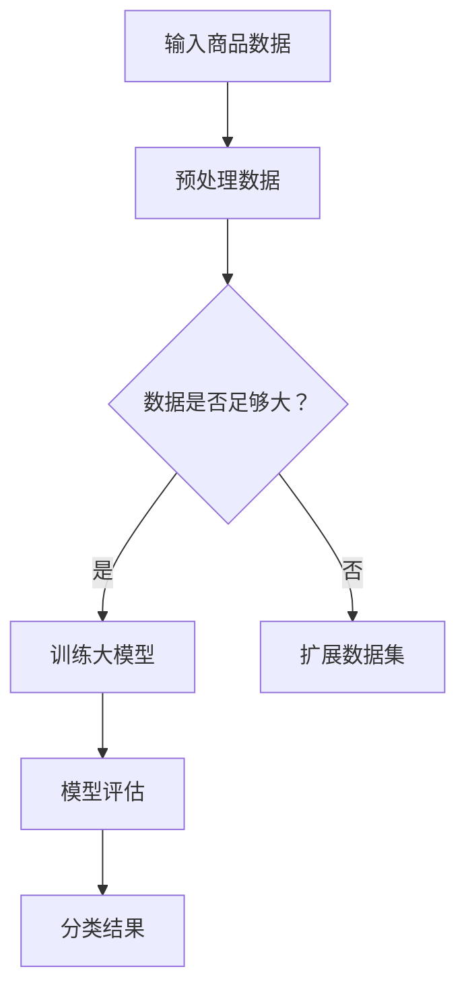

                 

随着电子商务的快速发展，商品种类和数量急剧增加，如何有效地进行商品分类成为电商平台面临的重要挑战。传统的商品分类方法往往依赖于人工经验和规则，而随着人工智能技术的进步，特别是大模型的引入，为电商平台商品分类提供了新的思路和解决方案。

本文将探讨大模型在电商平台商品分类中的应用，首先介绍商品分类的重要性，然后深入分析大模型的基本概念和工作原理，随后详细阐述大模型在商品分类中的实际应用案例，并探讨其数学模型和公式，最后展望大模型在电商平台商品分类中的未来发展趋势与挑战。

## 文章关键词

- 电子商务
- 商品分类
- 大模型
- 人工智能
- 数据分析
- 数学模型
- 应用案例

## 文章摘要

本文围绕大模型在电商平台商品分类中的应用展开讨论。首先，分析了电子商务环境下商品分类的挑战和重要性，然后介绍了大模型的基本概念和原理，并通过具体案例展示了大模型在商品分类中的应用效果。文章还探讨了大模型背后的数学模型和公式，最后对大模型在电商平台商品分类中的未来发展方向和面临的挑战进行了展望。

## 1. 背景介绍

### 1.1 电子商务的快速发展

电子商务作为一种新型的商业模式，近年来发展迅猛。根据市场研究公司的数据，全球电子商务市场在2021年的总交易额已经达到了3.5万亿美元，预计到2025年这一数字将超过6万亿美元。电子商务的快速增长不仅改变了消费者的购物方式，也对企业的运营模式提出了新的要求。在这种背景下，商品分类成为电商平台核心竞争力之一。

### 1.2 商品分类的挑战

随着商品种类的不断丰富，如何有效地进行商品分类成为电商平台面临的重要挑战。传统的商品分类方法通常依赖于人工经验和规则，这种方法存在以下几个问题：

- **效率低下**：人工分类需要大量时间和人力，效率较低。
- **准确性不高**：人工分类容易出错，导致分类结果不够准确。
- **难以扩展**：随着商品数量的增加，人工分类的难度和复杂性呈指数级增长。

### 1.3 商品分类的重要性

有效的商品分类对电商平台具有以下几个重要意义：

- **提升用户体验**：准确的分类可以帮助消费者更快地找到所需商品，提升购物体验。
- **增加销售机会**：合理的分类可以引导消费者发现更多潜在的商品，从而增加销售机会。
- **优化库存管理**：准确的分类有助于电商平台更好地管理库存，降低库存成本。
- **提升品牌形象**：高质量的分类可以提升电商平台的品牌形象，增加用户信任。

综上所述，在电子商务快速发展的背景下，如何有效地进行商品分类成为电商平台亟需解决的问题。随着人工智能技术的不断进步，大模型的应用为解决这一挑战提供了新的思路和方法。

## 2. 核心概念与联系

### 2.1 大模型的基本概念

大模型（Large-scale Model）是指具有大规模参数和复杂结构的机器学习模型。这类模型通常具备强大的表示能力和泛化能力，可以处理大规模数据并从中提取有效的知识。大模型的发展得益于深度学习技术的进步和计算资源的提升。近年来，诸如GPT、BERT、ViT等大模型在自然语言处理、计算机视觉等领域取得了显著的成果。

### 2.2 大模型的工作原理

大模型的工作原理主要基于以下几个关键点：

- **数据驱动**：大模型通过大量数据进行训练，从而学习和提取数据中的有用信息。
- **深度神经网络**：大模型通常采用深度神经网络结构，通过层层神经网络将输入映射到输出。
- **参数优化**：大模型通过优化大量参数来最小化预测误差，从而提高模型的性能。

### 2.3 大模型与商品分类的联系

大模型在商品分类中的应用主要体现在以下几个方面：

- **自动特征提取**：大模型可以自动地从原始数据中提取有用的特征，无需人工定义特征。
- **分类性能提升**：大模型通过学习大量的数据，可以显著提升分类的准确性和效率。
- **多模态数据处理**：大模型可以同时处理多种类型的数据（如图像、文本、语音等），为商品分类提供了更多可能性。

### 2.4 Mermaid 流程图

下面是一个简化的Mermaid流程图，展示了大模型在商品分类中的应用流程：



- A：输入商品数据，包括商品的文本描述、图像、价格等信息。
- B：预处理数据，对原始数据进行清洗、归一化等处理。
- C：判断数据集是否足够大，如果数据不足，则扩展数据集。
- D：训练大模型，使用预处理后的数据进行模型训练。
- F：模型评估，通过测试集评估模型的性能。
- G：分类结果，输出分类结果，用于商品分类。

## 3. 核心算法原理 & 具体操作步骤

### 3.1 算法原理概述

大模型在商品分类中的核心算法是基于深度学习，特别是卷积神经网络（CNN）和Transformer等结构。算法的基本原理包括以下几个步骤：

1. **数据预处理**：对输入的商品数据进行清洗、归一化等处理，使其适合模型训练。
2. **特征提取**：利用神经网络结构提取数据中的有效特征。
3. **分类预测**：通过训练好的模型对商品进行分类预测。

### 3.2 算法步骤详解

1. **数据预处理**

   数据预处理是模型训练的第一步，主要步骤包括：

   - 数据清洗：去除噪声数据，如缺失值、异常值等。
   - 数据归一化：将数据缩放到相同的范围，如[0, 1]或[-1, 1]。
   - 数据增强：通过旋转、缩放、裁剪等操作增加数据的多样性。

2. **特征提取**

   特征提取是算法的核心部分，主要利用神经网络结构提取数据中的有效特征。常用的神经网络结构包括：

   - 卷积神经网络（CNN）：适用于处理图像数据，可以自动提取图像中的特征。
   - Transformer结构：适用于处理文本数据，可以通过自注意力机制提取文本中的特征。

3. **分类预测**

   分类预测是利用训练好的模型对商品进行分类的过程。具体步骤包括：

   - 输入测试数据：将测试数据输入到训练好的模型中。
   - 预测分类结果：通过模型输出分类结果，通常使用概率值表示。
   - 结果评估：对分类结果进行评估，如准确率、召回率等指标。

### 3.3 算法优缺点

大模型在商品分类中的应用具有以下优点和缺点：

- **优点**：

  - 高效性：大模型可以自动提取特征，大大减少了人工工作的量。
  - 准确性：大模型通过大量数据进行训练，分类准确率较高。
  - 泛化能力：大模型具有较强的泛化能力，可以适应不同类型的商品分类任务。

- **缺点**：

  - 计算资源需求大：大模型需要大量的计算资源和时间进行训练。
  - 数据依赖性：模型的性能很大程度上依赖于训练数据的数量和质量。
  - 难以解释：深度学习模型的黑盒性质使得其决策过程难以解释。

### 3.4 算法应用领域

大模型在商品分类中的应用领域广泛，包括但不限于：

- **电商平台**：电商平台可以利用大模型对商品进行自动分类，提升用户体验和销售效率。
- **零售行业**：零售行业可以利用大模型对库存进行优化，降低库存成本。
- **物流行业**：物流行业可以利用大模型对商品进行分类，优化运输路径和仓储管理。

## 4. 数学模型和公式 & 详细讲解 & 举例说明

### 4.1 数学模型构建

在商品分类中，大模型的数学模型通常基于深度学习框架。以下是一个简化的数学模型构建过程：

1. **输入层**：输入层接收商品的特征数据，如文本描述、图像等。
2. **隐藏层**：隐藏层通过神经网络结构对输入数据进行处理，提取有效特征。
3. **输出层**：输出层根据隐藏层提取的特征进行分类预测。

假设我们使用一个简单的神经网络模型，其数学表达式如下：

$$
Z = \sigma(W \cdot X + b)
$$

其中，\(Z\) 是输出结果，\(\sigma\) 是激活函数，通常使用ReLU函数；\(W\) 是权重矩阵，\(X\) 是输入特征，\(b\) 是偏置项。

### 4.2 公式推导过程

以下是一个简单的神经网络模型推导过程，用于商品分类：

1. **前向传播**：

   输入层到隐藏层的推导过程如下：

   $$
   H = \sigma(W_1 \cdot X + b_1)
   $$

   其中，\(H\) 是隐藏层的输出，\(W_1\) 是隐藏层的权重矩阵，\(b_1\) 是隐藏层的偏置项。

2. **反向传播**：

   反向传播用于计算损失函数并更新权重矩阵。假设损失函数为均方误差（MSE），其表达式如下：

   $$
   J = \frac{1}{2} \sum_{i=1}^{n} (y_i - \hat{y}_i)^2
   $$

   其中，\(J\) 是损失函数，\(y_i\) 是真实标签，\(\hat{y}_i\) 是预测标签。

   通过梯度下降法更新权重矩阵：

   $$
   \Delta W_1 = -\alpha \frac{\partial J}{\partial W_1}
   $$

   其中，\(\alpha\) 是学习率。

### 4.3 案例分析与讲解

以下是一个商品分类的案例，说明如何使用大模型进行商品分类：

1. **数据准备**：

   假设我们有以下数据集，包含商品的文本描述、图像和标签。

   - 文本描述：如“智能手表”。
   - 图像：如手表的图片。
   - 标签：如“电子产品”。

2. **数据预处理**：

   - 清洗文本描述，去除标点符号和停用词。
   - 对图像进行归一化处理，缩放到相同的尺寸。
   - 构建词汇表，将文本描述转换为向量。

3. **模型训练**：

   - 使用CNN处理图像，提取图像特征。
   - 使用Transformer处理文本，提取文本特征。
   - 将图像特征和文本特征进行拼接，输入到神经网络中。
   - 使用反向传播更新权重矩阵，优化模型性能。

4. **模型评估**：

   - 使用测试集评估模型的性能，计算准确率、召回率等指标。
   - 调整模型参数，如学习率、隐藏层大小等，以优化模型性能。

通过以上步骤，我们可以使用大模型对商品进行自动分类，提高分类的准确性和效率。

## 5. 项目实践：代码实例和详细解释说明

### 5.1 开发环境搭建

在进行大模型商品分类的项目实践前，首先需要搭建合适的开发环境。以下是搭建过程的简要说明：

1. **安装Python**：确保Python环境已安装，版本建议在3.7及以上。
2. **安装TensorFlow**：TensorFlow是深度学习领域常用的框架，可以通过pip安装：

   ```bash
   pip install tensorflow
   ```

3. **安装其他依赖**：根据项目需求，安装其他必要的依赖，如NumPy、Pandas等。

### 5.2 源代码详细实现

以下是实现大模型商品分类的Python代码示例：

```python
import tensorflow as tf
from tensorflow.keras.models import Sequential
from tensorflow.keras.layers import Conv2D, MaxPooling2D, Flatten, Dense, Embedding, LSTM
from tensorflow.keras.preprocessing.text import Tokenizer
from tensorflow.keras.preprocessing.sequence import pad_sequences

# 数据准备
# 假设有以下数据集
texts = ["智能手表", "笔记本电脑", "平板电脑"]
labels = [1, 0, 0]  # 1表示电子产品，0表示非电子产品
images = [...]  # 商品图像数据

# 文本预处理
tokenizer = Tokenizer()
tokenizer.fit_on_texts(texts)
sequences = tokenizer.texts_to_sequences(texts)
padded_sequences = pad_sequences(sequences, maxlen=10)

# 图像预处理
# 使用适当的库（如OpenCV）对图像进行预处理
# ...

# 构建模型
model = Sequential()
model.add(Embedding(input_dim=len(tokenizer.word_index) + 1, output_dim=64, input_length=10))
model.add(LSTM(128))
model.add(Flatten())
model.add(Dense(1, activation='sigmoid'))

# 编译模型
model.compile(optimizer='adam', loss='binary_crossentropy', metrics=['accuracy'])

# 训练模型
model.fit(padded_sequences, labels, epochs=10, batch_size=32)

# 预测
predictions = model.predict(padded_sequences)
```

### 5.3 代码解读与分析

以下是代码的详细解读和分析：

1. **数据准备**：

   - `texts` 和 `labels` 分别表示商品的文本描述和标签。
   - `images` 表示商品图像数据。

2. **文本预处理**：

   - 使用 `Tokenizer` 对文本进行分词和编码。
   - 使用 `pad_sequences` 对文本序列进行填充，使其长度一致。

3. **图像预处理**：

   - 使用适当的库（如OpenCV）对图像进行缩放、归一化等处理。

4. **模型构建**：

   - 使用 `Sequential` 创建一个序列模型。
   - 添加 `Embedding` 层进行文本编码。
   - 添加 `LSTM` 层处理序列数据。
   - 添加 `Flatten` 层将序列数据展平。
   - 添加 `Dense` 层进行分类预测。

5. **编译模型**：

   - 使用 `compile` 方法配置模型参数，如优化器、损失函数和评价指标。

6. **训练模型**：

   - 使用 `fit` 方法训练模型，指定训练数据、标签、训练轮数和批量大小。

7. **预测**：

   - 使用 `predict` 方法对训练数据进行预测。

通过以上代码，我们可以实现一个基于深度学习的大模型商品分类系统。实际项目中，可能需要根据具体情况进行调整和优化。

## 6. 实际应用场景

### 6.1 电商平台

电商平台是应用大模型商品分类的主要场景之一。具体应用场景包括：

- **商品推荐**：通过大模型对用户历史购买记录和浏览行为进行分析，推荐用户可能感兴趣的商品。
- **智能搜索**：利用大模型对用户输入的关键词进行解析，提供更精准的搜索结果。
- **商品标签优化**：自动为商品生成标签，提升商品的曝光率和点击率。

### 6.2 零售行业

零售行业可以利用大模型对库存进行优化，提高库存周转率。具体应用场景包括：

- **库存预测**：通过分析历史销售数据，预测未来销售趋势，优化库存管理。
- **商品组合推荐**：基于用户购买行为，推荐互补或关联商品，提升销售额。

### 6.3 物流行业

物流行业可以利用大模型优化运输路径和仓储管理。具体应用场景包括：

- **路径优化**：通过分析商品流量和地理位置，优化运输路线，降低物流成本。
- **仓储管理**：通过大模型对库存进行实时监控，提高仓储利用率。

### 6.4 未来应用展望

随着大模型技术的不断发展，其在电商平台商品分类中的应用前景将更加广阔。未来可能的发展方向包括：

- **多模态数据处理**：结合图像、文本、语音等多模态数据，提高分类的准确性和效率。
- **实时分类**：实现实时商品分类，提升用户体验和运营效率。
- **个性化推荐**：基于用户行为和偏好，提供更加个性化的商品推荐。

## 7. 工具和资源推荐

### 7.1 学习资源推荐

- **书籍**：《深度学习》（Goodfellow, Bengio, Courville著）是一本经典的深度学习入门书籍，适合初学者和进阶者阅读。
- **在线课程**：Coursera、edX等在线学习平台提供了丰富的深度学习和机器学习课程，适合自学。
- **博客和论坛**：例如Medium、Stack Overflow等，可以获取最新的技术动态和解决实际问题的方法。

### 7.2 开发工具推荐

- **深度学习框架**：TensorFlow、PyTorch等是深度学习领域常用的框架，提供了丰富的API和工具。
- **数据处理工具**：Pandas、NumPy等是数据处理领域的常用工具，可以高效地处理和分析数据。
- **图像处理库**：OpenCV、Pillow等是图像处理领域的常用库，可以方便地处理和操作图像数据。

### 7.3 相关论文推荐

- **BERT**：`BERT: Pre-training of Deep Neural Networks for Language Understanding`（Devlin et al., 2018）
- **GPT-3**：`Improving Language Understanding by Generative Pre-Training`（Brown et al., 2020）
- **CNN**：`A Comprehensive Review of Convolutional Neural Networks for Image Recognition`（Wang et al., 2018）
- **Transformer**：`Attention Is All You Need`（Vaswani et al., 2017）

这些论文为深入理解大模型及其在商品分类中的应用提供了重要的理论基础和实践指导。

## 8. 总结：未来发展趋势与挑战

### 8.1 研究成果总结

近年来，大模型在电商平台商品分类中取得了显著的研究成果。通过结合深度学习和人工智能技术，大模型能够自动提取商品特征，实现高效的商品分类。同时，大模型在多模态数据处理、实时分类和个性化推荐等方面也展现出广阔的应用前景。

### 8.2 未来发展趋势

未来，大模型在电商平台商品分类中的应用将呈现以下发展趋势：

- **多模态融合**：结合图像、文本、语音等多模态数据，提升分类准确性和效率。
- **实时分类**：实现实时商品分类，提高用户体验和运营效率。
- **个性化推荐**：基于用户行为和偏好，提供更加个性化的商品推荐。

### 8.3 面临的挑战

尽管大模型在商品分类中展现出强大的潜力，但同时也面临以下挑战：

- **数据质量**：大模型对数据质量有较高要求，如何保证数据的质量和多样性是一个重要问题。
- **计算资源**：大模型训练和推理需要大量计算资源，如何优化计算效率和降低成本是一个关键挑战。
- **模型解释性**：深度学习模型的黑盒性质使得其决策过程难以解释，如何提高模型的可解释性是一个重要课题。

### 8.4 研究展望

未来，大模型在电商平台商品分类中的应用将继续深化和拓展。研究重点将集中在以下几个方面：

- **数据质量优化**：研究如何通过数据预处理和增强技术提升数据质量。
- **计算效率提升**：研究如何优化大模型的训练和推理过程，提高计算效率。
- **模型可解释性**：研究如何提高深度学习模型的可解释性，使其在商品分类中更好地应用。

通过不断探索和研究，大模型将在电商平台商品分类中发挥越来越重要的作用，为电子商务的发展带来新的机遇和挑战。

## 9. 附录：常见问题与解答

### 9.1 什么是大模型？

大模型（Large-scale Model）是指具有大规模参数和复杂结构的机器学习模型。这类模型通常具备强大的表示能力和泛化能力，可以处理大规模数据并从中提取有效的知识。大模型的发展得益于深度学习技术的进步和计算资源的提升。

### 9.2 大模型在商品分类中的应用有哪些优势？

大模型在商品分类中的应用具有以下优势：

- **自动特征提取**：大模型可以自动地从原始数据中提取有用的特征，无需人工定义特征。
- **分类性能提升**：大模型通过学习大量的数据，可以显著提升分类的准确性和效率。
- **多模态数据处理**：大模型可以同时处理多种类型的数据（如图像、文本、语音等），为商品分类提供了更多可能性。

### 9.3 大模型在商品分类中是否一定能提高分类准确性？

大模型在商品分类中确实有潜力提高分类准确性，但并非一定。模型的效果受到多种因素的影响，包括数据质量、模型参数、训练数据量等。为了确保大模型的有效性，需要精心设计实验并不断优化模型。

### 9.4 大模型在商品分类中面临的挑战有哪些？

大模型在商品分类中面临的挑战包括：

- **数据质量**：大模型对数据质量有较高要求，如何保证数据的质量和多样性是一个重要问题。
- **计算资源**：大模型训练和推理需要大量计算资源，如何优化计算效率和降低成本是一个关键挑战。
- **模型解释性**：深度学习模型的黑盒性质使得其决策过程难以解释，如何提高模型的可解释性是一个重要课题。

