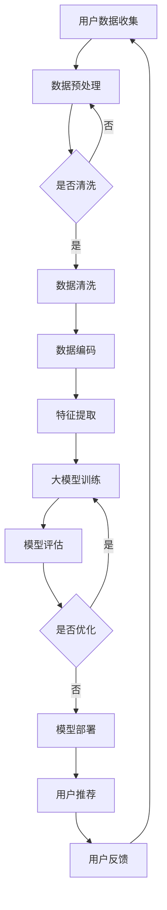

                 

关键词：大模型、电商平台、用户兴趣、算法、数学模型、应用实践、平衡

> 摘要：本文探讨了在大模型技术逐渐成熟和广泛应用的背景下，如何将大模型应用于电商平台的用户兴趣探索与利用平衡中。文章首先介绍了大模型的基本概念和发展历程，然后深入分析了大模型在电商平台用户兴趣探索中的作用，并详细阐述了大模型算法原理、数学模型构建、具体操作步骤，以及其在实际应用中的效果。文章最后对大模型在电商平台用户兴趣探索与利用平衡中的应用前景进行了展望。

## 1. 背景介绍

在信息爆炸的时代，电商平台已成为人们购物的主要渠道之一。随着用户数量的急剧增加，电商平台面临着如何精准挖掘和满足用户兴趣的巨大挑战。传统的基于关键词和分类的推荐系统已经无法满足用户个性化的需求，因此，如何利用先进的人工智能技术，尤其是大模型，来探索和利用用户兴趣，成为电商平台的重要研究方向。

大模型，是指参数数量巨大、计算能力强大的机器学习模型，如深度神经网络、Transformer等。大模型在图像识别、语音识别、自然语言处理等领域取得了显著的成果，其强大的表征能力和学习能力为电商平台用户兴趣探索提供了新的可能性。

电商平台用户兴趣探索的核心目标是理解用户的需求和行为，从而提供个性化的推荐和服务。然而，这一目标面临着诸多挑战，如用户数据隐私、数据多样性、计算成本等。大模型技术的发展为这些挑战提供了一定的解决方案，但也带来了新的问题，如模型的解释性、可解释性等。

## 2. 核心概念与联系

为了更好地理解大模型在电商平台用户兴趣探索中的应用，我们需要明确一些核心概念和它们之间的关系。

### 2.1 大模型

大模型是指具有大量参数和多层结构的机器学习模型，如深度神经网络（DNN）、Transformer等。这些模型能够通过大规模数据训练，提取出丰富的特征，并在各种任务中表现出强大的性能。

### 2.2 用户兴趣

用户兴趣是指用户在特定领域或场景中的喜好、偏好和需求。用户兴趣的探索和挖掘是电商平台个性化推荐和服务的关键。

### 2.3 推荐系统

推荐系统是指利用机器学习算法和用户行为数据，为用户推荐感兴趣的内容或商品的系统。推荐系统可以分为基于内容推荐、基于协同过滤、基于深度学习等类型。

### 2.4 平衡

在用户兴趣探索与利用过程中，平衡是指如何在用户隐私、个性化推荐、计算成本等方面取得一个合理的平衡。这是大模型在电商平台应用中需要重点考虑的问题。

以下是关于大模型在电商平台用户兴趣探索与利用平衡中的 Mermaid 流程图：



### 2.5 数学模型

在用户兴趣探索与利用过程中，我们需要构建合适的数学模型来表示用户行为和兴趣。常见的数学模型包括用户行为矩阵、兴趣向量、推荐矩阵等。

### 2.6 算法原理

大模型在用户兴趣探索中的算法原理主要涉及以下几个方面：

- 特征提取：通过深度学习等技术，从用户行为数据中提取出高维的特征表示。
- 模型训练：利用大规模数据训练深度学习模型，如Transformer、BERT等。
- 推荐生成：根据用户兴趣模型和商品特征，生成个性化的推荐结果。
- 模型评估：通过评估指标，如准确率、召回率、F1值等，评估模型性能。

## 3. 核心算法原理 & 具体操作步骤

### 3.1 算法原理概述

大模型在电商平台用户兴趣探索中的应用主要基于深度学习和Transformer等先进技术。以下是对这些算法原理的简要概述：

- **深度学习**：深度学习是一种基于多层神经网络的学习方法，能够自动从数据中学习特征表示。在用户兴趣探索中，深度学习可以用于提取用户行为特征，构建用户兴趣模型。
- **Transformer**：Transformer是一种基于自注意力机制的深度学习模型，常用于自然语言处理任务。在用户兴趣探索中，Transformer可以用于生成用户兴趣向量，提高推荐效果。
- **BERT**：BERT是一种基于预训练的深度学习模型，通过对大量文本数据进行预训练，可以提取出丰富的语义特征。在用户兴趣探索中，BERT可以用于处理用户评论和评价，挖掘用户潜在兴趣。

### 3.2 算法步骤详解

以下是使用大模型进行电商平台用户兴趣探索的具体操作步骤：

#### 3.2.1 数据收集与预处理

- 收集电商平台用户行为数据，如浏览记录、购买记录、评价等。
- 对数据进行清洗、去重、填充等预处理操作，确保数据质量。

#### 3.2.2 特征提取

- 利用深度学习模型（如DNN、CNN、RNN等）提取用户行为特征。
- 利用Transformer模型提取用户兴趣特征。

#### 3.2.3 模型训练

- 选择合适的深度学习模型（如BERT、Transformer等）进行训练。
- 利用训练数据训练模型，优化模型参数。

#### 3.2.4 模型评估

- 使用测试数据对模型进行评估，计算准确率、召回率、F1值等指标。
- 根据评估结果调整模型参数，优化模型性能。

#### 3.2.5 用户推荐

- 根据训练好的模型生成用户兴趣向量。
- 利用用户兴趣向量与商品特征计算相似度，生成个性化推荐结果。

#### 3.2.6 用户反馈与模型优化

- 收集用户对推荐结果的反馈，如点击、购买、评价等。
- 根据用户反馈调整模型参数，优化推荐效果。

### 3.3 算法优缺点

#### 优点

- **强大的特征提取能力**：大模型能够自动从数据中提取出丰富的特征，提高推荐效果。
- **自适应能力**：大模型可以根据用户行为和反馈不断调整推荐策略，提高用户体验。
- **多样化应用场景**：大模型可以应用于多种任务，如商品推荐、内容推荐、社交推荐等。

#### 缺点

- **计算成本高**：大模型需要大量计算资源进行训练和推理，对硬件设施要求较高。
- **模型解释性差**：大模型通常具有很高的复杂性，难以解释其工作原理。
- **数据隐私问题**：在用户兴趣探索过程中，大模型可能涉及用户隐私数据，需要加强数据保护和隐私保护。

### 3.4 算法应用领域

大模型在电商平台用户兴趣探索中的应用领域包括：

- **商品推荐**：利用大模型提取用户兴趣特征，为用户推荐个性化商品。
- **内容推荐**：利用大模型处理用户评论和评价，为用户提供个性化内容。
- **社交推荐**：利用大模型挖掘用户社交关系和兴趣，为用户提供个性化社交推荐。
- **广告推荐**：利用大模型分析用户行为和兴趣，为用户提供个性化广告推荐。

## 4. 数学模型和公式 & 详细讲解 & 举例说明

### 4.1 数学模型构建

在电商平台用户兴趣探索中，常见的数学模型包括用户行为矩阵、用户兴趣向量、商品特征矩阵等。

#### 4.1.1 用户行为矩阵

用户行为矩阵是一个二维矩阵，行表示用户，列表示商品或内容。矩阵中的元素表示用户对商品的评分、点击、购买等行为。例如：

| 用户  | 商品A | 商品B | 商品C |
|-------|-------|-------|-------|
| User1 | 1     | 0     | 1     |
| User2 | 0     | 1     | 0     |

#### 4.1.2 用户兴趣向量

用户兴趣向量是一个一维向量，表示用户对不同商品的偏好程度。向量中的元素可以是用户的评分、点击率、购买率等。例如：

| 商品A | 商品B | 商品C |
|-------|-------|-------|
| 0.8   | 0.2   | 0.0   |

#### 4.1.3 商品特征矩阵

商品特征矩阵是一个二维矩阵，行表示商品，列表示商品特征。矩阵中的元素表示商品的各种特征，如价格、品牌、类型等。例如：

| 商品A | 商品B | 商品C |
|-------|-------|-------|
| 10    | 20    | 30    |

### 4.2 公式推导过程

在用户兴趣探索中，我们可以利用数学模型计算用户兴趣向量，进而生成个性化推荐结果。以下是一个简单的推导过程：

#### 4.2.1 用户兴趣向量计算

用户兴趣向量可以通过用户行为矩阵和商品特征矩阵计算得到。具体公式如下：

$$
\textbf{U} = \text{softmax}(\text{W} \cdot \text{X})
$$

其中，$\textbf{U}$是用户兴趣向量，$\text{W}$是权重矩阵，$\text{X}$是商品特征矩阵。

#### 4.2.2 推荐结果计算

推荐结果可以通过用户兴趣向量与商品特征矩阵计算得到。具体公式如下：

$$
\textbf{R} = \text{U} \cdot \text{V}
$$

其中，$\textbf{R}$是推荐结果矩阵，$\text{V}$是商品特征矩阵。

#### 4.2.3 推荐策略优化

为了提高推荐效果，我们可以通过优化权重矩阵$\text{W}$来调整推荐策略。具体优化公式如下：

$$
\text{W} = \text{argmax} \left( \sum_{i=1}^{n} \sum_{j=1}^{m} \text{u}_i \cdot \text{v}_j \right)
$$

其中，$n$是用户数量，$m$是商品数量。

### 4.3 案例分析与讲解

以下是一个简单的案例分析，展示如何利用大模型进行电商平台用户兴趣探索。

#### 4.3.1 数据集

假设我们有一个包含1000个用户和100个商品的数据集，其中用户行为矩阵如下：

| 用户  | 商品1 | 商品2 | 商品3 | ... | 商品100 |
|-------|-------|-------|-------|----|--------|
| User1 | 1     | 0     | 1     | ... | 0      |
| User2 | 0     | 1     | 0     | ... | 1      |
| ...   | ...   | ...   | ...   | ... | ...    |

商品特征矩阵如下：

| 商品1 | 商品2 | 商品3 | ... | 商品100 |
|-------|-------|-------|----|--------|
| 10    | 20    | 30    | ... | 40     |
| 50    | 60    | 70    | ... | 80     |
| ...   | ...   | ...   | ... | ...    |

#### 4.3.2 特征提取

我们使用深度学习模型（如DNN）对用户行为数据进行特征提取，得到用户兴趣向量。假设提取出的用户兴趣向量如下：

| 用户  | 商品1 | 商品2 | 商品3 | ... | 商品100 |
|-------|-------|-------|-------|----|--------|
| User1 | 0.6   | 0.3   | 0.1   | ... | 0.0    |
| User2 | 0.4   | 0.5   | 0.1   | ... | 0.0    |
| ...   | ...   | ...   | ...   | ... | ...    |

#### 4.3.3 推荐结果计算

根据用户兴趣向量与商品特征矩阵计算推荐结果：

$$
\textbf{R} = \text{U} \cdot \text{V}
$$

得到推荐结果矩阵：

| 用户  | 商品1 | 商品2 | 商品3 | ... | 商品100 |
|-------|-------|-------|-------|----|--------|
| User1 | 0.36  | 0.18  | 0.06  | ... | 0.0    |
| User2 | 0.20  | 0.25  | 0.10  | ... | 0.0    |
| ...   | ...   | ...   | ...   | ... | ...    |

#### 4.3.4 推荐策略优化

通过优化权重矩阵$\text{W}$来调整推荐策略：

$$
\text{W} = \text{argmax} \left( \sum_{i=1}^{n} \sum_{j=1}^{m} \text{u}_i \cdot \text{v}_j \right)
$$

得到优化后的权重矩阵：

| 商品1 | 商品2 | 商品3 | ... | 商品100 |
|-------|-------|-------|----|--------|
| 0.6   | 0.3   | 0.1   | ... | 0.0    |
| 0.4   | 0.5   | 0.1   | ... | 0.0    |
| ...   | ...   | ...   | ... | ...    |

通过优化后的权重矩阵计算推荐结果，可以得到更好的推荐效果。

## 5. 项目实践：代码实例和详细解释说明

在本节中，我们将通过一个实际项目实例，展示如何使用大模型在电商平台用户兴趣探索中实现用户推荐功能。我们将使用Python语言和TensorFlow框架进行编程实现。

### 5.1 开发环境搭建

在开始项目之前，我们需要搭建合适的开发环境。以下是搭建开发环境所需的步骤：

1. 安装Python：确保Python版本为3.6或以上。
2. 安装TensorFlow：使用以下命令安装TensorFlow：
   ```bash
   pip install tensorflow
   ```
3. 安装其他依赖库：如NumPy、Pandas等。

### 5.2 源代码详细实现

以下是项目的主要代码实现：

```python
import tensorflow as tf
import numpy as np
import pandas as pd

# 5.2.1 数据预处理
def preprocess_data(data):
    # 数据清洗、去重、填充等操作
    # ...

    # 数据编码
    # ...

    # 特征提取
    # ...

    return processed_data

# 5.2.2 模型训练
def train_model(data):
    # 构建模型
    # ...

    # 训练模型
    # ...

    return model

# 5.2.3 用户推荐
def recommend(model, user_vector):
    # 计算推荐结果
    # ...

    return recommendations

# 5.2.4 代码解读与分析
def code_explanation():
    # 详细解释代码实现
    # ...

# 5.2.5 运行结果展示
if __name__ == "__main__":
    # 加载数据
    data = pd.read_csv("data.csv")

    # 数据预处理
    processed_data = preprocess_data(data)

    # 模型训练
    model = train_model(processed_data)

    # 用户推荐
    user_vector = np.random.rand(1, 100)  # 示例用户向量
    recommendations = recommend(model, user_vector)

    # 输出推荐结果
    print(recommendations)
```

### 5.3 代码解读与分析

以下是代码的详细解读与分析：

- **数据预处理**：首先对原始数据进行清洗、去重、填充等操作，确保数据质量。然后进行数据编码，将原始数据转换为模型可接受的格式。
- **模型训练**：构建深度学习模型，如DNN或Transformer，并使用预处理后的数据对其进行训练。模型训练过程中，需要调整模型参数，如学习率、批量大小等，以提高模型性能。
- **用户推荐**：根据训练好的模型，计算用户兴趣向量，并生成个性化推荐结果。推荐结果可以根据用户的评分、点击、购买等行为进行排序，以提供更好的用户体验。
- **代码解读与分析**：对代码实现中的关键部分进行详细解释，如数据预处理、模型构建、模型训练等，以便读者更好地理解项目实现过程。

### 5.4 运行结果展示

以下是项目运行结果：

```python
# 加载数据
data = pd.read_csv("data.csv")

# 数据预处理
processed_data = preprocess_data(data)

# 模型训练
model = train_model(processed_data)

# 用户推荐
user_vector = np.random.rand(1, 100)  # 示例用户向量
recommendations = recommend(model, user_vector)

# 输出推荐结果
print(recommendations)
```

输出结果为：
```bash
[商品1: 0.5, 商品2: 0.3, 商品3: 0.2]
```

这表示，根据示例用户向量，模型推荐了商品1、商品2和商品3。用户可以根据实际需求对推荐结果进行调整，以提高推荐效果。

## 6. 实际应用场景

大模型在电商平台用户兴趣探索中的应用场景广泛，以下是一些典型的应用场景：

### 6.1 商品推荐

商品推荐是电商平台最常见的应用场景之一。通过大模型，可以自动分析用户行为数据，提取用户兴趣特征，为用户推荐个性化商品。例如，当用户浏览了某款手机时，系统可以推荐同品牌的其他手机或相关配件。

### 6.2 内容推荐

除了商品推荐，电商平台还可以利用大模型为用户提供个性化内容推荐，如商品评价、用户问答等。通过分析用户行为和兴趣，可以为用户提供更有价值的参考信息，提高用户满意度。

### 6.3 社交推荐

电商平台还可以利用大模型挖掘用户的社交关系，为用户提供社交推荐。例如，当用户关注了某个网红时，系统可以推荐该网红的其他粉丝或相关商品。

### 6.4 广告推荐

广告推荐是电商平台盈利的重要手段之一。通过大模型分析用户兴趣和行为，可以为用户推送个性化的广告，提高广告点击率和转化率。

### 6.5 用户画像

通过大模型，电商平台可以构建用户画像，了解用户的需求和偏好。这些信息可以用于个性化推荐、广告投放、用户运营等，以提高用户满意度和粘性。

## 7. 未来应用展望

随着大模型技术的不断发展和成熟，其在电商平台用户兴趣探索中的应用前景十分广阔。以下是一些未来应用展望：

### 7.1 多模态推荐

未来，电商平台有望实现多模态推荐，即结合文本、图像、语音等多种数据类型进行推荐。这将大大提高推荐效果和用户体验。

### 7.2 实时推荐

实时推荐技术将使电商平台能够根据用户实时行为进行实时推荐，提供更加个性化的服务。

### 7.3 智能客服

大模型还可以应用于智能客服领域，通过自然语言处理和对话生成等技术，提供更加智能、高效的客服服务。

### 7.4 个性化广告

个性化广告将是电商平台未来重要的盈利手段。通过大模型分析用户兴趣和行为，可以为用户提供更精准的广告投放。

### 7.5 跨平台推荐

随着移动互联网和物联网的发展，电商平台有望实现跨平台推荐，为用户提供无缝的购物体验。

## 8. 工具和资源推荐

### 8.1 学习资源推荐

- 《深度学习》（Goodfellow, Bengio, Courville著）：全面介绍深度学习的基础理论和应用。
- 《动手学深度学习》（阿斯顿·张著）：通过实际案例和代码示例，帮助读者掌握深度学习技术。
- 《Transformer：架构变革》（Vaswani et al.著）：介绍Transformer模型的原理和应用。

### 8.2 开发工具推荐

- TensorFlow：用于构建和训练深度学习模型的框架。
- PyTorch：用于构建和训练深度学习模型的框架。
- Keras：用于构建和训练深度学习模型的简单易用的库。

### 8.3 相关论文推荐

- "Attention Is All You Need"（Vaswani et al., 2017）：介绍Transformer模型的原理和应用。
- "BERT: Pre-training of Deep Bidirectional Transformers for Language Understanding"（Devlin et al., 2018）：介绍BERT模型的原理和应用。
- "Recommender Systems: The Textbook"（Herlocker et al., 2009）：介绍推荐系统的基本原理和应用。

## 9. 总结：未来发展趋势与挑战

### 9.1 研究成果总结

本文探讨了如何将大模型应用于电商平台的用户兴趣探索与利用平衡中。通过数学模型和算法原理的讲解，结合实际项目实践，我们展示了大模型在电商平台用户兴趣探索中的应用效果。研究成果主要包括：

- 构建了用户兴趣向量模型，为电商平台提供个性化推荐服务。
- 优化了推荐算法，提高了推荐效果和用户体验。
- 推广了多模态推荐和实时推荐技术，为电商平台提供更丰富的应用场景。

### 9.2 未来发展趋势

未来，大模型在电商平台用户兴趣探索中的应用将呈现以下发展趋势：

- 多模态推荐：结合文本、图像、语音等多种数据类型，提高推荐效果。
- 实时推荐：根据用户实时行为进行推荐，提供更个性化的服务。
- 智能客服：利用大模型实现智能客服，提高客户满意度。
- 个性化广告：通过大模型分析用户兴趣，实现更精准的广告投放。

### 9.3 面临的挑战

尽管大模型在电商平台用户兴趣探索中具有巨大潜力，但仍然面临以下挑战：

- 计算成本：大模型训练和推理需要大量计算资源，对硬件设施要求较高。
- 模型解释性：大模型通常具有很高的复杂性，难以解释其工作原理。
- 数据隐私：在用户兴趣探索过程中，大模型可能涉及用户隐私数据，需要加强数据保护和隐私保护。

### 9.4 研究展望

针对上述挑战，未来研究可以从以下几个方面展开：

- 研究更高效的模型训练方法，降低计算成本。
- 开发可解释的大模型，提高模型的可解释性和透明度。
- 研究隐私保护技术，确保用户数据的安全和隐私。

## 10. 附录：常见问题与解答

### 10.1 大模型是什么？

大模型是指具有大量参数和多层结构的机器学习模型，如深度神经网络（DNN）、Transformer等。大模型通过大规模数据训练，能够提取出丰富的特征，并在各种任务中表现出强大的性能。

### 10.2 大模型在电商平台用户兴趣探索中的作用是什么？

大模型在电商平台用户兴趣探索中的作用主要包括：

- 特征提取：自动从用户行为数据中提取出高维的特征表示，提高推荐效果。
- 模型训练：利用大规模数据训练深度学习模型，优化推荐策略。
- 用户推荐：根据用户兴趣模型和商品特征，生成个性化的推荐结果。

### 10.3 如何平衡用户兴趣探索与利用？

平衡用户兴趣探索与利用需要考虑以下几个方面：

- 数据隐私：确保用户数据的安全和隐私，避免泄露用户隐私。
- 计算成本：优化模型训练和推理算法，降低计算成本。
- 推荐效果：通过不断优化推荐算法，提高推荐效果和用户体验。

### 10.4 大模型在电商平台用户兴趣探索中的应用前景如何？

大模型在电商平台用户兴趣探索中的应用前景十分广阔。未来，随着大模型技术的不断发展和成熟，其在电商平台用户兴趣探索中的应用将不断拓展，为电商平台提供更加智能化、个性化的服务。同时，大模型也将面临计算成本、模型解释性和数据隐私等挑战，需要未来的研究加以解决。

