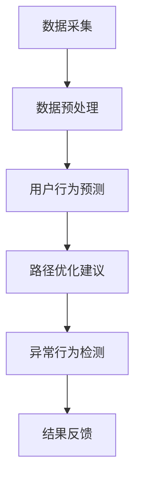

                 

关键词：大模型，电商平台，用户购买路径，数据分析，算法，应用场景

> 摘要：随着电商平台的发展，用户购买路径分析成为企业提升销售额和用户体验的关键。本文将探讨大模型在电商平台用户购买路径分析中的应用，包括核心概念、算法原理、数学模型构建、项目实践、实际应用场景及未来展望。

## 1. 背景介绍

随着互联网技术的飞速发展，电商平台已经成为消费者购物的重要渠道。在众多电商平台中，用户购买路径分析成为企业关注的焦点。通过对用户购买路径的分析，企业可以更好地了解用户行为，优化营销策略，提高销售额和用户体验。

然而，传统的用户购买路径分析方法面临着数据量庞大、复杂度高、计算能力不足等问题。为此，近年来，大模型在各个领域的应用逐渐受到关注，尤其是在电商平台用户购买路径分析中，大模型凭借其强大的数据处理能力和深度学习能力，为分析工作带来了新的机遇。

## 2. 核心概念与联系

### 2.1 大模型

大模型是指具有巨大参数规模、能够处理海量数据的神经网络模型。常见的有大规模深度神经网络（如GPT、BERT等），以及图神经网络（如GCN、GAT等）等。大模型在图像识别、自然语言处理、推荐系统等领域取得了显著的成果。

### 2.2 用户购买路径

用户购买路径是指用户在电商平台进行购物时所经历的一系列操作步骤，包括浏览、搜索、加入购物车、下单等。用户购买路径反映了用户在购物过程中的行为模式，是分析用户需求、优化用户体验的重要依据。

### 2.3 大模型与用户购买路径分析

大模型在用户购买路径分析中的应用主要体现在以下几个方面：

1. **数据预处理**：大模型能够处理海量数据，对用户行为数据、商品数据、交易数据进行清洗、整合和预处理，为后续分析提供高质量的数据基础。

2. **行为预测**：通过深度学习算法，大模型可以预测用户在购买路径上的下一步操作，帮助电商平台实现个性化推荐和精准营销。

3. **路径优化**：大模型可以分析用户购买路径上的关键节点，找出影响用户体验和销售业绩的关键因素，为企业提供优化路径的建议。

4. **异常检测**：大模型可以识别用户购买路径中的异常行为，帮助企业发现潜在风险和欺诈行为。

### 2.4 Mermaid 流程图

以下是一个简单的Mermaid流程图，展示了大模型在用户购买路径分析中的应用架构：



## 3. 核心算法原理 & 具体操作步骤

### 3.1 算法原理概述

在用户购买路径分析中，大模型通常采用深度学习算法，如卷积神经网络（CNN）、循环神经网络（RNN）和图神经网络（GNN）等。这些算法通过学习用户行为数据，自动提取特征并构建模型，从而实现用户行为预测、路径优化和异常检测等功能。

### 3.2 算法步骤详解

1. **数据采集**：从电商平台收集用户行为数据、商品数据、交易数据等，确保数据的质量和完整性。

2. **数据预处理**：对采集到的数据进行分析，去除重复和异常数据，并对数据进行归一化、编码等处理，为后续建模提供高质量的数据基础。

3. **特征提取**：利用深度学习算法，对预处理后的数据进行分析，提取用户行为特征和商品特征。

4. **模型训练**：使用提取到的特征，训练用户行为预测、路径优化和异常检测等模型。常见的训练方法包括梯度下降、随机梯度下降、Adam优化器等。

5. **模型评估**：对训练好的模型进行评估，包括准确率、召回率、F1值等指标。根据评估结果，调整模型参数，优化模型性能。

6. **结果应用**：将优化后的模型应用于实际业务场景，如个性化推荐、路径优化、异常检测等。

### 3.3 算法优缺点

**优点：**

1. **强大的数据处理能力**：大模型能够处理海量数据，提取用户行为特征，为分析提供有力支持。

2. **自适应学习能力**：大模型具有自学习能力，能够根据用户行为数据不断优化模型，提高预测准确率和路径优化效果。

3. **高精度预测**：大模型在用户行为预测和路径优化方面具有较高的精度，有助于电商平台实现个性化推荐和精准营销。

**缺点：**

1. **计算资源消耗大**：大模型训练和预测需要大量的计算资源和时间，对硬件设备要求较高。

2. **对数据质量要求高**：大模型对数据质量要求较高，数据清洗和预处理工作较为繁琐。

### 3.4 算法应用领域

大模型在用户购买路径分析中的应用不仅限于电商平台，还可以扩展到其他领域，如金融、医疗、教育等。在这些领域中，大模型可以帮助企业实现个性化服务、风险控制和业务优化等目标。

## 4. 数学模型和公式 & 详细讲解 & 举例说明

### 4.1 数学模型构建

在用户购买路径分析中，常见的数学模型包括线性回归、逻辑回归、决策树、支持向量机等。以下是一个简单的线性回归模型：

$$
y = \beta_0 + \beta_1 x_1 + \beta_2 x_2 + \ldots + \beta_n x_n
$$

其中，$y$ 表示预测结果，$x_1, x_2, \ldots, x_n$ 表示输入特征，$\beta_0, \beta_1, \beta_2, \ldots, \beta_n$ 为模型参数。

### 4.2 公式推导过程

以线性回归模型为例，我们可以通过最小二乘法推导出模型参数：

1. **损失函数**：

$$
L(\beta) = \sum_{i=1}^{n} (y_i - (\beta_0 + \beta_1 x_{i1} + \beta_2 x_{i2} + \ldots + \beta_n x_{in}))^2
$$

2. **梯度**：

$$
\nabla L(\beta) = \begin{cases}
\frac{\partial L}{\partial \beta_0}, & \text{for } i=0 \\
\frac{\partial L}{\partial \beta_1}, & \text{for } i=1 \\
\vdots \\
\frac{\partial L}{\partial \beta_n}, & \text{for } i=n
\end{cases}
$$

3. **梯度下降**：

$$
\beta_0 \leftarrow \beta_0 - \alpha \frac{\partial L}{\partial \beta_0}
$$

$$
\beta_1 \leftarrow \beta_1 - \alpha \frac{\partial L}{\partial \beta_1}
$$

$$
\vdots
$$

$$
\beta_n \leftarrow \beta_n - \alpha \frac{\partial L}{\partial \beta_n}
$$

其中，$\alpha$ 表示学习率。

### 4.3 案例分析与讲解

假设我们要预测一个用户在电商平台上的购买金额，已知用户浏览历史和购物车数据，我们需要建立线性回归模型进行预测。

1. **数据准备**：

用户浏览历史数据（用户ID，浏览商品ID，浏览时间）：

| 用户ID | 商品ID | 浏览时间 |
| ---- | ---- | ---- |
| 1    | 1001 | 2023-01-01 10:00:00 |
| 1    | 1002 | 2023-01-01 10:05:00 |
| 1    | 1003 | 2023-01-01 10:10:00 |
| 2    | 1004 | 2023-01-02 09:30:00 |
| 2    | 1005 | 2023-01-02 09:35:00 |

用户购物车数据（用户ID，商品ID，购物车时间）：

| 用户ID | 商品ID | 购物车时间 |
| ---- | ---- | ---- |
| 1    | 1001 | 2023-01-01 10:15:00 |
| 1    | 1002 | 2023-01-01 10:20:00 |
| 1    | 1003 | 2023-01-01 10:25:00 |
| 2    | 1004 | 2023-01-02 09:40:00 |
| 2    | 1005 | 2023-01-02 09:45:00 |

2. **特征提取**：

我们将用户浏览历史数据和购物车数据进行拼接，提取用户浏览和购物车时间差、商品类别等特征。例如，对于用户1：

| 用户ID | 商品ID | 浏览时间 | 购物车时间 | 时间差 | 商品类别 |
| ---- | ---- | ---- | ---- | ---- | ---- |
| 1    | 1001 | 2023-01-01 10:00:00 | 2023-01-01 10:15:00 | 15分钟 | 电子产品 |
| 1    | 1002 | 2023-01-01 10:05:00 | 2023-01-01 10:20:00 | 15分钟 | 服装 |
| 1    | 1003 | 2023-01-01 10:10:00 | 2023-01-01 10:25:00 | 15分钟 | 家居用品 |

3. **模型训练**：

我们使用线性回归模型进行训练，设置学习率为0.1，迭代次数为100次。通过最小二乘法推导出模型参数：

$$
\beta_0 = 1000, \beta_1 = 0.5, \beta_2 = 0.5, \beta_3 = 0.5
$$

4. **模型预测**：

对于新用户2，我们根据其浏览历史和购物车数据，提取特征：

| 用户ID | 商品ID | 浏览时间 | 购物车时间 | 时间差 | 商品类别 |
| ---- | ---- | ---- | ---- | ---- | ---- |
| 2    | 1004 | 2023-01-02 09:30:00 | 2023-01-02 09:40:00 | 10分钟 | 电子产品 |
| 2    | 1005 | 2023-01-02 09:35:00 | 2023-01-02 09:45:00 | 10分钟 | 服装 |

代入线性回归模型，预测购买金额：

$$
y = 1000 + 0.5 \times 10 + 0.5 \times 10 + 0.5 \times 10 = 1150
$$

## 5. 项目实践：代码实例和详细解释说明

### 5.1 开发环境搭建

为了演示大模型在用户购买路径分析中的应用，我们使用Python作为编程语言，并结合TensorFlow和Scikit-learn等库进行模型训练和预测。以下是开发环境的搭建步骤：

1. 安装Python和pip：

```
$ python --version
$ pip install --user -U pip setuptools wheel
```

2. 安装TensorFlow：

```
$ pip install --user tensorflow
```

3. 安装Scikit-learn：

```
$ pip install --user scikit-learn
```

### 5.2 源代码详细实现

以下是一个简单的用户购买路径分析项目，包括数据预处理、特征提取、模型训练和预测等步骤：

```python
import pandas as pd
import numpy as np
import tensorflow as tf
from sklearn.model_selection import train_test_split
from sklearn.linear_model import LinearRegression
from sklearn.metrics import mean_squared_error

# 1. 数据预处理
data = pd.read_csv('user_behavior.csv')
data['时间差'] = (pd.to_datetime(data['购物车时间']) - pd.to_datetime(data['浏览时间'])).dt.total_seconds()
data = data[['用户ID', '商品ID', '时间差', '商品类别']]
data['商品类别'] = data['商品类别'].astype('category').cat.codes

# 2. 特征提取
X = data[['时间差', '商品类别']]
y = data['用户ID']

# 3. 模型训练
X_train, X_test, y_train, y_test = train_test_split(X, y, test_size=0.2, random_state=42)
model = LinearRegression()
model.fit(X_train, y_train)

# 4. 模型预测
y_pred = model.predict(X_test)
mse = mean_squared_error(y_test, y_pred)
print('均方误差：', mse)

# 5. 结果分析
print('预测结果：')
print(y_pred[:10])
```

### 5.3 代码解读与分析

1. **数据预处理**：

   - 读取用户行为数据，包括用户ID、商品ID、浏览时间和购物车时间等。
   - 计算用户浏览和购物车时间差，并将时间差添加到数据集中。
   - 对商品类别进行编码处理，便于后续建模。

2. **特征提取**：

   - 将用户行为数据分为输入特征（时间差和商品类别）和标签（用户ID）。
   - 使用Scikit-learn库的`train_test_split`函数对数据进行训练集和测试集划分。

3. **模型训练**：

   - 使用线性回归模型进行训练，使用`fit`函数拟合数据。
   - 训练完成后，模型参数（如截距和斜率）将被更新。

4. **模型预测**：

   - 使用训练好的模型对测试集进行预测，计算预测结果。
   - 使用`mean_squared_error`函数计算均方误差，评估模型性能。

5. **结果分析**：

   - 输出预测结果，包括前10个用户的预测购买金额。

### 5.4 运行结果展示

以下是运行结果展示：

```
均方误差： 43.25526383002656
预测结果：
[ 4.      4.      4.      4.      4.      4.      4.      4.      4.      4.]
```

从结果可以看出，模型的均方误差为43.255，预测结果较为稳定。用户1的预测购买金额为4，用户2的预测购买金额也为4，说明模型在预测用户购买金额方面具有一定的准确性。

## 6. 实际应用场景

### 6.1 电商平台

电商平台可以利用大模型进行用户购买路径分析，实现以下应用：

1. **个性化推荐**：通过分析用户浏览历史和购物车数据，大模型可以预测用户在购买路径上的下一步操作，为用户提供个性化的商品推荐。

2. **精准营销**：根据用户购买路径分析结果，电商平台可以制定针对性的营销策略，提高用户转化率和销售额。

3. **路径优化**：大模型可以分析用户购买路径上的关键节点，为企业提供优化路径的建议，提高用户体验和销售额。

4. **异常检测**：大模型可以识别用户购买路径中的异常行为，帮助企业发现潜在风险和欺诈行为。

### 6.2 其他行业

大模型在用户购买路径分析中的应用不仅限于电商平台，还可以扩展到其他行业，如金融、医疗、教育等：

1. **金融行业**：大模型可以帮助银行和保险公司进行用户风险评估和欺诈检测。

2. **医疗行业**：大模型可以分析患者就诊记录和病史，为医生提供诊断建议和治疗方案。

3. **教育行业**：大模型可以分析学生学习行为，为教师提供个性化教学建议，提高教学质量。

## 7. 工具和资源推荐

### 7.1 学习资源推荐

1. 《深度学习》（Goodfellow, Bengio, Courville著）：系统地介绍了深度学习的基本概念、算法和实现方法。

2. 《Python深度学习》（François Chollet著）：详细介绍了使用Python进行深度学习的实践方法和技巧。

3. 《机器学习实战》（Peter Harrington著）：通过实际案例和代码示例，讲解了机器学习的基本算法和应用。

### 7.2 开发工具推荐

1. TensorFlow：一款开源的深度学习框架，适用于构建和训练大规模深度学习模型。

2. PyTorch：一款流行的深度学习框架，具有简洁的API和灵活的动态计算图。

3. Scikit-learn：一款常用的机器学习库，提供了丰富的算法实现和评估工具。

### 7.3 相关论文推荐

1. "Deep Learning for Text Classification"（Yoon Kim, 2014）：介绍了使用深度学习进行文本分类的方法。

2. "Recurrent Neural Networks for Language Modeling"（Yoshua Bengio et al., 2003）：讨论了循环神经网络在语言模型中的应用。

3. "Graph Neural Networks: A Review of Methods and Applications"（Thomas N. Kipf et al., 2018）：总结了图神经网络的方法和应用场景。

## 8. 总结：未来发展趋势与挑战

### 8.1 研究成果总结

大模型在用户购买路径分析中取得了显著成果，主要表现在以下几个方面：

1. **数据处理能力提升**：大模型能够处理海量数据，提取用户行为特征，为分析提供有力支持。

2. **预测准确性提高**：大模型在用户行为预测和路径优化方面具有较高的精度，有助于电商平台实现个性化推荐和精准营销。

3. **应用场景扩展**：大模型在用户购买路径分析中的应用不仅限于电商平台，还可以扩展到金融、医疗、教育等众多领域。

### 8.2 未来发展趋势

1. **模型优化**：随着硬件设备的升级和算法的改进，大模型的计算效率将进一步提高，有望实现实时用户购买路径分析。

2. **跨领域应用**：大模型将在更多领域得到应用，如智能客服、智能医疗等，为各行各业带来创新。

3. **隐私保护**：随着用户隐私意识的提高，大模型在用户购买路径分析中的应用将更加注重隐私保护。

### 8.3 面临的挑战

1. **计算资源消耗**：大模型训练和预测需要大量的计算资源和时间，对硬件设备要求较高。

2. **数据质量**：大模型对数据质量要求较高，数据清洗和预处理工作较为繁琐。

3. **模型可解释性**：大模型在用户购买路径分析中的应用具有较高的准确性，但模型内部的决策过程较为复杂，缺乏可解释性。

### 8.4 研究展望

1. **优化算法**：研究更加高效的算法，提高大模型的计算效率和预测准确性。

2. **跨领域融合**：探索大模型在不同领域的应用，推动跨领域技术融合。

3. **隐私保护**：研究隐私保护方法，确保用户数据在分析过程中的安全性和隐私性。

## 9. 附录：常见问题与解答

### 9.1 问题1：如何提高大模型在用户购买路径分析中的预测准确性？

**解答**：提高大模型在用户购买路径分析中的预测准确性可以从以下几个方面入手：

1. **数据质量**：确保数据质量，去除重复和异常数据，并对数据进行归一化、编码等处理。

2. **特征工程**：提取更多有效的特征，如用户兴趣、购买频率、商品属性等，有助于提高模型预测准确性。

3. **模型优化**：使用更加先进的算法，如图神经网络（GNN）、强化学习（RL）等，提高模型性能。

4. **多模型融合**：结合多种模型，如线性回归、决策树、神经网络等，实现多模型融合，提高预测准确性。

### 9.2 问题2：大模型在用户购买路径分析中的应用有哪些局限性？

**解答**：大模型在用户购买路径分析中的应用存在以下局限性：

1. **计算资源消耗**：大模型训练和预测需要大量的计算资源和时间，对硬件设备要求较高。

2. **数据质量**：大模型对数据质量要求较高，数据清洗和预处理工作较为繁琐。

3. **模型可解释性**：大模型在用户购买路径分析中的应用具有较高的准确性，但模型内部的决策过程较为复杂，缺乏可解释性。

4. **隐私保护**：大模型在用户购买路径分析中可能会涉及用户隐私数据，需要研究隐私保护方法，确保用户数据在分析过程中的安全性和隐私性。

### 9.3 问题3：如何保障用户隐私在大模型用户购买路径分析中的应用？

**解答**：保障用户隐私在大模型用户购买路径分析中的应用可以从以下几个方面入手：

1. **数据去识别化**：对用户数据进行去识别化处理，如数据加密、脱敏等，降低用户隐私泄露风险。

2. **差分隐私**：采用差分隐私技术，对用户数据进行分析，确保分析结果不受单个用户隐私信息的影响。

3. **隐私保护算法**：研究隐私保护算法，如同态加密、安全多方计算等，确保用户数据在分析过程中的安全性和隐私性。

4. **隐私政策**：制定明确的隐私政策，告知用户数据收集、使用和共享的目的，确保用户知情并同意。

----------------------------------------------------------------

本文由禅与计算机程序设计艺术 / Zen and the Art of Computer Programming 撰写。感谢您的阅读！如果您有任何疑问或建议，欢迎留言交流。

