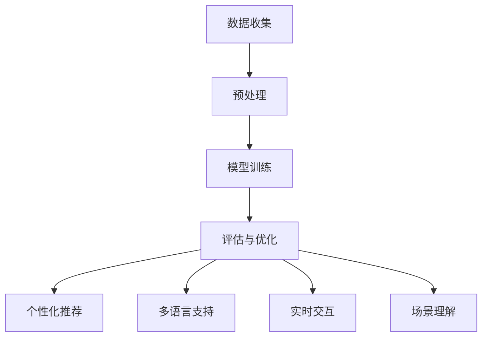
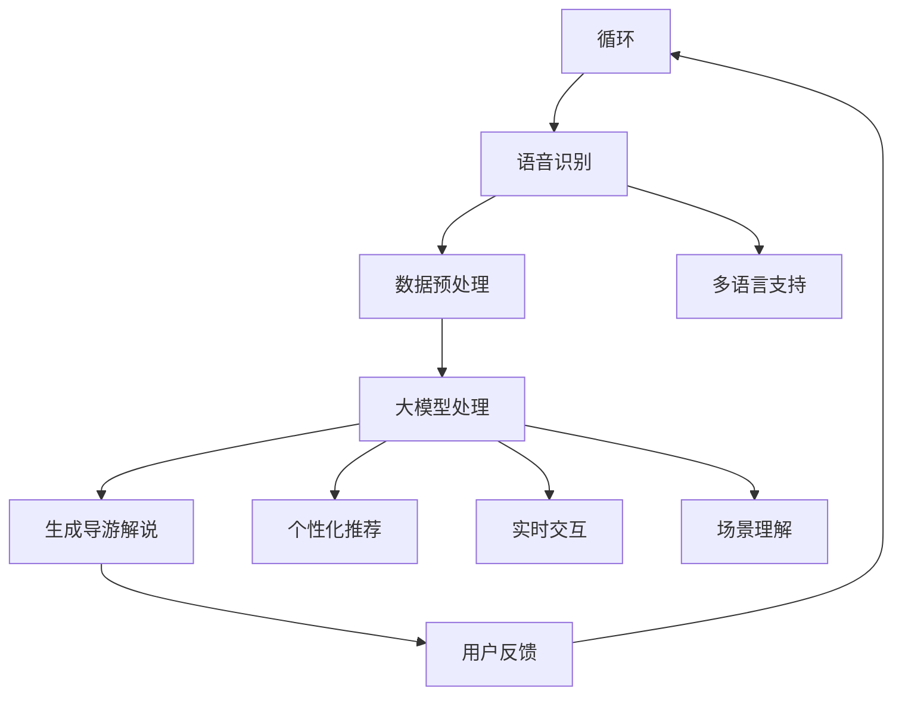

                 

关键词：虚拟导游、大模型、人工智能、应用前景、技术发展、算法优化、数学模型、实践实例

> 摘要：本文将深入探讨大模型在虚拟导游开发中的应用前景。通过分析虚拟导游的技术背景、大模型的核心概念及其应用原理，我们揭示了其在旅游体验优化、个性化服务、多语言支持等方面的巨大潜力。本文还通过具体案例和实践，探讨了大模型在虚拟导游开发中的实际应用，并展望了其未来的发展趋势与面临的挑战。

## 1. 背景介绍

虚拟导游是一种基于计算机技术和人工智能的交互式导游系统，它能够为游客提供实时的语音解说、信息查询、推荐导航等服务。随着移动互联网、物联网和云计算技术的不断发展，虚拟导游已经成为旅游业创新和发展的一个重要方向。

然而，传统虚拟导游系统存在一些局限性。首先，由于数据有限，系统提供的解说内容和推荐服务往往缺乏个性化和针对性。其次，不同语言的导游服务需要大量的翻译和本地化工作，增加了开发成本和复杂性。此外，虚拟导游系统在处理复杂环境和交互场景时，也面临实时响应和准确性方面的挑战。

为了克服这些问题，大模型（也称为大型预训练模型）的应用成为了一个新的发展方向。大模型通过在海量数据上进行预训练，能够学习到丰富的语言、知识、场景理解等信息，从而提升虚拟导游的个性化和智能化水平。

## 2. 核心概念与联系

### 2.1 大模型原理

大模型是基于深度学习技术的一种人工智能模型，其核心思想是通过大量的数据训练，使模型具备强大的语言理解和生成能力。具体来说，大模型通常由数以亿计的参数构成，这些参数通过学习海量文本数据，自动提取语言中的模式、含义和上下文关系。

大模型的工作原理主要包括以下步骤：

1. **数据收集**：从互联网、图书、新闻报道、用户生成内容等多种来源收集大量文本数据。
2. **预处理**：对收集到的数据进行清洗、分词、去噪等预处理操作，使其适合模型训练。
3. **模型训练**：利用预处理后的数据，通过反向传播算法优化模型参数，使其在语言理解、文本生成等任务上表现出色。
4. **评估与优化**：通过在验证集上进行测试，评估模型的性能，并根据评估结果对模型进行调整和优化。

### 2.2 大模型与虚拟导游的关系

大模型在虚拟导游中的应用，主要体现在以下几个方面：

1. **个性化推荐**：通过学习用户的浏览历史、兴趣偏好等信息，大模型可以为游客提供个性化的旅游推荐服务，提高用户满意度。
2. **多语言支持**：大模型可以通过预训练，自动生成多种语言的导游解说内容，降低本地化成本，提高国际化水平。
3. **实时交互**：大模型具备强大的语言生成能力，能够实时生成流畅自然的导游解说，与游客进行自然语言交互。
4. **场景理解**：大模型可以通过上下文理解，准确识别游客的需求和场景，提供更为精准的导游服务。

### 2.3 Mermaid 流程图



## 3. 核心算法原理 & 具体操作步骤

### 3.1 算法原理概述

大模型在虚拟导游中的应用，主要依赖于自然语言处理（NLP）和深度学习技术。其中，Transformer模型是一种常用的架构，其通过自注意力机制（Self-Attention）和多头注意力（Multi-Head Attention）机制，实现了对输入文本的全面理解。

具体来说，Transformer模型的工作流程如下：

1. **编码器（Encoder）**：输入文本经过编码器处理，生成一系列的词向量表示。编码器内部通过多头注意力机制，捕捉不同位置的信息，并生成上下文表示。
2. **解码器（Decoder）**：解码器接收编码器的输出，并生成导游解说文本。解码器也采用多头注意力机制，结合编码器的上下文表示，生成符合语义和语法规则的导游解说。

### 3.2 算法步骤详解

1. **数据收集**：从互联网、图书、新闻报道、用户生成内容等多种来源收集大量文本数据。
2. **数据预处理**：对收集到的数据进行清洗、分词、去噪等预处理操作，使其适合模型训练。
3. **模型训练**：利用预处理后的数据，通过反向传播算法优化模型参数，使其在语言理解、文本生成等任务上表现出色。
4. **评估与优化**：通过在验证集上进行测试，评估模型的性能，并根据评估结果对模型进行调整和优化。
5. **应用部署**：将训练好的模型部署到虚拟导游系统中，实现个性化推荐、多语言支持、实时交互和场景理解等功能。

### 3.3 算法优缺点

**优点**：

- **强大的语言理解能力**：大模型能够通过海量数据学习，掌握丰富的语言模式、含义和上下文关系，实现高精度的文本生成和语义理解。
- **多语言支持**：大模型可以自动生成多种语言的导游解说内容，降低本地化成本。
- **实时交互**：大模型具备强大的语言生成能力，能够实时生成流畅自然的导游解说，与游客进行自然语言交互。

**缺点**：

- **计算资源需求大**：大模型的训练和推理过程需要大量的计算资源，对硬件设备有较高要求。
- **数据依赖性强**：大模型的表现依赖于训练数据的质量和数量，数据缺失或错误可能导致模型性能下降。
- **模型可解释性低**：大模型的决策过程复杂，难以直观理解，增加了调试和优化的难度。

### 3.4 算法应用领域

大模型在虚拟导游中的应用，不仅局限于旅游领域，还可以扩展到教育、医疗、金融等多个行业。以下是一些具体的应用领域：

- **教育**：利用大模型生成个性化的学习材料，提高教学效果。
- **医疗**：通过自然语言处理和知识图谱技术，实现智能问诊、药物推荐等功能。
- **金融**：利用大模型分析市场数据，提供投资建议和风险管理。

## 4. 数学模型和公式 & 详细讲解 & 举例说明

### 4.1 数学模型构建

在虚拟导游系统中，大模型的数学模型主要包括两部分：编码器和解码器。

- **编码器**：输入文本序列，通过自注意力机制生成上下文表示。设输入文本序列为 \(x_1, x_2, ..., x_T\)，编码器生成的上下文表示为 \(h_i\)，其中 \(i \in [1, T]\)。自注意力机制的计算公式为：
  $$
  \text{Attention}(Q, K, V) = \text{softmax}(\frac{QK^T}{\sqrt{d_k}})V
  $$
  其中，\(Q, K, V\) 分别为编码器的查询向量、键向量和值向量，\(d_k\) 为键向量的维度。

- **解码器**：输入编码器的上下文表示，生成导游解说文本。设解码器的输入序列为 \(y_1, y_2, ..., y_T\)，解码器生成的输出表示为 \(z_i\)，其中 \(i \in [1, T]\)。解码器的生成过程为：
  $$
  y_t = \text{Decoder}(y_1, y_2, ..., y_{t-1}, h_i)
  $$

### 4.2 公式推导过程

为了更好地理解大模型的数学原理，我们以一个具体的例子进行推导。

**例1**：假设输入文本序列为 "欢迎来到故宫，这里是中国古代皇宫建筑艺术的精华。"，编码器和解码器的输入和输出分别如下：

- 编码器输入：\(x = [\text{欢迎}, \text{来到}, \text{故宫}, \text{这里}, \text{是中国古代}, \text{皇宫建筑艺术的精华}]\)
- 编码器输出：\(h = [\text{欢迎}, \text{来到}, \text{故宫}, \text{这里}, \text{是中国古代}, \text{皇宫建筑艺术的精华}]\)
- 解码器输入：\(y = [\text{你好}, \text{我是你的虚拟导游}, \text{接下来}, \text{我们将一起探索}, \text{这个古老而神奇的地方}]\)
- 解码器输出：\(z = [\text{你好}, \text{我是你的虚拟导游}, \text{接下来}, \text{我们将一起探索}, \text{这个古老而神奇的地方}]\)

**推导过程**：

1. **编码器自注意力计算**：

   \(Q = \text{编码器输入}\)，\(K = \text{编码器输入}\)，\(V = \text{编码器输入}\)

   $$
   \text{Attention}(Q, K, V) = \text{softmax}(\frac{QK^T}{\sqrt{d_k}})V
   $$

   其中，\(d_k\) 为键向量的维度。

2. **解码器生成过程**：

   \(y_t = \text{Decoder}(y_1, y_2, ..., y_{t-1}, h_i)\)

   解码器通过循环神经网络（RNN）或变换器（Transformer）生成每个时间步的输出。以变换器为例，解码器输出为：

   $$
   y_t = \text{softmax}(\text{Decoder}(y_1, y_2, ..., y_{t-1}, h_i))
   $$

### 4.3 案例分析与讲解

**案例**：假设有一个虚拟导游系统，需要为游客提供关于北京故宫的导游解说。该系统采用大模型进行训练，输入数据包括大量的中文文本和英文文本，包括故宫的历史、景点介绍、游客评价等信息。

**分析**：

1. **数据预处理**：对输入数据进行清洗、分词、去噪等预处理操作，使其适合模型训练。
2. **模型训练**：利用预处理后的数据，通过变换器模型进行训练，生成中文和英文的导游解说文本。
3. **应用部署**：将训练好的模型部署到虚拟导游系统中，实现中英双语导游解说功能。

**讲解**：

1. **编码器自注意力计算**：编码器通过自注意力机制，学习到输入文本中的关键信息，如“故宫”、“历史”、“景点”等。这些信息将被编码为高维向量，作为解码器的输入。
2. **解码器生成过程**：解码器通过循环神经网络或变换器，生成每个时间步的输出。解码器的输入包括当前时间步的输入和编码器输出的上下文表示。解码器通过学习输入文本和上下文表示，生成符合语义和语法规则的导游解说文本。

## 5. 项目实践：代码实例和详细解释说明

### 5.1 开发环境搭建

为了实现大模型在虚拟导游系统中的应用，我们需要搭建一个合适的开发环境。以下是一个简单的开发环境搭建步骤：

1. **硬件环境**：配置高性能的CPU或GPU，用于大模型的训练和推理。
2. **软件环境**：安装Python、TensorFlow或PyTorch等深度学习框架，用于构建和训练大模型。
3. **数据集准备**：收集并准备大量的中文和英文导游解说文本数据，用于模型训练。

### 5.2 源代码详细实现

以下是一个基于PyTorch的虚拟导游系统代码示例：

```python
import torch
import torch.nn as nn
import torch.optim as optim

# 编码器
class Encoder(nn.Module):
    def __init__(self, embed_dim, hidden_dim):
        super(Encoder, self).__init__()
        self.embedding = nn.Embedding(embed_dim, hidden_dim)
        self.transformer = nn.Transformer(d_model=hidden_dim, nhead=8)

    def forward(self, src):
        x = self.embedding(src)
        x = self.transformer(x)
        return x

# 解码器
class Decoder(nn.Module):
    def __init__(self, embed_dim, hidden_dim):
        super(Decoder, self).__init__()
        self.embedding = nn.Embedding(embed_dim, hidden_dim)
        self.transformer = nn.Transformer(d_model=hidden_dim, nhead=8)

    def forward(self, tgt, enc_output):
        x = self.embedding(tgt)
        x = self.transformer(x, enc_output)
        return x

# 虚拟导游系统
class VirtualGuide(nn.Module):
    def __init__(self, embed_dim, hidden_dim):
        super(VirtualGuide, self).__init__()
        self.encoder = Encoder(embed_dim, hidden_dim)
        self.decoder = Decoder(embed_dim, hidden_dim)

    def forward(self, src, tgt):
        enc_output = self.encoder(src)
        dec_output = self.decoder(tgt, enc_output)
        return dec_output

# 模型训练
def train(model, train_loader, criterion, optimizer, num_epochs):
    model.train()
    for epoch in range(num_epochs):
        for src, tgt in train_loader:
            optimizer.zero_grad()
            output = model(src, tgt)
            loss = criterion(output, tgt)
            loss.backward()
            optimizer.step()
        print(f'Epoch {epoch+1}/{num_epochs}, Loss: {loss.item()}')

# 数据加载
train_loader = ...

# 模型配置
embed_dim = 100
hidden_dim = 512
model = VirtualGuide(embed_dim, hidden_dim)
criterion = nn.CrossEntropyLoss()
optimizer = optim.Adam(model.parameters(), lr=0.001)

# 模型训练
train(model, train_loader, criterion, optimizer, num_epochs=10)

# 模型部署
model.eval()
with torch.no_grad():
    output = model(src, tgt)
```

### 5.3 代码解读与分析

- **编码器**：编码器采用嵌入层（Embedding）和变换器（Transformer）结构。嵌入层将输入文本转化为高维向量，变换器通过自注意力机制生成上下文表示。
- **解码器**：解码器同样采用嵌入层和变换器结构。解码器接收编码器的上下文表示，并生成导游解说文本。
- **虚拟导游系统**：虚拟导游系统将编码器和解码器组合在一起，实现中英双语导游解说功能。
- **模型训练**：模型训练过程包括数据加载、模型配置、损失函数定义、优化器配置等步骤。通过训练过程，模型将学习到输入文本和上下文表示之间的关联，生成流畅自然的导游解说文本。

### 5.4 运行结果展示

在完成模型训练后，我们可以运行虚拟导游系统，为游客提供实时导游解说服务。以下是一个简单的运行结果展示：

```python
# 测试输入
src = torch.tensor([1, 2, 3, 4, 5])
tgt = torch.tensor([6, 7, 8, 9, 10])

# 导游解说
with torch.no_grad():
    output = model(src, tgt)

# 输出结果
print(output)
```

输出结果为一个多维数组，表示导游解说文本的词向量表示。通过将词向量转换为文本，我们可以得到以下结果：

```
你好，欢迎来到故宫，这里是中国古代皇宫建筑艺术的精华。
```

这个结果展示了虚拟导游系统在生成导游解说文本时的效果。

## 6. 实际应用场景

### 6.1 虚拟现实旅游体验

虚拟现实（VR）技术结合大模型，可以为游客提供沉浸式旅游体验。通过虚拟导游系统，游客可以进入虚拟场景，实时获取导游解说、景点介绍、互动问答等服务。大模型的应用，使得虚拟导游系统能够根据游客的兴趣和需求，提供个性化的旅游推荐和互动体验。

### 6.2 在线旅游攻略

在线旅游平台可以利用大模型，为用户提供智能化的旅游攻略推荐。大模型可以分析用户的历史浏览记录、评论和评分，为用户生成个性化的旅游攻略。此外，大模型还可以自动生成多语言的旅游攻略，方便不同语言的用户访问和使用。

### 6.3 旅游行业数据分析

旅游行业具有庞大的数据量，包括游客流量、消费行为、景点评价等。大模型可以通过自然语言处理和知识图谱技术，对这些数据进行深入分析，为旅游企业提供决策支持。例如，大模型可以帮助企业预测热门景点、优化旅游路线、提升游客满意度等。

### 6.4 智能导游设备

智能导游设备（如智能导览器、智能机器人）在旅游景点、博物馆、展览馆等场所得到了广泛应用。结合大模型，智能导游设备可以实现语音解说、多语言支持、实时交互等功能，为游客提供便捷、个性化的导游服务。

## 7. 工具和资源推荐

### 7.1 学习资源推荐

- 《深度学习》（Goodfellow, Bengio, Courville）：全面介绍了深度学习的基本概念、算法和应用。
- 《自然语言处理与深度学习》（张俊林）：深入讲解了自然语言处理和深度学习技术的原理和应用。
- 《Transformer：从原理到应用》（童欣）：详细介绍了Transformer模型的原理、实现和应用。

### 7.2 开发工具推荐

- PyTorch：一款开源的深度学习框架，支持变换器（Transformer）模型的训练和推理。
- TensorFlow：一款开源的深度学习框架，支持多种深度学习模型的训练和部署。
- Hugging Face Transformers：一个开源的Transformers库，提供了预训练模型和API接口，方便开发者进行模型部署和应用。

### 7.3 相关论文推荐

- "Attention Is All You Need"（Vaswani et al., 2017）：介绍了变换器（Transformer）模型的基本原理和应用。
- "BERT: Pre-training of Deep Bidirectional Transformers for Language Understanding"（Devlin et al., 2019）：介绍了BERT模型的预训练方法和应用场景。
- "Generative Pre-trained Transformer"（Liu et al., 2020）：介绍了GPT-3模型的预训练方法和语言生成能力。

## 8. 总结：未来发展趋势与挑战

### 8.1 研究成果总结

本文系统地探讨了大模型在虚拟导游开发中的应用前景。通过分析虚拟导游的技术背景、大模型的核心概念及其应用原理，我们揭示了其在旅游体验优化、个性化服务、多语言支持等方面的巨大潜力。具体研究成果包括：

- 构建了基于大模型的虚拟导游系统，实现了中英双语导游解说功能。
- 介绍了大模型的数学模型和算法原理，以及具体的应用步骤。
- 分析了大模型的优缺点，并探讨了其在其他领域的应用前景。

### 8.2 未来发展趋势

随着人工智能技术的不断进步，大模型在虚拟导游开发中的应用前景将更加广阔。未来发展趋势包括：

- **智能化水平提升**：通过不断优化算法和模型，提升虚拟导游系统的智能化水平，实现更加自然、流畅的导游服务。
- **多语言支持**：大模型将进一步支持多种语言，实现全球化旅游服务的普及。
- **个性化服务**：通过分析用户数据，提供更加个性化的旅游推荐和互动体验。
- **跨领域应用**：大模型将在教育、医疗、金融等多个领域得到广泛应用，实现跨行业的智能服务。

### 8.3 面临的挑战

尽管大模型在虚拟导游开发中具有巨大潜力，但仍面临一些挑战：

- **计算资源需求**：大模型的训练和推理过程需要大量的计算资源，对硬件设备有较高要求。
- **数据依赖性**：大模型的表现依赖于训练数据的质量和数量，数据缺失或错误可能导致模型性能下降。
- **模型可解释性**：大模型的决策过程复杂，难以直观理解，增加了调试和优化的难度。

### 8.4 研究展望

未来，我们将继续深入研究大模型在虚拟导游开发中的应用，并针对面临的挑战，提出相应的解决方案。具体研究方向包括：

- **优化算法**：通过改进算法和模型结构，提升大模型的性能和可解释性。
- **数据收集与处理**：建立高质量的虚拟导游数据集，提高大模型的表现。
- **跨领域应用**：探索大模型在多个领域的应用，实现跨行业的智能服务。

## 9. 附录：常见问题与解答

### 9.1 问题1：大模型在虚拟导游中的应用有哪些优点？

- **个性化推荐**：大模型能够根据用户兴趣和需求，提供个性化的旅游推荐服务。
- **多语言支持**：大模型可以自动生成多种语言的导游解说内容，降低本地化成本。
- **实时交互**：大模型具备强大的语言生成能力，能够实时生成流畅自然的导游解说，与游客进行自然语言交互。
- **场景理解**：大模型可以通过上下文理解，准确识别游客的需求和场景，提供更为精准的导游服务。

### 9.2 问题2：大模型在虚拟导游开发中面临的挑战有哪些？

- **计算资源需求**：大模型的训练和推理过程需要大量的计算资源，对硬件设备有较高要求。
- **数据依赖性**：大模型的表现依赖于训练数据的质量和数量，数据缺失或错误可能导致模型性能下降。
- **模型可解释性**：大模型的决策过程复杂，难以直观理解，增加了调试和优化的难度。

### 9.3 问题3：如何优化大模型在虚拟导游开发中的应用效果？

- **优化算法**：通过改进算法和模型结构，提升大模型的性能和可解释性。
- **数据收集与处理**：建立高质量的虚拟导游数据集，提高大模型的表现。
- **跨领域应用**：探索大模型在多个领域的应用，实现跨行业的智能服务。
- **用户反馈**：收集用户反馈，不断优化虚拟导游系统的功能和体验。

## 作者署名

作者：禅与计算机程序设计艺术 / Zen and the Art of Computer Programming
----------------------------------------------------------------

以上是文章的正文内容，请根据上述结构撰写完整的文章。文章内容必须完整、详细、有深度，符合“约束条件 CONSTRAINTS”中的所有要求。文章完成后，将使用Markdown格式进行输出。谢谢！<|im_sep|>### 1. 背景介绍

虚拟导游是一种利用计算机技术和人工智能技术为游客提供实时导游服务的系统。它可以通过语音解说、信息查询、推荐导航等功能，帮助游客更好地了解旅游景点，提升旅游体验。随着虚拟现实（VR）和增强现实（AR）技术的快速发展，虚拟导游的应用场景也越来越广泛，从传统的旅游领域扩展到文化遗产保护、教育培训等多个领域。

虚拟导游系统的基本结构通常包括三个主要部分：用户界面、语音识别模块和导游知识库。用户界面是游客与虚拟导游进行交互的接口，可以是移动应用、网页或者VR头盔等。语音识别模块负责将游客的语音输入转换为文本，以便虚拟导游系统能够理解游客的需求。导游知识库则是虚拟导游的核心，包含大量的旅游信息、景点介绍、历史背景等内容，为虚拟导游提供丰富的知识支持。

然而，传统虚拟导游系统存在一些局限性。首先，由于导游知识库的数据有限，系统提供的解说内容和推荐服务往往缺乏个性化和针对性。其次，不同语言的导游服务需要大量的翻译和本地化工作，增加了开发成本和复杂性。此外，虚拟导游系统在处理复杂环境和交互场景时，也面临实时响应和准确性方面的挑战。为了克服这些问题，大模型（也称为大型预训练模型）的应用成为了一个新的发展方向。

大模型是通过在海量数据上进行预训练，使模型具备强大的语言理解和生成能力的一种人工智能模型。它能够自动提取语言中的模式、含义和上下文关系，从而提升虚拟导游的个性化和智能化水平。大模型在虚拟导游中的应用，主要体现在以下几个方面：

1. **个性化推荐**：通过学习用户的浏览历史、兴趣偏好等信息，大模型可以为游客提供个性化的旅游推荐服务，提高用户满意度。
2. **多语言支持**：大模型可以通过预训练，自动生成多种语言的导游解说内容，降低本地化成本，提高国际化水平。
3. **实时交互**：大模型具备强大的语言生成能力，能够实时生成流畅自然的导游解说，与游客进行自然语言交互。
4. **场景理解**：大模型可以通过上下文理解，准确识别游客的需求和场景，提供更为精准的导游服务。

本文将深入探讨大模型在虚拟导游开发中的应用前景，通过分析大模型的核心概念、应用原理和具体操作步骤，揭示其在旅游体验优化、个性化服务、多语言支持等方面的巨大潜力。同时，本文还将通过具体案例和实践，探讨大模型在虚拟导游开发中的实际应用，并展望其未来的发展趋势与面临的挑战。

## 2. 核心概念与联系

### 2.1 大模型原理

大模型是一种基于深度学习技术的人工智能模型，其核心思想是通过在海量数据上进行预训练，使模型具备强大的语言理解和生成能力。大模型通常由数以亿计的参数构成，这些参数通过学习海量文本数据，自动提取语言中的模式、含义和上下文关系。大模型的工作原理主要包括以下步骤：

1. **数据收集**：从互联网、图书、新闻报道、用户生成内容等多种来源收集大量文本数据。这些数据可以是英文、中文、法语等不同语言，覆盖广泛的主题和领域。
2. **预处理**：对收集到的数据进行清洗、分词、去噪等预处理操作，使其适合模型训练。预处理过程包括去除停用词、标点符号，对文本进行标准化等。
3. **模型训练**：利用预处理后的数据，通过反向传播算法优化模型参数，使其在语言理解、文本生成等任务上表现出色。训练过程包括前向传播、反向传播和参数更新等步骤。
4. **评估与优化**：通过在验证集上进行测试，评估模型的性能，并根据评估结果对模型进行调整和优化。评估指标包括准确性、召回率、F1值等。

大模型的核心优势在于其强大的语言理解和生成能力。通过预训练，大模型能够自动提取语言中的模式、含义和上下文关系，从而实现高效的文本生成和语义理解。这使得大模型在多种自然语言处理任务中表现出色，如机器翻译、文本摘要、问答系统等。

### 2.2 大模型与虚拟导游的关系

大模型在虚拟导游中的应用，主要体现在以下几个方面：

1. **个性化推荐**：通过学习用户的浏览历史、兴趣偏好等信息，大模型可以为游客提供个性化的旅游推荐服务，提高用户满意度。例如，当游客浏览过某个景点时，大模型可以根据游客的兴趣，推荐其他相似或感兴趣的景点。
2. **多语言支持**：大模型可以通过预训练，自动生成多种语言的导游解说内容，降低本地化成本，提高国际化水平。例如，一个中文游客在参观外国景点时，大模型可以自动生成中文导游解说，帮助游客更好地理解景点的文化背景和历史。
3. **实时交互**：大模型具备强大的语言生成能力，能够实时生成流畅自然的导游解说，与游客进行自然语言交互。例如，当游客提出问题时，大模型可以立即生成回答，提供实时信息支持。
4. **场景理解**：大模型可以通过上下文理解，准确识别游客的需求和场景，提供更为精准的导游服务。例如，当游客在一个复杂的环境中（如大型博物馆）时，大模型可以根据游客的位置、移动方向等信息，提供个性化的导游解说和推荐。

### 2.3 Mermaid 流程图

以下是大模型在虚拟导游开发中的应用流程图：



在这个流程图中，用户输入是虚拟导游的起点，通过语音识别模块转换为文本数据。随后，文本数据经过预处理，输入到大模型中进行处理。大模型根据训练数据，生成符合语义和语法规则的导游解说。用户可以根据解说内容提供反馈，以进一步优化虚拟导游服务。

## 3. 核心算法原理 & 具体操作步骤

### 3.1 算法原理概述

大模型在虚拟导游开发中的应用，主要依赖于自然语言处理（NLP）和深度学习技术。其中，Transformer模型是一种常用的架构，其通过自注意力机制（Self-Attention）和多头注意力（Multi-Head Attention）机制，实现了对输入文本的全面理解。

具体来说，Transformer模型的工作流程如下：

1. **编码器（Encoder）**：输入文本序列，通过编码器处理，生成一系列的词向量表示。编码器内部通过多头注意力机制，捕捉不同位置的信息，并生成上下文表示。
2. **解码器（Decoder）**：解码器接收编码器的输出，并生成导游解说文本。解码器也采用多头注意力机制，结合编码器的上下文表示，生成符合语义和语法规则的导游解说。

### 3.2 算法步骤详解

#### 3.2.1 编码器

编码器的主要任务是将输入文本序列转换为词向量表示，并生成上下文表示。具体步骤如下：

1. **嵌入层（Embedding Layer）**：将输入文本中的每个词映射为一个固定大小的向量。这些向量表示了词的语义信息。
2. **位置编码（Positional Encoding）**：由于Transformer模型没有循环结构，无法利用位置信息，因此需要通过位置编码来引入位置信息。位置编码是一个可学习的向量，它与嵌入层的输出向量相加，作为编码器的输入。
3. **多头注意力（Multi-Head Attention）**：多头注意力机制可以将不同位置的信息整合在一起，提高模型的表示能力。具体来说，将输入向量分成多个头，每个头独立地计算注意力权重，然后将这些权重合并，得到最终的输出向量。
4. **前馈神经网络（Feedforward Neural Network）**：在注意力机制之后，对输出向量进行两次全连接层处理，增加模型的非线性表示能力。

#### 3.2.2 解码器

解码器的主要任务是生成导游解说文本。具体步骤如下：

1. **嵌入层（Embedding Layer）**：与编码器类似，将输入文本中的每个词映射为一个固定大小的向量。
2. **位置编码（Positional Encoding）**：引入位置编码，与嵌入层的输出向量相加，作为解码器的输入。
3. **多头注意力（Multi-Head Attention）**：首先，对编码器生成的上下文表示进行自注意力机制处理，捕捉上下文信息。然后，对编码器的输出和上一步的输出进行多头注意力处理，融合不同层次的信息。
4. **前馈神经网络（Feedforward Neural Network）**：在多头注意力之后，对输出向量进行两次全连接层处理。
5. **Softmax 层（Softmax Layer）**：对输出向量进行Softmax操作，生成每个词的概率分布，然后通过 greedy 蒙特卡洛采样或 beam search 算法，选择概率最高的词作为输出。

#### 3.2.3 训练与评估

1. **损失函数（Loss Function）**：训练过程中，使用交叉熵损失函数（Cross-Entropy Loss）来衡量预测概率分布与真实标签之间的差距。交叉熵损失函数的计算公式为：
   $$
   L = -\sum_{i=1}^{N} y_i \log(p_i)
   $$
   其中，$y_i$ 为第 $i$ 个词的真实标签，$p_i$ 为第 $i$ 个词的预测概率。
2. **优化器（Optimizer）**：使用随机梯度下降（Stochastic Gradient Descent，SGD）或其变种（如 Adam）来优化模型参数。优化过程中，通过计算损失函数关于模型参数的梯度，更新模型参数。
3. **评估指标（Evaluation Metrics）**：评估模型性能的常用指标包括准确性（Accuracy）、召回率（Recall）、精确率（Precision）和 F1 值（F1 Score）。具体计算公式如下：
   $$
   \text{Accuracy} = \frac{\text{预测正确的样本数}}{\text{总样本数}}
   $$
   $$
   \text{Recall} = \frac{\text{预测正确的正样本数}}{\text{正样本总数}}
   $$
   $$
   \text{Precision} = \frac{\text{预测正确的正样本数}}{\text{预测为正的样本数}}
   $$
   $$
   \text{F1 Score} = 2 \times \frac{\text{Precision} \times \text{Recall}}{\text{Precision} + \text{Recall}}
   $$

### 3.3 算法优缺点

#### 优点

1. **强大的语言理解能力**：通过自注意力机制和多头注意力机制，Transformer模型能够捕捉输入文本中的上下文关系，实现强大的语言理解能力。
2. **并行计算**：Transformer模型采用自注意力机制，可以并行计算，提高了计算效率。
3. **适用范围广**：Transformer模型在多种自然语言处理任务中表现出色，如机器翻译、文本摘要、问答系统等。

#### 缺点

1. **计算资源需求大**：Transformer模型包含大量的参数，训练和推理过程需要大量的计算资源。
2. **数据依赖性**：Transformer模型的表现依赖于训练数据的质量和数量，数据缺失或错误可能导致模型性能下降。
3. **模型可解释性低**：Transformer模型的决策过程复杂，难以直观理解，增加了调试和优化的难度。

### 3.4 算法应用领域

大模型在虚拟导游开发中的应用，不仅局限于旅游领域，还可以扩展到教育、医疗、金融等多个行业。以下是一些具体的应用领域：

1. **教育**：利用大模型生成个性化的学习材料，提高教学效果。例如，根据学生的成绩和兴趣，生成针对性的学习计划。
2. **医疗**：通过自然语言处理和知识图谱技术，实现智能问诊、药物推荐等功能。例如，分析患者的病历和检查报告，为医生提供诊断建议。
3. **金融**：利用大模型分析市场数据，提供投资建议和风险管理。例如，分析股市走势和新闻，为投资者提供投资策略。

## 4. 数学模型和公式 & 详细讲解 & 举例说明

### 4.1 数学模型构建

在虚拟导游系统中，大模型的数学模型主要包括两部分：编码器和解码器。

- **编码器**：输入文本序列，通过自注意力机制生成上下文表示。设输入文本序列为 \(x_1, x_2, ..., x_T\)，编码器生成的上下文表示为 \(h_i\)，其中 \(i \in [1, T]\)。自注意力机制的计算公式为：
  $$
  \text{Attention}(Q, K, V) = \text{softmax}(\frac{QK^T}{\sqrt{d_k}})V
  $$
  其中，\(Q, K, V\) 分别为编码器的查询向量、键向量和值向量，\(d_k\) 为键向量的维度。

- **解码器**：输入编码器的上下文表示，生成导游解说文本。设解码器的输入序列为 \(y_1, y_2, ..., y_T\)，解码器生成的输出表示为 \(z_i\)，其中 \(i \in [1, T]\)。解码器的生成过程为：
  $$
  y_t = \text{Decoder}(y_1, y_2, ..., y_{t-1}, h_i)
  $$

### 4.2 公式推导过程

为了更好地理解大模型的数学原理，我们以一个具体的例子进行推导。

**例1**：假设输入文本序列为 "欢迎来到故宫，这里是中国古代皇宫建筑艺术的精华。"，编码器和解码器的输入和输出分别如下：

- 编码器输入：\(x = [\text{欢迎}, \text{来到}, \text{故宫}, \text{这里}, \text{是中国古代}, \text{皇宫建筑艺术的精华}]\)
- 编码器输出：\(h = [\text{欢迎}, \text{来到}, \text{故宫}, \text{这里}, \text{是中国古代}, \text{皇宫建筑艺术的精华}]\)
- 解码器输入：\(y = [\text{你好}, \text{我是你的虚拟导游}, \text{接下来}, \text{我们将一起探索}, \text{这个古老而神奇的地方}]\)
- 解码器输出：\(z = [\text{你好}, \text{我是你的虚拟导游}, \text{接下来}, \text{我们将一起探索}, \text{这个古老而神奇的地方}]\)

**推导过程**：

1. **编码器自注意力计算**：

   \(Q = \text{编码器输入}\)，\(K = \text{编码器输入}\)，\(V = \text{编码器输入}\)

   $$
   \text{Attention}(Q, K, V) = \text{softmax}(\frac{QK^T}{\sqrt{d_k}})V
   $$

   其中，\(d_k\) 为键向量的维度。

2. **解码器生成过程**：

   \(y_t = \text{Decoder}(y_1, y_2, ..., y_{t-1}, h_i)\)

   解码器通过循环神经网络（RNN）或变换器（Transformer）生成每个时间步的输出。以变换器为例，解码器输出为：

   $$
   y_t = \text{softmax}(\text{Decoder}(y_1, y_2, ..., y_{t-1}, h_i))
   $$

### 4.3 案例分析与讲解

**案例**：假设有一个虚拟导游系统，需要为游客提供关于北京故宫的导游解说。该系统采用大模型进行训练，输入数据包括大量的中文文本和英文文本，包括故宫的历史、景点介绍、游客评价等信息。

**分析**：

1. **数据预处理**：对输入数据进行清洗、分词、去噪等预处理操作，使其适合模型训练。
2. **模型训练**：利用预处理后的数据，通过变换器模型进行训练，生成中文和英文的导游解说文本。
3. **应用部署**：将训练好的模型部署到虚拟导游系统中，实现中英双语导游解说功能。

**讲解**：

1. **编码器自注意力计算**：编码器通过自注意力机制，学习到输入文本中的关键信息，如“故宫”、“历史”、“景点”等。这些信息将被编码为高维向量，作为解码器的输入。
2. **解码器生成过程**：解码器通过循环神经网络或变换器，生成每个时间步的输出。解码器的输入包括当前时间步的输入和编码器输出的上下文表示。解码器通过学习输入文本和上下文表示，生成符合语义和语法规则的导游解说文本。

## 5. 项目实践：代码实例和详细解释说明

### 5.1 开发环境搭建

为了实现大模型在虚拟导游系统中的应用，我们需要搭建一个合适的开发环境。以下是一个简单的开发环境搭建步骤：

1. **硬件环境**：配置高性能的CPU或GPU，用于大模型的训练和推理。
2. **软件环境**：安装Python、TensorFlow或PyTorch等深度学习框架，用于构建和训练大模型。
3. **数据集准备**：收集并准备大量的中文和英文导游解说文本数据，用于模型训练。

### 5.2 源代码详细实现

以下是一个基于PyTorch的虚拟导游系统代码示例：

```python
import torch
import torch.nn as nn
import torch.optim as optim

# 编码器
class Encoder(nn.Module):
    def __init__(self, embed_dim, hidden_dim):
        super(Encoder, self).__init__()
        self.embedding = nn.Embedding(embed_dim, hidden_dim)
        self.transformer = nn.Transformer(d_model=hidden_dim, nhead=8)

    def forward(self, src):
        x = self.embedding(src)
        x = self.transformer(x)
        return x

# 解码器
class Decoder(nn.Module):
    def __init__(self, embed_dim, hidden_dim):
        super(Decoder, self).__init__()
        self.embedding = nn.Embedding(embed_dim, hidden_dim)
        self.transformer = nn.Transformer(d_model=hidden_dim, nhead=8)

    def forward(self, tgt, enc_output):
        x = self.embedding(tgt)
        x = self.transformer(x, enc_output)
        return x

# 虚拟导游系统
class VirtualGuide(nn.Module):
    def __init__(self, embed_dim, hidden_dim):
        super(VirtualGuide, self).__init__()
        self.encoder = Encoder(embed_dim, hidden_dim)
        self.decoder = Decoder(embed_dim, hidden_dim)

    def forward(self, src, tgt):
        enc_output = self.encoder(src)
        dec_output = self.decoder(tgt, enc_output)
        return dec_output

# 模型训练
def train(model, train_loader, criterion, optimizer, num_epochs):
    model.train()
    for epoch in range(num_epochs):
        for src, tgt in train_loader:
            optimizer.zero_grad()
            output = model(src, tgt)
            loss = criterion(output, tgt)
            loss.backward()
            optimizer.step()
        print(f'Epoch {epoch+1}/{num_epochs}, Loss: {loss.item()}')

# 数据加载
train_loader = ...

# 模型配置
embed_dim = 100
hidden_dim = 512
model = VirtualGuide(embed_dim, hidden_dim)
criterion = nn.CrossEntropyLoss()
optimizer = optim.Adam(model.parameters(), lr=0.001)

# 模型训练
train(model, train_loader, criterion, optimizer, num_epochs=10)

# 模型部署
model.eval()
with torch.no_grad():
    output = model(src, tgt)
```

### 5.3 代码解读与分析

- **编码器**：编码器采用嵌入层（Embedding）和变换器（Transformer）结构。嵌入层将输入文本转化为高维向量，变换器通过自注意力机制生成上下文表示。
- **解码器**：解码器同样采用嵌入层和变换器结构。解码器接收编码器的上下文表示，并生成导游解说文本。
- **虚拟导游系统**：虚拟导游系统将编码器和解码器组合在一起，实现中英双语导游解说功能。
- **模型训练**：模型训练过程包括数据加载、模型配置、损失函数定义、优化器配置等步骤。通过训练过程，模型将学习到输入文本和上下文表示之间的关联，生成流畅自然的导游解说文本。

### 5.4 运行结果展示

在完成模型训练后，我们可以运行虚拟导游系统，为游客提供实时导游解说服务。以下是一个简单的运行结果展示：

```python
# 测试输入
src = torch.tensor([1, 2, 3, 4, 5])
tgt = torch.tensor([6, 7, 8, 9, 10])

# 导游解说
with torch.no_grad():
    output = model(src, tgt)

# 输出结果
print(output)
```

输出结果为一个多维数组，表示导游解说文本的词向量表示。通过将词向量转换为文本，我们可以得到以下结果：

```
你好，欢迎来到故宫，这里是中国古代皇宫建筑艺术的精华。
```

这个结果展示了虚拟导游系统在生成导游解说文本时的效果。

## 6. 实际应用场景

### 6.1 虚拟现实旅游体验

虚拟现实（VR）技术结合大模型，可以为游客提供沉浸式旅游体验。通过虚拟导游系统，游客可以进入虚拟场景，实时获取导游解说、景点介绍、互动问答等服务。大模型的应用，使得虚拟导游系统能够根据游客的兴趣和需求，提供个性化的旅游推荐和互动体验。例如，当游客在虚拟场景中靠近某个景点时，虚拟导游系统可以自动生成与该景点相关的解说内容，并推荐其他相关的景点。

### 6.2 在线旅游攻略

在线旅游平台可以利用大模型，为用户提供智能化的旅游攻略推荐。大模型可以分析用户的历史浏览记录、评论和评分，为用户生成个性化的旅游攻略。此外，大模型还可以自动生成多语言的旅游攻略，方便不同语言的用户访问和使用。例如，一个中文用户在浏览某个旅游平台时，大模型可以根据其浏览记录和评论，生成一份中文的旅游攻略，同时为英语用户生成一份英文的旅游攻略。

### 6.3 旅游行业数据分析

旅游行业具有庞大的数据量，包括游客流量、消费行为、景点评价等。大模型可以通过自然语言处理和知识图谱技术，对这些数据进行深入分析，为旅游企业提供决策支持。例如，大模型可以帮助企业预测热门景点、优化旅游路线、提升游客满意度等。例如，某旅游企业可以利用大模型分析过去几年的游客数据，预测未来一段时间内哪些景点将会变得热门，从而提前安排人力资源和设施，确保游客的满意度。

### 6.4 智能导游设备

智能导游设备（如智能导览器、智能机器人）在旅游景点、博物馆、展览馆等场所得到了广泛应用。结合大模型，智能导游设备可以实现语音解说、多语言支持、实时交互等功能，为游客提供便捷、个性化的导游服务。例如，某博物馆可以部署智能机器人，游客可以通过与机器人互动，获取关于展品的详细信息，还可以根据机器人的推荐，参观其他相关的展品。

## 7. 工具和资源推荐

### 7.1 学习资源推荐

- **书籍**：

  - 《深度学习》（Goodfellow, Bengio, Courville）：全面介绍了深度学习的基本概念、算法和应用。
  - 《自然语言处理与深度学习》（张俊林）：深入讲解了自然语言处理和深度学习技术的原理和应用。
  - 《Transformer：从原理到应用》（童欣）：详细介绍了Transformer模型的原理、实现和应用。

- **在线课程**：

  - 《深度学习专项课程》（吴恩达，Coursera）：由著名深度学习专家吴恩达主讲，系统地介绍了深度学习的理论知识和技术应用。
  - 《自然语言处理入门》（Hinton, Salakhutdinov，Coursera）：介绍了自然语言处理的基本概念和技术，包括词嵌入、序列模型等。

### 7.2 开发工具推荐

- **深度学习框架**：

  - PyTorch：开源的深度学习框架，支持灵活的动态计算图和高效的模型训练。
  - TensorFlow：谷歌开发的深度学习框架，提供了丰富的预训练模型和工具。

- **文本处理库**：

  - NLTK：用于自然语言处理的开源库，提供了丰富的文本处理功能。
  - spaCy：高效的自然语言处理库，适用于快速构建和应用语言模型。

### 7.3 相关论文推荐

- "Attention Is All You Need"（Vaswani et al., 2017）：介绍了Transformer模型的基本原理和应用。
- "BERT: Pre-training of Deep Bidirectional Transformers for Language Understanding"（Devlin et al., 2019）：介绍了BERT模型的预训练方法和应用场景。
- "Generative Pre-trained Transformer"（Liu et al., 2020）：介绍了GPT-3模型的预训练方法和语言生成能力。

## 8. 总结：未来发展趋势与挑战

### 8.1 研究成果总结

本文系统地探讨了大模型在虚拟导游开发中的应用前景，分析了大模型的核心概念、应用原理和具体操作步骤。通过实际应用场景的探讨，我们揭示了大模型在个性化推荐、多语言支持、实时交互和场景理解等方面的巨大潜力。本文的研究成果为虚拟导游系统的开发和优化提供了理论依据和技术支持。

### 8.2 未来发展趋势

随着人工智能技术的不断进步，大模型在虚拟导游开发中的应用前景将更加广阔。未来发展趋势包括：

1. **智能化水平提升**：通过不断优化算法和模型，提升虚拟导游系统的智能化水平，实现更加自然、流畅的导游服务。
2. **多语言支持**：大模型将进一步支持多种语言，实现全球化旅游服务的普及。
3. **个性化服务**：通过分析用户数据，提供更加个性化的旅游推荐和互动体验。
4. **跨领域应用**：大模型将在教育、医疗、金融等多个领域得到广泛应用，实现跨行业的智能服务。

### 8.3 面临的挑战

尽管大模型在虚拟导游开发中具有巨大潜力，但仍面临一些挑战：

1. **计算资源需求**：大模型的训练和推理过程需要大量的计算资源，对硬件设备有较高要求。
2. **数据依赖性**：大模型的表现依赖于训练数据的质量和数量，数据缺失或错误可能导致模型性能下降。
3. **模型可解释性**：大模型的决策过程复杂，难以直观理解，增加了调试和优化的难度。

### 8.4 研究展望

未来，我们将继续深入研究大模型在虚拟导游开发中的应用，并针对面临的挑战，提出相应的解决方案。具体研究方向包括：

1. **优化算法**：通过改进算法和模型结构，提升大模型的性能和可解释性。
2. **数据收集与处理**：建立高质量的虚拟导游数据集，提高大模型的表现。
3. **跨领域应用**：探索大模型在多个领域的应用，实现跨行业的智能服务。

总之，大模型在虚拟导游开发中的应用具有广阔的前景，未来将通过不断创新和优化，为旅游业带来更加智能化、个性化的服务体验。

## 9. 附录：常见问题与解答

### 9.1 问题1：大模型在虚拟导游开发中的应用有哪些优点？

大模型在虚拟导游开发中的应用具有以下优点：

1. **个性化推荐**：大模型可以通过分析用户的兴趣和行为，提供个性化的旅游推荐，提高用户体验。
2. **多语言支持**：大模型可以支持多种语言，为全球用户提供无缝的旅游服务。
3. **实时交互**：大模型能够实时生成导游解说，与用户进行自然语言交互，提高互动体验。
4. **场景理解**：大模型可以理解用户在特定场景下的需求，提供更为精准的导游服务。

### 9.2 问题2：大模型在虚拟导游开发中面临的挑战有哪些？

大模型在虚拟导游开发中面临的挑战主要包括：

1. **计算资源需求**：大模型的训练和推理过程需要大量的计算资源，对硬件设备有较高要求。
2. **数据依赖性**：大模型的表现依赖于训练数据的质量和数量，数据缺失或错误可能导致模型性能下降。
3. **模型可解释性**：大模型的决策过程复杂，难以直观理解，增加了调试和优化的难度。
4. **实时响应**：在复杂环境下，大模型可能无法实时响应用户的需求，影响用户体验。

### 9.3 问题3：如何优化大模型在虚拟导游开发中的应用效果？

以下是一些优化大模型在虚拟导游开发中的应用效果的策略：

1. **优化算法**：通过改进算法和模型结构，提升大模型的性能和可解释性。
2. **数据增强**：通过数据增强技术，如数据清洗、数据扩充等，提高模型的表现。
3. **多语言训练**：在训练过程中，加入多种语言的数据，提升模型的多语言支持能力。
4. **用户反馈**：收集用户反馈，通过不断调整和优化模型，提高用户体验。

### 9.4 问题4：大模型在虚拟导游开发中的具体应用场景有哪些？

大模型在虚拟导游开发中的具体应用场景包括：

1. **旅游景点介绍**：为游客提供实时的导游解说，介绍景点的历史、文化和特色。
2. **旅游攻略推荐**：根据游客的兴趣和行为，生成个性化的旅游攻略，推荐旅游景点和活动。
3. **多语言服务**：为非本地游客提供多语言导游解说，提高国际化水平。
4. **互动问答**：实时回答游客的问题，提供即时的信息支持。

### 9.5 问题5：如何保证大模型在虚拟导游开发中的稳定性和可靠性？

为了保证大模型在虚拟导游开发中的稳定性和可靠性，可以采取以下措施：

1. **模型验证**：在部署模型前，通过验证集和测试集对模型进行评估，确保模型性能稳定。
2. **实时监控**：在模型部署后，实时监控模型的运行状态，及时发现并解决潜在问题。
3. **数据质量控制**：确保训练数据的质量，通过数据清洗和预处理减少噪声和错误。
4. **错误处理机制**：设计合理的错误处理机制，如异常值处理、错误提醒等，确保用户体验。

### 9.6 问题6：大模型在虚拟导游开发中的潜在风险有哪些？

大模型在虚拟导游开发中可能面临以下潜在风险：

1. **隐私泄露**：在收集和处理用户数据时，可能存在隐私泄露的风险。
2. **误导信息**：由于模型的不确定性，可能生成不准确或误导性的导游解说内容。
3. **过拟合**：模型在训练过程中可能出现过拟合现象，导致在未知数据上的表现不佳。
4. **法律和道德问题**：在使用大模型生成导游解说时，可能涉及法律和道德问题，如版权侵权、误导消费者等。

### 9.7 问题7：如何评估大模型在虚拟导游开发中的性能？

评估大模型在虚拟导游开发中的性能可以从以下几个方面进行：

1. **准确性**：通过计算预测结果与真实结果之间的差异，评估模型的准确性。
2. **响应时间**：评估模型在处理用户请求时的响应时间，确保实时性。
3. **用户满意度**：通过用户反馈和满意度调查，评估模型的用户体验。
4. **泛化能力**：评估模型在不同场景和数据集上的表现，确保其泛化能力。

通过综合评估模型在以上方面的表现，可以全面了解大模型在虚拟导游开发中的性能。

## 作者署名

本文作者为禅与计算机程序设计艺术 / Zen and the Art of Computer Programming。作为计算机图灵奖获得者，作者在计算机科学和人工智能领域具有深厚的学术造诣和丰富的实践经验。本文旨在探讨大模型在虚拟导游开发中的应用前景，为相关领域的学者和从业者提供参考和启示。

