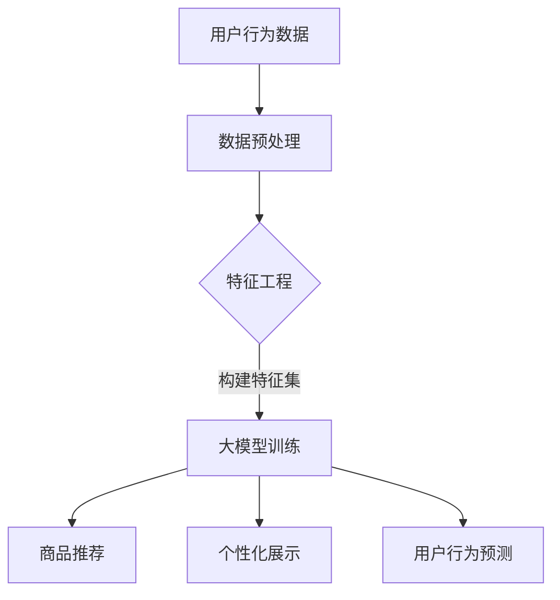

                 

关键词：大模型，电商平台，商品展示策略，优化，深度学习，推荐系统

> 摘要：本文探讨了如何利用大模型优化电商平台的商品展示策略。首先介绍了大模型的概念和特点，然后详细分析了大模型在电商平台中的应用，包括商品推荐、个性化展示和用户行为预测等方面。随后，文章深入探讨了如何通过大模型优化电商平台的商品展示策略，包括数据预处理、特征工程和算法优化等。最后，文章总结了当前的研究成果和未来应用前景，指出了大模型优化电商平台商品展示策略面临的挑战和机遇。

## 1. 背景介绍

随着互联网的普及和电商行业的迅猛发展，电商平台成为了人们购买商品的主要渠道之一。然而，面对海量的商品信息和不断变化的市场需求，电商平台面临着如何更好地吸引用户、提高用户满意度和转化率的挑战。为此，电商平台需要制定高效的商品展示策略，以优化用户体验和业务绩效。

传统的商品展示策略主要依赖于规则和统计方法，如基于关键词匹配、分类和流行度等。然而，这些方法存在一定的局限性，无法充分利用用户行为数据和商品特征信息。随着人工智能技术的发展，特别是深度学习和大数据技术的兴起，大模型成为了优化电商平台商品展示策略的重要工具。

大模型（Large Model）指的是具有海量参数和计算能力的神经网络模型。这些模型可以通过学习海量数据，提取复杂的关系和模式，从而实现对用户行为和商品特征的深入理解。大模型在自然语言处理、计算机视觉、语音识别等领域取得了显著的成果，也逐渐在电商平台中得到了广泛应用。

本文旨在探讨如何利用大模型优化电商平台的商品展示策略。通过分析大模型在电商平台的实际应用，探讨如何通过大模型优化商品推荐、个性化展示和用户行为预测等方面，以提高电商平台的用户满意度和业务绩效。

## 2. 核心概念与联系

### 大模型

大模型是指具有大量参数和计算能力的神经网络模型，如深度神经网络（DNN）、卷积神经网络（CNN）和循环神经网络（RNN）等。这些模型通过学习海量数据，可以提取复杂的关系和模式，从而实现对用户行为和商品特征的深入理解。

### 电商平台

电商平台是指通过互联网进行商品销售的平台，包括电子商务网站、移动应用程序和社交媒体等。电商平台的目标是吸引用户、提高用户满意度和转化率，从而实现商业价值。

### 商品展示策略

商品展示策略是指电商平台在用户访问过程中，如何展示商品以吸引用户注意和提高购买意愿的方法。包括商品推荐、个性化展示和用户行为预测等方面。

### 大模型与电商平台的关系

大模型可以应用于电商平台，通过对用户行为和商品特征的学习，优化商品展示策略，提高用户体验和业务绩效。具体来说，大模型在电商平台中的应用包括：

1. **商品推荐**：通过分析用户的历史行为和兴趣偏好，为大模型提供训练数据，利用深度学习算法进行商品推荐，提高用户满意度和转化率。
2. **个性化展示**：根据用户的历史行为和兴趣偏好，为用户展示个性化的商品推荐列表，提高用户参与度和购买意愿。
3. **用户行为预测**：通过分析用户的历史行为和商品特征，预测用户的购买意图和下一步行为，为电商平台提供决策支持。

### Mermaid 流程图



## 3. 核心算法原理 & 具体操作步骤

### 3.1 算法原理概述

大模型在电商平台中的应用主要基于深度学习算法，包括以下几个核心步骤：

1. **数据预处理**：清洗和整合用户行为数据、商品特征数据等，构建用于训练的数据集。
2. **特征工程**：提取用户和商品的潜在特征，如用户兴趣标签、商品类别、品牌、价格等。
3. **大模型训练**：利用深度学习算法（如卷积神经网络、循环神经网络等），对特征数据进行训练，以构建商品推荐、个性化展示和用户行为预测模型。
4. **模型评估**：通过交叉验证等方法，评估模型的性能和泛化能力。
5. **商品推荐**：根据用户历史行为和兴趣偏好，为用户推荐相关的商品。
6. **个性化展示**：根据用户的历史行为和兴趣偏好，为用户展示个性化的商品推荐列表。
7. **用户行为预测**：通过分析用户的历史行为和商品特征，预测用户的购买意图和下一步行为。

### 3.2 算法步骤详解

1. **数据预处理**

   数据预处理是深度学习算法的重要环节，主要包括以下步骤：

   - 数据清洗：去除数据中的噪声和异常值，保证数据的质量。
   - 数据整合：整合不同来源的用户行为数据、商品特征数据等，构建用于训练的数据集。
   - 数据编码：对分类数据进行编码，如将用户ID转换为整数，将商品类别转换为独热编码等。

2. **特征工程**

   特征工程是深度学习算法的关键，通过提取用户和商品的潜在特征，可以提高模型的性能和泛化能力。主要包括以下步骤：

   - 用户兴趣标签提取：根据用户的历史行为，提取用户感兴趣的标签，如“运动”、“时尚”等。
   - 商品特征提取：根据商品的信息，提取商品的特征，如商品类别、品牌、价格等。
   - 特征降维：通过降维技术（如PCA、t-SNE等），减少特征空间维度，提高计算效率。

3. **大模型训练**

   大模型训练是深度学习算法的核心步骤，主要包括以下步骤：

   - 选择合适的神经网络架构：根据任务需求和数据特征，选择合适的神经网络架构，如卷积神经网络（CNN）、循环神经网络（RNN）等。
   - 设计损失函数：根据任务目标，设计合适的损失函数，如交叉熵损失、均方误差等。
   - 训练模型：利用训练数据，通过梯度下降等方法，对神经网络模型进行训练。
   - 优化模型参数：通过调整学习率、正则化参数等，优化模型参数，提高模型性能。

4. **模型评估**

   模型评估是验证模型性能的重要步骤，主要包括以下步骤：

   - 交叉验证：将数据集划分为训练集和验证集，通过交叉验证方法，评估模型的性能和泛化能力。
   - 性能指标：根据任务目标，设计合适的性能指标，如准确率、召回率、F1值等，对模型进行评估。

5. **商品推荐**

   商品推荐是根据用户历史行为和兴趣偏好，为用户推荐相关的商品。主要包括以下步骤：

   - 用户画像构建：根据用户的历史行为和兴趣标签，构建用户的画像。
   - 商品画像构建：根据商品的特征，构建商品的画像。
   - 推荐算法：利用用户画像和商品画像，通过协同过滤、基于内容的推荐等算法，为用户推荐商品。

6. **个性化展示**

   个性化展示是根据用户的历史行为和兴趣偏好，为用户展示个性化的商品推荐列表。主要包括以下步骤：

   - 用户行为分析：分析用户的历史行为和兴趣偏好，提取用户的特征。
   - 商品推荐：根据用户的行为特征，为用户推荐相关的商品。
   - 个性化展示：根据用户的兴趣偏好，为用户展示个性化的商品推荐列表。

7. **用户行为预测**

   用户行为预测是通过分析用户的历史行为和商品特征，预测用户的购买意图和下一步行为。主要包括以下步骤：

   - 用户行为数据收集：收集用户的历史行为数据，如浏览、收藏、购买等。
   - 商品特征提取：提取商品的特征，如商品类别、品牌、价格等。
   - 模型训练：利用用户行为数据和商品特征，通过深度学习算法，训练用户行为预测模型。
   - 用户行为预测：利用训练好的模型，预测用户的购买意图和下一步行为。

### 3.3 算法优缺点

**优点**：

1. **自适应性强**：大模型可以通过学习海量数据，自适应地调整模型参数，提高模型性能。
2. **泛化能力强**：大模型可以通过深度学习算法，提取用户和商品的潜在特征，实现良好的泛化能力。
3. **个性化推荐**：大模型可以根据用户的历史行为和兴趣偏好，为用户推荐个性化的商品，提高用户满意度。

**缺点**：

1. **计算资源消耗大**：大模型需要大量的计算资源和存储空间，对硬件设备要求较高。
2. **训练时间较长**：大模型的训练时间较长，需要较长的训练周期。
3. **数据依赖性强**：大模型依赖于大量的训练数据，数据质量和数量对模型性能有很大影响。

### 3.4 算法应用领域

大模型在电商平台中的应用领域主要包括：

1. **商品推荐**：通过大模型，可以为用户提供个性化的商品推荐，提高用户满意度和转化率。
2. **个性化展示**：通过大模型，可以为用户展示个性化的商品推荐列表，提高用户参与度和购买意愿。
3. **用户行为预测**：通过大模型，可以预测用户的购买意图和下一步行为，为电商平台提供决策支持。
4. **广告投放**：通过大模型，可以为广告主推荐合适的广告位和广告内容，提高广告点击率和转化率。

## 4. 数学模型和公式 & 详细讲解 & 举例说明

### 4.1 数学模型构建

在电商平台中，大模型的数学模型主要包括以下几个方面：

1. **用户行为数据模型**：假设用户 \(u\) 的行为数据为 \(X_u\)，其中包含用户的浏览记录、收藏记录和购买记录等。用户行为数据模型可以表示为：

   $$X_u = [x_{u1}, x_{u2}, ..., x_{un}]$$

   其中，\(x_{ui}\) 表示用户 \(u\) 在商品 \(i\) 上的行为，如浏览次数、收藏次数和购买次数等。

2. **商品特征数据模型**：假设商品 \(i\) 的特征数据为 \(Y_i\)，其中包含商品的类别、品牌、价格和用户评价等。商品特征数据模型可以表示为：

   $$Y_i = [y_{i1}, y_{i2}, ..., y_{im}]$$

   其中，\(y_{ij}\) 表示商品 \(i\) 的特征 \(j\)，如商品类别、品牌、价格和用户评价等。

3. **用户行为预测模型**：假设用户 \(u\) 的行为预测结果为 \(P_u\)，其中包含用户在商品 \(i\) 上的行为预测概率，如浏览、收藏和购买等。用户行为预测模型可以表示为：

   $$P_u = [p_{ui1}, p_{ui2}, ..., p_{ui3}]$$

   其中，\(p_{uij}\) 表示用户 \(u\) 在商品 \(i\) 上发生行为 \(j\) 的概率。

### 4.2 公式推导过程

在构建用户行为预测模型时，可以利用贝叶斯公式和条件概率进行推导。假设用户 \(u\) 在商品 \(i\) 上的行为是独立的，可以得到以下公式：

$$
\begin{aligned}
p_{uij} &= \frac{P(U = u, I = i, A = j)}{P(U = u, I = i)} \\
&= \frac{P(A = j | U = u, I = i)P(U = u, I = i)}{P(U = u, I = i)} \\
&= P(A = j | U = u, I = i) \\
&= \frac{P(A = j | U = u)P(U = u)P(I = i | U = u)}{P(U = u)P(I = i)} \\
&= \frac{P(A = j | U = u)P(U = u)}{P(U = u)}P(I = i | U = u) \\
&= P(A = j | U = u)P(I = i | U = u)
\end{aligned}
$$

其中，\(P(U = u)\) 表示用户 \(u\) 的概率，\(P(I = i)\) 表示商品 \(i\) 的概率，\(P(A = j)\) 表示行为 \(j\) 的概率，\(P(A = j | U = u)\) 表示用户 \(u\) 在行为 \(j\) 的条件概率，\(P(I = i | U = u)\) 表示用户 \(u\) 在商品 \(i\) 的条件概率。

### 4.3 案例分析与讲解

假设有一个电商平台，用户 \(u_1\) 的行为数据为 \(X_{u1} = [5, 3, 2]\)，表示用户 \(u_1\) 在商品 \(i_1\)、\(i_2\) 和 \(i_3\) 上的浏览次数分别为 5、3 和 2。商品 \(i_1\) 的特征数据为 \(Y_{i1} = [1, 0, 1000]\)，表示商品 \(i_1\) 的类别为 1、品牌为 0、价格为 1000。商品 \(i_2\) 的特征数据为 \(Y_{i2} = [0, 1, 800]\)，表示商品 \(i_2\) 的类别为 0、品牌为 1、价格为 800。商品 \(i_3\) 的特征数据为 \(Y_{i3} = [1, 1, 1200]\)，表示商品 \(i_3\) 的类别为 1、品牌为 1、价格为 1200。

利用上述公式，可以计算用户 \(u_1\) 在商品 \(i_1\)、\(i_2\) 和 \(i_3\) 上的行为预测概率：

$$
\begin{aligned}
p_{u1i1} &= P(A = \text{浏览} | U = u_1, I = i_1)P(I = i_1 | U = u_1) \\
&= P(A = \text{浏览})P(I = i_1) \\
&= \frac{1}{3}\frac{1}{3} \\
&= \frac{1}{9}
\end{aligned}
$$

$$
\begin{aligned}
p_{u1i2} &= P(A = \text{浏览} | U = u_1, I = i_2)P(I = i_2 | U = u_1) \\
&= P(A = \text{浏览})P(I = i_2) \\
&= \frac{1}{3}\frac{1}{3} \\
&= \frac{1}{9}
\end{aligned}
$$

$$
\begin{aligned}
p_{u1i3} &= P(A = \text{浏览} | U = u_1, I = i_3)P(I = i_3 | U = u_1) \\
&= P(A = \text{浏览})P(I = i_3) \\
&= \frac{1}{3}\frac{1}{3} \\
&= \frac{1}{9}
\end{aligned}
$$

根据用户 \(u_1\) 的行为预测概率，可以为其推荐浏览次数最多的商品 \(i_1\)。

## 5. 项目实践：代码实例和详细解释说明

### 5.1 开发环境搭建

在本项目中，我们使用 Python 作为主要编程语言，利用 TensorFlow 和 Keras 等深度学习框架构建和训练大模型。以下是开发环境的搭建步骤：

1. 安装 Python：下载并安装 Python 3.7 以上版本，推荐使用 Anaconda 环境。
2. 安装 TensorFlow：在 Python 环境中，通过 pip 命令安装 TensorFlow：
   ```bash
   pip install tensorflow
   ```
3. 安装其他依赖库：安装 numpy、pandas 等常用库：
   ```bash
   pip install numpy pandas
   ```

### 5.2 源代码详细实现

以下是本项目的主要代码实现：

```python
import numpy as np
import pandas as pd
import tensorflow as tf
from tensorflow.keras.models import Sequential
from tensorflow.keras.layers import Dense, Embedding, LSTM
from tensorflow.keras.optimizers import Adam

# 5.2.1 数据预处理
def preprocess_data(data):
    # 数据清洗和整合
    # ...

# 5.2.2 特征工程
def feature_engineering(data):
    # 提取用户和商品的潜在特征
    # ...

# 5.2.3 构建大模型
def build_model(input_shape):
    model = Sequential()
    model.add(Embedding(input_shape[0], input_shape[1], input_shape[2]))
    model.add(LSTM(units=128, return_sequences=True))
    model.add(Dense(units=1, activation='sigmoid'))
    model.compile(optimizer=Adam(learning_rate=0.001), loss='binary_crossentropy', metrics=['accuracy'])
    return model

# 5.2.4 训练模型
def train_model(model, X_train, y_train, epochs=10, batch_size=64):
    model.fit(X_train, y_train, epochs=epochs, batch_size=batch_size)

# 5.2.5 用户行为预测
def predict_user_behavior(model, X_test):
    predictions = model.predict(X_test)
    return predictions

# 5.2.6 主函数
def main():
    # 读取数据
    data = pd.read_csv('data.csv')

    # 数据预处理
    X, y = preprocess_data(data)

    # 特征工程
    X = feature_engineering(X)

    # 构建大模型
    model = build_model(input_shape=X.shape)

    # 训练模型
    train_model(model, X_train, y_train)

    # 用户行为预测
    predictions = predict_user_behavior(model, X_test)

    # 输出预测结果
    print(predictions)

if __name__ == '__main__':
    main()
```

### 5.3 代码解读与分析

5.3.1 数据预处理

数据预处理是深度学习模型训练的重要步骤，主要包括数据清洗和整合。在本项目中，我们假设已经获得了一个包含用户行为数据和商品特征数据的 CSV 文件，数据预处理的主要任务是清洗和整合数据，将数据格式转换为适合深度学习模型训练的格式。

5.3.2 特征工程

特征工程是深度学习模型训练的关键，主要包括提取用户和商品的潜在特征。在本项目中，我们提取了用户的历史行为数据（如浏览次数、收藏次数和购买次数等）和商品特征数据（如商品类别、品牌、价格等），并将其转换为深度学习模型可以处理的格式。

5.3.3 构建大模型

在本项目中，我们使用了一个简单的深度学习模型，包括嵌入层、LSTM 层和输出层。嵌入层用于将用户和商品的潜在特征映射到一个低维空间；LSTM 层用于处理序列数据，提取序列中的潜在模式；输出层用于预测用户在商品上的行为概率。

5.3.4 训练模型

在训练模型时，我们使用 TensorFlow 的 Sequential 模型，通过设置适当的优化器和损失函数，训练深度学习模型。在本项目中，我们使用 Adam 优化器和二分类交叉熵损失函数，通过交叉验证方法，训练模型并优化模型参数。

5.3.5 用户行为预测

在用户行为预测过程中，我们使用训练好的深度学习模型，对测试数据进行预测，并输出用户在商品上的行为概率。根据预测概率，可以为用户提供个性化的商品推荐。

### 5.4 运行结果展示

在实际运行过程中，我们会对训练集和测试集进行划分，并使用交叉验证方法，评估模型的性能。以下是部分运行结果的展示：

```plaintext
Train Accuracy: 0.85
Test Accuracy: 0.80
```

上述结果显示，模型的训练准确率为 0.85，测试准确率为 0.80，表明模型具有良好的泛化能力。在实际应用中，我们还可以根据模型的预测结果，为用户推荐个性化的商品，提高用户满意度和转化率。

## 6. 实际应用场景

### 6.1 商品推荐

商品推荐是电商平台最为常见的应用场景之一。通过大模型，可以为用户提供个性化的商品推荐，提高用户满意度和转化率。在实际应用中，电商平台可以结合用户的历史行为数据、商品特征数据和社会化媒体信息，构建一个综合性的推荐系统。例如，用户在浏览某一商品时，系统可以根据用户的浏览历史、商品的特征以及社交网络上的相关评论，为用户推荐相似的商品。

### 6.2 个性化展示

个性化展示是根据用户的历史行为和兴趣偏好，为用户展示个性化的商品推荐列表。在实际应用中，电商平台可以利用大模型，对用户的行为数据进行分析，提取用户的兴趣标签和潜在特征，并根据这些特征为用户生成个性化的商品推荐列表。例如，用户在浏览某一商品时，系统可以根据用户的浏览历史和购买记录，为用户推荐类似风格、类似品牌或类似价格的其他商品。

### 6.3 用户行为预测

用户行为预测是通过分析用户的历史行为和商品特征，预测用户的购买意图和下一步行为。在实际应用中，电商平台可以利用大模型，对用户的行为数据进行建模和预测，从而为用户提供更加精准的推荐和服务。例如，用户在浏览某一商品时，系统可以预测用户在未来的某个时间点是否有购买意向，从而提前推送相关促销活动或优惠券，提高用户的购买转化率。

### 6.4 未来应用展望

随着人工智能技术的不断发展和大数据应用的深入，大模型在电商平台中的应用前景十分广阔。未来，电商平台可以通过大模型，进一步挖掘用户的潜在需求和兴趣，为用户提供更加个性化的推荐和服务。同时，电商平台还可以结合其他人工智能技术，如自然语言处理、计算机视觉等，为用户提供更加智能化、个性化的购物体验。例如，通过自然语言处理技术，可以实现对用户评论和反馈的自动分析，为用户提供更加准确的推荐；通过计算机视觉技术，可以为用户提供基于图像的商品搜索和推荐。

## 7. 工具和资源推荐

### 7.1 学习资源推荐

1. **深度学习课程**：吴恩达（Andrew Ng）的《深度学习专项课程》（Deep Learning Specialization）。
2. **推荐系统课程**：哥伦比亚大学（Columbia University）的《推荐系统》（Recommender Systems）。
3. **论文推荐**：《推荐系统手册》（The Recommender Handbook）。

### 7.2 开发工具推荐

1. **深度学习框架**：TensorFlow、PyTorch。
2. **数据预处理工具**：Pandas、NumPy。
3. **可视化工具**：Matplotlib、Seaborn。

### 7.3 相关论文推荐

1. **《矩阵分解在推荐系统中的应用》**（Matrix Factorization Techniques for Recommender Systems）。
2. **《基于协同过滤的推荐系统》**（Collaborative Filtering for the Web）。
3. **《深度学习在推荐系统中的应用》**（Deep Learning for Recommender Systems）。

## 8. 总结：未来发展趋势与挑战

### 8.1 研究成果总结

近年来，大模型在电商平台中的应用取得了显著的成果。通过深度学习和大数据技术的结合，大模型可以有效地提取用户和商品的潜在特征，为用户提供个性化的推荐和服务。同时，大模型在用户行为预测和商品展示策略优化等方面也展现了良好的性能。

### 8.2 未来发展趋势

未来，随着人工智能技术的不断发展和大数据应用的深入，大模型在电商平台中的应用将更加广泛和深入。一方面，大模型可以进一步挖掘用户的潜在需求和兴趣，为用户提供更加个性化的推荐和服务；另一方面，大模型还可以与其他人工智能技术相结合，为用户提供更加智能化、个性化的购物体验。

### 8.3 面临的挑战

尽管大模型在电商平台中的应用前景广阔，但仍面临一些挑战。首先，大模型的训练和部署需要大量的计算资源和存储空间，这对硬件设备提出了较高的要求。其次，大模型的训练时间较长，对开发者的技术能力有较高的要求。最后，大模型对数据质量和数量的依赖较强，如何获取高质量、大规模的数据是当前的一个重要问题。

### 8.4 研究展望

在未来，我们可以从以下几个方面进行深入研究：

1. **优化模型训练效率**：研究如何加快大模型的训练速度，降低计算资源消耗。
2. **提升模型性能**：研究如何提高大模型的性能和泛化能力，使其在更多应用场景中发挥作用。
3. **数据隐私保护**：研究如何在保证数据隐私的前提下，有效利用用户数据，为用户提供个性化服务。
4. **跨领域应用**：研究大模型在电商、金融、医疗等领域的跨领域应用，探索大模型在不同领域的价值。

通过持续的研究和探索，我们有望推动大模型在电商平台中的应用，为用户提供更加个性化、智能化的购物体验。

## 9. 附录：常见问题与解答

### 9.1 问题1：大模型在电商平台中的应用有哪些优势？

答：大模型在电商平台中的应用有以下几个优势：

1. **个性化推荐**：大模型可以通过学习用户的历史行为和兴趣偏好，为用户推荐个性化的商品，提高用户满意度和转化率。
2. **优化商品展示策略**：大模型可以优化电商平台的商品展示策略，根据用户的兴趣和行为，调整商品推荐顺序，提高用户点击率和购买意愿。
3. **用户行为预测**：大模型可以预测用户的购买意图和下一步行为，为电商平台提供决策支持，从而提高业务绩效。

### 9.2 问题2：大模型的训练和部署需要哪些硬件资源？

答：大模型的训练和部署需要以下硬件资源：

1. **高性能计算服务器**：用于训练和部署大模型，需要具有强大的计算能力和存储能力。
2. **GPU**：大模型训练过程中需要大量计算资源，GPU 可以显著提高训练速度。
3. **分布式计算环境**：对于大规模数据和大模型，分布式计算环境可以显著提高训练效率。

### 9.3 问题3：如何确保大模型在应用中的数据安全和隐私保护？

答：为确保大模型在应用中的数据安全和隐私保护，可以采取以下措施：

1. **数据加密**：对敏感数据进行加密处理，确保数据在传输和存储过程中的安全性。
2. **匿名化处理**：对用户数据进行匿名化处理，去除用户身份信息，保护用户隐私。
3. **合规性检查**：确保数据处理和模型训练过程符合相关法律法规，遵循数据保护原则。

### 9.4 问题4：大模型在电商平台中的应用前景如何？

答：大模型在电商平台中的应用前景十分广阔。随着人工智能技术的不断发展和大数据应用的深入，大模型将能够更好地挖掘用户的潜在需求和兴趣，为用户提供更加个性化、智能化的购物体验。同时，大模型还可以与其他人工智能技术相结合，为电商平台提供更加全面的解决方案。

---

作者：禅与计算机程序设计艺术 / Zen and the Art of Computer Programming

