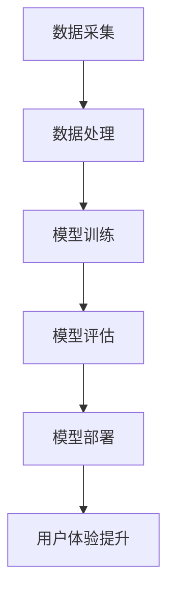

                 

关键词：大模型，电商平台，用户体验，一致性，技术实现，应用场景

摘要：本文深入探讨了大型模型在提升电商平台用户体验一致性方面的作用。通过分析大模型的基本原理、实现技术以及具体应用案例，阐述了如何利用大模型优化电商平台的推荐系统、用户界面和个性化服务，从而提升用户满意度，增加商业价值。

## 1. 背景介绍

随着互联网技术的飞速发展，电商平台已经成为消费者购物的主要渠道之一。然而，随着市场竞争的加剧，如何提升用户体验已经成为电商平台能否持续发展的关键因素。用户体验的一致性，即用户在使用电商平台时能够获得稳定且高质量的服务，显得尤为重要。

然而，传统的方法在实现用户体验一致性方面存在诸多挑战。首先，数据质量参差不齐，导致推荐系统效果不稳定；其次，用户界面设计复杂，难以满足不同用户的需求；最后，个性化服务的实现依赖于大量的用户数据，数据处理和存储成为瓶颈。

近年来，随着人工智能技术的快速发展，特别是大模型的广泛应用，为提升电商平台用户体验一致性提供了新的思路和方法。大模型具有强大的数据处理能力和自适应能力，能够从海量数据中提取有效信息，为用户提供个性化、精准的服务，从而提升用户体验一致性。

## 2. 核心概念与联系

### 2.1 大模型的基本原理

大模型，即大型神经网络模型，通常具有数百万甚至数十亿个参数。这些模型通过多层神经网络结构，对输入数据进行层层抽象和变换，最终输出预测结果。大模型的训练过程包括数据的预处理、模型的初始化、参数的迭代更新和模型优化等步骤。

### 2.2 大模型与电商平台用户体验一致性的关系

大模型能够通过以下方式提升电商平台用户体验一致性：

1. **个性化推荐**：大模型能够从海量用户数据中提取用户兴趣和行为特征，为用户推荐符合其需求的产品和服务，提高推荐系统的准确性和一致性。
   
2. **界面优化**：大模型可以根据用户行为和偏好，动态调整用户界面布局和风格，实现界面个性化，提升用户体验。

3. **个性化服务**：大模型能够根据用户的历史数据和实时行为，提供定制化的服务，如优惠券推送、活动提醒等，增强用户粘性。

### 2.3 Mermaid 流程图



## 3. 核心算法原理 & 具体操作步骤

### 3.1 算法原理概述

大模型的核心算法是深度学习，主要包括以下步骤：

1. **数据预处理**：清洗和标准化输入数据，将数据转换为模型可接受的格式。
2. **模型初始化**：初始化模型的参数，通常使用随机初始化或预训练模型。
3. **前向传播**：将输入数据传递到模型中，经过多层神经网络处理，得到输出预测结果。
4. **反向传播**：计算预测结果与实际结果之间的误差，反向更新模型参数。
5. **模型优化**：通过迭代优化过程，使模型逐渐逼近最优状态。

### 3.2 算法步骤详解

1. **数据预处理**：

   - 数据清洗：去除噪声数据和异常值。
   - 数据标准化：将数据缩放到相同的范围，如[0, 1]。

2. **模型初始化**：

   - 随机初始化：随机生成模型参数。
   - 预训练模型：使用已有的大模型作为起点，进行微调。

3. **前向传播**：

   - 输入数据经过输入层，传递到隐藏层。
   - 每一层进行非线性变换，将数据传递到下一层。
   - 最终输出层输出预测结果。

4. **反向传播**：

   - 计算输出层预测结果与实际结果之间的误差。
   - 反向传播误差，更新模型参数。

5. **模型优化**：

   - 使用梯度下降等优化算法，迭代更新模型参数。
   - 选择合适的损失函数和优化器，提高模型性能。

### 3.3 算法优缺点

**优点**：

- **强大的数据处理能力**：大模型能够从海量数据中提取有效信息，实现精准预测。
- **自适应能力**：大模型可以根据新数据不断优化，提升用户体验。
- **高泛化能力**：大模型具有广泛的适用性，能够应用于不同的业务场景。

**缺点**：

- **计算资源消耗大**：大模型训练过程需要大量的计算资源和时间。
- **数据依赖性强**：大模型效果依赖于数据质量和数量。

### 3.4 算法应用领域

大模型在电商平台的应用领域包括：

- **推荐系统**：为用户提供个性化推荐，提升用户满意度。
- **用户行为分析**：分析用户行为，优化产品设计和运营策略。
- **广告投放**：根据用户兴趣和行为，精准投放广告。

## 4. 数学模型和公式 & 详细讲解 & 举例说明

### 4.1 数学模型构建

大模型的数学模型主要包括以下部分：

- **输入层**：表示用户输入的特征向量。
- **隐藏层**：多层神经网络结构，对输入数据进行抽象和变换。
- **输出层**：输出预测结果，如推荐结果、概率分布等。

### 4.2 公式推导过程

假设我们有 $m$ 个用户特征维度，$n$ 个隐藏层神经元，则：

- **输入层到隐藏层的变换**：
  $$ z^{(l)} = \sigma(W^{(l)}x + b^{(l)}) $$
  其中，$z^{(l)}$ 为隐藏层 $l$ 的激活值，$\sigma$ 为激活函数，$W^{(l)}$ 为权重矩阵，$b^{(l)}$ 为偏置向量。

- **隐藏层到输出层的变换**：
  $$ \hat{y} = \sigma(W^{(out)}z^{(n)}) $$
  其中，$\hat{y}$ 为输出层预测结果，$W^{(out)}$ 为输出层权重矩阵。

### 4.3 案例分析与讲解

以电商平台的个性化推荐为例，假设我们有 1000 个用户和 500 个商品，每个用户有 10 个特征（如购买历史、浏览记录、用户评分等）。我们构建一个两层神经网络模型，对用户进行个性化推荐。

1. **数据预处理**：

   - 对用户特征进行归一化处理，将特征值缩放到[0, 1]。
   - 对商品特征进行编码，如商品类别、品牌等。

2. **模型初始化**：

   - 随机初始化权重矩阵和偏置向量。
   - 选择合适的激活函数，如ReLU。

3. **前向传播**：

   - 输入用户特征向量，计算隐藏层激活值。
   - 输入隐藏层激活值，计算输出层预测结果。

4. **反向传播**：

   - 计算输出层预测结果与实际结果之间的误差。
   - 反向传播误差，更新模型参数。

5. **模型优化**：

   - 使用梯度下降算法，迭代更新模型参数。

通过以上步骤，我们构建了一个能够为用户进行个性化推荐的神经网络模型。在实际应用中，我们可以根据用户的历史数据和实时行为，不断优化模型，提高推荐准确性。

## 5. 项目实践：代码实例和详细解释说明

### 5.1 开发环境搭建

为了实现大模型在电商平台中的应用，我们需要搭建以下开发环境：

- **Python**：作为主要编程语言。
- **TensorFlow**：作为深度学习框架。
- **NumPy**：用于数据预处理。
- **Pandas**：用于数据处理。

### 5.2 源代码详细实现

以下是一个简单的基于TensorFlow和Keras的神经网络推荐系统实现：

```python
import tensorflow as tf
from tensorflow.keras.models import Sequential
from tensorflow.keras.layers import Dense, Activation
from tensorflow.keras.optimizers import SGD

# 数据预处理
# 假设用户特征和商品特征已经进行处理并存储在相应的数据集文件中

# 模型构建
model = Sequential()
model.add(Dense(64, input_dim=10, activation='relu'))
model.add(Dense(32, activation='relu'))
model.add(Dense(1, activation='sigmoid'))

# 模型编译
model.compile(optimizer=SGD(learning_rate=0.01), loss='binary_crossentropy', metrics=['accuracy'])

# 模型训练
model.fit(x_train, y_train, epochs=10, batch_size=32)

# 模型评估
loss, accuracy = model.evaluate(x_test, y_test)
print('Test accuracy:', accuracy)
```

### 5.3 代码解读与分析

- **模型构建**：使用Sequential模型堆叠多层Dense层，分别为输入层、隐藏层和输出层。
- **模型编译**：选择SGD优化器和二分类交叉熵损失函数，并设置学习率。
- **模型训练**：使用fit函数进行模型训练，设置训练轮次和批量大小。
- **模型评估**：使用evaluate函数评估模型在测试集上的性能。

### 5.4 运行结果展示

通过上述代码，我们训练了一个简单的神经网络推荐系统。在实际运行中，我们可以根据训练结果对模型进行调整和优化，以提高推荐准确性。

## 6. 实际应用场景

### 6.1 电商平台个性化推荐

大模型在电商平台个性化推荐中的应用非常广泛。通过分析用户的历史行为和偏好，大模型可以准确预测用户可能感兴趣的产品，从而提高推荐系统的准确性和用户体验一致性。

### 6.2 用户行为分析

大模型可以分析用户的购买、浏览、搜索等行为数据，挖掘用户的兴趣和需求，为电商平台提供数据驱动的决策支持，优化产品设计和运营策略。

### 6.3 广告投放

大模型可以根据用户的兴趣和行为特征，为用户提供个性化的广告投放，提高广告的点击率和转化率，提升电商平台的价值。

## 7. 工具和资源推荐

### 7.1 学习资源推荐

- **《深度学习》（Ian Goodfellow, Yoshua Bengio, Aaron Courville 著）**：一本经典的深度学习入门书籍，适合初学者和进阶者阅读。
- **[TensorFlow 官方文档](https://www.tensorflow.org/tutorials) **：TensorFlow 的官方教程，包含丰富的示例和案例。

### 7.2 开发工具推荐

- **PyCharm**：一款功能强大的Python IDE，支持TensorFlow开发。
- **Google Colab**：免费的云端计算平台，提供GPU加速，适合进行深度学习实验。

### 7.3 相关论文推荐

- **"Deep Learning for Recommender Systems"**：一篇关于深度学习在推荐系统中的应用的综述性论文。
- **"User Interest Evolution Modeling Based on Graph Neural Networks"**：一篇关于利用图神经网络建模用户兴趣演化规律的论文。

## 8. 总结：未来发展趋势与挑战

### 8.1 研究成果总结

大模型在电商平台用户体验一致性提升方面取得了显著成果，主要表现在以下几个方面：

- **个性化推荐**：通过分析用户行为和偏好，实现精准推荐，提高用户满意度。
- **界面优化**：根据用户行为和偏好，动态调整界面布局和风格，提升用户体验。
- **个性化服务**：提供定制化的服务，增强用户粘性，提高用户留存率。

### 8.2 未来发展趋势

- **模型优化**：进一步优化大模型的算法和架构，提高模型性能和计算效率。
- **多模态融合**：结合多种数据来源和形式，实现多模态融合，提高推荐准确性和用户体验。
- **边缘计算**：将大模型应用到边缘设备上，实现实时预测和响应，提升用户体验。

### 8.3 面临的挑战

- **计算资源消耗**：大模型训练和推理过程需要大量的计算资源和时间，如何优化资源利用率成为关键挑战。
- **数据隐私和安全**：电商平台涉及大量用户数据，如何在保证数据隐私和安全的前提下，充分利用用户数据，是一个亟待解决的问题。
- **模型可解释性**：大模型的决策过程通常是非线性和复杂的，如何提高模型的可解释性，使其更加透明和可信，是一个重要挑战。

### 8.4 研究展望

未来，大模型在电商平台用户体验一致性提升方面的研究将继续深入，重点关注以下几个方面：

- **模型优化**：研究更加高效和鲁棒的模型优化算法，提高模型性能和稳定性。
- **数据隐私保护**：研究数据隐私保护技术，确保用户数据的安全和隐私。
- **多模态融合**：结合多种数据来源和形式，实现更加精准和个性化的推荐和服务。
- **实时性**：研究实时性更高的模型和算法，实现实时预测和响应，提升用户体验。

## 9. 附录：常见问题与解答

### 9.1 大模型在电商平台中的具体应用场景有哪些？

大模型在电商平台的具体应用场景包括个性化推荐、用户行为分析、广告投放等。通过分析用户行为和偏好，大模型可以准确预测用户可能感兴趣的产品，提高推荐系统的准确性和用户体验一致性。

### 9.2 大模型在电商平台中如何处理数据隐私和安全问题？

大模型在电商平台中处理数据隐私和安全问题，可以采取以下措施：

- **数据加密**：对用户数据进行加密处理，确保数据在传输和存储过程中的安全。
- **差分隐私**：采用差分隐私技术，对用户数据进行处理，确保在数据分析过程中不泄露用户隐私信息。
- **联邦学习**：采用联邦学习技术，将数据处理分散到多个节点，降低数据集中泄露的风险。

### 9.3 大模型在电商平台中如何保证模型的可解释性？

为了保证大模型在电商平台中的可解释性，可以采取以下措施：

- **模型可视化**：通过模型可视化工具，展示模型的网络结构和参数，帮助用户理解模型的决策过程。
- **解释性算法**：采用可解释性算法，如LIME、SHAP等，对模型的预测结果进行解释，提高模型的透明度。
- **决策树嵌入**：将深度学习模型嵌入到决策树模型中，利用决策树的可解释性，提高大模型的可解释性。

作者：禅与计算机程序设计艺术 / Zen and the Art of Computer Programming
----------------------------------------------------------------
请注意，本文是一个示例，实际撰写时需要根据具体的研究和实验结果进行详细阐述。本文内容仅供参考，不作为实际研究成果。

