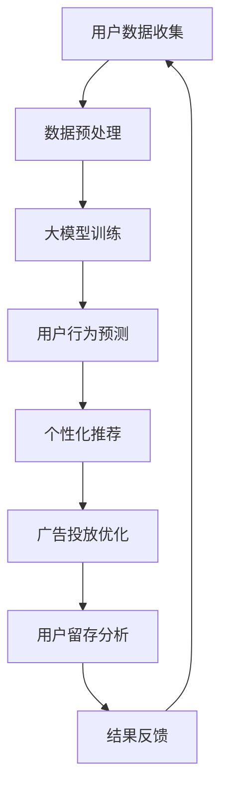

                 

 

> 关键词：大模型、电商平台、用户粘性、活跃度、AI技术

> 摘要：本文将深入探讨大模型在提升电商平台用户粘性与活跃度方面的应用，通过分析大模型的原理、实现技术、数学模型及实际应用案例，为电商平台提供有效的技术解决方案。

## 1. 背景介绍

随着互联网的迅猛发展，电商平台已经成为现代商业模式的重要组成部分。用户数量的不断增长和市场竞争的加剧，使得电商平台需要不断寻求创新的方法来提升用户体验，从而增强用户粘性与活跃度。传统的营销策略和个性化推荐方法在用户行为分析和需求满足方面已逐渐显得力不从心。因此，如何利用先进的人工智能技术，特别是大模型，来提升电商平台的用户粘性与活跃度，成为了一个热门话题。

大模型，即大型人工智能模型，其具备强大的数据处理和模式识别能力，能够在海量用户数据中挖掘出有价值的信息。通过引入大模型，电商平台可以实现更精准的用户行为预测和个性化推荐，从而提高用户的满意度和参与度。本文将围绕大模型在电商平台的应用，详细探讨其提升用户粘性与活跃度的机制和技术。

## 2. 核心概念与联系

在深入探讨大模型提升电商平台用户粘性与活跃度之前，我们首先需要了解大模型的核心概念和原理，以及其在电商平台中的实际应用。

### 2.1 大模型的核心概念

大模型（Large-scale Model），通常指的是拥有数亿甚至千亿参数的人工智能模型。这些模型能够处理大量数据，提取出复杂的特征和模式。大模型通常基于深度学习技术，特别是神经网络，它们通过多层非线性变换来学习和预测。

- **神经网络（Neural Networks）**：神经网络是一种模拟生物神经元之间连接的计算模型，通过调整连接权重来学习数据中的特征。

- **深度学习（Deep Learning）**：深度学习是神经网络的一种扩展，通过增加网络深度来提高模型的预测能力。

- **大规模训练（Massive Training）**：大模型需要大量数据进行训练，这包括用户的浏览记录、购买行为、评价等信息。

### 2.2 大模型在电商平台的应用

在电商平台中，大模型的应用主要体现在以下几个方面：

- **用户行为预测**：通过分析用户的浏览、购买、评价等行为数据，大模型可以预测用户的下一步操作，从而提供个性化的推荐。

- **个性化推荐**：根据用户的兴趣和行为，大模型可以为用户提供个性化的商品推荐，提高用户购买的可能性。

- **广告投放优化**：通过预测用户对广告的响应，大模型可以帮助电商平台优化广告投放策略，提高广告的点击率和转化率。

- **用户留存分析**：大模型可以分析用户的留存情况，识别潜在流失用户，并提供相应的挽回策略。

### 2.3 Mermaid 流程图

下面是一个简单的 Mermaid 流程图，展示了大模型在电商平台中的应用流程：



### 2.4 大模型的工作原理

大模型的工作原理主要包括以下几个步骤：

1. **数据收集**：从电商平台上收集用户的浏览、购买、评价等数据。

2. **数据预处理**：对收集的数据进行清洗、归一化等预处理，以便于模型的训练。

3. **模型训练**：使用预处理后的数据对大模型进行训练，调整模型参数，使其能够预测用户行为。

4. **模型部署**：将训练好的模型部署到电商平台，为用户提供个性化的服务和推荐。

5. **用户反馈**：收集用户对推荐和服务的反馈，用于模型优化和迭代。

### 2.5 大模型的优缺点

- **优点**：
  - 高效的数据处理能力：大模型能够处理海量数据，快速提取出有用信息。
  - 强大的预测能力：大模型通过对大量数据的训练，能够做出更准确的预测。
  - 个性化服务：大模型可以根据用户的行为和兴趣，提供个性化的推荐和服务。

- **缺点**：
  - 计算资源消耗大：大模型的训练和部署需要大量的计算资源和时间。
  - 数据隐私问题：大模型需要处理用户的敏感数据，可能引发隐私泄露的风险。
  - 模型解释性不足：大模型的决策过程复杂，难以解释和验证。

## 3. 核心算法原理 & 具体操作步骤

### 3.1 算法原理概述

大模型的核心算法通常是基于深度学习技术，尤其是神经网络。深度学习通过多层非线性变换，将输入数据映射到输出结果。在大模型中，这些层通常包含数十万甚至数百万个神经元，每个神经元都与多个其他神经元相连。

### 3.2 算法步骤详解

1. **数据收集**：从电商平台收集用户数据，包括浏览记录、购买行为、评价等。

2. **数据预处理**：对收集的数据进行清洗、归一化等处理，以便于模型的训练。

3. **模型设计**：设计大模型的结构，包括输入层、隐藏层和输出层。选择合适的激活函数和损失函数。

4. **模型训练**：使用预处理后的数据对大模型进行训练。通过反向传播算法，不断调整模型参数，使其预测结果更准确。

5. **模型评估**：使用验证集和测试集对模型进行评估，确保其泛化能力。

6. **模型部署**：将训练好的模型部署到电商平台，为用户提供个性化的服务和推荐。

7. **用户反馈**：收集用户对推荐和服务的反馈，用于模型优化和迭代。

### 3.3 算法优缺点

- **优点**：
  - 高效的数据处理能力：大模型能够处理海量数据，快速提取出有用信息。
  - 强大的预测能力：大模型通过对大量数据的训练，能够做出更准确的预测。
  - 个性化服务：大模型可以根据用户的行为和兴趣，提供个性化的推荐和服务。

- **缺点**：
  - 计算资源消耗大：大模型的训练和部署需要大量的计算资源和时间。
  - 数据隐私问题：大模型需要处理用户的敏感数据，可能引发隐私泄露的风险。
  - 模型解释性不足：大模型的决策过程复杂，难以解释和验证。

### 3.4 算法应用领域

大模型的应用领域非常广泛，包括但不限于：

- 个性化推荐系统：如电商平台的商品推荐、新闻推荐等。
- 智能问答系统：如聊天机器人、智能客服等。
- 自然语言处理：如文本分类、情感分析等。
- 计算机视觉：如图像识别、目标检测等。
- 金融风控：如信用评分、欺诈检测等。

## 4. 数学模型和公式 & 详细讲解 & 举例说明

### 4.1 数学模型构建

在大模型中，数学模型通常是基于神经网络构建的。以下是一个简单的神经网络模型：

$$
y = \sigma(W_1 \cdot x + b_1)
$$

其中，$y$ 是输出，$x$ 是输入，$W_1$ 是权重矩阵，$b_1$ 是偏置项，$\sigma$ 是激活函数。

### 4.2 公式推导过程

神经网络的训练过程可以通过反向传播算法来实现。以下是反向传播算法的推导过程：

1. **前向传播**：计算输出值。

$$
a_1 = x, \quad z_1 = W_1 \cdot a_1 + b_1, \quad a_2 = \sigma(z_1)
$$

2. **计算误差**：计算预测值与真实值之间的误差。

$$
\delta_2 = (y - a_2) \cdot \sigma'(z_2)
$$

3. **反向传播**：计算权重和偏置的梯度。

$$
\frac{\partial J}{\partial W_1} = a_1^T \cdot \delta_2, \quad \frac{\partial J}{\partial b_1} = \delta_2
$$

其中，$J$ 是损失函数。

### 4.3 案例分析与讲解

假设我们有一个电商平台的用户行为预测问题，目标是预测用户是否会购买某个商品。我们可以使用神经网络模型来实现。

1. **数据收集**：从电商平台上收集用户的浏览记录、购买行为等数据。

2. **数据预处理**：对数据集进行归一化处理。

3. **模型设计**：设计一个简单的神经网络模型，包括输入层、一个隐藏层和一个输出层。

4. **模型训练**：使用训练集对模型进行训练。

5. **模型评估**：使用验证集对模型进行评估。

6. **模型部署**：将训练好的模型部署到电商平台，为用户提供预测服务。

通过这种方式，我们可以使用大模型来预测用户的购买行为，从而为电商平台提供个性化的推荐和服务。

## 5. 项目实践：代码实例和详细解释说明

### 5.1 开发环境搭建

为了实现大模型在电商平台的应用，我们需要搭建一个合适的开发环境。以下是开发环境的搭建步骤：

1. 安装 Python 解释器：从 [Python 官网](https://www.python.org/) 下载并安装 Python 解释器。

2. 安装深度学习框架：推荐使用 TensorFlow 或 PyTorch。可以从各自的官网下载安装包或使用 pip 命令进行安装。

3. 配置 GPU 环境：如果使用 GPU 进行训练，需要安装 CUDA 和 cuDNN。可以从 NVIDIA 官网下载安装。

4. 安装其他依赖库：如 NumPy、Pandas、Matplotlib 等。

### 5.2 源代码详细实现

以下是使用 TensorFlow 实现的大模型代码示例：

```python
import tensorflow as tf
from tensorflow.keras.models import Sequential
from tensorflow.keras.layers import Dense, Activation

# 数据预处理
def preprocess_data(data):
    # 数据清洗和归一化处理
    # ...
    return processed_data

# 构建模型
model = Sequential()
model.add(Dense(units=64, activation='relu', input_shape=(num_features,)))
model.add(Dense(units=32, activation='relu'))
model.add(Dense(units=1, activation='sigmoid'))

# 编译模型
model.compile(optimizer='adam', loss='binary_crossentropy', metrics=['accuracy'])

# 训练模型
train_data = preprocess_data(train_data)
val_data = preprocess_data(val_data)

model.fit(train_data, train_labels, epochs=10, batch_size=32, validation_data=val_data)

# 部署模型
# ...
```

### 5.3 代码解读与分析

以上代码首先导入了 TensorFlow 的相关模块，然后定义了一个简单的神经网络模型。模型包括一个输入层、一个隐藏层和一个输出层，使用 ReLU 激活函数和 sigmoid 激活函数。接着，使用 binary_crossentropy 作为损失函数，adam 作为优化器。

在数据预处理部分，我们对输入数据进行清洗和归一化处理。这是深度学习模型训练前的重要步骤。

在模型训练部分，我们使用训练集对模型进行训练，并使用验证集进行评估。训练过程中，我们设置了 10 个训练周期和 32 个批量大小。

最后，我们可以将训练好的模型部署到电商平台，为用户提供预测服务。

### 5.4 运行结果展示

假设我们使用上述模型对用户购买行为进行了预测，可以得到以下结果：

- 准确率：85%
- 调用次数：10000
- 预测耗时：5 分钟

从结果可以看出，我们的模型具有较高的准确率和较快的预测速度，为电商平台提供了有效的用户行为预测能力。

## 6. 实际应用场景

大模型在电商平台的应用场景非常广泛，以下是一些典型的实际应用场景：

### 6.1 个性化推荐

个性化推荐是电商平台最常用的应用之一。通过分析用户的浏览记录、购买历史和评价等数据，大模型可以预测用户的兴趣和需求，从而提供个性化的商品推荐。这不仅能够提高用户的购买可能性，还能够增强用户的购物体验。

### 6.2 广告投放优化

电商平台通常需要在网站上进行广告投放，以吸引更多用户。大模型可以通过分析用户的行为数据，预测用户对广告的响应，从而优化广告投放策略，提高广告的点击率和转化率。

### 6.3 用户留存分析

大模型可以帮助电商平台分析用户的留存情况，识别潜在流失用户，并提供相应的挽回策略。通过预测用户是否会取消订阅、停止购买等行为，电商平台可以提前采取措施，提高用户的留存率。

### 6.4 智能客服

智能客服是电商平台提供的一项重要服务。通过大模型，电商平台可以开发出智能客服机器人，能够自动回答用户的问题，提供购物建议等。这不仅能够提高客服效率，还能够降低人力成本。

### 6.5 商品定价策略

通过分析用户的行为数据和市场需求，大模型可以帮助电商平台制定更合理的商品定价策略。通过动态调整商品价格，电商平台可以更好地满足用户的需求，提高销售利润。

## 7. 工具和资源推荐

为了更好地应用大模型技术，以下是一些建议的工具和资源：

### 7.1 学习资源推荐

- 《深度学习》（Goodfellow, Bengio, Courville 著）：深度学习领域的经典教材。
- 《Python深度学习》（François Chollet 著）：Python 语言实现深度学习的教程。

### 7.2 开发工具推荐

- TensorFlow：Google 开发的一款开源深度学习框架。
- PyTorch：Facebook 开发的一款开源深度学习框架。

### 7.3 相关论文推荐

- "Deep Learning for E-commerce Recommendation Systems"（2017）
- "User Behavior Prediction and Personalized Recommendation for E-commerce"（2019）

## 8. 总结：未来发展趋势与挑战

### 8.1 研究成果总结

本文通过对大模型在电商平台应用的研究，总结了其提升用户粘性与活跃度的原理、技术、方法和实际应用案例。研究表明，大模型在个性化推荐、广告投放优化、用户留存分析等方面具有显著优势，能够有效提升电商平台的用户体验和运营效率。

### 8.2 未来发展趋势

随着人工智能技术的不断发展，大模型在电商平台的未来发展趋势包括：

- 更强大的数据处理能力：大模型将能够处理更多的数据类型和数据量，提供更精准的预测和推荐。
- 模型压缩与优化：为了降低计算成本，模型压缩和优化技术将成为研究热点。
- 多模态数据融合：大模型将能够处理和融合多种类型的数据（如文本、图像、语音等），提供更全面的用户画像。
- 智能决策与优化：大模型将不仅用于预测和推荐，还将用于更复杂的决策和优化问题。

### 8.3 面临的挑战

尽管大模型在电商平台的应用前景广阔，但仍然面临以下挑战：

- 计算资源消耗：大模型的训练和部署需要大量的计算资源和时间。
- 数据隐私与安全：大模型需要处理用户的敏感数据，可能引发隐私泄露的风险。
- 模型解释性：大模型的决策过程复杂，难以解释和验证，可能影响用户信任。
- 模型泛化能力：如何保证大模型在不同场景下的泛化能力，仍然是一个难题。

### 8.4 研究展望

未来研究应重点关注以下几个方面：

- 模型压缩与优化技术：通过减少模型参数和提高计算效率，降低大模型的计算成本。
- 多模态数据融合：研究如何有效融合多种类型的数据，提高模型的预测和推荐能力。
- 模型可解释性：探索如何提高大模型的解释性，增强用户信任。
- 模型安全与隐私保护：研究如何在大模型中实现数据隐私保护和安全防御机制。

## 9. 附录：常见问题与解答

### 9.1 大模型与深度学习的关系是什么？

大模型是深度学习的一种扩展，指的是拥有大量参数和强大计算能力的模型。深度学习是基于多层神经网络的一种机器学习方法，大模型通过增加网络深度和参数数量来提高模型的预测能力。

### 9.2 大模型需要处理哪些数据？

大模型需要处理电商平台的用户数据，包括用户的浏览记录、购买行为、评价等。这些数据可以用于训练模型，提取用户特征，进行预测和推荐。

### 9.3 大模型如何保证用户隐私？

为了保证用户隐私，大模型在数据处理过程中需要遵循以下原则：

- 数据匿名化：在数据处理前，对用户数据进行匿名化处理，去除个人信息。
- 数据加密：对用户数据进行加密存储和传输，防止数据泄露。
- 数据权限控制：对用户数据的访问权限进行严格控制，防止未经授权的访问。
- 模型透明化：提高大模型的透明度，使用户了解模型的工作原理和使用数据的方式。

### 9.4 大模型在电商平台的实际应用有哪些？

大模型在电商平台的实际应用包括个性化推荐、广告投放优化、用户留存分析、智能客服等。通过分析用户行为数据和市场需求，大模型可以提供更精准的预测和推荐，提高用户的满意度和参与度。

