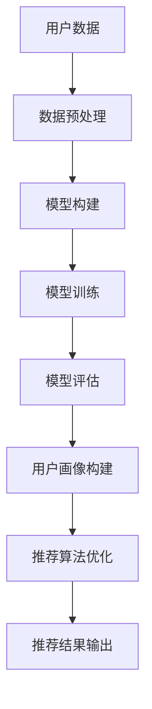

                 

关键词：大模型，推荐系统，用户画像，深度学习，增强学习，算法优化，数据分析，人工智能应用

## 摘要

随着大数据和人工智能技术的快速发展，推荐系统已成为电商平台和社交媒体中不可或缺的一部分。用户画像作为推荐系统的核心组成部分，对于提升推荐效果和用户满意度具有至关重要的意义。本文主要探讨大模型在推荐系统用户画像增强中的应用，通过分析大模型的原理、核心算法及其在实际项目中的实践，深入探讨大模型在用户画像构建中的优势和挑战。本文旨在为推荐系统开发者提供有价值的参考和启示，以推动推荐系统的技术创新和优化。

## 1. 背景介绍

### 1.1 推荐系统的发展历程

推荐系统的发展可以追溯到20世纪90年代，当时主要以基于内容的推荐和协同过滤方法为主。随着互联网的普及和大数据技术的发展，推荐系统逐渐成为电商平台和社交媒体的核心功能之一。从最初的简单算法到如今复杂的大模型应用，推荐系统经历了多次技术迭代和优化。

### 1.2 用户画像的重要性

用户画像是指通过对用户行为、兴趣、偏好等数据进行挖掘和分析，构建出用户在特定场景下的个性化特征。用户画像对于推荐系统的效果具有重要意义：

1. 提高推荐准确性：通过分析用户画像，可以更好地了解用户的真实需求和兴趣，从而提高推荐准确性。
2. 提升用户满意度：个性化的推荐可以更好地满足用户的需求，提升用户满意度。
3. 增强商业价值：通过分析用户画像，企业可以更好地了解用户需求，实现精准营销和产品定位。

### 1.3 大模型的发展与应用

大模型是指具有海量参数和强大计算能力的深度学习模型，如Transformer、BERT、GPT等。随着计算能力的提升和数据的积累，大模型在自然语言处理、计算机视觉、语音识别等领域取得了显著的成果。大模型在推荐系统中的应用，为用户画像的构建提供了新的思路和方法。

## 2. 核心概念与联系

### 2.1 大模型的基本原理

大模型是基于深度学习的神经网络模型，具有以下特点：

1. 海量参数：大模型通常具有数十亿甚至千亿级别的参数，能够捕捉复杂的数据特征。
2. 强大计算能力：大模型需要强大的计算资源进行训练，如GPU、TPU等。
3. 端到端训练：大模型可以端到端地学习数据特征，不需要手动设计特征工程。

### 2.2 大模型与推荐系统的关联

大模型在推荐系统中的应用主要体现在用户画像的构建和推荐算法的优化：

1. 用户画像构建：大模型可以通过分析用户的历史行为、偏好和反馈数据，构建出高精度的用户画像。
2. 推荐算法优化：大模型可以用于优化推荐算法，提高推荐准确性。

### 2.3 大模型的架构与流程

大模型的架构通常包括输入层、隐藏层和输出层。输入层接收用户数据，隐藏层通过多层神经网络进行特征提取和融合，输出层生成推荐结果。大模型的训练过程主要包括数据预处理、模型构建、模型训练和模型评估。

### 2.4 Mermaid 流程图

以下是一个关于大模型在推荐系统用户画像增强中的流程图：



## 3. 核心算法原理 & 具体操作步骤

### 3.1 算法原理概述

大模型在推荐系统用户画像增强中的核心算法包括深度学习、增强学习和迁移学习等。

1. **深度学习**：通过多层神经网络进行特征提取和融合，构建高精度的用户画像。
2. **增强学习**：通过不断调整模型参数，优化推荐算法，提高推荐准确性。
3. **迁移学习**：利用已有的大模型，迁移到新的推荐任务中，提高训练效率和推荐效果。

### 3.2 算法步骤详解

1. **数据收集与预处理**：收集用户行为数据、偏好数据和反馈数据等，对数据集进行清洗、归一化和特征提取。
2. **模型构建**：根据任务需求，选择合适的大模型架构，如Transformer、BERT等。
3. **模型训练**：使用训练数据集对模型进行训练，优化模型参数。
4. **模型评估**：使用验证数据集对模型进行评估，调整模型参数。
5. **用户画像构建**：通过模型输出结果，构建用户画像。
6. **推荐算法优化**：根据用户画像，优化推荐算法，提高推荐准确性。

### 3.3 算法优缺点

**优点**：

1. 提高推荐准确性：大模型可以捕捉到更多的数据特征，提高推荐准确性。
2. 降低开发成本：大模型可以端到端地学习数据特征，减少手动特征工程的工作量。
3. 提高训练效率：大模型可以通过迁移学习快速适应新的推荐任务。

**缺点**：

1. 计算资源消耗大：大模型需要强大的计算资源进行训练。
2. 模型解释性差：大模型的学习过程较为复杂，难以解释。

### 3.4 算法应用领域

大模型在推荐系统用户画像增强中的应用非常广泛，如电商推荐、社交媒体推荐、内容推荐等。

## 4. 数学模型和公式 & 详细讲解 & 举例说明

### 4.1 数学模型构建

大模型的数学模型主要包括神经网络架构、损失函数、优化器等。

1. **神经网络架构**：神经网络架构决定了模型的学习能力和计算复杂度。常见的神经网络架构有卷积神经网络（CNN）、循环神经网络（RNN）和Transformer等。
2. **损失函数**：损失函数用于衡量模型预测结果与真实值之间的差距，常用的损失函数有均方误差（MSE）、交叉熵损失等。
3. **优化器**：优化器用于调整模型参数，使损失函数达到最小值。常见的优化器有梯度下降（GD）、随机梯度下降（SGD）和Adam等。

### 4.2 公式推导过程

以Transformer模型为例，推导其损失函数和优化过程。

1. **损失函数**：

   $$ L = -\sum_{i=1}^{N} \log(p(y_i | \theta)) $$

   其中，$L$ 表示损失函数，$p(y_i | \theta)$ 表示模型预测的概率。

2. **优化过程**：

   使用梯度下降算法优化模型参数，计算过程如下：

   $$ \theta = \theta - \alpha \frac{\partial L}{\partial \theta} $$

   其中，$\alpha$ 表示学习率。

### 4.3 案例分析与讲解

以一个电商推荐系统为例，说明大模型在用户画像构建和推荐算法优化中的应用。

1. **数据收集与预处理**：

   收集用户浏览、购买、评价等行为数据，对数据集进行清洗、归一化和特征提取。

2. **模型构建**：

   选择BERT模型作为用户画像构建的基础模型，对用户数据进行编码，生成用户向量。

3. **模型训练**：

   使用用户向量对BERT模型进行训练，优化模型参数。

4. **用户画像构建**：

   根据模型输出结果，生成高精度的用户画像。

5. **推荐算法优化**：

   使用用户画像优化推荐算法，提高推荐准确性。

## 5. 项目实践：代码实例和详细解释说明

### 5.1 开发环境搭建

搭建一个基于PyTorch的推荐系统项目，需要安装以下依赖：

- PyTorch
- Transformers
- Pandas
- NumPy

### 5.2 源代码详细实现

以下是一个简单的用户画像构建和推荐算法优化的代码实例：

```python
import torch
import torch.nn as nn
from transformers import BertModel
from torch.optim import Adam

# 模型构建
class RecommenderModel(nn.Module):
    def __init__(self):
        super(RecommenderModel, self).__init__()
        self.bert = BertModel.from_pretrained('bert-base-chinese')
        self.fc = nn.Linear(768, 1)  # 输出层神经元个数为1

    def forward(self, input_ids, attention_mask):
        _, pooled_output = self.bert(input_ids=input_ids, attention_mask=attention_mask)
        output = self.fc(pooled_output)
        return output

# 模型训练
def train_model(model, train_loader, optimizer, criterion):
    model.train()
    for batch_idx, (input_ids, attention_mask, labels) in enumerate(train_loader):
        optimizer.zero_grad()
        outputs = model(input_ids, attention_mask)
        loss = criterion(outputs, labels)
        loss.backward()
        optimizer.step()

# 模型评估
def evaluate_model(model, val_loader, criterion):
    model.eval()
    with torch.no_grad():
        total_loss = 0
        for batch_idx, (input_ids, attention_mask, labels) in enumerate(val_loader):
            outputs = model(input_ids, attention_mask)
            loss = criterion(outputs, labels)
            total_loss += loss.item()
    return total_loss / len(val_loader)

# 主函数
def main():
    model = RecommenderModel()
    optimizer = Adam(model.parameters(), lr=0.001)
    criterion = nn.BCELoss()

    train_loader = ...
    val_loader = ...

    for epoch in range(1):
        train_model(model, train_loader, optimizer, criterion)
        val_loss = evaluate_model(model, val_loader, criterion)
        print(f'Val Loss: {val_loss}')

if __name__ == '__main__':
    main()
```

### 5.3 代码解读与分析

以上代码实现了一个基于BERT模型的推荐系统项目，包括模型构建、模型训练和模型评估三个部分。

- **模型构建**：使用BERT模型进行用户向量编码，输出层使用一个全连接层进行分类。
- **模型训练**：使用训练数据集对模型进行训练，优化模型参数。
- **模型评估**：使用验证数据集对模型进行评估，计算损失函数。

## 6. 实际应用场景

### 6.1 电商推荐系统

电商推荐系统通过大模型构建用户画像，实现对用户购买行为的预测和推荐。

### 6.2 社交媒体推荐系统

社交媒体推荐系统通过大模型分析用户兴趣和行为，推荐相关内容。

### 6.3 内容推荐系统

内容推荐系统通过大模型分析用户阅读历史和行为，推荐相关文章。

## 7. 未来应用展望

### 7.1 大模型的优化与发展

随着计算能力的提升和数据量的增加，大模型在推荐系统中的应用将越来越广泛。未来的研究方向包括：

1. 模型压缩：降低大模型的计算复杂度，提高推理速度。
2. 模型解释性：提高大模型的可解释性，使其更容易被理解和应用。

### 7.2 多模态推荐系统

多模态推荐系统将整合多种数据类型，如文本、图像、音频等，提供更个性化的推荐。

### 7.3 跨领域推荐系统

跨领域推荐系统将结合不同领域的数据，为用户提供更全面的推荐。

## 8. 总结：未来发展趋势与挑战

### 8.1 研究成果总结

本文主要探讨了大模型在推荐系统用户画像增强中的应用，分析了其原理、算法和实际应用。通过案例分析，展示了大模型在推荐系统中的优势和挑战。

### 8.2 未来发展趋势

1. 大模型的优化与发展：模型压缩、模型解释性等将成为未来的研究方向。
2. 多模态推荐系统：整合多种数据类型，提供更个性化的推荐。
3. 跨领域推荐系统：结合不同领域的数据，为用户提供更全面的推荐。

### 8.3 面临的挑战

1. 计算资源消耗：大模型需要强大的计算资源进行训练和推理。
2. 数据隐私保护：在构建用户画像时，需要保护用户隐私。
3. 模型解释性：提高大模型的可解释性，使其更容易被理解和应用。

### 8.4 研究展望

未来的研究将继续深入探索大模型在推荐系统中的应用，同时关注多模态推荐系统和跨领域推荐系统的发展。通过不断优化大模型，提高推荐系统的效果和用户体验，为人工智能应用领域带来更多创新和突破。

## 9. 附录：常见问题与解答

### 9.1 大模型在推荐系统中的优势有哪些？

大模型在推荐系统中的优势包括：

1. 提高推荐准确性：大模型可以捕捉到更多的数据特征，提高推荐准确性。
2. 降低开发成本：大模型可以端到端地学习数据特征，减少手动特征工程的工作量。
3. 提高训练效率：大模型可以通过迁移学习快速适应新的推荐任务。

### 9.2 大模型的计算资源需求大吗？

是的，大模型通常需要强大的计算资源进行训练和推理。特别是在训练阶段，大模型需要大量的GPU或TPU资源。然而，随着云计算和GPU技术的发展，计算资源的获取变得更加便捷和高效。

### 9.3 如何保护用户隐私？

在构建用户画像时，可以采取以下措施来保护用户隐私：

1. 数据脱敏：对用户数据进行脱敏处理，如加密、掩码等。
2. 数据匿名化：对用户数据进行匿名化处理，使其无法直接关联到具体用户。
3. 数据加密：对用户数据进行加密处理，确保数据在传输和存储过程中的安全性。

## 作者署名

作者：禅与计算机程序设计艺术 / Zen and the Art of Computer Programming
----------------------------------------------------------------

以上就是本文的完整内容，希望对您有所帮助。如果您有任何疑问或建议，请随时在评论区留言，我会尽快回复您。祝您阅读愉快！

