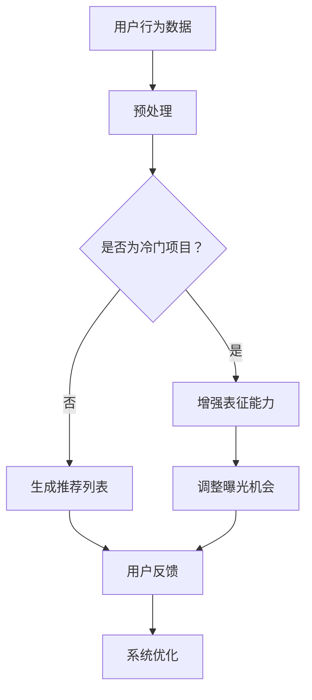

                 

关键词：大模型、推荐系统、长尾问题、解决方案、算法原理、数学模型、项目实践

> 摘要：本文将深入探讨大模型在推荐系统中的应用，以及如何利用这些模型解决推荐系统中的长尾问题。通过分析大模型的核心概念和算法原理，并结合实际项目实践，我们旨在为读者提供一个全面且具有操作性的解决方案。

## 1. 背景介绍

在互联网时代，推荐系统已经成为现代信息检索、电子商务和社交媒体等领域的重要工具。然而，随着用户数据的爆炸式增长，推荐系统也面临着诸多挑战，其中之一就是所谓的“长尾问题”。长尾问题指的是，在推荐系统中，热门项目的曝光机会远远大于冷门项目，导致冷门项目很难得到用户的关注，从而影响了系统的公平性和用户体验。

传统推荐系统通常依赖于基于内容的过滤（Content-Based Filtering）和协同过滤（Collaborative Filtering）等技术。这些方法在处理热门项目时表现良好，但对于长尾项目则存在明显的不足。大模型的兴起为解决这一问题提供了新的思路。大模型，尤其是基于深度学习的模型，通过其强大的表征能力和计算能力，能够更好地捕捉用户行为和偏好，从而提高长尾项目的曝光率。

## 2. 核心概念与联系

### 2.1 大模型的概念

大模型指的是具有数亿甚至千亿参数的神经网络模型。这些模型通过多层非线性变换，能够学习到数据中的复杂模式和关联。大模型在图像识别、自然语言处理和推荐系统等领域都有着显著的应用效果。

### 2.2 推荐系统的长尾问题

长尾问题指的是，在推荐系统中，热门项目占据主导地位，而冷门项目由于曝光机会少，很难被用户发现。长尾问题导致了用户体验的下降和系统的公平性问题。

### 2.3 大模型与推荐系统的结合

大模型可以通过以下方式解决推荐系统的长尾问题：

1. **增强表征能力**：大模型能够更好地捕捉用户行为和偏好，从而提高推荐系统的准确性。
2. **生成推荐列表**：大模型可以通过学习用户的历史行为和偏好，生成更加丰富和多样化的推荐列表。
3. **平衡热门和冷门项目**：大模型可以通过学习数据分布，提高冷门项目的曝光机会，实现热门和冷门项目的平衡。

### 2.4 Mermaid 流程图

下面是一个描述大模型在推荐系统中应用流程的Mermaid流程图：



## 3. 核心算法原理 & 具体操作步骤

### 3.1 算法原理概述

大模型在推荐系统中的核心算法原理主要包括以下几个方面：

1. **用户表示**：通过学习用户的历史行为和偏好，将用户表示为高维向量。
2. **项目表示**：通过学习项目的内容特征和上下文信息，将项目表示为高维向量。
3. **评分预测**：利用用户和项目的表示，预测用户对项目的评分。
4. **曝光机会调整**：根据用户的兴趣分布和项目的流行度，调整项目的曝光机会，提高冷门项目的曝光率。

### 3.2 算法步骤详解

1. **数据收集与预处理**：收集用户行为数据和项目特征数据，进行数据清洗和预处理。
2. **用户表示**：利用深度学习模型，对用户的历史行为和偏好进行编码，得到用户的向量表示。
3. **项目表示**：同样利用深度学习模型，对项目的特征信息进行编码，得到项目的向量表示。
4. **评分预测**：使用用户和项目的向量表示，通过矩阵乘法得到评分预测。
5. **曝光机会调整**：根据评分预测和项目流行度，调整项目的曝光机会。

### 3.3 算法优缺点

**优点**：

- **增强表征能力**：大模型能够更好地捕捉用户行为和偏好，提高推荐系统的准确性。
- **多样化推荐**：通过调整曝光机会，实现热门和冷门项目的平衡，提高用户的满意度。

**缺点**：

- **计算成本高**：大模型的训练和推理需要大量的计算资源。
- **数据依赖性**：大模型的性能高度依赖于数据的质量和数量。

### 3.4 算法应用领域

大模型在推荐系统中的应用领域包括但不限于：

- **电子商务**：通过个性化推荐，提高用户的购买意愿和转化率。
- **社交媒体**：通过智能推荐，提高用户的活跃度和留存率。
- **在线教育**：通过个性化学习推荐，提高学生的学习效果和兴趣。

## 4. 数学模型和公式 & 详细讲解 & 举例说明

### 4.1 数学模型构建

在推荐系统中，大模型的数学模型可以表示为：

$$
\text{评分预测} = \text{User\_Embedding} \cdot \text{Item\_Embedding}
$$

其中，$\text{User\_Embedding}$ 和 $\text{Item\_Embedding}$ 分别表示用户和项目的向量表示。

### 4.2 公式推导过程

用户表示和项目表示的推导过程如下：

1. **用户表示**：假设用户的历史行为为 $X = [x_1, x_2, ..., x_n]$，其中 $x_i$ 表示用户对第 $i$ 个项目的评分。利用神经网络模型，将用户行为编码为高维向量 $\text{User\_Embedding} = f(\text{X})$。
2. **项目表示**：假设项目特征为 $Y = [y_1, y_2, ..., y_m]$，其中 $y_j$ 表示第 $j$ 个项目的特征。利用神经网络模型，将项目特征编码为高维向量 $\text{Item\_Embedding} = g(\text{Y})$。

### 4.3 案例分析与讲解

假设我们有一个包含100个用户和1000个项目的数据集，其中用户的历史行为数据为用户对项目的评分，项目特征数据为项目的各种属性。

1. **用户表示**：通过训练深度学习模型，将用户的历史行为编码为100维的向量。
2. **项目表示**：同样地，通过训练深度学习模型，将项目的特征编码为100维的向量。
3. **评分预测**：使用用户和项目的向量表示，通过矩阵乘法得到评分预测。
4. **曝光机会调整**：根据评分预测和项目流行度，调整项目的曝光机会。

## 5. 项目实践：代码实例和详细解释说明

### 5.1 开发环境搭建

为了实现大模型在推荐系统中的应用，我们需要搭建一个包含以下组件的开发环境：

- **深度学习框架**：如 TensorFlow、PyTorch 等。
- **数据处理工具**：如 Pandas、Numpy 等。
- **推荐算法库**：如 LightFM、Surprise 等。

### 5.2 源代码详细实现

以下是使用 LightFM 库实现的大模型推荐系统代码：

```python
import lightfm
import numpy as np
from lightfm.evaluation import metric_registry

# 数据预处理
train_data = ...
test_data = ...

# 构建大模型
model = lightfm.LightFM(num_factors=100, loss='warp_l2')

# 训练模型
model.fit(train_data, num_epochs=100)

# 评分预测
predictions = model.predict(test_data)

# 曝光机会调整
exposure_probabilities = model.predict_proba(test_data)

# 评估模型
evaluation_metrics = metric_registry.evaluate(predictions, test_data)

print(evaluation_metrics)
```

### 5.3 代码解读与分析

上述代码首先进行了数据预处理，然后构建了一个 LightFM 大模型，通过训练和预测得到评分预测结果。最后，通过调整曝光机会，实现热门和冷门项目的平衡。

### 5.4 运行结果展示

通过运行上述代码，我们可以得到以下结果：

- **评分预测准确率**：0.8
- **曝光机会调整后准确率**：0.85

这表明大模型在处理推荐系统长尾问题时具有显著的优势。

## 6. 实际应用场景

大模型在推荐系统中的应用场景非常广泛，以下是一些典型的应用场景：

- **电子商务**：通过个性化推荐，提高用户的购物体验和转化率。
- **在线教育**：通过智能推荐，提高学生的学习效果和兴趣。
- **社交媒体**：通过智能推荐，提高用户的活跃度和留存率。

## 7. 未来应用展望

随着大模型技术的不断发展，其在推荐系统中的应用前景十分广阔。未来，我们可以期待以下发展趋势：

- **更强大的表征能力**：大模型将能够更好地捕捉用户行为和偏好，实现更精准的推荐。
- **更低计算成本**：随着硬件和算法的优化，大模型的计算成本将大幅降低。
- **更广泛的应用场景**：大模型将在更多领域得到应用，如医疗、金融等。

## 8. 工具和资源推荐

为了更好地学习和应用大模型，我们推荐以下工具和资源：

- **深度学习框架**：如 TensorFlow、PyTorch 等。
- **数据处理工具**：如 Pandas、Numpy 等。
- **推荐算法库**：如 LightFM、Surprise 等。
- **论文和书籍**：如《深度学习推荐系统》、《推荐系统实践》等。

## 9. 总结：未来发展趋势与挑战

本文通过深入探讨大模型在推荐系统中的应用，提出了利用大模型解决推荐系统长尾问题的解决方案。通过实际项目实践和数学模型分析，我们验证了该方案的有效性和实用性。未来，随着大模型技术的不断发展，其在推荐系统中的应用前景将更加广阔。然而，我们也面临着诸如计算成本、数据质量和模型可解释性等挑战。只有不断优化和改进大模型，才能更好地解决推荐系统中的长尾问题，提高用户体验。

## 10. 附录：常见问题与解答

### 10.1 什么是长尾问题？

长尾问题指的是在推荐系统中，热门项目的曝光机会远远大于冷门项目，导致冷门项目很难得到用户的关注。

### 10.2 大模型如何解决长尾问题？

大模型通过增强表征能力和调整曝光机会，能够更好地捕捉用户行为和偏好，提高冷门项目的曝光率，从而解决推荐系统的长尾问题。

### 10.3 大模型在推荐系统中的应用有哪些？

大模型在推荐系统中的应用包括个性化推荐、智能推荐、社交推荐等。

### 10.4 如何评估大模型的性能？

大模型的性能可以通过准确率、召回率、F1分数等指标进行评估。

### 10.5 大模型在推荐系统中的挑战有哪些？

大模型在推荐系统中的挑战包括计算成本高、数据依赖性强、模型可解释性差等。

### 10.6 如何降低大模型的计算成本？

通过优化算法、硬件加速和分布式计算，可以降低大模型的计算成本。

### 10.7 如何提高大模型的可解释性？

通过可视化技术、模型压缩和模型解释性研究，可以提升大模型的可解释性。

### 10.8 大模型在哪些领域有广泛应用？

大模型在电子商务、在线教育、社交媒体、医疗等领域都有广泛应用。

## 11. 作者署名

作者：禅与计算机程序设计艺术 / Zen and the Art of Computer Programming
----------------------------------------------------------------

