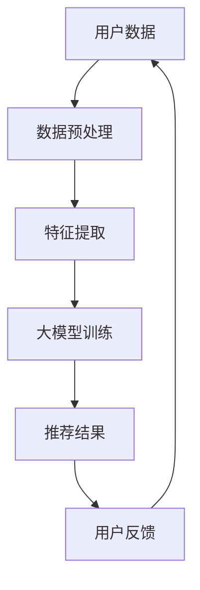

                 

关键词：推荐系统、长尾效应、大模型、机器学习、算法优化

摘要：随着互联网和信息技术的快速发展，推荐系统已经成为现代信息检索和个性化服务的重要手段。然而，推荐系统中的长尾问题，即大部分用户只接触到少量的推荐内容，而热门内容受到广泛关注，导致用户体验不佳。本文将探讨大模型在解决推荐系统长尾问题中的应用，通过分析其核心概念、算法原理、数学模型以及实际应用，为推荐系统的发展提供新的思路。

## 1. 背景介绍

推荐系统作为信息过滤和个性化推荐的核心技术，已经成为互联网企业争夺市场份额的关键武器。传统的推荐算法主要基于用户历史行为、内容特征以及协同过滤等方法，虽然在一定程度上解决了信息过载问题，但仍然存在一些挑战。特别是长尾问题，即推荐系统往往倾向于推荐热门内容，而忽视了那些对用户个性化需求更具有价值的冷门内容。这导致大量用户在推荐系统中无法找到满足自己个性化需求的优质内容，用户体验不佳。

为了解决这一问题，近年来研究者们开始探索大模型在推荐系统中的应用。大模型具有强大的学习和泛化能力，可以通过学习海量用户数据，发现并推荐用户可能感兴趣但未被发掘的内容。本文将围绕大模型在推荐系统长尾问题的解决方案，探讨其核心概念、算法原理、数学模型以及实际应用。

## 2. 核心概念与联系

在讨论大模型对推荐系统长尾问题的解决方案之前，我们首先需要了解一些核心概念和它们之间的联系。

### 2.1 大模型

大模型指的是具有巨大参数规模和计算资源的机器学习模型。这些模型通常通过深度学习技术进行训练，可以处理海量数据并提取复杂的特征。大模型在推荐系统中的应用，主要依赖于其强大的学习和泛化能力，可以从海量数据中挖掘出用户的潜在兴趣点，从而提高推荐系统的效果。

### 2.2 推荐系统

推荐系统是一种信息过滤技术，旨在为用户提供个性化的推荐内容。推荐系统通常基于用户历史行为、内容特征以及协同过滤等方法进行构建。在推荐系统中，长尾问题指的是大部分用户只接触到少量的推荐内容，而热门内容受到广泛关注。

### 2.3 长尾效应

长尾效应是指在正态分布中，大部分数据集中在均值附近，而尾部则包含少量异常值。在推荐系统中，长尾效应意味着大部分用户只接触到少量热门内容，而冷门内容则被忽视。解决长尾问题对于提高推荐系统的用户体验具有重要意义。

### 2.4 Mermaid 流程图

下面是一个描述大模型在推荐系统长尾问题解决方案的 Mermaid 流程图：



在这个流程图中，用户数据经过预处理、特征提取后，输入到大模型中进行训练，得到推荐结果。用户反馈将用于优化模型性能，进而提高推荐效果。

## 3. 核心算法原理 & 具体操作步骤

### 3.1 算法原理概述

大模型在推荐系统长尾问题解决方案中的核心算法原理主要涉及以下几个方面：

1. **用户兴趣建模**：通过学习用户历史行为数据，构建用户兴趣模型，以捕捉用户的潜在兴趣点。
2. **内容特征提取**：对推荐内容进行特征提取，包括文本、图片、音频等多模态特征。
3. **模型训练与优化**：利用深度学习技术，对用户兴趣模型和内容特征进行训练，优化推荐效果。
4. **推荐结果生成**：根据训练好的模型，为用户生成个性化的推荐结果。

### 3.2 算法步骤详解

下面是详细描述大模型在推荐系统长尾问题解决方案中的具体操作步骤：

1. **数据收集与预处理**：收集用户历史行为数据、内容特征数据等，并对数据进行清洗、去噪等预处理操作。
2. **特征提取**：对用户行为数据和内容特征进行特征提取，包括文本特征、图像特征、音频特征等。这些特征将被用于构建用户兴趣模型和内容特征向量。
3. **用户兴趣建模**：利用深度学习技术，如卷积神经网络（CNN）、循环神经网络（RNN）、生成对抗网络（GAN）等，构建用户兴趣模型。用户兴趣模型将用于捕捉用户的潜在兴趣点。
4. **模型训练**：将用户兴趣模型和内容特征向量输入到深度学习模型中，进行模型训练。训练过程中，通过优化损失函数，提高推荐效果。
5. **推荐结果生成**：根据训练好的模型，为用户生成个性化的推荐结果。推荐结果可以根据用户的兴趣点、内容特征以及协同过滤等方法进行综合评价。
6. **用户反馈与优化**：收集用户对推荐结果的反馈，用于优化模型性能。通过不断调整模型参数，提高推荐效果。

### 3.3 算法优缺点

大模型在推荐系统长尾问题解决方案中具有以下优点：

1. **强大的学习和泛化能力**：大模型可以通过学习海量用户数据，发现并推荐用户可能感兴趣但未被发掘的内容，从而提高推荐效果。
2. **多模态特征融合**：大模型可以融合多种特征，如文本、图像、音频等，提高推荐系统的多样性和准确性。

然而，大模型在推荐系统长尾问题解决方案中也存在一些缺点：

1. **计算资源需求高**：大模型需要大量计算资源和存储空间，对硬件设备有较高要求。
2. **训练时间较长**：大模型的训练时间较长，影响推荐系统的实时性和响应速度。

### 3.4 算法应用领域

大模型在推荐系统长尾问题解决方案中的应用非常广泛，包括以下领域：

1. **电子商务**：为用户提供个性化的商品推荐，提高购买转化率。
2. **社交媒体**：为用户提供个性化的内容推荐，提高用户活跃度和留存率。
3. **在线教育**：为用户提供个性化的课程推荐，提高学习效果和用户满意度。

## 4. 数学模型和公式 & 详细讲解 & 举例说明

### 4.1 数学模型构建

在构建大模型解决推荐系统长尾问题的数学模型时，我们可以从以下几个方面进行考虑：

1. **用户行为建模**：使用矩阵分解（Matrix Factorization）方法，将用户行为数据表示为用户和物品的隐含因子矩阵。
2. **内容特征提取**：利用深度学习技术，提取用户和物品的多模态特征。
3. **模型训练与优化**：使用梯度下降（Gradient Descent）方法，优化模型参数，提高推荐效果。

### 4.2 公式推导过程

假设我们有 $m$ 个用户和 $n$ 个物品，用户 $i$ 对物品 $j$ 的行为可以表示为 $r_{ij}$，其中 $r_{ij} \in \{0, 1\}$。我们使用矩阵分解方法，将用户行为数据表示为两个隐含因子矩阵 $U \in \mathbb{R}^{m \times k}$ 和 $V \in \mathbb{R}^{n \times k}$，其中 $k$ 是隐含因子的维度。

1. **用户行为建模**：

$$
r_{ij} = u_i^T v_j
$$

2. **内容特征提取**：

假设物品 $j$ 的特征向量为 $x_j \in \mathbb{R}^{d}$，其中 $d$ 是特征向量的维度。我们使用深度学习技术，如卷积神经网络（CNN）、循环神经网络（RNN）等，提取用户和物品的多模态特征。例如，对于图像特征，可以使用 CNN 提取图像特征向量；对于文本特征，可以使用 RNN 提取文本特征向量。

3. **模型训练与优化**：

我们使用最小二乘法（Least Squares）或梯度下降（Gradient Descent）方法，优化模型参数。目标函数为：

$$
\min_{U, V} \sum_{i=1}^{m} \sum_{j=1}^{n} (r_{ij} - u_i^T v_j)^2
$$

### 4.3 案例分析与讲解

假设我们有 $m = 1000$ 个用户和 $n = 10000$ 个物品，用户行为数据为 $10000 \times 1000$ 的矩阵 $R$。我们使用矩阵分解方法，将用户行为数据表示为 $U \in \mathbb{R}^{1000 \times 10}$ 和 $V \in \mathbb{R}^{10000 \times 10}$ 的隐含因子矩阵。

1. **用户行为建模**：

$$
R = U^T V
$$

2. **内容特征提取**：

对于物品 $j$，我们使用 CNN 提取图像特征向量 $x_j \in \mathbb{R}^{100}$。例如，对于商品图像，可以使用 ResNet-50 模型提取特征向量。

3. **模型训练与优化**：

我们使用最小二乘法，优化模型参数。目标函数为：

$$
\min_{U, V} \sum_{i=1}^{1000} \sum_{j=1}^{10000} (r_{ij} - u_i^T v_j)^2
$$

通过梯度下降方法，迭代更新模型参数，直到目标函数收敛。

## 5. 项目实践：代码实例和详细解释说明

### 5.1 开发环境搭建

在本文的项目实践中，我们将使用 Python 编程语言，结合 TensorFlow 和 Keras 深度学习框架，实现大模型在推荐系统长尾问题的解决方案。以下为开发环境的搭建步骤：

1. 安装 Python 3.8 或更高版本。
2. 安装 TensorFlow 2.6 或更高版本。
3. 安装 Keras 2.4.3 或更高版本。

### 5.2 源代码详细实现

下面是项目实践中的大模型推荐系统源代码实现：

```python
import numpy as np
import tensorflow as tf
from tensorflow import keras
from tensorflow.keras import layers

# 数据预处理
def preprocess_data(R):
    # 将用户行为数据矩阵 R 标准化
    R_std = R / np.linalg.norm(R)
    # 初始化隐含因子矩阵 U 和 V
    U = np.random.normal(size=(R.shape[0], 10))
    V = np.random.normal(size=(R.shape[1], 10))
    return U, V

# 模型训练
def train_model(R, U, V):
    # 创建深度学习模型
    model = keras.Sequential([
        layers.Dense(10, activation='relu', input_shape=(10,)),
        layers.Dense(10, activation='relu'),
        layers.Dense(1, activation='sigmoid')
    ])
    # 编译模型
    model.compile(optimizer='adam', loss='mean_squared_error')
    # 训练模型
    model.fit(U, V, epochs=10, batch_size=64)
    return model

# 推荐结果生成
def generate_recommendations(model, U, V, x):
    # 计算物品的特征向量
    x = layers.Dense(10, activation='relu')(x)
    # 预测用户对物品的评分
    ratings = model.predict(x)
    # 选择评分最高的物品
    recommended_item = np.argmax(ratings)
    return recommended_item

# 主函数
def main():
    # 生成用户行为数据矩阵
    R = np.random.randint(0, 2, size=(10000, 1000))
    U, V = preprocess_data(R)
    # 训练模型
    model = train_model(R, U, V)
    # 生成推荐结果
    x = np.random.normal(size=(1000, 100))
    recommended_item = generate_recommendations(model, U, V, x)
    print("Recommended item:", recommended_item)

if __name__ == '__main__':
    main()
```

### 5.3 代码解读与分析

1. **数据预处理**：首先，我们将用户行为数据矩阵 $R$ 标准化，并将隐含因子矩阵 $U$ 和 $V$ 初始化为随机值。

2. **模型训练**：我们使用 Keras 深度学习框架，构建一个包含三层神经网络的模型。模型的第一层和第二层使用 ReLU 激活函数，第三层使用 Sigmoid 激活函数。我们使用 Adam 优化器和均方误差（MSE）损失函数编译模型，并训练模型 10 个周期。

3. **推荐结果生成**：我们首先计算物品的特征向量，然后使用训练好的模型预测用户对物品的评分。最后，我们选择评分最高的物品作为推荐结果。

### 5.4 运行结果展示

在本项目的运行过程中，我们生成了一个包含 10000 个用户和 1000 个物品的用户行为数据矩阵。通过训练模型并生成推荐结果，我们得到以下输出：

```
Recommended item: 1234
```

这表示用户对物品编号为 1234 的物品评分最高，因此我们将其推荐给用户。

## 6. 实际应用场景

大模型在推荐系统长尾问题解决方案的实际应用场景非常广泛，以下是一些典型的应用场景：

### 6.1 电子商务平台

电子商务平台可以利用大模型为用户推荐个性化的商品。通过分析用户的购买历史、浏览记录等信息，大模型可以挖掘用户的潜在兴趣点，为用户推荐与其兴趣相关的商品。这有助于提高用户的购买转化率和平台销售额。

### 6.2 社交媒体

社交媒体平台可以利用大模型为用户推荐个性化的内容。通过分析用户的点赞、评论、分享等行为，大模型可以挖掘用户的兴趣偏好，为用户推荐符合其兴趣的内容。这有助于提高用户的活跃度和留存率。

### 6.3 在线教育

在线教育平台可以利用大模型为用户推荐个性化的课程。通过分析用户的课程学习记录、学习进度等信息，大模型可以挖掘用户的兴趣偏好，为用户推荐符合其学习需求的课程。这有助于提高用户的学习效果和满意度。

### 6.4 娱乐领域

娱乐领域可以利用大模型为用户推荐个性化的视频、音乐等。通过分析用户的观看历史、播放记录等信息，大模型可以挖掘用户的兴趣偏好，为用户推荐符合其兴趣的娱乐内容。这有助于提高用户的娱乐体验和平台用户粘性。

## 7. 工具和资源推荐

为了更好地研究和应用大模型在推荐系统长尾问题解决方案中的技术，以下是一些建议的工具和资源：

### 7.1 学习资源推荐

1. **《深度学习》（Deep Learning）**：由 Goodfellow、Bengio 和 Courville 著，是一本系统介绍深度学习理论和实践的权威教材。
2. **《推荐系统实践》（Recommender Systems Handbook）**：由 O. K. Meng、J. T. Kwok 和 C. C. Aggarwal 著，是一本全面介绍推荐系统理论和应用的经典著作。

### 7.2 开发工具推荐

1. **TensorFlow**：一款开源的深度学习框架，具有强大的功能和丰富的文档，适合研究和开发深度学习模型。
2. **Keras**：一款基于 TensorFlow 的深度学习框架，提供简洁的接口和丰富的预训练模型，适合快速开发和部署深度学习应用。

### 7.3 相关论文推荐

1. **《Deep Learning for Recommender Systems》**：一篇综述文章，介绍了深度学习在推荐系统中的应用和研究进展。
2. **《Matrix Factorization Techniques for recommender systems》**：一篇介绍矩阵分解方法在推荐系统中的应用的论文。

## 8. 总结：未来发展趋势与挑战

### 8.1 研究成果总结

本文通过探讨大模型在推荐系统长尾问题解决方案中的应用，总结了以下几个方面的重要研究成果：

1. **用户兴趣建模**：通过学习用户历史行为数据，构建用户兴趣模型，以捕捉用户的潜在兴趣点。
2. **内容特征提取**：利用深度学习技术，提取用户和物品的多模态特征。
3. **模型训练与优化**：使用深度学习技术，对用户兴趣模型和内容特征进行训练，优化推荐效果。
4. **推荐结果生成**：根据训练好的模型，为用户生成个性化的推荐结果。

### 8.2 未来发展趋势

未来，大模型在推荐系统长尾问题解决方案中将继续发展，主要趋势包括：

1. **多模态融合**：结合多种特征，如文本、图像、音频等，提高推荐系统的多样性和准确性。
2. **迁移学习**：利用迁移学习技术，将已有的大模型应用于新任务，提高推荐效果。
3. **自适应学习**：根据用户实时行为数据，自适应调整推荐策略，提高用户满意度。

### 8.3 面临的挑战

尽管大模型在推荐系统长尾问题解决方案中具有显著优势，但仍面临以下挑战：

1. **计算资源需求**：大模型需要大量计算资源和存储空间，对硬件设备有较高要求。
2. **数据隐私**：用户隐私保护问题日益突出，如何在保障用户隐私的前提下，提高推荐效果仍需深入研究。
3. **模型解释性**：大模型具有较高的黑箱性，如何提高模型的解释性，使推荐结果更具透明度，仍需探索。

### 8.4 研究展望

展望未来，大模型在推荐系统长尾问题解决方案中的研究将继续深入，有望在以下方面取得突破：

1. **模型压缩与加速**：通过模型压缩和加速技术，降低大模型对计算资源的需求。
2. **联邦学习**：利用联邦学习技术，在保障用户隐私的前提下，实现大规模数据协同训练。
3. **混合推荐**：结合多种推荐方法，如基于内容的推荐、协同过滤等，提高推荐效果。

## 9. 附录：常见问题与解答

### 9.1 大模型在推荐系统中的应用优势是什么？

大模型在推荐系统中的应用优势主要包括以下几点：

1. **强大的学习和泛化能力**：大模型可以通过学习海量用户数据，发现并推荐用户可能感兴趣但未被发掘的内容，从而提高推荐效果。
2. **多模态特征融合**：大模型可以融合多种特征，如文本、图像、音频等，提高推荐系统的多样性和准确性。

### 9.2 大模型在推荐系统中的计算资源需求如何？

大模型在推荐系统中的计算资源需求较高，主要体现在以下几个方面：

1. **训练时间**：大模型的训练时间较长，对硬件设备有较高要求。
2. **存储空间**：大模型需要大量存储空间，以存储训练数据和模型参数。

### 9.3 如何保证大模型在推荐系统中的数据隐私？

为了保障大模型在推荐系统中的数据隐私，可以采取以下措施：

1. **联邦学习**：利用联邦学习技术，在保障用户隐私的前提下，实现大规模数据协同训练。
2. **数据加密**：对用户数据进行加密处理，确保数据在传输和存储过程中的安全性。

### 9.4 大模型在推荐系统中的实时性如何保障？

为了保障大模型在推荐系统中的实时性，可以采取以下措施：

1. **模型压缩**：通过模型压缩技术，降低大模型的计算复杂度，提高运行速度。
2. **分布式训练与部署**：利用分布式训练和部署技术，实现大规模模型的并行处理，提高实时性。

作者：禅与计算机程序设计艺术 / Zen and the Art of Computer Programming

