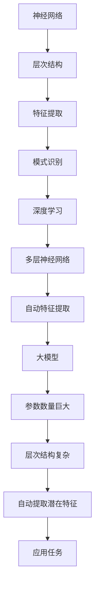

                 

关键词：大模型、AI革命、深度学习、神经网络、数据驱动、算法改进

> 摘要：本文深入探讨了大规模模型在人工智能领域的革命性变革，从历史背景、核心概念、算法原理到实际应用，全面解析了其带来的深远影响和未来发展趋势。作者结合实际案例，探讨了大规模模型在各个领域的广泛应用，并提出了未来发展面临的挑战与展望。

## 1. 背景介绍

### 大模型的兴起

自20世纪80年代以来，人工智能（AI）领域经历了多次变革。早期的专家系统依赖于预先编程的规则和知识库，但由于其复杂性和脆弱性，难以适应现实世界中的动态变化。随着计算能力的提升和数据的积累，机器学习逐渐成为主流。特别是在深度学习领域，神经网络模型取得了显著进展，使得计算机在图像识别、语音识别、自然语言处理等方面表现出惊人的能力。

### 大模型的定义与特点

大模型，通常指的是参数数量巨大、模型结构复杂的神经网络。这些模型能够通过大量数据的学习，自动提取数据中的潜在特征，并应用于各种任务。大模型的主要特点包括：

- **参数数量巨大**：大模型通常拥有数百万至数十亿个参数，这使得它们能够捕捉到数据中的复杂模式。
- **层次结构复杂**：大模型的层次结构通常较深，能够有效地提取多层次的抽象特征。
- **数据需求大**：大模型需要大量的数据来训练，以充分理解数据的分布和特征。

### 大模型的兴起原因

大模型的兴起主要得益于以下几个方面：

- **计算能力的提升**：高性能计算硬件的发展，尤其是GPU和TPU的普及，为训练大规模模型提供了强大的计算支持。
- **数据获取的便利性**：互联网和大数据技术的兴起，使得海量数据变得触手可及，为模型的训练提供了充足的素材。
- **算法的改进**：梯度下降等优化算法的改进，使得大规模模型的训练变得更加高效。

## 2. 核心概念与联系

### 神经网络

神经网络是模仿人脑工作原理的一种计算模型，由大量的神经元组成，通过层次结构进行特征提取和模式识别。神经网络的核心在于其层次结构，每一层都能够提取不同层次的抽象特征，从而实现复杂的任务。

### 深度学习

深度学习是神经网络的一种特殊形式，其特点在于层次结构的深度。深度学习模型通过多层次的神经网络，自动提取数据中的复杂特征，并应用于各种任务，如图像识别、语音识别和自然语言处理等。

### 大模型

大模型是深度学习的一个重要发展方向，其核心在于参数数量的巨大和层次结构的复杂。大模型通过大规模的数据训练，能够自动提取数据中的潜在特征，并应用于各种任务。

### Mermaid 流程图

下面是神经网络、深度学习和大模型之间的联系 Mermaid 流程图：



## 3. 核心算法原理 & 具体操作步骤

### 3.1 算法原理概述

大模型的算法原理主要基于深度学习和神经网络。深度学习通过多层神经网络进行特征提取，每一层都能够提取不同层次的抽象特征。大模型则在此基础上，通过增加参数数量和层次结构的复杂度，进一步提升特征提取的能力。

### 3.2 算法步骤详解

1. **数据预处理**：首先，对输入数据进行预处理，包括归一化、去噪等操作，以确保数据的质量和一致性。
2. **模型设计**：根据任务需求，设计合适的神经网络结构，包括层数、每层的神经元数量和激活函数等。
3. **训练模型**：使用大量的训练数据，通过反向传播算法，不断调整模型参数，使得模型能够准确预测数据。
4. **评估模型**：使用验证集和测试集，对模型进行评估，确保模型具有良好的泛化能力。
5. **调整模型**：根据评估结果，对模型进行调整，如增加层数、调整参数等，以提升模型性能。

### 3.3 算法优缺点

**优点**：

- **强大的特征提取能力**：大模型通过多层神经网络，能够自动提取数据中的复杂特征，适用于各种任务。
- **高效的泛化能力**：大模型通过大规模的数据训练，能够有效避免过拟合现象，具有良好的泛化能力。

**缺点**：

- **训练成本高**：大模型需要大量的数据和计算资源，训练成本较高。
- **模型复杂度高**：大模型的结构复杂，理解和解释难度较大。

### 3.4 算法应用领域

大模型在多个领域得到了广泛应用，包括：

- **图像识别**：如人脸识别、物体检测等。
- **语音识别**：如语音助手、自动字幕等。
- **自然语言处理**：如机器翻译、文本分类等。
- **推荐系统**：如商品推荐、内容推荐等。

## 4. 数学模型和公式 & 详细讲解 & 举例说明

### 4.1 数学模型构建

大模型的数学模型主要基于多层感知机（MLP）和卷积神经网络（CNN）。下面分别介绍这两种模型的基本数学公式。

#### 4.1.1 多层感知机（MLP）

多层感知机是一种前馈神经网络，其数学模型可以表示为：

$$
Z = \sigma(WX + b)
$$

其中，$Z$ 表示输出，$\sigma$ 表示激活函数，$W$ 表示权重矩阵，$X$ 表示输入，$b$ 表示偏置。

#### 4.1.2 卷积神经网络（CNN）

卷积神经网络是一种用于图像处理的神经网络，其数学模型可以表示为：

$$
Z = \sigma(\text{Conv}(X) + b)
$$

其中，$\text{Conv}(X)$ 表示卷积操作，$\sigma$ 表示激活函数，$b$ 表示偏置。

### 4.2 公式推导过程

下面以多层感知机为例，介绍其数学公式的推导过程。

#### 4.2.1 输出层

对于输出层，假设有一个神经元，其输出可以表示为：

$$
Z = \sigma(\sum_{i=1}^{n} w_{i}x_{i} + b)
$$

其中，$w_{i}$ 表示输入层的权重，$x_{i}$ 表示输入，$b$ 表示偏置。

#### 4.2.2 隐藏层

对于隐藏层，其输出可以表示为：

$$
Z = \sigma(\sum_{j=1}^{m} w_{j}z_{j} + b')
$$

其中，$w_{j}$ 表示隐藏层的权重，$z_{j}$ 表示隐藏层的输出，$b'$ 表示偏置。

#### 4.2.3 输入层

对于输入层，其输出可以表示为：

$$
X = x
$$

其中，$x$ 表示输入。

### 4.3 案例分析与讲解

#### 4.3.1 图像识别

假设我们有一个二分类图像识别问题，输入图像为 $28 \times 28$ 的像素矩阵，我们需要将图像分类为两类中的某一类。

1. **输入层**：输入图像像素矩阵，每个像素点表示为 $28 \times 28$ 的向量。
2. **隐藏层**：通过卷积神经网络提取图像的局部特征，如边缘、纹理等。
3. **输出层**：通过多层感知机对图像进行分类。

具体实现如下：

```python
import tensorflow as tf
from tensorflow.keras.models import Sequential
from tensorflow.keras.layers import Conv2D, Flatten, Dense

# 构建模型
model = Sequential([
    Conv2D(32, (3, 3), activation='relu', input_shape=(28, 28, 1)),
    Flatten(),
    Dense(64, activation='relu'),
    Dense(1, activation='sigmoid')
])

# 编译模型
model.compile(optimizer='adam', loss='binary_crossentropy', metrics=['accuracy'])

# 训练模型
model.fit(x_train, y_train, epochs=10, batch_size=32, validation_data=(x_val, y_val))
```

## 5. 项目实践：代码实例和详细解释说明

### 5.1 开发环境搭建

在开始项目实践之前，我们需要搭建合适的开发环境。以下是具体的步骤：

1. **安装Python**：确保Python版本为3.7及以上。
2. **安装TensorFlow**：使用以下命令安装TensorFlow：

   ```bash
   pip install tensorflow
   ```

3. **安装Keras**：TensorFlow附带Keras，因此无需单独安装。

### 5.2 源代码详细实现

以下是一个简单的图像识别项目，实现了从输入图像到分类的整个过程。

```python
import tensorflow as tf
from tensorflow.keras.models import Sequential
from tensorflow.keras.layers import Conv2D, Flatten, Dense
from tensorflow.keras.preprocessing.image import ImageDataGenerator

# 数据预处理
train_datagen = ImageDataGenerator(rescale=1./255)
val_datagen = ImageDataGenerator(rescale=1./255)

# 加载数据
train_generator = train_datagen.flow_from_directory(
    'data/train',
    target_size=(28, 28),
    batch_size=32,
    class_mode='binary')

val_generator = val_datagen.flow_from_directory(
    'data/val',
    target_size=(28, 28),
    batch_size=32,
    class_mode='binary')

# 模型构建
model = Sequential([
    Conv2D(32, (3, 3), activation='relu', input_shape=(28, 28, 1)),
    Flatten(),
    Dense(64, activation='relu'),
    Dense(1, activation='sigmoid')
])

# 编译模型
model.compile(optimizer='adam', loss='binary_crossentropy', metrics=['accuracy'])

# 训练模型
model.fit(train_generator, epochs=10, validation_data=val_generator)
```

### 5.3 代码解读与分析

1. **导入库**：首先，我们导入了TensorFlow和Keras所需的库。

2. **数据预处理**：使用ImageDataGenerator对数据进行预处理，包括归一化处理和批量生成。

3. **加载数据**：从指定的目录中加载训练数据和验证数据。

4. **模型构建**：构建一个简单的卷积神经网络模型，包括一个卷积层、一个全连接层和一个输出层。

5. **编译模型**：设置模型的优化器、损失函数和评估指标。

6. **训练模型**：使用训练数据和验证数据训练模型。

### 5.4 运行结果展示

在训练过程中，我们可以通过打印日志来查看模型的训练进度和评估结果。

```python
for epoch in range(epochs):
    logs = model.fit(train_generator, validation_data=val_generator, epochs=1)
    print(f'Epoch {epoch+1}/{epochs} - Loss: {logs.history["loss"][-1]} - Val Loss: {logs.history["val_loss"][-1]} - Accuracy: {logs.history["accuracy"][-1]} - Val Accuracy: {logs.history["val_accuracy"][-1]}')
```

通过这段代码，我们可以实时查看每个epoch的损失、验证损失、准确率和验证准确率。

## 6. 实际应用场景

### 6.1 图像识别

大模型在图像识别领域取得了显著的突破，如人脸识别、物体检测等。通过大规模的数据训练，大模型能够自动提取图像中的复杂特征，从而实现高精度的图像识别。

### 6.2 语音识别

语音识别是另一个受益于大模型的领域。大模型通过深度学习技术，能够有效地识别和转换语音信号为文本，广泛应用于语音助手、自动字幕等场景。

### 6.3 自然语言处理

在自然语言处理领域，大模型在文本分类、机器翻译等方面展现了强大的能力。通过大规模的数据训练，大模型能够自动理解语言的语义和结构，从而实现高精度的语言处理。

### 6.4 推荐系统

推荐系统是另一个广泛应用大模型的领域。大模型通过学习用户的兴趣和行为，能够自动推荐用户可能感兴趣的商品或内容，从而提升用户的体验和满意度。

## 7. 未来应用展望

### 7.1 智能医疗

随着大模型技术的发展，智能医疗领域有望取得重大突破。通过大模型，我们可以对大量的医疗数据进行挖掘和分析，从而实现疾病的早期诊断、个性化治疗和健康预测。

### 7.2 自动驾驶

自动驾驶是另一个备受关注的应用领域。大模型可以通过深度学习技术，实现对环境的高精度感知和智能决策，从而实现安全、高效的自动驾驶。

### 7.3 金融科技

金融科技领域也受益于大模型技术。通过大模型，我们可以实现智能投顾、风险控制和市场预测等应用，从而提升金融服务的效率和准确性。

### 7.4 教育科技

在教育科技领域，大模型可以应用于智能教育、个性化学习和智能评估等场景，从而提升教育的质量和效率。

## 8. 总结：未来发展趋势与挑战

### 8.1 研究成果总结

大模型技术在人工智能领域取得了显著的研究成果，推动了图像识别、语音识别、自然语言处理等领域的进步。通过大规模的数据训练，大模型能够自动提取数据中的复杂特征，从而实现高精度的任务。

### 8.2 未来发展趋势

未来，大模型技术将继续向更深、更广的方向发展。随着计算能力和数据资源的进一步提升，大模型将能够解决更复杂的任务，并在各个领域发挥更大的作用。

### 8.3 面临的挑战

然而，大模型技术也面临着一些挑战。首先，大规模的训练成本和数据需求使得大模型的开发和应用受到限制。其次，大模型的复杂性和脆弱性使得其理解和解释变得更加困难。此外，数据隐私和安全也是大模型技术发展的重要问题。

### 8.4 研究展望

为了应对这些挑战，我们需要在以下几个方面进行深入研究：

- **算法优化**：研究更高效的训练算法，降低训练成本。
- **模型简化**：通过模型简化技术，降低大模型的复杂度，提高解释性。
- **数据隐私**：研究数据隐私保护技术，确保数据安全和隐私。

总之，大模型技术是人工智能领域的重要发展方向，具有广阔的应用前景。通过持续的研究和优化，我们有理由相信，大模型技术将为人类带来更多的创新和变革。

## 9. 附录：常见问题与解答

### 9.1 大模型与传统算法的区别

**Q**：大模型与传统算法相比有哪些优势？

**A**：大模型通过深度学习技术，能够自动提取数据中的复杂特征，从而实现高精度的任务。与传统算法相比，大模型具有以下优势：

- **强大的特征提取能力**：大模型能够自动提取多层次的抽象特征，适用于各种复杂任务。
- **高效的泛化能力**：大模型通过大规模的数据训练，能够有效避免过拟合现象，具有良好的泛化能力。
- **自适应能力**：大模型能够根据数据分布和特征自适应调整模型参数，适应不同的任务和数据集。

### 9.2 大模型的训练成本

**Q**：大模型的训练成本主要有哪些组成部分？

**A**：大模型的训练成本主要包括以下几个方面：

- **数据成本**：大规模的数据集需要大量的时间和资源进行收集、处理和标注。
- **计算成本**：大模型的训练需要大量的计算资源，尤其是GPU或TPU等高性能计算硬件。
- **时间成本**：大模型的训练通常需要较长的时间，特别是在训练大规模数据集时。

### 9.3 大模型的解释性

**Q**：如何提高大模型的解释性？

**A**：提高大模型的解释性是当前研究的一个重要方向。以下是一些方法：

- **模型简化**：通过模型简化技术，如模型剪枝、蒸馏等，降低大模型的复杂度，提高解释性。
- **可解释性嵌入**：在模型训练过程中，引入可解释性嵌入，如注意力机制、可视化技术等，使得模型的可解释性更加直观。
- **对抗性攻击**：通过对抗性攻击技术，分析模型对输入数据的敏感区域，从而提高模型的可解释性。

### 9.4 大模型的应用领域

**Q**：大模型主要应用于哪些领域？

**A**：大模型在多个领域得到了广泛应用，包括：

- **图像识别**：如人脸识别、物体检测等。
- **语音识别**：如语音助手、自动字幕等。
- **自然语言处理**：如机器翻译、文本分类等。
- **推荐系统**：如商品推荐、内容推荐等。
- **智能医疗**：如疾病诊断、个性化治疗等。
- **自动驾驶**：如环境感知、智能决策等。
- **金融科技**：如智能投顾、风险控制等。
- **教育科技**：如智能教育、个性化学习等。

### 9.5 大模型的发展趋势

**Q**：未来大模型将如何发展？

**A**：未来大模型将沿着以下几个方向继续发展：

- **模型规模扩大**：随着计算能力和数据资源的进一步提升，大模型的规模将不断增大，从而应对更复杂的任务。
- **算法优化**：研究更高效的训练算法，降低训练成本。
- **模型简化**：通过模型简化技术，提高大模型的解释性和效率。
- **跨领域应用**：大模型将在更多领域得到应用，推动各行各业的数字化转型。
- **隐私保护**：研究数据隐私保护技术，确保大模型的安全和隐私。 

## 10. 结论

本文从背景介绍、核心概念、算法原理、实际应用等多个角度，全面探讨了大规模模型在人工智能领域的革命性变革。通过详细的分析和案例，我们看到了大模型在图像识别、语音识别、自然语言处理等领域的广泛应用，以及其对未来发展的深远影响。尽管面临一些挑战，但随着技术的不断进步，我们有理由相信，大模型将继续引领人工智能领域的新一轮变革。作者：禅与计算机程序设计艺术 / Zen and the Art of Computer Programming

