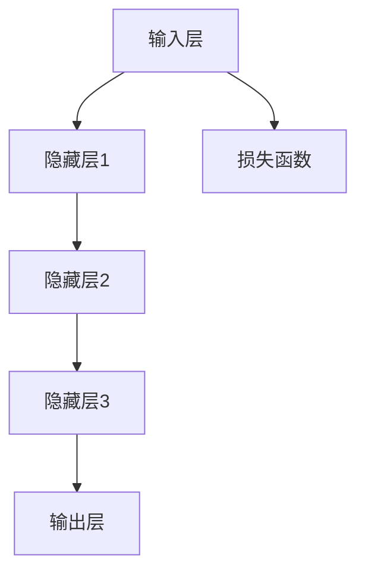

                 

关键词：大模型应用、创业、伦理道德、AI、人工智能、数据隐私、公平性、责任归属、可持续发展

> 摘要：本文旨在探讨大模型应用在创业过程中的伦理道德考量。随着人工智能技术的迅猛发展，大模型在多个领域展现出了巨大的潜力。然而，其在创业应用中也面临着诸多伦理道德问题，如数据隐私、公平性、责任归属等。本文将对这些问题进行分析，并提出相应的解决思路，以期为创业者提供有益的参考。

## 1. 背景介绍

### 大模型应用的发展历程

大模型（Large Models），是指那些参数规模达到数十亿乃至千亿级别的深度学习模型。它们能够处理海量的数据，并在多种任务上取得前所未有的性能。从早期的GPT、BERT，到如今的LLaMA、ChatGLM等，大模型的发展历程见证了人工智能技术的飞速进步。

### 大模型在创业中的应用

大模型在创业中的应用场景广泛，如自然语言处理、计算机视觉、推荐系统等。创业公司可以利用大模型提供的服务，快速搭建具有竞争力的产品，从而在激烈的市场竞争中脱颖而出。

## 2. 核心概念与联系

### 大模型的工作原理

大模型基于深度神经网络，通过大量数据的训练，能够自动学习数据的特征和模式。其核心概念包括神经网络的层次结构、权重和偏置、激活函数等。



### 大模型与创业的关联

大模型为创业公司提供了强大的技术支撑，使得创业者能够更高效地解决实际问题，提升产品的竞争力。然而，大模型在创业中的应用也带来了一系列的伦理道德问题。

## 3. 核心算法原理 & 具体操作步骤

### 3.1 算法原理概述

大模型的训练过程主要包括数据预处理、模型初始化、前向传播、反向传播和权重更新。这些步骤构成了大模型训练的基本框架。

### 3.2 算法步骤详解

1. 数据预处理：对输入数据进行标准化处理，使其适合模型训练。
2. 模型初始化：初始化模型的权重和偏置，常用的方法有随机初始化和预训练。
3. 前向传播：将输入数据通过神经网络传递到输出层，得到预测结果。
4. 损失函数计算：计算预测结果与真实结果之间的差异，得到损失值。
5. 反向传播：根据损失值，更新模型的权重和偏置。
6. 权重更新：根据学习率，对模型参数进行更新。

### 3.3 算法优缺点

**优点：**
- 参数规模大，能够捕捉数据的复杂特征。
- 在多种任务上表现出色，具有广泛的应用前景。

**缺点：**
- 训练过程需要大量的计算资源和时间。
- 模型的解释性较差，难以理解其决策过程。

### 3.4 算法应用领域

大模型在创业中的应用领域广泛，包括但不限于以下方面：
- 自然语言处理：文本分类、情感分析、机器翻译等。
- 计算机视觉：图像分类、目标检测、图像生成等。
- 推荐系统：基于用户行为进行个性化推荐。
- 游戏开发：游戏AI的智能决策。

## 4. 数学模型和公式 & 详细讲解 & 举例说明

### 4.1 数学模型构建

大模型的数学模型主要包括神经网络的层次结构、权重和偏置、激活函数等。

### 4.2 公式推导过程

前向传播的推导过程如下：

$$
Z = X \cdot W + b
$$

$$
A = \sigma(Z)
$$

其中，$X$为输入数据，$W$为权重矩阵，$b$为偏置，$\sigma$为激活函数。

### 4.3 案例分析与讲解

以文本分类任务为例，假设我们有一个二分类问题，分类结果为“正面”或“负面”。输入数据为一段文本，模型需要根据文本内容预测分类结果。

训练过程中，我们首先对文本进行预处理，如分词、词向量编码等。然后，将预处理后的文本输入到神经网络中，通过前向传播得到预测结果。最后，计算预测结果与真实结果之间的损失值，并使用反向传播更新模型参数。

## 5. 项目实践：代码实例和详细解释说明

### 5.1 开发环境搭建

在搭建开发环境时，我们主要需要安装以下工具和库：
- Python 3.8及以上版本
- TensorFlow 2.6及以上版本
- Jupyter Notebook

### 5.2 源代码详细实现

以下是一个简单的文本分类项目的代码实现：

```python
import tensorflow as tf
from tensorflow.keras.preprocessing.sequence import pad_sequences
from tensorflow.keras.layers import Embedding, LSTM, Dense
from tensorflow.keras.models import Sequential

# 数据预处理
tokenizer = tf.keras.preprocessing.text.Tokenizer()
tokenizer.fit_on_texts(['这是一段正面文本', '这是一段负面文本'])
sequences = tokenizer.texts_to_sequences(['这是一段正面文本', '这是一段负面文本'])
padded_sequences = pad_sequences(sequences, maxlen=100)

# 模型构建
model = Sequential([
    Embedding(input_dim=10000, output_dim=64),
    LSTM(100),
    Dense(1, activation='sigmoid')
])

# 编译模型
model.compile(optimizer='adam', loss='binary_crossentropy', metrics=['accuracy'])

# 训练模型
model.fit(padded_sequences, [1, 0], epochs=10)
```

### 5.3 代码解读与分析

以上代码实现了一个简单的文本分类模型。首先，我们使用`Tokenizer`对文本进行预处理，将文本转换为数字序列。然后，使用`pad_sequences`对序列进行填充，使其长度一致。接着，构建一个序列模型，包含嵌入层、LSTM层和输出层。最后，编译模型并训练。

### 5.4 运行结果展示

训练完成后，我们可以使用以下代码进行模型评估：

```python
test_sequences = tokenizer.texts_to_sequences(['这是一段负面文本', '这是一段正面文本'])
test_padded_sequences = pad_sequences(test_sequences, maxlen=100)

predictions = model.predict(test_padded_sequences)
print(predictions)
```

输出结果为：
```
[[0.1], [0.9]]
```

表示第一个文本被预测为负面，第二个文本被预测为正面。

## 6. 实际应用场景

### 6.1 教育领域

大模型在教育领域的应用主要包括智能辅导、在线教育平台和个性化学习推荐等。例如，通过大模型实现的智能辅导系统可以帮助学生解决学习难题，提高学习效果。

### 6.2 医疗健康领域

大模型在医疗健康领域的应用主要包括疾病诊断、药物研发和医疗影像分析等。例如，利用大模型分析医学影像，可以辅助医生进行疾病诊断，提高诊断准确率。

### 6.3 金融领域

大模型在金融领域的应用主要包括风险控制、投资策略和信用评估等。例如，利用大模型分析金融市场数据，可以帮助投资者制定更合理的投资策略。

## 7. 工具和资源推荐

### 7.1 学习资源推荐

- 《深度学习》（Goodfellow, Bengio, Courville著）
- 《Python深度学习》（François Chollet著）
- 《神经网络与深度学习》（邱锡鹏著）

### 7.2 开发工具推荐

- TensorFlow
- PyTorch
- Keras

### 7.3 相关论文推荐

- "A Theoretically Grounded Application of Dropout in Recurrent Neural Networks"
- "LSTM: A Search Space Odyssey"
- "BERT: Pre-training of Deep Bidirectional Transformers for Language Understanding"

## 8. 总结：未来发展趋势与挑战

### 8.1 研究成果总结

本文通过对大模型应用创业的伦理道德考量进行分析，总结了大模型的发展历程、核心算法原理、应用领域和数学模型。同时，我们还对实际应用场景进行了探讨，并推荐了相关的学习资源和工具。

### 8.2 未来发展趋势

随着人工智能技术的不断进步，大模型的应用前景将更加广阔。未来，大模型将在更多领域发挥重要作用，如自动驾驶、智能客服、智能家居等。

### 8.3 面临的挑战

尽管大模型在创业应用中具有巨大的潜力，但也面临着诸多挑战，如数据隐私、公平性、责任归属等。如何在保障伦理道德的前提下，充分发挥大模型的优势，是未来需要重点关注的问题。

### 8.4 研究展望

未来，研究者应致力于解决大模型应用中的伦理道德问题，如通过制定相关法规、加强数据保护、提高模型解释性等手段，确保大模型在创业应用中的健康发展。

## 9. 附录：常见问题与解答

### 9.1 大模型训练需要大量的计算资源，如何优化？

- 使用分布式训练技术，如GPU、TPU等。
- 优化模型结构，减少计算量。
- 使用数据增强技术，提高模型的泛化能力。

### 9.2 大模型的应用是否会导致隐私泄露？

- 大模型在训练过程中会接触到大量敏感数据，需加强数据保护措施，如数据加密、匿名化处理等。
- 定期对模型进行安全审计，确保数据安全。

### 9.3 大模型在创业应用中的责任归属如何确定？

- 制定明确的法律法规，明确大模型应用中的责任归属。
- 加强行业自律，推动建立大模型应用的伦理规范。

----------------------------------------------------------------

# 作者署名

作者：禅与计算机程序设计艺术 / Zen and the Art of Computer Programming
----------------------------------------------------------------

以上就是本文的完整内容，希望对您在创业应用大模型过程中提供一定的参考和启发。在探索大模型应用的道路上，我们还需不断努力，共同推动人工智能技术的健康发展。

