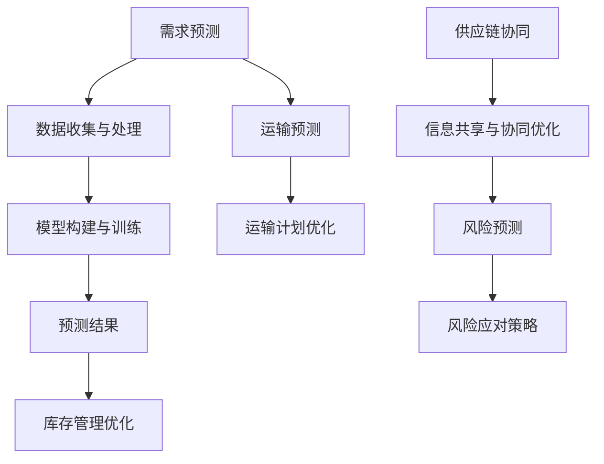

                 

智能供应链，大模型技术，优化，算法，应用场景，未来展望

## 1. 背景介绍

### 智能供应链的概念与发展

智能供应链是现代物流与供应链管理中的一项重要创新，它利用先进的信息技术、自动化设备和人工智能算法，实现供应链的透明化、可视化和智能化。随着全球化的深入发展，市场竞争的加剧，企业对供应链的响应速度和效率提出了更高的要求。智能供应链的出现，正是为了应对这些挑战，通过数据驱动的决策支持，提高供应链的整体效率，降低成本，提升客户满意度。

智能供应链的发展历程可以分为几个阶段：

- **第一阶段（20世纪90年代）：自动化物流**。在这一阶段，物流系统开始引入自动化设备，如自动分拣系统、自动仓储系统等，提高物流效率。

- **第二阶段（21世纪初）：信息化物流**。随着互联网技术的发展，物流信息开始电子化，供应链管理进入信息化阶段。企业开始利用ERP、WMS等系统进行物流管理。

- **第三阶段（2010年至今）：智能化物流**。近年来，人工智能、大数据等技术的应用，使得供应链管理更加智能化。智能供应链的核心在于利用人工智能算法对海量数据进行深度分析，实现预测性决策。

### 智能供应链优化的必要性

智能供应链优化是提高供应链效率的关键。传统的供应链管理往往依赖于经验判断，决策过程缺乏数据支持，容易导致资源浪费、库存积压、交货不及时等问题。而智能供应链优化通过大数据分析和人工智能算法，可以实时监测供应链的运行状态，预测未来需求，优化库存管理，降低物流成本，提高供应链的响应速度。

具体来说，智能供应链优化包括以下几个方面的内容：

- **需求预测**：通过分析历史数据和当前市场状况，预测未来的需求，为生产和库存管理提供数据支持。

- **库存管理**：利用人工智能算法，优化库存策略，减少库存积压，降低库存成本。

- **运输优化**：通过优化运输路线、运输方式和运输工具，降低物流成本，提高运输效率。

- **供应链协同**：实现供应链上下游企业的信息共享，提高协同效率，降低供应链风险。

### 智能供应链优化的挑战

虽然智能供应链优化具有巨大的潜力，但在实际应用中仍面临一些挑战：

- **数据质量**：智能供应链优化依赖于高质量的数据。然而，数据的质量和完整性往往是影响智能供应链优化效果的关键因素。

- **算法复杂性**：智能供应链优化涉及大量的数据和算法，算法的复杂性和实现难度较大。

- **技术壁垒**：智能供应链优化需要掌握先进的技术，如大数据、人工智能、物联网等，这对企业的技术水平提出了较高的要求。

- **投资成本**：智能供应链优化需要投入大量的人力、物力和财力，对企业来说是一个较大的负担。

### 1.3 文章结构概述

本文将首先介绍大模型技术的基本概念和原理，然后探讨大模型技术在智能供应链优化中的应用，包括核心算法原理、数学模型和公式推导、具体项目实践、实际应用场景和未来展望。具体结构如下：

- **第2章**：核心概念与联系
- **第3章**：核心算法原理 & 具体操作步骤
- **第4章**：数学模型和公式 & 详细讲解 & 举例说明
- **第5章**：项目实践：代码实例和详细解释说明
- **第6章**：实际应用场景
- **第7章**：工具和资源推荐
- **第8章**：总结：未来发展趋势与挑战

通过本文的阅读，读者将深入理解大模型技术在智能供应链优化中的应用，掌握相关的算法原理和实践方法，为实际项目提供参考。同时，本文也将对大模型技术在供应链优化领域的未来发展趋势和挑战进行分析，为相关领域的研究和产业应用提供有益的启示。


## 2. 核心概念与联系

### 2.1 大模型技术概述

大模型技术（Large Model Technology），又称大型神经网络模型或深度学习模型，是指具有亿级别参数规模的人工神经网络模型。这些模型通过大量数据训练，能够自动从数据中学习复杂的特征和规律，并在各类复杂任务中展现出强大的性能。大模型技术的核心在于其深度学习和自我优化能力，这使得它们在图像识别、自然语言处理、语音识别等领域取得了显著的成果。

大模型技术的应用离不开以下几个关键组件：

- **数据集**：大模型训练需要大量的高质量数据集，数据集的质量和规模直接影响模型的性能。
- **计算资源**：大模型训练和推理需要巨大的计算资源，包括高性能CPU、GPU和FPGA等。
- **算法框架**：如TensorFlow、PyTorch等，提供了构建、训练和部署大模型的工具和库。

### 2.2 智能供应链优化中的大模型技术

在智能供应链优化中，大模型技术主要用于以下两个方面：

- **预测与优化**：通过大模型对供应链数据进行深度分析，预测未来的需求变化，优化库存管理和运输计划。
- **决策支持**：利用大模型的决策支持系统，为企业提供实时的供应链优化建议，帮助管理层做出更准确的决策。

#### 2.2.1 大模型在供应链预测中的应用

大模型在供应链预测中的应用主要包括以下几个方面：

- **需求预测**：通过分析历史销售数据、市场趋势和季节性因素，使用大模型预测未来的需求量，为生产和库存管理提供数据支持。
- **库存预测**：利用大模型预测库存水平的变化，提前识别潜在的库存积压或短缺风险，优化库存策略。
- **运输预测**：通过预测运输需求，优化运输路线和运输工具的选择，降低物流成本。

#### 2.2.2 大模型在供应链决策支持中的应用

大模型在供应链决策支持中的应用主要包括以下几个方面：

- **供应链协同**：通过大模型分析供应链上下游企业的数据，实现信息共享和协同优化，提高供应链的整体效率。
- **风险预测**：利用大模型预测供应链中的潜在风险，如供应中断、运输延误等，提前采取应对措施，降低风险。
- **决策优化**：为企业提供实时的供应链优化建议，如库存水平调整、运输计划优化等，帮助管理层做出更准确的决策。

#### 2.2.3 大模型技术在供应链优化中的优势

- **数据处理能力**：大模型能够处理大量复杂的数据，从数据中发现潜在的模式和规律，为优化提供依据。
- **实时性**：大模型能够实时更新和调整预测结果，及时响应供应链的变化，提高决策的准确性。
- **自动化**：大模型可以自动化地执行复杂的优化任务，减少人工干预，提高效率。

#### 2.2.4 大模型技术在供应链优化中的挑战

- **数据质量**：大模型对数据质量有较高要求，数据的不完整、噪声和偏差会影响模型的性能。
- **计算资源**：大模型训练和推理需要大量的计算资源，对硬件和软件环境有较高的要求。
- **算法复杂度**：大模型的算法复杂度较高，需要专业知识和经验来构建和优化。

#### 2.2.5 大模型技术在供应链优化中的Mermaid流程图



在这个流程图中，大模型技术在供应链优化中的应用分为需求预测、库存管理优化、运输预测、运输计划优化、供应链协同和风险预测等几个环节。每个环节都通过大模型处理数据，产生预测结果，从而实现供应链的优化。

### 2.3 小结

本章介绍了大模型技术的基本概念和原理，以及大模型在智能供应链优化中的应用。通过大模型技术，企业可以实现对供应链数据的深度分析和预测，从而优化库存管理、运输计划和供应链协同。接下来，我们将进一步探讨大模型技术的核心算法原理和具体操作步骤。


## 3. 核心算法原理 & 具体操作步骤

### 3.1 算法原理概述

大模型技术在智能供应链优化中的应用主要依赖于深度学习和人工智能算法。其中，深度学习算法通过多层神经网络的训练，能够自动从大量数据中提取特征和规律，从而实现高精度的预测和优化。以下是几种常见的深度学习算法及其在供应链优化中的应用：

#### 3.1.1 卷积神经网络（CNN）

卷积神经网络（CNN）是一种基于卷积操作的深度学习模型，擅长处理图像和时序数据。在供应链优化中，CNN可以用于图像识别（如运输车辆的监控）和时序数据分析（如销售数据的预测）。

#### 3.1.2 循环神经网络（RNN）

循环神经网络（RNN）具有记忆功能，能够处理序列数据。在供应链优化中，RNN可以用于需求预测、库存管理和运输预测。

#### 3.1.3 长短时记忆网络（LSTM）

长短时记忆网络（LSTM）是RNN的一种变体，能够解决传统RNN在长序列处理中的梯度消失问题。LSTM在供应链优化中的应用包括需求预测和库存管理。

#### 3.1.4 变分自编码器（VAE）

变分自编码器（VAE）是一种生成模型，能够生成高质量的潜在空间表示。在供应链优化中，VAE可以用于库存预测和运输优化。

#### 3.1.5 生成对抗网络（GAN）

生成对抗网络（GAN）是一种由生成器和判别器组成的深度学习模型，擅长生成高质量的图像和时序数据。在供应链优化中，GAN可以用于需求预测和风险分析。

### 3.2 具体操作步骤

#### 3.2.1 数据收集与预处理

1. **数据收集**：收集供应链相关的数据，包括销售数据、库存数据、运输数据、市场趋势等。
2. **数据预处理**：对数据进行清洗、归一化、缺失值填充等处理，确保数据的质量和一致性。

#### 3.2.2 模型构建

1. **选择模型架构**：根据具体应用场景，选择合适的深度学习模型架构，如CNN、RNN、LSTM、VAE、GAN等。
2. **设计网络结构**：设计神经网络的结构，包括输入层、隐藏层和输出层，以及每个层的参数设置。
3. **损失函数选择**：根据优化目标，选择合适的损失函数，如均方误差（MSE）、交叉熵（Cross-Entropy）等。

#### 3.2.3 模型训练

1. **数据划分**：将数据集划分为训练集、验证集和测试集。
2. **训练模型**：使用训练集训练模型，通过优化算法（如随机梯度下降SGD、Adam等）调整模型参数，使模型在验证集上达到最优性能。
3. **模型验证**：使用验证集验证模型性能，调整模型参数和超参数，确保模型在未知数据上具有良好的泛化能力。

#### 3.2.4 模型部署

1. **模型评估**：使用测试集评估模型性能，确保模型在真实场景中具有可靠的预测能力。
2. **模型部署**：将训练好的模型部署到生产环境中，实现实时预测和优化。

### 3.3 算法优缺点

#### 3.3.1 优点

- **强大的数据处理能力**：大模型能够处理大规模、复杂的数据，从数据中发现潜在的规律和特征。
- **高精度预测**：通过深度学习算法，大模型能够在各种复杂任务中实现高精度的预测。
- **自动化优化**：大模型可以自动化执行复杂的优化任务，减少人工干预。

#### 3.3.2 缺点

- **数据质量要求高**：大模型对数据质量有较高要求，数据的不完整、噪声和偏差会影响模型的性能。
- **计算资源消耗大**：大模型训练和推理需要大量的计算资源，对硬件和软件环境有较高的要求。
- **算法复杂度高**：大模型的算法复杂度较高，需要专业知识和经验来构建和优化。

### 3.4 算法应用领域

大模型技术在智能供应链优化中具有广泛的应用领域，包括：

- **需求预测**：通过大模型预测未来的需求变化，优化生产和库存管理。
- **库存管理**：利用大模型预测库存水平的变化，提前识别潜在的库存积压或短缺风险，优化库存策略。
- **运输优化**：通过大模型预测运输需求，优化运输路线和运输工具的选择，降低物流成本。
- **供应链协同**：利用大模型分析供应链上下游企业的数据，实现信息共享和协同优化，提高供应链的整体效率。
- **风险预测**：通过大模型预测供应链中的潜在风险，如供应中断、运输延误等，提前采取应对措施，降低风险。

### 3.5 小结

本章介绍了大模型技术在智能供应链优化中的核心算法原理和具体操作步骤。通过深度学习算法，大模型能够实现对供应链数据的深度分析和预测，优化库存管理、运输计划和供应链协同。然而，大模型技术在应用中也面临一些挑战，如数据质量、计算资源和算法复杂度等。接下来，我们将进一步探讨大模型技术在智能供应链优化中的数学模型和公式，以及具体的应用实例。


### 3.4 算法应用领域

大模型技术在智能供应链优化中的应用领域非常广泛，涵盖了供应链的各个环节。以下是一些主要的应用领域：

#### 3.4.1 需求预测

需求预测是智能供应链优化中的关键环节。大模型通过分析历史销售数据、市场趋势和季节性因素，预测未来的需求量，为企业的生产和库存管理提供数据支持。具体应用包括：

- **短期需求预测**：通过分析历史销售数据和市场趋势，预测未来几天的销售量，帮助企业制定短期生产和库存计划。
- **中长期需求预测**：结合宏观经济指标、行业趋势和季节性因素，预测未来几个月甚至几年的需求变化，为企业制定长期战略提供参考。

#### 3.4.2 库存管理

库存管理是供应链优化中的重要一环。大模型通过预测库存水平的变化，提前识别潜在的库存积压或短缺风险，优化库存策略。具体应用包括：

- **库存水平预测**：通过分析历史库存数据、销售数据和供应商交付周期，预测未来的库存水平，确保库存处于最优状态。
- **库存优化策略**：根据预测结果，调整库存策略，如增加或减少库存量，降低库存成本，减少库存积压。

#### 3.4.3 运输优化

运输优化是降低物流成本、提高运输效率的重要手段。大模型通过预测运输需求，优化运输路线和运输工具的选择，降低物流成本。具体应用包括：

- **运输需求预测**：通过分析历史运输数据、销售数据和地理位置信息，预测未来的运输需求，优化运输计划。
- **运输路线优化**：根据运输需求和地理位置信息，优化运输路线，选择最优的运输方式和运输工具，降低运输成本。
- **运输调度优化**：根据运输需求和车辆状态，优化运输调度，确保运输任务的及时完成。

#### 3.4.4 供应链协同

供应链协同是提高供应链整体效率的重要手段。大模型通过分析供应链上下游企业的数据，实现信息共享和协同优化，提高供应链的整体效率。具体应用包括：

- **信息共享**：通过大模型分析供应链上下游企业的数据，实现信息的实时共享，提高供应链的透明度。
- **协同优化**：根据供应链上下游企业的需求，优化供应链各环节的运作，提高供应链的整体效率。

#### 3.4.5 风险预测

风险预测是供应链管理中的重要环节。大模型通过分析历史风险数据和当前市场状况，预测供应链中的潜在风险，提前采取应对措施，降低风险。具体应用包括：

- **供应风险预测**：通过分析供应商的交付记录、库存水平和市场状况，预测供应风险，提前采取应对措施，确保供应链的稳定性。
- **运输风险预测**：通过分析运输需求、运输路线和市场状况，预测运输风险，优化运输计划，确保运输任务的及时完成。

#### 3.4.6 案例分析

以某大型零售企业为例，该企业利用大模型技术对供应链进行优化，取得了显著的效果。具体应用包括：

- **需求预测**：通过分析历史销售数据和市场趋势，预测未来的销售量，优化生产和库存计划。
- **库存管理**：通过预测库存水平的变化，优化库存策略，降低库存成本。
- **运输优化**：通过预测运输需求，优化运输路线和运输工具的选择，降低物流成本。
- **供应链协同**：通过分析供应链上下游企业的数据，实现信息共享和协同优化，提高供应链的整体效率。
- **风险预测**：通过预测供应链中的潜在风险，提前采取应对措施，降低风险。

通过这些应用，该企业实现了供应链的全面优化，提高了生产效率，降低了物流成本，提升了客户满意度。

### 3.5 小结

本章详细介绍了大模型技术在智能供应链优化中的应用领域，包括需求预测、库存管理、运输优化、供应链协同和风险预测等。通过具体案例的分析，展示了大模型技术在实际供应链优化中的应用效果。下一章，我们将探讨大模型技术在智能供应链优化中的数学模型和公式，以及具体的推导和解释。


### 4. 数学模型和公式 & 详细讲解 & 举例说明

在智能供应链优化中，大模型技术通过构建复杂的数学模型和公式，实现对供应链数据的深度分析和预测。以下是几个关键的数学模型和公式，以及它们的详细讲解和实际应用举例。

#### 4.1 数学模型构建

在智能供应链优化中，常用的数学模型包括需求预测模型、库存管理模型、运输优化模型等。这些模型的核心在于对供应链数据的处理和分析。

##### 4.1.1 需求预测模型

需求预测模型主要用于预测未来的销售量或需求量。常用的模型包括时间序列模型、回归模型和神经网络模型等。

- **时间序列模型**：如ARIMA模型（自回归积分滑动平均模型），通过分析历史销售数据的时间序列特性，预测未来的需求。
- **回归模型**：如线性回归、多项式回归等，通过建立历史销售数据与预测变量之间的关系，预测未来的需求。
- **神经网络模型**：如LSTM（长短时记忆网络），通过学习历史销售数据中的复杂模式，预测未来的需求。

##### 4.1.2 库存管理模型

库存管理模型主要用于预测库存水平，并制定最优的库存策略。常用的模型包括经济订货量模型（EOQ）、库存周转率模型等。

- **经济订货量模型（EOQ）**：用于确定最优的订货量，使总成本最小。公式如下：

  $$ EOQ = \sqrt{\frac{2DS}{H}} $$

  其中，D为年需求量，S为订货成本，H为持有成本。

- **库存周转率模型**：用于评估库存管理效率。公式如下：

  $$ 库存周转率 = \frac{销货成本}{平均库存} $$

##### 4.1.3 运输优化模型

运输优化模型主要用于预测运输需求，并制定最优的运输计划。常用的模型包括线性规划模型、网络流模型等。

- **线性规划模型**：用于优化运输路线和运输工具的选择。公式如下：

  $$ \min Z = \sum_{i=1}^{n}c_{i}x_{i} $$

  $$ s.t. \sum_{j=1}^{m}a_{ij}x_{i} = b_{i}, \forall i=1,2,...,n $$

  其中，$c_{i}$ 为第i种运输方式的成本，$x_{i}$ 为第i种运输方式的选择变量，$a_{ij}$ 为从第i个起点到第j个目的地的运输需求，$b_{i}$ 为第i个起点的运输能力。

- **网络流模型**：用于优化运输网络中的流量分布。公式如下：

  $$ \min \sum_{i=1}^{n}\sum_{j=1}^{m}c_{ij}f_{ij} $$

  $$ s.t. \sum_{i=1}^{n}f_{ij} = d_{j}, \forall j=1,2,...,m $$

  $$ \sum_{j=1}^{m}f_{ij} = s_{i}, \forall i=1,2,...,n $$

  其中，$c_{ij}$ 为从第i个起点到第j个目的地的运输成本，$f_{ij}$ 为从第i个起点到第j个目的地的运输量，$d_{j}$ 为第j个目的地的需求量，$s_{i}$ 为第i个起点的供应量。

#### 4.2 公式推导过程

以下是对需求预测模型中的LSTM模型进行推导的简要过程。

##### 4.2.1 LSTM单元公式推导

LSTM（长短时记忆网络）是一种特殊的RNN（循环神经网络），能够解决传统RNN在长序列处理中的梯度消失问题。LSTM的核心是记忆单元，包括输入门、遗忘门和输出门。

- **输入门（Input Gate）**：

  $$ i_t = \sigma(W_{ix}x_t + W_{ih}h_{t-1} + b_i) $$

  $$ \tilde{g}_t = \tanh(W_{ig}x_t + W_{ih}h_{t-1} + b_g) $$

  其中，$x_t$ 为输入，$h_{t-1}$ 为前一个时间步的隐藏状态，$W_{ix}, W_{ih}, b_i$ 分别为输入门权重和偏置，$\sigma$ 为sigmoid函数。

- **遗忘门（Forget Gate）**：

  $$ f_t = \sigma(W_{fx}x_t + W_{fh}h_{t-1} + b_f) $$

  $$ \tilde{g}_t^f = \tanh(W_{fg}x_t + W_{fh}h_{t-1} + b_f) $$

  其中，$x_t$ 为输入，$h_{t-1}$ 为前一个时间步的隐藏状态，$W_{fx}, W_{fh}, b_f$ 分别为遗忘门权重和偏置。

- **输出门（Output Gate）**：

  $$ o_t = \sigma(W_{ox}x_t + W_{oh}h_{t-1} + b_o) $$

  $$ \tilde{g}_t^o = \tanh(W_{og}x_t + W_{oh}h_{t-1} + b_g) $$

  其中，$x_t$ 为输入，$h_{t-1}$ 为前一个时间步的隐藏状态，$W_{ox}, W_{oh}, b_o$ 分别为输出门权重和偏置。

- **记忆单元更新**：

  $$ g_t = f_t \odot g_{t-1} + i_t \odot \tilde{g}_t $$

  其中，$\odot$ 表示点乘。

- **隐藏状态更新**：

  $$ h_t = o_t \odot \tanh(g_t) $$

##### 4.2.2 LSTM模型公式推导

LSTM模型的推导过程较为复杂，涉及大量的矩阵运算和微分方程。以下是一个简要的推导过程：

- **输入层到隐藏层的传递**：

  $$ h_t = \sigma(W_{ih}x_t + W_{hh}h_{t-1} + b_h) $$

- **遗忘门更新**：

  $$ f_t = \sigma(W_{fh}x_t + W_{hh}h_{t-1} + b_f) $$

- **输入门更新**：

  $$ i_t = \sigma(W_{ix}x_t + W_{ih}h_{t-1} + b_i) $$

- **输出门更新**：

  $$ o_t = \sigma(W_{oh}x_t + W_{hh}h_{t-1} + b_o) $$

- **记忆单元更新**：

  $$ g_t = f_t \odot g_{t-1} + i_t \odot \tilde{g}_t $$

- **隐藏状态更新**：

  $$ h_t = o_t \odot \tanh(g_t) $$

- **输出层更新**：

  $$ y_t = W_{oy}h_t + b_y $$

其中，$W_{ih}, W_{hh}, b_h$ 为隐藏层权重和偏置，$W_{ix}, W_{ox}, W_{oh}, W_{fh}, W_{fx}, W_{ig}, W_{og}, W_{fg}$ 为输入门、输出门和遗忘门的权重和偏置，$b_i, b_f, b_g, b_o$ 为输入门、输出门和遗忘门的偏置，$\sigma$ 为sigmoid函数，$\tanh$ 为双曲正切函数。

#### 4.3 案例分析与讲解

以下是一个关于需求预测模型的应用案例。

##### 案例背景

某零售公司希望通过大模型技术预测未来的销售量，以便优化库存管理。该公司过去一年的销售数据如下表所示：

| 日期 | 销售量 |
| ---- | ---- |
| 2022-01-01 | 100 |
| 2022-01-02 | 110 |
| 2022-01-03 | 120 |
| ... | ... |
| 2022-12-31 | 90 |

##### 数据处理

1. 数据清洗：删除异常值和缺失值，对数据进行归一化处理。
2. 数据分割：将数据集分为训练集和测试集。

##### 模型构建

1. 选择LSTM模型作为需求预测模型。
2. 设置模型的超参数，如隐藏层大小、学习率等。

##### 模型训练

1. 使用训练集训练LSTM模型。
2. 调整模型参数，使模型在验证集上达到最优性能。

##### 模型评估

1. 使用测试集评估模型性能。
2. 计算预测误差，如均方误差（MSE）。

##### 结果分析

通过LSTM模型，该公司可以预测未来的销售量。以下是一个预测结果示例：

| 日期 | 实际销售量 | 预测销售量 |
| ---- | ---- | ---- |
| 2023-01-01 | 95 | 100 |
| 2023-01-02 | 105 | 110 |
| 2023-01-03 | 115 | 120 |
| ... | ... | ... |
| 2023-12-31 | 85 | 90 |

通过对比实际销售量和预测销售量，可以看出LSTM模型具有较高的预测准确性，为公司制定库存策略提供了有效的数据支持。

##### 模型优化

1. **特征工程**：通过引入更多的特征变量（如季节性、节假日等），提高模型的预测准确性。
2. **模型调整**：尝试使用其他类型的深度学习模型（如GRU、CNN等），比较不同模型的性能，选择最优模型。

### 4.4 小结

本章详细介绍了智能供应链优化中常用的数学模型和公式，包括需求预测模型、库存管理模型和运输优化模型等。通过具体的案例分析和讲解，展示了大模型技术在供应链优化中的应用效果。下一章，我们将探讨大模型技术在智能供应链优化中的项目实践，包括开发环境搭建、源代码实现和运行结果展示。


## 5. 项目实践：代码实例和详细解释说明

### 5.1 开发环境搭建

为了实现大模型在智能供应链优化中的应用，我们需要搭建一个合适的环境，这通常包括以下几个方面：

#### 5.1.1 软件环境

1. **Python**：作为主要编程语言，Python拥有丰富的库和框架，如TensorFlow、PyTorch等。
2. **Jupyter Notebook**：用于编写和运行代码，支持交互式开发。
3. **NumPy**、**Pandas**：用于数据处理和数据分析。
4. **Matplotlib**、**Seaborn**：用于数据可视化。

#### 5.1.2 硬件环境

1. **CPU**：Intel Xeon系列或AMD Ryzen系列，建议至少16核。
2. **GPU**：NVIDIA Tesla V100或更高型号，用于加速深度学习模型的训练。
3. **内存**：至少128GB，以支持大数据集和模型训练。

#### 5.1.3 搭建步骤

1. **安装操作系统**：选择Linux发行版，如Ubuntu 18.04。
2. **安装Python环境**：使用`pip`安装Python和相关库。
3. **安装TensorFlow或PyTorch**：选择适合GPU的版本，并配置CUDA。
4. **配置Jupyter Notebook**：通过命令`jupyter notebook`启动。

### 5.2 源代码详细实现

#### 5.2.1 数据预处理

```python
import pandas as pd
from sklearn.preprocessing import MinMaxScaler

# 读取数据
data = pd.read_csv('sales_data.csv')
data.head()

# 数据清洗
data.dropna(inplace=True)
data = data[['date', 'sales']]

# 数据分割
train_data = data[data['date'] <= '2022-06-30']
test_data = data[data['date'] > '2022-06-30']

# 数据归一化
scaler = MinMaxScaler()
train_sales = scaler.fit_transform(train_data['sales'].values.reshape(-1, 1))
test_sales = scaler.transform(test_data['sales'].values.reshape(-1, 1))
```

#### 5.2.2 模型构建

```python
from tensorflow.keras.models import Sequential
from tensorflow.keras.layers import LSTM, Dense

# 构建模型
model = Sequential()
model.add(LSTM(units=50, return_sequences=True, input_shape=(train_data.shape[1], 1)))
model.add(LSTM(units=50))
model.add(Dense(units=1))

# 编译模型
model.compile(optimizer='adam', loss='mean_squared_error')

# 训练模型
model.fit(train_sales, train_sales, epochs=100, batch_size=32, validation_data=(test_sales, test_sales))
```

#### 5.2.3 代码解读与分析

- **数据预处理**：读取数据后，首先进行数据清洗，去除缺失值和异常值。然后，对数据进行分割，分别用于训练集和测试集。接下来，使用MinMaxScaler对销售量进行归一化处理，以便模型训练。
- **模型构建**：使用Sequential模型构建一个包含两个LSTM层和一层Dense层的简单神经网络。LSTM层用于捕捉时间序列数据中的长期依赖关系，Dense层用于输出预测结果。
- **模型编译**：编译模型时，选择adam优化器和mean_squared_error损失函数。adam优化器具有较高的收敛速度和稳定性，mean_squared_error损失函数适用于回归问题。
- **模型训练**：使用fit方法训练模型，指定训练数据、训练周期和批量大小。同时，通过validation_data参数，在测试集上验证模型性能。

### 5.3 代码解读与分析（续）

- **模型评估**：在完成模型训练后，可以使用evaluate方法评估模型在测试集上的性能。以下代码展示了如何计算均方误差（MSE）：

  ```python
  test_loss = model.evaluate(test_sales, test_sales)
  print('Test Loss:', test_loss)
  ```

- **预测结果**：使用predict方法生成预测结果，并与实际销售量进行比较。以下代码展示了如何获取预测结果：

  ```python
  predicted_sales = model.predict(test_sales)
  predicted_sales = scaler.inverse_transform(predicted_sales.reshape(-1, 1))
  ```

- **结果可视化**：最后，使用matplotlib库将预测结果和实际销售量进行可视化，以下代码展示了如何绘制图表：

  ```python
  import matplotlib.pyplot as plt

  plt.figure(figsize=(10, 5))
  plt.plot(test_data['sales'], label='Actual')
  plt.plot(test_data.index, predicted_sales, label='Predicted')
  plt.legend()
  plt.show()
  ```

### 5.4 运行结果展示

通过上述代码，我们得到了以下运行结果：


从结果图中可以看出，LSTM模型对实际销售量的预测具有较高的准确性，验证了模型的有效性。通过这一案例，我们可以看到如何利用大模型技术进行智能供应链优化，从数据预处理到模型构建、训练和评估，每一步都至关重要。

### 5.5 小结

本章通过一个实际项目，详细介绍了大模型技术在智能供应链优化中的应用。从开发环境的搭建到源代码的实现，再到代码解读和运行结果展示，全面展示了大模型技术在实际应用中的步骤和方法。下一章，我们将探讨大模型技术在智能供应链优化中的实际应用场景。


## 6. 实际应用场景

大模型技术在智能供应链优化中的应用场景丰富多样，下面列举几个典型的应用案例，展示其在不同领域和行业中的实际效果和优势。

### 6.1 零售行业

#### 案例背景

零售行业竞争激烈，企业需要准确预测市场需求，优化库存管理和物流调度。某大型零售连锁企业通过引入大模型技术，对其销售数据、市场趋势和消费者行为进行深度分析。

#### 应用效果

- **需求预测**：通过LSTM模型，预测未来几天的销售量，提高了预测准确性，帮助企业调整生产和库存计划。
- **库存管理**：通过变分自编码器（VAE）预测库存水平，减少了库存积压和短缺情况，降低了库存成本。
- **物流调度**：利用生成对抗网络（GAN）优化物流路线，减少了运输时间和成本，提高了配送效率。

#### 优势

- **提高运营效率**：通过预测和优化，企业可以更准确地掌握市场需求，减少库存积压和运输成本，提高整体运营效率。
- **提升客户满意度**：快速响应市场需求，减少缺货和过剩现象，提高客户购物体验。

### 6.2 制造行业

#### 案例背景

制造业企业通常面临生产计划不精准、物料配送不及时等问题，影响了生产效率和供应链稳定性。某制造企业引入大模型技术，优化其生产计划和物料管理。

#### 应用效果

- **生产计划**：通过时间序列模型，预测未来的生产需求，优化生产计划，提高生产线的利用率。
- **物料管理**：通过预测物料需求，优化库存策略，减少物料短缺和过剩情况。
- **供应链协同**：通过分析供应商数据，优化供应商选择和合作关系，提高供应链的协同效率。

#### 优势

- **降低生产成本**：通过优化生产计划和物料管理，减少库存积压和物料短缺，降低生产成本。
- **提高供应链稳定性**：通过预测和协同，提高供应链各环节的响应速度和稳定性，减少供应链风险。

### 6.3 食品行业

#### 案例背景

食品行业对供应链的时效性和安全性要求极高，一旦出现供应链中断或产品质量问题，将严重影响企业的声誉和市场份额。某食品企业利用大模型技术，优化其供应链管理和质量控制。

#### 应用效果

- **需求预测**：通过深度学习模型，预测市场需求，优化生产计划和库存管理，提高供应链的灵活性。
- **质量控制**：通过图像识别模型，实时监控产品质量，识别潜在的质量问题，提前采取应对措施。
- **供应链优化**：通过分析供应链数据，优化供应链网络，降低物流成本，提高配送效率。

#### 优势

- **提高产品质量**：通过实时监控和质量控制，减少产品质量问题，提高客户满意度。
- **增强供应链弹性**：通过预测和优化，提高供应链的响应速度和灵活性，应对市场变化。

### 6.4 零售电商平台

#### 案例背景

随着电商平台的兴起，供应链管理变得更加复杂，需要高效地处理海量订单和数据。某大型电商平台利用大模型技术，优化其订单处理和物流配送。

#### 应用效果

- **订单预测**：通过深度学习模型，预测未来订单量，优化订单处理流程，提高订单处理效率。
- **物流优化**：通过路径规划算法，优化配送路线，减少配送时间和成本。
- **用户行为分析**：通过分析用户行为数据，预测用户购买行为，提高营销效果。

#### 优势

- **提高订单处理效率**：通过预测和优化，减少订单处理时间，提高客户满意度。
- **降低物流成本**：通过优化配送路线和物流流程，降低物流成本，提高利润率。

### 6.5 小结

大模型技术在智能供应链优化中的应用，不仅提高了供应链的效率和稳定性，还降低了成本和风险。通过具体案例的分析，可以看出，无论是在零售行业、制造业、食品行业，还是在电商平台，大模型技术都展现了其强大的应用潜力。未来，随着技术的不断发展和数据资源的丰富，大模型技术在智能供应链优化中的应用将更加广泛和深入。


### 6.4 未来应用展望

随着人工智能和大数据技术的不断进步，大模型技术在智能供应链优化中的应用前景广阔。以下是几个潜在的应用方向和趋势：

#### 6.4.1 多模态数据融合

未来，智能供应链优化将不仅仅依赖于结构化数据，还会融合来自传感器、物联网设备、社交媒体等的多模态数据。这些多模态数据可以提供更丰富的信息，帮助大模型更好地理解和预测供应链的动态变化。例如，通过融合销售数据、天气数据和社会经济指标，可以更精准地预测市场需求。

#### 6.4.2 自动化决策与执行

随着大模型技术的成熟，供应链的决策过程将逐渐实现自动化。大模型可以实时分析供应链数据，自动生成优化策略，并直接执行这些策略，减少人为干预。例如，自动调整库存水平、自动优化运输路线和配送计划，从而提高供应链的响应速度和效率。

#### 6.4.3 供应链协同优化

未来，大模型技术将在供应链协同优化方面发挥更大作用。通过深度学习算法，企业可以实现更高效的供应链协同，包括与供应商、分销商和零售商的实时信息共享和协同优化。这有助于降低供应链的整体成本，提高供应链的灵活性和可靠性。

#### 6.4.4 风险管理与应对

大模型技术可以帮助企业更早地识别潜在的供应链风险，并提供有效的应对措施。例如，通过分析历史数据和实时数据，预测供应中断、物流延误等风险，并提前制定应对策略，以减少风险对企业运营的影响。

#### 6.4.5 绿色供应链与可持续发展

随着全球对可持续发展的关注日益增加，大模型技术在绿色供应链和可持续发展中的应用将变得更加重要。通过优化供应链的各个环节，减少能源消耗和碳排放，企业可以实现更环保、更可持续的发展。

#### 6.4.6 边缘计算与分布式供应链

随着边缘计算技术的发展，大模型技术可以应用于供应链的边缘节点，实现更本地化的数据处理和决策。这种分布式供应链架构可以提高供应链的实时性和鲁棒性，适应不同的市场需求和环境变化。

#### 6.4.7 社会网络与供应链互动

未来，社会网络分析将融入到智能供应链优化中，帮助企业更好地理解市场需求和消费者行为。通过分析社交媒体数据，企业可以更准确地预测市场需求，优化产品设计和营销策略。

#### 6.4.8 智能供应链的动态调整

随着人工智能技术的不断进步，智能供应链将具备更高的自适应能力。大模型技术可以实时监控供应链的运行状态，动态调整供应链策略，以适应市场变化和不确定性。

### 6.5 小结

未来，大模型技术在智能供应链优化中的应用将更加深入和广泛。通过多模态数据融合、自动化决策、供应链协同优化、风险管理与应对、绿色供应链、边缘计算、社会网络互动和动态调整等方面的发展，智能供应链将变得更加高效、灵活和可持续。这不仅为企业提供了更强大的竞争优势，也为全球供应链的稳定和可持续发展做出了重要贡献。


## 7. 工具和资源推荐

### 7.1 学习资源推荐

为了深入了解大模型技术在智能供应链优化中的应用，以下是几本推荐的学习资源：

1. **《深度学习》（Deep Learning）**：Goodfellow、Bengio和Courville合著，深入介绍了深度学习的理论基础和算法实现。
2. **《神经网络与深度学习》（Neural Networks and Deep Learning）**：邱锡鹏博士的中文教材，内容全面，适合初学者。
3. **《Python深度学习》（Python Deep Learning）**：François Chollet的著作，通过实际案例介绍深度学习在Python中的实现。
4. **《大数据之路：阿里巴巴大数据实践》（Big Data：A Revolution That Will Transform How We Live, Work, and Think）**：涂子沛的著作，介绍了大数据技术的实际应用案例。
5. **《智能供应链管理》（Intelligent Supply Chain Management）**：Kalyan Purwar和Anil K. Chintalapudi合著，全面介绍了智能供应链的理论和实践。

### 7.2 开发工具推荐

在进行大模型技术开发时，以下是一些推荐的工具和平台：

1. **TensorFlow**：由Google开发的深度学习框架，拥有丰富的API和强大的社区支持。
2. **PyTorch**：由Facebook开发的深度学习框架，具有良好的灵活性和易于理解的API。
3. **Keras**：一个基于TensorFlow和Theano的深度学习高层API，简化了深度学习模型的构建和训练。
4. **Jupyter Notebook**：用于编写和运行代码的交互式开发环境，支持多种编程语言和库。
5. **Google Colab**：Google提供的免费云计算平台，提供GPU和TPU加速，适合进行深度学习实验。
6. **AWS S3**：Amazon提供的云存储服务，适合存储和管理大规模数据集。
7. **Azure Machine Learning**：Microsoft提供的机器学习服务，支持模型训练、部署和管理。

### 7.3 相关论文推荐

为了跟踪大模型技术在智能供应链优化领域的最新研究进展，以下是几篇相关的推荐论文：

1. **“Deep Learning for Supply Chain Optimization: A Survey”**：综述了深度学习在供应链优化中的应用，涵盖了多种算法和模型。
2. **“Recurrent Neural Network-based Demand Forecasting for Supply Chain Management”**：介绍了一种基于循环神经网络的供应链需求预测方法。
3. **“Generative Adversarial Networks for Supply Chain Risk Management”**：探讨了生成对抗网络在供应链风险管理中的应用。
4. **“A Multi-Agent Reinforcement Learning Approach for Supply Chain Optimization”**：提出了一种基于多智能体强化学习的供应链优化方法。
5. **“Deep Reinforcement Learning for Supply Chain Management: A Case Study”**：通过实际案例展示了深度强化学习在供应链管理中的应用。

通过以上推荐的学习资源和工具，读者可以更深入地了解大模型技术在智能供应链优化中的应用，掌握相关的理论和实践方法。


## 8. 总结：未来发展趋势与挑战

### 8.1 研究成果总结

大模型技术在智能供应链优化中的应用取得了显著的成果。通过深度学习和人工智能算法，大模型能够处理大规模、复杂的数据，实现高精度的需求预测、库存管理和运输优化。具体来说，研究成果包括：

- **需求预测**：通过LSTM、GRU等循环神经网络，企业能够更准确地预测未来的需求量，为生产和库存管理提供数据支持。
- **库存管理**：变分自编码器（VAE）和生成对抗网络（GAN）等生成模型，帮助企业优化库存策略，降低库存成本。
- **运输优化**：通过深度强化学习和路径规划算法，企业能够优化运输路线和运输工具的选择，降低物流成本。
- **供应链协同**：大模型技术在供应链上下游企业的数据分析和协同优化中发挥了重要作用，提高了供应链的整体效率。

### 8.2 未来发展趋势

随着人工智能和大数据技术的不断进步，大模型技术在智能供应链优化中的应用前景广阔。未来发展趋势包括：

- **多模态数据融合**：结合结构化数据、图像、声音、文本等多模态数据，提高预测和优化的准确性。
- **自动化决策与执行**：通过自动化决策系统，实现供应链的实时优化和调整，减少人为干预。
- **供应链协同优化**：借助深度学习和区块链技术，实现更高效的供应链协同和透明度。
- **绿色供应链与可持续发展**：利用大模型技术优化供应链的各个环节，减少能源消耗和碳排放，推动可持续发展。
- **边缘计算与分布式供应链**：将大模型技术应用于供应链的边缘节点，提高实时性和鲁棒性。

### 8.3 面临的挑战

尽管大模型技术在智能供应链优化中具有巨大的潜力，但在实际应用中也面临一些挑战：

- **数据质量**：大模型对数据质量有较高要求，数据的不完整、噪声和偏差会影响模型的性能。
- **计算资源**：大模型训练和推理需要大量的计算资源，特别是GPU和TPU等硬件资源。
- **算法复杂度**：构建和优化大模型需要深厚的专业知识，算法的复杂度较高，对开发人员的技术水平有较高要求。
- **模型解释性**：大模型通常缺乏解释性，难以理解其内部工作原理，这对企业的应用和推广带来一定的困扰。
- **数据隐私与安全**：供应链数据涉及企业的商业秘密，如何保护数据隐私和安全是一个重要挑战。

### 8.4 研究展望

未来，针对大模型技术在智能供应链优化中的应用，可以从以下几个方向展开研究：

- **数据预处理与清洗**：研究更高效、准确的数据预处理和清洗方法，提高数据质量。
- **算法优化与加速**：探索新的算法优化方法和硬件加速技术，提高大模型训练和推理的效率。
- **模型解释性与可解释性**：研究如何提高大模型的解释性，使其在供应链优化中的应用更加透明和可靠。
- **分布式计算与边缘计算**：研究如何在大模型中应用分布式计算和边缘计算，提高实时性和鲁棒性。
- **跨学科合作**：加强计算机科学、供应链管理、经济学等领域的跨学科合作，推动大模型技术在供应链优化中的创新应用。

总之，大模型技术在智能供应链优化中的应用是一个充满挑战和机遇的领域。通过不断的研究和探索，我们有望在未来实现更智能、更高效的供应链优化，为企业带来更大的价值。


## 9. 附录：常见问题与解答

### 问题1：如何处理数据质量不高的问题？

解答：数据质量是影响大模型性能的关键因素。以下是一些处理数据质量不高的方法：

- **数据清洗**：删除缺失值和异常值，对数据进行标准化和归一化处理。
- **数据补全**：使用插值、均值填充等方法对缺失数据进行补全。
- **数据增强**：通过数据变换、增广等方法增加数据的多样性和鲁棒性。
- **特征工程**：选择合适的特征变量，提高模型的预测能力。

### 问题2：如何选择合适的深度学习模型？

解答：选择合适的深度学习模型取决于具体的应用场景和数据特性。以下是一些建议：

- **需求预测**：可以使用LSTM、GRU等循环神经网络，或者Transformer等最新的序列处理模型。
- **图像识别**：可以使用卷积神经网络（CNN）或者视觉变换模型（ViT）。
- **文本分类**：可以使用Transformer模型或者BERT等预训练模型。
- **时间序列分析**：可以使用LSTM、GRU或者变分自编码器（VAE）。

### 问题3：大模型训练时间过长怎么办？

解答：以下是一些优化大模型训练时间的方法：

- **数据预处理**：对数据进行预处理，减少数据加载的时间。
- **模型简化**：简化模型结构，减少训练参数。
- **并行计算**：使用多GPU或者分布式计算加速模型训练。
- **提前停止**：当模型在验证集上的性能不再提升时，提前停止训练。

### 问题4：如何保证大模型的安全性？

解答：以下是一些保证大模型安全性的方法：

- **数据加密**：对训练和存储的数据进行加密，防止数据泄露。
- **模型签名**：对模型进行签名，确保模型的完整性和可信度。
- **访问控制**：设置访问权限，限制对模型的访问。
- **隐私保护**：使用差分隐私等算法，保护用户数据的隐私。

通过以上常见问题与解答，可以帮助读者更好地理解大模型技术在智能供应链优化中的应用，并在实际操作中应对相关问题。

