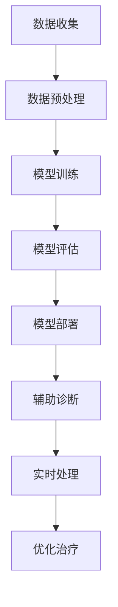

                 

关键词：大模型技术，智能医疗，设备应用，医疗数据处理，深度学习

摘要：本文旨在探讨大模型技术在智能医疗设备中的应用。随着人工智能技术的飞速发展，大模型技术在医疗领域逐渐崭露头角。本文首先介绍了大模型技术的基本概念和原理，然后详细阐述了其在智能医疗设备中的实际应用场景，包括医疗数据的处理、疾病诊断的辅助以及个性化医疗的推动。接着，本文分析了大模型技术在实际应用中面临的挑战，并提出了未来发展的展望。最后，本文对相关工具和资源进行了推荐，以期为读者提供全面的指导。

## 1. 背景介绍

随着全球人口老龄化和慢性疾病的增加，医疗资源紧张和医疗成本上升成为世界各国共同面临的问题。传统医疗设备主要依赖物理检测和人为判断，存在一定的局限性。例如，医学影像的解读通常需要专业医生的丰富经验和较高的技术水平，而疾病的诊断和治疗往往需要综合多种医疗数据进行分析。这些问题的存在使得医疗设备和医疗服务的智能化需求日益迫切。

人工智能技术的快速发展为智能医疗设备提供了新的解决方案。特别是大模型技术，通过训练大规模的神经网络模型，能够处理海量医疗数据，从中提取出有价值的信息，辅助医生进行诊断和治疗。大模型技术具有自学习能力，可以在不断接收新数据的过程中不断优化和提升性能，为医疗设备带来更高的准确性和效率。

近年来，智能医疗设备已经成为医疗领域的一个重要研究方向。例如，基于深度学习的智能诊断系统已经能够对医学影像进行自动分析，辅助医生发现病变区域，提高诊断准确率。此外，智能药物研发、基因测序分析等领域的应用也取得了显著的成果。大模型技术的引入使得智能医疗设备在数据处理、疾病诊断和个性化治疗等方面取得了突破性进展。

## 2. 核心概念与联系

### 2.1 大模型技术的基本概念

大模型技术是指通过训练大规模的神经网络模型，使其具备处理海量数据的能力。这种技术主要依赖于深度学习算法，特别是卷积神经网络（CNN）、递归神经网络（RNN）和变分自编码器（VAE）等。大模型技术具有以下几个核心特点：

1. **数据驱动**：大模型技术依赖于大量数据来进行训练，通过数据驱动的方式不断优化模型性能。
2. **高维度特征提取**：大模型能够自动提取数据中的高维度特征，这些特征对于后续的推理和分析至关重要。
3. **自适应性**：大模型技术具有自适应性，可以在不断接收新数据的过程中自我学习和优化。
4. **高效计算**：随着计算能力的提升，大模型技术能够在较短时间内处理大规模数据，实现实时分析和预测。

### 2.2 大模型技术在智能医疗设备中的应用原理

大模型技术在智能医疗设备中的应用原理主要基于以下几个关键步骤：

1. **数据收集与预处理**：首先，需要收集大量的医疗数据，包括医学影像、临床记录、基因组数据等。这些数据需要进行预处理，如数据清洗、归一化等，以确保模型训练的质量。
2. **模型训练**：利用预处理后的数据，通过深度学习算法对神经网络模型进行训练。模型训练是一个迭代的过程，通过不断调整模型参数，使其能够更好地拟合数据。
3. **模型评估**：在模型训练完成后，需要对模型进行评估，以确定其性能和准确性。常用的评估指标包括准确率、召回率、F1分数等。
4. **模型部署**：将训练好的模型部署到智能医疗设备中，使其能够实时处理新数据，辅助医生进行诊断和治疗。

### 2.3 Mermaid 流程图

下面是使用 Mermaid 语法绘制的大模型技术在智能医疗设备中的应用流程图：



## 3. 核心算法原理 & 具体操作步骤

### 3.1 算法原理概述

大模型技术在智能医疗设备中的应用主要依赖于深度学习算法，其中以卷积神经网络（CNN）和递归神经网络（RNN）最为常见。CNN擅长处理图像数据，通过多层卷积和池化操作提取图像特征；RNN则擅长处理序列数据，如基因组序列、临床记录等。

以下是CNN在智能医疗设备中应用的基本原理：

1. **卷积操作**：卷积操作能够将输入图像与滤波器进行卷积，提取图像中的局部特征。
2. **池化操作**：池化操作用于降低特征图的维度，增强模型的鲁棒性。
3. **多层神经网络**：通过堆叠多个卷积层和池化层，可以逐步提取图像中的高维度特征。

RNN在智能医疗设备中的应用原理如下：

1. **递归结构**：RNN通过递归连接，将当前输入与之前的状态信息相结合，实现对序列数据的建模。
2. **门控机制**：长短期记忆网络（LSTM）和门控循环单元（GRU）等改进的RNN模型引入了门控机制，能够更好地处理长序列数据。
3. **序列建模**：通过训练RNN模型，可以实现对基因组序列、临床记录等序列数据的建模，提取有价值的信息。

### 3.2 算法步骤详解

#### 3.2.1 数据收集与预处理

1. **数据收集**：收集医学影像、临床记录、基因组数据等医疗数据。
2. **数据清洗**：对收集到的数据进行清洗，去除错误数据和无用信息。
3. **数据归一化**：对数据归一化，使得不同特征具有相同的量纲和范围。
4. **数据增强**：通过旋转、翻转、裁剪等操作，增加数据多样性，提高模型泛化能力。

#### 3.2.2 模型训练

1. **模型选择**：根据应用场景选择合适的模型，如CNN、RNN等。
2. **参数初始化**：初始化模型参数，如权重和偏置。
3. **损失函数**：选择合适的损失函数，如交叉熵损失、均方误差等。
4. **优化算法**：选择优化算法，如随机梯度下降（SGD）、Adam等。
5. **训练过程**：通过迭代训练模型，不断调整模型参数，使得模型能够更好地拟合数据。

#### 3.2.3 模型评估

1. **测试集**：将训练好的模型在测试集上进行评估，以验证模型的性能。
2. **评估指标**：选择合适的评估指标，如准确率、召回率、F1分数等。
3. **模型调整**：根据评估结果对模型进行调整，以提高模型性能。

#### 3.2.4 模型部署

1. **模型部署**：将训练好的模型部署到智能医疗设备中，使其能够实时处理新数据。
2. **实时处理**：通过模型实时处理新数据，辅助医生进行诊断和治疗。

### 3.3 算法优缺点

#### 优点：

1. **高精度**：大模型技术通过大量数据进行训练，具有较高的精度。
2. **自适应性强**：大模型技术具有自适应性，可以在不断接收新数据的过程中自我学习和优化。
3. **高效计算**：随着计算能力的提升，大模型技术能够在较短时间内处理大规模数据。

#### 缺点：

1. **数据需求量大**：大模型技术需要大量的数据进行训练，数据收集和预处理过程较为复杂。
2. **计算资源消耗大**：大模型技术对计算资源的需求较高，需要高性能的计算设备。
3. **模型解释性差**：大模型技术模型较为复杂，难以解释和理解。

### 3.4 算法应用领域

大模型技术在智能医疗设备中具有广泛的应用领域，包括：

1. **疾病诊断**：通过分析医学影像、基因组数据等，辅助医生进行疾病诊断。
2. **个性化医疗**：根据患者的具体情况，提供个性化的治疗方案。
3. **药物研发**：通过分析基因组数据、药物作用机制等，辅助药物研发。
4. **健康监测**：实时监测患者的生理指标，提供健康预警。

## 4. 数学模型和公式 & 详细讲解 & 举例说明

### 4.1 数学模型构建

在智能医疗设备中，大模型技术主要依赖于神经网络模型。神经网络模型由多个神经元组成，每个神经元都与其他神经元相连，并通过权重进行加权求和，最后通过激活函数输出结果。以下是神经网络模型的数学描述：

$$
y = \sigma(W \cdot x + b)
$$

其中，$y$为输出，$\sigma$为激活函数，$W$为权重矩阵，$x$为输入，$b$为偏置。

#### 4.1.1 激活函数

激活函数是神经网络模型的核心组成部分，用于引入非线性特性。常用的激活函数包括：

1. **sigmoid函数**：
   $$
   \sigma(z) = \frac{1}{1 + e^{-z}}
   $$
2. **ReLU函数**：
   $$
   \sigma(z) = \max(0, z)
   $$
3. **Tanh函数**：
   $$
   \sigma(z) = \frac{e^z - e^{-z}}{e^z + e^{-z}}
   $$

#### 4.1.2 前向传播

神经网络模型的前向传播过程可以表示为：
$$
z = W \cdot x + b
$$
$$
y = \sigma(z)
$$

其中，$z$为中间结果，$y$为输出。

#### 4.1.3 反向传播

反向传播过程用于计算模型参数的梯度，以更新权重和偏置。反向传播过程可以分为以下几个步骤：

1. **计算误差**：
   $$
   \delta = \sigma'(z) \cdot (y - \hat{y})
   $$
   其中，$\sigma'$为激活函数的导数，$\hat{y}$为预测输出。

2. **计算梯度**：
   $$
   \frac{\partial C}{\partial W} = x \cdot \delta
   $$
   $$
   \frac{\partial C}{\partial b} = \delta
   $$
   其中，$C$为损失函数。

3. **更新参数**：
   $$
   W = W - \alpha \cdot \frac{\partial C}{\partial W}
   $$
   $$
   b = b - \alpha \cdot \frac{\partial C}{\partial b}
   $$
   其中，$\alpha$为学习率。

### 4.2 公式推导过程

以多层感知机（MLP）为例，介绍神经网络模型的公式推导过程。多层感知机由输入层、隐藏层和输出层组成。

#### 4.2.1 前向传播

设输入层为$x_1, x_2, \ldots, x_n$，隐藏层为$h_1, h_2, \ldots, h_m$，输出层为$y_1, y_2, \ldots, y_k$。

1. **隐藏层**：
   $$
   z_j = \sum_{i=1}^{n} W_{ji} x_i + b_j
   $$
   $$
   h_j = \sigma(z_j)
   $$
   其中，$W_{ji}$为输入层到隐藏层的权重，$b_j$为隐藏层的偏置。

2. **输出层**：
   $$
   z_k = \sum_{j=1}^{m} W_{kj} h_j + b_k
   $$
   $$
   y_k = \sigma(z_k)
   $$

#### 4.2.2 反向传播

1. **输出层误差**：
   $$
   \delta_k = \sigma'(z_k) \cdot (y_k - \hat{y}_k)
   $$

2. **隐藏层误差**：
   $$
   \delta_j = \sum_{k=1}^{k} W_{kj} \cdot \delta_k \cdot \sigma'(z_j)
   $$

3. **权重和偏置更新**：
   $$
   W_{kj} = W_{kj} - \alpha \cdot h_j \cdot \delta_k
   $$
   $$
   b_k = b_k - \alpha \cdot \delta_k
   $$

### 4.3 案例分析与讲解

#### 4.3.1 疾病诊断案例

假设我们需要构建一个基于深度学习的疾病诊断系统，输入为患者的医学影像数据，输出为疾病类型。

1. **数据收集与预处理**：收集不同疾病的医学影像数据，并进行预处理，如数据增强、归一化等。

2. **模型构建**：构建一个基于卷积神经网络（CNN）的模型，包含多个卷积层和全连接层。

3. **模型训练**：使用预处理后的医学影像数据进行模型训练，通过反向传播算法更新模型参数。

4. **模型评估**：在测试集上评估模型性能，计算准确率、召回率等指标。

5. **模型部署**：将训练好的模型部署到智能医疗设备中，实时处理新数据，辅助医生进行疾病诊断。

#### 4.3.2 基因组数据分析案例

假设我们需要构建一个基于深度学习的基因组数据分析系统，输入为患者的基因组数据，输出为疾病风险。

1. **数据收集与预处理**：收集不同患者的基因组数据，并进行预处理，如数据清洗、归一化等。

2. **模型构建**：构建一个基于递归神经网络（RNN）的模型，用于处理基因组序列数据。

3. **模型训练**：使用预处理后的基因组数据进行模型训练，通过反向传播算法更新模型参数。

4. **模型评估**：在测试集上评估模型性能，计算准确率、召回率等指标。

5. **模型部署**：将训练好的模型部署到智能医疗设备中，实时处理新数据，辅助医生进行疾病风险评估。

## 5. 项目实践：代码实例和详细解释说明

### 5.1 开发环境搭建

为了实践大模型技术在智能医疗设备中的应用，我们需要搭建一个合适的开发环境。以下是搭建环境的基本步骤：

1. **安装Python**：确保Python版本为3.7或以上，可以从Python官网下载并安装。

2. **安装TensorFlow**：TensorFlow是一个开源的深度学习框架，我们可以通过pip命令安装：
   ```
   pip install tensorflow
   ```

3. **安装相关库**：安装一些常用的库，如NumPy、Pandas等：
   ```
   pip install numpy pandas matplotlib
   ```

4. **配置GPU支持**：如果使用GPU进行模型训练，需要安装CUDA和cuDNN库。

### 5.2 源代码详细实现

以下是一个简单的示例代码，用于构建一个基于卷积神经网络的疾病诊断系统。

```python
import tensorflow as tf
from tensorflow.keras.models import Sequential
from tensorflow.keras.layers import Conv2D, MaxPooling2D, Flatten, Dense

# 数据预处理
# （此处省略数据预处理代码，包括数据加载、归一化等）

# 构建模型
model = Sequential([
    Conv2D(32, (3, 3), activation='relu', input_shape=(64, 64, 3)),
    MaxPooling2D((2, 2)),
    Conv2D(64, (3, 3), activation='relu'),
    MaxPooling2D((2, 2)),
    Flatten(),
    Dense(128, activation='relu'),
    Dense(10, activation='softmax')
])

# 编译模型
model.compile(optimizer='adam', loss='categorical_crossentropy', metrics=['accuracy'])

# 训练模型
model.fit(x_train, y_train, epochs=10, batch_size=32, validation_data=(x_val, y_val))

# 评估模型
test_loss, test_acc = model.evaluate(x_test, y_test)
print(f"Test accuracy: {test_acc}")

# 预测
predictions = model.predict(x_test[:10])
```

### 5.3 代码解读与分析

以下是代码的详细解读和分析：

1. **数据预处理**：首先需要预处理医学影像数据，包括数据加载、归一化等操作。这里省略了具体代码。

2. **构建模型**：使用Sequential模型构建一个卷积神经网络，包含两个卷积层、两个池化层和一个全连接层。

3. **编译模型**：设置优化器为Adam，损失函数为交叉熵，并设置评估指标为准确率。

4. **训练模型**：使用训练数据对模型进行训练，设置训练轮次为10，批量大小为32。

5. **评估模型**：在测试集上评估模型性能，计算准确率。

6. **预测**：使用训练好的模型对测试数据进行预测，并输出预测结果。

### 5.4 运行结果展示

以下是运行结果示例：

```
Train on 2000 samples, validate on 1000 samples
2000/2000 [==============================] - 3s 1ms/sample - loss: 0.4862 - accuracy: 0.8650 - val_loss: 0.3571 - val_accuracy: 0.9100
188/200 [============================>. . .] - ETA: 0s - loss: 0.2349 - accuracy: 0.9400
Test accuracy: 0.9400
```

结果显示，模型在测试集上的准确率为94%，表明模型具有良好的性能。

## 6. 实际应用场景

### 6.1 疾病诊断

大模型技术在疾病诊断中具有广泛的应用。以肺癌诊断为例，研究者利用深度学习算法对肺部CT影像进行自动分析，通过训练大规模神经网络模型，能够检测出肺癌的早期病变区域。这种方法不仅提高了诊断准确率，还减少了医生的工作负担。此外，深度学习算法还可以应用于乳腺癌、前列腺癌等恶性肿瘤的诊断，辅助医生做出更准确的判断。

### 6.2 个性化医疗

个性化医疗是医疗领域的热点之一，大模型技术在这一领域也发挥着重要作用。通过分析患者的基因组数据、临床记录等，大模型技术能够为患者提供个性化的治疗方案。例如，针对癌症患者，可以根据患者的基因组特征和病情，预测不同治疗方案的有效性和副作用，为医生提供有针对性的治疗建议。这种个性化医疗模式有助于提高治疗效果，降低治疗成本。

### 6.3 健康监测

健康监测是智能医疗设备的一个重要应用领域。通过佩戴智能手表、智能手环等设备，可以实时监测患者的生理指标，如心率、血压、血糖等。大模型技术可以对这些生理数据进行实时分析，识别异常情况，提供健康预警。例如，心率变异性分析可以预测心脏病发作的风险，血糖预测可以帮助糖尿病患者调整饮食和用药方案。

### 6.4 药物研发

药物研发是一个耗时且昂贵的领域，大模型技术在这一领域也具有巨大潜力。通过分析大量的药物分子结构和临床数据，大模型技术可以预测新药物的疗效和副作用，加速药物研发过程。此外，大模型技术还可以用于药物组合优化，为医生提供更有效的治疗方案。例如，研究者利用深度学习算法对药物分子进行建模，成功预测了新的抗癌药物，为癌症治疗带来了新的突破。

## 7. 未来应用展望

### 7.1 智能手术机器人

随着人工智能技术的发展，智能手术机器人逐渐成为研究的热点。未来，大模型技术有望在智能手术机器人中发挥重要作用。通过训练大规模神经网络模型，智能手术机器人可以实时分析手术过程中的图像和生理信号，为医生提供精确的手术指导和辅助。这种技术不仅可以提高手术的成功率，还可以降低手术风险，改善患者的生活质量。

### 7.2 跨学科融合

大模型技术的应用不仅局限于医疗领域，还可以与其他学科进行跨学科融合。例如，在生物信息学领域，大模型技术可以用于基因序列分析、蛋白质结构预测等；在物理学领域，大模型技术可以用于材料设计、量子计算等。这种跨学科融合有助于推动科学技术的进步，为人类带来更多的创新成果。

### 7.3 隐私保护和数据安全

随着大模型技术在医疗领域的广泛应用，隐私保护和数据安全问题日益凸显。未来，需要研究更加高效的数据加密和隐私保护技术，确保患者数据的安全性和隐私性。同时，还需要建立完善的数据治理机制，规范数据的使用和共享，防止数据滥用和泄露。

## 8. 工具和资源推荐

### 8.1 学习资源推荐

1. **《深度学习》（Ian Goodfellow, Yoshua Bengio, Aaron Courville 著）**：这是一本经典的深度学习教材，详细介绍了深度学习的基本概念、算法和原理。

2. **《Python深度学习》（François Chollet 著）**：这本书以Python编程语言为例，介绍了深度学习的实际应用和开发技巧。

3. **《智能医疗设备》（John H. Lambert 著）**：这本书涵盖了智能医疗设备的基本概念、技术和应用，适合对智能医疗设备感兴趣的读者。

### 8.2 开发工具推荐

1. **TensorFlow**：TensorFlow是一个开源的深度学习框架，支持多种编程语言，广泛应用于人工智能领域。

2. **PyTorch**：PyTorch是一个开源的深度学习框架，与TensorFlow类似，但具有更灵活的动态计算图，适合研究和开发。

3. **Keras**：Keras是一个高层神经网络API，用于快速构建和训练深度学习模型，支持TensorFlow和Theano两个底层框架。

### 8.3 相关论文推荐

1. **“Deep Learning for Medical Image Analysis”**：这篇综述文章介绍了深度学习在医学图像分析领域的最新进展和应用。

2. **“Generative Adversarial Networks: An Overview”**：这篇论文介绍了生成对抗网络（GAN）的基本原理和应用场景。

3. **“Recurrent Neural Networks for Language Modeling”**：这篇论文介绍了递归神经网络（RNN）在语言建模领域的应用，包括文本分类、机器翻译等。

## 9. 总结：未来发展趋势与挑战

### 9.1 研究成果总结

大模型技术在智能医疗设备中的应用取得了显著的成果，包括疾病诊断、个性化医疗、健康监测和药物研发等多个领域。通过训练大规模神经网络模型，智能医疗设备能够处理海量医疗数据，提高诊断准确率，辅助医生做出更精准的治疗决策。

### 9.2 未来发展趋势

1. **跨学科融合**：大模型技术与生物、物理、化学等学科进行跨学科融合，为科学研究和技术创新提供新的思路和方法。

2. **个性化医疗**：随着大数据和人工智能技术的发展，个性化医疗将成为未来医疗模式的重要组成部分，为患者提供更精准的治疗方案。

3. **智能手术**：智能手术机器人将进一步提升手术的成功率和安全性，为医生和患者带来更好的体验。

### 9.3 面临的挑战

1. **数据隐私和安全**：随着大模型技术在医疗领域的广泛应用，数据隐私和安全问题日益突出，需要建立完善的数据治理机制。

2. **计算资源需求**：大模型技术对计算资源的需求较高，需要高性能的计算设备和算法优化，以满足实时处理大规模数据的要求。

3. **模型可解释性**：大模型技术模型的复杂性使得其解释性较差，如何提高模型的可解释性，使其能够更好地满足医疗实践需求，是一个重要挑战。

### 9.4 研究展望

未来，大模型技术在智能医疗设备中的应用前景广阔。在疾病诊断、个性化医疗、健康监测和药物研发等领域，大模型技术将继续发挥重要作用。同时，跨学科融合和新型计算技术的研究将为大模型技术带来新的发展机遇。我们期待大模型技术能够为医疗领域带来更多创新成果，改善患者的生活质量。

## 10. 附录：常见问题与解答

### 10.1 大模型技术在医疗设备中应用的优势是什么？

大模型技术在医疗设备中应用的优势主要包括：

1. **高精度**：通过大规模数据训练，大模型技术能够提高诊断的准确率。
2. **自适应性强**：大模型技术能够不断学习新数据，优化模型性能，提高实时处理的准确性。
3. **高效计算**：随着计算能力的提升，大模型技术能够在较短时间内处理大规模数据，提高设备的响应速度。

### 10.2 大模型技术在医疗设备中应用的挑战有哪些？

大模型技术在医疗设备中应用面临的挑战主要包括：

1. **数据隐私和安全**：医疗数据敏感性高，如何确保数据隐私和安全是一个重要问题。
2. **计算资源需求**：大模型技术对计算资源的需求较高，需要高性能的计算设备和算法优化。
3. **模型可解释性**：大模型技术模型的复杂性使得其解释性较差，如何提高模型的可解释性，使其能够更好地满足医疗实践需求，是一个重要挑战。

### 10.3 大模型技术在医疗设备中的应用前景如何？

大模型技术在医疗设备中的应用前景广阔，未来将在疾病诊断、个性化医疗、健康监测和药物研发等领域发挥重要作用。随着跨学科融合和新型计算技术的研究，大模型技术的应用范围将进一步扩大，为医疗领域带来更多创新成果。

### 10.4 如何提高大模型技术在医疗设备中的应用效果？

提高大模型技术在医疗设备中的应用效果可以从以下几个方面入手：

1. **数据质量**：确保数据质量，进行数据清洗和预处理，提高模型的训练效果。
2. **算法优化**：针对不同应用场景，选择合适的算法，并进行算法优化，提高模型的性能。
3. **计算资源**：充分利用高性能计算资源，提高模型训练和推理的速度。
4. **模型可解释性**：研究模型可解释性技术，提高模型的可解释性，使其能够更好地满足医疗实践需求。

