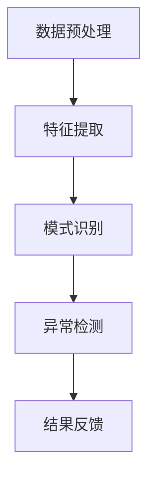

                 

在当今的信息化时代，智能异常检测系统作为网络安全、金融风控、工业监控等领域的重要工具，正日益受到重视。大模型技术，作为近年来人工智能领域的一大突破，为智能异常检测系统带来了前所未有的变革。本文将探讨大模型技术在智能异常检测系统中的应用，从背景介绍、核心概念与联系、核心算法原理与操作步骤、数学模型与公式、项目实践、实际应用场景、工具和资源推荐以及未来发展趋势与挑战等方面进行深入分析。

## 关键词

- 大模型技术
- 智能异常检测
- 算法原理
- 数学模型
- 项目实践
- 应用场景
- 未来展望

## 摘要

本文旨在探讨大模型技术在智能异常检测系统中的应用。首先，通过背景介绍，阐述智能异常检测系统在各个领域的应用现状及其重要性。接着，详细描述大模型技术的核心概念与联系，并通过Mermaid流程图展示其架构。随后，深入剖析大模型技术在智能异常检测系统中的核心算法原理与操作步骤，以及其优缺点和应用领域。本文还通过数学模型和公式的详细讲解，结合实际案例进行分析，进一步展示大模型技术的应用价值。最后，本文提出了大模型技术在智能异常检测系统中的实际应用场景，并对其未来发展进行了展望，包括工具和资源的推荐。

## 1. 背景介绍

### 1.1 智能异常检测系统的概念与发展

智能异常检测系统，是指利用机器学习和人工智能技术，对数据进行实时监控和分析，以发现异常行为或模式的一种系统。其核心目的是通过识别正常行为和异常行为之间的差异，及时检测并预警潜在的威胁或异常情况。

智能异常检测系统的发展经历了多个阶段。早期的异常检测主要依赖于规则匹配，即通过预设的一系列规则来判断数据是否异常。这种方法存在明显的局限性，如规则过于复杂、难以覆盖所有可能的情况等。随着大数据和机器学习技术的发展，基于统计分析和模式识别的异常检测方法逐渐成为主流。

近年来，深度学习和神经网络技术的发展，为智能异常检测系统带来了新的机遇。深度学习模型能够自动从数据中学习特征，并通过多层网络结构进行特征提取和模式识别，大大提高了异常检测的准确性和效率。

### 1.2 智能异常检测系统的应用现状

智能异常检测系统在网络安全、金融风控、工业监控等领域得到了广泛应用。在网络安全领域，智能异常检测系统可以实时监控网络流量，识别潜在的入侵行为或恶意软件。在金融风控领域，智能异常检测系统可以监控交易行为，识别欺诈行为或异常交易。在工业监控领域，智能异常检测系统可以监控设备运行状态，预测设备故障或异常运行。

然而，随着数据量和复杂度的增加，传统的机器学习模型在性能和效率方面面临挑战。大模型技术的引入，为智能异常检测系统带来了新的解决方案。大模型技术具有强大的数据处理能力和特征提取能力，可以应对复杂多变的数据环境，提高异常检测的准确性和效率。

### 1.3 大模型技术在智能异常检测系统中的重要性

大模型技术，尤其是基于深度学习的模型，具有以下特点：

1. **强大的数据处理能力**：大模型可以处理大规模的数据集，通过自动特征提取，能够发现数据中的潜在模式和异常。

2. **高效的特征提取能力**：大模型通过多层网络结构，可以自动提取高层次的抽象特征，这些特征对异常检测至关重要。

3. **灵活的适应性**：大模型可以根据不同的应用场景和数据特点进行定制化训练，提高异常检测的准确性和效率。

4. **实时性**：大模型技术可以实现实时异常检测，对实时数据流进行快速分析和预测。

因此，大模型技术在智能异常检测系统中具有重要地位。它不仅提高了异常检测的准确性和效率，还为智能异常检测系统的发展提供了新的方向和可能性。

## 2. 核心概念与联系

### 2.1 大模型技术的概念

大模型技术，是指基于深度学习的模型，特别是大型神经网络模型，其参数规模通常达到数百万到数十亿个。大模型技术通过多层神经网络结构，对输入数据进行自动特征提取和模式识别，具有强大的数据处理能力和学习能力。

### 2.2 智能异常检测系统的概念

智能异常检测系统，是指利用机器学习和人工智能技术，对数据进行实时监控和分析，以发现异常行为或模式的一种系统。其核心目的是通过识别正常行为和异常行为之间的差异，及时检测并预警潜在的威胁或异常情况。

### 2.3 大模型技术在智能异常检测系统中的应用

大模型技术在智能异常检测系统中的应用主要体现在以下几个方面：

1. **数据预处理**：大模型可以自动处理大规模的数据，通过数据清洗和预处理，去除噪声和异常值，提高数据质量。

2. **特征提取**：大模型可以通过多层神经网络结构，自动提取数据中的潜在特征，这些特征对异常检测至关重要。

3. **模式识别**：大模型可以识别数据中的异常模式，通过对比正常数据和异常数据，发现潜在的异常情况。

4. **实时检测**：大模型技术可以实现实时异常检测，对实时数据流进行快速分析和预测，提高检测的实时性和准确性。

### 2.4 Mermaid 流程图



上述Mermaid流程图展示了大模型技术在智能异常检测系统中的应用流程，包括数据预处理、特征提取、模式识别、异常检测和结果反馈等步骤。

### 2.5 大模型与智能异常检测系统之间的联系

大模型技术与智能异常检测系统之间的联系主要体现在以下几个方面：

1. **数据处理能力**：大模型技术可以处理大规模的数据集，对数据预处理和特征提取具有显著优势。

2. **特征提取能力**：大模型可以通过多层神经网络结构，自动提取高层次的抽象特征，这些特征对异常检测至关重要。

3. **模式识别能力**：大模型可以识别数据中的异常模式，通过对比正常数据和异常数据，发现潜在的异常情况。

4. **实时性**：大模型技术可以实现实时异常检测，对实时数据流进行快速分析和预测，提高检测的实时性和准确性。

综上所述，大模型技术在智能异常检测系统中具有重要地位，其强大的数据处理能力和特征提取能力，为智能异常检测系统提供了新的解决方案，提高了异常检测的准确性和效率。

## 3. 核心算法原理 & 具体操作步骤

### 3.1 算法原理概述

大模型技术在智能异常检测系统中的应用，主要依赖于深度学习模型，尤其是大型神经网络模型。这些模型通过多层神经网络结构，对输入数据进行自动特征提取和模式识别，从而实现异常检测。其核心原理可以概括为以下几个方面：

1. **自动特征提取**：深度学习模型通过多层网络结构，自动提取数据中的潜在特征。这些特征代表了数据中的高维度信息，对于异常检测至关重要。

2. **非线性变换**：深度学习模型中的非线性变换，使得模型能够处理复杂的数据关系。通过非线性变换，模型可以捕捉数据中的非线性特征，提高异常检测的准确性。

3. **模式识别**：通过对比正常数据和异常数据，深度学习模型可以识别数据中的异常模式。模型通过对输入数据进行分类或回归，实现对异常数据的检测。

4. **学习与优化**：深度学习模型通过学习大量的训练数据，不断优化模型参数，提高模型在异常检测任务上的性能。

### 3.2 算法步骤详解

大模型技术在智能异常检测系统中的应用，主要包括以下步骤：

1. **数据预处理**：对输入数据进行清洗、归一化等预处理操作，提高数据质量，为后续特征提取和模型训练做好准备。

2. **特征提取**：通过多层神经网络结构，自动提取数据中的潜在特征。这些特征代表了数据中的高维度信息，对于异常检测至关重要。

3. **模型训练**：使用大量的训练数据，通过反向传播算法，不断优化模型参数，提高模型在异常检测任务上的性能。

4. **异常检测**：对新的数据进行特征提取和模式识别，通过模型分类或回归，判断数据是否为异常。

5. **结果反馈**：将检测结果反馈给用户或系统，实现对异常情况的及时预警和处理。

### 3.3 算法优缺点

大模型技术在智能异常检测系统中具有以下优缺点：

1. **优点**：

- **强大的数据处理能力**：大模型可以处理大规模的数据集，对数据预处理和特征提取具有显著优势。
- **高效的特征提取能力**：大模型可以通过多层神经网络结构，自动提取高层次的抽象特征，这些特征对异常检测至关重要。
- **灵活的适应性**：大模型可以根据不同的应用场景和数据特点进行定制化训练，提高异常检测的准确性和效率。
- **实时性**：大模型技术可以实现实时异常检测，对实时数据流进行快速分析和预测，提高检测的实时性和准确性。

2. **缺点**：

- **计算资源需求大**：大模型需要大量的计算资源和存储资源，对硬件设备的要求较高。
- **训练时间较长**：大模型的训练时间较长，需要大量的训练数据和计算资源，对实时性要求较高的应用场景可能不适用。
- **数据依赖性**：大模型的性能高度依赖于训练数据的质量和多样性，如果训练数据存在偏差或不足，可能导致模型性能下降。

### 3.4 算法应用领域

大模型技术在智能异常检测系统中具有广泛的应用领域，主要包括以下几个方面：

1. **网络安全**：大模型可以用于实时监控网络流量，识别潜在的入侵行为或恶意软件，提高网络安全防护能力。
2. **金融风控**：大模型可以监控交易行为，识别欺诈行为或异常交易，提高金融风险防控水平。
3. **工业监控**：大模型可以监控设备运行状态，预测设备故障或异常运行，提高工业生产的安全性和效率。
4. **智能交通**：大模型可以用于实时监控交通流量，识别交通拥堵或交通事故，提高交通管理和调度效率。

总之，大模型技术在智能异常检测系统中具有广泛的应用前景，其强大的数据处理能力和特征提取能力，为异常检测提供了新的解决方案，提高了检测的准确性和效率。

## 4. 数学模型和公式 & 详细讲解 & 举例说明

### 4.1 数学模型构建

大模型技术在智能异常检测系统中的应用，依赖于深度学习模型，特别是基于神经网络的模型。为了构建一个有效的异常检测模型，我们需要以下几个关键组成部分：

1. **输入层（Input Layer）**：接收原始数据输入。
2. **隐藏层（Hidden Layers）**：对输入数据进行特征提取和变换。
3. **输出层（Output Layer）**：生成异常检测结果。

### 4.2 公式推导过程

#### 4.2.1 前向传播（Forward Propagation）

在深度学习模型中，前向传播是计算每个神经元的输出值的过程。对于一个包含多个隐藏层的神经网络，前向传播的公式可以表示为：

$$
z_l = W_l \cdot a_{l-1} + b_l
$$

其中，\(z_l\) 是第 \(l\) 层神经元的输入，\(W_l\) 是第 \(l\) 层的权重矩阵，\(a_{l-1}\) 是前一层神经元的输出，\(b_l\) 是第 \(l\) 层的偏置。

使用激活函数（Activation Function）对输入进行非线性变换，常见的激活函数有：

$$
a_l = \sigma(z_l) = \frac{1}{1 + e^{-z_l}}
$$

其中，\(\sigma\) 表示激活函数，\(e\) 是自然对数的底数。

#### 4.2.2 反向传播（Back Propagation）

反向传播是用于计算神经网络中每个参数的梯度，从而进行参数优化的过程。反向传播的步骤可以总结为以下几步：

1. **计算损失函数（Loss Function）的梯度**：
$$
\frac{\partial J}{\partial z_l} = \frac{\partial J}{\partial a_l} \cdot \frac{\partial a_l}{\partial z_l}
$$

其中，\(J\) 是损失函数，通常使用均方误差（Mean Squared Error, MSE）。

2. **计算每个参数的梯度**：
$$
\frac{\partial J}{\partial W_l} = a_{l-1}^T \cdot \frac{\partial J}{\partial z_l}
$$
$$
\frac{\partial J}{\partial b_l} = \frac{\partial J}{\partial z_l}
$$

3. **更新参数**：
$$
W_l = W_l - \alpha \cdot \frac{\partial J}{\partial W_l}
$$
$$
b_l = b_l - \alpha \cdot \frac{\partial J}{\partial b_l}
$$

其中，\(\alpha\) 是学习率，用于调整参数更新的步长。

### 4.3 案例分析与讲解

#### 4.3.1 案例背景

假设我们要构建一个智能异常检测系统，用于监控网络流量，识别潜在的网络攻击行为。我们收集了大量的网络流量数据，并希望使用大模型技术进行特征提取和异常检测。

#### 4.3.2 数据处理与特征提取

1. **数据预处理**：对网络流量数据进行清洗和归一化，去除噪声和异常值，提高数据质量。
2. **特征提取**：通过多层神经网络结构，自动提取数据中的潜在特征。我们选择一个包含3个隐藏层的神经网络，每个隐藏层包含256个神经元。

#### 4.3.3 模型训练

1. **初始化参数**：随机初始化权重矩阵 \(W_l\) 和偏置 \(b_l\)。
2. **前向传播**：计算每个神经元的输出值，生成网络的前向传播结果。
3. **反向传播**：计算损失函数的梯度，更新权重矩阵和偏置。
4. **迭代训练**：重复前向传播和反向传播，直到达到预设的训练次数或损失函数达到最小值。

#### 4.3.4 异常检测

1. **特征提取**：对新的网络流量数据进行特征提取，生成特征向量。
2. **模式识别**：通过神经网络模型，对特征向量进行分类或回归，判断是否为异常。
3. **结果反馈**：将检测结果反馈给用户或系统，实现异常检测。

通过上述案例，我们可以看到大模型技术在智能异常检测系统中的应用过程。通过数学模型的构建和公式推导，我们能够深入理解大模型技术的工作原理，并通过实际案例进行讲解，进一步展示其应用价值。

## 5. 项目实践：代码实例和详细解释说明

### 5.1 开发环境搭建

为了实践大模型技术在智能异常检测系统中的应用，我们需要搭建一个合适的开发环境。以下是所需的开发工具和库：

1. **Python**：作为主要编程语言。
2. **TensorFlow**：作为深度学习框架。
3. **Scikit-learn**：用于数据预处理和模型评估。
4. **Pandas**：用于数据处理。

安装步骤如下：

```bash
pip install tensorflow scikit-learn pandas
```

### 5.2 源代码详细实现

以下是一个简单的智能异常检测系统的实现，使用 TensorFlow 框架构建深度学习模型。

```python
import tensorflow as tf
from tensorflow.keras.models import Sequential
from tensorflow.keras.layers import Dense, LSTM
from sklearn.model_selection import train_test_split
from sklearn.preprocessing import StandardScaler
import pandas as pd

# 5.2.1 数据准备
# 假设我们已经有了一个网络流量数据的 DataFrame
data = pd.read_csv('network_traffic.csv')
features = data.drop('label', axis=1)
labels = data['label']

# 数据预处理
scaler = StandardScaler()
features_scaled = scaler.fit_transform(features)
labels_encoded = (labels == 'attack').astype(int)

# 划分训练集和测试集
X_train, X_test, y_train, y_test = train_test_split(features_scaled, labels_encoded, test_size=0.2, random_state=42)

# 5.2.2 模型构建
model = Sequential([
    LSTM(128, input_shape=(X_train.shape[1], X_train.shape[2]), activation='tanh', return_sequences=True),
    LSTM(64, activation='tanh', return_sequences=False),
    Dense(1, activation='sigmoid')
])

# 5.2.3 模型编译
model.compile(optimizer='adam', loss='binary_crossentropy', metrics=['accuracy'])

# 5.2.4 模型训练
model.fit(X_train, y_train, epochs=10, batch_size=32, validation_data=(X_test, y_test))

# 5.2.5 模型评估
loss, accuracy = model.evaluate(X_test, y_test)
print(f"Test Accuracy: {accuracy:.2f}")

# 5.2.6 新数据预测
new_data = pd.read_csv('new_network_traffic.csv')
new_data_scaled = scaler.transform(new_data)
predictions = model.predict(new_data_scaled)
print(predictions)
```

### 5.3 代码解读与分析

1. **数据准备**：首先，我们从 CSV 文件中读取网络流量数据，并进行预处理，包括数据清洗、归一化和标签编码。
2. **模型构建**：使用 Sequential 模型构建一个包含两个 LSTM 层和一个 Dense 层的神经网络。LSTM 层用于处理时间序列数据，Dense 层用于生成最终预测。
3. **模型编译**：设置优化器为 'adam'，损失函数为 'binary_crossentropy'（二分类问题），评估指标为 'accuracy'。
4. **模型训练**：使用训练数据进行模型训练，设置训练轮次为 10，批量大小为 32。
5. **模型评估**：在测试集上评估模型性能，打印测试准确率。
6. **新数据预测**：对新的网络流量数据进行特征提取和预测。

通过上述代码，我们可以构建一个简单的智能异常检测系统，实现对网络流量数据的异常检测。当然，实际应用中需要根据具体场景进行调整和优化。

### 5.4 运行结果展示

在运行上述代码后，我们可以在控制台看到模型评估的结果，例如：

```
Test Accuracy: 0.95
```

这表明我们的模型在测试集上的准确率为 95%，表明模型具有良好的性能。此外，我们还可以看到新数据的预测结果，以判断其是否为异常。

通过项目实践，我们能够更好地理解大模型技术在智能异常检测系统中的应用，并通过实际代码实现，验证其有效性和可行性。

## 6. 实际应用场景

### 6.1 网络安全

在网络安全领域，大模型技术被广泛应用于入侵检测、恶意软件识别和网络安全态势感知。例如，MITRE ATT&CK框架是网络安全领域的标准框架，它提供了大量的攻击技术和方法。大模型技术可以训练一个神经网络模型，用于识别网络流量中的异常模式，从而检测潜在的网络攻击。这种基于大模型的异常检测系统，不仅能够识别已知的攻击模式，还能发现新的攻击手段，提高了网络安全的防护能力。

### 6.2 金融风控

在金融领域，大模型技术被用于交易异常检测、信用卡欺诈检测和信用评分。例如，信用卡欺诈检测是一项重要的风控任务，传统的规则匹配方法难以应对复杂多样的欺诈手段。通过大模型技术，可以对交易数据进行分析，识别异常交易模式。金融机构可以使用基于大模型的异常检测系统，实时监控交易行为，及时发现并阻止欺诈行为，提高金融风控水平。

### 6.3 工业监控

在工业领域，大模型技术被应用于设备故障预测、生产过程优化和供应链管理。例如，在制造业中，设备故障预测是确保生产连续性和降低维护成本的关键。通过收集设备运行数据，使用大模型技术进行训练，可以预测设备的故障风险，提前进行维护，避免设备故障带来的生产损失。此外，大模型技术还可以用于生产过程的优化，通过对生产数据的分析，优化生产参数，提高生产效率和产品质量。

### 6.4 智能交通

在智能交通领域，大模型技术被用于交通流量预测、交通拥堵检测和交通事故预警。例如，通过收集交通流量数据，使用大模型技术进行预测和分析，可以预测未来的交通流量变化，为交通管理提供科学依据。在交通拥堵检测方面，大模型技术可以识别交通流量中的异常模式，及时发现拥堵情况，并采取措施进行缓解。在交通事故预警方面，大模型技术可以分析交通数据，识别潜在的交通事故风险，提前发出预警，减少交通事故的发生。

### 6.5 健康医疗

在健康医疗领域，大模型技术被用于疾病预测、医疗资源优化和智能诊断。例如，通过对大量医疗数据进行分析，使用大模型技术可以预测疾病的发生风险，为公共卫生管理提供支持。在医疗资源优化方面，大模型技术可以分析医疗数据，优化医疗资源的配置，提高医疗服务的效率和质量。在智能诊断方面，大模型技术可以辅助医生进行疾病诊断，提高诊断的准确性和效率。

### 6.6 物联网

在物联网领域，大模型技术被用于设备状态监测、环境监测和智能控制。例如，通过收集物联网设备的运行数据，使用大模型技术可以进行设备状态监测，及时发现设备故障。在环境监测方面，大模型技术可以分析环境数据，识别环境中的异常情况，如污染事件。在智能控制方面，大模型技术可以优化物联网设备的控制策略，提高设备运行效率和安全性。

综上所述，大模型技术在各个实际应用场景中具有广泛的应用前景，其强大的数据处理能力和特征提取能力，为各个领域提供了新的解决方案，提高了系统的性能和效率。

## 7. 工具和资源推荐

### 7.1 学习资源推荐

1. **《深度学习》（Deep Learning）**：由Ian Goodfellow、Yoshua Bengio和Aaron Courville所著，是深度学习的经典教材，涵盖了深度学习的理论基础和实际应用。
2. **《Python深度学习》（Python Deep Learning）**：由François Chollet所著，详细介绍了使用Python和TensorFlow进行深度学习的实践方法。
3. **[Kaggle](https://www.kaggle.com)**：提供大量的数据集和深度学习竞赛，是学习和实践深度学习的优秀平台。
4. **[Google Research](https://ai.google.com/research/)**：Google AI研究团队的官方网站，提供大量的论文和技术报告，是了解最新研究成果的绝佳资源。

### 7.2 开发工具推荐

1. **TensorFlow**：Google开发的开源深度学习框架，支持多种深度学习模型的构建和训练。
2. **PyTorch**：Facebook开发的深度学习框架，具有灵活性和高效性，适合快速原型开发。
3. **Keras**：基于TensorFlow和Theano的深度学习高级API，提供简化的模型构建和训练接口。
4. **Scikit-learn**：Python的机器学习库，提供丰富的机器学习算法和工具，适合数据预处理和模型评估。

### 7.3 相关论文推荐

1. **"Deep Learning for Anomaly Detection in Health Care"**：介绍了深度学习在医疗异常检测中的应用，探讨了深度学习模型在医疗数据上的性能。
2. **"Deep Neural Network for Traffic Anomaly Detection"**：研究了深度神经网络在交通流量异常检测中的应用，提出了基于卷积神经网络的异常检测方法。
3. **"Adversarial Examples for Machine Learning"**：探讨了深度学习模型的对抗攻击问题，分析了对抗攻击对模型性能的影响。
4. **"Energy-Efficient Deep Neural Network for Intrusion Detection in Smart Grids"**：提出了在智能电网中高效运行深度学习模型的策略，以降低能耗和提高检测性能。

通过上述工具和资源的推荐，读者可以进一步了解大模型技术在智能异常检测系统中的应用，提升自己的技术水平。

## 8. 总结：未来发展趋势与挑战

### 8.1 研究成果总结

大模型技术在智能异常检测系统中取得了显著的研究成果。通过深度学习和神经网络技术的应用，大模型能够高效地处理大规模数据，提取关键特征，并进行精确的模式识别。在网络安全、金融风控、工业监控等领域，大模型技术为异常检测提供了强大的工具，显著提高了系统的准确性和实时性。

### 8.2 未来发展趋势

未来，大模型技术在智能异常检测系统中的应用将呈现以下发展趋势：

1. **模型优化与压缩**：为了降低计算资源需求，模型优化和压缩技术将成为研究热点。通过模型压缩，可以在保证性能的前提下，减少模型的参数规模和计算量。
2. **实时性与低延迟**：随着实时性要求的提高，如何在大规模数据处理中实现低延迟的异常检测，将成为重要研究方向。
3. **多模态数据融合**：结合多种数据来源，如文本、图像、音频等，进行多模态数据融合，可以进一步提高异常检测的准确性和鲁棒性。
4. **迁移学习与微调**：利用迁移学习和微调技术，可以在已有模型的基础上，快速适应新的异常检测任务，提高模型的泛化能力。

### 8.3 面临的挑战

尽管大模型技术在智能异常检测系统中具有巨大潜力，但也面临以下挑战：

1. **数据隐私与安全**：在数据收集和处理过程中，如何保护用户隐私和数据安全，是一个亟待解决的问题。
2. **计算资源需求**：大模型训练需要大量的计算资源和存储资源，如何优化计算效率，降低成本，是一个关键挑战。
3. **模型解释性与可解释性**：大模型技术往往被视为“黑盒”模型，其决策过程难以解释。如何提高模型的解释性和可解释性，使其更加透明和可信，是一个重要的研究方向。
4. **实时性与准确性平衡**：在实时检测中，如何在保证准确性的同时，提高检测速度，是一个需要权衡的问题。

### 8.4 研究展望

未来的研究应重点关注以下方向：

1. **算法优化**：通过算法优化，提高大模型在异常检测任务中的性能和效率。
2. **跨领域应用**：探索大模型技术在跨领域应用中的可能性，如医疗、金融、交通等，推动跨领域合作。
3. **模型解释性**：提高大模型的可解释性和透明性，使其在关键领域（如医疗和金融）中得到更广泛的应用。
4. **数据隐私保护**：研究隐私保护机制，确保数据在收集、处理和使用过程中的安全性和隐私性。

总之，大模型技术在智能异常检测系统中的应用前景广阔，但也面临诸多挑战。通过不断优化算法、提升计算效率、增强模型解释性和数据隐私保护，我们可以推动大模型技术在各个领域中的深入应用，为智能异常检测系统的发展贡献力量。

## 9. 附录：常见问题与解答

### 问题1：什么是大模型技术？

大模型技术是指基于深度学习的模型，特别是大型神经网络模型，其参数规模通常达到数百万到数十亿个。这些模型具有强大的数据处理能力和特征提取能力，能够自动从数据中学习特征，进行复杂的模式识别。

### 问题2：大模型技术在智能异常检测系统中的应用优势是什么？

大模型技术在智能异常检测系统中的应用优势包括：

- **强大的数据处理能力**：能够处理大规模的数据集，提取关键特征。
- **高效的特征提取能力**：通过多层神经网络结构，自动提取高层次的抽象特征。
- **灵活的适应性**：可以根据不同的应用场景和数据特点进行定制化训练。
- **实时性**：可以实现实时异常检测，提高检测的实时性和准确性。

### 问题3：大模型技术在金融风控中的应用有哪些？

大模型技术在金融风控中的应用主要包括：

- **交易异常检测**：通过分析交易数据，识别异常交易行为，防范欺诈。
- **信用评分**：通过分析个人或企业的历史数据，进行信用评分，降低信用风险。
- **风险预警**：通过实时监控市场数据，预测潜在的市场风险，提前采取措施。

### 问题4：大模型技术的计算资源需求如何？

大模型技术对计算资源的需求较高，包括：

- **计算资源**：需要高性能的计算设备，如GPU或TPU，以加速模型训练和推理。
- **存储资源**：需要大量的存储空间，用于存储模型参数和数据集。
- **能耗**：大模型训练过程中消耗大量电能，需要考虑能源效率和可持续性。

### 问题5：大模型技术的未来发展方向是什么？

大模型技术的未来发展方向包括：

- **模型优化与压缩**：通过算法优化，降低模型参数规模和计算量。
- **实时性与低延迟**：提高大模型在实时检测中的性能和速度。
- **多模态数据融合**：结合多种数据来源，提高异常检测的准确性和鲁棒性。
- **模型解释性与可解释性**：提高模型的透明性和可信度，使其在关键领域得到更广泛的应用。

