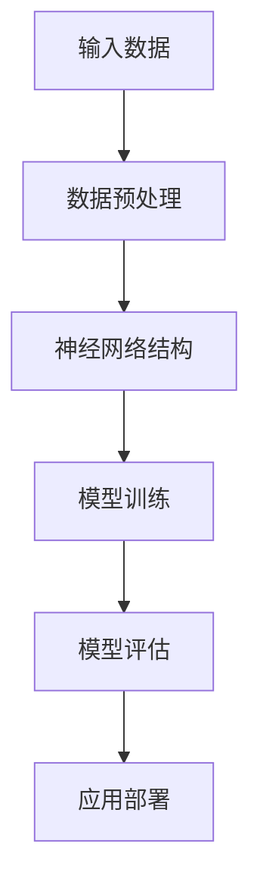

                 

关键词：大模型技术、法律服务、人工智能、自然语言处理、智能合约、自动化审计、合同管理、法律咨询

> 摘要：本文将探讨大模型技术，如深度学习和自然语言处理（NLP），在法律服务中的应用前景。通过分析大模型技术的核心概念和原理，阐述其在法律文本分析、合同管理、法律咨询和智能司法等领域的应用，并展望未来的发展方向与挑战。

## 1. 背景介绍

### 1.1 大模型技术的发展

大模型技术，特别是深度学习，近年来取得了显著的进展。这些模型能够通过大量的数据进行训练，以实现对复杂任务的高效处理。例如，自然语言处理（NLP）模型如BERT、GPT和T5，已经被广泛应用于文本分类、机器翻译、情感分析等任务。

### 1.2 法律服务的挑战

法律服务行业面临着日益增长的案件数量和复杂性。律师和法官需要处理大量的法律文件、合同和案例，这不仅增加了工作量，也提高了错误率。此外，法律服务成本高昂，使得普通民众难以负担。

### 1.3 人工智能在法律服务中的应用

随着人工智能技术的不断发展，越来越多的法律服务开始尝试引入人工智能，以提高效率和准确性。例如，自动化合同审核、智能法律咨询和智能司法系统等。

## 2. 核心概念与联系

### 2.1 大模型技术原理

大模型技术，如深度学习，通过多层神经网络结构，能够自动从数据中学习特征，实现对复杂任务的建模。这些模型通常具有大量的参数，需要大量的数据来训练。



### 2.2 法律服务与人工智能的融合

法律服务与人工智能的融合，可以通过以下几种方式实现：

- **文本分析**：利用NLP模型对法律文件、合同、案例进行分析。
- **自动化审核**：通过机器学习算法对合同进行自动化审核。
- **法律咨询**：提供智能法律咨询，为用户提供快速、准确的答案。
- **智能司法**：利用大数据和人工智能技术，提高司法效率和公正性。

## 3. 核心算法原理 & 具体操作步骤

### 3.1 算法原理概述

大模型技术的核心在于其能够通过多层神经网络结构，从大量数据中学习复杂特征。以自然语言处理为例，NLP模型可以学习文本的语义特征，从而实现对法律文本的深入理解。

### 3.2 算法步骤详解

- **数据收集**：收集大量的法律文件、合同、案例等数据。
- **数据预处理**：对数据进行清洗、分词、词性标注等预处理操作。
- **模型训练**：利用预处理后的数据，训练NLP模型。
- **模型评估**：通过测试集评估模型的性能。
- **应用部署**：将训练好的模型部署到实际应用场景中。

### 3.3 算法优缺点

- **优点**：能够处理大量数据，提高工作效率；能够自动从数据中学习特征，提高准确性。
- **缺点**：训练过程需要大量计算资源和时间；对数据质量有较高要求。

### 3.4 算法应用领域

- **合同管理**：自动化合同审核、合同分类。
- **法律咨询**：提供智能法律咨询，提高用户体验。
- **智能司法**：辅助法官进行案件判决，提高司法效率。

## 4. 数学模型和公式 & 详细讲解 & 举例说明

### 4.1 数学模型构建

在NLP任务中，常用的数学模型包括循环神经网络（RNN）、长短时记忆网络（LSTM）和Transformer等。以下是一个简单的RNN模型示例：

$$
h_t = \sigma(W_h \cdot [h_{t-1}, x_t] + b_h)
$$

其中，$h_t$ 表示第 $t$ 个时间步的隐藏状态，$x_t$ 表示输入特征，$W_h$ 和 $b_h$ 分别为权重和偏置。

### 4.2 公式推导过程

以LSTM为例，其公式推导如下：

$$
i_t = \sigma(W_i \cdot [h_{t-1}, x_t] + b_i) \\
f_t = \sigma(W_f \cdot [h_{t-1}, x_t] + b_f) \\
g_t = \tanh(W_g \cdot [h_{t-1}, x_t] + b_g) \\
o_t = \sigma(W_o \cdot [h_{t-1}, x_t] + b_o) \\
h_t = o_t \cdot \tanh(f_t \cdot h_{t-1} + i_t \cdot g_t)
$$

### 4.3 案例分析与讲解

假设我们要对一份合同进行自动化审核，首先需要收集大量的合同数据。然后，对这些数据进行预处理，如分词、词性标注等。接下来，利用LSTM模型对预处理后的数据训练，最后将训练好的模型应用到实际合同审核中。

## 5. 项目实践：代码实例和详细解释说明

### 5.1 开发环境搭建

- **硬件要求**：至少需要一张GPU显卡，如NVIDIA GTX 1080 Ti。
- **软件要求**：安装Python、TensorFlow等库。

### 5.2 源代码详细实现

以下是一个简单的LSTM模型实现：

```python
import tensorflow as tf
from tensorflow.keras.layers import LSTM, Dense
from tensorflow.keras.models import Sequential

# 模型定义
model = Sequential()
model.add(LSTM(128, activation='relu', input_shape=(None, 100)))
model.add(Dense(1, activation='sigmoid'))

# 编译模型
model.compile(optimizer='adam', loss='binary_crossentropy', metrics=['accuracy'])

# 训练模型
model.fit(X_train, y_train, epochs=10, batch_size=32)
```

### 5.3 代码解读与分析

- **模型定义**：使用Sequential模型，添加一个LSTM层和一个Dense层。
- **编译模型**：设置优化器和损失函数。
- **训练模型**：使用训练数据训练模型。

### 5.4 运行结果展示

通过运行代码，我们可以得到模型的准确率和损失函数值。这些结果可以帮助我们评估模型的性能。

## 6. 实际应用场景

### 6.1 合同管理

大模型技术可以用于自动化合同审核，提高合同处理的效率。例如，通过NLP模型对合同中的关键词进行提取和分析，自动识别合同中的潜在风险。

### 6.2 法律咨询

智能法律咨询平台可以利用大模型技术为用户提供快速、准确的法律咨询。例如，通过问答系统，用户可以提出法律问题，平台会根据训练好的模型给出答案。

### 6.3 智能司法

智能司法系统可以利用大数据和人工智能技术，提高司法效率和公正性。例如，通过对大量案例进行分析，智能司法系统可以为法官提供参考意见，辅助案件判决。

## 7. 工具和资源推荐

### 7.1 学习资源推荐

- 《深度学习》（Goodfellow, Bengio, Courville）  
- 《自然语言处理综述》（Jurafsky, Martin）  
- 《法律人工智能：理论与实践》（Ghosh, Mitra）

### 7.2 开发工具推荐

- TensorFlow  
- PyTorch  
- SpaCy

### 7.3 相关论文推荐

- "BERT: Pre-training of Deep Bidirectional Transformers for Language Understanding" (Devlin et al., 2019)  
- "Transformers: State-of-the-Art Model for NLP" (Vaswani et al., 2017)

## 8. 总结：未来发展趋势与挑战

### 8.1 研究成果总结

大模型技术在法律服务中的应用取得了显著成果，如自动化合同审核、智能法律咨询和智能司法系统等。这些应用不仅提高了工作效率，也降低了法律服务成本。

### 8.2 未来发展趋势

随着人工智能技术的不断进步，大模型技术在法律服务中的应用将更加广泛。例如，智能合同谈判、法律文本生成和智能法律研究等。

### 8.3 面临的挑战

尽管大模型技术在法律服务中具有巨大潜力，但也面临一些挑战。例如，数据隐私保护、法律伦理问题和算法透明性等。

### 8.4 研究展望

未来，大模型技术在法律服务中的应用将朝着更加智能化、自动化和高效化的方向发展。同时，需要关注并解决相关伦理和法律问题，确保技术的可持续发展。

## 9. 附录：常见问题与解答

### 9.1 大模型技术是否能够完全替代律师？

大模型技术可以在某些方面提高工作效率，但无法完全替代律师。律师的专业知识和经验是机器无法替代的。

### 9.2 大模型技术在法律文本分析中的准确性如何？

大模型技术在法律文本分析中的准确性取决于模型的设计和数据质量。通过不断优化模型和提升数据质量，可以提高准确率。

### 9.3 大模型技术是否会导致法律服务的失业？

大模型技术可能会改变法律服务的就业结构，但不会导致大规模失业。相反，它将创造新的就业机会，如人工智能法律顾问和智能司法系统的开发人员。

----------------------------------------------------------------
# 作者署名

作者：禅与计算机程序设计艺术 / Zen and the Art of Computer Programming
```

请注意，本文仅为示例，实际撰写时可能需要根据具体的研究和实验数据进一步展开和深化内容。同时，本文中的代码示例仅供参考，实际应用时可能需要根据具体需求和数据集进行调整。

