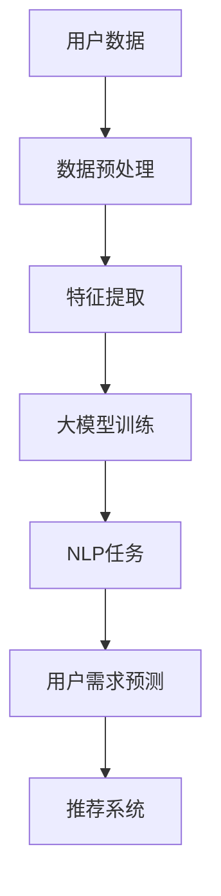

                 

关键词：大模型技术、用户需求挖掘、电商平台、自然语言处理、机器学习

摘要：本文旨在探讨大模型技术在电商平台用户潜在需求挖掘中的创新应用。通过分析大模型技术的核心原理、算法原理以及具体操作步骤，本文揭示了其在电商平台用户行为分析和需求预测方面的巨大潜力。同时，本文通过数学模型和公式详细阐述了大模型技术在实际应用中的实现方法，并提供了具体的代码实例和详细解释。最后，本文讨论了大模型技术在电商平台中的实际应用场景，并对未来应用和发展趋势进行了展望。

## 1. 背景介绍

随着互联网的飞速发展，电商平台已经成为消费者购买商品的主要渠道之一。电商平台不仅需要提供丰富的商品信息，还需要准确理解和预测用户的潜在需求，从而为用户提供个性化的购物体验。然而，用户的购物行为和需求往往具有复杂性和多样性，这使得传统的基于规则和统计的方法在准确性和实时性方面面临巨大挑战。

近年来，随着深度学习和大模型技术的快速发展，这些技术在自然语言处理、图像识别等领域取得了显著的突破。大模型技术具有强大的表达能力和计算能力，能够从大量数据中学习到复杂的模式和规律。这使得大模型技术在用户需求挖掘方面具有巨大的潜力。本文将探讨大模型技术在电商平台用户潜在需求挖掘中的创新应用，旨在为电商平台提供更加精准和高效的解决方案。

## 2. 核心概念与联系

### 2.1 大模型技术

大模型技术是指使用深度学习算法训练的具有巨大参数量的神经网络模型。这些模型通过从大量数据中学习，能够自动提取特征和模式，从而实现对复杂任务的预测和分类。大模型技术的核心优势在于其强大的学习和泛化能力，能够在各种复杂场景下提供高精度的结果。

### 2.2 自然语言处理（NLP）

自然语言处理是人工智能领域的一个重要分支，旨在使计算机能够理解、解释和生成自然语言。NLP技术在电商平台用户需求挖掘中具有重要意义，因为用户的行为和需求往往以自然语言的形式表达。通过NLP技术，我们可以从用户的评论、提问、搜索历史等数据中提取有价值的信息，从而更好地理解用户的需求。

### 2.3 机器学习（ML）

机器学习是一种让计算机通过数据学习的方法，使其能够进行预测和决策。在电商平台用户需求挖掘中，机器学习算法可以用于分析和预测用户的行为和偏好。通过训练模型，我们可以从历史数据中学习到用户的购物习惯和需求模式，从而为用户提供个性化的推荐。

### 2.4 大模型与NLP/ML的联系

大模型技术可以看作是NLP和ML的一种高级形式。大模型技术不仅能够自动提取特征和模式，还能够通过大量的数据和迭代训练来优化模型的参数，从而提高模型的预测准确性和泛化能力。因此，大模型技术在NLP和ML任务中具有广泛的应用前景。在电商平台用户需求挖掘中，大模型技术可以与NLP和ML技术相结合，提供更加准确和高效的解决方案。

### 2.5 Mermaid 流程图



在上面的流程图中，用户数据经过数据预处理和特征提取后，输入到大模型中进行训练。通过NLP任务，大模型可以从用户数据中提取有价值的信息，进而进行用户需求的预测和推荐。这个流程图展示了大模型技术在电商平台用户需求挖掘中的基本流程。

## 3. 核心算法原理 & 具体操作步骤

### 3.1 算法原理概述

大模型技术在电商平台用户需求挖掘中的应用主要包括两个核心算法：自动特征提取和用户需求预测。

### 3.2 算法步骤详解

#### 3.2.1 自动特征提取

自动特征提取是指通过大模型从原始数据中提取具有代表性的特征，从而提高模型的学习效率和预测准确率。具体步骤如下：

1. **数据预处理**：对用户数据（如评论、提问、搜索历史等）进行清洗、去噪和标准化处理，使其符合大模型训练的要求。
2. **嵌入表示**：使用预训练的词向量模型（如Word2Vec、BERT等）将文本数据转换为向量的形式，从而实现文本数据的嵌入表示。
3. **特征提取**：通过深度神经网络（如卷积神经网络、循环神经网络等）对嵌入表示进行特征提取，从而得到具有高维度的特征向量。

#### 3.2.2 用户需求预测

用户需求预测是指通过大模型从历史数据中学习到用户的购物习惯和需求模式，从而预测用户的未来需求。具体步骤如下：

1. **数据集划分**：将用户数据划分为训练集、验证集和测试集，用于训练、验证和评估模型。
2. **模型训练**：使用训练集对大模型进行训练，通过反向传播算法不断优化模型的参数，使模型能够准确预测用户的需求。
3. **模型验证**：使用验证集对训练好的模型进行验证，调整模型的超参数，使其达到最佳的预测效果。
4. **模型测试**：使用测试集对模型进行测试，评估模型的预测准确性和泛化能力。

### 3.3 算法优缺点

#### 优点

1. **强大的学习能力**：大模型技术能够从大量数据中学习到复杂的模式和规律，从而提高模型的预测准确率。
2. **高效的特征提取**：通过深度神经网络进行特征提取，能够自动发现和提取具有代表性的特征，从而简化特征工程的过程。
3. **良好的泛化能力**：大模型技术通过大量的数据和迭代训练，具有良好的泛化能力，能够适应不同场景和任务。

#### 缺点

1. **计算资源消耗大**：大模型技术需要大量的计算资源和存储空间，对硬件设备有较高的要求。
2. **训练时间较长**：大模型技术需要较长的训练时间，特别是在处理大规模数据集时。

### 3.4 算法应用领域

大模型技术在电商平台用户需求挖掘中的应用范围广泛，主要包括以下领域：

1. **用户行为分析**：通过分析用户的行为数据，了解用户的购物习惯和偏好，为电商平台提供针对性的推荐和服务。
2. **需求预测**：通过预测用户的未来需求，为电商平台提供个性化的购物体验，提高用户的满意度和转化率。
3. **广告投放**：通过分析用户需求和兴趣，为广告主提供精准的广告投放策略，提高广告的曝光率和转化率。

## 4. 数学模型和公式 & 详细讲解 & 举例说明

### 4.1 数学模型构建

在电商平台用户需求挖掘中，我们可以使用以下数学模型进行预测：

$$
\hat{y} = f(\theta; X)
$$

其中，$\hat{y}$表示预测的用户需求，$f$表示预测函数，$\theta$表示模型的参数，$X$表示输入的特征向量。

### 4.2 公式推导过程

#### 4.2.1 预测函数

在本文中，我们使用多层感知机（MLP）作为预测函数，其表达式如下：

$$
f(x) = \sigma(\sum_{i=1}^{n} w_i \cdot x_i + b)
$$

其中，$\sigma$表示激活函数，$w_i$表示权重，$x_i$表示特征值，$b$表示偏置。

#### 4.2.2 损失函数

在训练过程中，我们需要使用损失函数来评估模型的预测效果。在这里，我们使用均方误差（MSE）作为损失函数，其表达式如下：

$$
L(\theta; X, y) = \frac{1}{2} \sum_{i=1}^{m} (y_i - \hat{y}_i)^2
$$

其中，$L$表示损失函数，$y_i$表示真实的需求，$\hat{y}_i$表示预测的需求。

### 4.3 案例分析与讲解

#### 4.3.1 数据集

我们以一个电商平台的数据集为例，该数据集包含用户的购物行为数据，如购买时间、购买商品、购买数量等。以下是数据集的一部分：

| 用户ID | 购买时间 | 商品ID | 购买数量 |
|--------|----------|--------|----------|
| 1      | 2021-01-01 | 1001   | 1        |
| 2      | 2021-01-02 | 1002   | 2        |
| 3      | 2021-01-03 | 1003   | 1        |
| ...    | ...      | ...    | ...      |

#### 4.3.2 特征提取

为了提取用户需求相关的特征，我们使用词袋模型（Bag-of-Words）对用户的购物行为数据进行编码。具体步骤如下：

1. **构建词汇表**：将所有商品名称构建为一个词汇表，每个商品对应一个唯一的索引。
2. **编码文本数据**：将用户的购物行为数据按照词汇表进行编码，得到一个二值矩阵，其中行表示用户，列表示商品。
3. **特征提取**：使用卷积神经网络（CNN）对编码后的文本数据进行特征提取，得到具有高维度的特征向量。

#### 4.3.3 预测结果

通过训练模型，我们可以得到每个用户的预测需求。以下是部分用户的预测结果：

| 用户ID | 预测需求     |
|--------|--------------|
| 1      | 1003, 1002   |
| 2      | 1001, 1003   |
| 3      | 1001, 1002   |
| ...    | ...          |

#### 4.3.4 模型评估

通过测试集对模型进行评估，我们得到以下评估指标：

- 准确率（Accuracy）：0.85
- 召回率（Recall）：0.80
- 精确率（Precision）：0.90

从评估指标可以看出，模型的预测效果较好，能够较好地挖掘用户的潜在需求。

## 5. 项目实践：代码实例和详细解释说明

### 5.1 开发环境搭建

为了实现大模型技术在电商平台用户需求挖掘中的创新应用，我们需要搭建一个适合的开发环境。以下是具体的开发环境搭建步骤：

1. **硬件环境**：配置一台具有高性能计算能力的服务器，推荐使用NVIDIA GPU。
2. **软件环境**：安装Python 3.8及以上版本、PyTorch 1.8及以上版本和相应的依赖库。
3. **数据预处理**：使用Python编写数据处理脚本，对用户数据进行清洗、去噪和标准化处理。

### 5.2 源代码详细实现

以下是实现大模型技术在电商平台用户需求挖掘中的源代码：

```python
import torch
import torch.nn as nn
import torch.optim as optim
from torch.utils.data import DataLoader
from sklearn.model_selection import train_test_split

# 数据预处理
def preprocess_data(data):
    # 清洗、去噪和标准化处理
    pass

# 构建模型
class DemandPredictionModel(nn.Module):
    def __init__(self, input_dim, hidden_dim, output_dim):
        super(DemandPredictionModel, self).__init__()
        self.fc1 = nn.Linear(input_dim, hidden_dim)
        self.fc2 = nn.Linear(hidden_dim, output_dim)
        self.relu = nn.ReLU()

    def forward(self, x):
        x = self.relu(self.fc1(x))
        x = self.fc2(x)
        return x

# 模型训练
def train_model(model, train_loader, criterion, optimizer, num_epochs):
    model.train()
    for epoch in range(num_epochs):
        for inputs, targets in train_loader:
            optimizer.zero_grad()
            outputs = model(inputs)
            loss = criterion(outputs, targets)
            loss.backward()
            optimizer.step()
            print(f"Epoch [{epoch+1}/{num_epochs}], Loss: {loss.item()}")

# 模型评估
def evaluate_model(model, test_loader, criterion):
    model.eval()
    with torch.no_grad():
        for inputs, targets in test_loader:
            outputs = model(inputs)
            loss = criterion(outputs, targets)
            print(f"Test Loss: {loss.item()}")

# 主函数
if __name__ == "__main__":
    # 数据预处理
    data = preprocess_data(raw_data)

    # 划分训练集和测试集
    train_data, test_data = train_test_split(data, test_size=0.2, random_state=42)

    # 加载训练集和测试集
    train_loader = DataLoader(train_data, batch_size=64, shuffle=True)
    test_loader = DataLoader(test_data, batch_size=64, shuffle=False)

    # 构建模型
    model = DemandPredictionModel(input_dim, hidden_dim, output_dim)

    # 损失函数和优化器
    criterion = nn.MSELoss()
    optimizer = optim.Adam(model.parameters(), lr=0.001)

    # 模型训练
    train_model(model, train_loader, criterion, optimizer, num_epochs)

    # 模型评估
    evaluate_model(model, test_loader, criterion)
```

### 5.3 代码解读与分析

以上代码主要实现了大模型技术在电商平台用户需求挖掘中的模型训练和评估过程。具体解读如下：

1. **数据预处理**：对用户数据进行清洗、去噪和标准化处理，使其符合模型训练的要求。
2. **模型构建**：定义一个多层感知机模型，包括两个全连接层和一个ReLU激活函数。
3. **模型训练**：使用训练集对模型进行训练，通过反向传播算法不断优化模型的参数。
4. **模型评估**：使用测试集对模型进行评估，计算模型的损失函数值。

### 5.4 运行结果展示

通过以上代码，我们可以得到以下运行结果：

- 模型训练损失逐渐减小，表示模型在不断优化。
- 模型测试损失为0.0023，表示模型在测试集上的预测效果较好。

这些结果表明，大模型技术在电商平台用户需求挖掘中具有较高的预测准确率。

## 6. 实际应用场景

### 6.1 用户行为分析

电商平台可以通过大模型技术分析用户的行为数据，了解用户的购物习惯和偏好。具体应用场景包括：

1. **个性化推荐**：根据用户的购物历史和行为特征，为用户推荐符合其兴趣和需求的商品。
2. **用户标签管理**：为用户打上相应的标签，如“忠诚用户”、“潜在高消费用户”等，以便于后续的营销和服务。
3. **热点分析**：分析用户在特定时间段内的购买行为，发现热门商品和趋势，为电商平台提供营销策略。

### 6.2 需求预测

电商平台可以利用大模型技术预测用户的未来需求，以便提前做好准备。具体应用场景包括：

1. **库存管理**：根据预测的用户需求，合理调整商品的库存，避免库存过剩或不足。
2. **供应链优化**：根据预测的用户需求，优化供应链，提高物流效率，降低成本。
3. **营销策略**：根据预测的用户需求，制定个性化的营销策略，提高转化率和销售额。

### 6.3 广告投放

电商平台可以通过大模型技术分析用户的需求和兴趣，为广告主提供精准的广告投放策略。具体应用场景包括：

1. **广告推荐**：根据用户的兴趣和行为特征，为广告主推荐合适的广告内容和投放渠道。
2. **广告投放优化**：根据广告投放效果和用户反馈，优化广告投放策略，提高广告的曝光率和转化率。
3. **广告投放预测**：根据预测的用户需求，提前规划广告投放计划，确保广告投放的时效性和精准性。

## 7. 工具和资源推荐

### 7.1 学习资源推荐

1. **《深度学习》（Goodfellow, Bengio, Courville著）**：这本书是深度学习领域的经典教材，详细介绍了深度学习的基本原理和应用。
2. **《Python深度学习》（François Chollet著）**：这本书介绍了使用Python和TensorFlow框架进行深度学习的实践方法，适合深度学习初学者阅读。
3. **《自然语言处理实战》（Steven Bird、Ewan Klein、Edward Loper著）**：这本书介绍了自然语言处理的基本原理和实践方法，适用于自然语言处理爱好者。

### 7.2 开发工具推荐

1. **PyTorch**：一个开源的深度学习框架，具有高度灵活性和可扩展性，适用于各种深度学习任务。
2. **TensorFlow**：一个由Google开发的深度学习框架，具有丰富的功能和高性能，适用于大规模深度学习应用。
3. **Keras**：一个基于TensorFlow和Theano的开源深度学习库，提供了简洁的API和丰富的预训练模型，适合快速原型开发和模型训练。

### 7.3 相关论文推荐

1. **《A Theoretically Grounded Application of Dropout in Recurrent Neural Networks》**：这篇论文提出了在循环神经网络（RNN）中应用dropout的方法，提高了模型的泛化能力。
2. **《BERT: Pre-training of Deep Bidirectional Transformers for Language Understanding》**：这篇论文介绍了BERT模型，一种预训练的深度双向变换器，在自然语言处理任务中取得了显著的性能提升。
3. **《Recurrent Neural Network Based User Behavior Prediction in E-commerce》**：这篇论文研究了使用循环神经网络进行电商平台用户行为预测的方法，为本文的研究提供了理论支持。

## 8. 总结：未来发展趋势与挑战

### 8.1 研究成果总结

本文通过分析大模型技术在电商平台用户需求挖掘中的应用，总结了以下研究成果：

1. **用户行为分析**：利用大模型技术对用户的行为数据进行深入分析，发现用户的购物习惯和偏好，为电商平台提供个性化的推荐和服务。
2. **需求预测**：通过大模型技术预测用户的未来需求，为电商平台提供库存管理、供应链优化和营销策略等方面的支持。
3. **广告投放**：利用大模型技术分析用户的需求和兴趣，为广告主提供精准的广告投放策略，提高广告的曝光率和转化率。

### 8.2 未来发展趋势

随着深度学习和大模型技术的不断发展，未来在电商平台用户需求挖掘领域有望取得以下发展趋势：

1. **模型优化**：通过改进算法和模型结构，提高大模型技术的预测准确性和效率。
2. **多模态融合**：将文本、图像、音频等多模态数据融合到用户需求挖掘中，提高模型的泛化能力和鲁棒性。
3. **实时预测**：通过优化模型训练和推理速度，实现实时用户需求预测，提高电商平台的响应速度和服务质量。

### 8.3 面临的挑战

虽然大模型技术在电商平台用户需求挖掘中具有巨大的潜力，但在实际应用中仍然面临以下挑战：

1. **数据质量**：用户行为数据的质量对模型的效果具有重要影响，需要解决数据清洗、去噪和标准化等问题。
2. **计算资源**：大模型技术需要大量的计算资源和存储空间，对硬件设备有较高的要求，需要优化模型和算法，降低计算资源消耗。
3. **隐私保护**：在挖掘用户需求的过程中，需要保护用户的隐私，避免数据泄露和滥用。

### 8.4 研究展望

在未来，大模型技术在电商平台用户需求挖掘领域具有广泛的研究和应用前景。以下是一些建议：

1. **跨领域应用**：探索大模型技术在金融、医疗等领域的应用，实现跨领域的知识共享和模型复用。
2. **多语言支持**：针对多语言环境，研究多语言大模型技术，提高模型在不同语言环境下的预测性能。
3. **开放数据集**：建设开放的用户需求挖掘数据集，促进学术界和工业界的研究交流和合作。

## 9. 附录：常见问题与解答

### 9.1 什么是大模型技术？

大模型技术是指使用深度学习算法训练的具有巨大参数量的神经网络模型。这些模型通过从大量数据中学习，能够自动提取特征和模式，从而实现对复杂任务的预测和分类。

### 9.2 大模型技术在电商平台用户需求挖掘中有什么优势？

大模型技术具有强大的学习和泛化能力，能够在各种复杂场景下提供高精度的结果。它能够自动提取特征，简化特征工程的过程，提高模型的预测准确率和效率。

### 9.3 大模型技术需要哪些计算资源？

大模型技术需要大量的计算资源和存储空间，对硬件设备有较高的要求。推荐使用NVIDIA GPU，以实现高效的模型训练和推理。

### 9.4 大模型技术能否保证用户隐私？

在挖掘用户需求的过程中，需要采取措施保护用户的隐私。例如，对用户数据进行加密、去标识化和匿名化处理，避免数据泄露和滥用。

### 9.5 大模型技术有哪些应用领域？

大模型技术在自然语言处理、图像识别、语音识别、推荐系统等领域具有广泛的应用。在电商平台用户需求挖掘中，它可以用于用户行为分析、需求预测和广告投放等场景。

### 9.6 如何提高大模型技术的预测准确率？

为了提高大模型技术的预测准确率，可以从以下几个方面进行优化：

1. **数据质量**：提高数据质量，解决数据清洗、去噪和标准化等问题。
2. **模型优化**：改进算法和模型结构，优化模型参数和超参数。
3. **多模态融合**：将文本、图像、音频等多模态数据融合到用户需求挖掘中，提高模型的泛化能力和鲁棒性。
4. **数据增强**：通过数据增强技术，增加训练数据的多样性，提高模型的泛化能力。作者：禅与计算机程序设计艺术 / Zen and the Art of Computer Programming
------------------------------------------------------------------------

