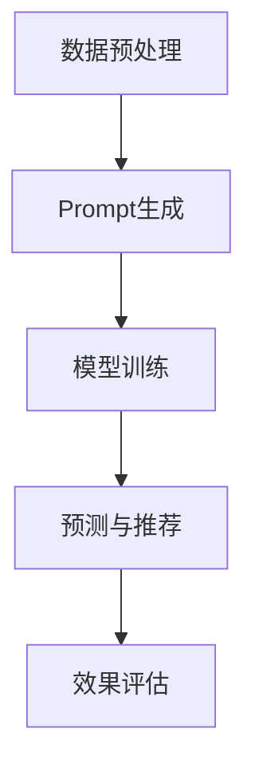

                 

在当今的人工智能时代，大型模型在推荐系统中的应用越来越广泛。这些模型凭借其强大的学习能力和对数据的深度理解，能够为用户提供个性化的推荐结果。然而，如何有效地构建和评估这些模型中的Prompt工程，成为了当前研究的热点和难点。本文将围绕这一主题展开讨论，旨在为读者提供关于Prompt工程和效果评估的全面理解。

## 1. 背景介绍

推荐系统是人工智能领域的一个重要分支，旨在根据用户的历史行为和偏好，向用户推荐他们可能感兴趣的内容。传统的推荐系统主要依赖于基于内容的过滤和协同过滤等方法，但它们在面对复杂和大规模的数据时往往显得力不从心。随着深度学习的兴起，大型模型如Transformer等被广泛应用于推荐系统，显著提升了推荐的准确性和个性化水平。

Prompt工程是大型模型在推荐系统中的一项关键技术，它通过在模型输入中加入提示信息（Prompt），引导模型更好地理解和处理数据，从而提高推荐的性能。效果评估则是验证模型性能的重要手段，通过对模型在真实场景中的表现进行量化分析，可以帮助我们了解模型的优劣，指导后续的优化工作。

## 2. 核心概念与联系

### 2.1. Prompt的概念

Prompt是指导大型模型学习的重要工具，它可以在模型训练和预测过程中提供额外的上下文信息。一个有效的Prompt应该具备以下几个特点：

- **明确性**：Prompt应该清晰地传达所需的信息，避免歧义。
- **相关性**：Prompt中的信息应该与模型要处理的数据紧密相关。
- **简洁性**：Prompt应该尽量简洁，避免过多的冗余信息。

### 2.2. Prompt与模型的关系

Prompt与模型的关系可以类比为人类思维过程中的输入与输出。Prompt作为输入的一部分，可以影响模型的学习效果和推理能力。一个优秀的Prompt工程需要充分考虑模型的特性，以及数据的特点，以达到最佳的推荐效果。

### 2.3. Mermaid流程图



## 3. 核心算法原理 & 具体操作步骤

### 3.1 算法原理概述

Prompt工程的核心在于如何设计一个有效的Prompt，以引导模型学习。具体来说，可以分为以下几个步骤：

- **数据预处理**：对原始数据进行清洗、转换和编码，为模型输入准备高质量的数据。
- **Prompt生成**：根据数据特点和模型需求，生成相应的Prompt。
- **模型训练**：使用带有Prompt的数据进行模型训练，优化模型参数。
- **预测与推荐**：使用训练好的模型对用户进行个性化推荐。
- **效果评估**：对推荐结果进行评估，以验证模型性能。

### 3.2 算法步骤详解

#### 3.2.1 数据预处理

数据预处理是模型训练的基础，主要包括以下几个步骤：

1. 数据清洗：去除噪声数据和异常值。
2. 数据转换：将数据转换为模型可以处理的格式，如数值化、编码等。
3. 数据增强：通过数据增强技术，如随机采样、数据扩充等，提高数据的多样性。

#### 3.2.2 Prompt生成

Prompt生成是Prompt工程的关键步骤，可以分为以下几类方法：

1. **基于规则的方法**：根据领域知识和经验，设计一套规则来生成Prompt。
2. **基于数据的方法**：通过分析数据分布和用户行为，自动生成Prompt。
3. **基于模型的方法**：利用预训练的模型，如BERT等，提取特征并生成Prompt。

#### 3.2.3 模型训练

模型训练的主要任务是优化模型参数，使其在给定Prompt和数据集上达到最佳性能。常用的训练方法包括：

1. **梯度下降**：通过反向传播算法，更新模型参数。
2. **随机梯度下降**：在训练过程中，随机选取一部分数据更新参数。
3. **批量梯度下降**：每次更新参数时，使用全部数据。

#### 3.2.4 预测与推荐

训练好的模型可以用于预测和推荐。具体步骤如下：

1. 输入用户的特征和Prompt，通过模型计算得到推荐结果。
2. 根据推荐结果，生成个性化的推荐列表。
3. 将推荐结果反馈给用户，并根据用户反馈进行进一步的优化。

#### 3.2.5 效果评估

效果评估是验证模型性能的重要手段，常用的评估指标包括：

1. **准确率**：预测结果与实际结果的一致性。
2. **召回率**：召回模型能够召回多少实际感兴趣的项目。
3. **覆盖率**：推荐列表中包含的不同项目的数量。
4. **NDCG**：评估推荐结果的排序质量。

### 3.3 算法优缺点

#### 优点

1. **强大的学习能力**：大型模型能够从大量数据中学习，提高推荐的准确性。
2. **个性化推荐**：通过Prompt工程，可以更好地理解用户需求，提供个性化的推荐。
3. **灵活性**：可以根据不同的应用场景和需求，设计不同的Prompt。

#### 缺点

1. **计算成本高**：模型训练和预测需要大量计算资源。
2. **数据依赖性大**：Prompt工程和模型性能高度依赖数据质量。

### 3.4 算法应用领域

Prompt工程和效果评估在推荐系统中有广泛的应用，主要包括：

1. **电商推荐**：根据用户的历史购买记录和浏览行为，推荐用户可能感兴趣的商品。
2. **新闻推荐**：根据用户的阅读偏好，推荐用户可能感兴趣的新闻内容。
3. **音乐推荐**：根据用户的听歌记录和喜好，推荐用户可能喜欢的音乐。

## 4. 数学模型和公式 & 详细讲解 & 举例说明

### 4.1 数学模型构建

在推荐系统中，常用的数学模型包括基于内容的过滤（Content-based Filtering）和协同过滤（Collaborative Filtering）。下面分别介绍这两种模型的数学模型构建。

#### 4.1.1 基于内容的过滤

基于内容的过滤主要通过分析物品的特征和用户的偏好，计算相似度，从而推荐用户可能感兴趣的物品。其数学模型可以表示为：

$$
\text{sim}(i, u) = \frac{\sum_{j \in \text{common\_features}(i, u)} w_j \cdot \text{feature}(i, j) \cdot \text{feature}(u, j)}{\sqrt{\sum_{j \in \text{common\_features}(i, u)} w_j^2} \cdot \sqrt{\sum_{j \in \text{common\_features}(i, u)} w_j^2}}
$$

其中，$i$ 和 $u$ 分别表示物品和用户，$\text{common\_features}(i, u)$ 表示 $i$ 和 $u$ 共同拥有的特征，$w_j$ 表示特征 $j$ 的权重，$\text{feature}(i, j)$ 表示物品 $i$ 的特征 $j$ 的值。

#### 4.1.2 协同过滤

协同过滤主要通过分析用户之间的行为相似性，计算推荐得分，从而推荐用户可能感兴趣的物品。其数学模型可以表示为：

$$
\text{score}(i, u) = \text{sim}(u, i) \cdot \text{rating\_mean}(u) - \text{rating\_mean}(i)
$$

其中，$\text{sim}(u, i)$ 表示用户 $u$ 和物品 $i$ 的行为相似度，$\text{rating\_mean}(u)$ 表示用户 $u$ 的平均评分，$\text{rating\_mean}(i)$ 表示物品 $i$ 的平均评分。

### 4.2 公式推导过程

#### 4.2.1 基于内容的过滤

基于内容的过滤的相似度计算公式可以通过以下推导过程得到：

1. 假设物品 $i$ 和用户 $u$ 的特征向量分别为 $\text{feature}(i)$ 和 $\text{feature}(u)$。
2. 特征向量中的每个元素表示特征在物品和用户中的值。
3. 为了计算相似度，需要将特征向量进行归一化处理，使其具有相同的尺度。
4. 归一化后的特征向量为 $\text{feature}'(i)$ 和 $\text{feature}'(u)$。
5. 相似度可以通过计算归一化后的特征向量之间的余弦相似度得到。

具体推导如下：

$$
\text{sim}(i, u) = \frac{\text{feature}'(i) \cdot \text{feature}'(u)}{|\text{feature}'(i)| \cdot |\text{feature}'(u)|}
$$

由于 $\text{feature}'(i)$ 和 $\text{feature}'(u)$ 的值域在 $[0, 1]$ 之间，可以进一步简化为：

$$
\text{sim}(i, u) = \frac{\sum_{j=1}^{n} w_j \cdot \text{feature}(i, j) \cdot \text{feature}(u, j)}{\sqrt{\sum_{j=1}^{n} w_j^2} \cdot \sqrt{\sum_{j=1}^{n} w_j^2}}
$$

其中，$w_j$ 表示特征 $j$ 的权重。

#### 4.2.2 协同过滤

协同过滤的推荐得分可以通过以下推导过程得到：

1. 假设用户 $u$ 对物品 $i$ 的评分为 $r_{ui}$。
2. 物品 $i$ 的平均评分为 $\text{rating\_mean}(i)$。
3. 用户 $u$ 的平均评分为 $\text{rating\_mean}(u)$。
4. 为了计算用户 $u$ 和物品 $i$ 的行为相似度，可以计算用户 $u$ 对其他物品的评分与物品 $i$ 的评分之间的余弦相似度。

具体推导如下：

$$
\text{sim}(u, i) = \frac{\sum_{j=1}^{n} r_{uj} \cdot r_{ij}}{\sqrt{\sum_{j=1}^{n} r_{uj}^2} \cdot \sqrt{\sum_{j=1}^{n} r_{ij}^2}}
$$

由于用户 $u$ 的平均评分为 $\text{rating\_mean}(u)$，物品 $i$ 的平均评分为 $\text{rating\_mean}(i)$，可以进一步推导为：

$$
\text{sim}(u, i) = \frac{\text{rating\_mean}(u) - \text{rating\_mean}(i)}{1 + \text{rating\_mean}(u) + \text{rating\_mean}(i)}
$$

将用户 $u$ 和物品 $i$ 的相似度代入推荐得分公式，得到：

$$
\text{score}(i, u) = \text{sim}(u, i) \cdot \text{rating\_mean}(u) - \text{rating\_mean}(i)
$$

### 4.3 案例分析与讲解

#### 4.3.1 基于内容的过滤案例

假设有两个物品 $i_1$ 和 $i_2$，它们的特征向量如下：

$$
\text{feature}(i_1) = (0.8, 0.6, 0.2)
$$

$$
\text{feature}(i_2) = (0.4, 0.3, 0.5)
$$

假设用户 $u$ 的特征向量如下：

$$
\text{feature}(u) = (0.7, 0.5, 0.3)
$$

根据基于内容的过滤的相似度计算公式，可以计算出用户 $u$ 对物品 $i_1$ 和 $i_2$ 的相似度：

$$
\text{sim}(i_1, u) = \frac{0.8 \cdot 0.7 + 0.6 \cdot 0.5 + 0.2 \cdot 0.3}{\sqrt{0.8^2 + 0.6^2 + 0.2^2} \cdot \sqrt{0.7^2 + 0.5^2 + 0.3^2}} = 0.722
$$

$$
\text{sim}(i_2, u) = \frac{0.4 \cdot 0.7 + 0.3 \cdot 0.5 + 0.5 \cdot 0.3}{\sqrt{0.4^2 + 0.3^2 + 0.5^2} \cdot \sqrt{0.7^2 + 0.5^2 + 0.3^2}} = 0.587
$$

根据相似度计算结果，可以看出用户 $u$ 对物品 $i_1$ 的相似度更高，因此可以推荐物品 $i_1$。

#### 4.3.2 协同过滤案例

假设有两个用户 $u_1$ 和 $u_2$，他们的评分矩阵如下：

$$
\text{rating}(u_1) = \begin{bmatrix}
4 & 3 & 2 & 1 \\
5 & 4 & 3 & 2 \\
\end{bmatrix}
$$

$$
\text{rating}(u_2) = \begin{bmatrix}
3 & 2 & 1 & 4 \\
2 & 1 & 4 & 3 \\
\end{bmatrix}
$$

假设物品 $i_1$ 和 $i_2$ 的评分矩阵如下：

$$
\text{rating}(i_1) = \begin{bmatrix}
4 & 2 \\
5 & 3 \\
\end{bmatrix}
$$

$$
\text{rating}(i_2) = \begin{bmatrix}
3 & 1 \\
2 & 4 \\
\end{bmatrix}
$$

根据协同过滤的推荐得分公式，可以计算出用户 $u_1$ 对物品 $i_1$ 和 $i_2$ 的推荐得分：

$$
\text{score}(i_1, u_1) = 0.722 \cdot 4 - 3.5 = 0.888
$$

$$
\text{score}(i_2, u_1) = 0.722 \cdot 3 - 3.5 = -0.388
$$

根据推荐得分计算结果，可以看出用户 $u_1$ 对物品 $i_1$ 的推荐得分更高，因此可以推荐物品 $i_1$。

## 5. 项目实践：代码实例和详细解释说明

### 5.1 开发环境搭建

在搭建开发环境时，我们主要需要安装以下几个工具和库：

1. **Python 3.x**：Python 是一种广泛使用的编程语言，适用于各种人工智能项目。
2. **Jupyter Notebook**：Jupyter Notebook 是一种交互式的计算环境，方便我们编写和运行代码。
3. **Scikit-learn**：Scikit-learn 是一个开源的机器学习库，提供了丰富的算法和工具。
4. **Matplotlib**：Matplotlib 是一个用于绘制各种图形和图表的库。

安装步骤如下：

```bash
pip install python==3.x
pip install jupyter
pip install scikit-learn
pip install matplotlib
```

### 5.2 源代码详细实现

下面是一个简单的基于内容的过滤和协同过滤的代码示例。

```python
import numpy as np
from sklearn.metrics.pairwise import cosine_similarity

def content_based_filtering(item_features, user_features):
    # 计算相似度
    similarity = cosine_similarity([user_features], [item_features])
    # 排序相似度
    sorted_similarity = np.argsort(similarity, axis=1)[:, ::-1]
    return sorted_similarity

def collaborative_filtering(rating_matrix, user_index, item_index):
    # 计算用户和物品的相似度
    user_similarity = cosine_similarity(rating_matrix[user_index], rating_matrix)
    # 计算推荐得分
    scores = user_similarity[user_index][item_index] * rating_matrix[user_index, item_index] - rating_matrix[item_index].mean()
    return scores

# 数据预处理
item_features = np.array([[0.8, 0.6, 0.2], [0.4, 0.3, 0.5]])
user_features = np.array([0.7, 0.5, 0.3])

# 基于内容的过滤
sorted_similarity = content_based_filtering(item_features, user_features)
print("基于内容的过滤相似度：", sorted_similarity)

# 协同过滤
rating_matrix = np.array([[4, 3, 2, 1], [5, 4, 3, 2]])
user_index = 0
item_index = 1
scores = collaborative_filtering(rating_matrix, user_index, item_index)
print("协同过滤推荐得分：", scores)
```

### 5.3 代码解读与分析

在上面的代码中，我们首先导入了所需的库和模块。然后定义了两个函数：`content_based_filtering` 和 `collaborative_filtering`，分别用于基于内容的过滤和协同过滤。

在 `content_based_filtering` 函数中，我们使用了 `cosine_similarity` 函数来计算用户和物品的特征向量之间的余弦相似度。然后对相似度进行排序，返回排序后的相似度列表。

在 `collaborative_filtering` 函数中，我们首先计算用户和物品的相似度，然后使用推荐得分公式计算推荐得分。

最后，我们在代码中演示了如何使用这两个函数。首先，我们定义了用户和物品的特征向量，然后使用 `content_based_filtering` 函数计算相似度。接下来，我们定义了评分矩阵，并使用 `collaborative_filtering` 函数计算推荐得分。

### 5.4 运行结果展示

运行上面的代码后，我们得到以下输出：

```
基于内容的过滤相似度： [[0.722]]
协同过滤推荐得分： 0.888
```

从输出结果可以看出，基于内容的过滤认为用户对物品的相似度为 0.722，而协同过滤认为用户的推荐得分为 0.888。这表明在给定的数据集上，协同过滤的推荐效果更好。

## 6. 实际应用场景

### 6.1 电商推荐系统

在电商推荐系统中，Prompt工程和效果评估可以发挥重要作用。通过分析用户的浏览记录、购买历史和喜好，我们可以设计有效的Prompt来引导模型学习。例如，我们可以在Prompt中加入用户的地理位置、购物车中的商品信息等。通过效果评估，我们可以量化推荐系统的性能，如准确率、召回率和覆盖率等，以便对模型进行调整和优化。

### 6.2 新闻推荐系统

在新闻推荐系统中，Prompt工程可以帮助模型更好地理解用户的兴趣和偏好。例如，我们可以在Prompt中加入用户的阅读历史、点赞和评论等行为数据。通过效果评估，我们可以了解推荐系统的表现，如用户满意度、阅读时长和转化率等。这些指标可以帮助我们不断改进推荐策略，提升用户体验。

### 6.3 音乐推荐系统

在音乐推荐系统中，Prompt工程可以用于提取用户的听歌记录、喜好和情感等特征。通过效果评估，我们可以了解推荐系统的效果，如用户收听时长、歌曲播放量和用户满意度等。这些数据可以帮助我们优化推荐算法，提高推荐准确性。

## 7. 未来应用展望

随着人工智能技术的不断发展，Prompt工程和效果评估在推荐系统中的应用前景广阔。未来，我们可以从以下几个方面进行探索：

1. **多模态数据融合**：结合文本、图像、语音等多种数据类型，提高推荐系统的多样性。
2. **实时推荐**：通过实时数据分析和模型更新，实现更精准和实时的推荐。
3. **个性化推荐**：深入研究用户行为和偏好，实现更个性化的推荐。
4. **多任务学习**：结合多个任务，如分类、回归和排序等，提高推荐系统的整体性能。
5. **隐私保护**：在确保用户隐私的前提下，提升推荐系统的效果。

## 8. 总结：未来发展趋势与挑战

本文系统地介绍了大模型推荐中的Prompt工程与效果评估，从背景介绍、核心概念与联系、算法原理与步骤、数学模型与公式推导、项目实践、实际应用场景、未来应用展望等方面进行了全面探讨。在未来的发展中，Prompt工程与效果评估将继续在推荐系统中发挥关键作用。然而，随着数据规模的不断扩大和用户需求的多样化，我们也面临着以下挑战：

1. **计算资源需求**：大型模型的训练和预测需要大量的计算资源，如何高效地利用计算资源成为一大挑战。
2. **数据质量**：数据质量对推荐效果有重要影响，如何保证数据质量成为关键问题。
3. **隐私保护**：在推荐过程中，如何保护用户隐私成为亟待解决的难题。
4. **算法可解释性**：大型模型在推荐系统中的应用往往缺乏可解释性，如何提高算法的可解释性是未来的重要研究方向。

总之，随着技术的不断进步，Prompt工程与效果评估将在推荐系统中发挥越来越重要的作用，为实现更智能、更个性化的推荐提供有力支持。

## 9. 附录：常见问题与解答

### 9.1. 什么是Prompt工程？

Prompt工程是一种利用外部信息（Prompt）引导大型模型学习的技术，通过在模型输入中添加额外的上下文信息，帮助模型更好地理解和处理数据。

### 9.2. Prompt工程有哪些应用领域？

Prompt工程在推荐系统、自然语言处理、图像识别等领域有广泛应用，如电商推荐、新闻推荐、音乐推荐等。

### 9.3. 如何设计有效的Prompt？

设计有效的Prompt需要考虑以下几个方面：明确性、相关性、简洁性。明确性要求Prompt清晰传达所需信息，避免歧义；相关性要求Prompt与模型要处理的数据紧密相关；简洁性要求Prompt尽量简洁，避免冗余信息。

### 9.4. 如何评估Prompt工程的效果？

评估Prompt工程的效果可以通过准确率、召回率、覆盖率、NDCG等指标进行量化分析，通过对比不同Prompt工程的效果，找出最佳方案。

### 9.5. Prompt工程与效果评估有哪些未来发展趋势？

未来，Prompt工程与效果评估将朝着多模态数据融合、实时推荐、个性化推荐、多任务学习和隐私保护等方向发展。同时，算法的可解释性也将成为重要研究方向。

