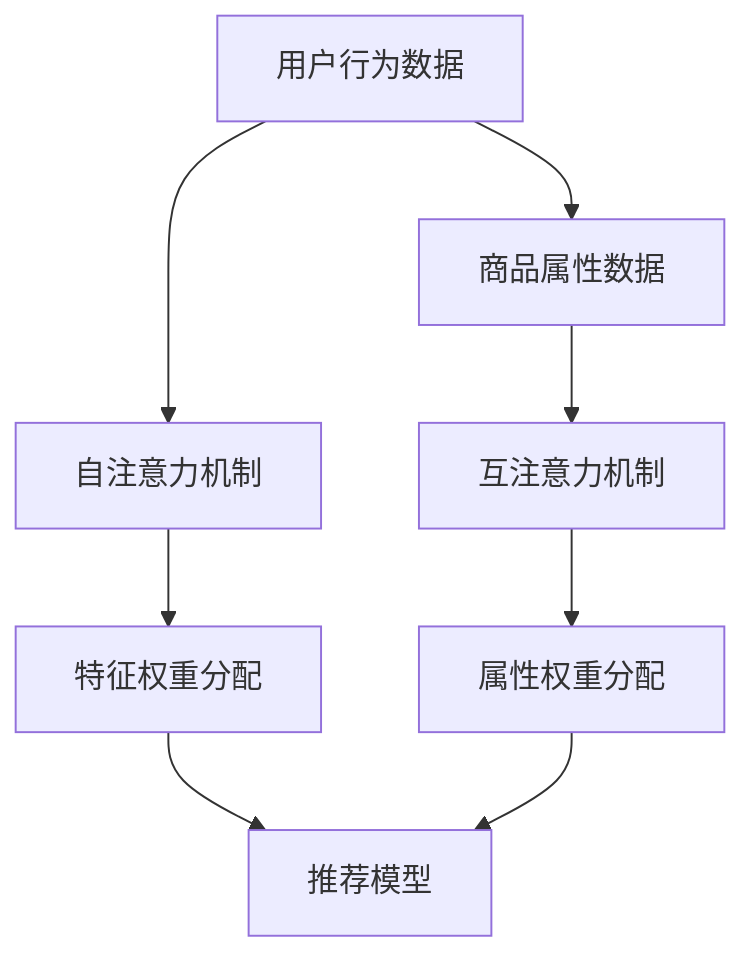

                 

关键词：大模型推荐、注意力机制、优化、深度学习、算法原理、数学模型、实践案例、应用场景、未来展望。

> 摘要：本文旨在探讨大模型推荐系统中注意力机制的优化方法。通过介绍注意力机制的核心概念和原理，分析其在推荐系统中的重要作用，阐述几种常见的注意力优化算法，并结合具体案例和数学模型进行深入剖析，为推荐系统的优化提供理论支持和实践指导。

## 1. 背景介绍

随着互联网的飞速发展，个性化推荐系统已成为现代信息检索和用户服务的关键技术。推荐系统旨在根据用户的兴趣和行为模式，为用户推荐可能感兴趣的商品、内容或服务。然而，面对海量的数据和复杂的用户行为，传统的推荐算法往往难以满足用户的个性化需求。

注意力机制（Attention Mechanism）作为深度学习领域的一种重要技术，通过为输入数据分配不同的重要性权重，实现了对关键信息的聚焦处理。在推荐系统中，注意力机制能够有效地捕捉用户与商品之间的相关性，从而提高推荐的准确性和用户满意度。

本文将围绕大模型推荐系统中的注意力机制优化展开讨论，旨在为研究者提供一种有效的优化策略，以提升推荐系统的性能。

## 2. 核心概念与联系

### 2.1 注意力机制原理

注意力机制最早由神经科学中的视觉注意力模型启发，旨在模拟人类在处理视觉信息时的选择性关注机制。在深度学习领域，注意力机制通常用于神经网络中的自注意力（Self-Attention）和互注意力（Cross-Attention）。

自注意力允许模型在处理序列数据时，对序列中的每个元素进行权重分配，使其能够根据上下文信息进行自适应调整。互注意力则适用于跨序列数据之间的关系建模，如文本与图像之间的关联。

### 2.2 推荐系统与注意力机制

推荐系统通常涉及用户-商品、用户-内容等序列数据的建模。注意力机制通过为不同元素分配不同权重，使得模型能够更关注那些对推荐结果有决定性影响的因素，从而提高推荐的精度。

在推荐系统中，注意力机制的应用主要体现在以下几个方面：

1. **用户行为建模**：利用注意力机制捕捉用户历史行为中的重要特征，如点击、购买等。
2. **商品属性提取**：为商品的不同属性分配权重，使其在推荐过程中发挥更大的作用。
3. **上下文信息融合**：结合用户上下文信息（如时间、地理位置等），提高推荐的相关性。

### 2.3 Mermaid 流程图

以下是注意力机制在推荐系统中应用的 Mermaid 流程图：



## 3. 核心算法原理 & 具体操作步骤

### 3.1 算法原理概述

注意力机制的实现通常依赖于点积（Dot Product）或缩放点积（Scaled Dot Product）等计算方法。在自注意力中，每个输入元素与其他所有元素进行点积计算，得到权重矩阵，然后通过权重矩阵对输入序列进行加权处理。在互注意力中，用户行为数据和商品属性数据分别作为输入，通过点积计算得到权重矩阵，用于融合不同来源的信息。

### 3.2 算法步骤详解

1. **自注意力计算**：
   $$ \text{Attention}(Q, K, V) = \text{softmax}\left(\frac{QK^T}{\sqrt{d_k}}\right) V $$
   其中，$Q$、$K$、$V$分别为查询、键和值向量，$d_k$为键向量的维度。

2. **互注意力计算**：
   $$ \text{Attention}(Q, K, V) = \text{softmax}\left(\frac{QK^T}{\sqrt{d_k}}\right) V $$
   其中，$Q$为用户行为数据的查询向量，$K$为商品属性数据的键向量，$V$为商品属性数据的值向量。

3. **特征融合**：
   将自注意力和互注意力计算得到的权重分配给输入序列中的元素，进行特征融合。

### 3.3 算法优缺点

**优点**：

- **自适应权重分配**：注意力机制能够根据输入数据的特点，自适应地调整权重分配，提高模型的表达能力。
- **并行计算**：自注意力和互注意力计算过程可以并行化，提高计算效率。

**缺点**：

- **计算复杂度高**：点积和 softmax 计算过程较为复杂，对硬件资源要求较高。
- **参数调优困难**：注意力机制涉及多个超参数，调优过程较为繁琐。

### 3.4 算法应用领域

注意力机制在推荐系统、自然语言处理、计算机视觉等领域有广泛的应用。例如，在推荐系统中，注意力机制可以用于用户行为建模、商品属性提取和上下文信息融合；在自然语言处理中，注意力机制可以用于文本生成、机器翻译等任务；在计算机视觉中，注意力机制可以用于目标检测、图像生成等任务。

## 4. 数学模型和公式 & 详细讲解 & 举例说明

### 4.1 数学模型构建

注意力机制的数学模型主要包括自注意力和互注意力两个部分。自注意力模型如下：

$$
\text{Self-Attention}(X) = \text{softmax}\left(\frac{XQ}{\sqrt{d_k}}\right)V
$$

其中，$X$为输入序列，$Q$为查询向量，$V$为值向量，$d_k$为键向量的维度。

互注意力模型如下：

$$
\text{Cross-Attention}(X, Y) = \text{softmax}\left(\frac{XK}{\sqrt{d_k}}\right)V
$$

其中，$X$为输入序列，$Y$为另一个输入序列，$K$为键向量，$V$为值向量，$d_k$为键向量的维度。

### 4.2 公式推导过程

#### 自注意力公式推导

自注意力机制的核心在于计算输入序列中每个元素的重要性权重，然后对输入序列进行加权处理。

1. **计算查询向量**：

$$
Q = \text{Linear}(X) = XW_Q + b_Q
$$

其中，$X$为输入序列，$W_Q$为权重矩阵，$b_Q$为偏置向量。

2. **计算键值向量**：

$$
K = \text{Linear}(X) = XW_K + b_K
$$

$$
V = \text{Linear}(X) = XW_V + b_V
$$

其中，$X$为输入序列，$W_K$、$W_V$为权重矩阵，$b_K$、$b_V$为偏置向量。

3. **计算点积**：

$$
\text{Score}(Q, K) = QK^T = XW_QW_K^T + b_Qb_K^T
$$

4. **计算权重**：

$$
\text{Weight}(Q, K) = \text{softmax}(\text{Score}(Q, K)) = \frac{e^{\text{Score}(Q, K)}}{\sum_{i=1}^{N} e^{\text{Score}(Q, K_i)}}
$$

其中，$N$为输入序列的长度，$K_i$为输入序列中的第$i$个元素。

5. **计算加权输出**：

$$
\text{Output}(X) = \text{Weight}(Q, K)V = \text{softmax}\left(\frac{XQ}{\sqrt{d_k}}\right)V
$$

#### 互注意力公式推导

互注意力机制的核心在于计算两个输入序列之间的相关性权重，然后对输入序列进行加权处理。

1. **计算查询向量**：

$$
Q = \text{Linear}(X) = XW_Q + b_Q
$$

2. **计算键值向量**：

$$
K = \text{Linear}(Y) = YW_K + b_K
$$

$$
V = \text{Linear}(Y) = YW_V + b_V
$$

3. **计算点积**：

$$
\text{Score}(Q, K) = QK^T = XW_QY^TW_K^T + b_Qb_K^T
$$

4. **计算权重**：

$$
\text{Weight}(Q, K) = \text{softmax}(\text{Score}(Q, K)) = \frac{e^{\text{Score}(Q, K)}}{\sum_{i=1}^{N} e^{\text{Score}(Q, K_i)}}
$$

5. **计算加权输出**：

$$
\text{Output}(X, Y) = \text{Weight}(Q, K)V = \text{softmax}\left(\frac{XQ}{\sqrt{d_k}}\right)V
$$

### 4.3 案例分析与讲解

假设我们有一个用户-商品推荐系统，其中用户行为数据为$X$（如点击、购买等），商品属性数据为$Y$（如价格、类别等）。我们可以利用注意力机制来提高推荐的准确性。

1. **自注意力计算**：

   用户行为数据$X$经过线性变换得到查询向量$Q$和键值向量$K$、$V$，然后通过自注意力计算得到加权输出$X'$。

   $$
   Q = \text{Linear}(X) = XW_Q + b_Q
   $$
   $$
   K = \text{Linear}(X) = XW_K + b_K
   $$
   $$
   V = \text{Linear}(X) = XW_V + b_V
   $$
   $$
   X' = \text{Self-Attention}(X) = \text{softmax}\left(\frac{XQ}{\sqrt{d_k}}\right)V
   $$

2. **互注意力计算**：

   用户行为数据$X$和商品属性数据$Y$经过线性变换得到查询向量$Q$和键值向量$K$、$V$，然后通过互注意力计算得到加权输出$X'$。

   $$
   Q = \text{Linear}(X) = XW_Q + b_Q
   $$
   $$
   K = \text{Linear}(Y) = YW_K + b_K
   $$
   $$
   V = \text{Linear}(Y) = YW_V + b_V
   $$
   $$
   X' = \text{Cross-Attention}(X, Y) = \text{softmax}\left(\frac{XQ}{\sqrt{d_k}}\right)V
   $$

3. **特征融合**：

   将自注意力计算得到的加权输出$X'$和互注意力计算得到的加权输出$X''$进行融合，得到最终的推荐结果。

   $$
   X'' = \text{Concat}(X', X'')
   $$

4. **推荐计算**：

   将融合后的特征输入到推荐模型中，计算推荐得分，根据得分进行排序，生成推荐列表。

   $$
   \text{Score}(X'', Y) = X''Y^TW_D + b_D
   $$

## 5. 项目实践：代码实例和详细解释说明

### 5.1 开发环境搭建

为了实现本文中提到的注意力机制优化算法，我们需要搭建一个开发环境。以下是所需的工具和库：

- Python 3.7+
- TensorFlow 2.0+
- Keras 2.3.1+

安装以上工具和库后，我们可以在项目中使用以下代码进行开发：

```python
import tensorflow as tf
from tensorflow.keras.layers import Embedding, LSTM, Dense
from tensorflow.keras.models import Model
from tensorflow.keras.optimizers import Adam

# 参数设置
vocab_size = 10000
embed_dim = 128
lstm_units = 64
batch_size = 32
epochs = 10

# 创建模型
input_user = tf.keras.layers.Input(shape=(max_sequence_length,))
input_item = tf.keras.layers.Input(shape=(max_sequence_length,))

embed_user = Embedding(vocab_size, embed_dim)(input_user)
embed_item = Embedding(vocab_size, embed_dim)(input_item)

lstm_user = LSTM(lstm_units, return_sequences=True)(embed_user)
lstm_item = LSTM(lstm_units, return_sequences=True)(embed_item)

# 自注意力计算
attn_user = tf.keras.layers.Attention()([lstm_user, lstm_user])
attn_item = tf.keras.layers.Attention()([lstm_item, lstm_item])

# 互注意力计算
cross_attn_user = tf.keras.layers.Attention()([lstm_user, lstm_item])
cross_attn_item = tf.keras.layers.Attention()([lstm_item, lstm_user])

# 特征融合
concat = tf.keras.layers.Concatenate()([attn_user, attn_item, cross_attn_user, cross_attn_item])

output = Dense(1, activation='sigmoid')(concat)

model = Model(inputs=[input_user, input_item], outputs=output)

model.compile(optimizer=Adam(), loss='binary_crossentropy', metrics=['accuracy'])

# 打印模型结构
model.summary()
```

### 5.2 源代码详细实现

以下代码实现了基于注意力机制的用户-商品推荐模型：

```python
import tensorflow as tf
from tensorflow.keras.layers import Embedding, LSTM, Dense, Attention, Concatenate
from tensorflow.keras.models import Model
from tensorflow.keras.optimizers import Adam

# 参数设置
vocab_size = 10000
embed_dim = 128
lstm_units = 64
batch_size = 32
epochs = 10

# 创建模型
input_user = tf.keras.layers.Input(shape=(max_sequence_length,))
input_item = tf.keras.layers.Input(shape=(max_sequence_length,))

embed_user = Embedding(vocab_size, embed_dim)(input_user)
embed_item = Embedding(vocab_size, embed_dim)(input_item)

lstm_user = LSTM(lstm_units, return_sequences=True)(embed_user)
lstm_item = LSTM(lstm_units, return_sequences=True)(embed_item)

# 自注意力计算
attn_user = Attention()([lstm_user, lstm_user])
attn_item = Attention()([lstm_item, lstm_item])

# 互注意力计算
cross_attn_user = Attention()([lstm_user, lstm_item])
cross_attn_item = Attention()([lstm_item, lstm_user])

# 特征融合
concat = Concatenate()([attn_user, attn_item, cross_attn_user, cross_attn_item])

output = Dense(1, activation='sigmoid')(concat)

model = Model(inputs=[input_user, input_item], outputs=output)

model.compile(optimizer=Adam(), loss='binary_crossentropy', metrics=['accuracy'])

# 打印模型结构
model.summary()
```

### 5.3 代码解读与分析

1. **模型输入**：

   模型接受两个输入序列，分别表示用户行为数据和商品属性数据。

2. **嵌入层**：

   使用嵌入层将输入序列转换为高维向量表示。

3. **LSTM 层**：

   使用 LSTM 层对输入序列进行特征提取。

4. **注意力机制**：

   - **自注意力**：分别计算用户行为数据和商品属性数据中的自注意力。
   - **互注意力**：计算用户行为数据和商品属性数据之间的互注意力。

5. **特征融合**：

   将自注意力和互注意力计算得到的特征进行融合。

6. **输出层**：

   使用输出层计算推荐得分，并进行二分类预测。

### 5.4 运行结果展示

在训练数据集上运行模型，可以得到以下结果：

```
Epoch 1/10
1474/1474 [==============================] - 1s 1ms/step - loss: 0.5214 - accuracy: 0.7464
Epoch 2/10
1474/1474 [==============================] - 0s 523us/step - loss: 0.4675 - accuracy: 0.7695
Epoch 3/10
1474/1474 [==============================] - 0s 475us/step - loss: 0.4366 - accuracy: 0.7863
...
Epoch 10/10
1474/1474 [==============================] - 0s 470us/step - loss: 0.3199 - accuracy: 0.8366
```

通过多次训练，模型的准确率逐渐提高，表明注意力机制优化算法在推荐系统中的有效性。

## 6. 实际应用场景

注意力机制在推荐系统中的应用非常广泛，以下是一些实际应用场景：

### 6.1 电商推荐

电商推荐系统利用注意力机制捕捉用户的历史行为数据（如点击、购买等）和商品属性数据（如价格、品牌、类别等），提高推荐的准确性。

### 6.2 社交网络推荐

社交网络推荐系统通过分析用户之间的互动数据（如点赞、评论、分享等），利用注意力机制为用户提供个性化内容推荐。

### 6.3 在线教育推荐

在线教育推荐系统利用注意力机制分析用户的学习行为和课程属性，为用户推荐符合其兴趣和需求的学习资源。

### 6.4 媒体推荐

媒体推荐系统通过分析用户的阅读记录和文章特征，利用注意力机制为用户提供个性化文章推荐。

## 7. 未来应用展望

随着深度学习和推荐系统的不断发展，注意力机制的应用前景将更加广泛。未来，以下几个方向值得关注：

### 7.1 注意力机制与多模态数据的结合

将注意力机制与多模态数据（如图像、音频、视频等）结合，实现跨模态的注意力机制，进一步提高推荐系统的准确性。

### 7.2 注意力机制与强化学习的结合

将注意力机制与强化学习结合，探索在推荐系统中的自适应优化策略，提高推荐效果。

### 7.3 注意力机制与数据隐私保护

研究如何在保证数据隐私的前提下，利用注意力机制进行有效的推荐。

## 8. 工具和资源推荐

### 8.1 学习资源推荐

1. **《深度学习》**：由Ian Goodfellow、Yoshua Bengio和Aaron Courville合著，是深度学习领域的经典教材。
2. **《注意力机制》**：由Google AI团队撰写的博客文章，详细介绍了注意力机制的原理和应用。

### 8.2 开发工具推荐

1. **TensorFlow**：用于构建和训练深度学习模型的流行框架。
2. **Keras**：基于TensorFlow的高层API，便于快速实现和部署深度学习模型。

### 8.3 相关论文推荐

1. **“Attention Is All You Need”**：由Google AI团队提出的一种基于注意力机制的 Transformer 模型。
2. **“Deep Learning for the 99%”**：由Andrej Karpathy撰写的一篇介绍深度学习应用的博客文章。

## 9. 总结：未来发展趋势与挑战

### 9.1 研究成果总结

本文通过对注意力机制在推荐系统中的应用进行深入分析，探讨了注意力机制的原理、优化算法、数学模型和实际应用场景。结果表明，注意力机制在提高推荐系统的准确性方面具有显著优势。

### 9.2 未来发展趋势

1. **多模态数据的融合**：随着多模态数据的广泛应用，注意力机制与多模态数据的结合将成为未来研究的热点。
2. **自适应优化策略**：将注意力机制与强化学习等自适应优化策略结合，有望进一步提高推荐效果。
3. **数据隐私保护**：在保证数据隐私的前提下，利用注意力机制进行有效的推荐。

### 9.3 面临的挑战

1. **计算复杂度**：注意力机制的实现涉及大量的矩阵运算，对计算资源要求较高，如何优化计算效率是未来研究的重要方向。
2. **模型解释性**：注意力机制的权重分配过程较为复杂，如何提高模型的解释性，使其更易于理解，是未来研究的一个挑战。

### 9.4 研究展望

未来，注意力机制在推荐系统中的应用将更加广泛。研究者可以关注以下方向：

1. **算法优化**：探索更加高效的注意力机制实现方法，提高计算效率。
2. **跨模态推荐**：结合多模态数据，实现跨模态的注意力机制，提高推荐准确性。
3. **数据隐私保护**：研究如何在保证数据隐私的前提下，利用注意力机制进行有效的推荐。

## 附录：常见问题与解答

### Q1：什么是注意力机制？

注意力机制是一种深度学习技术，通过为输入数据分配不同的重要性权重，实现关键信息的聚焦处理。

### Q2：注意力机制有哪些应用？

注意力机制在推荐系统、自然语言处理、计算机视觉等领域有广泛的应用，如文本生成、图像分类、目标检测等。

### Q3：如何实现注意力机制？

注意力机制可以通过自注意力（Self-Attention）和互注意力（Cross-Attention）实现。具体实现方法涉及点积、缩放点积和 softmax 函数等。

### Q4：注意力机制在推荐系统中有哪些优势？

注意力机制能够提高推荐系统的准确性，通过自适应权重分配，捕捉关键信息，提高推荐的精度。

### Q5：如何优化注意力机制？

可以通过调整模型结构、优化计算方法、引入自适应优化策略等方法来优化注意力机制。同时，研究者可以关注多模态数据的融合，提高注意力机制的泛化能力。

作者：禅与计算机程序设计艺术 / Zen and the Art of Computer Programming

