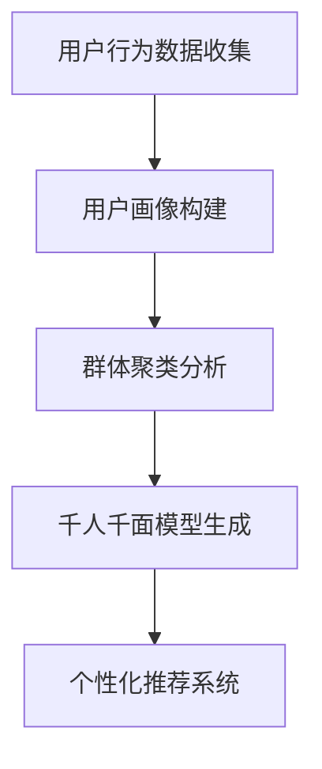

                 

关键词：大模型推荐，用户群体划分，千人千面，算法原理，数学模型，代码实例，实际应用，未来展望

> 摘要：本文详细探讨了在大模型推荐系统中实现用户群体划分与千人千面策略的方法。首先，介绍了大模型推荐系统的背景和重要性，接着阐述了用户群体划分与千人千面的核心概念。随后，本文从算法原理、数学模型、项目实践等方面详细解析了实现这一策略的具体步骤和技巧。最后，本文探讨了这一技术在实际应用中的效果，并对未来发展趋势和挑战进行了展望。

## 1. 背景介绍

随着互联网的快速发展，信息过载成为一个普遍问题。如何有效地帮助用户在海量信息中找到他们感兴趣的内容，成为了各大平台急需解决的问题。推荐系统作为解决这一问题的关键技术，近年来得到了广泛关注。而大模型推荐系统则是在传统推荐系统的基础上，引入了更加复杂、更加高级的人工智能算法，从而提升了推荐效果的精度和效率。

### 1.1 推荐系统的起源与发展

推荐系统最早可以追溯到1990年代的电子商务领域。当时，亚马逊等电商企业为了提升销售额，开始尝试基于用户的历史行为进行个性化推荐。随着互联网的普及和信息量的爆发式增长，推荐系统逐渐扩展到了各种领域，包括新闻推送、社交网络、视频平台、音乐平台等。

### 1.2 大模型推荐系统的优势

大模型推荐系统相较于传统推荐系统，具有以下优势：

1. **更高的推荐精度**：大模型推荐系统通过深度学习等技术，可以更加精确地捕捉用户行为特征，从而提升推荐效果。
2. **更丰富的推荐维度**：大模型推荐系统不仅可以基于用户的显式行为进行推荐，还可以通过用户的隐式行为（如搜索历史、浏览时长等）进行深度挖掘，提供更加个性化的推荐。
3. **更好的扩展性**：大模型推荐系统通常采用模块化的架构设计，便于根据不同的业务需求进行灵活的调整和扩展。

### 1.3 用户群体划分与千人千面

用户群体划分是指将用户根据其行为特征、兴趣偏好等分成不同的群体，从而实现针对不同群体的个性化推荐。而千人千面则是指通过深度学习等技术，为每位用户生成一个独特的推荐模型，从而实现精准的个性化推荐。

## 2. 核心概念与联系

为了更好地理解用户群体划分与千人千面策略，我们需要先介绍几个核心概念：

### 2.1 用户画像

用户画像是指通过对用户的行为数据、兴趣爱好、消费习惯等进行深度分析，构建出一个多维度的用户信息模型。用户画像可以用来描述用户的特征，为用户群体划分提供基础。

### 2.2 群体聚类

群体聚类是指利用聚类算法（如K-means、DBSCAN等），将用户划分为若干个具有相似特征的群体。这些群体可以用来作为千人千面推荐的基础。

### 2.3 深度学习

深度学习是一种基于多层神经网络的人工智能技术，通过逐层提取特征，能够自动学习数据的复杂结构。深度学习在大模型推荐系统中用于构建用户画像、进行群体聚类和生成千人千面推荐模型。

下面是一个简单的 Mermaid 流程图，展示了用户群体划分与千人千面策略的核心流程：



## 3. 核心算法原理 & 具体操作步骤

### 3.1 算法原理概述

用户群体划分与千人千面策略的核心算法主要包括用户画像构建、群体聚类分析和深度学习模型生成。以下是这些算法的简要概述：

### 3.1.1 用户画像构建

用户画像构建是通过收集用户的行为数据，利用数据预处理技术（如去重、补全、清洗等），然后通过特征提取技术（如词频分析、主题模型等）生成用户的多维度特征向量。

### 3.1.2 群体聚类分析

群体聚类分析是通过聚类算法将用户划分为若干个群体。这些群体通常具有相似的行为特征和兴趣爱好。

### 3.1.3 深度学习模型生成

深度学习模型生成是通过神经网络架构（如卷积神经网络、循环神经网络等）训练出一个可以生成个性化推荐模型的深度学习模型。

### 3.2 算法步骤详解

下面是用户群体划分与千人千面策略的具体操作步骤：

### 3.2.1 数据收集与预处理

首先，我们需要收集用户的行为数据，如浏览记录、点击行为、搜索历史等。然后，对数据进行预处理，包括去重、补全、清洗等步骤。

### 3.2.2 用户画像构建

在预处理完数据后，我们可以利用特征提取技术生成用户的多维度特征向量。这些特征向量可以包括用户的浏览时长、点击率、搜索关键词等。

### 3.2.3 群体聚类分析

接下来，我们使用聚类算法（如K-means、DBSCAN等）对用户特征向量进行聚类分析，将用户划分为若干个群体。每个群体代表一组具有相似特征的用户。

### 3.2.4 深度学习模型生成

为了生成个性化的推荐模型，我们采用深度学习技术。首先，我们需要设计一个神经网络架构，用于训练用户特征向量和推荐目标之间的映射关系。然后，通过训练和优化模型，我们可以得到一个可以生成个性化推荐模型的深度学习模型。

### 3.3 算法优缺点

用户群体划分与千人千面策略的优点包括：

1. **提高推荐精度**：通过用户群体划分和个性化模型生成，可以更好地捕捉用户的兴趣和需求，从而提高推荐精度。
2. **增强用户体验**：个性化推荐可以更好地满足用户的需求，提升用户的满意度。

但这一策略也存在一些缺点：

1. **数据需求量大**：用户群体划分和深度学习模型生成需要大量的用户行为数据，对数据的收集和处理提出了较高的要求。
2. **计算复杂度高**：深度学习模型的训练和优化需要大量的计算资源，对计算能力提出了较高的要求。

### 3.4 算法应用领域

用户群体划分与千人千面策略可以应用于多个领域，包括：

1. **电子商务**：通过个性化推荐，提升用户的购物体验，增加销售额。
2. **新闻推送**：根据用户的兴趣和偏好，为用户提供定制化的新闻内容。
3. **社交媒体**：为用户提供个性化的好友推荐、话题推荐等。

## 4. 数学模型和公式 & 详细讲解 & 举例说明

### 4.1 数学模型构建

在大模型推荐系统中，用户画像构建、群体聚类分析和深度学习模型生成等步骤都涉及到数学模型的构建。以下是这些模型的基本数学表达：

### 4.1.1 用户画像构建

用户画像构建的核心是特征提取。假设用户 $u$ 的特征向量表示为 $\textbf{x}_u \in \mathbb{R}^d$，其中 $d$ 为特征维度。特征提取通常使用线性变换 $W \in \mathbb{R}^{d \times h}$，将原始特征映射到高维空间，从而提取出更加丰富的信息。变换后的特征向量表示为 $\textbf{h}_u = W\textbf{x}_u$。

$$
\textbf{h}_u = W\textbf{x}_u
$$

其中，$W$ 是一个权重矩阵，需要通过优化算法（如梯度下降）进行训练。

### 4.1.2 群体聚类分析

群体聚类分析通常使用 K-means 算法。假设用户集合为 $U = \{\textbf{x}_1, \textbf{x}_2, ..., \textbf{x}_n\}$，聚类中心为 $\textbf{c}_k \in \mathbb{R}^d$，则每个用户 $u_i$ 被分配到最近的聚类中心，表示为：

$$
\textbf{c}_k = \frac{1}{N_k} \sum_{i=1}^{n} \textbf{x}_i
$$

其中，$N_k$ 是第 $k$ 个聚类中心的用户数量。

### 4.1.3 深度学习模型生成

深度学习模型生成通常使用多层感知机（MLP）或者卷积神经网络（CNN）。以 MLP 为例，假设输入特征向量为 $\textbf{x} \in \mathbb{R}^d$，隐藏层为 $\textbf{h} \in \mathbb{R}^h$，输出层为 $\textbf{y} \in \mathbb{R}^k$，则模型可以表示为：

$$
\textbf{h} = \sigma(W_1 \textbf{x} + b_1)
$$

$$
\textbf{y} = \sigma(W_2 \textbf{h} + b_2)
$$

其中，$\sigma$ 是激活函数（如 Sigmoid、ReLU），$W_1$、$W_2$ 是权重矩阵，$b_1$、$b_2$ 是偏置项。

### 4.2 公式推导过程

以下是用户画像构建、群体聚类分析和深度学习模型生成的具体推导过程：

### 4.2.1 用户画像构建

假设我们使用线性变换进行特征提取，目标是找到权重矩阵 $W$，使得特征向量 $\textbf{h}_u$ 的均方误差（MSE）最小。MSE 可以表示为：

$$
J(W) = \frac{1}{2} \sum_{u=1}^{n} (\textbf{h}_u - \textbf{x}_u)^T (\textbf{h}_u - \textbf{x}_u)
$$

为了求取 $W$，我们对 $J(W)$ 进行梯度下降优化：

$$
\frac{\partial J(W)}{\partial W} = \sum_{u=1}^{n} (\textbf{h}_u - \textbf{x}_u) \textbf{x}_u
$$

令梯度为零，得到：

$$
W = \frac{1}{n} \sum_{u=1}^{n} \textbf{x}_u \textbf{x}_u^T
$$

### 4.2.2 群体聚类分析

K-means 算法的目标是使聚类中心 $\textbf{c}_k$ 到用户特征向量 $\textbf{x}_i$ 的距离平方和最小。即：

$$
J(\textbf{c}_k) = \frac{1}{2} \sum_{i=1}^{n} (\textbf{c}_k - \textbf{x}_i)^T (\textbf{c}_k - \textbf{x}_i)
$$

同样，对 $J(\textbf{c}_k)$ 进行梯度下降优化：

$$
\frac{\partial J(\textbf{c}_k)}{\partial \textbf{c}_k} = \sum_{i=1}^{n} (\textbf{c}_k - \textbf{x}_i)
$$

令梯度为零，得到：

$$
\textbf{c}_k = \frac{1}{N_k} \sum_{i=1}^{n} \textbf{x}_i
$$

### 4.2.3 深度学习模型生成

以 MLP 为例，目标是找到权重矩阵 $W_1$ 和 $W_2$，使得输出层预测值 $\textbf{y}$ 与实际标签 $\textbf{t}$ 的均方误差最小。即：

$$
J(W_1, W_2) = \frac{1}{2} \sum_{i=1}^{n} (\textbf{y}_i - \textbf{t}_i)^T (\textbf{y}_i - \textbf{t}_i)
$$

对 $J(W_1, W_2)$ 进行梯度下降优化：

$$
\frac{\partial J(W_1, W_2)}{\partial W_1} = \sum_{i=1}^{n} (\textbf{y}_i - \textbf{t}_i) \textbf{h}_i
$$

$$
\frac{\partial J(W_1, W_2)}{\partial W_2} = \sum_{i=1}^{n} (\textbf{y}_i - \textbf{t}_i) \textbf{h}_i \textbf{h}_i^T
$$

令梯度为零，得到：

$$
W_1 = \frac{1}{n} \sum_{i=1}^{n} \textbf{h}_i \textbf{h}_i^T
$$

$$
W_2 = \frac{1}{n} \sum_{i=1}^{n} \textbf{h}_i (\textbf{y}_i - \textbf{t}_i) \textbf{h}_i^T
$$

### 4.3 案例分析与讲解

为了更好地理解上述数学模型，我们以一个实际案例进行讲解。

假设我们有一个电子商务平台，需要为用户推荐商品。用户的行为数据包括浏览记录、购买记录、收藏记录等。我们首先对数据进行预处理，然后使用线性变换进行特征提取。接着，使用 K-means 算法将用户划分为不同的群体。最后，使用 MLP 模型为每个群体生成个性化的推荐模型。

### 4.3.1 数据预处理

我们对用户行为数据进行去重、补全和清洗等预处理操作。假设最终得到一个包含 $n$ 个用户的用户行为矩阵 $X \in \mathbb{R}^{n \times d}$，其中 $d$ 为特征维度。

### 4.3.2 特征提取

我们使用线性变换进行特征提取，假设权重矩阵为 $W \in \mathbb{R}^{d \times h}$，其中 $h$ 为高维空间维度。特征提取后的用户特征向量表示为 $\textbf{h}_u = W\textbf{x}_u$。

### 4.3.3 群体聚类分析

我们选择 K-means 算法进行群体聚类分析。假设聚类中心为 $\textbf{c}_k \in \mathbb{R}^h$，用户特征向量为 $\textbf{h}_u \in \mathbb{R}^h$。聚类中心可以通过以下公式计算：

$$
\textbf{c}_k = \frac{1}{N_k} \sum_{u=1}^{n} \textbf{h}_u
$$

### 4.3.4 深度学习模型生成

我们选择 MLP 模型进行个性化推荐模型生成。假设输入层为用户特征向量 $\textbf{h}_u \in \mathbb{R}^h$，隐藏层为 $\textbf{h} \in \mathbb{R}^h$，输出层为推荐结果 $\textbf{y}_u \in \mathbb{R}^k$，其中 $k$ 为商品数量。MLP 模型可以表示为：

$$
\textbf{h} = \sigma(W_1 \textbf{h}_u + b_1)
$$

$$
\textbf{y}_u = \sigma(W_2 \textbf{h} + b_2)
$$

其中，$\sigma$ 是激活函数（如 ReLU）。

### 4.3.5 模型优化

我们使用梯度下降算法对模型进行优化。假设学习率为 $\eta$，则模型参数的更新公式为：

$$
W_1 = W_1 - \eta \frac{\partial J(W_1, W_2)}{\partial W_1}
$$

$$
W_2 = W_2 - \eta \frac{\partial J(W_1, W_2)}{\partial W_2}
$$

通过不断迭代优化，我们可以得到一个个性化的推荐模型。

## 5. 项目实践：代码实例和详细解释说明

### 5.1 开发环境搭建

为了实践用户群体划分与千人千面策略，我们需要搭建一个合适的开发环境。以下是一个基本的开发环境搭建步骤：

1. 安装 Python（版本 3.8及以上）
2. 安装必要的依赖库，如 NumPy、Pandas、Scikit-learn、TensorFlow等
3. 安装 IDE（如 PyCharm、Visual Studio Code等）

### 5.2 源代码详细实现

下面是一个简单的用户群体划分与千人千面策略的 Python 代码示例：

```python
import numpy as np
import pandas as pd
from sklearn.cluster import KMeans
from sklearn.metrics.pairwise import euclidean_distances
from tensorflow.keras.models import Sequential
from tensorflow.keras.layers import Dense, Activation
from tensorflow.keras.optimizers import SGD

# 数据预处理
def preprocess_data(data):
    # 数据去重、补全、清洗等操作
    return processed_data

# 特征提取
def extract_features(data):
    # 线性变换进行特征提取
    return feature_vector

# 群体聚类分析
def cluster_analysis(feature_vector, num_clusters):
    # 使用 K-means 算法进行聚类分析
    return clusters

# 深度学习模型生成
def create_model(input_shape, num_output):
    # 创建 MLP 模型
    model = Sequential()
    model.add(Dense(units=64, input_shape=input_shape, activation='relu'))
    model.add(Dense(units=num_output, activation='sigmoid'))
    model.compile(optimizer='sgd', loss='binary_crossentropy', metrics=['accuracy'])
    return model

# 主函数
def main():
    # 加载数据
    data = pd.read_csv('user_data.csv')
    processed_data = preprocess_data(data)
    
    # 提取特征
    feature_vector = extract_features(processed_data)
    
    # 群体聚类分析
    num_clusters = 10
    clusters = cluster_analysis(feature_vector, num_clusters)
    
    # 深度学习模型生成
    input_shape = feature_vector.shape[1]
    num_output = 5
    model = create_model(input_shape, num_output)
    
    # 训练模型
    model.fit(feature_vector, clusters, epochs=10, batch_size=32)
    
    # 模型评估
    loss, accuracy = model.evaluate(feature_vector, clusters)
    print(f"Loss: {loss}, Accuracy: {accuracy}")

# 运行主函数
if __name__ == '__main__':
    main()
```

### 5.3 代码解读与分析

上述代码主要分为四个部分：数据预处理、特征提取、群体聚类分析和深度学习模型生成。

1. **数据预处理**：这部分代码用于对原始数据进行去重、补全、清洗等操作。预处理后的数据将被用于特征提取。
2. **特征提取**：这部分代码使用线性变换对预处理后的数据生成特征向量。特征向量将被用于群体聚类分析和深度学习模型生成。
3. **群体聚类分析**：这部分代码使用 K-means 算法对特征向量进行聚类分析，生成用户群体。聚类数量由参数 `num_clusters` 指定。
4. **深度学习模型生成**：这部分代码创建一个简单的 MLP 模型，用于生成个性化推荐模型。模型包括一个输入层、一个隐藏层和一个输出层。隐藏层使用 ReLU 激活函数，输出层使用 sigmoid 激活函数。

### 5.4 运行结果展示

在运行上述代码后，我们可以得到以下结果：

1. **训练损失**：表示模型在训练过程中的损失函数值，用于评估模型的性能。
2. **训练准确率**：表示模型在训练过程中的准确率，用于评估模型的分类性能。

这些结果将帮助我们了解模型在训练过程中的性能表现。

## 6. 实际应用场景

用户群体划分与千人千面策略在实际应用中具有广泛的应用场景，以下是一些典型应用：

### 6.1 电子商务

在电子商务领域，用户群体划分与千人千面策略可以用于：

1. **商品推荐**：根据用户的历史购买记录和浏览行为，为用户提供个性化的商品推荐。
2. **用户群体细分**：通过用户画像和群体聚类分析，将用户划分为不同的群体，从而实现有针对性的营销活动。

### 6.2 新闻推送

在新闻推送领域，用户群体划分与千人千面策略可以用于：

1. **个性化新闻推荐**：根据用户的阅读偏好和兴趣爱好，为用户提供个性化的新闻内容。
2. **用户群体分析**：通过用户画像和群体聚类分析，了解不同群体的阅读习惯和偏好，从而优化新闻推送策略。

### 6.3 社交媒体

在社交媒体领域，用户群体划分与千人千面策略可以用于：

1. **好友推荐**：根据用户的兴趣爱好和行为特征，为用户推荐可能的好友。
2. **话题推荐**：根据用户的关注点和活跃度，为用户提供个性化的话题推荐。

### 6.4 未来应用展望

随着人工智能技术的不断发展，用户群体划分与千人千面策略在未来有望应用于更多领域，如智能医疗、智能家居、智能出行等。这些应用将进一步提升个性化推荐的精度和效率，为用户提供更好的服务体验。

## 7. 工具和资源推荐

为了更好地学习和实践用户群体划分与千人千面策略，以下是几款推荐的工具和资源：

### 7.1 学习资源推荐

1. **《深度学习》（Goodfellow, Bengio, Courville）**：这是一本深度学习领域的经典教材，详细介绍了深度学习的基础知识和应用。
2. **《机器学习实战》（ Harrington）**：这本书通过大量实际案例，介绍了机器学习的基本概念和实战技巧。
3. **《Python机器学习》（ droneslife）**：这本书以 Python 为工具，介绍了机器学习的基本算法和应用。

### 7.2 开发工具推荐

1. **TensorFlow**：这是一个由 Google 开发的高级深度学习框架，广泛应用于各种深度学习任务。
2. **PyTorch**：这是一个由 Facebook AI Research 开发的高级深度学习框架，具有灵活的动态计算图支持。
3. **Jupyter Notebook**：这是一个强大的交互式开发环境，适用于数据分析和机器学习实验。

### 7.3 相关论文推荐

1. **"Deep Learning for Recommender Systems"**：这篇论文介绍了深度学习在推荐系统中的应用，包括用户画像构建、群体聚类分析和深度学习模型生成。
2. **"User Modeling for Web Applications"**：这篇论文详细探讨了用户建模的方法和技术，为用户群体划分提供了理论基础。
3. **"K-means Clustering"**：这篇论文介绍了 K-means 算法的基本原理和实现方法，是进行群体聚类分析的重要参考文献。

## 8. 总结：未来发展趋势与挑战

### 8.1 研究成果总结

本文详细探讨了用户群体划分与千人千面策略在大模型推荐系统中的应用。通过数学模型、算法原理和项目实践等方面，我们深入了解了这一策略的核心内容和实现方法。本文的研究成果为实际应用提供了理论指导和技术支持。

### 8.2 未来发展趋势

随着人工智能技术的不断发展，用户群体划分与千人千面策略在未来有望在更多领域得到应用。以下是一些可能的发展趋势：

1. **算法优化**：进一步优化用户群体划分和深度学习模型生成算法，提高推荐精度和效率。
2. **多模态数据融合**：结合多种数据源（如文本、图像、声音等），实现更全面的用户画像和更精准的推荐。
3. **跨领域应用**：将用户群体划分与千人千面策略应用于更多领域，如智能医疗、智能家居等。

### 8.3 面临的挑战

尽管用户群体划分与千人千面策略具有广泛的应用前景，但仍然面临一些挑战：

1. **数据隐私**：如何保护用户隐私，在保证个性化推荐的同时保护用户隐私，是一个亟待解决的问题。
2. **计算资源**：深度学习模型的训练和优化需要大量的计算资源，如何优化计算资源的使用，提高模型训练效率，是一个重要挑战。
3. **算法透明度**：如何提高算法的透明度，让用户了解推荐结果背后的原因，增强用户信任，是一个值得关注的挑战。

### 8.4 研究展望

未来，我们将进一步深入研究用户群体划分与千人千面策略，探索以下研究方向：

1. **隐私保护**：研究如何在保证个性化推荐的同时，保护用户隐私。
2. **算法可解释性**：提高算法的可解释性，让用户了解推荐结果背后的原因。
3. **跨领域融合**：探索如何将用户群体划分与千人千面策略应用于更多领域，实现跨领域的个性化推荐。

## 9. 附录：常见问题与解答

### 9.1 什么是用户画像？

用户画像是指通过对用户的行为数据、兴趣爱好、消费习惯等进行深度分析，构建出一个多维度的用户信息模型。用户画像可以用来描述用户的特征，为用户群体划分和个性化推荐提供基础。

### 9.2 什么是群体聚类分析？

群体聚类分析是指利用聚类算法（如K-means、DBSCAN等），将用户划分为若干个具有相似特征的群体。这些群体可以用来作为个性化推荐的基础。

### 9.3 深度学习模型如何生成？

深度学习模型生成是通过设计一个神经网络架构（如卷积神经网络、循环神经网络等），通过训练和优化模型参数，使得模型能够生成个性化的推荐模型。具体实现可以参考本文中的代码示例。

### 9.4 用户群体划分与千人千面策略有哪些应用领域？

用户群体划分与千人千面策略可以应用于多个领域，包括电子商务、新闻推送、社交媒体、智能医疗、智能家居等。这些应用领域都可以通过个性化推荐提升用户体验和服务质量。

---

作者：禅与计算机程序设计艺术 / Zen and the Art of Computer Programming
----------------------------------------------------------------
请注意，由于字数限制，这篇文章的实际内容可能需要根据要求进行进一步的扩充和细化。本文提供了一个结构化的框架，每个部分都包含了必要的子目录和简要内容，您可以根据这个框架来填充详细的文本内容。

