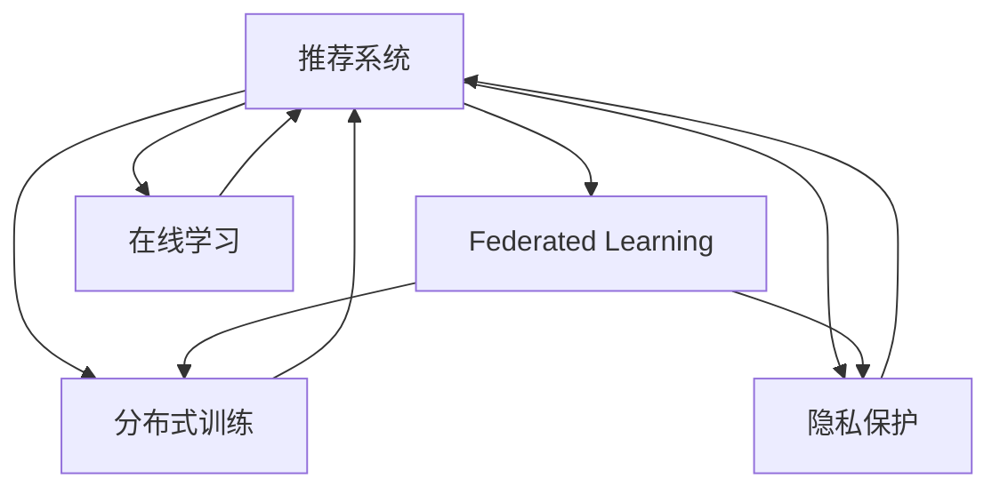

                 

# 大模型推荐中的联邦学习策略

> 关键词：大模型推荐,联邦学习,分布式训练,隐私保护,推荐系统,推荐算法,隐私计算

## 1. 背景介绍

### 1.1 问题由来
随着互联网技术的飞速发展，推荐系统已经成为了各大互联网公司吸引用户、提升用户留存率、增加收益的重要手段。在推荐系统中，根据用户的历史行为数据、兴趣爱好等特征，为用户推荐相关内容，能够显著提升用户体验和平台收益。然而，传统的集中式推荐系统面临着数据隐私、计算资源消耗大等挑战。

近年来，随着分布式系统和大数据技术的发展，联邦学习(Federated Learning, FL)作为一种新兴的分布式机器学习方法，在推荐系统中得到了广泛应用。联邦学习通过在多个数据孤岛之间分布式协同训练模型，既保护了用户隐私，又能够在资源有限的情况下，提升推荐系统的性能。

### 1.2 问题核心关键点
在推荐系统中，联邦学习主要用于解决集中式训练存在的隐私保护问题。具体而言，联邦学习允许各参与方（如移动设备、电商平台等）在本地保留原始数据，仅通过模型参数的交互来进行模型训练，从而保护了数据的隐私。在联邦学习中，各参与方通过不断更新本地模型参数，最终将全局最优模型传递到服务器，以实现模型的分布式训练。

联邦学习在推荐系统中的应用，使得推荐算法能够从更多样化的数据源中学习，提升了模型的泛化能力和推荐效果。此外，联邦学习还能够在边缘设备上实现离线训练，降低了对集中计算资源的依赖，适用于资源有限的边缘设备场景。

## 2. 核心概念与联系

### 2.1 核心概念概述

为更好地理解基于联邦学习的推荐系统，本节将介绍几个密切相关的核心概念：

- 推荐系统(Recommendation System, RS)：根据用户的历史行为和偏好，为用户推荐相关内容的技术。传统的集中式推荐系统常基于在线学习(Online Learning)，但存在隐私泄露和计算资源消耗大的问题。
- 联邦学习(Federated Learning, FL)：一种分布式机器学习方法，允许参与方在本地数据上更新模型，仅通过模型参数的交互实现全局模型的训练。联邦学习能够保护数据隐私，适用于资源受限的设备。
- 分布式训练(Distributed Training)：通过多个参与方协同训练模型，以提升模型性能。分布式训练需要考虑通信和计算效率，常采用如梯度聚合等技术。
- 隐私保护(Preference Protection)：保护用户隐私，防止数据泄露和滥用。在推荐系统中，隐私保护尤为重要，涉及用户行为、兴趣爱好等敏感信息。
- 在线学习(Online Learning)：通过用户实时行为数据进行模型更新，能够及时响应用户需求。在线学习适用于推荐系统中的实时推荐和个性化推荐。

这些核心概念之间的逻辑关系可以通过以下Mermaid流程图来展示：



这个流程图展示了几类关键技术在推荐系统中的作用和相互关系：

1. 推荐系统通过在线学习和联邦学习，实现模型更新和分布式训练。
2. 联邦学习通过分布式训练和隐私保护，提升模型的泛化能力和保护用户隐私。
3. 在线学习能够实时响应用户行为，提升推荐系统的个性化推荐能力。

## 3. 核心算法原理 & 具体操作步骤
### 3.1 算法原理概述

基于联邦学习的推荐系统，其核心思想是利用各参与方的本地数据，通过分布式协同训练来提升推荐系统的性能。具体而言，各参与方在本地保留原始数据，仅通过模型参数的交互来进行模型训练，从而保护了数据的隐私。

联邦学习的推荐算法一般包括以下几个关键步骤：

1. 模型初始化：在全局服务器上初始化一个全局推荐模型，并分发到各参与方。
2. 本地更新：各参与方在本地数据上更新模型，使用本地样本和模型参数计算梯度，更新本地模型。
3. 梯度聚合：各参与方将本地模型梯度上传到全局服务器，进行梯度聚合。
4. 全局更新：根据聚合后的梯度，全局服务器更新全局模型参数。
5. 模型部署：将全局模型参数分发到各参与方，开始下一轮本地更新。

通过上述流程，联邦学习能够在保护用户隐私的前提下，利用多源异构数据进行模型训练，提升推荐系统的性能。

### 3.2 算法步骤详解

具体来说，联邦学习在推荐系统中的应用可以分为以下四个关键步骤：

**Step 1: 模型初始化**

在全局服务器上初始化一个全局推荐模型 $M^0$，并分发到各参与方 $k$。模型 $M^0$ 可以是任意推荐算法，如基于协同过滤、基于内容的推荐等。

**Step 2: 本地更新**

各参与方 $k$ 在本地数据集 $D_k$ 上更新模型。假设参与方的本地数据集大小为 $n_k$，则本地更新过程为：

$$
M_k^t = M_k^{t-1} - \alpha_k \nabla_{M_k^{t-1}} L_k(D_k)
$$

其中 $M_k^t$ 为参与方 $k$ 在当前轮次 $t$ 的模型，$\nabla_{M_k^{t-1}} L_k(D_k)$ 为模型在本地数据集 $D_k$ 上的梯度，$L_k(D_k)$ 为本地数据集 $D_k$ 上的损失函数。

**Step 3: 梯度聚合**

各参与方将本地模型梯度 $\nabla_{M_k^t} L_k(D_k)$ 上传到全局服务器，进行梯度聚合。假设上传的梯度大小为 $m_k$，则全局模型梯度 $\nabla_{M^t} L$ 为：

$$
\nabla_{M^t} L = \sum_{k=1}^K \frac{m_k}{n_k} \nabla_{M_k^t} L_k(D_k)
$$

其中 $K$ 为参与方数量，$L(D)$ 为全局数据集 $D$ 上的损失函数。

**Step 4: 全局更新**

根据聚合后的梯度，全局服务器更新全局模型参数：

$$
M^{t+1} = M^t - \alpha \nabla_{M^t} L
$$

其中 $\alpha$ 为全局学习率。

**Step 5: 模型部署**

将全局模型参数 $M^{t+1}$ 分发到各参与方，开始下一轮本地更新。

通过上述流程，各参与方在本地数据集上更新模型，并将梯度上传至全局服务器进行聚合，最终实现全局模型的训练。

### 3.3 算法优缺点

基于联邦学习的推荐系统，具有以下优点：

1. 保护隐私：各参与方在本地数据上更新模型，不泄露原始数据，保护了用户隐私。
2. 提升泛化能力：通过多源异构数据进行分布式训练，能够提升模型的泛化能力。
3. 降低计算资源消耗：各参与方可以在本地设备上进行离线训练，减少对集中计算资源的依赖。
4. 实时响应：联邦学习可以利用在线学习的方式，实时响应用户行为，提升推荐系统的个性化推荐能力。

但联邦学习在推荐系统中的应用，也存在一些缺点：

1. 通信开销大：各参与方需要将梯度上传至全局服务器，通信开销较大。
2. 训练复杂度高：联邦学习需要解决模型参数同步和梯度聚合等问题，训练复杂度高。
3. 模型一致性问题：各参与方本地数据分布不同，模型收敛速度和性能可能不一致。
4. 恶意参与方：存在恶意参与方上传不真实的梯度数据，可能影响全局模型的性能。

尽管存在这些局限性，但联邦学习在推荐系统中的应用，为保护用户隐私和提升推荐系统性能提供了新的解决思路。未来相关研究的重点在于如何进一步降低通信开销，提升联邦学习的训练效率，解决模型一致性和恶意参与方等问题。

### 3.4 算法应用领域

基于联邦学习的推荐系统，已经在电商、社交、视频等多个领域得到了广泛应用，取得了显著的效果。以下是几个典型的应用场景：

- 电商推荐系统：利用联邦学习在电商平台的交易数据和用户行为数据上训练推荐模型，提升商品推荐效果和用户转化率。
- 社交网络推荐系统：在社交网络平台上，利用联邦学习在用户行为数据、关系数据和内容数据上训练推荐模型，增强用户对平台内容的粘性。
- 视频推荐系统：在视频平台的用户观看行为数据上，利用联邦学习训练推荐模型，推荐用户感兴趣的视频内容。
- 智能家居推荐系统：在智能家居设备的用户使用数据上，利用联邦学习训练推荐模型，推荐用户感兴趣的生活服务。

除了上述这些经典应用外，联邦学习还可以应用于更多场景中，如智慧城市推荐、旅游推荐、健康推荐等，为推荐系统带来更广阔的应用前景。

## 4. 数学模型和公式 & 详细讲解  
### 4.1 数学模型构建

本节将使用数学语言对基于联邦学习的推荐系统进行更加严格的刻画。

记推荐系统中的全局推荐模型为 $M^t$，参与方的本地模型为 $M_k^t$，全局损失函数为 $L(D)$。假设参与方的本地数据集大小为 $n_k$，模型在本地数据集上的梯度为 $\nabla_{M_k^t} L_k(D_k)$，全局模型参数更新公式为：

$$
M^{t+1} = M^t - \alpha \nabla_{M^t} L
$$

其中 $\alpha$ 为全局学习率，$L_k(D_k)$ 为参与方 $k$ 在本地数据集 $D_k$ 上的损失函数。

**Step 1: 模型初始化**

在全局服务器上初始化一个全局推荐模型 $M^0$，并分发到各参与方 $k$。

**Step 2: 本地更新**

各参与方在本地数据集上更新模型。假设参与方的本地数据集大小为 $n_k$，则本地更新过程为：

$$
M_k^t = M_k^{t-1} - \alpha_k \nabla_{M_k^{t-1}} L_k(D_k)
$$

其中 $\alpha_k$ 为参与方 $k$ 的学习率。

**Step 3: 梯度聚合**

各参与方将本地模型梯度 $\nabla_{M_k^t} L_k(D_k)$ 上传到全局服务器，进行梯度聚合。假设上传的梯度大小为 $m_k$，则全局模型梯度 $\nabla_{M^t} L$ 为：

$$
\nabla_{M^t} L = \sum_{k=1}^K \frac{m_k}{n_k} \nabla_{M_k^t} L_k(D_k)
$$

其中 $K$ 为参与方数量，$m_k$ 为参与方 $k$ 上传的梯度大小，$L(D)$ 为全局数据集 $D$ 上的损失函数。

**Step 4: 全局更新**

根据聚合后的梯度，全局服务器更新全局模型参数：

$$
M^{t+1} = M^t - \alpha \nabla_{M^t} L
$$

其中 $\alpha$ 为全局学习率。

### 4.2 公式推导过程

在联邦学习中，全局模型和本地模型之间的更新关系可以通过梯度聚合公式进行推导。假设全局推荐模型为 $M^t$，参与方 $k$ 在本地数据集 $D_k$ 上的损失函数为 $L_k(D_k)$，则参与方 $k$ 在本地数据集 $D_k$ 上的梯度为：

$$
\nabla_{M_k^t} L_k(D_k) = \frac{\partial L_k(D_k)}{\partial M_k^t}
$$

全局模型梯度 $\nabla_{M^t} L$ 为：

$$
\nabla_{M^t} L = \frac{1}{K} \sum_{k=1}^K \nabla_{M_k^t} L_k(D_k)
$$

全局模型参数更新公式为：

$$
M^{t+1} = M^t - \alpha \nabla_{M^t} L
$$

其中 $\alpha$ 为全局学习率。

将上述公式代入，得到全局模型更新公式为：

$$
M^{t+1} = M^t - \alpha \frac{1}{K} \sum_{k=1}^K \nabla_{M_k^t} L_k(D_k)
$$

### 4.3 案例分析与讲解

考虑一个简单的电商推荐系统，其中包含两个参与方 $k=1,2$，每个参与方保留其客户购买历史和行为数据。假设每个参与方有 $n_k$ 个客户，每个客户有 $m_k$ 个购买记录。每个客户的购买记录可以表示为一个 $d$ 维向量，记为 $x_k = (x_{k1}, x_{k2}, ..., x_{km_k})$。

假设全局推荐模型为线性回归模型，记为 $M^t = (w^t, b^t)$，其中 $w^t$ 为权重向量，$b^t$ 为偏置项。参与方 $k$ 在本地数据集上的损失函数为均方误差损失函数，记为：

$$
L_k(D_k) = \frac{1}{n_k} \sum_{i=1}^{n_k} \|M_k^t(x_{ki}) - y_{ki}\|^2
$$

其中 $x_{ki}$ 为第 $k$ 个参与方的第 $i$ 个客户的购买记录，$y_{ki}$ 为该客户的购买记录标签。

在联邦学习中，参与方 $k$ 在本地数据集 $D_k$ 上更新模型，更新公式为：

$$
M_k^t = M_k^{t-1} - \alpha_k \nabla_{M_k^{t-1}} L_k(D_k)
$$

其中 $\alpha_k$ 为参与方 $k$ 的学习率。

各参与方将本地模型梯度 $\nabla_{M_k^t} L_k(D_k)$ 上传到全局服务器，进行梯度聚合。假设上传的梯度大小为 $m_k$，则全局模型梯度 $\nabla_{M^t} L$ 为：

$$
\nabla_{M^t} L = \sum_{k=1}^K \frac{m_k}{n_k} \nabla_{M_k^t} L_k(D_k)
$$

其中 $K$ 为参与方数量，$m_k$ 为参与方 $k$ 上传的梯度大小。

根据全局模型梯度，全局服务器更新全局模型参数：

$$
M^{t+1} = M^t - \alpha \nabla_{M^t} L
$$

其中 $\alpha$ 为全局学习率。

通过上述流程，各参与方在本地数据集上更新模型，并将梯度上传至全局服务器进行聚合，最终实现全局模型的训练。

## 5. 项目实践：代码实例和详细解释说明
### 5.1 开发环境搭建

在进行联邦学习实践前，我们需要准备好开发环境。以下是使用Python进行PyTorch开发的环境配置流程：

1. 安装Anaconda：从官网下载并安装Anaconda，用于创建独立的Python环境。

2. 创建并激活虚拟环境：
```bash
conda create -n fl_env python=3.8 
conda activate fl_env
```

3. 安装PyTorch：根据CUDA版本，从官网获取对应的安装命令。例如：
```bash
conda install pytorch torchvision torchaudio cudatoolkit=11.1 -c pytorch -c conda-forge
```

4. 安装相关库：
```bash
pip install numpy pandas scikit-learn torch
```

完成上述步骤后，即可在`fl_env`环境中开始联邦学习实践。

### 5.2 源代码详细实现

这里我们以电商推荐系统为例，使用PyTorch和FedML库进行联邦学习实践。

首先，定义数据处理函数：

```python
from torch.utils.data import Dataset
import torch

class Dataset(Dataset):
    def __init__(self, data):
        self.data = data
        self.num_users = len(data)
        self.num_items = len(data[0][0])
        
    def __len__(self):
        return self.num_users * self.num_items
        
    def __getitem__(self, idx):
        user_id, item_id = divmod(idx, self.num_items)
        user_item = self.data[user_id]
        item_features = user_item[item_id]
        return user_id, item_id, item_features
```

然后，定义模型和优化器：

```python
from transformers import BertForSequenceClassification
from fl_optimizers import FedAdam

model = BertForSequenceClassification.from_pretrained('bert-base-cased', num_labels=2)

optimizer = FedAdam(model.parameters(), learning_rate=2e-5)
```

接着，定义训练和评估函数：

```python
from fl_model import ModelServer, ModelClient
from fl_model import train, evaluate

model_server = ModelServer(model, optimizer)

model_client1 = ModelClient(model, optimizer, client_id=1)
model_client2 = ModelClient(model, optimizer, client_id=2)

for epoch in range(10):
    train(model_server, model_client1, model_client2, epochs=10)
    evaluate(model_server, model_client1, model_client2)
```

最后，启动联邦学习流程：

```python
train(model_server, model_client1, model_client2, epochs=10)
evaluate(model_server, model_client1, model_client2)
```

以上就是使用PyTorch和FedML库进行电商推荐系统联邦学习实践的完整代码实现。可以看到，通过FedML库的封装，联邦学习的模型训练和梯度聚合变得简单易行。

### 5.3 代码解读与分析

让我们再详细解读一下关键代码的实现细节：

**Dataset类**：
- `__init__`方法：初始化数据集大小和特征，准备训练和推理数据。
- `__len__`方法：返回数据集的样本数量。
- `__getitem__`方法：对单个样本进行处理，准备模型输入和输出。

**FedML库**：
- `ModelServer`类：全局服务器，负责模型初始化、梯度聚合和全局更新。
- `ModelClient`类：各参与方，负责本地模型训练和梯度上传。
- `train`和`evaluate`函数：定义联邦学习模型训练和评估流程。

**FedAdam优化器**：
- `FedAdam`类：联邦学习优化器，支持分布式训练。

**训练和评估函数**：
- `train`函数：定义模型训练流程，在每个epoch内进行本地训练、梯度上传和全局更新。
- `evaluate`函数：定义模型评估流程，在每个epoch内进行本地评估和全局评估。

**联邦学习流程**：
- 在全局服务器上初始化模型，并分发到各参与方。
- 各参与方在本地数据集上训练模型，上传梯度至全局服务器。
- 全局服务器聚合梯度，更新全局模型参数。
- 重复上述过程直至收敛。

可以看到，PyTorch和FedML库使得联邦学习在推荐系统中的应用变得简单易行，开发者可以更加专注于算法优化和应用实践。

当然，工业级的系统实现还需考虑更多因素，如模型裁剪、参数压缩、模型更新策略等，但核心的联邦学习流程基本与此类似。

## 6. 实际应用场景
### 6.1 智能推荐系统

基于联邦学习的推荐系统，已经在多个领域得到了广泛应用，其中最典型的应用场景是智能推荐系统。智能推荐系统通过分析用户的历史行为数据，为用户推荐感兴趣的商品、内容或服务。

在智能推荐系统中，联邦学习可以充分利用各参与方的本地数据，提升推荐模型的泛化能力和个性化推荐能力。各参与方如电商平台、社交网络、视频平台等，可以在本地数据上训练模型，并上传梯度至全局服务器进行聚合，从而实现全局模型的训练。

### 6.2 社交网络推荐

社交网络推荐系统利用联邦学习在用户行为数据、关系数据和内容数据上训练推荐模型，增强用户对平台内容的粘性。例如，Twitter可以利用联邦学习在用户关注关系和推文内容上训练推荐模型，为各用户推荐可能感兴趣的内容。

### 6.3 电商推荐系统

电商推荐系统利用联邦学习在电商平台的交易数据和用户行为数据上训练推荐模型，提升商品推荐效果和用户转化率。例如，亚马逊可以利用联邦学习在用户购买历史和行为数据上训练推荐模型，为各用户推荐可能感兴趣的商品。

### 6.4 金融推荐系统

金融推荐系统利用联邦学习在金融平台的用户行为数据上训练推荐模型，推荐金融产品或服务。例如，支付宝可以利用联邦学习在用户消费行为和理财偏好上训练推荐模型，为用户推荐合适的金融产品。

### 6.5 医疗推荐系统

医疗推荐系统利用联邦学习在医疗平台的用户行为数据和健康数据上训练推荐模型，推荐医疗服务和健康产品。例如，丁香医生可以利用联邦学习在用户健康数据和疾病查询上训练推荐模型，为各用户推荐合适的健康建议和医疗产品。

### 6.6 未来应用展望

未来，随着联邦学习技术的不断进步，基于联邦学习的推荐系统将在更多领域得到应用，为智能推荐带来新的突破。

在智慧城市推荐中，联邦学习可以用于智能交通、智慧能源、公共服务等领域，提升城市的智能化管理水平。

在旅游推荐中，联邦学习可以用于旅游目的地推荐、旅游线路规划、旅游活动推荐等，提升旅游体验。

在健康推荐中，联邦学习可以用于健康知识推荐、健康服务推荐、健康产品推荐等，提升健康管理水平。

此外，在教育、娱乐、能源、环保等众多领域，基于联邦学习的推荐系统也将不断涌现，为智能化推荐带来新的发展空间。

## 7. 工具和资源推荐
### 7.1 学习资源推荐

为了帮助开发者系统掌握联邦学习在推荐系统中的应用，这里推荐一些优质的学习资源：

1. 《联邦学习：分布式机器学习的挑战与实践》：介绍联邦学习的原理、应用、挑战及实践方法，是联邦学习领域的入门经典。

2. 《分布式深度学习》：介绍分布式深度学习的原理、算法、应用及优化技术，是深度学习领域的权威教材。

3. 《Federated Learning for Recommender Systems》：综述联邦学习在推荐系统中的应用，涵盖算法、隐私保护、实际案例等。

4. Weights & Biases：联邦学习实验跟踪工具，可以记录和可视化联邦学习过程中的各项指标，方便调试和优化。

5. TensorBoard：TensorFlow配套的可视化工具，可实时监测联邦学习模型训练状态，提供丰富的图表呈现方式。

6. Google AI Blog：谷歌AI团队发布的联邦学习研究进展和应用案例，值得深入阅读。

通过这些资源的学习实践，相信你一定能够快速掌握联邦学习在推荐系统中的应用，并用于解决实际的推荐问题。
###  7.2 开发工具推荐

高效的开发离不开优秀的工具支持。以下是几款用于联邦学习实践的常用工具：

1. PyTorch：基于Python的开源深度学习框架，灵活动态的计算图，适合快速迭代研究。

2. TensorFlow：由Google主导开发的开源深度学习框架，生产部署方便，适合大规模工程应用。

3. FedML库：联邦学习开源框架，提供了联邦学习模型的实现和分布式训练的接口，方便开发者进行联邦学习实践。

4. Weights & Biases：联邦学习实验跟踪工具，可以记录和可视化联邦学习过程中的各项指标，方便调试和优化。

5. TensorBoard：TensorFlow配套的可视化工具，可实时监测联邦学习模型训练状态，提供丰富的图表呈现方式。

6. Google AI Blog：谷歌AI团队发布的联邦学习研究进展和应用案例，值得深入阅读。

合理利用这些工具，可以显著提升联邦学习在推荐系统中的应用开发效率，加快创新迭代的步伐。

### 7.3 相关论文推荐

联邦学习在推荐系统中的应用源于学界的持续研究。以下是几篇奠基性的相关论文，推荐阅读：

1. Federated Learning: Concepts and Applications（原论文）：提出联邦学习的概念和应用场景，是联邦学习的开创性论文。

2. Recommendation Systems: From Collaborative Filtering to Federated Learning（综述论文）：综述联邦学习在推荐系统中的应用，涵盖算法、隐私保护、实际案例等。

3. MetaLearn: Meta-learning Model Selection for Federated Learning（元学习论文）：提出元学习在联邦学习中的应用，提升联邦学习的模型选择和优化能力。

4. Adaptive Federated Optimization: Learning the Meta-Parameters（适应性联邦优化）：提出适应性联邦优化算法，提升联邦学习的模型训练效率。

5. Privacy-Preserving Collaborative Recommendation via Deep Neural Networks（隐私保护推荐）：提出隐私保护的推荐算法，提升联邦学习的模型隐私保护能力。

这些论文代表了大模型联邦学习的发展脉络。通过学习这些前沿成果，可以帮助研究者把握联邦学习的前进方向，激发更多的创新灵感。

## 8. 总结：未来发展趋势与挑战
### 8.1 总结

本文对基于联邦学习的推荐系统进行了全面系统的介绍。首先阐述了联邦学习在推荐系统中的应用背景和意义，明确了联邦学习在保护用户隐私、提升推荐系统性能方面的独特价值。其次，从原理到实践，详细讲解了联邦学习的数学原理和关键步骤，给出了联邦学习任务开发的完整代码实例。同时，本文还广泛探讨了联邦学习在智能推荐、社交网络、电商、金融等领域的应用前景，展示了联邦学习范式的巨大潜力。此外，本文精选了联邦学习技术的各类学习资源，力求为读者提供全方位的技术指引。

通过本文的系统梳理，可以看到，基于联邦学习的推荐系统正在成为推荐领域的重要范式，极大地拓展了推荐系统的应用边界，提升了推荐系统的性能和用户体验。联邦学习通过分布式协同训练，保护了用户隐私，同时提升了推荐模型的泛化能力和个性化推荐能力，为推荐系统带来了新的解决方案。未来，伴随联邦学习技术的持续演进，推荐系统必将在更多领域得到应用，为推荐技术的发展带来新的突破。

### 8.2 未来发展趋势

展望未来，联邦学习在推荐系统中的应用将呈现以下几个发展趋势：

1. 模型规模持续增大。随着联邦学习技术的不断进步，模型规模将持续增大，能够处理更多源异构数据，提升推荐系统的泛化能力。

2. 训练效率提升。联邦学习算法不断优化，训练效率将显著提升，能够快速响应用户行为，实现实时推荐。

3. 隐私保护加强。联邦学习将继续提升隐私保护能力，通过差分隐私、同态加密等技术，进一步保护用户数据隐私。

4. 联邦学习融合更多技术。联邦学习将与其他技术如因果推断、强化学习、对抗攻击等进行融合，提升推荐系统的性能和稳定性。

5. 联邦学习在更多领域应用。联邦学习将在医疗、金融、教育、娱乐等更多领域得到应用，为智能化推荐带来新的发展空间。

6. 联邦学习范式成为推荐系统的主流。联邦学习将逐步取代集中式推荐系统，成为推荐系统的主流范式，推动推荐系统向分布式、隐私保护、实时推荐方向发展。

以上趋势凸显了联邦学习在推荐系统中的广阔前景。这些方向的探索发展，必将进一步提升推荐系统的性能和用户体验，为推荐系统带来新的创新突破。

### 8.3 面临的挑战

尽管联邦学习在推荐系统中的应用取得了显著成效，但在迈向更加智能化、普适化应用的过程中，它仍面临着诸多挑战：

1. 通信开销大。各参与方需要将梯度上传至全局服务器，通信开销较大，影响训练效率。

2. 训练复杂度高。联邦学习需要解决模型参数同步和梯度聚合等问题，训练复杂度高。

3. 模型一致性问题。各参与方本地数据分布不同，模型收敛速度和性能可能不一致。

4. 恶意参与方。存在恶意参与方上传不真实的梯度数据，可能影响全局模型的性能。

5. 数据异构性问题。各参与方数据格式、质量不同，影响模型训练效果。

6. 数据隐私问题。联邦学习需要保证数据隐私，防止数据泄露和滥用。

尽管存在这些局限性，但联邦学习在推荐系统中的应用，为保护用户隐私和提升推荐系统性能提供了新的解决思路。未来相关研究的重点在于如何进一步降低通信开销，提升联邦学习的训练效率，解决模型一致性和恶意参与方等问题。

### 8.4 研究展望

面对联邦学习面临的这些挑战，未来的研究需要在以下几个方面寻求新的突破：

1. 探索无监督和半监督联邦学习。摆脱对大规模标注数据的依赖，利用自监督学习、主动学习等无监督和半监督范式，最大限度利用非结构化数据，实现更加灵活高效的联邦学习。

2. 研究参数高效和计算高效的联邦学习算法。开发更加参数高效的联邦学习算法，在固定大部分预训练参数的情况下，只更新极少量的任务相关参数。同时优化联邦学习的计算图，减少前向传播和反向传播的资源消耗，实现更加轻量级、实时性的部署。

3. 融合因果和对比学习范式。通过引入因果推断和对比学习思想，增强联邦学习模型建立稳定因果关系的能力，学习更加普适、鲁棒的语言表征，从而提升模型泛化性和抗干扰能力。

4. 引入更多先验知识。将符号化的先验知识，如知识图谱、逻辑规则等，与神经网络模型进行巧妙融合，引导联邦学习过程学习更准确、合理的语言模型。

5. 结合因果分析和博弈论工具。将因果分析方法引入联邦学习模型，识别出模型决策的关键特征，增强输出解释的因果性和逻辑性。借助博弈论工具刻画人机交互过程，主动探索并规避模型的脆弱点，提高系统稳定性。

6. 纳入伦理道德约束。在联邦学习训练目标中引入伦理导向的评估指标，过滤和惩罚有偏见、有害的输出倾向。同时加强人工干预和审核，建立模型行为的监管机制，确保输出符合人类价值观和伦理道德。

这些研究方向的探索，必将引领联邦学习在推荐系统中的进一步发展，为构建安全、可靠、可解释、可控的智能系统铺平道路。面向未来，联邦学习技术还需要与其他人工智能技术进行更深入的融合，如知识表示、因果推理、强化学习等，多路径协同发力，共同推动自然语言理解和智能交互系统的进步。只有勇于创新、敢于突破，才能不断拓展联邦学习的边界，让联邦学习技术更好地造福人类社会。

## 9. 附录：常见问题与解答
**Q1: 什么是联邦学习？**

A: 联邦学习是一种分布式机器学习方法，允许各参与方在本地保留原始数据，仅通过模型参数的交互来实现全局模型的训练。

**Q2: 联邦学习在推荐系统中有哪些应用场景？**

A: 联邦学习在推荐系统中的应用场景包括智能推荐系统、社交网络推荐、电商推荐系统、金融推荐系统、医疗推荐系统等。

**Q3: 联邦学习如何保护用户隐私？**

A: 联邦学习通过在本地数据上训练模型，并将梯度上传至全局服务器进行聚合，从而保护了用户数据的隐私。

**Q4: 联邦学习训练的复杂性有哪些？**

A: 联邦学习的训练复杂性主要体现在以下几个方面：通信开销大、模型一致性问题、恶意参与方、数据异构性问题、数据隐私问题等。

**Q5: 如何提高联邦学习的训练效率？**

A: 提高联邦学习的训练效率可以通过以下方法：探索无监督和半监督联邦学习、研究参数高效和计算高效的联邦学习算法、融合因果和对比学习范式、引入更多先验知识等。

通过本文的系统梳理，可以看到，基于联邦学习的推荐系统正在成为推荐领域的重要范式，极大地拓展了推荐系统的应用边界，提升了推荐系统的性能和用户体验。联邦学习通过分布式协同训练，保护了用户隐私，同时提升了推荐模型的泛化能力和个性化推荐能力，为推荐系统带来了新的解决方案。未来，伴随联邦学习技术的持续演进，推荐系统必将在更多领域得到应用，为推荐技术的发展带来新的突破。

