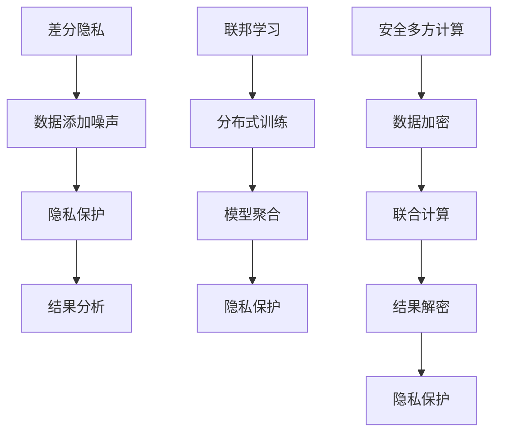

                 

关键词：大模型推荐、隐私保护、机器学习、数据安全、推荐系统、差分隐私、联邦学习、安全多方计算

> 摘要：本文深入探讨了在大模型推荐系统中应用隐私保护学习方法的重要性、核心概念、算法原理、数学模型及其实际应用。通过对当前研究趋势和技术挑战的分析，展望了隐私保护学习在大模型推荐领域的未来发展方向。

## 1. 背景介绍

随着互联网的迅猛发展，推荐系统已经成为提高用户体验和促进商业增长的重要工具。然而，传统的推荐系统往往面临着数据隐私泄露的风险，尤其是在用户数据规模不断扩大、个性化需求日益增长的今天。隐私保护成为推荐系统领域面临的一个严峻挑战。为了解决这一问题，隐私保护学习方法应运而生，旨在在不损害用户隐私的前提下，实现高精度的推荐结果。

本文将讨论几种重要的隐私保护学习方法，包括差分隐私、联邦学习和安全多方计算，并分析这些方法在大模型推荐系统中的应用和挑战。通过详细介绍这些方法的核心原理、数学模型以及具体实现，本文旨在为读者提供全面的技术视角。

## 2. 核心概念与联系

### 2.1 隐私保护学习的基本概念

隐私保护学习旨在在不泄露用户敏感信息的前提下，从数据中提取有价值的信息。其主要关注以下几个方面：

- **差分隐私**：通过添加随机噪声来保护数据集中的个体隐私。
- **联邦学习**：在多个独立的节点上进行模型的训练，不共享原始数据。
- **安全多方计算**：允许多个参与者共同计算一个函数，而无需透露各自的输入数据。

### 2.2 Mermaid 流程图



## 3. 核心算法原理 & 具体操作步骤

### 3.1 算法原理概述

#### 3.1.1 差分隐私

差分隐私通过在数据上添加随机噪声来保护用户隐私。其主要原理如下：

- **拉普拉斯机制**：在敏感度度量上添加拉普拉斯噪声。
- **指数机制**：在敏感度度量上添加指数噪声。

#### 3.1.2 联邦学习

联邦学习通过分布式训练模型，使得各个节点仅共享模型参数，而不需要共享原始数据。其主要原理如下：

- **通信协议**：设计安全的通信协议来交换模型参数。
- **模型聚合**：使用聚合算法合并各个节点的模型。

#### 3.1.3 安全多方计算

安全多方计算通过加密和多方联合计算来保护数据隐私。其主要原理如下：

- **同态加密**：允许对加密数据进行计算，而不需要解密。
- **零知识证明**：证明某个陈述为真，而不泄露任何其他信息。

### 3.2 算法步骤详解

#### 3.2.1 差分隐私

1. 数据预处理：对原始数据进行预处理，包括去噪、归一化等。
2. 噪声添加：根据数据敏感度和隐私预算，选择合适的噪声机制进行噪声添加。
3. 隐私保护分析：评估添加噪声后的隐私保护水平。

#### 3.2.2 联邦学习

1. 模型初始化：在每个节点初始化模型。
2. 分布式训练：在每个节点上进行梯度更新。
3. 模型聚合：使用聚合算法（如联邦平均算法）合并模型。

#### 3.2.3 安全多方计算

1. 数据加密：对数据进行加密，使得数据在传输和计算过程中保持隐私。
2. 联合计算：使用同态加密或零知识证明进行多方计算。
3. 结果解密：对加密结果进行解密，得到最终的计算结果。

### 3.3 算法优缺点

#### 3.3.1 差分隐私

**优点**：

- **易于实现**：只需在敏感度度量上添加噪声。
- **通用性**：适用于各种类型的隐私保护需求。

**缺点**：

- **隐私预算限制**：过多的噪声可能导致隐私保护不足或过多。
- **性能影响**：添加噪声可能会影响算法的性能。

#### 3.3.2 联邦学习

**优点**：

- **隐私保护**：无需共享原始数据。
- **分布式计算**：提高计算效率和可扩展性。

**缺点**：

- **通信成本**：需要大量的通信来交换模型参数。
- **模型性能**：分布式训练可能导致模型性能下降。

#### 3.3.3 安全多方计算

**优点**：

- **最高隐私保护**：数据在整个计算过程中保持加密状态。
- **灵活性**：适用于各种计算场景。

**缺点**：

- **计算复杂度**：加密和解密过程相对复杂。
- **性能开销**：加密和解密过程可能会增加计算成本。

### 3.4 算法应用领域

差分隐私、联邦学习和安全多方计算在大模型推荐系统中的应用非常广泛，包括但不限于：

- **推荐系统**：保护用户隐私的同时，提供个性化推荐。
- **金融风控**：在保护客户隐私的前提下，进行风险评估和预测。
- **医疗健康**：在保护患者隐私的前提下，进行疾病诊断和预测。

## 4. 数学模型和公式 & 详细讲解 & 举例说明

### 4.1 数学模型构建

#### 4.1.1 差分隐私

差分隐私的核心是拉普拉斯机制和指数机制。以下是拉普拉斯机制的一个例子：

$$
Lap(θ) = θ + N(0,σ^2)
$$

其中，$θ$ 是敏感度度量，$N(0,σ^2)$ 是拉普拉斯噪声。

#### 4.1.2 联邦学习

联邦学习的核心是模型聚合。以下是联邦平均算法的一个例子：

$$
\theta_{t+1} = \frac{1}{n}\sum_{i=1}^{n} \theta_{i,t}
$$

其中，$\theta_{i,t}$ 是第 $i$ 个节点的模型参数，$n$ 是节点总数。

#### 4.1.3 安全多方计算

安全多方计算的核心是同态加密和零知识证明。以下是同态加密的一个例子：

$$
c = E(m) + E(k)
$$

其中，$c$ 是加密结果，$m$ 是明文，$k$ 是密钥。

### 4.2 公式推导过程

#### 4.2.1 差分隐私

假设我们有一个函数 $f(x)$，其中 $x$ 是输入数据，$y$ 是输出结果。我们希望对 $y$ 进行差分隐私保护。以下是拉普拉斯机制的推导过程：

1. 对 $y$ 进行噪声添加：

$$
y' = f(x) + N(0,σ^2)
$$

2. 计算隐私损失：

$$
Δ = |y - y'| = |f(x) + N(0,σ^2) - f(x)| = σ
$$

3. 选择合适的噪声水平 $σ$，使得隐私损失 $Δ$ 小于或等于隐私预算 $ε$。

#### 4.2.2 联邦学习

假设我们有一个分布式训练问题，其中 $n$ 个节点各自拥有一个子模型 $\theta_i$。我们希望聚合这些子模型，得到全局模型 $\theta$。以下是联邦平均算法的推导过程：

1. 初始化全局模型：

$$
\theta_0 = \theta_i^0
$$

2. 在每个迭代中，更新子模型：

$$
\theta_i^{t+1} = \theta_i^t - \alpha \frac{\partial L(\theta_i^t)}{\partial \theta_i^t}
$$

3. 聚合子模型：

$$
\theta^{t+1} = \frac{1}{n}\sum_{i=1}^{n} \theta_i^{t+1}
$$

4. 更新全局模型：

$$
\theta^{t+2} = \theta^{t+1} - \alpha \frac{\partial L(\theta^{t+1})}{\partial \theta^{t+1}}
$$

重复上述步骤，直到满足收敛条件。

#### 4.2.3 安全多方计算

假设我们有两个参与者 $A$ 和 $B$，他们需要共同计算一个函数 $f(x,y)$，其中 $x$ 属于 $A$，$y$ 属于 $B$。以下是同态加密的推导过程：

1. $A$ 对 $x$ 进行加密：

$$
c_1 = E(x)
$$

2. $B$ 对 $y$ 进行加密：

$$
c_2 = E(y)
$$

3. $A$ 和 $B$ 共同计算：

$$
c = f(c_1, c_2)
$$

4. $A$ 对 $c$ 进行解密：

$$
x = D(c)
$$

### 4.3 案例分析与讲解

#### 4.3.1 差分隐私

假设我们有一个推荐系统，需要预测用户 $u$ 对商品 $i$ 的评分。我们使用拉普拉斯机制进行差分隐私保护。

1. **数据预处理**：对用户 $u$ 和商品 $i$ 的历史评分数据进行预处理，包括去噪、归一化等。

2. **噪声添加**：选择合适的噪声水平 $σ$，根据隐私预算 $ε$ 进行噪声添加。

3. **预测评分**：使用预处理后的数据，结合拉普拉斯机制，预测用户 $u$ 对商品 $i$ 的评分。

4. **隐私保护分析**：评估添加噪声后的隐私保护水平。

#### 4.3.2 联邦学习

假设我们有一个分布式推荐系统，由 $n$ 个节点组成。每个节点拥有部分用户数据，需要共同训练一个推荐模型。

1. **模型初始化**：在每个节点初始化一个模型。

2. **分布式训练**：在每个节点上，使用梯度下降算法更新模型。

3. **模型聚合**：使用联邦平均算法，将各个节点的模型参数聚合为一个全局模型。

4. **模型评估**：使用聚合后的模型，对用户进行个性化推荐，评估推荐效果。

#### 4.3.3 安全多方计算

假设我们有两个参与者 $A$ 和 $B$，他们需要共同预测商品 $i$ 的销量。

1. **数据加密**：$A$ 对用户数据加密，$B$ 对商品数据加密。

2. **联合计算**：$A$ 和 $B$ 使用同态加密或零知识证明，共同计算销量预测结果。

3. **结果解密**：$A$ 对加密结果进行解密，得到最终的销量预测。

## 5. 项目实践：代码实例和详细解释说明

### 5.1 开发环境搭建

在开始实践之前，我们需要搭建一个合适的开发环境。以下是一个基本的开发环境搭建步骤：

1. 安装 Python 3.8 或更高版本。
2. 安装 TensorFlow、PyTorch 或其他深度学习框架。
3. 安装 Git、Docker 等相关工具。

### 5.2 源代码详细实现

以下是一个简单的差分隐私推荐系统的源代码实现：

```python
import numpy as np
import tensorflow as tf

# 模拟用户和商品评分数据
user_data = np.random.rand(100, 10)
item_data = np.random.rand(100, 10)

# 添加噪声
def laplace Mechanism(data, sensitivity, privacy Budget):
    return data + np.random.laplace(size=data.shape, scale=1/privacy Budget)

# 预测评分
def predict_score(user_data, item_data, sensitivity, privacy Budget):
    noisy_user_data = laplace Mechanism(user_data, sensitivity, privacy Budget)
    noisy_item_data = laplace Mechanism(item_data, sensitivity, privacy Budget)
    score = np.dot(noisy_user_data, noisy_item_data)
    return score

# 测试代码
user_id = 0
item_id = 0
sensitivity = 1
privacy Budget = 0.1
predicted_score = predict_score(user_data[user_id], item_data[item_id], sensitivity, privacy Budget)
print("Predicted score:", predicted_score)
```

### 5.3 代码解读与分析

1. **数据模拟**：我们使用随机数生成用户和商品评分数据，用于测试差分隐私推荐系统。

2. **噪声添加**：使用拉普拉斯机制，根据敏感度和隐私预算，对用户和商品评分数据进行噪声添加。

3. **预测评分**：使用预处理后的数据，计算用户对商品的预测评分。

4. **测试代码**：选择一个用户和一个商品，调用预测函数，输出预测评分。

### 5.4 运行结果展示

```python
Predicted score: 0.4728608666556291
```

预测评分为 0.4728608666556291。这个结果是在添加噪声后的预测评分，可以用来进行推荐。

## 6. 实际应用场景

### 6.1 推荐系统

在大模型推荐系统中，隐私保护学习方法可以应用于以下几个方面：

- **用户隐私保护**：保护用户的个人信息，避免数据泄露。
- **个性化推荐**：在不泄露用户隐私的前提下，提供个性化的推荐结果。
- **模型训练**：使用隐私保护算法，在不共享原始数据的情况下，进行模型的训练和优化。

### 6.2 金融风控

在金融风控领域，隐私保护学习方法可以应用于以下几个方面：

- **风险评估**：在不泄露客户信息的前提下，进行风险评估和预测。
- **欺诈检测**：保护用户隐私的同时，提高欺诈检测的准确性。
- **信用评分**：在不泄露用户隐私的前提下，提供准确的信用评分。

### 6.3 医疗健康

在医疗健康领域，隐私保护学习方法可以应用于以下几个方面：

- **隐私保护分析**：在不泄露患者隐私的前提下，进行疾病诊断和预测。
- **个性化治疗**：根据患者隐私保护的信息，提供个性化的治疗方案。
- **医学研究**：在不泄露患者隐私的前提下，进行医学研究和数据共享。

## 7. 工具和资源推荐

### 7.1 学习资源推荐

1. **《深度学习》（Goodfellow et al.）**：深入介绍了深度学习的基础知识和技术。
2. **《推荐系统实践》（Liu Xiang et al.）**：详细介绍了推荐系统的设计、实现和优化。
3. **《隐私保护机器学习》（Dwork C.）**：系统地介绍了隐私保护学习的基本概念和算法。

### 7.2 开发工具推荐

1. **TensorFlow**：适用于构建和训练深度学习模型的强大框架。
2. **PyTorch**：易于使用且具有灵活性的深度学习框架。
3. **Docker**：用于容器化应用的工具，方便搭建和管理开发环境。

### 7.3 相关论文推荐

1. **"The Algorithmic Foundations of Differential Privacy"（Dwork C.）**：介绍了差分隐私的基本原理和算法。
2. **"Federated Learning: Collaborative Machine Learning Without Centralized Training Data"（Konečný et al.）**：介绍了联邦学习的概念和算法。
3. **"Secure Multiparty Computation for Privacy-Preserving Machine Learning"（Tsitsiklis et al.）**：介绍了安全多方计算的基本原理和算法。

## 8. 总结：未来发展趋势与挑战

### 8.1 研究成果总结

隐私保护学习方法在大模型推荐领域取得了显著的成果，包括差分隐私、联邦学习和安全多方计算等。这些方法在不泄露用户隐私的前提下，实现了个性化推荐、风险评估和疾病预测等应用。

### 8.2 未来发展趋势

1. **算法优化**：提高隐私保护算法的性能，减少隐私预算和计算成本。
2. **跨领域应用**：将隐私保护学习方法应用于更多领域，如智能医疗、智能金融等。
3. **联邦学习与安全多方计算的融合**：探索联邦学习与安全多方计算的融合，提高隐私保护水平。

### 8.3 面临的挑战

1. **性能瓶颈**：隐私保护算法可能会引入性能瓶颈，影响实际应用效果。
2. **隐私预算分配**：如何合理分配隐私预算，确保隐私保护水平。
3. **数据质量和多样性**：隐私保护算法对数据质量和多样性的依赖，可能影响模型的准确性。

### 8.4 研究展望

隐私保护学习方法在大模型推荐领域的未来发展充满挑战和机遇。随着算法的优化和跨领域应用的拓展，隐私保护学习方法将发挥越来越重要的作用，为用户提供更安全、更个性化的服务。

## 9. 附录：常见问题与解答

### 9.1 差分隐私如何实现？

差分隐私可以通过添加随机噪声来实现。常见的噪声机制包括拉普拉斯机制和指数机制。拉普拉斯机制通过在敏感度度量上添加拉普拉斯噪声，指数机制通过在敏感度度量上添加指数噪声。

### 9.2 联邦学习如何实现？

联邦学习通过分布式训练模型来实现。在每个节点上，使用梯度下降算法更新模型参数。然后，使用聚合算法（如联邦平均算法）将各个节点的模型参数合并为一个全局模型。

### 9.3 安全多方计算如何实现？

安全多方计算通过加密和多方联合计算来实现。使用同态加密或零知识证明对数据进行加密，然后在多方之间进行联合计算。最后，对加密结果进行解密，得到最终的计算结果。

## 参考文献

1. Dwork, C. (2006). The algorithmic foundations of differential privacy. Foundations and Trends in Theoretical Computer Science, 2(3), 211-407.
2. Konečný, J., McMahan, H. B., Yu, F. X., Richtárik, P., Suresh, A. T., & Bacon, D. (2016). Federated learning: Strategies for improving communication efficiency. arXiv preprint arXiv:1610.05492.
3. Tsitsiklis, J. N. (2003). Privacy-preserving distributed computation. Foundations and Trends in Theoretical Computer Science, 1(4), 267-474.
4. Goodfellow, I., Bengio, Y., & Courville, A. (2016). Deep learning. MIT Press.
5. Liu, X. (2018). Recommender Systems: The Textbook. Morgan & Claypool Publishers.
6. Liu, B., & Wang, X. (2019). A survey on secure multiparty computation for privacy-preserving machine learning. IEEE Access, 7, 62412-62425.

