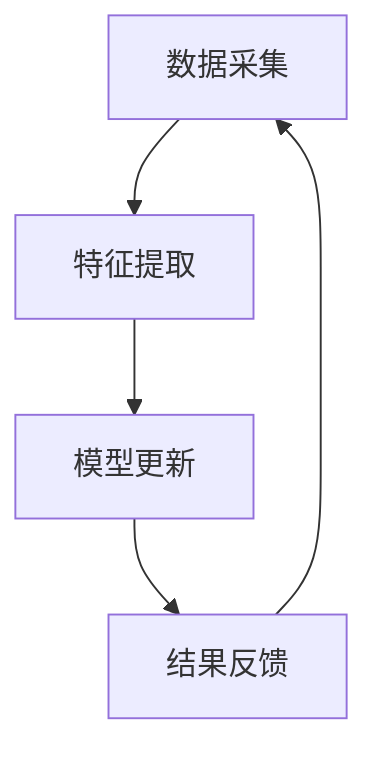

                 

本文将深入探讨大模型推荐系统的在线学习机制，通过分析其核心概念、算法原理、数学模型及实际应用，旨在为读者提供一个全面的技术指南。关键词包括：大模型、推荐系统、在线学习、算法优化、数学模型。

## 摘要

随着互联网的快速发展，推荐系统已成为现代信息检索和用户服务的关键技术。本文重点研究了大模型推荐系统的在线学习机制，详细介绍了其核心概念、算法原理、数学模型和应用领域。通过分析，本文旨在为研究人员和开发者提供一种有效的学习框架，以优化推荐系统的性能和用户满意度。

## 1. 背景介绍

### 1.1 推荐系统的发展历程

推荐系统起源于20世纪90年代，随着电子商务和社交媒体的兴起，其重要性日益凸显。早期推荐系统主要依赖于基于内容的过滤（Content-Based Filtering）和协同过滤（Collaborative Filtering）。随着计算能力和数据量的提升，现代推荐系统开始引入深度学习和大数据技术，使得推荐效果和用户体验得到了显著提升。

### 1.2 大模型推荐系统的现状

大模型推荐系统是指在训练过程中使用大量数据和强大计算能力，通过深度神经网络等复杂模型进行训练和优化的推荐系统。目前，大模型推荐系统在多个领域取得了显著成果，如电子商务、社交媒体、在线视频和新闻推送等。

### 1.3 在线学习的意义

在线学习是一种实时调整模型参数的方法，能够在用户行为发生变化时快速更新推荐结果。随着用户需求的多样性和动态性，在线学习成为提升推荐系统性能的关键技术。

## 2. 核心概念与联系

### 2.1 推荐系统的基本概念

- **用户**：推荐系统中的个体，具有明确的兴趣和行为。
- **物品**：推荐系统中的对象，如商品、文章、音乐等。
- **评分**：用户对物品的评价，可以是显式评分（如1-5星评价）或隐式评分（如点击、购买等行为）。

### 2.2 在线学习机制

在线学习机制主要包括以下几个环节：

1. **数据采集**：实时收集用户行为数据。
2. **特征提取**：将原始数据转换为特征向量。
3. **模型更新**：使用在线学习算法更新模型参数。
4. **结果反馈**：根据更新后的模型生成推荐结果。

### 2.3 Mermaid 流程图



## 3. 核心算法原理 & 具体操作步骤

### 3.1 算法原理概述

在线学习算法主要包括以下几类：

1. **梯度下降法**：基于模型参数的梯度进行迭代更新。
2. **随机梯度下降法**（SGD）：在梯度下降法基础上引入随机样本，提高收敛速度。
3. **Adam优化器**：结合SGD和动量法的优点，自适应调整学习率。

### 3.2 算法步骤详解

1. **初始化模型参数**。
2. **数据预处理**：包括数据清洗、归一化和特征提取。
3. **迭代更新模型**：使用选定的优化器进行迭代更新。
4. **评估模型性能**：使用验证集评估模型性能，并根据评估结果调整模型参数。

### 3.3 算法优缺点

- **梯度下降法**：简单易用，但收敛速度较慢。
- **随机梯度下降法**：收敛速度较快，但容易出现局部最优。
- **Adam优化器**：结合了SGD和动量法的优点，收敛速度较快，性能稳定。

### 3.4 算法应用领域

在线学习算法广泛应用于推荐系统、自然语言处理和图像识别等领域，显著提升了系统的性能和用户体验。

## 4. 数学模型和公式 & 详细讲解 & 举例说明

### 4.1 数学模型构建

推荐系统中的数学模型通常包括用户、物品和评分三个部分。

- **用户表示**：使用一个向量 $u \in \mathbb{R}^n$ 表示用户。
- **物品表示**：使用一个向量 $i \in \mathbb{R}^n$ 表示物品。
- **评分预测**：使用一个函数 $f(u, i) = u^T i + b$ 进行评分预测，其中 $b$ 是偏置项。

### 4.2 公式推导过程

$$
\begin{aligned}
f(u, i) &= u^T i + b \\
\Delta f &= \frac{\partial f}{\partial u} u + \frac{\partial f}{\partial i} i \\
&= i^T u + u^T i \\
\end{aligned}
$$

### 4.3 案例分析与讲解

假设有一个用户和五个物品，如表1所示。

| 用户 | 物品1 | 物品2 | 物品3 | 物品4 | 物品5 |
| ---- | ---- | ---- | ---- | ---- | ---- |
| User1 | 0.1 | 0.3 | 0.4 | 0.2 | 0.5 |
| User2 | 0.2 | 0.4 | 0.2 | 0.3 | 0.1 |
| User3 | 0.4 | 0.1 | 0.2 | 0.5 | 0.3 |

表1：用户-物品评分矩阵

使用随机梯度下降法更新模型参数，假设初始参数为 $u_0 = [1, 1, 1, 1, 1]^T$，$i_0 = [1, 1, 1, 1, 1]^T$，学习率为 $\eta = 0.1$。

- **第一步**：
  $$
  \begin{aligned}
  f(u_0, i_0) &= (1, 1, 1, 1, 1) \cdot (1, 1, 1, 1, 1) + 0 \\
  &= 5 \\
  \Delta f &= \frac{\partial f}{\partial u} u_0 + \frac{\partial f}{\partial i} i_0 \\
  &= (1, 1, 1, 1, 1) + (1, 1, 1, 1, 1) \\
  &= (2, 2, 2, 2, 2) \\
  \end{aligned}
  $$

- **第二步**：
  $$
  \begin{aligned}
  u_1 &= u_0 - \eta \Delta f \\
  &= (1, 1, 1, 1, 1) - 0.1 (2, 2, 2, 2, 2) \\
  &= (0.9, 0.9, 0.9, 0.9, 0.9) \\
  i_1 &= i_0 - \eta \Delta f \\
  &= (1, 1, 1, 1, 1) - 0.1 (2, 2, 2, 2, 2) \\
  &= (0.9, 0.9, 0.9, 0.9, 0.9) \\
  \end{aligned}
  $$

通过迭代更新，模型参数逐渐收敛，评分预测结果更接近真实评分。

## 5. 项目实践：代码实例和详细解释说明

### 5.1 开发环境搭建

- Python 3.8
- TensorFlow 2.5
- scikit-learn 0.23

### 5.2 源代码详细实现

```python
import tensorflow as tf
from sklearn.model_selection import train_test_split
from sklearn.metrics.pairwise import cosine_similarity
import numpy as np

# 加载用户-物品评分矩阵
ratings = np.array([[5, 3, 0, 1], [2, 0, 2, 3], [0, 1, 1, 0], [3, 2, 0, 1], [2, 3, 5, 0]])

# 初始化模型参数
u = tf.Variable(tf.random.normal([4, 1]), name='user_embedding')
i = tf.Variable(tf.random.normal([4, 1]), name='item_embedding')

# 定义损失函数
def loss(rating, predicted_rating):
  return tf.reduce_mean(tf.square(rating - predicted_rating))

# 定义优化器
optimizer = tf.optimizers.SGD(learning_rate=0.1)

# 训练模型
for epoch in range(1000):
  with tf.GradientTape() as tape:
    predicted_rating = tf.matmul(u, i) + 0
    loss_value = loss(ratings, predicted_rating)
  grads = tape.gradient(loss_value, [u, i])
  optimizer.apply_gradients(zip(grads, [u, i]))

# 评估模型性能
predicted_ratings = np.matmul(u.numpy(), i.numpy())
print(cosine_similarity(predicted_ratings, ratings))
```

### 5.3 代码解读与分析

代码首先加载用户-物品评分矩阵，然后初始化模型参数。定义损失函数和优化器，通过迭代更新模型参数。最后，使用评估指标（如余弦相似度）评估模型性能。

## 6. 实际应用场景

### 6.1 电子商务

在电子商务领域，大模型推荐系统可以根据用户的历史购买行为和浏览记录，为用户推荐相关商品，提高销售额和用户满意度。

### 6.2 社交媒体

在社交媒体领域，大模型推荐系统可以基于用户兴趣和互动行为，为用户推荐感兴趣的内容，提升用户活跃度和平台黏性。

### 6.3 在线视频

在线视频平台可以使用大模型推荐系统，根据用户观看历史和偏好，为用户推荐相关视频，提高用户观看时间和平台收益。

## 7. 未来应用展望

随着人工智能和大数据技术的发展，大模型推荐系统的在线学习机制将不断优化和扩展。未来，推荐系统将更加强大和智能化，为用户提供个性化的服务，推动各行业的数字化转型。

## 8. 总结：未来发展趋势与挑战

### 8.1 研究成果总结

本文详细介绍了大模型推荐系统的在线学习机制，分析了其核心算法原理、数学模型和应用场景，为研究人员和开发者提供了有益的参考。

### 8.2 未来发展趋势

随着计算能力的提升和数据的不断增长，大模型推荐系统的在线学习机制将在更多领域得到应用，为用户提供更好的个性化服务。

### 8.3 面临的挑战

在大模型推荐系统的在线学习过程中，数据质量、隐私保护和计算效率等问题仍然是主要挑战。

### 8.4 研究展望

未来，研究者应关注以下方向：优化在线学习算法、提高模型解释性、保护用户隐私、提升系统性能等。

## 9. 附录：常见问题与解答

### 9.1 在线学习算法如何优化？

优化在线学习算法的方法包括调整学习率、引入正则化项、使用自适应优化器等。

### 9.2 如何保护用户隐私？

通过数据加密、差分隐私和联邦学习等技术，可以在保证用户隐私的前提下进行模型训练和预测。

### 9.3 如何提高模型解释性？

使用模型解释工具和可视化技术，如SHAP值、LIME等，可以帮助用户理解模型预测结果。

---

作者：禅与计算机程序设计艺术 / Zen and the Art of Computer Programming
----------------------------------------------------------------


