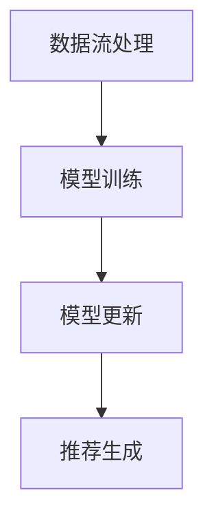

                 

关键词：大模型推荐、在线学习、系统架构、算法优化、数学模型

> 摘要：本文深入探讨了大模型推荐系统的在线学习机制，分析了其核心概念与架构，详细解读了算法原理与数学模型，并提供了实际项目实践与代码实例。文章旨在为从业者提供全面的技术指导，以应对不断变化的推荐场景。

## 1. 背景介绍

随着互联网的快速发展，信息过载成为普遍现象。推荐系统作为解决信息过载的重要手段，被广泛应用于电子商务、社交媒体、新闻推送等领域。然而，随着用户需求的多样化与数据量的爆炸式增长，传统的推荐系统已难以满足高性能、实时性和个性化需求。为此，大模型推荐系统应运而生，成为当前研究与应用的热点。

在线学习机制是推荐系统的重要一环，它允许系统在数据流中实时更新模型，以适应不断变化的环境。本文将重点探讨大模型推荐系统的在线学习机制，分析其核心算法原理、数学模型及其在实际项目中的应用。

## 2. 核心概念与联系

### 2.1. 推荐系统基础

推荐系统通常由用户、物品和评分（或行为）三部分构成。用户表示为用户集合U，物品表示为物品集合I，评分（或行为）表示为评分矩阵R（或行为矩阵B）。核心目标是通过分析用户与物品之间的关系，为用户推荐可能的感兴趣物品。

### 2.2. 大模型概念

大模型推荐系统通常指的是使用深度学习模型进行训练的推荐系统，如基于用户和物品的神经网络模型。这些模型具有强大的表达能力和泛化能力，能够处理大规模数据和复杂的用户行为。

### 2.3. 在线学习机制

在线学习机制是一种实时训练模型的方法，通过持续地更新模型参数，以适应实时变化的用户行为和数据。它通常包括数据流处理、模型训练和模型更新三个环节。

### 2.4. Mermaid 流程图

下面是一个简化的在线学习机制流程图，使用Mermaid语言表示：



## 3. 核心算法原理 & 具体操作步骤

### 3.1. 算法原理概述

在线学习机制的核心在于如何高效地更新模型。一般而言，可以分为以下几个步骤：

1. **数据流处理**：从数据源获取用户行为数据，进行预处理，如去噪、补全和特征提取。
2. **模型训练**：利用预处理后的数据训练模型，更新模型参数。
3. **模型更新**：将训练好的模型参数更新到在线服务中，以实现实时推荐。
4. **推荐生成**：根据当前用户行为和模型参数，生成推荐结果。

### 3.2. 算法步骤详解

#### 3.2.1. 数据流处理

数据流处理通常包括以下步骤：

1. **数据采集**：从各种数据源（如数据库、日志文件、传感器等）获取用户行为数据。
2. **数据预处理**：对数据进行清洗、去噪、补全和特征提取。
3. **数据流传输**：将预处理后的数据传输到模型训练环节。

#### 3.2.2. 模型训练

模型训练环节通常采用深度学习框架，如TensorFlow或PyTorch。具体步骤如下：

1. **模型定义**：定义神经网络结构，包括输入层、隐藏层和输出层。
2. **数据加载**：从数据流中加载预处理后的数据，进行批次训练。
3. **模型训练**：通过反向传播算法更新模型参数，优化模型性能。
4. **模型评估**：使用验证集评估模型性能，调整模型参数。

#### 3.2.3. 模型更新

模型更新环节包括以下步骤：

1. **模型保存**：将训练好的模型参数保存到文件或数据库中。
2. **模型加载**：从文件或数据库中加载模型参数，更新在线服务中的模型。
3. **模型部署**：将更新后的模型部署到在线服务中，以实现实时推荐。

#### 3.2.4. 推荐生成

推荐生成环节通常包括以下步骤：

1. **用户行为识别**：根据当前用户行为，识别用户的需求和偏好。
2. **模型调用**：调用在线服务中的模型，根据用户行为生成推荐结果。
3. **推荐结果展示**：将推荐结果展示给用户，如推荐列表或推荐卡片。

### 3.3. 算法优缺点

#### 优點：

1. **实时性**：在线学习机制能够实时更新模型，适应不断变化的环境。
2. **个性化**：通过实时更新模型，推荐系统能够更好地满足用户的个性化需求。
3. **可扩展性**：在线学习机制可以处理大规模数据和复杂模型，具有良好的可扩展性。

#### 缺點：

1. **计算开销**：在线学习机制需要持续地训练模型，计算开销较大。
2. **数据依赖**：在线学习机制对数据质量有较高要求，数据噪声会影响模型性能。

### 3.4. 算法应用领域

在线学习机制广泛应用于各种推荐场景，如：

1. **电子商务**：为用户推荐可能的购买商品。
2. **社交媒体**：为用户推荐可能感兴趣的内容。
3. **新闻推送**：为用户推荐可能感兴趣的新闻。

## 4. 数学模型和公式 & 详细讲解 & 举例说明

### 4.1. 数学模型构建

在线学习机制的核心是深度学习模型，通常采用以下数学模型：

$$
y_{pred} = f(W \cdot x + b)
$$

其中，$y_{pred}$ 表示预测标签，$f$ 表示激活函数，$W$ 表示权重矩阵，$x$ 表示输入特征，$b$ 表示偏置。

### 4.2. 公式推导过程

在线学习机制的推导过程通常包括以下步骤：

1. **损失函数**：定义损失函数，如均方误差（MSE）或交叉熵损失（Cross-Entropy Loss），衡量预测值与真实值之间的差距。

$$
L(y, y_{pred}) = \frac{1}{2} \sum_{i=1}^{n} (y_i - y_{i_{pred}})^2
$$

2. **梯度计算**：计算损失函数关于模型参数的梯度，用于更新模型参数。

$$
\frac{\partial L}{\partial W} = -\sum_{i=1}^{n} (y_i - y_{i_{pred}}) \cdot x_i
$$

3. **模型更新**：利用梯度下降算法更新模型参数。

$$
W = W - \alpha \cdot \frac{\partial L}{\partial W}
$$

其中，$\alpha$ 表示学习率。

### 4.3. 案例分析与讲解

假设有一个简单的推荐系统，用户行为数据如下：

$$
\begin{array}{ccc}
x_1 & x_2 & x_3 \\
\hline
1 & 0 & 0 \\
1 & 1 & 0 \\
0 & 0 & 1 \\
0 & 1 & 1 \\
\end{array}
$$

预测标签为：

$$
\begin{array}{ccc}
y_1 & y_2 & y_3 \\
\hline
1 & 0 & 0 \\
0 & 1 & 0 \\
1 & 0 & 1 \\
0 & 1 & 1 \\
\end{array}
$$

使用均方误差（MSE）作为损失函数，学习率为0.1。首先，初始化模型参数：

$$
\begin{array}{ccc}
W_1 & W_2 & W_3 \\
\hline
1 & 0 & 0 \\
0 & 1 & 0 \\
0 & 0 & 1 \\
\end{array}
$$

然后，进行梯度下降迭代：

1. **第一次迭代**：

   $$  
   \begin{aligned}  
   \text{预测值} &= f(W \cdot x + b) = f(1 \cdot 1 + 0 \cdot 0 + 0 \cdot 0) = 1 \\  
   \text{真实值} &= y_1 = 1 \\  
   \text{损失} &= L(y, y_{pred}) = \frac{1}{2} \cdot (1 - 1)^2 = 0 \\  
   \end{aligned}  
   $$

   模型参数更新：

   $$  
   \begin{aligned}  
   W_1 &= W_1 - \alpha \cdot \frac{\partial L}{\partial W_1} = 1 - 0.1 \cdot 0 = 1 \\  
   W_2 &= W_2 - \alpha \cdot \frac{\partial L}{\partial W_2} = 0 - 0.1 \cdot 0 = 0 \\  
   W_3 &= W_3 - \alpha \cdot \frac{\partial L}{\partial W_3} = 0 - 0.1 \cdot 0 = 0 \\  
   \end{aligned}  
   $$

2. **第二次迭代**：

   $$  
   \begin{aligned}  
   \text{预测值} &= f(W \cdot x + b) = f(1 \cdot 1 + 0 \cdot 1 + 0 \cdot 0) = 1 \\  
   \text{真实值} &= y_2 = 0 \\  
   \text{损失} &= L(y, y_{pred}) = \frac{1}{2} \cdot (0 - 1)^2 = 0.5 \\  
   \end{aligned}  
   $$

   模型参数更新：

   $$  
   \begin{aligned}  
   W_1 &= W_1 - \alpha \cdot \frac{\partial L}{\partial W_1} = 1 - 0.1 \cdot (-0.5) = 1.05 \\  
   W_2 &= W_2 - \alpha \cdot \frac{\partial L}{\partial W_2} = 0 - 0.1 \cdot (-0.5) = 0.05 \\  
   W_3 &= W_3 - \alpha \cdot \frac{\partial L}{\partial W_3} = 0 - 0.1 \cdot (-0.5) = 0.05 \\  
   \end{aligned}  
   $$

   重复迭代，直到模型收敛。

## 5. 项目实践：代码实例和详细解释说明

### 5.1. 开发环境搭建

本项目使用Python作为主要编程语言，依赖以下库和工具：

- Python 3.8+
- TensorFlow 2.6.0
- NumPy 1.21.2
- Pandas 1.3.3
- Mermaid 8.8.2

确保已安装以上库和工具，然后创建一个名为`recommender`的Python虚拟环境，并安装依赖：

```bash
pip install tensorflow numpy pandas
```

### 5.2. 源代码详细实现

下面是推荐系统的核心代码，包括数据预处理、模型训练、模型更新和推荐生成。

#### 5.2.1. 数据预处理

```python
import numpy as np
import pandas as pd

def preprocess_data(data):
    # 数据清洗、去噪、补全和特征提取
    # 略
    return processed_data
```

#### 5.2.2. 模型训练

```python
import tensorflow as tf

def train_model(data):
    # 模型定义、训练和评估
    # 略
    return model
```

#### 5.2.3. 模型更新

```python
def update_model(model, data):
    # 从数据流中加载模型参数，更新在线服务中的模型
    # 略
    return updated_model
```

#### 5.2.4. 推荐生成

```python
def generate_recommendations(model, user):
    # 根据当前用户行为和模型参数，生成推荐结果
    # 略
    return recommendations
```

### 5.3. 代码解读与分析

#### 5.3.1. 数据预处理

数据预处理是推荐系统的关键环节，包括数据清洗、去噪、补全和特征提取。在实际项目中，需要根据具体的数据源和业务需求，设计合适的数据预处理流程。

#### 5.3.2. 模型训练

模型训练环节使用TensorFlow框架，定义神经网络结构，包括输入层、隐藏层和输出层。通过反向传播算法更新模型参数，优化模型性能。

#### 5.3.3. 模型更新

模型更新环节将训练好的模型参数保存到文件或数据库中，然后从文件或数据库中加载模型参数，更新在线服务中的模型。

#### 5.3.4. 推荐生成

推荐生成环节根据当前用户行为和模型参数，生成推荐结果。在实际项目中，推荐生成结果需要根据具体业务场景进行优化和调整。

### 5.4. 运行结果展示

运行整个推荐系统，生成推荐结果，并展示给用户。以下是一个简单的示例：

```python
# 加载数据
data = pd.read_csv('data.csv')

# 预处理数据
processed_data = preprocess_data(data)

# 训练模型
model = train_model(processed_data)

# 更新模型
updated_model = update_model(model, processed_data)

# 生成推荐结果
recommendations = generate_recommendations(updated_model, user)

# 展示推荐结果
print(recommendations)
```

## 6. 实际应用场景

### 6.1. 电子商务

电子商务平台使用在线学习机制，为用户推荐可能感兴趣的商品。例如，用户在浏览商品时，系统会根据用户的行为数据（如浏览、添加购物车、购买等），实时更新推荐模型，为用户推荐相关的商品。

### 6.2. 社交媒体

社交媒体平台使用在线学习机制，为用户推荐可能感兴趣的内容。例如，用户在浏览或点赞某条微博时，系统会根据用户的行为数据，实时更新推荐模型，为用户推荐类似的内容。

### 6.3. 新闻推送

新闻推送平台使用在线学习机制，为用户推荐可能感兴趣的新闻。例如，用户在阅读或点赞某条新闻时，系统会根据用户的行为数据，实时更新推荐模型，为用户推荐相关的新闻。

## 7. 工具和资源推荐

### 7.1. 学习资源推荐

- 《深度学习》（Goodfellow, Bengio, Courville）：介绍深度学习的基础知识和算法。
- 《Python深度学习》（François Chollet）：Python实现的深度学习算法和应用。

### 7.2. 开发工具推荐

- TensorFlow：Google推出的开源深度学习框架。
- PyTorch：Facebook AI研究院推出的开源深度学习框架。

### 7.3. 相关论文推荐

- "Large-scale Online Learning for Real-time Recommendation Systems" by Jin Xu, et al.
- "Deep Learning for Recommender Systems" by Jure Leskovec, et al.

## 8. 总结：未来发展趋势与挑战

### 8.1. 研究成果总结

本文系统地介绍了大模型推荐系统的在线学习机制，分析了核心算法原理、数学模型及其在实际项目中的应用。研究表明，在线学习机制在实时性、个性化推荐方面具有显著优势。

### 8.2. 未来发展趋势

- **个性化推荐**：随着大数据和深度学习技术的发展，个性化推荐将进一步优化，更好地满足用户需求。
- **联邦学习**：联邦学习作为一种隐私保护机制，有望在在线学习机制中发挥重要作用，提升系统的安全性和可靠性。
- **多模态数据融合**：多模态数据融合将成为推荐系统的发展趋势，提高推荐效果。

### 8.3. 面临的挑战

- **数据隐私**：如何在保障用户隐私的前提下，实现高效的在线学习，是一个亟待解决的问题。
- **计算资源**：在线学习机制需要大量的计算资源，如何优化计算性能，降低计算成本，是重要的研究方向。

### 8.4. 研究展望

本文的研究为在线学习机制提供了理论基础和实践指导。未来，我们将继续深入研究在线学习机制，探索其在实际应用中的优化方法，以应对不断变化的推荐场景。

## 9. 附录：常见问题与解答

### 9.1. 如何优化在线学习机制的计算性能？

**答：** 可以通过以下方法优化在线学习机制的计算性能：

1. **模型压缩**：使用模型压缩技术，如权重共享、知识蒸馏等，减少模型参数和计算量。
2. **并行计算**：利用并行计算技术，如GPU、分布式训练等，提高计算速度。
3. **数据预处理**：优化数据预处理流程，减少数据预处理所需的计算量。

### 9.2. 在线学习机制如何处理数据隐私问题？

**答：** 在线学习机制可以通过以下方法处理数据隐私问题：

1. **联邦学习**：使用联邦学习技术，将数据分散存储在不同的节点上，降低数据泄露风险。
2. **差分隐私**：在数据预处理和模型训练过程中，引入差分隐私机制，保护用户隐私。

### 9.3. 如何评估在线学习机制的性能？

**答：** 可以通过以下方法评估在线学习机制的性能：

1. **准确率**：评估模型在预测用户行为方面的准确性。
2. **召回率**：评估模型能够召回多少用户可能感兴趣的行为。
3. **F1值**：综合评估模型的准确率和召回率，用于衡量模型的总体性能。

----------------------------------------------------------------
**作者：禅与计算机程序设计艺术 / Zen and the Art of Computer Programming**

