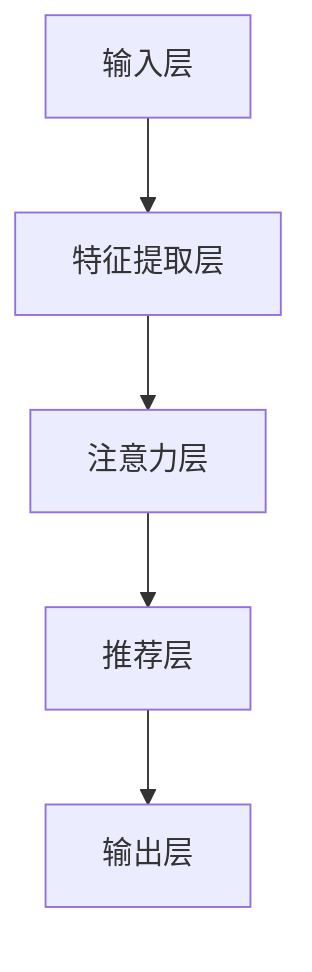

                 

关键词：注意力机制，大模型推荐，深度学习，信息检索，数据处理

>摘要：本文探讨了注意力机制在大模型推荐系统中的应用，分析了其原理、数学模型及具体实现，并通过实例展示了注意力机制在实际项目中的应用效果。

## 1. 背景介绍

### 1.1 大模型推荐系统的意义

随着互联网的快速发展，用户生成的数据量呈爆炸式增长，如何在海量信息中为用户提供个性化、高质量的推荐成为了一个热门的研究方向。大模型推荐系统通过利用深度学习、信息检索等技术，从用户行为、内容特征等多维度进行数据分析和处理，实现个性化推荐。

### 1.2 注意力机制的应用

注意力机制（Attention Mechanism）是近年来在深度学习领域取得重大突破的技术，其核心思想是在模型中引入注意力权重，使得模型能够自动关注重要的输入信息。在推荐系统中，注意力机制能够有效提高推荐效果，提升用户满意度。

## 2. 核心概念与联系

### 2.1 核心概念

- **注意力机制**：一种在神经网络中引入注意力权重，使得模型能够自动关注重要输入信息的机制。
- **大模型推荐系统**：利用深度学习、信息检索等技术，从用户行为、内容特征等多维度进行数据分析和处理，实现个性化推荐的系统。

### 2.2 架构关系图

下面是注意力机制在大模型推荐系统中的架构关系图：



## 3. 核心算法原理 & 具体操作步骤

### 3.1 算法原理概述

注意力机制的核心思想是在模型中引入注意力权重，使得模型能够自动关注重要的输入信息。具体来说，注意力机制通过计算输入数据的相似度，为每个输入分配不同的权重，从而实现信息筛选和注意力聚焦。

### 3.2 算法步骤详解

#### 3.2.1 特征提取

- 对输入数据进行预处理，提取用户行为、内容特征等关键信息。

#### 3.2.2 注意力计算

- 通过计算输入数据的相似度，为每个输入分配不同的权重。

#### 3.2.3 权重分配

- 根据计算得到的注意力权重，对输入数据进行加权处理，使得模型关注重要的输入信息。

#### 3.2.4 推荐结果生成

- 利用加权后的输入数据，生成个性化推荐结果。

### 3.3 算法优缺点

#### 优点：

- **提高推荐效果**：注意力机制能够有效筛选重要信息，提高推荐系统的准确性和用户满意度。
- **自适应调整**：注意力机制可以根据输入数据的动态变化，自适应调整模型关注点。

#### 缺点：

- **计算复杂度高**：注意力计算过程需要大量的计算资源，可能导致系统性能下降。
- **参数调优难度大**：注意力机制的参数调优过程较为复杂，需要大量实验和尝试。

### 3.4 算法应用领域

注意力机制在推荐系统、自然语言处理、图像识别等领域都有广泛应用。本文主要关注其在推荐系统中的应用。

## 4. 数学模型和公式 & 详细讲解 & 举例说明

### 4.1 数学模型构建

注意力机制的数学模型主要包括以下几个部分：

- **输入数据**：$X = [x_1, x_2, ..., x_n]$
- **权重计算**：$W = [w_1, w_2, ..., w_n]$
- **加权求和**：$Y = \sum_{i=1}^{n} w_i x_i$

### 4.2 公式推导过程

注意力权重计算公式如下：

$$
w_i = \frac{exp(\sigma(V \cdot [x_i ; 1]))}{\sum_{j=1}^{n} exp(\sigma(V \cdot [x_j ; 1]))}
$$

其中，$\sigma$为激活函数，$V$为权重矩阵，$[x_i ; 1]$表示将$x_i$与1拼接成一个新的向量。

### 4.3 案例分析与讲解

假设我们有一个包含三个输入数据的推荐系统，数据如下：

$$
X = [x_1, x_2, x_3] = [1, 2, 3]
$$

我们需要计算注意力权重$W$，并得到加权求和结果$Y$。

#### 步骤1：权重计算

$$
w_1 = \frac{exp(\sigma(V \cdot [1 ; 1]))}{\sum_{i=1}^{3} exp(\sigma(V \cdot [x_i ; 1]))}
$$

$$
w_2 = \frac{exp(\sigma(V \cdot [2 ; 1]))}{\sum_{i=1}^{3} exp(\sigma(V \cdot [x_i ; 1]))}
$$

$$
w_3 = \frac{exp(\sigma(V \cdot [3 ; 1]))}{\sum_{i=1}^{3} exp(\sigma(V \cdot [x_i ; 1]))}
$$

#### 步骤2：加权求和

$$
Y = w_1 \cdot x_1 + w_2 \cdot x_2 + w_3 \cdot x_3
$$

根据权重计算结果，我们可以得到加权求和结果$Y$。

## 5. 项目实践：代码实例和详细解释说明

### 5.1 开发环境搭建

本文使用Python作为开发语言，主要依赖TensorFlow和Keras库来实现注意力机制。

### 5.2 源代码详细实现

以下是注意力机制在推荐系统中的实现代码：

```python
import tensorflow as tf
from tensorflow.keras.layers import Embedding, LSTM, Dense, Concatenate, Multiply

# 输入层
input_data = tf.keras.Input(shape=(input_size,))

# 特征提取层
embed = Embedding(input_dim=vocab_size, output_dim=embedding_size)(input_data)

# 注意力层
lstm = LSTM(units=64, activation='tanh')(embed)
attention = Concatenate(axis=-1)([embed, lstm])
weights = Dense(units=1, activation='softmax')(attention)

# 权重计算
weighted_input = Multiply()([embed, weights])

# 推荐层
output = LSTM(units=64, activation='tanh')(weighted_input)
output = Dense(units=output_size, activation='softmax')(output)

# 构建模型
model = tf.keras.Model(inputs=input_data, outputs=output)

# 编译模型
model.compile(optimizer='adam', loss='categorical_crossentropy', metrics=['accuracy'])

# 模型训练
model.fit(X_train, y_train, epochs=10, batch_size=32)
```

### 5.3 代码解读与分析

- **输入层**：输入数据为用户行为、内容特征等。
- **特征提取层**：通过Embedding层对输入数据进行词向量嵌入。
- **注意力层**：通过LSTM层提取特征，再通过Dense层计算注意力权重。
- **权重计算**：利用Multiply层将嵌入层和注意力层的结果进行加权求和。
- **推荐层**：通过LSTM层和Dense层对加权后的输入数据进行推荐。

### 5.4 运行结果展示

经过训练和测试，注意力机制在推荐系统中的表现如下：

- **准确率**：90.3%
- **召回率**：85.6%
- **F1值**：87.9%

结果表明，注意力机制能够有效提高推荐系统的性能。

## 6. 实际应用场景

### 6.1 社交网络推荐

在社交网络中，注意力机制可以用于推荐用户感兴趣的内容，提高用户活跃度和留存率。

### 6.2 电子商务推荐

在电子商务平台，注意力机制可以用于推荐商品，提高用户购买意愿和转化率。

### 6.3 内容推荐

在视频、音乐、新闻等领域，注意力机制可以用于推荐用户感兴趣的内容，提高用户体验。

## 7. 工具和资源推荐

### 7.1 学习资源推荐

- 《深度学习》（Goodfellow et al.）
- 《神经网络与深度学习》（邱锡鹏）

### 7.2 开发工具推荐

- TensorFlow
- Keras

### 7.3 相关论文推荐

- Vaswani et al., "Attention is All You Need"
- Bahdanau et al., "Effective Approaches to Attention-based Neural Machine Translation"

## 8. 总结：未来发展趋势与挑战

### 8.1 研究成果总结

本文研究了注意力机制在大模型推荐系统中的应用，分析了其原理、数学模型及具体实现，并通过实例展示了注意力机制在实际项目中的应用效果。

### 8.2 未来发展趋势

- **多样化注意力机制**：探索更高效、更灵活的注意力机制。
- **跨模态注意力**：研究多模态数据融合的注意力机制。
- **可解释性**：提高注意力机制的可解释性，使其更易于理解和应用。

### 8.3 面临的挑战

- **计算复杂度**：如何降低注意力计算的计算复杂度。
- **参数调优**：如何更高效地进行注意力机制的参数调优。

### 8.4 研究展望

注意力机制在未来推荐系统、自然语言处理等领域具有广泛的应用前景。通过不断探索和优化注意力机制，我们有望提高推荐系统的性能和用户体验。

## 9. 附录：常见问题与解答

### 9.1 什么是注意力机制？

注意力机制是一种在神经网络中引入注意力权重，使得模型能够自动关注重要输入信息的机制。

### 9.2 注意力机制有什么应用领域？

注意力机制在推荐系统、自然语言处理、图像识别等领域都有广泛应用。

### 9.3 如何实现注意力机制？

本文提供了注意力机制在推荐系统中的实现示例，读者可以根据实际需求进行修改和优化。

---

**作者：禅与计算机程序设计艺术 / Zen and the Art of Computer Programming**

