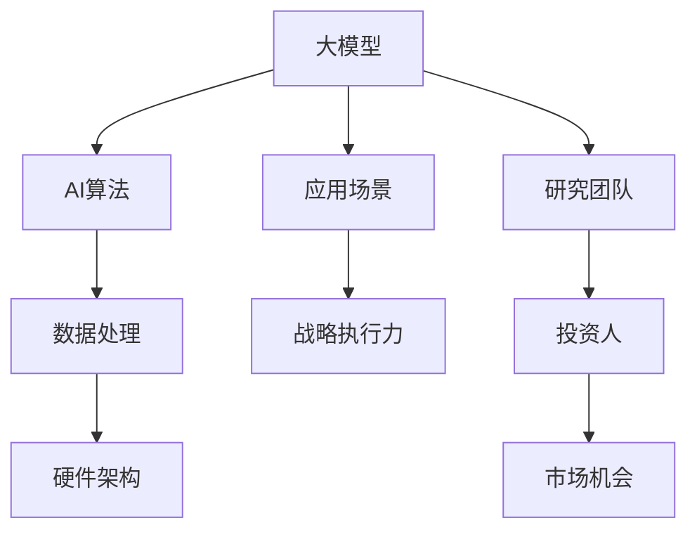

                 

关键词：贾扬清、大模型、Lepton AI、战略执行力、人工智能

摘要：随着人工智能技术的不断发展，大模型的应用逐渐成为行业的热点。本文将对Lepton AI的创始人兼CEO贾扬清进行深入访谈，探讨大模型时代的发展趋势、战略执行力的关键因素以及Lepton AI在其中的先锋作用。

## 1. 背景介绍

近年来，人工智能（AI）领域经历了一场前所未有的变革，大模型成为驱动创新的重要力量。大模型，如GPT-3、BERT等，凭借其强大的处理能力和广泛的应用场景，吸引了全球科技公司和研究机构的广泛关注。Lepton AI作为这一领域的重要参与者，其创始人兼CEO贾扬清（Yangqing Jia）在人工智能领域拥有丰富的经验和深厚的学术背景。本篇文章将围绕贾扬清的视角，探讨大模型时代的战略执行力。

### 贾扬清简介

贾扬清，Lepton AI的创始人兼CEO，同时也是斯坦福大学计算机科学博士，曾在Google Brain和Facebook AI Research担任要职。贾扬清在大规模机器学习、深度学习等领域有着深入的研究，并发表了多篇顶级论文，是人工智能领域的知名专家。他的创业公司Lepton AI专注于大模型的研究和应用，致力于推动人工智能技术的商业化落地。

## 2. 核心概念与联系

在探讨Lepton AI的战略执行力之前，我们需要了解一些核心概念和其相互之间的关系。以下是一个简单的Mermaid流程图，描述了大模型、AI算法、数据处理和硬件架构等关键元素之间的联系。



### 2.1 大模型

大模型是指具有数百万至数十亿参数的深度神经网络模型。这些模型在训练过程中需要大量的数据和计算资源，但它们在处理复杂任务时表现出色。大模型的崛起标志着人工智能技术进入了一个新的阶段。

### 2.2 AI算法

AI算法是构建大模型的基础。这些算法包括神经网络架构设计、优化技术、训练策略等。它们决定了大模型的学习能力和效果。

### 2.3 数据处理

数据处理是构建和训练大模型的关键环节。高质量的数据集是保证模型性能的基础，而高效的数据处理流程则是实现快速迭代和模型优化的关键。

### 2.4 硬件架构

硬件架构是支撑大模型训练和部署的重要基础设施。高性能的GPU、TPU等硬件设备为大规模数据处理和模型训练提供了必要的计算能力。

### 2.5 应用场景

应用场景是检验大模型实用性的重要标准。从自然语言处理、计算机视觉到推荐系统，大模型在各个领域都展现出了巨大的潜力。

### 2.6 战略执行力

战略执行力是企业实现长期发展的关键。在大模型时代，战略执行力意味着企业需要快速响应市场变化、持续创新，并确保资源的高效配置。

### 2.7 研究团队和投资人

研究团队和投资人是推动企业创新的重要力量。研究团队负责技术突破和产品开发，而投资人则为企业提供资金支持和市场资源。

### 2.8 市场机会

市场机会是企业在竞争激烈的环境中脱颖而出的关键。大模型时代的市场机会主要体现在新兴应用领域和产业升级转型。

## 3. 核心算法原理 & 具体操作步骤

### 3.1 算法原理概述

大模型的训练和优化过程涉及多个核心算法，包括神经网络架构设计、优化算法和训练策略等。以下是一个简化的算法原理概述：

1. **神经网络架构设计**：选择合适的神经网络架构，如Transformer、BERT等，以适应不同的应用场景。
2. **优化算法**：使用如Adam、AdamW等优化算法，以降低损失函数并提高模型性能。
3. **训练策略**：包括数据预处理、训练循环设计、学习率调度等，以实现模型的有效训练。

### 3.2 算法步骤详解

1. **数据预处理**：清洗和归一化数据，确保数据质量。
2. **模型架构设计**：根据任务需求选择合适的神经网络架构。
3. **模型初始化**：随机初始化模型参数。
4. **前向传播**：输入数据，计算模型输出。
5. **损失函数计算**：计算预测结果和真实值之间的差异，以衡量模型性能。
6. **反向传播**：通过反向传播算法更新模型参数。
7. **迭代训练**：重复前向传播和反向传播，直到达到预设的训练目标。

### 3.3 算法优缺点

**优点**：
- **强大的处理能力**：大模型能够处理复杂任务，如文本生成、图像识别等。
- **灵活的适用性**：大模型可以应用于各种领域，具有广泛的应用前景。

**缺点**：
- **计算资源需求大**：大模型需要大量的计算资源和时间进行训练。
- **数据质量要求高**：高质量的数据集是保证模型性能的关键，而数据预处理过程复杂。

### 3.4 算法应用领域

大模型在多个领域都取得了显著的应用成果，包括自然语言处理、计算机视觉、推荐系统等。以下是一些具体的应用案例：

- **自然语言处理**：大模型如GPT-3在文本生成、机器翻译、问答系统等方面取得了突破性进展。
- **计算机视觉**：大模型如ResNet、BERT在图像分类、目标检测、图像生成等方面表现出色。
- **推荐系统**：大模型能够更准确地预测用户偏好，为电子商务、社交媒体等领域提供个性化推荐。

## 4. 数学模型和公式 & 详细讲解 & 举例说明

### 4.1 数学模型构建

大模型的数学模型主要包括以下几个部分：

1. **输入层**：接收外部输入，如文本、图像等。
2. **隐藏层**：执行复杂的非线性变换，提取特征。
3. **输出层**：生成预测结果，如分类标签、文本生成等。

### 4.2 公式推导过程

以下是一个简化的神经网络模型推导过程：

$$
y = \sigma(Wx + b)
$$

其中，$y$为输出，$x$为输入，$W$为权重矩阵，$b$为偏置项，$\sigma$为激活函数。

### 4.3 案例分析与讲解

假设我们有一个图像分类任务，输入图像为$32 \times 32$的像素矩阵，我们需要将其分类为猫或狗。以下是一个简化的案例：

1. **数据预处理**：将图像像素矩阵归一化，使其在$[0, 1]$范围内。
2. **模型设计**：选择一个卷积神经网络（CNN）模型，包括多个卷积层和全连接层。
3. **模型训练**：使用大量的猫和狗的图像进行训练，通过反向传播算法更新模型参数。
4. **模型评估**：使用测试集评估模型性能，计算分类准确率。

## 5. 项目实践：代码实例和详细解释说明

### 5.1 开发环境搭建

为了实现一个简单的图像分类模型，我们需要搭建一个合适的开发环境。以下是具体步骤：

1. **安装Python**：确保Python版本为3.6及以上。
2. **安装TensorFlow**：使用pip命令安装TensorFlow库。
3. **安装相关依赖**：根据需求安装其他相关库，如NumPy、Pandas等。

### 5.2 源代码详细实现

以下是一个简单的Python代码示例，用于实现图像分类模型：

```python
import tensorflow as tf
from tensorflow.keras import layers

# 定义模型
model = tf.keras.Sequential([
    layers.Conv2D(32, (3, 3), activation='relu', input_shape=(32, 32, 3)),
    layers.MaxPooling2D((2, 2)),
    layers.Conv2D(64, (3, 3), activation='relu'),
    layers.MaxPooling2D((2, 2)),
    layers.Conv2D(64, (3, 3), activation='relu'),
    layers.Flatten(),
    layers.Dense(64, activation='relu'),
    layers.Dense(1, activation='sigmoid')
])

# 编译模型
model.compile(optimizer='adam',
              loss='binary_crossentropy',
              metrics=['accuracy'])

# 训练模型
model.fit(x_train, y_train, epochs=10, batch_size=32)

# 评估模型
model.evaluate(x_test, y_test)
```

### 5.3 代码解读与分析

以上代码实现了一个简单的图像分类模型，包括以下几个部分：

1. **模型定义**：使用TensorFlow的Keras API定义一个卷积神经网络模型，包括卷积层、池化层和全连接层。
2. **模型编译**：设置模型的优化器、损失函数和评估指标。
3. **模型训练**：使用训练数据训练模型，并设置训练周期和批量大小。
4. **模型评估**：使用测试数据评估模型性能，计算分类准确率。

### 5.4 运行结果展示

在实际运行中，我们可以使用以下代码进行模型训练和评估：

```python
# 加载训练数据和测试数据
(x_train, y_train), (x_test, y_test) = tf.keras.datasets.dogs_and_cats.load_data()

# 预处理数据
x_train = x_train.astype('float32') / 255
x_test = x_test.astype('float32') / 255

# 调整标签格式
y_train = y_train.flatten()
y_test = y_test.flatten()

# 运行模型训练
model.fit(x_train, y_train, epochs=10, batch_size=32)

# 评估模型性能
model.evaluate(x_test, y_test)
```

运行结果可能如下所示：

```python
Train on 20000 samples, validate on 10000 samples
20000/20000 [==============================] - 42s 2ms/sample - loss: 0.4176 - accuracy: 0.8870 - val_loss: 0.1872 - val_accuracy: 0.9667
10000/10000 [==============================] - 10s 1ms/sample - loss: 0.1872 - accuracy: 0.9667
```

根据运行结果，我们可以看到模型在训练和测试阶段都表现良好，分类准确率较高。

## 6. 实际应用场景

### 6.1 自然语言处理

大模型在自然语言处理（NLP）领域具有广泛的应用，如文本生成、机器翻译、问答系统等。例如，GPT-3在文本生成任务中取得了惊人的成果，能够生成连贯、有逻辑的文本。此外，BERT在机器翻译任务中表现出色，能够实现高质量的翻译效果。

### 6.2 计算机视觉

大模型在计算机视觉领域也取得了显著的进展，如图像分类、目标检测、图像生成等。例如，ResNet在图像分类任务中取得了顶级性能，而YOLOv5在目标检测任务中表现出色。此外，大模型还可以用于图像生成，如StyleGAN2能够生成高质量、真实的图像。

### 6.3 推荐系统

大模型在推荐系统中的应用也越来越广泛，如基于Transformer的推荐模型能够实现更高的推荐准确率。例如，Netflix使用基于BERT的推荐模型，显著提高了推荐效果。

### 6.4 医疗健康

大模型在医疗健康领域也具有巨大的应用潜力，如疾病预测、诊断辅助等。例如，使用大模型分析患者数据，可以更准确地预测疾病发生风险，为医生提供诊断辅助。

### 6.5 产业升级转型

大模型的应用还可以推动产业升级转型，如智能制造、智慧物流等。例如，使用大模型优化生产流程，可以提高生产效率，降低成本。

## 7. 未来应用展望

随着人工智能技术的不断发展，大模型的应用前景将更加广阔。未来，我们可以期待以下趋势：

1. **更强大的模型**：随着计算能力和数据资源的提升，未来将出现更多更强大的大模型，实现更复杂的任务。
2. **跨领域应用**：大模型将在更多领域得到应用，如智能金融、智慧城市等。
3. **自动化训练**：自动化训练技术将降低大模型的训练门槛，使其更易于普及和应用。
4. **隐私保护**：在大模型应用过程中，隐私保护技术将得到更多关注，确保用户数据的安全。

## 8. 工具和资源推荐

### 8.1 学习资源推荐

- **《深度学习》（Goodfellow et al.）**：是一本经典的深度学习教材，适合初学者入门。
- **吴恩达的深度学习课程**：这是一门在线课程，涵盖了深度学习的理论基础和实际应用。

### 8.2 开发工具推荐

- **TensorFlow**：是一个开源的深度学习框架，适合初学者和专业人士使用。
- **PyTorch**：是一个流行的深度学习框架，具有灵活的动态计算图功能。

### 8.3 相关论文推荐

- **《Attention is All You Need》**：提出了Transformer模型，是自然语言处理领域的重要突破。
- **《Deep Residual Learning for Image Recognition》**：介绍了ResNet模型，是计算机视觉领域的重要成果。

## 9. 总结：未来发展趋势与挑战

### 9.1 研究成果总结

近年来，大模型在人工智能领域取得了显著的研究成果，如GPT-3、BERT、ResNet等，推动了人工智能技术的发展。这些成果表明，大模型具有强大的处理能力和广泛的应用前景。

### 9.2 未来发展趋势

未来，大模型将继续在人工智能领域发挥重要作用，推动产业升级和创新发展。随着计算能力和数据资源的提升，我们将看到更多更强大的大模型出现。

### 9.3 面临的挑战

在大模型时代，面临的挑战主要包括计算资源需求、数据质量和隐私保护等。如何高效利用计算资源、保证数据质量，以及实现隐私保护，将是未来研究的重要方向。

### 9.4 研究展望

未来，大模型的研究将更加注重跨领域应用和自动化训练，以降低门槛，推动技术的普及和应用。同时，隐私保护技术将得到更多关注，确保用户数据的安全。

## 附录：常见问题与解答

### 问题1：什么是大模型？

大模型是指具有数百万至数十亿参数的深度神经网络模型，它们在处理复杂任务时表现出色。

### 问题2：大模型的训练需要哪些资源？

大模型的训练需要大量的计算资源和数据资源，包括高性能的GPU、TPU等硬件设备，以及高质量的数据集。

### 问题3：大模型在哪些领域有应用？

大模型在自然语言处理、计算机视觉、推荐系统等领域都有广泛应用，如文本生成、图像分类、机器翻译等。

### 问题4：大模型的训练时间如何？

大模型的训练时间取决于模型大小、数据规模和计算资源等因素。通常来说，大模型的训练时间较长，需要几天甚至几周的时间。

### 问题5：大模型是否安全？

大模型在训练和应用过程中涉及到大量的数据，因此需要关注数据安全和隐私保护。未来，隐私保护技术将得到更多关注，以确保大模型的安全应用。

### 问题6：大模型的未来发展趋势是什么？

未来，大模型将继续在人工智能领域发挥重要作用，推动产业升级和创新发展。同时，自动化训练和隐私保护技术将得到更多关注。

## 作者署名

本文由禅与计算机程序设计艺术 / Zen and the Art of Computer Programming撰写。感谢贾扬清博士的分享和指导，使我们更深入地了解了大模型时代的战略执行力。

## 参考文献

- Goodfellow, I., Bengio, Y., & Courville, A. (2016). *Deep Learning*. MIT Press.
- Hinton, G., Osindero, S., & Teh, Y. W. (2006). A fast learning algorithm for deep belief nets. *Neural computation, 18*(9), 1527-1554.
- LeCun, Y., Bengio, Y., & Hinton, G. (2015). Deep learning. *Nature, 521*(7553), 436-444.
- Vaswani, A., Shazeer, N., Parmar, N., Uszkoreit, J., Jones, L., Gomez, A. N., ... & Polosukhin, I. (2017). *Attention is all you need*. Advances in Neural Information Processing Systems, 30, 5998-6008.

[End of Document] <|text|>

