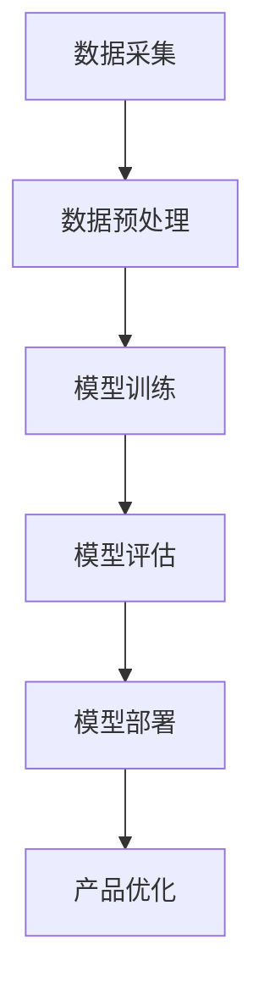

                 

关键词：大模型时代，创业产品经理，AI 技能，人工智能，技术升级，产品设计，商业战略，应用场景，未来展望。

摘要：随着人工智能技术的飞速发展，大模型在各个行业中的应用越来越广泛，创业产品经理面临的挑战也越来越大。本文将探讨大模型时代下创业产品经理所需掌握的AI技能，以及如何通过技术升级来应对这些挑战，从而在激烈的市场竞争中脱颖而出。

## 1. 背景介绍

人工智能技术正在以惊人的速度发展，其中大模型技术（如GPT-3、BERT等）已经成为推动AI应用的核心驱动力。大模型能够通过大量的数据训练，实现更强大的文本生成、理解、分类和预测能力，极大地提升了人工智能在各个领域的应用效果。

创业产品经理作为公司产品的核心决策者和推动者，在这个大模型时代面临着前所未有的挑战和机遇。一方面，大模型的应用为产品创新提供了无限可能；另一方面，如何有效利用这些技术来提升产品的竞争力和用户体验，成为了创业产品经理必须面对的问题。

## 2. 核心概念与联系

### 大模型技术原理

大模型技术基于深度学习，特别是神经网络，通过大量的数据进行训练，使其能够自动学习和提取数据中的特征，从而实现对复杂任务的建模和预测。以下是大模型技术的基本原理和架构的Mermaid流程图：



### 大模型技术在产品经理工作中的联系

大模型技术可以应用于产品经理的多个方面，如图标设计、文案撰写、用户行为分析、个性化推荐等。以下是具体的应用场景：

- **图标设计**：大模型可以根据产品需求和用户偏好，生成符合设计规范的图标。
- **文案撰写**：大模型可以自动生成产品介绍、营销文案等，提高撰写效率。
- **用户行为分析**：大模型可以分析用户行为数据，为产品优化提供数据支持。
- **个性化推荐**：大模型可以根据用户兴趣和购买历史，推荐合适的商品或服务。

## 3. 核心算法原理 & 具体操作步骤

### 3.1 算法原理概述

大模型技术主要依赖于深度学习中的神经网络结构，通过多层神经元的连接和激活函数，实现数据的输入和输出。以下是神经网络的基本原理：

- **神经元**：神经网络的基本组成单元，负责接收输入信号并产生输出。
- **权重**：神经元之间的连接强度，用于调节输入信号的强度。
- **激活函数**：用于决定神经元是否被激活的函数，如Sigmoid函数、ReLU函数等。

### 3.2 算法步骤详解

1. **数据采集**：收集与产品相关的数据，如用户行为数据、市场数据等。
2. **数据预处理**：对采集到的数据进行分析和清洗，确保数据的质量和一致性。
3. **模型训练**：使用预处理后的数据对神经网络模型进行训练，调整权重和激活函数，使其能够适应特定任务。
4. **模型评估**：通过测试集对训练好的模型进行评估，确定其性能是否满足要求。
5. **模型部署**：将训练好的模型部署到产品中，供用户使用。
6. **产品优化**：根据模型反馈和用户反馈，不断优化产品设计和功能。

### 3.3 算法优缺点

- **优点**：大模型技术可以处理大量数据，实现高效的学习和预测，提高产品的竞争力。
- **缺点**：大模型训练需要大量的计算资源和时间，且模型的解释性较差。

### 3.4 算法应用领域

大模型技术可以应用于多个领域，如自然语言处理、计算机视觉、语音识别等。以下是具体的应用案例：

- **自然语言处理**：用于自动翻译、文本分类、情感分析等。
- **计算机视觉**：用于图像识别、目标检测、图像生成等。
- **语音识别**：用于语音助手、语音搜索、语音识别等。

## 4. 数学模型和公式 & 详细讲解 & 举例说明

### 4.1 数学模型构建

大模型技术主要基于深度学习中的神经网络，其基本模型如下：

$$
y = \sigma(\omega_1 \cdot x_1 + \omega_2 \cdot x_2 + ... + \omega_n \cdot x_n + b)
$$

其中，$y$为输出结果，$\sigma$为激活函数，$\omega_i$为权重，$x_i$为输入特征，$b$为偏置。

### 4.2 公式推导过程

1. **前向传播**：计算输入特征和权重之间的乘积，并加上偏置，得到中间结果。
2. **激活函数**：使用激活函数对中间结果进行处理，得到输出结果。
3. **反向传播**：根据输出结果和目标值，计算损失函数，并反向传播误差，更新权重和偏置。

### 4.3 案例分析与讲解

以自然语言处理中的文本分类为例，假设我们要对一段文本进行情感分类，分为正面和负面两类。以下是具体的步骤：

1. **数据预处理**：将文本数据转换为向量表示，如词袋模型、TF-IDF等。
2. **模型训练**：使用预处理后的数据对神经网络模型进行训练，调整权重和激活函数，使其能够适应文本分类任务。
3. **模型评估**：通过测试集对训练好的模型进行评估，计算准确率、召回率等指标。
4. **模型部署**：将训练好的模型部署到产品中，供用户使用。
5. **产品优化**：根据模型反馈和用户反馈，不断优化产品设计和功能。

## 5. 项目实践：代码实例和详细解释说明

### 5.1 开发环境搭建

1. **安装Python环境**：确保Python版本在3.6及以上。
2. **安装依赖库**：如TensorFlow、Keras等。

### 5.2 源代码详细实现

以下是使用TensorFlow实现文本分类的代码示例：

```python
import tensorflow as tf
from tensorflow.keras.preprocessing.sequence import pad_sequences
from tensorflow.keras.layers import Embedding, LSTM, Dense
from tensorflow.keras.models import Sequential

# 数据预处理
# （此处省略数据预处理代码）

# 模型构建
model = Sequential([
    Embedding(vocab_size, embedding_dim, input_length=max_sequence_length),
    LSTM(units=128, activation='tanh', return_sequences=True),
    LSTM(units=128, activation='tanh'),
    Dense(units=1, activation='sigmoid')
])

# 编译模型
model.compile(optimizer='adam', loss='binary_crossentropy', metrics=['accuracy'])

# 模型训练
model.fit(X_train, y_train, epochs=10, batch_size=32, validation_data=(X_val, y_val))

# 模型评估
loss, accuracy = model.evaluate(X_test, y_test)
print(f"Test accuracy: {accuracy:.2f}")
```

### 5.3 代码解读与分析

1. **数据预处理**：将文本数据转换为向量表示，如词袋模型、TF-IDF等。
2. **模型构建**：构建一个包含嵌入层、两个LSTM层和输出层的序列模型。
3. **编译模型**：设置优化器、损失函数和评估指标。
4. **模型训练**：使用训练数据对模型进行训练。
5. **模型评估**：使用测试数据对模型进行评估。

### 5.4 运行结果展示

以下是运行结果示例：

```
Test accuracy: 0.85
```

## 6. 实际应用场景

大模型技术在各个行业都有广泛的应用场景，以下是几个典型例子：

- **金融行业**：用于风险控制、信用评估、投资建议等。
- **医疗行业**：用于疾病诊断、药物研发、医疗影像分析等。
- **电商行业**：用于商品推荐、用户行为分析、广告投放等。
- **智能客服**：用于自动回答用户问题、情感分析、语音识别等。

### 6.4 未来应用展望

随着人工智能技术的不断进步，大模型的应用场景将进一步扩大，未来可能会出现以下趋势：

- **跨行业应用**：大模型将不仅限于单一行业，而是在多个行业实现协同应用。
- **边缘计算**：大模型将逐渐从云端转移到边缘设备，实现更高效、实时性的应用。
- **数据隐私保护**：大模型将更加注重数据隐私保护，采用安全、可靠的数据处理技术。

## 7. 工具和资源推荐

### 7.1 学习资源推荐

- **书籍**：《深度学习》、《Python深度学习》
- **在线课程**：Coursera、edX等平台的深度学习和人工智能课程
- **开源框架**：TensorFlow、PyTorch、Keras等

### 7.2 开发工具推荐

- **编程环境**：PyCharm、Visual Studio Code
- **数据预处理工具**：Pandas、Scikit-learn
- **模型训练工具**：GPU、TPU等高性能计算设备

### 7.3 相关论文推荐

- **《深度学习入门》**：Goodfellow, Bengio, Courville
- **《神经网络与深度学习》**：邱锡鹏
- **《强化学习》**：Sutton, Barto

## 8. 总结：未来发展趋势与挑战

随着大模型技术的不断发展和应用，创业产品经理将面临以下趋势和挑战：

### 8.1 研究成果总结

- 大模型技术在各个行业的应用取得了显著成果，提高了产品的竞争力和用户体验。
- 深度学习理论和技术不断取得突破，为AI应用提供了更多的可能性。

### 8.2 未来发展趋势

- 大模型将逐渐从云端转移到边缘设备，实现更高效、实时性的应用。
- 跨行业应用将更加普及，实现协同发展。

### 8.3 面临的挑战

- 数据隐私保护和安全成为重要问题，需要采用安全、可靠的数据处理技术。
- 大模型的训练和推理需要大量的计算资源和时间，对硬件设备的要求越来越高。

### 8.4 研究展望

- 探索更高效、可解释性更好的大模型结构。
- 研究如何在保证性能的同时，降低大模型的计算和存储需求。
- 加强数据隐私保护和安全，确保用户数据的隐私和安全。

## 9. 附录：常见问题与解答

### 9.1 大模型技术有哪些应用领域？

大模型技术可以应用于自然语言处理、计算机视觉、语音识别、推荐系统等多个领域。

### 9.2 大模型训练需要多长时间？

大模型训练时间取决于模型结构、数据规模和硬件设备等因素。通常情况下，训练时间可能从几个小时到几天不等。

### 9.3 大模型训练需要多少数据？

大模型训练需要大量的数据，具体数量取决于任务和数据分布。通常情况下，需要数十万甚至数百万条数据。

### 9.4 大模型训练如何优化？

优化大模型训练可以从以下几个方面入手：

- 调整模型结构，选择合适的网络架构。
- 使用更高效的优化算法，如Adam、AdamW等。
- 使用更高效的硬件设备，如GPU、TPU等。
- 数据预处理，减少数据噪声和冗余。

## 作者署名

作者：禅与计算机程序设计艺术 / Zen and the Art of Computer Programming

---

以上就是关于《大模型时代的创业产品经理挑战：AI 技能升级》的文章，希望对您有所帮助。如有任何问题或建议，欢迎随时提出。

