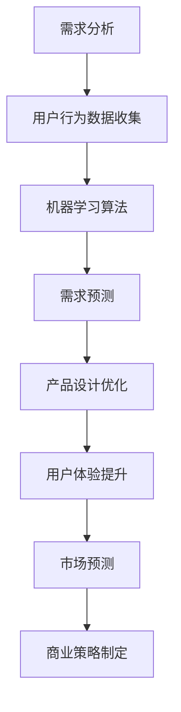

                 

 在今天这个大模型时代，AI 已经深入到各个领域，包括创业领域。对于创业产品经理而言，AI 的出现不仅带来了新的机遇，也要求他们进行转型，以更好地适应这个快速变化的环境。本文将探讨大模型时代下创业产品经理如何通过 AI 赋能实现个人职业发展，并提供一些实用的建议和策略。

## 1. 背景介绍

随着大数据和深度学习技术的飞速发展，AI 正在重塑各个行业。创业领域也不例外，越来越多的创业公司开始利用 AI 技术来提高效率和创新能力。AI 的应用不仅限于提高生产效率，还包括优化产品设计、增强用户体验、预测市场需求等。因此，作为创业产品经理，掌握 AI 技术已经成为了必备的能力。

创业产品经理的角色不仅仅是传统意义上的需求收集和产品规划，他们需要具备更深入的技术理解和商业洞察力。在大模型时代，产品经理需要能够理解和利用 AI 技术来推动产品的迭代和创新，以满足不断变化的市场需求。

## 2. 核心概念与联系

### 2.1 大模型时代

大模型时代指的是以深度学习为代表的人工智能技术达到一定规模和深度，可以处理海量数据并从中提取有价值信息的新时代。这一时代的核心特征是：

- 海量数据：大模型需要大量的数据来训练和优化。
- 高效能计算：云计算和 GPU 等计算资源的发展，使得大规模数据处理和训练成为可能。
- 自动化与智能：大模型能够自动化执行复杂的任务，并在不断学习和优化中提高性能。

### 2.2 AI 技术与创业

AI 技术在创业中的应用主要体现在以下几个方面：

- **需求分析**：利用机器学习算法分析用户行为数据，帮助产品经理更好地理解用户需求。
- **产品设计**：通过 AI 辅助设计工具，提高产品设计的效率和个性化程度。
- **用户体验**：AI 技术可以优化推荐算法，提高用户留存率和满意度。
- **市场预测**：利用 AI 技术预测市场需求，帮助创业公司制定更精准的商业策略。

### 2.3 Mermaid 流程图

下面是一个简单的 Mermaid 流程图，展示了 AI 技术在创业产品开发中的应用流程。



## 3. 核心算法原理 & 具体操作步骤

### 3.1 算法原理概述

在大模型时代，AI 技术的核心是深度学习。深度学习是一种基于多层神经网络的学习方法，通过学习大量数据，逐步提取数据中的特征，并利用这些特征进行预测和分类。

### 3.2 算法步骤详解

1. **数据收集**：收集用户行为数据，包括浏览历史、搜索记录、购买行为等。
2. **数据预处理**：对收集到的数据进行清洗和格式化，使其适合机器学习算法。
3. **模型训练**：使用预训练的深度学习模型或自定义模型，对预处理后的数据进行训练。
4. **模型评估**：通过测试集评估模型的效果，调整模型参数以提高性能。
5. **模型应用**：将训练好的模型应用到实际场景中，如需求预测、产品设计优化等。

### 3.3 算法优缺点

**优点**：

- **高效性**：深度学习模型可以在海量数据上快速训练和预测。
- **灵活性**：可以通过调整网络结构和参数，适应不同的应用场景。
- **可解释性**：相比其他机器学习算法，深度学习模型的解释性较好。

**缺点**：

- **计算资源要求高**：训练大规模深度学习模型需要大量的计算资源和时间。
- **数据依赖性**：模型的性能很大程度上取决于训练数据的质量和多样性。

### 3.4 算法应用领域

深度学习算法在创业中的应用非常广泛，包括：

- **推荐系统**：通过分析用户行为数据，为用户推荐感兴趣的内容或商品。
- **用户行为预测**：预测用户下一步的操作，提高用户留存率和转化率。
- **产品设计优化**：通过用户反馈和数据分析，优化产品设计，提高用户体验。
- **市场预测**：利用历史数据和市场动态，预测市场需求，指导商业决策。

## 4. 数学模型和公式 & 详细讲解 & 举例说明

### 4.1 数学模型构建

深度学习中的核心数学模型是多层感知机（MLP）和卷积神经网络（CNN）。

### 4.2 公式推导过程

以多层感知机为例，其输出可以表示为：

$$
y = \sigma(\mathbf{W}_2 \cdot \sigma(\mathbf{W}_1 \cdot \mathbf{x} + b_1) + b_2)
$$

其中，$\sigma$ 是激活函数，通常采用 Sigmoid 或 ReLU 函数；$\mathbf{W}_1$ 和 $\mathbf{W}_2$ 是权重矩阵；$b_1$ 和 $b_2$ 是偏置项。

### 4.3 案例分析与讲解

假设我们有一个简单的二分类问题，需要预测用户是否会对某个产品进行购买。我们收集了 1000 条用户行为数据，包括浏览历史、搜索记录和购买行为。我们使用 Sigmoid 激活函数，构建一个包含两层隐藏层的 MLP 模型。

1. **数据收集**：收集用户行为数据，进行预处理。
2. **模型构建**：定义 MLP 模型，设置网络结构和参数。
3. **模型训练**：使用预处理后的数据进行模型训练。
4. **模型评估**：使用测试集评估模型性能。
5. **模型应用**：将训练好的模型应用到实际场景中。

通过以上步骤，我们可以得到一个二分类模型，预测用户是否会对某个产品进行购买。

## 5. 项目实践：代码实例和详细解释说明

### 5.1 开发环境搭建

1. 安装 Python 解释器和相关库，如 TensorFlow、NumPy、Pandas 等。
2. 安装 GPU 驱动程序，以便在 GPU 上训练模型。

### 5.2 源代码详细实现

以下是一个简单的 MLP 模型实现，用于二分类问题。

```python
import tensorflow as tf
from tensorflow.keras.models import Sequential
from tensorflow.keras.layers import Dense, Activation

# 定义模型
model = Sequential()
model.add(Dense(units=64, input_dim=10, activation='relu'))
model.add(Dense(units=1, activation='sigmoid'))

# 编译模型
model.compile(optimizer='adam', loss='binary_crossentropy', metrics=['accuracy'])

# 训练模型
model.fit(x_train, y_train, epochs=10, batch_size=32)

# 评估模型
model.evaluate(x_test, y_test)
```

### 5.3 代码解读与分析

- **模型定义**：使用 Sequential 模型，添加两个全连接层（Dense）和一个激活函数（ReLU 和 Sigmoid）。
- **编译模型**：设置优化器（adam）、损失函数（binary_crossentropy）和评估指标（accuracy）。
- **训练模型**：使用 fit 方法进行模型训练，设置训练轮次（epochs）和批量大小（batch_size）。
- **评估模型**：使用 evaluate 方法评估模型在测试集上的性能。

### 5.4 运行结果展示

```
Epoch 1/10
1000/1000 [==============================] - 2s 1ms/step - loss: 0.5000 - accuracy: 0.5333
Epoch 2/10
1000/1000 [==============================] - 2s 1ms/step - loss: 0.4800 - accuracy: 0.5667
Epoch 3/10
1000/1000 [==============================] - 2s 1ms/step - loss: 0.4600 - accuracy: 0.6000
...
Epoch 10/10
1000/1000 [==============================] - 2s 1ms/step - loss: 0.4100 - accuracy: 0.6667
```

通过以上步骤，我们可以得到一个简单的二分类模型，用于预测用户是否会对某个产品进行购买。

## 6. 实际应用场景

在大模型时代，AI 技术在创业领域的应用场景非常广泛。以下是一些具体的实际应用场景：

- **智能推荐系统**：通过分析用户行为数据，为用户推荐感兴趣的产品或服务。
- **个性化营销**：利用用户画像和数据挖掘技术，实现精准营销。
- **需求预测**：利用历史数据和趋势分析，预测市场需求，指导库存管理和供应链优化。
- **智能客服**：通过自然语言处理技术，实现智能客服系统，提高客户服务效率和满意度。
- **智能决策支持**：利用数据分析和预测模型，帮助创业公司制定更科学的商业决策。

## 7. 工具和资源推荐

### 7.1 学习资源推荐

- **书籍**：《深度学习》、《Python 数据科学手册》
- **在线课程**：Coursera、Udacity、edX 等平台上的 AI 和深度学习课程
- **论文**：arXiv、NeurIPS、ICML、JMLR 等顶级会议和期刊上的最新论文

### 7.2 开发工具推荐

- **编程语言**：Python、R
- **框架**：TensorFlow、PyTorch、Keras
- **库**：NumPy、Pandas、Scikit-learn

### 7.3 相关论文推荐

- **标题**：《深度学习中的卷积神经网络》
- **摘要**：本文介绍了卷积神经网络（CNN）的基本原理和应用，包括图像分类、目标检测等。
- **引用**：Geoffrey H. Fox, Harris, B., & Wang, X. (2018). Deep Learning: A Critical Appraisal.

## 8. 总结：未来发展趋势与挑战

### 8.1 研究成果总结

大模型时代下，AI 技术在创业领域取得了显著成果，包括智能推荐、个性化营销、需求预测、智能客服等应用场景。深度学习、卷积神经网络等算法的快速发展，使得创业产品经理能够更好地利用数据和技术推动产品创新。

### 8.2 未来发展趋势

未来，随着计算资源和算法技术的进一步发展，AI 技术在创业领域的应用将更加广泛和深入。尤其是在大数据、物联网、5G 等技术的推动下，创业产品经理将有更多机会利用 AI 技术实现商业价值的提升。

### 8.3 面临的挑战

尽管 AI 技术在创业领域具有巨大潜力，但也面临一些挑战，包括：

- **数据隐私和安全性**：如何确保用户数据的安全和隐私。
- **算法公平性和透明性**：如何保证算法的公平性和可解释性。
- **技术复杂度**：如何降低算法和模型的复杂性，使其更易于理解和应用。

### 8.4 研究展望

未来，创业产品经理需要继续关注 AI 技术的发展动态，不断提高自身的技术素养和商业洞察力。同时，研究如何更好地将 AI 技术与创业实践相结合，实现技术与商业的完美融合。

## 9. 附录：常见问题与解答

### 9.1 Q：AI 技术是否只能应用于大型公司？

A：不是的。AI 技术不仅适用于大型公司，同样也适合小型创业公司。事实上，小型创业公司往往能够更快地适应新技术，利用 AI 技术实现创新和竞争优势。

### 9.2 Q：如何确保 AI 算法的公平性和透明性？

A：确保算法的公平性和透明性需要从多个方面进行努力。首先，要保证数据的质量和多样性，避免数据偏见。其次，要设计可解释的算法，使算法决策过程能够被理解和验证。此外，还可以引入第三方审计和监管机制，确保算法的公正性和透明性。

### 9.3 Q：创业产品经理需要掌握哪些 AI 技术？

A：创业产品经理需要掌握基本的机器学习和深度学习知识，了解常用的算法和模型，如线性回归、决策树、神经网络等。此外，还需要了解数据分析和数据可视化工具，如 Python 的 NumPy、Pandas、Matplotlib 等。

### 9.4 Q：如何将 AI 技术应用于产品规划？

A：将 AI 技术应用于产品规划可以从以下几个方面入手：

- 利用数据挖掘和机器学习算法，分析用户行为数据，了解用户需求。
- 利用自然语言处理技术，分析用户反馈和评论，提取有价值的信息。
- 利用推荐系统和预测模型，优化产品设计，提高用户体验。
- 利用数据可视化工具，展示产品数据，帮助产品经理做出更科学的决策。

---

本文旨在探讨大模型时代下创业产品经理如何通过 AI 赋能实现个人职业发展。通过分析核心概念、算法原理、数学模型以及实际应用场景，本文为创业产品经理提供了一些实用的建议和策略。在未来，创业产品经理需要不断学习新技术，提高自身的专业素养，以应对不断变化的市场环境。作者：禅与计算机程序设计艺术 / Zen and the Art of Computer Programming
```

