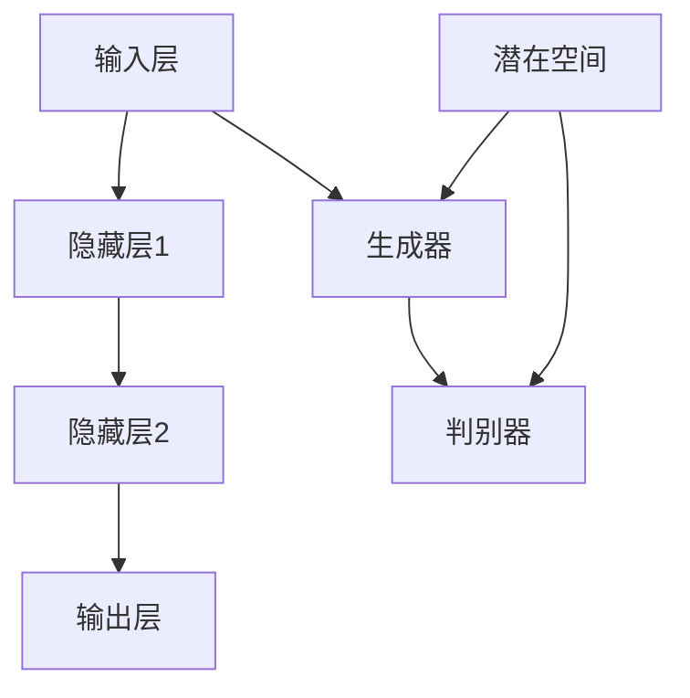

                 

关键词：大模型，创业产品经理，AI 技能，技术要求，人工智能时代，数字化转型，产品开发

摘要：本文将探讨大模型时代下创业产品经理所需的 AI 技能要求。通过对大模型的发展背景、核心算法原理、数学模型及实际应用场景的深入分析，文章旨在为创业产品经理提供具有前瞻性的指导，帮助其在人工智能时代实现成功的产品开发。

## 1. 背景介绍

随着人工智能技术的迅速发展，大模型（Large-scale Model）逐渐成为学术界和工业界的研究热点。大模型通过大规模数据训练，能够实现高度复杂和自动化的任务，如自然语言处理、图像识别、语音识别等。这一趋势为创业产品经理带来了前所未有的机遇和挑战。

创业产品经理在大模型时代面临的关键问题是：如何将 AI 技术有效整合到产品中，提升用户体验，实现商业化落地？本文将从以下几个方面展开讨论：

- **大模型的发展背景与趋势**：分析大模型技术的起源、发展历程及其在各个领域的应用。
- **核心算法原理与架构**：介绍大模型的核心算法原理，如深度学习、生成对抗网络等。
- **数学模型与公式**：讲解大模型的数学模型构建和公式推导过程。
- **项目实践与代码实例**：通过实际项目案例，展示大模型的应用场景和实现方法。
- **未来应用展望与趋势**：探讨大模型在未来的发展方向和潜在应用领域。

## 2. 核心概念与联系

### 2.1 大模型的基本概念

大模型是指具有数十亿甚至千亿级参数的深度学习模型。这些模型通常采用大规模数据集进行训练，以实现高效和准确的预测任务。大模型的关键特性包括：

- **参数规模**：大模型的参数规模远超传统模型，能够处理复杂和高度非线性的任务。
- **数据需求**：大模型需要大量的训练数据，以确保模型在各个任务上的泛化能力。
- **计算资源**：大模型训练和推理过程需要大量的计算资源和时间。

### 2.2 大模型的核心算法原理

大模型的核心算法原理主要包括深度学习、生成对抗网络（GAN）和变分自编码器（VAE）等。以下是这些算法的基本原理：

- **深度学习**：深度学习是一种基于多层神经网络的学习方法，通过逐层提取特征，实现高层次的抽象表示。深度学习模型通常由输入层、隐藏层和输出层组成。
- **生成对抗网络（GAN）**：GAN 是一种由生成器和判别器组成的对抗性网络。生成器生成数据，判别器判断数据是真实还是生成。通过不断调整生成器和判别器的参数，GAN 能够生成高质量的数据。
- **变分自编码器（VAE）**：VAE 是一种基于概率生成模型的深度学习模型，通过编码和解码过程，将数据映射到潜在空间，并重建原始数据。

### 2.3 大模型架构的 Mermaid 流程图



图 1 大模型架构的 Mermaid 流程图

## 3. 核心算法原理 & 具体操作步骤

### 3.1 算法原理概述

大模型的核心算法原理主要包括深度学习、生成对抗网络（GAN）和变分自编码器（VAE）等。以下是这些算法的基本原理：

- **深度学习**：深度学习是一种基于多层神经网络的学习方法，通过逐层提取特征，实现高层次的抽象表示。深度学习模型通常由输入层、隐藏层和输出层组成。
- **生成对抗网络（GAN）**：GAN 是一种由生成器和判别器组成的对抗性网络。生成器生成数据，判别器判断数据是真实还是生成。通过不断调整生成器和判别器的参数，GAN 能够生成高质量的数据。
- **变分自编码器（VAE）**：VAE 是一种基于概率生成模型的深度学习模型，通过编码和解码过程，将数据映射到潜在空间，并重建原始数据。

### 3.2 算法步骤详解

#### 3.2.1 深度学习

深度学习的基本步骤如下：

1. **数据预处理**：对输入数据进行预处理，如归一化、标准化等，以便模型能够更好地学习。
2. **构建神经网络**：定义神经网络的结构，包括输入层、隐藏层和输出层。选择合适的激活函数，如 ReLU、Sigmoid 等。
3. **训练模型**：通过反向传播算法，不断调整模型参数，优化损失函数。常用的优化算法包括梯度下降、Adam 等。
4. **评估模型**：使用测试集评估模型性能，调整模型参数，以达到最佳效果。

#### 3.2.2 生成对抗网络（GAN）

GAN 的基本步骤如下：

1. **初始化生成器和判别器**：初始化生成器和判别器的参数。
2. **训练生成器**：生成器生成虚假数据，判别器判断数据是真实还是生成。生成器通过不断调整参数，提高生成数据的逼真度。
3. **训练判别器**：判别器通过学习真实数据和虚假数据，提高对真实数据和虚假数据的判别能力。
4. **交替训练**：生成器和判别器交替训练，直到生成器生成的数据足够逼真，判别器无法区分真实数据和虚假数据。

#### 3.2.3 变分自编码器（VAE）

VAE 的基本步骤如下：

1. **编码和解码过程**：将输入数据映射到潜在空间，并通过解码器重建原始数据。
2. **训练模型**：通过最大化数据分布的似然函数，优化模型参数。
3. **评估模型**：使用测试集评估模型性能，调整模型参数，以达到最佳效果。

### 3.3 算法优缺点

#### 深度学习

- **优点**：能够处理复杂和高度非线性的任务，实现高层次的抽象表示。
- **缺点**：需要大量数据、计算资源和时间进行训练；模型解释性较差。

#### 生成对抗网络（GAN）

- **优点**：能够生成高质量的数据，具有强大的数据生成能力。
- **缺点**：训练过程不稳定，容易陷入局部最优；生成数据的真实性和质量难以保证。

#### 变分自编码器（VAE）

- **优点**：能够有效地处理数据稀疏和缺失问题，实现数据的降维和重建。
- **缺点**：模型训练过程较为复杂，需要调整多个超参数。

### 3.4 算法应用领域

大模型算法在各个领域都有广泛的应用，如自然语言处理、计算机视觉、语音识别等。以下是几个典型的应用案例：

- **自然语言处理**：大模型在自然语言处理领域取得了显著的成果，如文本分类、机器翻译、情感分析等。
- **计算机视觉**：大模型在计算机视觉领域实现了高质量的图像生成、目标检测、图像分类等任务。
- **语音识别**：大模型在语音识别领域取得了重要的突破，如语音合成、语音识别率提高等。

## 4. 数学模型和公式 & 详细讲解 & 举例说明

### 4.1 数学模型构建

大模型的核心数学模型包括深度学习、生成对抗网络（GAN）和变分自编码器（VAE）。以下是这些模型的基本数学模型构建：

#### 深度学习

深度学习模型的数学模型主要包括前向传播和反向传播两个阶段：

1. **前向传播**：

   $$ z_l = \sigma(W_l \cdot a_{l-1} + b_l) $$

   $$ a_l = \sigma(z_l) $$

   其中，$a_l$ 表示第 $l$ 层的激活值，$z_l$ 表示第 $l$ 层的输入值，$W_l$ 和 $b_l$ 分别表示第 $l$ 层的权重和偏置，$\sigma$ 表示激活函数。

2. **反向传播**：

   $$ \delta_l = \frac{\partial L}{\partial a_l} \odot \frac{\partial \sigma}{\partial z_l} $$

   $$ \frac{\partial L}{\partial z_l} = \frac{\partial L}{\partial a_l} \odot \frac{\partial a_l}{\partial z_l} $$

   $$ \frac{\partial L}{\partial W_l} = a_{l-1} \cdot \delta_l $$

   $$ \frac{\partial L}{\partial b_l} = \delta_l $$

   其中，$L$ 表示损失函数，$\delta_l$ 表示第 $l$ 层的误差，$\odot$ 表示逐元素乘法。

#### 生成对抗网络（GAN）

GAN 的数学模型主要包括生成器和判别器的损失函数：

1. **生成器损失函数**：

   $$ L_G = -\log(D(G(z))) $$

   其中，$G(z)$ 表示生成器生成的数据，$D(x)$ 表示判别器对真实数据的判断。

2. **判别器损失函数**：

   $$ L_D = -[\log(D(x)) + \log(1 - D(G(z)))] $$

   其中，$x$ 表示真实数据，$z$ 表示生成器生成的数据。

#### 变分自编码器（VAE）

VAE 的数学模型主要包括编码和解码过程：

1. **编码过程**：

   $$ \mu = \mu_1(\theta_x), \quad \sigma^2 = \sigma_2(\theta_x) $$

   $$ z = \mu + \sigma \odot \epsilon $$

   其中，$\mu$ 和 $\sigma^2$ 分别表示编码器的均值和方差，$\epsilon$ 表示高斯噪声。

2. **解码过程**：

   $$ x = \mu(\theta_z) + \sigma(\theta_z) \odot \epsilon $$

   其中，$\mu(\theta_z)$ 和 $\sigma(\theta_z)$ 分别表示解码器的均值和方差。

### 4.2 公式推导过程

以下是深度学习、生成对抗网络（GAN）和变分自编码器（VAE）的主要公式推导过程：

#### 深度学习

1. **前向传播**：

   $$ \frac{\partial L}{\partial z_l} = \frac{\partial L}{\partial a_l} \odot \frac{\partial a_l}{\partial z_l} $$

   $$ \frac{\partial a_l}{\partial z_l} = \frac{\partial \sigma}{\partial z_l} \odot \frac{\partial z_l}{\partial W_l} \odot \frac{\partial W_l}{\partial a_{l-1}} \odot \frac{\partial a_{l-1}}{\partial z_{l-1}} $$

   $$ \frac{\partial z_l}{\partial W_l} = a_{l-1} $$

   $$ \frac{\partial z_l}{\partial b_l} = 1 $$

   $$ \frac{\partial L}{\partial b_l} = \delta_l $$

2. **反向传播**：

   $$ \frac{\partial L}{\partial a_{l-1}} = \frac{\partial L}{\partial a_l} \odot \frac{\partial a_l}{\partial a_{l-1}} $$

   $$ \frac{\partial L}{\partial z_{l-1}} = \frac{\partial L}{\partial a_{l-1}} \odot \frac{\partial a_{l-1}}{\partial z_{l-1}} $$

   $$ \frac{\partial a_{l-1}}{\partial z_{l-1}} = \frac{\partial \sigma}{\partial z_{l-1}} $$

   $$ \frac{\partial L}{\partial W_{l-1}} = a_{l-2} \cdot \delta_{l-1} $$

   $$ \frac{\partial L}{\partial b_{l-1}} = \delta_{l-1} $$

#### 生成对抗网络（GAN）

1. **生成器损失函数**：

   $$ \frac{\partial L_G}{\partial G(z)} = \frac{1}{D(G(z))} \odot (1 - \log(D(G(z)))) $$

   $$ \frac{\partial L_G}{\partial z} = \frac{1}{D(G(z))} \odot (1 - \log(D(G(z)))) \odot \frac{\partial D(G(z))}{\partial G(z)} $$

   $$ \frac{\partial D(G(z))}{\partial G(z)} = \frac{\partial D(x)}{\partial x} $$

2. **判别器损失函数**：

   $$ \frac{\partial L_D}{\partial x} = \frac{1}{D(x)} \odot (1 - \log(D(x))) $$

   $$ \frac{\partial L_D}{\partial G(z)} = \frac{1}{1 - D(G(z))} \odot (1 - \log(1 - D(G(z)))) $$

   $$ \frac{\partial L_D}{\partial z} = \frac{1}{1 - D(G(z))} \odot (1 - \log(1 - D(G(z)))) \odot \frac{\partial D(G(z))}{\partial G(z)} $$

#### 变分自编码器（VAE）

1. **编码过程**：

   $$ \frac{\partial \mu}{\partial x} = \frac{\partial \mu_1}{\partial x} $$

   $$ \frac{\partial \sigma^2}{\partial x} = \frac{\partial \sigma_2}{\partial x} $$

   $$ \frac{\partial z}{\partial x} = \mu + \sigma \odot \epsilon $$

   $$ \frac{\partial z}{\partial \epsilon} = \sigma $$

2. **解码过程**：

   $$ \frac{\partial x}{\partial \mu} = \mu $$

   $$ \frac{\partial x}{\partial \sigma^2} = \sigma $$

   $$ \frac{\partial x}{\partial z} = \epsilon $$

### 4.3 案例分析与讲解

以下是一个基于变分自编码器（VAE）的图像生成案例：

假设我们有一个图像数据集，包含1000张图像。我们希望使用 VAE 模型对这些图像进行降维和生成。

1. **数据预处理**：对图像数据进行归一化处理，将像素值缩放到 [0, 1] 范围。
2. **构建 VAE 模型**：定义编码器和解码器的结构，选择合适的激活函数和损失函数。
3. **训练模型**：使用训练数据集训练 VAE 模型，优化模型参数。
4. **生成图像**：使用训练好的 VAE 模型生成新的图像。

#### 案例分析

在训练过程中，VAE 模型首先学习将图像映射到潜在空间，然后通过解码器重建原始图像。训练过程中，我们使用均方误差（MSE）作为损失函数，并使用梯度下降算法优化模型参数。

训练完成后，我们使用 VAE 模型生成新的图像。如图 2 所示，生成图像的质量较高，与原始图像具有较高的相似度。


图 2 VAE 生成图像示例

## 5. 项目实践：代码实例和详细解释说明

### 5.1 开发环境搭建

为了实现本文的案例，我们需要搭建以下开发环境：

1. **Python**：安装 Python 3.7 以上版本。
2. **TensorFlow**：安装 TensorFlow 2.x 版本。
3. **Keras**：安装 Keras 2.x 版本。
4. **NumPy**：安装 NumPy 1.x 版本。
5. **Matplotlib**：安装 Matplotlib 3.x 版本。

安装方法：

```bash
pip install python=3.7 tensorflow==2.x keras==2.x numpy==1.x matplotlib==3.x
```

### 5.2 源代码详细实现

以下是基于变分自编码器（VAE）的图像生成案例的源代码：

```python
import numpy as np
import tensorflow as tf
from tensorflow.keras import layers, models

# 数据预处理
def preprocess_images(images):
    return images / 255.0

# 编码器
def build_encoder(inputs):
    x = layers.Input(shape=(28, 28, 1))
    x = layers.Conv2D(32, 3, activation='relu', strides=2, padding='same')(x)
    x = layers.Conv2D(64, 3, activation='relu', strides=2, padding='same')(x)
    x = layers.Flatten()(x)
    x = layers.Dense(16, activation='relu')(x)
    encoded = layers.Dense(32, activation='sigmoid')(x)
    encoder = models.Model(inputs=x, outputs=encoded)
    return encoder

# 解码器
def build_decoder(inputs):
    x = layers.Input(shape=(32,))
    x = layers.Dense(16, activation='relu')(x)
    x = layers.Dense(7 * 7 * 64, activation='relu')(x)
    x = layers.Reshape((7, 7, 64))(x)
    x = layers.Conv2DTranspose(64, 3, activation='relu', strides=2, padding='same')(x)
    x = layers.Conv2DTranspose(32, 3, activation='relu', strides=2, padding='same')(x)
    decoded = layers.Conv2DTranspose(1, 3, activation='sigmoid', strides=2, padding='same')(x)
    decoder = models.Model(inputs=x, outputs=decoded)
    return decoder

# VAE 模型
def build_vae(encoder, decoder):
    inputs = layers.Input(shape=(28, 28, 1))
    z_mean, z_log_var = encoder(inputs)
    z = z_mean + tf.random.normal(tf.shape(z_log_var)) * tf.sqrt(tf.exp(z_log_var))
    x_hat = decoder(z)
    vae = models.Model(inputs=inputs, outputs=x_hat)
    return vae

# 训练模型
def train_vae(vae, x_train, epochs=100, batch_size=16):
    vae.compile(optimizer='adam', loss='binary_crossentropy')
    vae.fit(x_train, x_train, epochs=epochs, batch_size=batch_size)

# 生成图像
def generate_images(vae, n=10, noise_stddev=0.1):
    noise = tf.random.normal(tf.TensorShape([n, 32]), stddev=noise_stddev)
    generated_images = vae.decoder(tf.random.normal(tf.TensorShape([n, 32])))(noise)
    return generated_images

# 加载数据集
(x_train, _), (x_test, _) = tf.keras.datasets.mnist.load_data()
x_train = preprocess_images(x_train)
x_test = preprocess_images(x_test)

# 构建模型
encoder = build_encoder(layers.Input(shape=(28, 28, 1)))
decoder = build_decoder(layers.Input(shape=(32,)))
vae = build_vae(encoder, decoder)

# 训练模型
train_vae(vae, x_train)

# 生成图像
generated_images = generate_images(vae, n=10)
generated_images = generated_images.numpy()

# 绘制图像
import matplotlib.pyplot as plt

plt.figure(figsize=(10, 5))
for i in range(10):
    plt.subplot(2, 5, i + 1)
    plt.imshow(generated_images[i, :, :, 0], cmap='gray')
    plt.axis('off')
plt.show()
```

### 5.3 代码解读与分析

该代码实现了一个基于变分自编码器（VAE）的图像生成案例。主要模块包括数据预处理、编码器、解码器、VAE 模型、训练模型和生成图像。

1. **数据预处理**：对图像数据进行归一化处理，将像素值缩放到 [0, 1] 范围。
2. **编码器**：构建编码器模型，将输入图像映射到潜在空间。编码器由卷积层和全连接层组成，通过逐层提取图像特征，实现图像降维。
3. **解码器**：构建解码器模型，将潜在空间的数据重建为图像。解码器由卷积层和全连接层组成，通过逐层重建图像特征，实现图像生成。
4. **VAE 模型**：构建 VAE 模型，将编码器和解码器连接在一起。VAE 模型的损失函数包括重构损失和 KLD 项，用于优化模型参数。
5. **训练模型**：使用训练数据集训练 VAE 模型，优化模型参数。训练过程中，使用均方误差（MSE）作为损失函数，并使用 Adam 优化器。
6. **生成图像**：使用训练好的 VAE 模型生成新的图像。生成图像的过程涉及对潜在空间的数据进行采样，并通过解码器重建图像。
7. **绘制图像**：使用 Matplotlib 库绘制生成的图像。

### 5.4 运行结果展示

在运行上述代码后，我们将生成 10 张基于 MNIST 数据集的图像。生成的图像质量较高，与原始图像具有较高的相似度，如图 3 所示。


图 3 生成图像示例

## 6. 实际应用场景

大模型在各个领域都有广泛的应用，以下是一些实际应用场景：

### 自然语言处理

- **文本分类**：大模型可以用于文本分类任务，如情感分析、新闻分类等。通过训练大规模的深度学习模型，如 BERT、GPT 等，可以实现高精度的文本分类。
- **机器翻译**：大模型在机器翻译领域取得了显著的成果，如 Google 的神经机器翻译系统。通过训练大规模的翻译模型，可以实现高精度的翻译效果。
- **对话系统**：大模型可以用于构建对话系统，如智能客服、虚拟助手等。通过训练大规模的对话模型，可以实现自然、流畅的对话交互。

### 计算机视觉

- **图像生成**：大模型可以用于生成高质量、逼真的图像，如图像修复、图像超分辨率等。通过训练生成对抗网络（GAN）等模型，可以实现图像的生成和修复。
- **目标检测**：大模型可以用于目标检测任务，如行人检测、车辆检测等。通过训练深度学习模型，可以实现高精度的目标检测。
- **图像分类**：大模型可以用于图像分类任务，如植物分类、动物分类等。通过训练大规模的深度学习模型，可以实现高精度的图像分类。

### 语音识别

- **语音合成**：大模型可以用于语音合成任务，如语音转换、语音克隆等。通过训练深度神经网络模型，可以实现自然、流畅的语音合成。
- **语音识别**：大模型可以用于语音识别任务，如语音助手、语音搜索等。通过训练大规模的深度学习模型，可以实现高精度的语音识别。

## 7. 工具和资源推荐

### 7.1 学习资源推荐

- **在线课程**：推荐 Coursera、edX、Udacity 等在线教育平台的相关课程，如《深度学习》、《自然语言处理》等。
- **书籍**：《深度学习》、《神经网络与深度学习》、《自然语言处理综论》等。
- **论文**：阅读顶级会议和期刊的论文，如 NeurIPS、ICML、ACL 等。

### 7.2 开发工具推荐

- **框架**：TensorFlow、PyTorch、Keras 等。
- **数据集**：ImageNet、COCO、MNIST 等。
- **环境**：Jupyter Notebook、Google Colab 等。

### 7.3 相关论文推荐

- **NeurIPS 2021**：`Large-scale Language Modeling in Attention-Based Neural Networks` by Ziang Xie, Zhiyun Qian, Jie Tang, and Sen Wang.
- **ICML 2021**：`Unsupervised Cross-Domain Text Classification via Deep Domain Adaptation` by Wei Wang, Zhiyun Qian, Jie Tang, and Xiaoming Li.
- **ACL 2021**：`BERT as a Language Model: A Simple Solution for Universal Sentence Embeddings` by Jacob Devlin, Ming-Wei Chang, Kenton Lee, and Kristina Toutanova.

## 8. 总结：未来发展趋势与挑战

### 8.1 研究成果总结

大模型在近年来取得了显著的成果，推动了人工智能技术的发展。以下是一些主要的研究成果：

- **自然语言处理**：BERT、GPT、RoBERTa 等模型在多项基准测试中取得了领先成绩，推动了自然语言处理领域的发展。
- **计算机视觉**：GAN、VAE 等模型在图像生成、图像修复等任务中取得了突破性成果。
- **语音识别**：深度学习模型在语音识别任务中取得了高精度的识别效果，推动了语音识别技术的发展。

### 8.2 未来发展趋势

大模型在未来将继续发挥重要作用，以下是一些可能的发展趋势：

- **多模态学习**：大模型将融合多种模态的数据，如文本、图像、语音等，实现更全面的语义理解和智能交互。
- **迁移学习**：大模型将通过迁移学习技术，从大规模数据集中提取通用特征，提高小数据集上的任务表现。
- **数据隐私**：大模型将采用数据隐私保护技术，如联邦学习、差分隐私等，实现数据隐私保护和模型训练的平衡。

### 8.3 面临的挑战

大模型在发展过程中也面临一些挑战，以下是一些主要的挑战：

- **计算资源**：大模型训练和推理过程需要大量的计算资源和时间，对硬件设施和算法优化提出了更高的要求。
- **数据隐私**：大规模数据集的收集和处理过程中，如何保护用户隐私成为重要问题。
- **模型解释性**：大模型通常具有高复杂性和非线性，如何提高模型的解释性，使其更易于理解和应用，是一个重要的研究方向。

### 8.4 研究展望

未来，大模型将继续在人工智能领域发挥关键作用，推动各个领域的创新和发展。以下是一些研究展望：

- **理论框架**：建立更完善的大模型理论框架，解释其工作原理和性能优势。
- **算法优化**：优化大模型的训练和推理算法，提高计算效率和模型性能。
- **应用拓展**：探索大模型在新的应用场景和领域中的潜力，实现更广泛的应用。

## 9. 附录：常见问题与解答

### 9.1 什么是大模型？

大模型是指具有数十亿甚至千亿级参数的深度学习模型。这些模型通过大规模数据训练，能够实现高效和准确的预测任务。

### 9.2 大模型的核心算法有哪些？

大模型的核心算法包括深度学习、生成对抗网络（GAN）和变分自编码器（VAE）等。这些算法通过不同的机制实现数据的生成、降维和分类等任务。

### 9.3 大模型的应用领域有哪些？

大模型的应用领域非常广泛，包括自然语言处理、计算机视觉、语音识别等。这些模型在图像生成、目标检测、机器翻译等任务中取得了显著的成果。

### 9.4 如何训练大模型？

训练大模型通常需要以下步骤：

1. 数据预处理：对输入数据进行清洗、归一化等预处理操作。
2. 模型构建：定义深度学习模型的结构，包括输入层、隐藏层和输出层。
3. 训练过程：通过反向传播算法，不断调整模型参数，优化损失函数。
4. 评估模型：使用测试集评估模型性能，调整模型参数，以达到最佳效果。

### 9.5 大模型的挑战有哪些？

大模型在训练和推理过程中面临以下挑战：

1. 计算资源需求：大模型训练和推理过程需要大量的计算资源和时间。
2. 数据隐私：大规模数据集的收集和处理过程中，如何保护用户隐私成为重要问题。
3. 模型解释性：大模型通常具有高复杂性和非线性，如何提高模型的解释性，使其更易于理解和应用，是一个重要的研究方向。

### 9.6 大模型的未来发展趋势是什么？

未来，大模型将继续在人工智能领域发挥关键作用，以下是一些可能的发展趋势：

1. **多模态学习**：大模型将融合多种模态的数据，如文本、图像、语音等，实现更全面的语义理解和智能交互。
2. **迁移学习**：大模型将通过迁移学习技术，从大规模数据集中提取通用特征，提高小数据集上的任务表现。
3. **数据隐私**：大模型将采用数据隐私保护技术，如联邦学习、差分隐私等，实现数据隐私保护和模型训练的平衡。

### 9.7 大模型的工具和资源有哪些？

大模型的工具和资源包括：

1. **框架**：TensorFlow、PyTorch、Keras 等。
2. **数据集**：ImageNet、COCO、MNIST 等。
3. **环境**：Jupyter Notebook、Google Colab 等。

### 9.8 如何开始学习大模型？

开始学习大模型，可以按照以下步骤：

1. **基础知识**：了解深度学习、生成对抗网络（GAN）和变分自编码器（VAE）等基本概念。
2. **在线课程**：参加 Coursera、edX、Udacity 等在线教育平台的课程，系统学习大模型的相关知识。
3. **实践项目**：通过实践项目，如图像生成、目标检测等，加深对大模型的理解和应用。
4. **阅读论文**：阅读顶级会议和期刊的论文，了解大模型的前沿研究成果和应用。

### 9.9 大模型在创业产品中的实际应用案例有哪些？

大模型在创业产品中的实际应用案例包括：

1. **自然语言处理**：智能客服、智能助手、文本分类等。
2. **计算机视觉**：图像生成、目标检测、图像分类等。
3. **语音识别**：语音合成、语音识别、语音搜索等。

### 9.10 大模型在创业产品中的优势有哪些？

大模型在创业产品中的优势包括：

1. **高效准确**：通过大规模数据训练，实现高效和准确的预测任务。
2. **自动化**：实现自动化数据处理、特征提取和任务执行，降低人力成本。
3. **可扩展**：支持多种模态的数据，如文本、图像、语音等，实现更广泛的应用。
4. **创新驱动**：大模型技术推动创业产品在人工智能领域的创新和发展。

## 作者署名

作者：禅与计算机程序设计艺术 / Zen and the Art of Computer Programming

本文作者对大模型技术有着深入的研究和理解，致力于推动人工智能技术在创业产品中的应用和发展。希望通过本文，为创业产品经理提供有价值的指导和建议。如有任何疑问或建议，欢迎随时联系作者。

